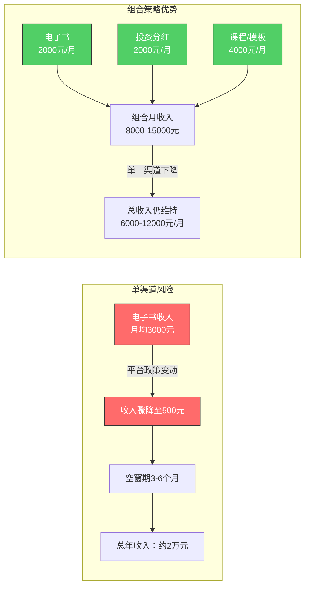
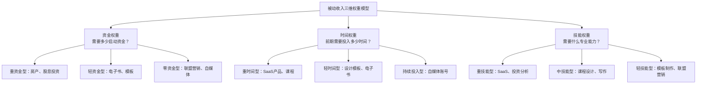
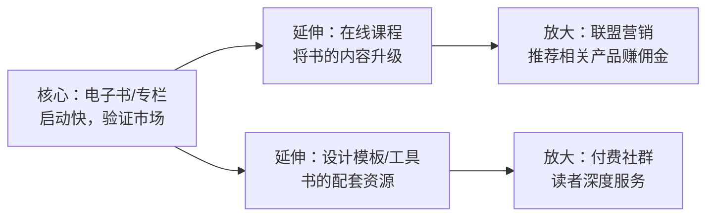
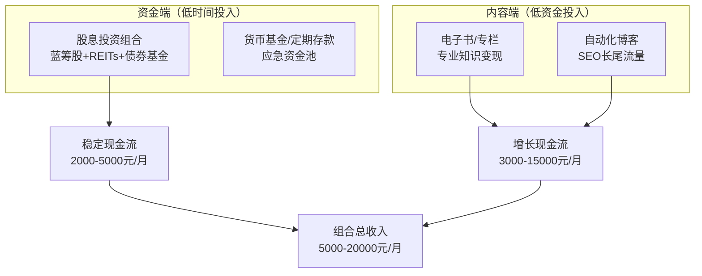
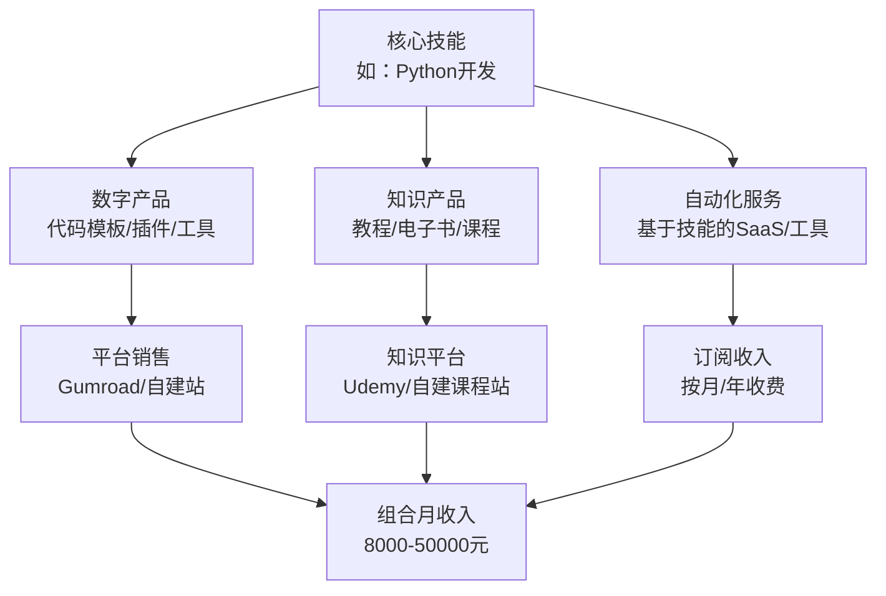
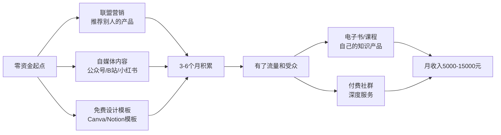
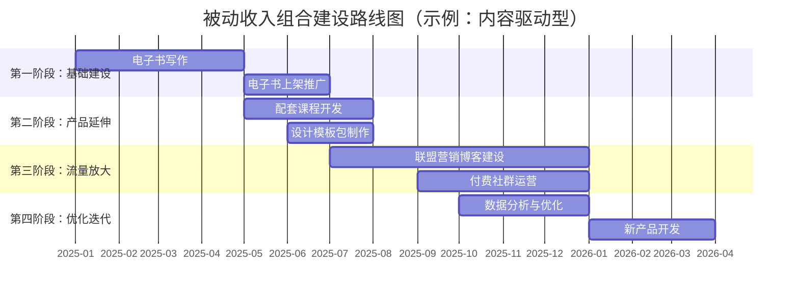
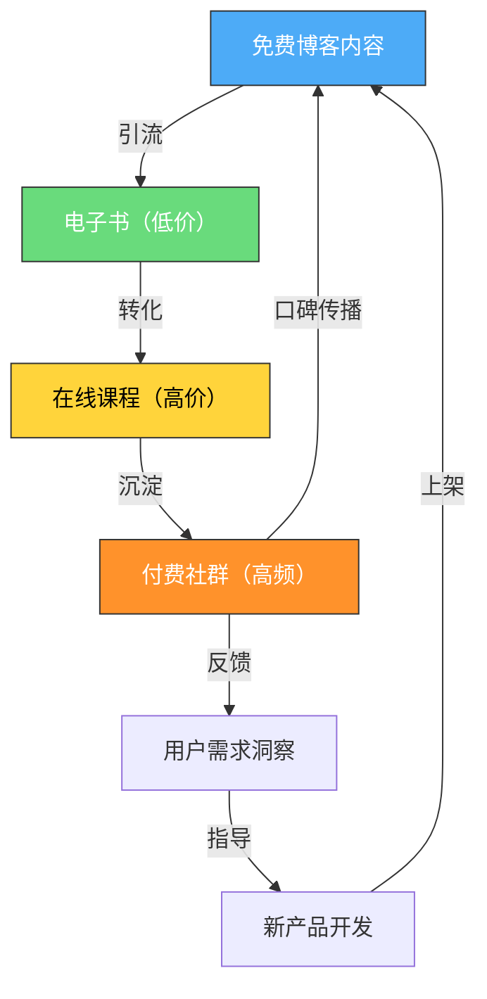

## 四、被动收入组合策略

### 为什么不能只靠一条腿走路

很多人的被动收入之路是这样的：花三个月写了一本电子书，上架后每月有两三千元收入，然后就觉得"搞定了"，不再拓展新的收入渠道。半年后平台算法调整，搜索排名下降，收入腰斩。这时候才开始慌，重新寻找下一个项目，又是一个三个月的空窗期。

这不是个例，而是单渠道被动收入的结构性风险。任何单一的被动收入来源，无论它多么稳健，都面临三个不可控变量：**平台政策变动、市场需求转移、技术迭代冲击**。微信公众号的流量主收益从2018年的千次阅读30-50元降到2024年的5-10元；淘宝客的佣金比例在过去五年平均下降了40%；很多曾经月入过万的知识付费课程，因为竞品涌入变成月入几百。

被动收入组合策略的核心思想来自现代投资组合理论（Modern Portfolio Theory，MPT），由诺贝尔经济学奖得主哈里·马科维茨（Harry Markowitz）于1952年提出。其核心观点是：**通过组合不同相关性的资产，可以在不降低预期收益的情况下降低整体风险，或者在同等风险水平下获得更高收益。** 这个原理同样适用于被动收入的构建。



---

### 组合策略的理论基础

#### 相关性：组合的灵魂

组合策略的关键不在于"收入来源越多越好"，而在于**收入来源之间的相关性越低越好**。如果你同时经营三个知识付费课程——写作课、演讲课、沟通课——它们的受众高度重叠，受同一个平台（如得到、知乎）的政策影响，本质上还是一个收入来源的三个变体。

相关性可以用一个简单的方法判断：**如果A收入来源出了问题，B收入来源有多大概率同时出问题？** 如果答案是"大概率"，说明两者相关性高；如果答案是"不太可能"，说明相关性低，组合价值高。

下表展示了常见被动收入类型之间的相关性矩阵：

| | 电子书/版税 | 在线课程 | 股息投资 | 房产租金 | 联盟营销 | SaaS产品 | 设计模板 |
|---|---|---|---|---|---|---|---|
| **电子书/版税** | 1.0 | 0.7 | 0.1 | 0.0 | 0.5 | 0.2 | 0.4 |
| **在线课程** | 0.7 | 1.0 | 0.1 | 0.0 | 0.6 | 0.2 | 0.3 |
| **股息投资** | 0.1 | 0.1 | 1.0 | 0.3 | 0.1 | 0.1 | 0.0 |
| **房产租金** | 0.0 | 0.0 | 0.3 | 1.0 | 0.0 | 0.0 | 0.0 |
| **联盟营销** | 0.5 | 0.6 | 0.1 | 0.0 | 1.0 | 0.3 | 0.3 |
| **SaaS产品** | 0.2 | 0.2 | 0.1 | 0.0 | 0.3 | 1.0 | 0.2 |
| **设计模板** | 0.4 | 0.3 | 0.0 | 0.0 | 0.3 | 0.2 | 1.0 |

**解读规则：**
- 0.0-0.3：低相关性，组合效果极佳（如股息投资 + 电子书）
- 0.3-0.5：中等相关性，可以组合但需注意风险分散
- 0.5-0.7：高相关性，组合效果有限（如电子书 + 在线课程）
- 0.7以上：高度相关，不建议作为独立的组合元素

#### 被动收入的三维权重模型

不同于金融投资只关注"收益-风险"两个维度，被动收入的组合需要考虑三个维度：



组合时的原则是：**不要同时启动多个在同一维度上都属于"重型"的项目。** 比如同时启动SaaS产品（重资金+重时间+重技能）和房产投资（重资金+中时间+中技能）会耗尽你的资源。更合理的做法是：SaaS产品（重资金+重时间+重技能）搭配电子书（轻资金+轻时间+中技能），或者房产投资（重资金）搭配设计模板（轻资金+轻时间）。

---

### 六种经典组合模型

根据不同的起点条件和目标，以下是经过验证的六种被动收入组合模型。每种模型都标注了适用人群、启动资金、时间投入、预期回报和建设周期。

#### 模型一：内容驱动型组合

**适用人群：** 有专业知识或写作能力的人，启动资金有限



**具体组合方案：**

| 收入来源 | 启动资金 | 前期时间 | 月收入预期 | 建设周期 | 被动程度 |
|---------|---------|---------|-----------|---------|---------|
| 电子书（2-3本） | 0-2000元 | 3-6个月 | 2000-8000元 | 1-6月 | ★★★★☆ |
| 配套课程 | 1000-5000元 | 1-3个月 | 3000-15000元 | 4-9月 | ★★★☆☆ |
| 设计模板/工具包 | 0-1000元 | 1-2个月 | 1000-5000元 | 2-8月 | ★★★★★ |
| 联盟营销（博客/公众号） | 500-3000元 | 3-6个月 | 1000-8000元 | 6-12月 | ★★★☆☆ |
| 付费社群 | 0-1000元 | 1-2个月 | 2000-10000元 | 6-12月 | ★★☆☆☆ |

**组合逻辑：** 电子书是"入口产品"，成本低、见效快，用来验证市场需求和积累第一批读者。课程是"利润产品"，定价可以是电子书的5-10倍，复用电子书的核心内容但增加视频讲解、作业批改、案例拆解等增值层。模板和工具包是"长尾产品"，开发一次后几乎零维护成本。联盟营销和社群是"放大器"，利用已有的读者基础推荐相关产品或提供深度服务。

**关键成功因素：**
- 电子书的质量决定了后续所有延伸产品的天花板。如果电子书本身卖不动，延伸产品大概率也不行
- 课程和电子书的内容重叠度要控制在40%-60%——太低会让读者觉得"被骗了"（明明是同一套东西），太高会让读者觉得"课程没有增量价值"
- 联盟营销要推荐你真正使用过的产品，否则会损害信任。信任一旦崩塌，整个组合都会受影响

**月收入构成示例（建设12个月后）：**

```text
电子书（3本）         4,500元/月
配套视频课程（1门）    8,000元/月
设计模板包（5套）      2,500元/月
联盟营销佣金           3,000元/月
付费社群（200人×50元） 10,000元/月
─────────────────────────────
合计                   28,000元/月
```

#### 模型二：投资+内容混合型组合

**适用人群：** 有一定资金积累（10万+），同时愿意投入时间构建内容资产



**具体组合方案：**

| 收入来源 | 启动资金 | 前期时间 | 月收入预期 | 建设周期 | 被动程度 |
|---------|---------|---------|-----------|---------|---------|
| 股息投资组合（20万本金） | 20万元 | 每月2-4小时 | 1500-3000元 | 持续积累 | ★★★★★ |
| REITs（房地产信托） | 5万元 | 每月1小时 | 300-800元 | 持续积累 | ★★★★★ |
| 电子书/专栏 | 0-2000元 | 3-6个月 | 2000-8000元 | 1-6月 | ★★★★☆ |
| 自动化博客 | 2000-5000元 | 6-12个月 | 2000-10000元 | 6-18月 | ★★★★☆ |

**组合逻辑：** 投资端提供"底层现金流"——即使你什么都不做，每月也有几千元的股息和分红入账，这是安全感的基础。内容端提供"增长潜力"——收入上限远高于投资端，但需要前期投入时间和精力。两者互补：投资端在内容端还没起来时提供收入保障，内容端在投资端遇到市场下行时提供对冲。

**股息投资组合构建建议：**

| 资产类别 | 配置比例 | 代表标的 | 预期年化 | 特点 |
|---------|---------|---------|---------|------|
| 高股息蓝筹股 | 40% | 银行股、电力股、高速公路 | 4%-7% | 稳定，波动小 |
| 红利指数基金 | 25% | 中证红利ETF、上证红利ETF | 3%-6% | 分散，省心 |
| REITs | 15% | 公募REITs（产业园、高速公路） | 4%-8% | 与股市低相关 |
| 债券基金 | 15% | 纯债基金、可转债基金 | 3%-5% | 稳定器作用 |
| 现金/货币基金 | 5% | 余额宝、银行理财 | 1.5%-2.5% | 应急和抄底资金 |

**注意事项：**
- 股息收入不是真正的"零维护"——至少每季度检查一次持仓，每年做一次再平衡
- A股的股息率整体低于美股，但波动也相对较小。如果有港美股渠道，可以考虑全球配置
- 投资端的收入增长缓慢（主要靠本金积累和复利），不要指望投资端能快速覆盖生活开支

#### 模型三：技能产品化组合

**适用人群：** 有一项过硬的专业技能（编程、设计、写作、翻译等）



**具体组合方案（以Python开发为例）：**

| 收入来源 | 启动资金 | 前期时间 | 月收入预期 | 建设周期 | 被动程度 |
|---------|---------|---------|-----------|---------|---------|
| 开源工具+赞助 | 0元 | 3-6个月 | 500-3000元 | 3-12月 | ★★★☆☆ |
| 代码模板/脚本包 | 0元 | 1-3个月 | 1000-5000元 | 1-4月 | ★★★★★ |
| 技术电子书 | 0-1000元 | 2-4个月 | 2000-8000元 | 2-6月 | ★★★★☆ |
| 录播课程 | 1000-5000元 | 2-4个月 | 3000-20000元 | 4-8月 | ★★★☆☆ |
| 小型SaaS工具 | 3000-20000元 | 3-12个月 | 5000-50000元 | 6-18月 | ★★☆☆☆ |

**组合逻辑：** 代码模板是最容易起步的——把工作中写过的通用模块打包出售，边际成本几乎为零。电子书和课程复用你的专业知识和实战经验。小型SaaS工具是"终局产品"，一旦跑通，收入天花板最高，但开发和维护成本也最高。

**实际案例拆解——独立开发者Alex的组合收入（第18个月）：**

```text
GitHub Sponsors（3个开源项目）    2,800元/月
代码模板包（Gumroad，12个产品）    6,500元/月
技术电子书《Python自动化实战》     4,200元/月
Udemy录播课程（2门）              11,000元/月
小型SaaS工具（月活200用户×49元）   9,800元/月
──────────────────────────────────
合计                              34,300元/月
总前期投入：约8个月全职时间 + 1.5万元资金
```

#### 模型四：房产+数字资产组合

**适用人群：** 有较大资金量（50万+），同时愿意学习数字资产构建

这是传统被动收入（房产）和新型被动收入（数字资产）的组合，两者相关性极低——房产受宏观经济和本地市场影响，数字资产受互联网流量和技术变化影响，几乎不会同步波动。

| 收入来源 | 启动资金 | 前期时间 | 月收入预期 | 建设周期 | 被动程度 |
|---------|---------|---------|-----------|---------|---------|
| 出租房产（1-2套） | 30-100万 | 购房流程1-3月 | 3000-8000元 | 1-3月 | ★★★★☆ |
| 房产增值（长期） | （同上） | — | 年化5%-10% | 3-10年 | ★★★★★ |
| 自媒体账号 | 0元 | 6-12个月 | 2000-10000元 | 6-18月 | ★★★☆☆ |
| 知识付费产品 | 0-5000元 | 2-4个月 | 2000-8000元 | 4-8月 | ★★★★☆ |

**房产租金被动化的关键操作：**
- 委托给长租公寓运营商（如自如、泊寓），虽然租金会打8-9折，但省去了招租、维修、催租的麻烦
- 安装智能门锁、智能水电表，减少上门管理的频率
- 在合同中明确维修责任划分——500元以下租客自理，500元以上房东承担，减少扯皮
- 每年续签时根据市场行情调整租金，不要签太长的固定租期

#### 模型五：零资金起步型组合

**适用人群：** 资金有限但时间充裕的学生、职场新人

这是唯一一个真正"零启动资金"的组合模型，但代价是需要更多的时间投入和更长的建设周期。



**时间分配建议（每天2-3小时）：**

| 时间段 | 活动 | 目的 |
|-------|------|------|
| 第1-2小时 | 内容创作（文章/视频/模板） | 积累流量和受众 |
| 第30分钟 | 社群互动和回复 | 建立信任和粘性 |
| 第30分钟 | 数据分析和优化 | 提升转化率 |

**联盟营销平台选择（零资金可入门）：**

| 平台 | 佣金比例 | 结算周期 | 门槛 | 适合推荐的产品类型 |
|------|---------|---------|------|------------------|
| 淘宝联盟 | 1%-50% | 月结 | 实名认证 | 实物商品 |
| 京东联盟 | 0.5%-30% | 月结 | 实名认证 | 实物商品 |
| 拼多多多多进宝 | 5%-50% | 周结 | 无门槛 | 实物商品 |
| 知乎好物推荐 | 1%-30% | 月结 | 创作者等级 | 知识产品+实物 |
| Gumroad联盟 | 10%-50% | 即时 | 注册即用 | 数字产品 |

#### 模型六：全栈自动化型组合

**适用人群：** 有技术能力，追求高度自动化的被动收入体系

这是技术背景人群的终极组合模型，目标是让所有收入来源都实现高度自动化，将日常维护时间压缩到每周2-4小时。

| 收入来源 | 启动资金 | 前期时间 | 月收入预期 | 建设周期 | 被动程度 |
|---------|---------|---------|-----------|---------|---------|
| 自动化内容站（SEO博客群） | 5000-20000元 | 6-12个月 | 5000-30000元 | 6-18月 | ★★★★★ |
| SaaS产品（订阅制） | 10000-50000元 | 6-18个月 | 10000-100000元 | 12-24月 | ★★★★☆ |
| 自动化电商（代发货/POD） | 3000-10000元 | 2-4个月 | 3000-20000元 | 3-6月 | ★★★★☆ |
| 股息投资组合 | 10万+ | 持续 | 1000-3000元 | 持续 | ★★★★★ |

**自动化技术栈：**

```text
内容自动化：WordPress + WP All Import + AI辅助写作 + 自动发布
SEO自动化：Ahrefs/SEMrush 监控 + 自动内链插件 + 排名追踪
邮件自动化：ConvertKit/Mailchimp + 自动化序列 + 标签分组
客服自动化：ChatGPT API + 知识库 + 自动回复模板
分析自动化：Google Analytics + 自动报表 + 异常告警
投资自动化：定投计划 + 自动再平衡 + 股息再投资（DRIP）
```

---

### 组合策略的实施框架

#### 第一步：评估你的起点资源

在选择组合模型之前，先做一次诚实的自我评估。以下是一个实用的评估模板：

```markdown
## 个人被动收入起点评估

### 资金维度
- 可投入资金：_____元（扣除6个月生活费后的闲置资金）
- 风险承受能力：保守 / 稳健 / 积极
- 资金时间要求：何时需要回本？_____

### 时间维度
- 每周可投入时间：_____小时
- 时间段分布：工作日晚上___小时，周末___小时
- 持续性评估：这个时间投入能坚持多久？_____

### 技能维度
- 核心专业技能：_____
- 内容创作能力：强 / 中 / 弱
- 技术能力（编程/建站）：强 / 中 / 弱
- 营销推广能力：强 / 中 / 弱
- 投资分析能力：强 / 中 / 弱

### 资源维度
- 现有受众/粉丝数：_____
- 行业人脉资源：丰富 / 一般 / 较少
- 可复用的过往作品/经验：_____
```

#### 第二步：选择组合模型并制定路线图

根据评估结果，选择最匹配的组合模型，然后制定分阶段的实施路线图。核心原则是：**不要同时启动超过2个项目，先让第一个项目产生稳定收入后再启动第二个。**



**分阶段启动的理由：**

1. **精力有限：** 同时做5件事，每件事投入20%精力，不如集中100%精力先做好一件事
2. **验证优先：** 第一个项目的结果会验证你的假设——市场需求是否存在、你的能力是否匹配、你的执行力是否足够
3. **现金流递进：** 第一个项目的收入可以为第二个项目提供资金支持（比如用电子书的收入购买课程录屏设备）
4. **经验复用：** 第一个项目积累的推广渠道、用户画像、内容素材可以直接用于第二个项目

#### 第三步：建立组合管理看板

当你有2个以上的被动收入来源时，需要一个系统化的管理工具来跟踪每个项目的状态。以下是一个推荐的管理框架：

| 收入来源 | 本月收入 | 上月收入 | 环比变化 | 状态 | 下月重点动作 |
|---------|---------|---------|---------|------|------------|
| 电子书A | 3200元 | 2800元 | +14.3% | 稳定增长 | 更新关键词优化 |
| 在线课程B | 8500元 | 9200元 | -7.6% | 需关注 | 更新课程内容+老学员促销 |
| 联盟营销 | 2100元 | 1800元 | +16.7% | 快速增长 | 扩大内容产出频率 |
| 股息投资 | 1500元 | 1480元 | +1.4% | 稳定 | 季度再平衡 |
| **合计** | **15300元** | **15280元** | **+0.1%** | — | — |

**需要关注的预警信号：**
- 单一收入来源占比超过总收入的60%——过度集中，需要加速新项目
- 连续两个月环比下降超过10%——需要深入分析原因并制定应对方案
- 某个项目投入产出比持续低于预期——考虑优化或止损
- 所有项目同时下降——检查是否有宏观因素影响，调整预期

---

### 组合策略的常见错误

#### 错误一：过度分散——同时启动5个以上项目

**症状：** 每个项目都投入一点精力，每个项目都处于"半成品"状态。三个月后没有一个项目产生收入。

**纠正方法：** 遵循"1-2-3"法则——同一时间最多维护1个成熟项目、建设2个进行中项目、规划3个未来项目。当新项目还没产生收入时，不要启动下一个。

**反面案例：** 小王同时开了一个公众号、一个B站账号、一个小红书账号，还开始写一本电子书，同时在研究股票投资。每天2小时分给5个项目，每个项目只有24分钟。三个月后，公众号粉丝200、B站播放量个位数、小红书笔记没人看、电子书写了3章就搁置了、股票亏了2000块。

**正面案例：** 小李先集中精力写了一本电子书，花了4个月。上架后第一个月卖了50本，确认了市场需求。然后用2个月把书的内容扩展成一门课程。课程稳定后，再花3个月建了一个配套的联盟营销博客。每个阶段都只专注一件事。

#### 错误二：忽视相关性——看似多样实则同质

**症状：** 有三个收入来源——公众号广告、知乎付费回答、头条号收益。看似三个渠道，但都依赖"文字内容创作+平台流量分配"这个单一模式，一旦平台算法调整或内容生态变化，三个渠道同时受影响。

**纠正方法：** 用前面的相关性矩阵检查你的组合。至少要有一个收入来源与其他来源的相关性低于0.3。

#### 错误三：重建设轻维护——建完就不管了

**症状：** 电子书写完上架后再也不更新，课程录完后再也不迭代，博客写了一年后内容过时。收入从第一个月的峰值逐月递减。

**纠正方法：** 为每个收入来源设定固定的"维护日"——比如每月第一个周六检查所有项目的数据、更新过时内容、回复用户反馈。维护时间应该占总投入时间的20%-30%。

**维护清单模板：**

```markdown
## 月度维护清单

### 电子书
- [ ] 检查销售数据和评论
- [ ] 更新过时的信息和链接
- [ ] 优化关键词和描述
- [ ] 回复读者提问

### 在线课程
- [ ] 检查完课率和评分
- [ ] 更新录屏中的软件版本变化
- [ ] 补充新的案例和练习
- [ ] 处理学员反馈

### 联盟营销/博客
- [ ] 检查流量和转化数据
- [ ] 更新失效的联盟链接
- [ ] 发布1-2篇新内容
- [ ] 优化低排名页面的SEO

### 投资组合
- [ ] 检查持仓收益
- [ ] 评估是否需要再平衡
- [ ] 查看分红到账情况
- [ ] 关注持仓公司的基本面变化
```

#### 错误四：追求"完全被动"——忽视必要的主动维护

**症状：** 因为追求100%被动，拒绝做任何维护工作，导致收入持续衰减。最终"被动收入"变成了"没有收入"。

**真相是：** 真正的被动收入不是零维护，而是维护投入远低于主动收入的时间投入。一个健康的被动收入组合，每周需要2-5小时的维护时间，而产生的收入可能相当于每周20-40小时主动工作的水平。**这才是被动收入的真正含义——不是不工作，而是工作的杠杆率极高。**

#### 错误五：忽视退出策略

**症状：** 某个收入来源已经明显走下坡路，但因为"已经投入了这么多时间"而不愿意放弃，继续投入时间和精力维护一个不断贬值的资产。

**纠正方法：** 为每个项目设定明确的"止损线"——比如连续3个月收入低于维护成本的2倍，就启动退出流程。退出不等于失败，而是释放资源去投入到更有潜力的项目。

---

### 组合策略的进阶玩法

#### 玩法一：收入来源之间的协同效应

当你的组合成熟后，不同收入来源之间可以产生"1+1>2"的协同效应。这不是简单地把多个来源加在一起，而是让它们互相促进。

**协同效应的三种模式：**

1. **流量协同：** 电子书的读者 → 购买课程 → 加入社群 → 购买更多电子书。每新增一个收入来源，都在为其他来源输送流量。

2. **信任协同：** 免费的博客内容建立了专业形象 → 读者信任你的付费产品 → 付费产品的良好体验 → 读者愿意推荐给他人 → 更多免费流量。

3. **数据协同：** 从博客的流量数据中发现读者最关心的话题 → 据此开发新的电子书或课程 → 从课程的完课率数据中发现薄弱环节 → 据此优化博客内容的深度和方向。



#### 玩法二：杠杆已有资产扩展新收入

当你的组合中有1-2个成熟项目后，可以利用已有的资产（内容、受众、品牌、数据）低成本地启动新项目。

**具体操作：**
- 把电子书的核心章节改编成短视频脚本，在抖音/B站获取新流量
- 把课程中的问答环节整理成FAQ文档，作为联盟营销的SEO内容
- 把社群中高频出现的问题开发成新的迷你课程或工具包
- 把博客的高流量文章扩展成独立的电子书

**成本对比：**

| 新项目 | 从零开始成本 | 利用已有资产成本 | 节省比例 |
|-------|------------|----------------|---------|
| 新电子书 | 3-6个月 | 1-2个月 | 60%-70% |
| 新课程 | 2-4个月 | 1-2个月 | 50%-60% |
| 新平台内容 | 6-12个月 | 1-3个月 | 70%-80% |
| 联盟营销站 | 3-6个月 | 1-2个月 | 60%-70% |

#### 玩法三：用投资收益反哺内容资产

当投资端的收益稳定后，可以将一部分投资收益用于"加速"内容端的增长：
- 用股息收入购买付费推广（知乎盐选推广、公众号互推）
- 用投资收益雇佣兼职写手，扩大内容产出
- 用投资收益购买专业工具（SEO工具、设计工具、录屏工具）

这种模式的美妙之处在于：投资端越稳定，你能投入到内容端的"加速资金"就越多；内容端增长越快，你能投入到投资端的本金也越多。两者形成正循环。

---

### 组合策略的检查清单

在正式启动组合策略之前，用以下清单做最后的检查：

```markdown
## 被动收入组合策略启动检查清单

### 一、组合设计
- [ ] 已完成起点资源评估（资金/时间/技能/资源）
- [ ] 已选择适合的组合模型
- [ ] 组合中至少有2个来源的相关性低于0.3
- [ ] 三维权重（资金/时间/技能）分布合理，不集中在单一维度
- [ ] 制定了分阶段实施路线图（不超过2个项目同时启动）

### 二、第一个项目
- [ ] 已完成市场调研，确认需求存在
- [ ] 已完成SWOT-P评估，总分≥18
- [ ] 已制定MVP方案，可以快速验证
- [ ] 已设定止损线（何时放弃或转向）
- [ ] 已设定里程碑（何时启动第二个项目）

### 三、管理体系
- [ ] 建立了收入跟踪看板
- [ ] 设定了月度维护日程
- [ ] 设定了预警规则（单项目占比上限、连续下降阈值）
- [ ] 设定了退出规则（止损线、资源释放流程）

### 四、心理准备
- [ ] 理解被动收入需要前期大量主动投入
- [ ] 接受"第一年可能不赚钱"的现实
- [ ] 准备好至少6个月的生活费作为缓冲
- [ ] 有清晰的阶段性目标，而不是只盯着最终数字
```

---

### 本节核心要点回顾

1. **单渠道被动收入存在结构性风险**——平台政策、市场需求、技术迭代三个变量都不可控。组合策略通过分散化降低整体风险。

2. **组合的关键不是数量，而是相关性**——收入来源之间的相关性越低，组合的风险分散效果越好。至少要有一个与其他来源相关性低于0.3的收入来源。

3. **三维权重模型**（资金/时间/技能）决定了你能承受的组合类型——不要在同一维度上过度集中。

4. **六种经典组合模型**覆盖了从零资金到大资金、从纯内容到纯技术的全部起点条件——选择最匹配你现状的模型。

5. **分阶段实施**是成功的关键——同一时间最多启动2个项目，先让第一个产生稳定收入后再启动下一个。

6. **管理比建设更重要**——建立看板、设定维护日程、设定预警规则和退出规则。没有管理的组合会自然衰减。

7. **协同效应是组合的终极价值**——当不同收入来源之间能互相引流、互相信任、互相反哺时，组合的价值远超各部分之和。
