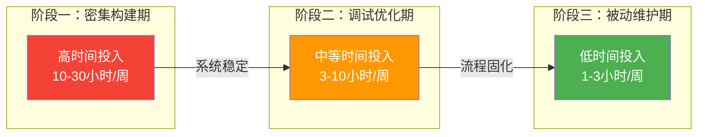
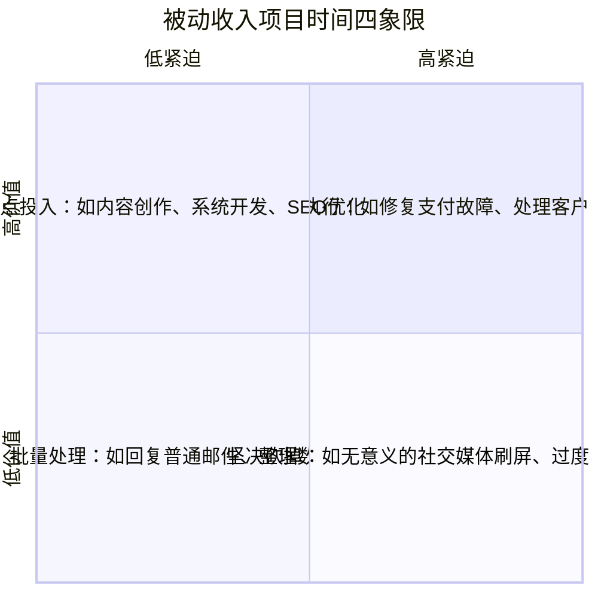
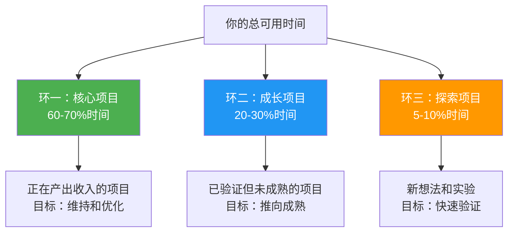
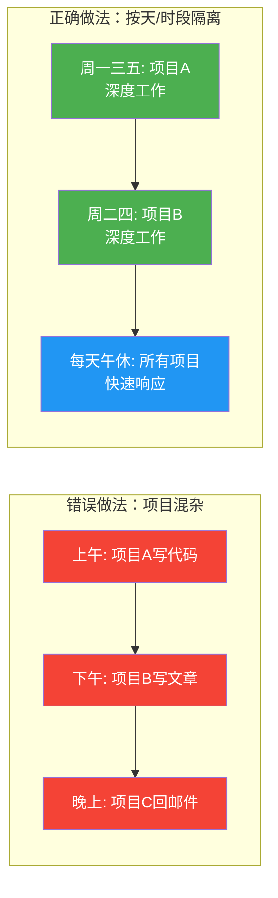
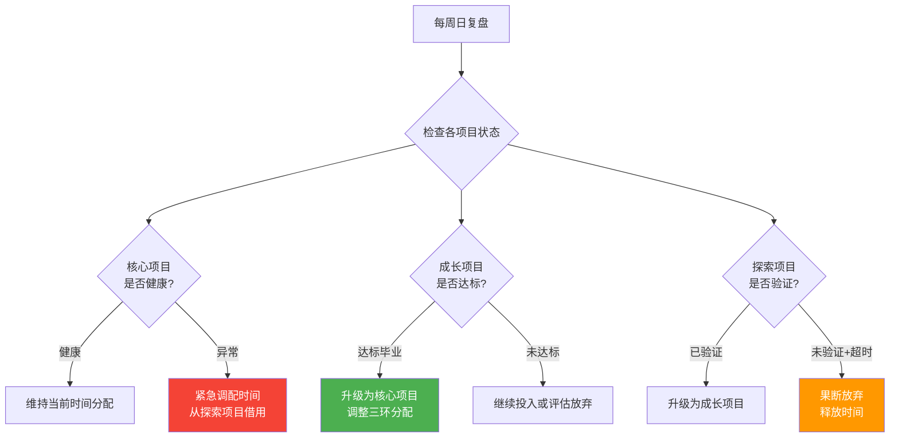
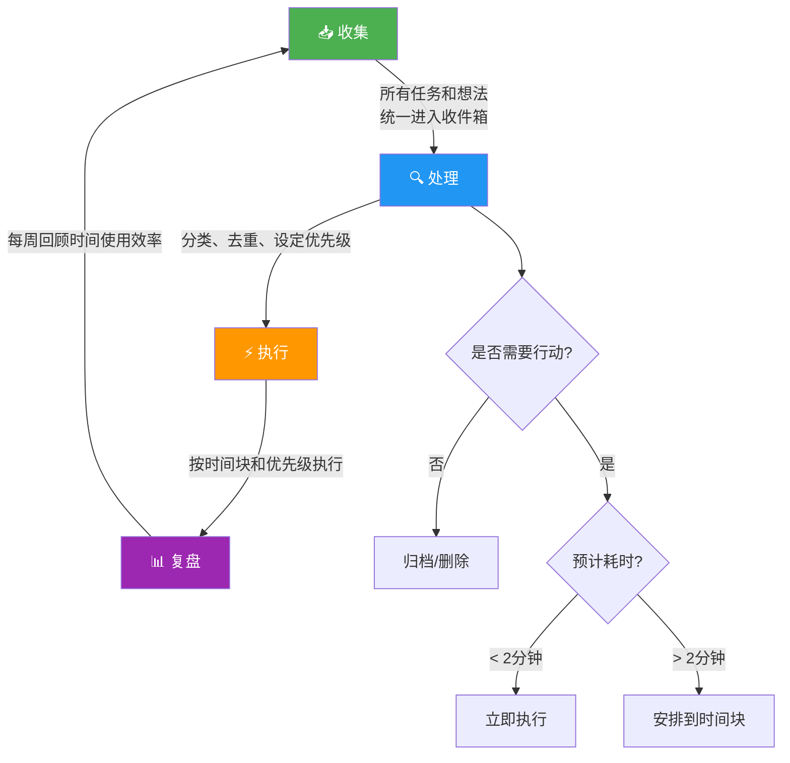

## 五、被动收入项目时间管理

被动收入的核心悖论在于：**它在运行阶段是"被动"的，但在构建阶段需要大量"主动"的时间投入**。多数被动收入项目的失败并非因为想法不好，而是因为构建者没有管理好有限的时间资源——要么在前期投入不足导致项目"烂尾"，要么在维护阶段投入过多导致失去被动属性，要么同时推进太多项目导致全部停滞。

本节系统讲解被动收入项目的时间管理方法论，从底层认知到实操工具，帮你用有限的时间构建可持续的被动收入系统。

---

### 1. 被动收入项目的时间本质

#### 1.1 时间投入的三阶段模型

被动收入项目的时间投入并非均匀分布，而是呈现明显的阶段性特征：



**关键认知：** 被动收入不是"不工作就有钱"，而是"前期用大量时间换后期的低维护"。理解这一点，才能正确看待构建期的时间投入。

#### 1.2 时间投入的价值转化链

每一小时的构建时间，理论上会产生一个持续产出价值的"资产单元"：

| 时间投入 | 转化产物 | 产出周期 | 被动程度 |
|----------|----------|----------|----------|
| 写一篇SEO文章 | 长期搜索流量 | 6-24个月 | ★★★★★ |
| 录制一套课程 | 持续课程销售 | 12-36个月 | ★★★★☆ |
| 开发一个小工具 | 持续用户付费 | 6-18个月 | ★★★★☆ |
| 搭建一个自动化流程 | 持续效率提升 | 持续 | ★★★★★ |
| 股息投资组合研究 | 持续分红 | 持续 | ★★★★★ |
| 社交媒体内容创作 | 粉丝与广告收入 | 3-12个月 | ★★☆☆☆ |

**核心原则：** 在构建阶段，优先投入那些"产出周期长、被动程度高"的任务。一篇能持续获取搜索流量2年的文章，其时间回报率远高于一条只能带来3天热度的社交媒体帖子。

#### 1.3 时间管理失败的五大模式

被动收入项目中，时间管理失败通常表现为以下模式：

| 失败模式 | 表现 | 根因 | 后果 |
|----------|------|------|------|
| **蜻蜓点水** | 同时开5个项目，每个浅尝辄止 | 精力分散，缺乏聚焦 | 无一产出 |
| **完美主义陷阱** | 一个产品打磨半年不发布 | 害怕不完美，过度优化 | 错过市场窗口 |
| **维护泥潭** | 项目上线后还在持续投入80%精力 | 系统没有自动化，依赖手工 | 名为被动实为主动 |
| **沉默成本绑定** | 明知项目不行，但因已投入时间而不愿放弃 | 不会止损 | 持续消耗时间 |
| **假忙碌** | 每天都在"忙"但产出为零 | 用战术勤奋掩盖战略懒惰 | 时间花了，收入没涨 |

**自检方法：** 每周回顾一次，问自己——"这周我在被动收入项目上花的时间，是否推动了项目向'被动维护期'前进？"如果答案是否，你可能陷入了上述某种模式。

---

### 2. 时间分配框架：四象限与三环模型

#### 2.1 被动收入项目时间四象限

将被动收入项目中的所有任务，按"价值贡献"和"紧迫程度"分为四个象限：



| 象限 | 任务特征 | 时间策略 | 典型任务 |
|------|----------|----------|----------|
| **Q1 高价值+高紧迫** | 直接影响收入或导致项目停滞 | 立即处理，限定时间 | 支付接口故障、SEO排名骤降、关键bug |
| **Q2 高价值+低紧迫** | 长期收益最大，但不急迫 | **每天固定时段，优先保障** | 内容创作、产品迭代、自动化建设、新渠道开拓 |
| **Q3 低价值+低紧迫** | 日常琐事 | 批量处理或外包 | 数据整理、非关键邮件、社交媒体回复 |
| **Q4 低价值+高紧迫** | 制造紧迫感但价值低 | 均衡拒绝或自动化 | 无意义的会议、过度美化、反复检查数据 |

**核心策略：** 将60%以上的构建时间投入Q2象限。Q1是必须处理的"灭火"任务，Q3可以批量外包，Q4应该坚决砍掉。大多数被动收入项目的失败，是因为构建者把大量时间花在了Q3和Q4，而忽略了Q2。

#### 2.2 三环时间分配模型

如果你同时运营多个被动收入项目，需要一个宏观的时间分配模型：



**三环的具体操作规则：**

**环一（核心项目）：** 已经产生稳定收入的被动收入项目。分配60-70%的时间，主要用于：系统维护、数据分析与优化、用户反馈处理、收入最大化。**关键原则：** 核心项目的维护时间不应持续增长。如果一个项目的维护时间逐月增加，说明系统设计有问题，需要重新优化自动化流程。

**环二（成长项目）：** 已经通过MVP验证但尚未成熟的项目。分配20-30%的时间，主要用于：产品完善、渠道拓展、用户增长、流程自动化。**关键原则：** 成长项目必须有明确的"毕业标准"——达到什么条件就进入核心环。例如，月收入超过2000元且连续稳定3个月。

**环三（探索项目）：** 新的想法和实验。分配5-10%的时间，主要用于：快速MVP验证、市场测试、新领域探索。**关键原则：** 探索项目必须有明确的验证周期（通常4-8周），超时未验证的项目果断放弃。每个探索项目只需一个验证假设，不要试图一次验证多个变量。

#### 2.3 周时间分配模板

以下是一个全职工作者（白天上班）构建被动收入项目的周时间分配模板：

| 时间段 | 周一 | 周二 | 周三 | 周四 | 周五 | 周六 | 周日 |
|--------|------|------|------|------|------|------|------|
| 早晨6:30-7:30 | Q2创作 | Q2创作 | Q2创作 | Q2创作 | Q2创作 | 深度工作 | 休息 |
| 午休12:00-13:00 | Q3事务 | 学习 | Q3事务 | 学习 | Q3事务 | — | — |
| 晚间20:00-22:00 | Q2开发 | Q1响应 | Q2开发 | Q1响应 | 周复盘 | 深度工作 | 周规划 |
| 每日投入 | 3h | 2.5h | 3h | 2.5h | 2.5h | 5-6h | 1-2h |
| **周总投入** | — | — | — | — | — | — | **约20-22h** |

**设计原则：**

- **晨间黄金时段** 用于Q2象限的核心创作工作（大脑最清醒，适合写作、编码等创造性工作）
- **午休碎片时间** 用于Q3象限的事务性工作或学习
- **晚间时段** 交替安排深度开发和快速响应
- **周末** 集中处理需要大块时间的深度任务
- **每周日晚上** 固定30分钟做下周规划，复盘本周时间使用效率

---

### 3. 时间管理核心方法

#### 3.1 时间块法（Time Blocking）

时间块法是被动收入构建最核心的时间管理方法。其原理是：**将每一天的时间划分为固定的功能区块，每个区块只做一类工作**。

**实施步骤：**

**第一步：识别你的时间块类型**

对于被动收入项目，通常需要以下时间块类型：

| 时间块类型 | 时长建议 | 适用任务 | 注意事项 |
|------------|----------|----------|----------|
| **深度创作块** | 90-120分钟 | 写作、编码、产品设计 | 关闭所有通知，完全隔离 |
| **策略思考块** | 60分钟 | 项目规划、数据分析、复盘 | 需要安静环境，纸笔辅助 |
| **快速响应块** | 30-45分钟 | 邮件、客服、社交媒体回复 | 可在碎片时间完成 |
| **学习研究块** | 45-60分钟 | 行业研究、竞品分析、技能学习 | 带着问题学习，不要漫无目的 |

**第二步：将时间块绑定到具体时段**

每个人的高效时段不同，需要自我实验确定。一般来说：

- **"百灵鸟型"（早起型）：** 早晨5:30-8:00是深度创作块的最佳时段
- **"猫头鹰型"（晚睡型）：** 晚上21:00-24:00是深度创作块的最佳时段
- **"中间型"：** 两个时段各安排一个较短的深度块

**第三步：严格执行，不轻易修改**

时间块一旦确定，就像工作中的会议一样不能随意取消或延后。如果某天确实无法执行，需要在同一天找到替代时段补上，而不是跳过。

#### 3.2 番茄工作法的进阶应用

标准的番茄工作法（25分钟工作+5分钟休息）在被动收入项目的深度工作中略显碎片化。推荐以下进阶方案：

**大番茄法（Big Pomodoro）：**
- 45分钟专注工作 + 10分钟休息 = 1个大番茄
- 每个深度创作块包含2个大番茄
- 每3个大番茄后休息20-30分钟

```python
# 大番茄计时器 - 简单实现
import time

def big_pomodoro(work_min=45, break_min=10, sessions=2):
    """大番茄工作法计时器"""
    for i in range(sessions):
        print(f"\n🍅 大番茄 #{i+1} 开始！专注 {work_min} 分钟...")
        # time.sleep(work_min * 60)  # 实际使用时取消注释
        print(f"⏰ 时间到！休息 {break_min} 分钟")
        # time.sleep(break_min * 60)
    print("\n✅ 本轮大番茄全部完成！")

# 使用
# big_pomodoro(work_min=45, break_min=10, sessions=2)
```

**番茄数据追踪：**

记录每天完成的大番茄数量，用于分析时间使用效率：

| 日期 | 深度创作块 | 大番茄数 | 实际产出 | 效率评级 |
|------|-----------|----------|----------|----------|
| 周一 | 1个(早) | 2 | 写完1篇文章(2000字) | ★★★★★ |
| 周二 | 0个 | 0 | 仅处理邮件 | ★☆☆☆☆ |
| 周三 | 1个(晚) | 2 | 完成课程大纲 | ★★★★☆ |

**效率评级标准：**
- ★★★★★：完成计划产出的100%以上
- ★★★★☆：完成80-99%
- ★★★☆☆：完成60-79%
- ★★☆☆☆：完成30-59%
- ★☆☆☆☆：完成30%以下或未执行

持续追踪2-4周后，你会发现自己的时间使用模式，从而更精准地安排时间块。

#### 3.3 两分钟法则与批处理

**两分钟法则：** 如果一个任务可以在2分钟内完成，立即处理，不要放入待办清单。

在被动收入项目中，以下任务属于2分钟法则适用范围：
- 回复一条简单的用户评论
- 检查一条自动化流程的运行日志
- 更新一个产品描述中的错字
- 设置一个定时发布

**批处理法：** 对于需要重复执行的同类任务，集中在同一个时间块内批量完成。

| 任务类型 | 批处理频率 | 批处理内容 |
|----------|-----------|------------|
| 邮件/消息回复 | 每天2次（午休+晚间） | 集中回复所有非紧急邮件 |
| 数据分析 | 每周1次（周五复盘） | 查看所有项目的收入、流量、转化数据 |
| 社交媒体互动 | 每周2次 | 集中回复评论、发布内容 |
| 内容发布 | 每周1-2次 | 批量安排一周的发布计划 |
| 账务处理 | 每月1次 | 汇总所有收入支出、报税准备 |

---

### 4. 多项目并行的时间管理

#### 4.1 项目时间隔离原则

当同时运营多个被动收入项目时，最关键的原则是**时间隔离**——在特定时间段内只专注于一个项目，避免上下文切换带来的效率损失。

研究表明，上下文切换会导致约20-40%的效率损失。如果你在一个下午尝试在3个项目之间切换，实际产出可能只有专注做1个项目的50-70%。

**实施方法：**



**隔离方案选择：**

| 方案 | 适用场景 | 示例 | 优点 | 缺点 |
|------|----------|------|------|------|
| **按天隔离** | 2-3个项目 | 周一三A项目，周二四B项目 | 每天完整投入一个项目 | 某项目可能一周只分配到2天 |
| **按时段隔离** | 2个项目 | 早晨A项目，晚间B项目 | 每天都能推进两个项目 | 上下文切换次数较多 |
| **按周隔离** | 3-5个项目 | 第1-2周全力做A，第3-4周全力做B | 深度沉浸，产出最高 | 非活跃项目可能退化 |
| **主题日隔离** | 多种类型任务 | 周一写作日、周三开发日、周五运营日 | 同类任务批量处理 | 需要灵活安排跨项目协调 |

#### 4.2 项目切换的最小单元

如果确实需要在同一天切换项目，遵循以下规则：

1. **切换前写"上下文快照"：** 用2分钟记录当前进度、下一步要做什么、有什么未解决的问题。下次回来时可以快速进入状态。
2. **设置15分钟缓冲区：** 两个项目之间留15分钟，用来清空大脑、切换思维模式。
3. **一个时间块内只做一种思维类型的工作：** 例如都做创造性工作（写代码+写文章），或都做事务性工作（回邮件+整理数据），减少思维模式切换。

**上下文快照模板：**

```markdown
## 项目上下文快照

**项目：** [项目名称]
**日期/时间：** [当前时间]
**已完成：**
- [x] 本时段完成的任务1
- [x] 本时段完成的任务2

**进行中（下次继续）：**
- [ ] 未完成的任务，当前进度50%
- 具体说明：已完成A部分，下次从B部分开始

**待解决：**
- 问题描述，需要查阅XXX资料

**下一步行动：**
- [ ] 下次回来后第一件事：XXX
```

#### 4.3 项目优先级动态调整

不是所有项目在所有时候都值得同等投入。根据项目所处阶段和市场变化，动态调整时间投入：



**优先级调整的触发条件：**

| 触发条件 | 调整动作 | 时间影响 |
|----------|----------|----------|
| 核心项目月收入下降20%+ | 紧急诊断，增加优化时间 | 从探索/成长项目借10-20%时间 |
| 成长项目月收入稳定超过阈值 | 升级为核心项目 | 重新分配三环比例 |
| 探索项目4-8周未验证假设 | 评估放弃或换假设 | 释放5-10%时间 |
| 新市场机会出现（窗口期短） | 临时从探索环抽调 | 可暂停1个探索项目 |
| 个人精力/健康下降 | 降低总体投入，维持核心 | 暂停探索和成长项目 |

---

### 5. 自动化：将时间从项目中抽离

#### 5.1 从手动到自动的时间节省阶梯

被动收入项目的时间管理终极目标是：**用自动化系统替代人工操作，将维护时间降到最低**。

| 自动化层级 | 描述 | 节省时间 | 实施难度 | 示例 |
|------------|------|----------|----------|------|
| **L0 完全手动** | 所有操作手动完成 | 基准 | — | 手动发布每篇文章、手动回复每封邮件 |
| **L1 工具辅助** | 用工具加速手动操作 | 30-50% | ★☆☆☆☆ | 用模板回复常见问题、用剪贴板工具管理常用文本 |
| **L2 半自动** | 部分流程自动化，需要人工触发 | 50-70% | ★★☆☆☆ | 用Zapier连接发布流程、用脚本批量处理数据 |
| **L3 条件自动** | 满足条件自动执行，异常时人工干预 | 70-90% | ★★★☆☆ | 自动回复常见客服问题、自动发布定时内容、自动推送价格变动 |
| **L4 完全自动** | 全流程自动化，仅需定期审计 | 90%+ | ★★★★☆ | 全自动销售漏斗、自动投资再平衡、全自动内容分发 |

**自动化实施的优先级：** 先自动化"高频+低决策"的任务（如邮件回复、数据备份、社交发布），再自动化"高频+中决策"的任务（如客服分流、内容推荐），最后考虑"低频+高决策"的任务（如产品定价、战略调整）。

#### 5.2 常见自动化场景与工具

| 场景 | 手动耗时 | 自动化方案 | 节省时间 |
|------|----------|-----------|----------|
| 邮件回复 | 30分钟/天 | 邮件模板+自动分类+常见问题自动回复 | 25分钟/天 |
| 社交媒体发布 | 45分钟/天 | Buffer/Hootsuite定时发布 | 40分钟/天 |
| 内容分发 | 60分钟/篇 | 发布后自动同步到多平台 | 50分钟/篇 |
| 数据监控 | 20分钟/天 | 自动数据看板+异常告警 | 15分钟/天 |
| 客户跟进 | 30分钟/天 | CRM自动化流程+邮件序列 | 25分钟/天 |
| 财务记录 | 2小时/月 | 自动记账工具+收入汇总脚本 | 1.5小时/月 |

**投入产出比计算：** 自动化一个每天节省20分钟的流程，一年节省约120小时。如果自动化搭建需要4小时，投入产出比为1:30。这意味着只要这个项目能持续运行1个月以上，自动化投入就是值得的。

#### 5.3 自动化审计清单

每季度进行一次自动化审计，检查哪些手动操作可以进一步自动化：

```text
□ 列出过去一周所有手动操作
□ 按频率排序（每天 > 每周 > 每月）
□ 对每个操作评估自动化可行性
□ 估算自动化节省的时间和实施成本
□ 按投入产出比排序，优先实施ROI最高的
□ 实施后运行2周验证效果
□ 记录到自动化日志中
```

---

### 6. 时间管理工具与系统

#### 6.1 推荐工具组合

根据不同复杂度的需求，推荐以下工具组合：

**入门级（免费/低成本）：**

| 用途 | 工具 | 说明 |
|------|------|------|
| 任务管理 | Todoist / 滴答清单 | 管理所有待办，按项目分类 |
| 时间追踪 | Toggl Track（免费版） | 记录每项任务的时间消耗 |
| 日历规划 | Google Calendar | 用时间块法安排每天 |
| 笔记 | Notion / Obsidian | 项目文档、上下文快照 |
| 自动化 | IFTTT（免费版） | 简单的触发-动作自动化 |

**进阶级（中等成本）：**

| 用途 | 工具 | 说明 |
|------|------|------|
| 项目管理 | Linear / Asana | 多项目并行管理 |
| 时间追踪 | RescueTime | 自动追踪电脑使用时间 |
| 自动化 | Zapier / Make | 多步骤自动化工作流 |
| 数据看板 | Google Data Studio | 免费的数据可视化 |
| 专注 | Forest / 番茄钟 | 防止分心的专注工具 |

#### 6.2 个人时间管理系统搭建

以下是基于"收集-处理-执行-复盘"四步循环的被动收入项目时间管理系统：



**系统运行规则：**

1. **每天早晨（5分钟）：** 查看今天的日历和任务列表，确认时间块安排
2. **每个时间块开始前（2分钟）：** 查看该块的任务清单，准备必要资料
3. **每个时间块结束后（2分钟）：** 记录实际产出，写上下文快照（如果需要切换项目）
4. **每天结束前（10分钟）：** 收集今天产生的新任务/想法，更新任务列表
5. **每周日晚上（30分钟）：** 复盘本周时间使用，规划下周时间块

#### 6.3 时间追踪与分析

时间追踪是时间管理的基础。没有数据，就无法优化。建议至少追踪2周，才能发现时间使用的真实模式。

**追踪维度：**

| 维度 | 说明 | 用途 |
|------|------|------|
| 项目 | 时间花在哪个项目上 | 检查三环分配是否合理 |
| 任务类型 | 创作/开发/运营/学习/管理 | 检查四象限分配是否合理 |
| 时间块 | 是否按计划执行 | 检查时间块遵守率 |
| 产出 | 实际产出什么 | 计算时间-产出效率 |

**效率分析公式：**

```text
时间产出比 = 产出价值 / 投入时间

示例：
- 写1篇2000字文章耗时2小时，月均带来500元收入
- 时间产出比 = 500元 / 2小时 = 250元/小时（持续收益）
- 写1条社交媒体帖子耗时20分钟，带来50元一次性收入
- 时间产出比 = 50元 / 0.33小时 = 151元/小时（一次性）
```

虽然社交媒体帖子的单次效率看似更高，但文章的累积收益（持续2年带来收入）使其总回报远超社交媒体。这就是被动收入项目时间管理的核心——**用时间产出比的长期视角，而非短期视角，来决策时间分配**。

---

### 7. 不同收入类型的时间管理差异

不同类型的被动收入项目，时间管理策略有显著差异：

#### 7.1 内容型被动收入（博客/课程/电子书）

| 阶段 | 时间投入 | 关键任务 | 时间管理要点 |
|------|----------|----------|------------|
| 选题规划 | 5-10小时 | 市场调研、竞品分析、内容规划 | 用时间块集中完成，不要分散到多天 |
| 内容创作 | 占总时间60-70% | 写作/录制/设计 | 晨间深度创作块，关闭一切干扰 |
| SEO优化 | 占总时间10-15% | 关键词研究、页面优化、外链建设 | 可以批量处理，每周固定时间 |
| 分发推广 | 占总时间10-15% | 社交分享、邮件营销、合作推广 | 批量定时发布，自动化分发 |
| 维护更新 | 每月2-4小时 | 更新过时内容、回复评论 | 固定每月1-2个维护块 |

**关键策略：** 内容型项目的核心是"一次创作，持续收益"。时间管理的重点是保障创作时间，其他所有环节（SEO、分发、维护）都应该尽量自动化或外包。

#### 7.2 产品型被动收入（SaaS/工具/模板）

| 阶段 | 时间投入 | 关键任务 | 时间管理要点 |
|------|----------|----------|------------|
| MVP开发 | 占总时间40-50% | 核心功能开发 | 设定严格的时间限制（4-8周），拒绝功能蔓延 |
| 上线运营 | 占总时间20-25% | 用户获取、定价测试、反馈收集 | 快速迭代，每周发布小更新 |
| 客户支持 | 占总时间10-15% | 回答问题、处理bug | 建立FAQ和文档减少支持量，逐步引入AI客服 |
| 功能迭代 | 占总时间10-15% | 基于数据和反馈添加功能 | 严格控制范围，每个迭代周期2-4周 |
| 系统维护 | 每月2-6小时 | 服务器维护、安全更新 | 监控告警自动化，定期审计 |

**关键策略：** 产品型项目容易陷入"永远在开发新功能"的陷阱。时间管理的重点是设定严格的功能范围，用80/20法则（20%的功能满足80%的需求）控制开发时间。

#### 7.3 投资型被动收入（股息/利息/租金）

| 阶段 | 时间投入 | 关键任务 | 时间管理要点 |
|------|----------|----------|------------|
| 初始研究 | 20-40小时 | 投资策略学习、工具选择、风险评估 | 集中学习期，一次性投入 |
| 组合构建 | 10-20小时 | 标的筛选、组合设计、建仓 | 每周固定1-2个研究块 |
| 定期调仓 | 每月2-4小时 | 检查组合表现、必要调整 | 固定每月1天集中处理 |
| 税务管理 | 每年4-8小时 | 报税、税务优化 | 年度集中处理 |

**关键策略：** 投资型项目的时间管理是最简单的，但初始学习阶段不能省略。关键是要抵抗"频繁查看账户"的冲动——这属于Q4象限的假忙碌。

---

### 8. 常见误区与纠正

#### 8.1 误区一：用"忙碌感"替代"有效产出"

**表现：** 每天花4小时在被动收入项目上，但大量时间花在刷新数据、调整界面、浏览竞品等低价值活动上。

**纠正方法：**
- 每天开始前明确"今天必须完成的1件高价值任务"
- 用时间追踪工具记录真实时间分配
- 周复盘时检查"高价值任务完成率"而非"总投入时间"

#### 8.2 误区二：忽视维护期的时间管理

**表现：** 项目上线后，认为"被动收入就应该不用管了"，结果系统逐渐崩溃，收入归零。

**纠正方法：**
- 为每个已上线的项目设定固定的维护时间块（如每周1小时）
- 建立自动化监控告警，问题出现时及时响应
- 每季度进行一次全面健康检查

#### 8.3 误区三：过度优化时间管理系统

**表现：** 花大量时间研究时间管理方法论、尝试各种工具，但实际用于项目构建的时间反而减少了。

**纠正方法：**
- 设定时间管理系统的搭建上限（不超过4小时）
- 选择一个简单的系统运行2周后再考虑调整
- 记住：**最好的时间管理系统是你能坚持使用的那个**，不是理论上最完美的那个

#### 8.4 误区四：低估上下文切换的代价

**表现：** 一天内在3-4个项目之间频繁切换，每个项目都"推进了一点"，但总产出很低。

**纠正方法：**
- 严格遵守项目时间隔离原则
- 用上下文快照降低切换成本
- 将同类型的任务集中到同一天或同一时段处理

#### 8.5 误区五：把所有时间都投入构建，忽略学习

**表现：** 忙于执行，没有时间学习行业知识和新技能，导致项目停滞在低水平。

**纠正方法：**
- 每周固定2-3个学习时间块（每次30-45分钟）
- 带着项目中的具体问题学习，不要漫无目的地"学习"
- 将学到的知识立即应用到项目中

---

### 9. 高级策略：时间杠杆

#### 9.1 外包：用金钱买时间

当你的被动收入项目开始产生稳定收入后，应该考虑将低价值任务外包，将你的时间解放出来用于高价值工作。

**外包优先级排序：**

| 优先级 | 任务类型 | 外包成本（参考） | 释放时间/月 |
|--------|----------|-----------------|------------|
| 1 | 数据录入/整理 | 500-1000元/月 | 4-8小时 |
| 2 | 基础客服回复 | 800-1500元/月 | 6-12小时 |
| 3 | 社交媒体运营 | 1000-3000元/月 | 8-15小时 |
| 4 | 内容编辑/排版 | 1000-2000元/月 | 5-10小时 |
| 5 | 基础SEO工作 | 1500-3000元/月 | 4-8小时 |

**外包决策公式：** 如果外包某项任务的成本 < 你用相同时间做高价值工作的预期产出，则外包是值得的。

例如：你每小时的时间价值是200元（通过内容创作或产品开发），外包客服每月花费1000元但释放10小时，那你的时间被释放出2000元的价值，净收益1000元。

#### 9.2 AI工具：2026年的时间杠杆

2026年，AI工具已经可以大幅加速被动收入项目的构建：

| AI应用场景 | 工具 | 节省时间 | 适用阶段 |
|-----------|------|----------|----------|
| 文章初稿生成 | ChatGPT / Claude | 50-70%创作时间 | 内容创作 |
| 代码编写辅助 | GitHub Copilot / Cursor | 30-50%开发时间 | 产品开发 |
| 客服自动化 | AI客服机器人 | 70-90%客服时间 | 运营维护 |
| 数据分析 | AI数据助手 | 40-60%分析时间 | 复盘优化 |
| 设计排版 | Canva AI / Midjourney | 50-70%设计时间 | 内容创作 |

**使用原则：** AI是加速器，不是替代品。用AI生成初稿后，仍需人工审核和优化。将AI用于"从0到0.7"的阶段，人工完成"从0.7到1"的精修。

#### 9.3 系统化思维：构建"不需要你"的项目

终极的时间管理策略是：**构建一个在你不在时仍能正常运转的系统**。

检验标准：

```text
"度假测试"——如果你离开2周（完全不碰项目）：
□ 项目是否能继续运行？
□ 收入是否会归零？
□ 用户是否能正常获取产品/服务？
□ 客服问题是否有人处理？

如果任何一个答案是"否"，说明该项目还不是一个真正的被动收入系统。
```

**从"你依赖型"到"系统依赖型"的转化路径：**


---

### 10. 实操清单

#### 10.1 被动收入时间管理启动清单

```text
□ 第1步：评估可用时间
  - 计算每周可投入被动收入项目的时间总量
  - 识别自己的高效时段（早晨/晚间）
  - 确认是否有稳定的、不被打扰的时间块

□ 第2步：建立时间块系统
  - 用日历工具创建时间块模板
  - 将深度创作块安排在高效时段
  - 设置提醒，确保按时开始和结束

□ 第3步：确定项目优先级
  - 用三环模型分配时间
  - 核心项目60-70%，成长项目20-30%，探索5-10%
  - 为每个探索项目设定验证截止日期

□ 第4步：开始时间追踪
  - 选择一个时间追踪工具
  - 至少追踪2周
  - 分析时间使用模式

□ 第5步：建立周复盘习惯
  - 每周日花30分钟复盘
  - 检查：时间分配是否合理？高价值任务完成率如何？
  - 调整下周的时间块安排

□ 第6步：识别并实施自动化
  - 列出手动操作清单
  - 按频率排序，优先自动化高频任务
  - 每月实施1-2个自动化改进

□ 第7步：每季度审计
  - 检查三环分配是否需要调整
  - 评估是否需要外包
  - 检查是否有项目需要放弃或升级
```

#### 10.2 每周时间管理复盘模板

```markdown
## 周复盘 - [日期]

### 本周时间投入
| 项目 | 计划时间 | 实际时间 | 偏差 | 原因 |
|------|----------|----------|------|------|
| 核心项目A | 12h | ?h | ? | |
| 成长项目B | 6h | ?h | ? | |
| 探索项目C | 2h | ?h | ? | |

### 关键产出
- 本周最有价值的产出是什么？
- 哪些任务浪费了时间？为什么？

### 时间管理评分
- 时间块遵守率：__%
- 高价值任务完成率：__%
- 总体满意度：__/10

### 下周调整
- 需要增加/减少哪个项目的时间？
- 有什么任务可以自动化或外包？
- 有什么新的时间管理改进想法？
```

---

### 11. 本节小结

被动收入项目的时间管理，本质上是**用有限的时间资源，最大化"从手动到被动"的转化效率**。掌握以下核心要点：

1. **理解时间投入的三阶段模型：** 构建期高投入，优化期中投入，维护期低投入。目标是尽快从第一阶段推进到第三阶段。
2. **用四象限法则分配任务时间：** 60%以上投入"高价值+低紧迫"的Q2象限（创作、开发、自动化），果断砍掉Q4象限的假忙碌。
3. **用三环模型管理多项目：** 核心项目60-70%、成长项目20-30%、探索项目5-10%，每季度动态调整。
4. **时间隔离，避免上下文切换：** 按天或按时段隔离项目，切换时写上下文快照。
5. **自动化是终极时间管理工具：** 目标是构建"不需要你"的系统，通过L0-L4逐级自动化。
6. **建立周复盘习惯：** 没有数据就没有优化。每周30分钟复盘，持续改进时间使用效率。

> **一句话总结：** 被动收入的时间管理，不是"少做事"，而是"把有限的时间投入对的事情，然后用系统替代你的时间"。
