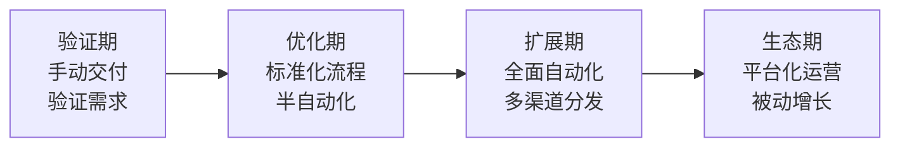
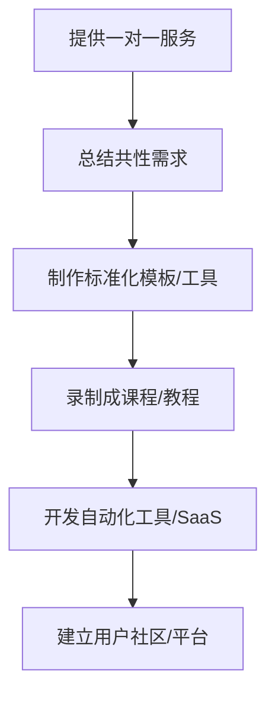
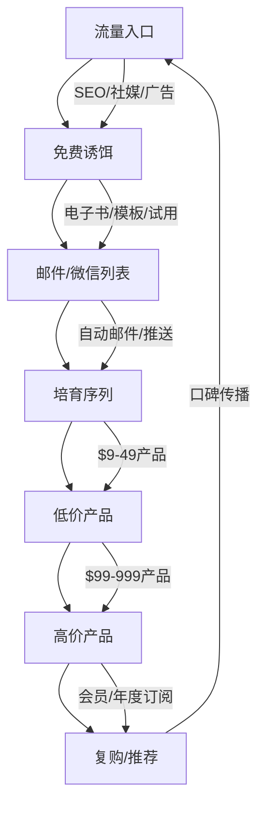
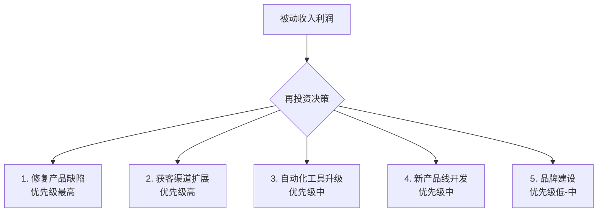

## 六、被动收入规模化策略

被动收入的终极目标不是"赚到第一笔钱"，而是建立一套能自我扩张的收入系统。规模化意味着用同样的时间投入撬动十倍、百倍的产出，让收入增长曲线从线性走向指数。本章将系统拆解被动收入规模化的底层逻辑、核心方法、实操路径和常见陷阱，帮助你从"一个人做副业"跨越到"系统自动赚钱"。

### 1. 规模化的底层逻辑

#### 1.1 什么是真正的规模化

规模化不是简单地"多做几份"。真正的规模化需要满足三个条件：

- **边际成本趋近于零**：第1000个客户的服务成本与第1个几乎相同
- **可复制的交付系统**：产出不依赖个人时间的线性投入
- **正向反馈循环**：规模扩大后，单位成本反而下降

传统工作是"卖时间"——你工作8小时赚8小时的钱。被动收入规模化是"卖系统"——你花100小时建系统，系统24小时×365天自动产出。

#### 1.2 规模化的经济学原理

理解以下三个经济学概念，是做出正确规模化决策的前提：

**边际成本递减**：固定成本（开发产品、搭建平台）一次性投入后，每多服务一个用户的增量成本极低。一个在线课程卖给100人和卖10000人，制作成本完全一样，只有平台手续费略有增加。

**网络效应**：部分被动收入模式具有网络效应——用户越多，产品越有价值。典型的如内容社区、模板市场。早期用户的口碑和使用数据会吸引新用户，形成自增长飞轮。

**复利效应**：持续产出的内容、积累的SEO权重、沉淀的用户关系，都会随时间产生复利。一篇高质量文章可能在发布3年后仍然每天带来流量和收入。

#### 1.3 规模化的四个阶段



| 阶段 | 核心任务 | 时间投入 | 收入特征 | 关键指标 |
|------|----------|----------|----------|----------|
| 验证期 | 手动交付，验证需求真伪 | 80%创建，20%运营 | 低且不稳定 | 复购率 > 30% |
| 优化期 | 标准化流程，去除人工环节 | 50%创建，50%运营 | 缓慢增长 | 自动化率 > 50% |
| 扩展期 | 自动化交付，多渠道推广 | 20%创建，80%运营 | 快速增长 | 月增长率 > 20% |
| 生态期 | 平台化运作，生态自循环 | 10%维护，90%战略 | 稳定高收入 | 被动收入占比 > 90% |

### 2. 七大规模化路径详解

#### 2.1 路径一：内容资产的规模化复制

**原理**：将一次性创作的内容，通过多形态、多平台、多语言的方式分发，实现"一次创作，N次变现"。

**具体方法**：

**多形态复用**：一篇深度长文可以拆解为：
- 1个短视频脚本（抖音/B站）
- 5-10条社交媒体帖子（微博/小红书）
- 1期播客节目（喜马拉雅/小宇宙）
- 1份PDF下载资料（用于引流）
- 1个信息图（用于Pinterest传播）
- 1门付费微课的核心素材

**多平台分发**：同一内容针对不同平台调性做适配：

| 平台 | 内容形态 | 字数/时长 | 关键优化点 |
|------|----------|-----------|------------|
| 微信公众号 | 深度长文 | 3000-8000字 | 标题吸引力，文末引导关注 |
| 知乎 | 专业回答 | 1000-3000字 | 开头抓人，数据引用 |
| 小红书 | 图文笔记 | 300-800字 | 封面设计，标签精准 |
| 抖音/快手 | 短视频 | 15-60秒 | 前3秒抓注意力 |
| B站 | 中长视频 | 5-20分钟 | 完播率，弹幕互动 |
| 播客 | 音频节目 | 20-60分钟 | 开场破冰，节奏把控 |

**多语言扩展**：对于通用性较强的内容（技术教程、工具指南），翻译成英文可触达全球市场。使用AI翻译工具（如DeepL、GPT-4）做初稿，再人工润色关键段落，成本极低但收入天花板大幅提升。

**实操案例**：一位程序员将自己写的"Git从入门到精通"系列文章，同步发布到掘金、知乎、Medium三个平台，中文版月均阅读量5万，英文版在Medium上获得Partner Program收入约$200/月。后来将系列文章整理成电子书，在Amazon KDP上售价$9.99，月销200+本。同样的内容，三种形态，月收入从0增长到$2500+。

#### 2.2 路径二：产品化的深度推进

**原理**：将服务/经验/知识封装为标准化产品，消除对个人时间的依赖。

**从服务到产品的转化路径**：



**每一级的规模化倍数**：

| 形态 | 单位时间服务人数 | 收入天花板 | 前期投入 |
|------|------------------|------------|----------|
| 一对一咨询 | 1人/小时 | 低（受限于时间） | 低 |
| 小班课 | 10-30人/小时 | 中 | 低-中 |
| 录播课程 | 无限人 | 高 | 中 |
| 电子书/模板 | 无限人 | 中-高 | 中 |
| SaaS工具 | 无限人 | 极高 | 高 |
| 社区/平台 | 无限人 | 极高 | 高 |

**关键技巧——"先手动后自动"**：不要一上来就开发复杂的自动化系统。先手动为10-20个客户服务，在服务过程中记录每一步流程、每一个问题、每一次优化。当流程被反复验证且稳定后，再将其自动化。这避免了"花3个月开发一个没人需要的系统"的常见陷阱。

**模板化清单**：

创建产品化模板时，确保包含以下模块：

```text
产品化模板结构：
├── 需求定义文档
│   ├── 目标用户画像
│   ├── 核心痛点描述
│   └── 预期使用场景
├── 交付标准
│   ├── 输入要求（用户需要提供什么）
│   ├── 输出标准（用户会得到什么）
│   └── 质量检查清单
├── 操作手册
│   ├── 详细步骤（截图/视频）
│   ├── 常见问题FAQ
│   └── 故障排除指南
└── 迭代记录
    ├── 版本更新日志
    ├── 用户反馈汇总
    └── 优化方向规划
```

#### 2.3 路径三：自动化漏斗搭建

**原理**：用自动化营销漏斗替代人工获客和转化，实现"流量进来，钱出来"的自动运转。

**完整漏斗架构**：



**各环节的关键设置**：

**流量入口优化**：
- SEO：长尾关键词覆盖，月均搜索量100-1000的词竞争低、转化高
- 社媒：选择2-3个核心平台深度运营，而非全平台浅度覆盖
- 付费广告：仅在验证产品可行后投放，起步预算控制在500-1000元/月

**免费诱饵设计**：好的免费诱饵需要满足三个条件：
1. **解决一个具体的小问题**（不要贪大求全）
2. **展示你的专业能力**（建立信任）
3. **自然引向付费产品**（创造需求）

例如：做Excel教程的人，免费诱饵可以是"10个财务常用Excel公式速查表PDF"，付费产品是"Excel财务建模全套课程"。

**培育序列模板**（以邮件为例）：

| 邮件编号 | 发送时间 | 主题 | 目的 |
|----------|----------|------|------|
| 第1封 | 注册后立即 | 免费资料下载 + 自我介绍 | 建立第一印象 |
| 第2封 | 第2天 | 一个实用小技巧 | 展示价值 |
| 第3封 | 第4天 | 成功案例故事 | 建立信任 |
| 第4封 | 第7天 | 常见误区解析 | 创造需求 |
| 第5封 | 第10天 | 限时优惠推荐 | 首次转化 |

**工具推荐**：

| 需求 | 国内方案 | 海外方案 | 费用 |
|------|----------|----------|------|
| 邮件自动化 | SendCloud、阿里的邮件推送 | ConvertKit、Mailchimp | 免费-300元/月 |
| 落地页搭建 | WordPress + Elementor | Carrd、Leadpages | 免费-200元/月 |
| 微信自动化 | 企业微信 + 微伴助手 | — | 免费-500元/月 |
| 支付接入 | 支付宝/微信支付 | Stripe、Paddle | 手续费1-3% |
| 数据分析 | 百度统计、友盟 | Google Analytics、Mixpanel | 免费 |

#### 2.4 路径四：联盟与分销体系

**原理**：让别人帮你卖产品，你只需支付佣金。销售力量随合作伙伴数量增长而指数级放大。

**构建分销体系的步骤**：

**第一步：设计佣金结构**

| 产品价格区间 | 建议佣金比例 | 适用场景 |
|--------------|--------------|----------|
| 低价（<100元） | 30-50% | 电子书、模板、小额工具 |
| 中价（100-500元） | 20-40% | 在线课程、会员订阅 |
| 高价（>500元） | 10-30% | 训练营、高端服务 |

佣金太低没有推广者愿意合作，太高则利润被压缩。建议从30%起步测试。

**第二步：招募推广者**

高效招募渠道：
- 在你的用户群中寻找活跃用户（他们已经有使用体验）
- 联系同领域但不竞争的博主/UP主
- 在联盟营销平台发布招募（如淘宝客、京东联盟、多多进宝）
- 为推广者提供专属素材包（文案、图片、视频脚本）

**第三步：搭建追踪系统**

使用联盟营销追踪工具（如FirstPromoter、Rewardful、国内的有赞分销）为每个推广者生成唯一链接，追踪：
- 点击量
- 注册量
- 付费转化率
- 佣金发放

**第四步：维护推广者关系**

- 提供详细的推广素材和话术模板
- 定期分享销售数据和优化建议
- 设置阶梯佣金（月销10单30%，月销50单40%，月销100单50%）
- 每月举办推广者线上交流会

**案例**：某在线Excel课程定价199元，通过分销体系招募了200名推广者，每人月均带来3-5单。月收入 = 200人 × 4单 × 199元 × 30%佣金分配后净收入 ≈ 48,000元，而作者无需参与任何销售环节。

#### 2.5 路径五：IP授权与特许经营

**原理**：当你的品牌和方法论足够成熟时，可以通过授权他人使用你的品牌、内容、方法论来获取持续收入。

**IP授权的层次**：

| 授权层级 | 内容 | 典型收入 | 适用阶段 |
|----------|------|----------|----------|
| 内容授权 | 文章/视频转载授权 | 固定费用/篇 | 早期 |
| 品牌授权 | 允许他人以你的品牌运营 | 年费 + 分成 | 中期 |
| 方法论授权 | 整套方法论 + 培训体系 | 加盟费 + 管理费 | 成熟期 |
| 平台授权 | 提供技术和平台支持 | SaaS订阅费 | 高级 |

**关键注意事项**：
- 授权前必须注册商标，保护品牌资产
- 制定明确的品牌使用规范（VI标准、话术模板、服务流程）
- 设置质量监控机制，定期审核授权方的服务质量
- 合同中明确终止条款和违约责任

#### 2.6 路径六：技术杠杆——工具与自动化

**原理**：用技术手段替代重复性人工操作，释放时间用于高价值决策。

**可自动化的环节清单**：

| 环节 | 手动方式 | 自动化方案 | 节省时间 |
|------|----------|------------|----------|
| 内容发布 | 逐个平台手动发布 | 定时发布工具（如蚁小二、Buffer） | 80% |
| 客户回复 | 逐条手动回复 | 智能客服 + 常见问题自动回复 | 60% |
| 数据统计 | 手动导出Excel分析 | 自动化报表（Google Data Studio） | 90% |
| 收款对账 | 逐笔核对 | 自动对账脚本 | 95% |
| 社群管理 | 逐群手动管理 | 社群机器人（如微伴助手） | 70% |

**Python自动化脚本示例——自动监控收入并生成日报**：

```python
import datetime
import json

class IncomeTracker:
    """被动收入自动追踪系统"""
    
    def __init__(self, config_path="income_config.json"):
        with open(config_path, 'r') as f:
            self.config = json.load(f)
        self.income_sources = {}
    
    def add_income(self, source, amount, category="general"):
        """记录一笔收入"""
        today = datetime.date.today().isoformat()
        if today not in self.income_sources:
            self.income_sources[today] = []
        self.income_sources[today].append({
            "source": source,
            "amount": amount,
            "category": category,
            "timestamp": datetime.datetime.now().isoformat()
        })
    
    def daily_report(self):
        """生成每日收入报告"""
        today = datetime.date.today().isoformat()
        records = self.income_sources.get(today, [])
        total = sum(r["amount"] for r in records)
        
        report = f"=== {today} 被动收入日报 ===\n"
        report += f"总收入: ¥{total:.2f}\n"
        report += f"收入笔数: {len(records)}\n"
        report += "---\n"
        
        # 按来源汇总
        by_source = {}
        for r in records:
            src = r["source"]
            by_source[src] = by_source.get(src, 0) + r["amount"]
        
        for src, amt in sorted(by_source.items(), key=lambda x: -x[1]):
            report += f"  {src}: ¥{amt:.2f}\n"
        
        return report
    
    def monthly_summary(self):
        """生成月度汇总"""
        today = datetime.date.today()
        month_prefix = today.strftime("%Y-%m")
        
        monthly_total = 0
        daily_data = []
        for date_str, records in self.income_sources.items():
            if date_str.startswith(month_prefix):
                day_total = sum(r["amount"] for r in records)
                monthly_total += day_total
                daily_data.append((date_str, day_total))
        
        avg_daily = monthly_total / max(len(daily_data), 1)
        projection = avg_daily * 30
        
        return {
            "month": month_prefix,
            "total": monthly_total,
            "days_active": len(daily_data),
            "avg_daily": avg_daily,
            "monthly_projection": projection
        }
```

#### 2.7 路径七：资本杠杆——用钱生钱

**原理**：当被动收入产生正向现金流后，将利润再投入到扩大规模中，形成"收入→投资→更多收入"的循环。

**资本再投资优先级**：



**再投资比例建议**：

| 收入阶段 | 再投资比例 | 消费比例 | 储蓄比例 |
|----------|------------|----------|----------|
| 起步期（<5000元/月） | 50-70% | 20-30% | 10-20% |
| 成长期（5000-20000元/月） | 40-50% | 25-35% | 20-30% |
| 成熟期（>20000元/月） | 30-40% | 20-30% | 30-40% |

**关键原则**：再投资前，确保已建立3-6个月的应急储备金。被动收入本身就有波动性，不能把所有利润都押在扩张上。

### 3. 不同被动收入类型的规模化策略

#### 3.1 数字产品（课程/电子书/模板）

**规模化核心**：产品矩阵 + 自动化漏斗

**策略要点**：
- **构建产品阶梯**：免费引流品 → 低价试用品（9-49元）→ 中价主力品（99-299元）→ 高价旗舰品（499-1999元）→ 超高价年度会员/训练营（2999-9999元）
- **平台选择**：小鹅通、知识星球（国内）；Gumroad、Teachable（海外）
- **更新节奏**：每季度更新一次内容，保持产品时效性
- **用户评价**：积极收集和展示用户评价，社会证明是数字产品最好的销售员

#### 3.2 内容创作（博客/视频/播客）

**规模化核心**：内容工厂模式 + 多平台矩阵

**策略要点**：
- **建立内容日历**：每周固定产出节奏（如周二发文、周五发视频）
- **SEO长尾策略**：用工具（5118、Ahrefs）挖掘长尾关键词，每篇文章瞄准一个关键词
- **内容复用系统**：1篇长文 → 3条短视频 → 5条社交帖子 → 1份Newsletter
- **变现多元化**：广告收入 + 赞赏 + 付费专栏 + 品牌合作 + 分销佣金

#### 3.3 投资理财（股息/基金/房产）

**规模化核心**：定投策略 + 复利增长 + 再投资

**策略要点**：
- **自动化定投**：设置每月自动扣款，消除情绪干扰
- **股息再投资**（DRIP）：收到的股息自动买入更多份额
- **资产配置再平衡**：每半年/一年调整一次比例，保持风险可控
- **税务优化**：利用个人养老金账户、基金分红方式选择等合法节税手段

#### 3.4 软件/工具（SaaS/插件/脚本）

**规模化核心**：订阅制 + 自助服务 + 社区驱动增长

**策略要点**：
- **采用订阅制**：月费/年费模式，收入可预测且持续
- **自助上手**：降低使用门槛，减少客服依赖
- **开放API/插件市场**：让第三方开发者扩展功能，形成生态
- **Product Hunt/GitHub曝光**：利用开发者社区获取早期用户

### 4. 规模化的关键指标体系

#### 4.1 必须监控的核心指标

| 指标名称 | 计算方式 | 健康值 | 危险信号 |
|----------|----------|--------|----------|
| 被动收入占比 | 被动收入 / 总收入 × 100% | > 60% | < 30% |
| 客户获取成本（CAC） | 总营销费用 / 新客户数 | < 首单金额30% | > 首单金额50% |
| 客户终身价值（LTV） | 平均客单价 × 平均复购次数 | > CAC的3倍 | < CAC的2倍 |
| 月度经常性收入（MRR） | 当月活跃订阅收入 | 月增长>10% | 连续下降 |
| 流失率 | 月流失客户 / 月初总客户 | < 5% | > 10% |
| 内容转化率 | 付费用户 / 内容浏览者 | > 1% | < 0.3% |
| 自动化率 | 自动化环节 / 总环节 | > 80% | < 50% |

#### 4.2 指标追踪工具

```python
# 使用简单的Python脚本追踪关键指标
import sqlite3
from datetime import datetime, timedelta

class PassiveIncomeDashboard:
    """被动收入仪表盘"""
    
    def __init__(self, db_path="income.db"):
        self.conn = sqlite3.connect(db_path)
        self._init_db()
    
    def _init_db(self):
        self.conn.execute("""
            CREATE TABLE IF NOT EXISTS income_records (
                id INTEGER PRIMARY KEY AUTOINCREMENT,
                date TEXT NOT NULL,
                source TEXT NOT NULL,
                amount REAL NOT NULL,
                is_passive INTEGER DEFAULT 1,
                category TEXT,
                notes TEXT
            )
        """)
        self.conn.commit()
    
    def record(self, source, amount, is_passive=True, category="general"):
        """记录收入"""
        self.conn.execute(
            "INSERT INTO income_records (date, source, amount, is_passive, category) "
            "VALUES (?, ?, ?, ?, ?)",
            (datetime.now().strftime("%Y-%m-%d"), source, amount, 
             1 if is_passive else 0, category)
        )
        self.conn.commit()
    
    def passive_ratio(self, months=1):
        """计算被动收入占比"""
        cutoff = (datetime.now() - timedelta(days=30*months)).strftime("%Y-%m-%d")
        cursor = self.conn.execute(
            "SELECT SUM(CASE WHEN is_passive=1 THEN amount ELSE 0 END), "
            "SUM(amount) FROM income_records WHERE date >= ?",
            (cutoff,)
        )
        passive, total = cursor.fetchone()
        if total and total > 0:
            return passive / total * 100
        return 0
    
    def top_sources(self, limit=5, months=1):
        """收入来源排行"""
        cutoff = (datetime.now() - timedelta(days=30*months)).strftime("%Y-%m-%d")
        cursor = self.conn.execute(
            "SELECT source, SUM(amount) as total FROM income_records "
            "WHERE date >= ? GROUP BY source ORDER BY total DESC LIMIT ?",
            (cutoff, limit)
        )
        return cursor.fetchall()
    
    def monthly_trend(self, months=6):
        """月度趋势"""
        results = []
        for i in range(months):
            start = (datetime.now() - timedelta(days=30*(i+1))).strftime("%Y-%m-01")
            end = (datetime.now() - timedelta(days=30*i)).strftime("%Y-%m-01")
            cursor = self.conn.execute(
                "SELECT SUM(amount) FROM income_records "
                "WHERE date >= ? AND date < ? AND is_passive = 1",
                (start, end)
            )
            total = cursor.fetchone()[0] or 0
            results.append({"month": start[:7], "passive_income": total})
        return list(reversed(results))
```

### 5. 规模化的常见陷阱与应对

#### 5.1 陷阱一：过早规模化

**症状**：产品还没验证就投入大量资源推广，结果推广的越多，亏损的越多。

**根因**：没有区分"有人买"和"能规模化"。10个手动服务的客户满意，不代表自动化后1000个客户也满意。

**应对**：坚持"先手动验证，再自动化扩展"的原则。验证标准：
- 至少100个付费用户
- 复购率 > 30%
- NPS（净推荐值）> 40
- 无需你的个人介入也能正常交付

#### 5.2 陷阱二：追求完美而错失时机

**症状**：反复打磨产品，总觉得"还不够好"，迟迟不发布。

**根因**：完美主义 + 对失败的恐惧。

**应对**：采用MVP（最小可行产品）策略。第一版产品只需要满足"核心功能完整 + 使用体验流畅 + 无致命bug"三个条件。记住：一个70分的产品今天上线，胜过一个100分的产品永远不上线。

#### 5.3 陷阱三：过度依赖单一渠道

**症状**：所有收入来自一个平台（如公众号、淘宝店），平台政策一变就收入归零。

**根因**：把房子建在别人的地基上。

**应对**：
- 不超过50%的收入来自单一渠道
- 核心用户沉淀到自有平台（邮件列表、私域社群、独立站）
- 定期评估各渠道风险，提前布局替代方案

#### 5.4 陷阱四：规模化后品质下降

**症状**：为了追求速度和数量，产品质量持续下滑，口碑崩塌。

**根因**：规模化过程中缺乏质量控制机制。

**应对**：
- 建立质量检查清单（QA Checklist），每批产品上线前逐项核验
- 设定质量红线指标（如课程完课率 < 40% 需要返工）
- 定期收集用户反馈，建立快速响应机制
- 宁可少卖，不卖烂货

#### 5.5 陷阱五：忽视现金流管理

**症状**：账面收入不错，但现金流断裂——该付的广告费、工具订阅费、外包费到期了，收款还在路上。

**根因**：混淆了"收入"和"现金流"，没有预留缓冲。

**应对**：
- 始终保持3个月运营费用的现金储备
- 优先选择即时结算的支付方式
- 月度固定成本控制在月收入的30%以内
- 制作现金流预测表，提前3个月预判资金缺口

### 6. 规模化的进阶策略

#### 6.1 数据驱动的增长优化

当被动收入达到一定规模后，直觉决策会让位于数据决策。关键数据决策场景：

**A/B测试框架**：

| 测试对象 | 测试变量 | 关键指标 | 最小样本量 |
|----------|----------|----------|------------|
| 产品定价 | 不同价格点 | 转化率 × 客单价 | 每组200+访问 |
| 落地页 | 标题/CTA按钮 | 注册转化率 | 每组500+访问 |
| 邮件标题 | 不同标题风格 | 打开率 | 每组1000+发送 |
| 产品描述 | 长文案vs短文案 | 付费转化率 | 每组300+访问 |

**工具**：Google Optimize（免费）、VWO、Optimizely。

#### 6.2 品牌资产的长期积累

品牌是最持久的被动资产。一个强品牌意味着：
- 更低的获客成本（用户主动搜索你的品牌名）
- 更高的溢价能力（同样的产品可以定价更高）
- 更强的抗风险能力（平台变化不会轻易摧毁品牌）

**品牌建设三要素**：
1. **视觉识别**：统一的Logo、配色、字体风格
2. **内容调性**：一致的说话风格和价值主张
3. **用户关系**：从"卖东西的人"变成"可信赖的专家"

#### 6.3 从个人到团队的转型节点

当你的被动收入超过全职工作收入的2倍，且持续3个月以上，是考虑组建团队的信号。

**第一个应该外包的岗位**：

| 优先级 | 岗位 | 理由 | 月预算参考 |
|--------|------|------|------------|
| 1 | 客服/社群运营 | 最耗时且可标准化 | 3000-5000元 |
| 2 | 内容助理 | 辅助创作和分发 | 4000-6000元 |
| 3 | 广告投放 | 需要专业技能 | 5000-8000元 |
| 4 | 技术开发 | 工具和自动化 | 8000-15000元 |

建议从兼职/外包起步，不要一上来就招全职。用平台如猪八戒、Upwork、电鸭社区寻找合适的自由职业者。

### 7. 实操：90天规模化行动方案

#### 第1-30天：夯实基础

- [ ] 梳理现有被动收入来源，计算各渠道收入占比
- [ ] 确定最有潜力的1-2个规模化方向
- [ ] 搭建基础自动化工具（定时发布、自动回复、数据追踪）
- [ ] 建立用户反馈收集机制（表单、评价系统）
- [ ] 制定内容/产品产出日历

#### 第31-60天：系统化扩展

- [ ] 将手动流程标准化为SOP文档
- [ ] 启动第一个分销/联盟计划
- [ ] 测试新的获客渠道（在现有渠道基础上+1个新渠道）
- [ ] 优化转化漏斗（落地页、邮件序列、支付流程）
- [ ] 开始A/B测试定价和产品描述

#### 第61-90天：加速增长

- [ ] 将SOP中的重复环节自动化
- [ ] 招募第一批外包助手（客服/内容助理）
- [ ] 推出产品阶梯中的第二级产品
- [ ] 建立数据分析仪表盘，每周复盘关键指标
- [ ] 规划下一个90天的增长目标

### 8. 常见问题解答

**Q1：被动收入规模化需要多少启动资金？**

A：取决于规模化路径。内容类路径（博客、视频、电子书）几乎零成本，只需要时间和精力。技术类路径（SaaS工具）可能需要5000-50000元的开发投入。建议从低成本路径起步，用赚到的钱再投入到高成本路径。

**Q2：规模化到什么程度才算成功？**

A：主观标准：被动收入能覆盖你的基本生活开支。客观标准：被动收入占总收入的80%以上，且连续6个月保持增长或稳定。到了这个阶段，你真正实现了"用系统赚钱"而不是"用时间赚钱"。

**Q3：做规模化需要全职投入吗？**

A：不需要。大部分被动收入项目在验证期和优化期都可以用业余时间推进（每天1-2小时）。只有当月收入稳定超过全职收入的2倍，且你确认要全职投入时，才考虑辞职。

**Q4：如何平衡规模化和现有工作？**

A：利用"时间块"方法——每天固定1-2个时间段专注于被动收入项目。建议：
- 工作日：每天早起1小时或晚间1小时
- 周末：集中4-6小时处理需要深度思考的任务
- 碎片时间：处理简单的发布、回复、数据查看等轻任务

**Q5：规模化失败了怎么办？**

A：首先评估是"方向错误"还是"执行不到位"。如果方向错误（产品没人要），及时止损，总结教训后换方向。如果方向对但执行不够，调整策略继续推进。记住：每一次"失败"都是数据积累，你排除了一个不可行的方案，离成功更近了一步。

### 9. 本节小结

被动收入规模化的核心不在于"做更多"，而在于"建系统"。从手动验证开始，逐步标准化、自动化、平台化，最终让收入增长不再依赖你的时间投入。

**规模化的核心公式**：

> 规模化收入 = 优质产品 × 自动化漏斗 × 杠杆分销 × 数据优化 × 时间复利

每一个乘数的提升都会放大最终结果。不要试图同时优化所有环节——找到当前瓶颈，集中突破，再找下一个瓶颈。这就是规模化的真实节奏：不是一步到位，而是持续迭代。
