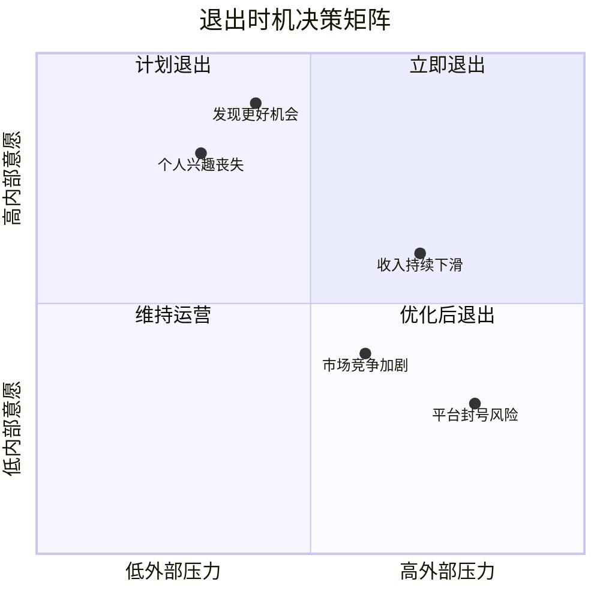
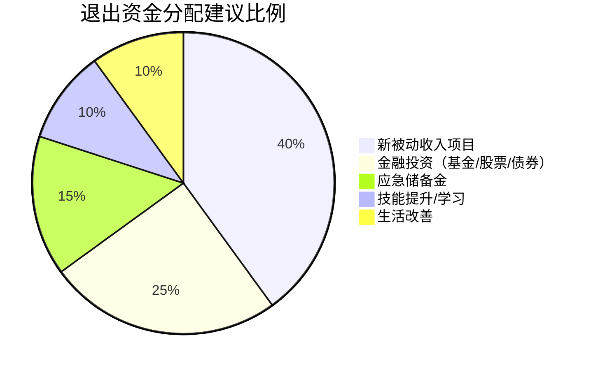

## 七、被动收入项目退出策略

被动收入项目并非"建完就永远赚钱"。市场环境变化、技术迭代、个人精力转移、收益边际递减——任何一个因素都可能让曾经优质的被动收入项目变成沉没成本的泥潭。退出策略不是失败的标志，而是资产管理的核心能力。一个没有退出策略的被动收入项目，就像一栋没有消防通道的楼：平时看不出问题，出事时才知道致命。

本节系统讲解被动收入项目的退出时机判断、退出方式选择、资产估值方法、交易执行流程、税务处理要点，以及退出后的资金再配置策略。

---

### 1. 为什么被动收入项目需要退出策略

#### 1.1 被动收入项目的生命周期

任何商业项目都有生命周期，被动收入项目也不例外：


| 阶段 | 特征 | 典型持续时间 | 现金流状态 |
|------|------|-------------|-----------|
| 启动期 | 投入大于产出，验证商业模式 | 1-6个月 | 负现金流 |
| 增长期 | 收入快速增长，边际成本下降 | 6-24个月 | 正现金流且递增 |
| 稳定期 | 收入趋于平稳，维护成本固定 | 1-5年 | 稳定正现金流 |
| 衰退期 | 收入下滑，竞争加剧或市场萎缩 | 6-24个月 | 现金流递减 |

关键认知：**在稳定期的中后期启动退出准备，在衰退期初期完成退出**——这是最优时间窗口。等到衰退期中后期，买家会大幅压价甚至无人接手。

#### 1.2 不设退出策略的真实代价

- **时间成本**：一个衰退中的项目持续消耗你的维护精力，而这些精力本可以投入更高回报的新项目
- **机会成本**：资金锁在低效资产中，错过其他投资窗口
- **沉没成本陷阱**：因为"已经投入这么多"而不愿止损，导致损失持续扩大
- **资产归零风险**：平台政策变化（如封号、算法调整）可能让项目价值瞬间清零，没有提前准备则血本无归

#### 1.3 退出策略的三种定位

| 定位 | 含义 | 适用场景 |
|------|------|---------|
| **主动退出** | 在最佳时机有计划地出售或转型 | 项目处于稳定期，估值较高 |
| **被动退出** | 外部环境迫使退出（政策、技术变革） | 平台规则突变、技术被淘汰 |
| **战略退出** | 作为投资组合管理的一部分，定期优化资产配置 | 拥有多个被动收入项目的专业投资者 |

理想状态是所有退出都是主动的。但现实中被动退出占多数，正因为如此，提前制定退出策略才格外重要。

---

### 2. 退出时机的判断框架

#### 2.1 定量指标：数据驱动的退出信号

建立一套量化的"退出仪表盘"，定期监控以下指标：

| 指标 | 退出信号阈值 | 监控频率 |
|------|------------|---------|
| 月收入连续下滑 | 连续3个月同比下降>15% | 每月 |
| 流量/用户获取成本（CAC） | CAC > LTV的50% | 每季度 |
| 维护时间投入 | 单位收入所需时间上升>30% | 每月 |
| 利润率 | 低于行业基准的60% | 每季度 |
| 平台政策风险评分 | 高风险（见下文评分表） | 每月 |
| 资产净值/年化收入比 | 高于行业合理倍数（卖比持有划算） | 每半年 |

**平台政策风险评分表**（满分100，分数越高风险越大）：

| 风险因素 | 权重 | 评分标准 |
|---------|------|---------|
| 平台集中度（是否依赖单一平台） | 30% | 100%依赖=100分，50%=50分 |
| 近12个月政策变动次数 | 20% | 3次以上=80分，1次=30分 |
| 平台财务健康状况 | 15% | 有裁员/亏损新闻=70分 |
| 同类项目被封禁案例 | 15% | 大量案例=90分 |
| 替代平台可迁移性 | 20% | 无替代=100分，多替代=20分 |

综合评分 > 70 分：应立即启动退出准备。
综合评分 50-70 分：制定3个月内退出计划。
综合评分 < 50 分：常规监控即可。

#### 2.2 定性判断：直觉背后的逻辑

有些退出信号无法用数字量化，但同样重要：

- **你对这个项目失去了兴趣**——被动收入需要"被动维护"，但不是"零维护"。失去兴趣意味着维护质量必然下降，项目会加速衰退
- **行业出现颠覆性技术**——比如AI生成内容工具的普及，对某些内容类被动收入项目构成根本性冲击
- **核心资源不再可控**——依赖的供应链断裂、核心合作伙伴关系恶化、关键人才流失
- **有更好的机会出现**——当新机会的预期年化回报率 > 当前项目年化收入 × 3（估值倍数）时，卖旧买新是理性选择

#### 2.3 退出时机决策矩阵



---

### 3. 七种退出方式详解

#### 3.1 方式一：整体出售

将项目（含域名、内容、用户、收入流）作为资产包出售给买家。

**适用项目类型**：网站/博客、SaaS工具、电商店铺、YouTube频道、付费社群

**估值方法**：

| 估值模型 | 公式 | 适用场景 |
|---------|------|---------|
| 收益倍数法 | 年净利润 × 倍数（通常2-5倍） | 最常用，适合有稳定收入的项目 |
| 流量估值法 | 月UV × 单UV价值（行业差异大） | 内容站、信息站 |
| DCF折现法 | 未来现金流折现求和 | 收入波动大的项目 |
| 资产加总法 | 域名+内容+用户+品牌分别估值 | 早期项目或混合型资产 |

**收益倍数的决定因素**：

| 因素 | 倍数影响 | 说明 |
|------|---------|------|
| 收入稳定性 | +0.5~1.5 | 连续12个月稳定 > 波动大 |
| 增长趋势 | +0.3~1.0 | 收入在增长 > 收入在下滑 |
| 运营时间投入 | -0.5~1.5 | 每周<2小时 > 每周>10小时 |
| 收入来源多样性 | +0.2~0.8 | 3个以上收入源 > 单一来源 |
| 平台依赖度 | -0.3~1.0 | 多平台 > 单一平台 |
| 内容/资产可迁移性 | +0.2~0.5 | 可迁移 > 不可迁移 |

**主要交易平台**：

| 平台 | 佣金 | 适合项目规模 | 特点 |
|------|------|------------|------|
| Flippa | 5-15% | $100-$100K | 最大的网站/在线业务交易市场 |
| Empire Flippers | 15% | $10K-$10M | 精选高质量项目，审核严格 |
| FE International | 10-15% | $100K+ | 专注中大型在线业务 |
| MicroAcquire (Acquire.com) | 免费（买家付费） | SaaS为主 | 无佣金，直接对接 |
| 闲鱼/转转 | 免费 | 国内小型项目 | 适合中文站点、小程序等 |
| 知识星球/即刻社区 | 免费 | 社群、课程 | 圈子内交易，信任度高 |

**出售流程**：

1. **准备阶段（1-2个月）**：整理收入证明（至少6个月的收款截图/后台数据）、梳理运营文档（SOP）、优化关键指标（如将收入做平滑处理，避免大起大落）
2. **估值阶段（1-2周）**：使用上述估值模型计算合理价格区间，通常定价为区间中位数的1.1-1.2倍（留出议价空间）
3. **上架阶段（1-4周）**：撰写项目简介（突出卖点：自动化程度、增长潜力、护城河），在多个平台同步上架
4. **谈判阶段（2-4周）**：回应买家尽调请求，协商付款方式（推荐Escrow托管），确定过渡支持条款
5. **交割阶段（1-4周）**：转移资产（域名、账号、代码、内容）、提供培训支持（通常约定1-3个月）、确认收款

**避坑要点**：
- 不要在谈判前把所有细节公开，防止被竞争对手套取信息
- 使用第三方Escrow托管，不要先转资产后收款
- 过渡期支持要写入合同，明确支持范围、时长和响应时间
- 如果项目依赖个人账号，需要一并转移或创建新的管理账号

#### 3.2 方式二：授权/许可

将项目的核心资产（内容、品牌、技术方案）授权给他人使用，收取许可费或分成。

**适用场景**：课程内容、知识付费产品、技术方案、品牌IP

**授权模式对比**：

| 模式 | 收入方式 | 优势 | 风险 |
|------|---------|------|------|
| 独占授权 | 一次性许可费+分成 | 收入确定性高 | 授权方跑路风险 |
| 非独占授权 | 按量分成 | 多家授权，收入分散 | 管理复杂度高 |
| 白标授权 | 定制化许可费 | 买家可贴牌销售 | 品牌稀释风险 |
| 特许经营 | 加盟费+持续分成 | 规模化最快 | 质量控制难度大 |

**操作步骤**：
1. 将核心资产标准化、文档化（课程内容打包、技术方案写成白皮书）
2. 明确授权范围：地域、时间、使用方式、转授权权利
3. 起草授权协议（建议请律师审核，费用约2000-5000元）
4. 设置监控机制：定期检查授权方是否遵守协议条款
5. 建立结算流程：月度/季度对账，自动分成或固定许可费

#### 3.3 方式三：渐进退出（降低维护到零）

不出售项目，而是逐步将维护投入降到接近零，让项目"自生自灭"式运行直到自然衰退。

**适用场景**：出售价值不高但仍有小额现金流的项目、不想花精力交易的小项目

**渐进退出四步法**：

| 步骤 | 操作 | 时间跨度 |
|------|------|---------|
| 内容冻结 | 停止更新新内容，保持现有内容 | 立即 |
| 自动化加固 | 将所有手动维护流程自动化 | 1-2个月 |
| 成本削减 | 取消付费工具，降级服务器，减少域名续费 | 逐季度 |
| 自然过期 | 不再续费域名/服务器，项目自然关闭 | 6-24个月 |

**注意事项**：
- 即使渐进退出，也要将域名解析到一个简单的"Coming Soon"页面或301重定向到其他资产，避免流量浪费
- 关闭前导出所有数据（用户邮箱、内容备份、收入记录），这些可能是未来项目的种子资源
- 如果项目有付费用户，必须提前通知并妥善处理退款/迁移

#### 3.4 方式四：战略合并

将两个或多个同质化项目合并为一个，减少重复维护成本，提升单一项目的估值。

**适用场景**：同时运营多个同领域被动收入项目

**合并收益计算**：

```text
合并后成本节约 = Σ(各项目独立维护成本) - 合并后维护成本
合并后估值提升 = 合并后年利润 × 合并倍数溢价(通常1.1-1.3倍)
净收益 = 成本节约 + 估值提升 - 合并执行成本
```

**合并执行要点**：
1. 选择"主项目"（流量/收入/品牌最强的）作为合并主体
2. 将其他项目的内容/用户/流量逐步迁移至主项目
3. 旧项目设置301重定向（至少保留12个月以传递SEO权重）
4. 更新所有外部引用（反向链接、社交媒体、合作方）
5. 监控合并后30/60/90天的数据变化

#### 3.5 方式五：众筹/分拆

将单一项目的部分权益出售给多个小额投资者，实现部分退出同时保留部分收益权。

**适用场景**：高价值项目但不想一次性全部出售

**操作模式**：
- **份额制**：将项目拆分为N个份额，每个份额对应一定比例的收益权
- **债权制**：以项目未来收益为担保，发行"债券"获取一次性资金
- **合伙制**：引入合伙人共同运营，原持有者逐步退出管理

**风险提示**：涉及他人资金时，务必了解当地法律法规。在中国，未经批准的份额制融资可能涉及非法集资。建议在合规的股权众筹平台操作，或仅与信任的小圈子进行。

#### 3.6 方式六：转型变现

不退出项目本身，而是改变项目的变现模式，将低效的被动收入转化为更高效的主动或半主动收入。

**转型方向**：

| 原模式 | 转型方向 | 变现效率变化 |
|--------|---------|------------|
| 广告收入博客 | 付费订阅Newsletter | ↑ 3-10倍 |
| 免费工具+广告 | Freemium SaaS | ↑ 5-20倍 |
| 内容网站联盟佣金 | 自有品牌产品 | ↑ 2-5倍 |
| YouTube广告分成 | 品牌赞助+自有课程 | ↑ 3-8倍 |
| 电商代发货 | 自有品牌+独立站 | ↑ 2-5倍 |

转型的核心逻辑：**从"流量变现"升级为"信任变现"**。被动收入项目最大的隐藏资产不是流量，而是已经建立的用户信任。

#### 3.7 方式七：开源/捐赠

将项目开源或免费释放给社区，换取声誉、人脉或未来合作机会。

**适用场景**：技术工具型项目、已有替代品的过时项目、想建立个人品牌的开发者

**开源的价值**：
- 建立技术影响力和行业声誉
- 吸引协作者和贡献者
- 为未来商业项目积累种子用户
- 在简历/个人品牌中增加高质量作品

**开源前的准备**：
1. 清理代码中的敏感信息（API Key、密码、内部URL）
2. 编写README、LICENSE、CONTRIBUTING文档
3. 选择合适的开源协议（MIT最宽松，GPL要求衍生作品也开源）
4. 在GitHub/Gitee上创建组织，正式发布
5. 在社区（V2EX、掘金、Hacker News）做一波推广

---

### 4. 资产估值的深度方法论

#### 4.1 收益倍数法的精细化

收益倍数法是最常用的被动收入项目估值方法，但"年净利润 × 2-5倍"只是粗略说法。精细化操作如下：

**Step 1：确定"调整后净利润"（SDE - Seller's Discretionary Earnings）**

```text
SDE = 营业收入
    - 直接成本（服务器、工具订阅、外包费用）
    + 加回项（所有者工资、个人费用走公账、一次性支出）
    - 非经常性收入（如某月的一次性大单）
```

注意：SDE只适用于小型项目（年利润<50万美元）。大型项目使用EBITDA。

**Step 2：确定倍数区间**

| 项目特征 | 低倍数(1.5-2.5x) | 中倍数(2.5-4x) | 高倍数(4-6x) |
|---------|-----------------|---------------|-------------|
| 收入趋势 | 下降或不稳定 | 稳定 | 增长 |
| 运营时间 | >20小时/周 | 5-20小时/周 | <5小时/周 |
| 年龄 | <1年 | 1-3年 | >3年 |
| 收入来源 | 单一 | 2-3个 | 4个以上 |
| 内容/资产护城河 | 低（容易复制） | 中 | 高（独特资源/数据） |
| 平台依赖 | 高度依赖单一平台 | 部分依赖 | 独立平台或多平台 |

**Step 3：调整系数**

- 如果项目收入在增长（年增长率>20%），倍数 × 1.2
- 如果项目有明确的提升空间且已规划好（买家可执行），倍数 × 1.1
- 如果项目有负面风险（平台政策变化、法律灰色地带），倍数 × 0.7-0.8
- 如果项目的核心资产是个人IP/关系，倍数 × 0.6（可迁移性差）

**估值示例**：

```text
项目：一个运营3年的技术博客，月收入2万元
调整后年净利润：20万 × 12 = 240万（假设无额外成本）
基础倍数：3.5x（收入稳定、3年历史、3个收入来源）
调整：+0.3（年增长15%）、+0.2（有SEO优化空间）、-0.3（依赖单一广告平台）
调整后倍数：3.7x
估值：240万 × 3.7 = 888万元
```

#### 4.2 流量估值法

对于以内容/流量为核心的被动收入项目，流量本身就有独立价值：

```text
月独立访客(UV) × 行业CPM(每千次展示成本) / 1000 × 12个月 × 折扣系数(0.3-0.8)
```

各行业参考CPM（人民币）：

| 行业 | CPM参考值 | 说明 |
|------|----------|------|
| 金融/保险 | ¥80-200 | 高价值流量 |
| 科技/SaaS | ¥50-120 | 决策者流量更贵 |
| 教育/培训 | ¥30-80 | 转化率高 |
| 生活/娱乐 | ¥10-30 | 流量大但单价低 |
| 电商/购物 | ¥40-100 | 直接变现能力强 |

#### 4.3 资产加总法

将项目拆解为各子资产分别估值后加总：

| 子资产 | 估值方法 | 说明 |
|--------|---------|------|
| 域名 | 域名评估工具（GoDaddy Appraisal、EstiBot） | 老域名、短域名有溢价 |
| 内容 | 按字数/篇数 × 行业创作单价 | 原创高质量内容有溢价 |
| 用户/订阅者 | 每用户价值(ARPU) × 用户数 × 0.3-0.5 | 有活跃度的用户更值钱 |
| SEO权重 | 参考Ahrefs/SEMrush的Domain Rating | DR>50的站点有显著溢价 |
| 品牌/商标 | 独立评估 | 有注册商标的品牌有法律保护 |
| 技术/代码 | 开发成本 × 折旧系数 | 通常按0.3-0.6折旧 |
| 社交媒体账号 | 按粉丝数 × 行业单价 | 与粉丝活跃度强相关 |

---

### 5. 交易执行的完整流程

#### 5.1 卖方准备清单

```text
□ 财务数据整理（至少6个月，最好12个月以上的收入/支出明细）
□ 流量数据截图（Google Analytics / 百度统计后台）
□ 运营SOP文档（让买家知道如何接手）
□ 法律文件检查（域名所有权、内容版权、商标注册状态）
□ 资产清单（所有需要转移的数字资产列表）
□ 服务器/账号管理权限整理
□ 清理敏感信息（个人邮箱、银行账户、API密钥）
□ 准备项目简介（1页概要 + 详细数据报告）
```

#### 5.2 尽职调查应对

买家通常会要求以下尽调资料：

| 尽调项目 | 买家关注点 | 卖方准备 |
|---------|-----------|---------|
| 收入真实性 | 是否有刷量/虚假收入 | 提供后台原始数据、银行流水 |
| 流量质量 | 是否有机器人流量 | 提供GA数据、跳出率、用户行为分析 |
| SEO健康度 | 是否有黑帽SEO历史 | 提供Ahrefs/SEMrush报告 |
| 法律风险 | 是否有版权纠纷、违规内容 | 提供版权声明、合规审查记录 |
| 技术债务 | 代码质量、安全性 | 提供技术架构文档、安全审计报告 |
| 用户质量 | 用户是否真实活跃 | 提供用户留存率、活跃度数据 |

#### 5.3 交易安全措施

**资金安全**：
- 使用第三方Escrow托管（如Escrow.com、支付宝担保交易）
- 分期付款：交割完成30天后释放尾款（通常70%首付 + 30%验收后）
- 避免直接银行转账（除非双方互信且有合同保障）

**资产安全**：
- 不要在收到全部款项前转移核心资产（域名管理权、收款账号）
- 分阶段转移：先转移非核心资产（内容、文档），核心资产在收到全款后转移
- 使用域名转移码（Auth Code）而非直接修改DNS

**合同要点**：
- 明确列出所有转移资产的清单
- 约定卖方过渡支持的内容、时长和响应时间
- 设置竞业限制条款（卖方不得在特定时间内复制项目）
- 约定违约责任和争议解决方式

---

### 6. 税务处理要点

#### 6.1 中国税务框架

被动收入项目出售涉及的主要税种：

| 税种 | 税率 | 适用场景 |
|------|------|---------|
| 个人所得税（财产转让所得） | 20% | 个人出售数字资产 |
| 增值税 | 6%（一般纳税人）/ 3%（小规模） | 如果以公司名义交易 |
| 企业所得税 | 25%（小微企业可享优惠） | 公司出售资产 |
| 印花税 | 0.03% | 转让合同 |

#### 6.2 税务优化策略

**合法节税的方法**：

1. **合理确定转让价格**：参考市场公允价值，不要虚高也不要过低（过低可能被税务机关核定）
2. **分拆交易结构**：将资产出售拆分为"技术转让"+"服务费"+"培训费"，不同项目可能适用不同税率
3. **利用小微企业优惠**：如果年利润<300万，企业所得税实际税率可低至5%
4. **跨年度确认收入**：如果交易金额大，可以分两年确认收入以降低边际税率
5. **保留成本凭证**：项目开发过程中的支出（服务器、工具、外包费用）可以作为成本抵扣

**重要提醒**：税务规划要在合法合规的前提下进行。建议交易金额超过10万元时咨询专业税务师（费用约1000-3000元，可能帮你节省数倍的税费）。

#### 6.3 海外项目交易的税务考量

如果项目在海外平台交易（如Flippa、Empire Flippers），需要注意：
- 美国平台可能要求填写W-8BEN表格（中国居民适用），避免被预扣30%的美国税
- 海外收入需要在中国申报个人所得税，但已缴纳的外国税款可以抵免
- 大额海外收款可能触发银行的反洗钱审查，保留好交易凭证

---

### 7. 退出后的资金再配置

退出不是终点，而是下一个投资周期的起点。退出获得的资金应该如何再配置？

#### 7.1 再配置框架



#### 7.2 再投资决策矩阵

| 资金规模 | 推荐配置 | 预期年化回报 |
|---------|---------|------------|
| <1万元 | 全部投入新项目或指数基金 | 项目不确定性高，基金8-12% |
| 1-10万元 | 60%新项目 + 30%基金 + 10%应急 | 综合15-25% |
| 10-50万元 | 40%新项目 + 30%基金 + 20%房产REITs + 10%应急 | 综合12-20% |
| >50万元 | 30%新项目 + 30%基金 + 20%REITs + 10%应急 + 10%另类投资 | 综合10-18% |

#### 7.3 复盘与知识沉淀

每次退出都应该做系统复盘：

**退出复盘模板**：

```markdown
## 项目退出复盘报告

### 基本信息
- 项目名称：
- 运营时长：
- 总投入（时间+资金）：
- 总收入：
- 退出方式：
- 退出价格：

### 关键数据
- 投资回报率(ROI)：
- 年化回报率：
- 最大月收入：
- 退出时月收入：

### 成功因素（哪些做对了）
1.
2.
3.

### 失败教训（哪些做错了）
1.
2.
3.

### 可复制的经验
-

### 需要避免的错误
-

### 对下一个项目的启示
-
```

---

### 8. 常见退出误区与纠正

| 误区 | 真相 | 纠正方法 |
|------|------|---------|
| "项目能赚钱就不卖" | 持有机会成本可能高于出售收益 | 计算持有 vs 出售的NPV对比 |
| "等收入回到高点再卖" | 衰退期的反弹可能是假信号 | 设置止损线，触发即启动退出 |
| "我的项目至少值X万" | 情感溢价 ≠ 市场价值 | 用多种估值方法交叉验证 |
| "买家应该自己做尽调" | 卖方主动提供数据能加速交易并提高售价 | 提前准备好完整的数据包 |
| "卖了就不管了" | 过渡期支持直接影响尾款支付和口碑 | 在合同中明确过渡支持义务 |
| "退出就是认输" | 退出是投资管理的核心技能 | 把退出视为投资组合再平衡 |
| "私下交易更省钱" | 没有第三方保障，纠纷风险极大 | 使用Escrow或平台担保交易 |
| "一次退出就够了" | 资产管理是持续过程 | 每季度审查一次投资组合，标记退出候选 |

---

### 9. 实战案例分析

#### 案例一：技术博客的整体出售

**项目概况**：一个运营4年的前端技术博客，月UV 15万，月收入1.8万元（广告联盟+课程推广），每周维护时间约3小时。

**退出过程**：
1. 估值：年净利润21.6万 × 3.5倍 = 75.6万（因收入稳定、历史长、维护低）
2. 上架：在Flippa和V2EX同时发布
3. 谈判：3个买家出价，最高68万（含2个月过渡支持）
4. 交割：域名转移+内容移交+后台权限转移，历时3周
5. 过渡期：2个月内每周1小时的答疑支持

**关键教训**：
- 买家最关心的是流量的可持续性，提前准备了6个月的流量趋势图
- SEO权重是溢价的关键因素（Domain Rating 62）
- 过渡支持写入合同很重要，否则买家会不断"临时"找你

#### 案例二：付费社群的渐进退出

**项目概况**：一个3000人的付费知识社群，年费199元/人，续费率60%，运营者精力不足。

**退出决策**：
- 不适合整体出售（强依赖个人IP）
- 不适合授权（社群氛围难以复制）
- 选择渐进退出：引入3位核心成员作为"轮值主持"，逐步交接管理权

**执行步骤**：
1. 从活跃成员中筛选3位候选人，提供免费续费+管理权限作为激励
2. 制定社群运营手册（内容发布节奏、活动组织模板、冲突处理流程）
3. 逐步退出：第1-2个月仍然参与但减少频率→第3-4个月只处理重大问题→第5-6个月完全退出
4. 最后将社群转为免费社群或由新管理团队决定是否继续收费

**结果**：社群在原运营者退出后维持了约70%的活跃度，新管理团队选择降低年费至99元继续运营。

#### 案例三：电商店铺的战略合并

**项目概况**：运营者同时经营3个淘宝C店，分别卖文具、手账周边、书签，各店月利润分别为5000/3000/2000元。

**合并方案**：
1. 选择月利润最高的文具店作为主店
2. 将手账周边和书签的产品线整合到主店（淘宝允许跨品类经营）
3. 关闭另外两个店铺（节约开店保证金和运营精力）
4. 合并后月利润从1万提升到1.3万（减少重复运营成本+交叉销售）

**合并耗时**：产品上架迁移2周，老店铺流量引导1个月，完全关闭2个月后。

---

### 10. 退出策略的长期思维

#### 10.1 建立"可退出"的项目设计

从项目创建之初就应该考虑退出：

- **降低个人依赖**：自动化流程、文档化操作、避免过度依赖个人IP
- **保持数据透明**：从第一天就用正规的财务和流量统计工具
- **建立品牌资产**：注册商标、积累域名权重、培养忠实用户群
- **多平台分散**：不要把所有内容和用户放在一个平台上
- **定期更新估值**：每半年做一次粗略估值，心里有数

#### 10.2 退出策略检查清单（每半年执行一次）

```text
□ 当前所有被动收入项目的估值是否更新？
□ 是否有项目触发了退出信号（收入下滑、维护增加、风险上升）？
□ 是否有更好的机会值得用当前项目的退出资金投入？
□ 资产文档是否完整且最新？（如果明天就卖掉，资料能立刻拿出来吗？）
□ 是否需要调整投资组合的资产配比？
```

#### 10.3 退出 ≠ 放弃

最后强调一个核心观念：**退出策略是成熟投资者的标配，不是失败者的止损**。

华尔街有句老话："会买的是徒弟，会卖的是师傅。"在被动收入领域同样适用。知道何时开始一个项目是能力，知道何时退出一个项目是智慧。把每次退出视为投资组合的主动管理，而不是对失败的承认——这是从"被动收入新手"进阶为"被动收入投资者"的关键认知跃迁。
