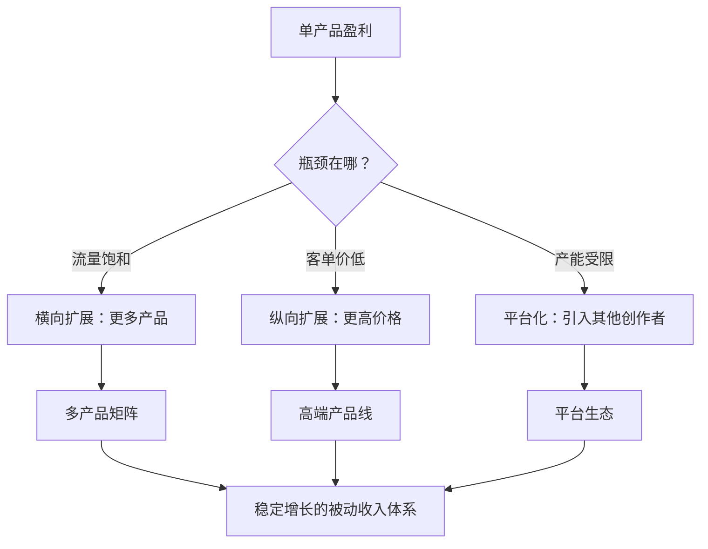

## 八、常见问题解答（核心技巧篇）

本节汇总读者在学习核心技巧过程中最常遇到的问题。这些问题按主题分类，涵盖项目选择、构建方法、系统化运营、组合策略、规模化和退出策略六大模块。每个回答都力求给出可操作的建议，而非泛泛而谈。

---

### 一、项目选择相关问题

#### Q1：我有好几个想法，如何判断先做哪一个？

不要凭直觉选择，用**五维评估模型**（详见本章第一节）对每个想法打分。具体操作：

1. 把所有想法列在一张表里
2. 对每个想法分别评估市场需求、个人优势匹配、启动成本、自动化潜力、可扩展性五个维度（每项 1-10 分）
3. 加权计算总分（市场需求×3、个人优势×2.5、启动成本×2、自动化×1.5、可扩展性×1）
4. 总分最高且 ≥ 40 分的优先立项

如果两个想法分数接近（差距 < 5 分），优先选择**启动成本更低**的那个——因为你可以在更短时间内验证它，失败了损失也更小。

#### Q2：需求验证做到什么程度才算"够了"？

至少满足以下全部条件才值得进入开发阶段：

- 找到 3 个以上竞品，且至少 1 个有明确的付费用户（不是"看起来有人做"，而是真的有人在付钱）
- 相关关键词在百度指数或微信指数有稳定或上升的搜索趋势
- 在知乎、小红书、Reddit 等平台找到 10 个以上相关的真实提问
- 确认用户愿意支付的价格区间（通过竞品定价反推）
- 与至少 3 个目标用户进行过一对一沟通，确认痛点真实存在

**最常见的错误是跳过需求验证直接开发。** 数据显示，未做需求验证的被动收入项目失败率超过 80%。花 1-2 周做验证，比盲目投入 3 个月有价值得多。

#### Q3：我没有特别突出的技能，还能做被动收入吗？

可以，但需要调整策略。被动收入不要求你是某个领域的顶尖专家，只要求你比目标受众**领先半步**。具体方法：

1. **盘点现有技能**：列出你工作中用到的所有技能，即使你觉得"很普通"。比如你做了 3 年 Excel 报表，对于刚入职的新人来说你就是专家
2. **组合技能**：单个技能可能不突出，但两三个技能的交叉点往往是蓝海。比如"懂财务 + 会 Python"可以做财务自动化工具
3. **从"学习者"角度出发**：你刚学会一项技能，比学了 10 年的人更懂初学者的痛点。把你的学习过程整理成教程，本身就是产品
4. **选择低技能门槛的类型**：指数基金投资、联盟营销等类型对专业技能要求较低，更依赖执行力和耐心

#### Q4：热门赛道和冷门赛道怎么选？

**既不选最热的，也不选最冷的，选"温热"的。** 判断标准：

| 赛道温度 | 特征 | 建议 |
|----------|------|------|
| 过热（红海） | 头部玩家占据 80% 市场，新人极难突围 | 除非你有明显差异化优势，否则避开 |
| 温热（最佳） | 有明确需求，竞争存在但不充分，头部玩家没有形成垄断 | 优先选择 |
| 冷门（蓝海） | 需求不确定，可能是真蓝海也可能是伪需求 | 需要做更严格的需求验证 |

验证一个"温热"赛道的方法：在电商平台搜索相关产品，如果前 10 名的月销量在 100-1000 之间（不是 10 也不是 10000），说明市场有需求但尚未被垄断。

---

### 二、构建方法相关问题

#### Q5：做数字产品应该从哪种类型开始？

根据你的能力特征选择起点：

| 你的优势 | 推荐起步产品 | 制作周期 | 典型定价 |
|----------|------------|---------|---------|
| 文字能力强 | 电子书 / 操作手册 | 1-3 个月 | 29-99 元 |
| 设计能力强 | 模板 / 素材包 | 2-4 周 | 49-299 元 |
| 编程能力强 | 小工具 / 插件 | 1-2 个月 | 99-999 元 |
| 教学能力强 | 在线课程 / 训练营 | 2-4 个月 | 199-1999 元 |
| 信息整合能力强 | 资源包 / 工具箱 | 1-2 周 | 19-99 元 |

**关键原则：第一个产品应该是你能用最短时间做出来的东西。** 不是因为它最赚钱，而是因为你需要快速完成"从想法到产品到第一笔收入"的完整闭环。这个闭环的经验比产品本身更有价值。

#### Q6：电子书自出版选哪个平台？

主流平台对比：

| 平台 | 分成比例 | 优势 | 劣势 | 适合场景 |
|------|---------|------|------|---------|
| Amazon KDP | 35%-70% | 全球最大市场，长尾流量好 | 中文市场较小，需要英文内容 | 英文内容 / 面向全球读者 |
| 豆瓣阅读 | 50%-70% | 中文艺文类口碑好 | 品类有限，流量不大 | 文艺 / 知识类中文内容 |
| 知乎盐选 | 平台分成 | 自带流量，知乎推荐机制 | 内容定价权在平台 | 知识科普 / 问答类内容 |
| 微信读书 | 平台分成 | 用户基数大 | 审核严格，分成不透明 | 中文书 / 出版物 |
| 小报童 / 竹白 | 90%+ | 自主定价，直接触达读者 | 需要自己引流 | 已有读者群体的创作者 |
| Gumroad | 90%+ | 全球市场，支持多币种 | 国内支付不便 | 英文内容 / 面向海外 |

**建议策略**：不要只选一个平台。电子书可以在多个平台同时上架（除非签了独家协议）。先从你已有受众的平台开始，再逐步扩展到其他平台。

#### Q7：股息投资需要多少本金才能有可观的被动收入？

用数据说话。假设你追求年化 4% 的股息率：

| 目标月被动收入 | 所需本金 | 年股息总额 |
|--------------|---------|-----------|
| 1,000 元 | 30 万 | 12,000 元 |
| 3,000 元 | 90 万 | 36,000 元 |
| 5,000 元 | 150 万 | 60,000 元 |
| 10,000 元 | 300 万 | 120,000 元 |

这意味着股息投资**不适合零起步**。它的正确使用方式是：

1. 先通过其他被动收入类型（数字产品、内容平台等）积累第一桶金
2. 将被动收入的一部分持续投入股息组合
3. 利用复利效应（股息再投资 DRIP）加速增长

**一个可行的路径**：先做数字产品（月入 5000 元），每月拿出 3000 元定投高股息 ETF，5 年后股息组合每月可产生约 2000-3000 元被动收入。此时你有两条被动收入河流。

#### Q8：联盟营销网站真的能自动化运营吗？

可以做到**高度自动化**，但不是"完全不需要管"。现实情况：

**可以自动化的环节：**
- 内容发布（定时发布系统）
- 链接管理（自动替换联盟链接）
- SEO 基础优化（自动生成 meta 标签、sitemap）
- 数据监控（自动追踪点击和转化）

**需要人工介入的环节：**
- 内容创作（AI 可以辅助，但核心观点和实操体验需要人写）
- 关键词策略调整（每月审视一次）
- 竞品监控（每季度分析一次）
- 技术维护（服务器、安全更新，每月 1-2 小时）

一个成熟的联盟营销网站，在运营 6 个月后，每周投入时间可降至 **3-5 小时**。这已经是"半被动"状态了。如果想进一步减少投入，可以把内容创作外包给写手，但需要建立质量审核流程。

---

### 三、系统化运营相关问题

#### Q9：如何判断一个项目是否真的"被动"了？

用以下指标量化判断：

| 指标 | 真被动 | 假被动 |
|------|--------|--------|
| 每周投入时间 | ≤ 5 小时 | > 10 小时 |
| 收入是否与你的时间直接挂钩 | 不挂钩（即使你停 2 周，收入不变） | 挂钩（你停了收入就停） |
| 是否可以交给别人运营 | 可以，有 SOP 文档 | 不可以，全在你脑子里 |
| 客户是否需要你本人出现 | 不需要 | 需要（认你的脸/声音） |
| 核心流程是否有自动化工具支撑 | 有 | 没有，全靠手动 |

**一个简单测试**：如果你离开这个项目 2 周（完全不看、不处理），收入会下降多少？如果下降 < 10%，说明它是真被动；如果下降 > 50%，说明它本质上还是主动收入。

#### Q10：SOP 文档应该包含哪些内容？

一份合格的被动收入项目 SOP 至少包含以下模块：

```text
一、项目概述
  - 项目是什么，解决什么问题
  - 目标客户是谁
  - 核心收入来源和金额

二、日常运营流程
  - 每日任务清单（含时间预估）
  - 每周任务清单
  - 每月任务清单
  - 每季度任务清单

三、关键操作步骤（逐步图文说明）
  - 订单处理流程
  - 客服响应模板（常见问题 + 标准回答）
  - 内容发布流程
  - 数据监控和报表生成

四、异常处理手册
  - 网站宕机怎么办
  - 支付失败怎么办
  - 客户投诉升级流程
  - 供应商断货应急方案

五、工具和账号清单
  - 所有相关平台的登录信息（用密码管理器管理）
  - 关键工具的使用说明
  - 付费订阅的续费时间和金额

六、关键指标和阈值
  - 哪些数据需要监控
  - 数据低于多少需要预警
  - 数据高于多少说明需要扩容
```

**SOP 的核心价值**：让你可以把项目交给一个完全不了解它的人来运营。如果一份 SOP 不能让一个新手在 1 天内上手基本操作，说明它还不够详细。

#### Q11：自动化工具选型有什么建议？

按功能模块推荐常用工具：

| 功能 | 推荐工具（免费/低成本） | 推荐工具（付费/专业） |
|------|----------------------|---------------------|
| 邮件营销自动化 | Mailchimp（免费版）、MailerLite | ConvertKit、ActiveCampaign |
| 客服自动回复 | 微信自动回复助手、ChatGPT API | Zendesk、Intercom |
| 内容定时发布 | WordPress 定时发布、微信公众号定时 | Buffer、Hootsuite |
| 数据分析 | Google Analytics、百度统计 | Mixpanel、Amplitude |
| 支付和收款 | 支付宝当面付、微信支付 | Stripe、Paddle |
| 项目管理 | Notion（免费版）、飞书 | Asana、Monday |
| 文件自动交付 | 百度网盘分享、蓝奏云 | Gumroad 自动交付、SendOwl |

**选型原则**：
1. 先用免费工具验证流程，再考虑付费工具提升效率
2. 优先选择有 API 接口的工具，方便后续打通自动化
3. 不要追求"全自动"，80% 自动化 + 20% 人工检查是更安全的策略

---

### 四、组合策略相关问题

#### Q12：同时做几个被动收入项目比较合适？

**答案是 2-3 个，不超过 3 个。** 具体分配：

| 项目角色 | 数量 | 你的投入占比 | 要求 |
|----------|------|------------|------|
| 核心项目 | 1 个 | 50-60% | 已经产生稳定收入，需要维护和优化 |
| 增长项目 | 1 个 | 30-40% | 正在建设中，有望成为下一个核心项目 |
| 探索项目 | 0-1 个 | 10-20% | 试验性的，验证新方向 |

**为什么不能同时做太多？**
- 每个被动收入项目在前期都需要大量集中投入。同时做 5 个项目，每个投入 20% 的精力，结果是 5 个项目都做不成
- 注意力切换有隐性成本。从项目 A 切换到项目 B，大脑需要 15-23 分钟重新进入状态（来源：加州大学尔湾分校 Gloria Mark 教授的研究）
- 多项目并行会让你在每个项目上都看不到进展，从而丧失动力

**正确的节奏**：先把核心项目做到"半被动"状态（每周投入 ≤ 5 小时），再启动增长项目。增长项目做到"半被动"后，再考虑探索新方向。

#### Q13：被动收入项目之间应该如何关联？

最优策略是让项目之间形成**能力复用**和**流量互导**：

```text
示例：一个内容创作者的被动收入组合

电子书 ←── 复用 ──→ 在线课程
  ↑                      ↑
  │    流量互导            │
  ↓                      ↓
博客/公众号 ──→ 联盟营销收入
  │
  └──→ 付费社群（半被动）
```

**能力复用的好处**：写电子书的素材可以改编成课程大纲，课程的学员反馈可以成为博客内容，博客的流量可以导流到联盟营销链接。同样的核心能力（内容创作），产生了 4 个收入来源。

**反面案例**：如果你同时做"投资理财内容"和"手工饰品电商"，两个领域完全不相关，能力无法复用，流量无法互导，相当于在做两个独立的创业项目。

---

### 五、规模化相关问题

#### Q14：什么时候应该开始规模化？

当以下条件**全部满足**时：

1. 你的项目已经实现盈利（收入 > 运营成本）
2. 产品-市场匹配已被验证（有复购用户或稳定新客流入）
3. 核心流程已标准化（有 SOP 文档）
4. 你清楚知道收入的瓶颈在哪里（是流量不够？还是转化率低？还是客单价低？）

**过早规模化的危害**：在产品-市场匹配尚未验证时就投入大量资源推广，相当于把错误的东西推给更多人。不仅浪费钱，还会收到大量负面反馈，打击信心。

#### Q15：规模化有哪几种路径？

三条路径，适用于不同阶段：

**路径一：横向扩展（更多产品）**
- 适用场景：第一个产品已经成功，验证了你的能力
- 方法：在同一个领域开发更多产品（比如写第二本电子书、开发第二个模板包）
- 风险：精力分散，每个产品都做不精
- 建议：新产品应与现有产品有 70% 以上的能力复用

**路径二：纵向扩展（更高价格）**
- 适用场景：你的产品已经获得市场认可，用户信任度高
- 方法：推出高级版、一对一咨询、定制化服务等高客单价产品
- 风险：高客单价意味着高期望值，交付质量必须跟上
- 建议：先用免费/低价产品建立信任，再推出高价产品

**路径三：平台化（让别人在你的平台上卖）**
- 适用场景：你已经有了稳定的流量和品牌
- 方法：开放平台让其他创作者入驻，你收取佣金
- 风险：平台运营复杂度急剧上升，质量控制困难
- 建议：这是最终形态，至少需要 2 年以上的运营经验



#### Q16：外包应该从哪个环节开始？

**从最低价值、最高重复性的环节开始。** 优先级排序：

1. **第一批外包**：客服回复、订单处理、数据录入等重复性工作
2. **第二批外包**：内容初稿撰写、图片处理、基础设计
3. **第三批外包**：SEO 优化、广告投放、社交媒体运营
4. **最后才外包**：核心内容创作、产品策略、品牌定位

**外包平台推荐**：
- 国内：猪八戒网、闲鱼（搜索"代运营"）、豆瓣小组
- 国际：Upwork、Fiverr、OnlineJobs.ph（菲律宾 VA）

**外包的核心原则**：先把流程标准化（写好 SOP），再外包。没有 SOP 就外包，等于把混乱放大了。

---

### 六、退出策略相关问题

#### Q17：什么信号说明应该退出一个项目？

以下信号出现 3 个以上，应该认真考虑退出：

1. **收入持续下降**：连续 3 个月收入环比下降 > 10%，且你已经尝试了优化措施
2. **维护成本上升**：运营成本占收入的比例从 20% 上升到 50% 以上
3. **市场萎缩**：目标市场的搜索量、用户量、讨论量持续下降
4. **竞争碾压**：出现资金和团队远超你的竞争对手，且你没有差异化优势
5. **兴趣丧失**：你对这个领域完全失去兴趣，每次处理相关事务都感到痛苦
6. **机会成本过高**：你发现了明显更好的方向，但当前项目占用了你所有时间

**不要因为"沉没成本"而继续坚持。** 你已经投入了 6 个月不代表必须再投入 6 个月。理性评估未来的投入产出比，而不是回顾过去的投入。

#### Q18：退出时如何最大化项目剩余价值？

从高到低排列的退出方式：

| 退出方式 | 适用条件 | 预期回收价值 | 操作难度 |
|----------|---------|------------|---------|
| 整体出售 | 项目有稳定收入和用户 | 年利润的 2-4 倍 | 中（需要找买家、谈判、交接） |
| 转让给合作伙伴 | 有合适的接手人 | 协商定价 | 低 |
| 转型复用 | 项目的核心资产（内容、用户、品牌）可以用于新方向 | 无法直接变现，但节省新项目启动成本 | 低 |
| 停止运营 | 项目价值太低，不值得出售 | 0（但节省了后续维护成本） | 最低 |

**出售平台推荐**：
- 国际：MicroAcquire、Flippa、Empire Flippers（适合 SaaS、网站）
- 国内：A5 交易、鱼爪网（适合域名、网站、公众号）

**出售前的准备清单**：
- 整理至少 12 个月的收入和流量数据
- 编写完整的运营文档（SOP）
- 确保所有数字资产（域名、账号、代码）可以顺利交接
- 清理所有未结清的合同和账款

---

### 七、心态与认知相关问题

#### Q19：做了 3 个月还没有收入，应该放弃吗？

不一定。判断标准不是"有没有收入"，而是"有没有进展信号"：

| 进展信号 | 含义 | 建议 |
|----------|------|------|
| 有流量但没转化 | 产品/定价有问题 | 调整产品或定价，继续 |
| 有少量用户反馈 | 需求存在，产品需要优化 | 根据反馈迭代产品 |
| 有竞品在赚钱 | 市场存在，你的方法需要调整 | 研究竞品策略，优化自己的方法 |
| 完全没有流量 | 可能方向有问题 | 重新审视需求验证，考虑调整方向 |
| 有流量有互动但没人付费 | 需求可能是"想要"而非"需要" | 严重考虑转型 |

**核心原则**：3 个月没有收入是正常的，但 3 个月没有任何进展信号是危险的。进展信号包括：流量增长、用户互动、收藏/关注增长、竞品动态等。

#### Q20：被动收入和全职工作如何平衡？

对于在职人员，推荐以下时间分配策略：

**工作日（每天 1-1.5 小时）：**
- 早起 1 小时（6:00-7:00）用于核心创作（写作、开发、设计）
- 通勤时间用于信息输入（听播客、读行业文章）
- 午休 15-30 分钟处理简单任务（回复评论、数据查看）

**周末（每天 3-4 小时）：**
- 周六：深度工作（课程录制、产品开发、策略规划）
- 周日：轻度工作（内容排版、社媒发布、数据分析）

**每周总投入：10-15 小时**

这个强度可以持续 6-12 个月而不影响主业和健康。关键是**保持一致性**——每周 10 小时持续半年，比某一周投入 40 小时然后停三周效果好得多。

**绝对不要为了被动收入项目而影响全职工作的表现。** 全职工作是你最大的现金流来源，也是被动收入项目前期投入的资金保障。

---

### 八、技术与工具相关问题

#### Q21：完全不懂技术，能做哪些类型的被动收入？

按技术门槛从低到高排列：

| 技术门槛 | 可做类型 | 需要学习的内容 | 入门时间 |
|----------|---------|--------------|---------|
| 零门槛 | 电子书写作、付费社群、联盟营销（社交媒体推广） | 无 | 立即可开始 |
| 低门槛 | 在线课程（用现成平台）、设计模板（用 Canva） | 基础工具操作 | 1-2 周 |
| 中门槛 | 自建博客/网站、SEO 优化 | WordPress / Hugo 基础、SEO 知识 | 1-2 个月 |
| 高门槛 | SaaS 开发、自动化系统搭建 | 编程、数据库、部署 | 6-12 个月 |

**建议**：从零门槛类型开始，同时利用业余时间学习基础技术技能。技术能力的提升会让你的被动收入项目有更多可能性。

#### Q22：AI 工具能否加速被动收入项目的构建？

可以，而且效果显著。以下是 AI 工具在被动收入构建各环节的应用：

| 环节 | AI 工具应用 | 注意事项 |
|------|-----------|---------|
| 需求调研 | 用 ChatGPT / Claude 分析竞品评论，提取用户痛点 | AI 分析需要人工验证，不要完全依赖 |
| 内容创作 | AI 辅助写初稿、生成大纲、扩展论点 | 核心观点和实操体验必须是真实的，AI 不能编造 |
| 设计 | 用 Midjourney / DALL-E 生成配图、封面 | 注意版权问题，商用需确认许可 |
| 编程 | 用 Cursor / GitHub Copilot 辅助开发 | 代码质量需要人工审查 |
| 客服 | 用 AI chatbot 处理常见问题 | 复杂问题仍需人工介入 |
| 数据分析 | 用 AI 分析销售数据、用户行为 | AI 洞察需要结合业务经验判断 |

**核心原则**：AI 是效率工具，不是替代品。用 AI 把每个环节的效率提升 30-50%，但核心策略、品牌定位、用户关系仍然需要你自己把控。

---

### 本节总结

常见问题的本质是**认知与行动之间的落差**。知道"应该做需求验证"和"知道需求验证做到什么程度算够"是两回事。本节的 22 个问题覆盖了被动收入构建核心技巧中最容易卡住的环节，每个回答都给出了具体的操作标准和判断依据。

如果你的问题不在本节覆盖范围内，建议：
1. 回到对应的核心技巧章节查找详细内容
2. 参考实战案例中类似场景的处理方式
3. 在实践过程中记录自己的问题和解决方案，逐步形成个人知识库

> **记住：最好的 FAQ 是你自己的实践经验。当你把一个问题从"不确定"变成"我试过了，结果是这样"，你就完成了一次真正的成长。**
