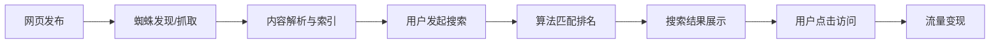
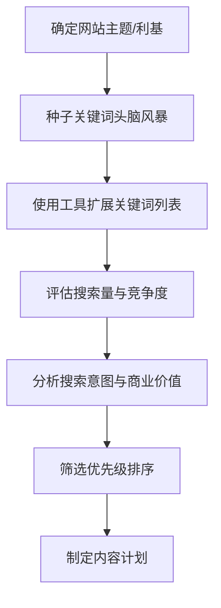
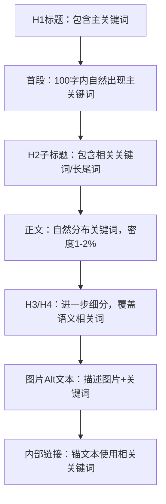
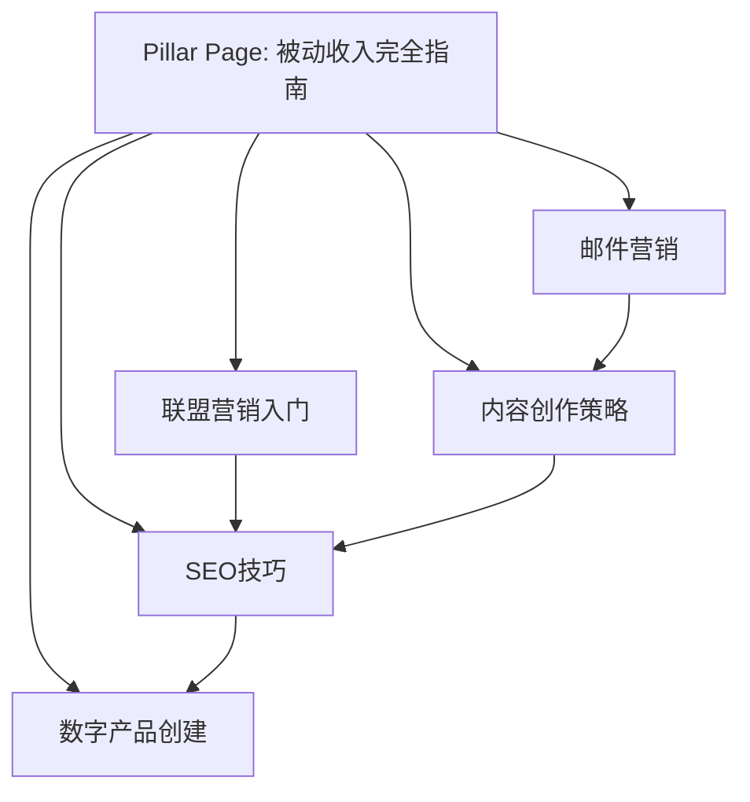
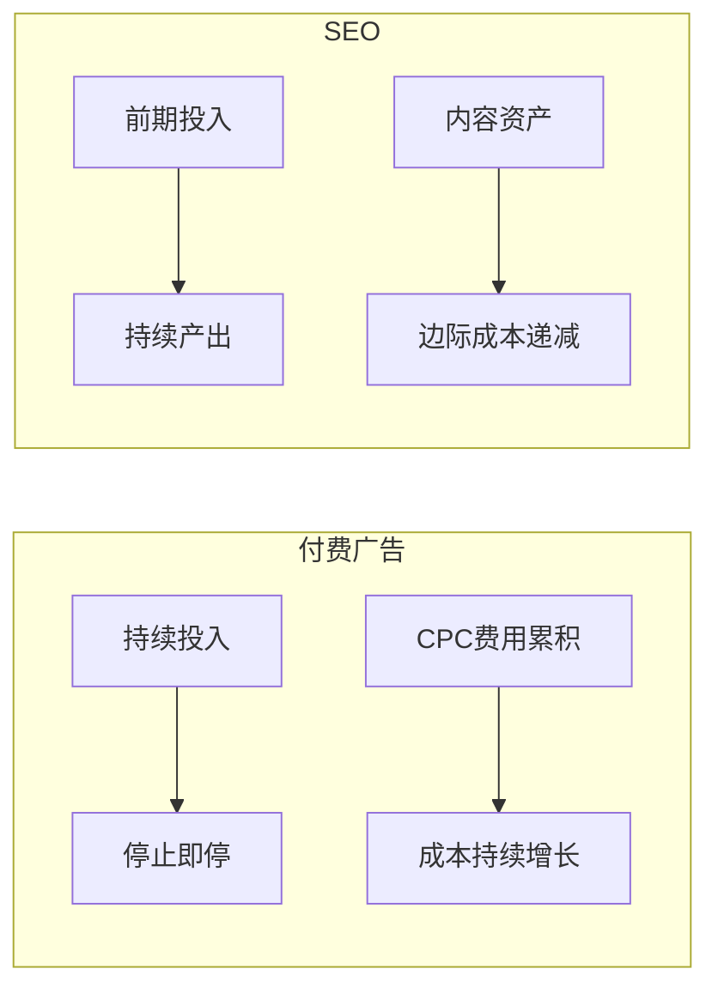

## 九、被动收入的SEO技巧

SEO（搜索引擎优化）是被动收入体系中最核心的流量获取手段。与付费广告不同，SEO流量具有**边际成本趋零**的特性——一篇文章排到搜索结果第一页后，可以持续数月甚至数年带来免费流量，而你不需要为每次点击付费。这种"一次投入、持续回报"的模式，与被动收入的理念高度契合。

本节将从搜索引擎工作原理讲起，系统覆盖关键词研究、站内优化、技术SEO、外链建设、内容策略五大模块，并针对被动收入的不同场景（联盟营销站、内容博客、数字产品、SaaS等）给出具体打法。

---

### 1. 理解搜索引擎的工作原理

要做好SEO，首先要理解搜索引擎如何发现、理解和排名网页。

#### 1.1 搜索引擎的三个核心阶段

| 阶段 | 英文 | 说明 |
|------|------|------|
| 抓取 | Crawling | 搜索引擎蜘蛛（如Googlebot）沿着链接爬行，发现并下载网页内容 |
| 索引 | Indexing | 对抓取到的内容进行解析、去重、存储，建立倒排索引 |
| 排名 | Ranking | 根据用户查询，在索引库中检索并按相关性+权威性排序返回结果 |



#### 1.2 排名的核心因素

Google的排名算法考虑200+因素，但核心可归纳为四大类：

1. **内容相关性**：页面内容是否匹配用户的搜索意图
2. **内容质量**：E-E-A-T（经验Experience、专业性Expertise、权威性Authoritativeness、可信度Trustworthiness）
3. **技术基础**：页面加载速度、移动端适配、结构化数据、安全性（HTTPS）
4. **外部信号**：其他网站的链接（反向链接/外链）数量和质量

百度的搜索算法与Google类似，但更重视中文分词、百家号内容权重、以及网站备案等本土因素。

#### 1.3 搜索意图的四种类型

理解搜索意图是SEO的基石。每个关键词背后都有用户的真实目的：

| 意图类型 | 英文 | 示例关键词 | 内容策略 |
|----------|------|-----------|----------|
| 信息型 | Informational | "什么是ETF"、"如何泡绿茶" | 教程、指南、百科文章 |
| 导航型 | Navigational | "淘宝登录"、"微信公众号" | 品牌页面、首页 |
| 商业调研型 | Commercial Investigation | "最好的降噪耳机"、"XX和YY哪个好" | 对比评测、排行榜 |
| 交易型 | Transactional | "买iPhone 16"、"XX优惠券" | 产品页、购买指南 |

**被动收入的关键洞察**：商业调研型和交易型关键词的转化率最高，但竞争也最激烈。信息型关键词流量大、竞争低，适合用来建立权威性和获取大量长尾流量。最佳策略是**先用信息型内容建立网站权重，再逐步攻克商业型关键词**。

---

### 2. 关键词研究：找到有商业价值的流量入口

关键词研究是SEO的第一步，也是决定成败的关键步骤。选错关键词，后续所有努力都可能白费。

#### 2.1 关键词研究的核心框架



#### 2.2 关键词工具矩阵

| 工具 | 类型 | 适用场景 | 费用 |
|------|------|---------|------|
| Google Keyword Planner | 免费 | 基础搜索量和竞价数据 | 免费（需Google Ads账户） |
| Ahrefs | 付费 | 全面的关键词分析、竞争分析、外链分析 | $99/月起 |
| SEMrush | 付费 | 关键词研究、竞争分析、站点审计 | $129/月起 |
| Ubersuggest | 免费/付费 | 入门级关键词研究 | 免费有限额，$29/月 |
| 5118 | 付费 | 中文关键词研究首选 | 免费有限额，VIP 199元/月起 |
| 站长工具(chinaz) | 免费 | 百度SEO基础查询 | 免费 |
| Google Search Console | 免费 | 查看自己网站的实际搜索表现 | 免费 |
| Answer The Public | 免费/付费 | 发现用户提问型关键词 | 免费有限额 |
| Keywords Everywhere | 浏览器插件 | 随时查看关键词数据 | $10/10万次查询 |

#### 2.3 长尾关键词策略

对于新建网站，直接竞争高搜索量的头部关键词几乎不可能获胜。正确的策略是从**长尾关键词**切入：

- **头部关键词**（Head）："减肥"——搜索量巨大，竞争极强
- **中段关键词**（Body）："快速减肥方法"——搜索量中等，竞争较强
- **长尾关键词**（Long-tail）："产后妈妈三个月减肥计划"——搜索量小，竞争低，转化率高

**长尾关键词的优势**：
- 竞争度低，新站也能在短期内获得排名
- 搜索意图明确，转化率通常比头部词高2-3倍
- 大量长尾词的总流量往往超过少数头部词
- 内容创作难度低，更容易做到深度覆盖

**长尾词挖掘方法**：

1. **Google搜索建议**：在搜索框输入关键词，查看下拉建议和底部"相关搜索"
2. **Google People Also Ask**：搜索结果中的"人们还问"板块
3. **竞争对手分析**：用Ahrefs/SEMrush查看竞争对手排名的关键词
4. **论坛和社区**：知乎、百度贴吧、Reddit中用户的真实提问
5. **关键词工具的Questions筛选**：Ahrefs的Questions功能、Answer The Public

#### 2.4 关键词评估的四个维度

| 维度 | 评估标准 | 优先级 |
|------|---------|--------|
| 搜索量 | 月搜索量100-10000适合新站 | 中 |
| 竞争度 | KD（关键词难度）<30优先 | 高 |
| 商业价值 | 是否有明确的变现路径（购买、注册等） | 高 |
| 内容缺口 | 现有排名内容质量是否低、是否有差异化空间 | 高 |

**被动收入场景的关键词分类**：

- **评测类**："XX产品测评"、"XX vs YY"——直接关联联盟佣金，商业价值最高
- **教程类**："如何使用XX"——流量大，可在教程中嵌入推荐链接
- **列表类**："2026年最好的10款XX"——适合联盟营销，转化率高
- **问题解答类**："XX怎么选"——搜索意图明确，适合引导用户做购买决策
- **资源汇总类**："免费XX模板下载"——适合引流到邮件列表，后续转化

---

### 3. 站内SEO（On-Page SEO）

站内SEO是指在网页内部进行的优化工作，是你可以完全控制的部分。

#### 3.1 Title标签优化

Title标签是SEO中权重最高的页面元素之一，直接影响点击率和排名。

**Title标签的规则**：
- 长度控制在50-60个字符（中文25-30字），超过会被截断
- 将目标关键词放在Title最前面或靠前位置
- 每个页面的Title必须唯一
- 加入品牌名（通常放在末尾，用分隔符隔开）
- 包含数字或吸引力词汇可提升点击率

**示例对比**：

| 差的Title | 好的Title |
|-----------|-----------|
| 我的博客 | 2026年10款最佳降噪耳机评测｜真实体验对比 |
| 文章标题 | Shopify vs WooCommerce对比评测：哪个更适合建站？ |
| 产品页 | 限时优惠｜XX品牌无线蓝牙耳机 免费配送 |

#### 3.2 Meta Description优化

Meta Description不直接影响排名，但影响搜索结果的点击率（CTR），而CTR间接影响排名。

- 长度控制在150-160个字符（中文75-80字）
- 包含目标关键词（搜索时会加粗显示）
- 用行动号召（CTA）吸引点击
- 准确描述页面内容，不欺骗用户

#### 3.3 内容中的关键词布局



**关键词密度**：这是老SEO的概念，现在更重要的是**语义相关性**（LSI关键词/语义关键词）。例如，文章讨论"咖啡机"，应该自然提到"研磨"、"萃取"、"意式浓缩"、"滴滤"等语义相关词，而不是机械重复"咖啡机"。

#### 3.4 内容结构优化

良好的内容结构不仅利于SEO，也提升用户体验：

1. **使用层级标题**（H1→H2→H3→H4），形成清晰的目录结构
2. **添加目录**（Table of Contents），帮助用户快速导航
3. **段落简短**，每段不超过4-5行（移动端体验）
4. **使用列表和表格**，让信息更易扫读
5. **添加图片和视频**，丰富内容形式，增加停留时间
6. **FAQ部分**，直接回答相关问题，有机会获得Google精选摘要

#### 3.5 内部链接策略

内部链接是SEO中经常被忽视但效果显著的策略：

- **从高权重页面链接到需要提升的页面**：用Ahrefs查看哪些页面反向链接最多，从这些页面添加内链
- **使用描述性锚文本**：不要用"点击这里"，用"如何选择关键词工具"这样的描述性文字
- **建立主题集群（Topic Cluster）**：一个核心页面（Pillar Page）+ 多个子话题页面（Cluster Pages），互相链接



#### 3.6 图片SEO

- **文件名**：用描述性名称，如`best-noise-cancelling-headphones-2026.jpg`，而不是`IMG_20260315.jpg`
- **Alt文本**：准确描述图片内容，自然包含关键词
- **文件大小**：压缩到100KB以内（使用TinyPNG、Squoosh等工具）
- **格式选择**：照片用WebP（比JPEG小25-35%），图标用SVG
- **懒加载**：非首屏图片使用`loading="lazy"`属性

---

### 4. 技术SEO（Technical SEO）

技术SEO确保搜索引擎能正确抓取、索引和理解你的网站。

#### 4.1 网站速度优化

页面加载速度是Google的直接排名因素，也是用户体验的核心指标。

**核心指标（Core Web Vitals）**：

| 指标 | 英文全称 | 良好标准 | 说明 |
|------|---------|---------|------|
| LCP | Largest Contentful Paint | <2.5秒 | 最大内容元素的渲染时间 |
| INP | Interaction to Next Paint | <200毫秒 | 用户交互到页面响应的时间 |
| CLS | Cumulative Layout Shift | <0.1 | 页面布局的累计偏移量 |

**速度优化清单**：

1. **选择优质主机**：避免廉价共享主机，推荐Cloudflare Pages（免费）、Vercel（免费）、或者VPS
2. **启用CDN**：Cloudflare免费版即可显著提升全球访问速度
3. **图片优化**：使用WebP格式、响应式图片（srcset）、懒加载
4. **代码精简**：CSS/JS压缩、Tree Shaking、Code Splitting
5. **浏览器缓存**：设置合理的Cache-Control头
6. **减少第三方脚本**：每个第三方脚本都会增加加载时间
7. **使用HTTP/2或HTTP/3**：多路复用，减少连接开销
8. **预加载关键资源**：`<link rel="preload">`

**静态网站的优势**：对于内容驱动的被动收入网站（博客、联盟营销站），使用Hugo、Next.js等静态站点生成器可以实现极快的加载速度——页面在构建时就已生成为静态HTML，服务器直接返回，无需数据库查询。

#### 4.2 移动端优化

Google自2019年起采用移动优先索引（Mobile-First Indexing），即以移动版页面作为索引和排名的主要依据。

- **响应式设计**：同一URL在不同设备上自适应布局
- **字体大小**：正文不小于16px，行高1.5-1.8
- **触摸目标**：按钮和链接的可点击区域不小于48x48像素
- **避免弹窗干扰**：移动端的全屏弹窗会导致排名下降
- **测试工具**：Google的Mobile-Friendly Test

#### 4.3 网站架构优化

良好的网站架构帮助搜索引擎高效抓取所有页面：

```text
首页
├── 分类页1
│   ├── 文章1
│   ├── 文章2
│   └── 文章3
├── 分类页2
│   ├── 文章4
│   └── 文章5
├── 关于我们
└── 联系方式
```

**关键原则**：
- **点击深度**：任何页面从首页出发不超过3次点击即可到达
- **扁平化结构**：避免过深的目录层级
- **面包屑导航**：帮助用户和搜索引擎理解页面位置
- **XML Sitemap**：列出所有需要索引的页面，提交给搜索引擎
- **Robots.txt**：控制搜索引擎的抓取范围，屏蔽不需要索引的页面

#### 4.4 结构化数据（Schema Markup）

结构化数据帮助搜索引擎理解页面内容，并可能在搜索结果中展示富摘要（Rich Snippet），显著提升点击率。

**常见Schema类型**：

| Schema类型 | 适用场景 | 搜索结果展示 |
|------------|---------|-------------|
| Article | 博客文章、新闻 | 作者、日期、图片 |
| Product | 产品页面 | 价格、评分、库存 |
| Review | 评测文章 | 星级评分、评分者 |
| FAQ | FAQ页面 | 可展开的问答列表 |
| HowTo | 教程文章 | 步骤展示 |
| BreadcrumbList | 所有页面 | 面包屑导航路径 |
| VideoObject | 含视频的页面 | 视频缩略图、时长 |

**示例**（FAQ Schema的JSON-LD格式）：

```json
{
  "@context": "https://schema.org",
  "@type": "FAQPage",
  "mainEntity": [
    {
      "@type": "Question",
      "name": "什么是被动收入的SEO技巧？",
      "acceptedAnswer": {
        "@type": "Answer",
        "text": "被动收入的SEO技巧是指通过搜索引擎优化获取持续免费流量的方法，包括关键词研究、内容优化、技术SEO和外链建设等。"
      }
    }
  ]
}
```

#### 4.5 网站安全

- **HTTPS**：使用SSL/TLS证书（Let's Encrypt免费），这是Google的直接排名因素
- **定期更新**：CMS（如WordPress）和插件保持最新版本
- **防恶意软件**：定期扫描，避免被黑客植入恶意代码
- **备份策略**：定期备份，确保可快速恢复

---

### 5. 外链建设（Off-Page SEO）

外链（反向链接）仍然是搜索引擎排名最重要的因素之一。其他网站链接到你，相当于对你的内容"投票"，链接越多越权威，排名越高。

#### 5.1 外链质量评估

不是所有外链都有价值，高质量外链远胜于大量低质量外链：

| 因素 | 高质量外链 | 低质量外链 |
|------|-----------|-----------|
| 来源网站权威性 | 高DA（Domain Authority）网站 | 新站、垃圾站 |
| 相关性 | 同行业/同主题网站 | 完全不相关的网站 |
| 链接类型 | 编辑链接（自然嵌入内容中） | 目录链接、评论链接、页脚链接 |
| 锚文本 | 描述性、多样化 | 全部使用精确匹配关键词 |
| 位置 | 正文内容中 | 侧边栏、页脚 |
| Follow属性 | dofollow | 仅nofollow |

#### 5.2 白帽外链建设方法

**方法一：内容驱动的自然外链**

这是最安全、最持久的方法。创建真正有价值的资源性内容，让其他网站主动引用：

- **原创研究和数据**：发布行业调查、数据分析报告
- **信息图表（Infographic）**：将复杂信息可视化，容易获得分享和引用
- **终极指南（Ultimate Guide）**：对某个主题做最全面的覆盖
- **免费工具**：如计算器、模板、清单等实用工具
- **争议性观点**：提出独到见解，引发讨论和引用

**方法二：客座文章（Guest Posting）**

在同行业的其他网站上发表文章，在文章中自然地嵌入指向自己网站的链接。

操作流程：
1. 搜索"你的行业 + write for us"或"投稿"找到接受客座文章的网站
2. 研究对方网站的内容风格和受众
3. 提出3-5个选题，发邮件给编辑
4. 写一篇高质量的文章，自然嵌入1-2个链接
5. 发布后在社交媒体推广

**方法三：断链建设（Broken Link Building）**

1. 用Ahrefs等工具找到竞争对手网站上的断链（404页面）
2. 创建一篇比原链接页面更好的替代内容
3. 联系链接到断链页面的网站，建议用你的内容替换

**方法四：资源页面链接建设**

很多网站有"资源推荐"、"工具推荐"页面，主动联系并推荐你的优质内容。

#### 5.3 外链建设的禁忌

以下方法属于黑帽SEO，可能导致网站被搜索引擎惩罚：

- **购买链接**：直接付钱购买dofollow链接
- **链接交换网络**：大规模的互链计划
- **PBN（私人博客网络）**：建立一批低质量网站专门用于链接
- **评论垃圾**：在博客评论区大量留链接
- **自动化外链工具**：用软件批量发布外链
- **隐藏链接**：用CSS/JS隐藏链接，用户看不见但搜索引擎能抓取

#### 5.4 锚文本分布策略

自然的锚文本分布应该多样化：

| 锚文本类型 | 占比（参考） | 示例 |
|-----------|-------------|------|
| 品牌锚文本 | 30-40% | "XX博客"、"XX" |
| 裸URL | 15-20% | "https://example.com" |
| 通用锚文本 | 10-15% | "点击这里"、"了解更多" |
| 描述性锚文本 | 20-25% | "关于关键词研究的详细指南" |
| 精确匹配关键词 | 5-10% | "关键词研究方法" |

如果精确匹配关键词的锚文本占比过高（超过15%），可能触发Google的企鹅算法惩罚。

---

### 6. 针对不同被动收入模式的SEO策略

不同的被动收入模式需要不同的SEO侧重。

#### 6.1 联盟营销网站的SEO策略

联盟营销（Affiliate Marketing）是SEO变现最直接的方式，通过推荐产品赚取佣金。

**关键词策略**：

| 关键词类型 | 示例 | 意图 | 转化潜力 |
|-----------|------|------|---------|
| 产品评测 | "Ahrefs评测" | 商业调研 | 高 |
| 对比文章 | "Ahrefs vs SEMrush" | 商业调研 | 高 |
| 最佳推荐 | "2026年最好的SEO工具" | 商业调研 | 高 |
| 问题解决 | "如何做关键词研究" | 信息型 | 中 |
| 优惠券 | "Ahrefs优惠码" | 交易型 | 极高 |

**内容结构模板**（评测文章）：

```markdown
# [产品名] 评测：[年份]年最值得购买的[品类]吗？

## 快速结论（给没时间阅读全文的读者）
## 产品概述
## 核心功能详解
## 优点与缺点
## 价格与方案对比
## 与竞品对比
## 适合谁 / 不适合谁
## 常见问题（FAQ）
## 最终结论与购买建议
```

**关键原则**：
- 只推荐你真正使用过的产品，虚假推荐会损害信任
- 提供真实的优缺点分析，不要只说好话
- 用数据和截图支撑观点
- 明确披露联盟关系（FTC要求，也增加信任）

#### 6.2 内容博客的SEO策略

内容博客通过广告收入（如Google AdSense）、赞助内容、邮件列表变现。

**关键词策略**：
- 优先选择高搜索量的信息型关键词
- 关注CPC（每次点击成本）数据——CPC越高，广告收入潜力越大
- 覆盖广泛的长尾关键词，追求总流量最大化

**内容日历规划**：

| 周 | 内容类型 | 关键词难度 | 目标 |
|----|---------|-----------|------|
| 1-2 | 基础教程 | 低（KD<20） | 建立基础流量和索引 |
| 3-4 | 深度指南 | 中（KD 20-40） | 提升权威性 |
| 5-6 | 列表/汇总文 | 低-中 | 覆盖更多长尾词 |
| 7-8 | 原创研究/数据 | 中-高 | 吸引自然外链 |

#### 6.3 数字产品/在线课程的SEO策略

数字产品（电子书、课程、模板）通过直接销售获取收入。

**关键词策略**：
- **问题型关键词**：用户搜索问题时展示你的产品是解决方案
- **"如何做"关键词**：教程内容中自然引导到你的产品
- **行业/技能关键词**：覆盖目标用户可能搜索的所有相关话题

**转化优化**：
- 在高流量的信息型文章中嵌入产品推荐（自然不突兀）
- 创建专门的着陆页（Landing Page），针对购买意图关键词优化
- 使用结构化数据展示产品评分和价格
- 提供免费试用或部分内容预览，降低购买门槛

#### 6.4 SaaS产品的SEO策略

如果你开发了SaaS（软件即服务）产品，SEO是获取持续用户的关键渠道。

- **功能页面**：为每个核心功能创建独立页面，针对功能相关关键词优化
- **对比页面**："你的产品 vs 竞品"，这是SaaS SEO的杀手锏
- **集成页面**：为每个第三方集成创建页面，如"与Zapier集成"
- **模板/案例页面**：展示使用场景，覆盖场景相关关键词
- **文档中心**：帮助文档本身就是大量的SEO内容

---

### 7. 内容创作的SEO最佳实践

#### 7.1 内容长度与深度

内容长度不是排名因素，但深度是。研究表明，排名靠前的内容通常较长，这是因为深入的讨论自然需要更多篇幅。

**建议**：
- 信息型文章：2000-4000字（覆盖主题的各个方面）
- 产品评测：3000-5000字（详细的功能分析和使用体验）
- 终极指南：5000-10000字（全面覆盖，成为该主题的权威资源）
- 列表文章：每项至少200-300字的描述，不要只列名称

#### 7.2 内容更新策略

搜索引擎偏爱新鲜的内容。定期更新旧内容是提升排名的高性价比方法：

- 每3-6个月审查一次排名靠前的文章
- 更新过时的信息、数据和链接
- 添加新的章节或FAQ
- 更新年份标记（如标题中的"2025"改为"2026"）
- 检查并修复断链

#### 7.3 内容差异化

面对已经占据搜索结果的竞争对手，你需要提供他们没有的价值：

1. **更全面**：覆盖竞争对手遗漏的子话题
2. **更深入**：提供细节、数据、案例
3. **更新鲜**：包含最新的信息和趋势
4. **更好看**：更清晰的排版、更多的图片和图表
5. **更实用**：提供可下载的模板、清单、工具

#### 7.4 Google精选摘要（Featured Snippet）优化

精选摘要出现在搜索结果的最顶部（Position 0），能大幅提高点击率。

**优化方法**：
- 在文章中直接、简洁地回答问题（40-60字）
- 使用"什么是XX？"的问答格式
- 使用有序列表（步骤）或无序列表（要点）
- 使用表格呈现对比信息
- 在H2或H3标题中包含问题

---

### 8. 本地SEO（适用于本地业务的被动收入）

如果你的被动收入模式涉及本地业务（如本地服务目录、本地商家评测），本地SEO至关重要。

#### 8.1 Google Business Profile优化

- 填写完整、准确的商家信息
- 选择正确的业务类别
- 添加高质量照片
- 鼓励客户留下评价并及时回复
- 定期发布Google Posts

#### 8.2 本地关键词优化

- 在Title和内容中包含地名，如"北京最好的咖啡馆"
- 创建针对不同地区的独立页面
- 获取本地目录网站的引用（NAP一致性：名称Name、地址Address、电话Phone）

---

### 9. SEO工具链与工作流程

#### 9.1 每日任务

| 任务 | 工具 | 时间 |
|------|------|------|
| 检查网站排名变化 | Ahrefs/SEMrush Rank Tracker | 10分钟 |
| 查看Google Search Console数据 | GSC | 10分钟 |
| 回复新获得的外链请求/机会 | 邮箱 | 15分钟 |
| 监控竞争对手动态 | Ahrefs Alert | 10分钟 |

#### 9.2 每周任务

| 任务 | 工具 | 时间 |
|------|------|------|
| 发布1-2篇新内容 | WordPress/Hugo | 4-8小时 |
| 更新1篇旧内容 | CMS编辑器 | 1-2小时 |
| 外链建设活动 | 邮箱+BuzzStream | 2-3小时 |
| 技术SEO检查 | Screaming Frog | 30分钟 |

#### 9.3 每月任务

| 任务 | 工具 | 时间 |
|------|------|------|
| 全站技术审计 | Screaming Frog + Ahrefs Site Audit | 2-3小时 |
| 关键词机会分析 | Ahrefs/SEMrush | 1-2小时 |
| 内容策略调整 | 数据分析+规划 | 1-2小时 |
| 外链质量审查 | Ahrefs Backlink Profile | 1小时 |

#### 9.4 核心工具推荐

**免费工具**：
- Google Search Console：索引状态、搜索表现、技术问题
- Google Analytics 4：流量分析、用户行为
- PageSpeed Insights：页面速度测试
- Screaming Frog（免费版限500URL）：站点爬取和技术审计

**付费工具**：
- Ahrefs（$99/月起）：关键词研究、外链分析、竞争分析的行业标杆
- SEMrush（$129/月起）：功能全面的一体化SEO工具
- SurferSEO（$89/月起）：内容优化建议、SERP分析

---

### 10. SEO常见误区与纠正

| 误区 | 真相 | 纠正方法 |
|------|------|---------|
| 关键词密度要精确控制在某个百分比 | 现代搜索引擎理解语义，不需要机械重复 | 自然写作，使用语义相关词 |
| 外链数量越多越好 | 质量远比数量重要，1个权威外链接>100个垃圾外链 | 专注于获取高质量的编辑链接 |
| SEO见效很快 | SEO是长期策略，通常3-6个月才看到显著效果 | 设定合理预期，坚持执行 |
| 只关注Google，忽略百度 | 在中国市场，百度仍是重要流量来源 | 根据目标市场做差异化的SEO策略 |
| 发布后就不需要管了 | 内容需要定期更新才能保持排名 | 建立内容更新日历 |
| 买了域名就等同于做了SEO | 域名只是起点，需要持续的内容和技术优化 | 制定系统的SEO执行计划 |
| 堆砌关键词能提高排名 | 会被搜索引擎惩罚（关键词堆砌penalty） | 写给用户看，不是写给搜索引擎看 |
| 只做内容就够了 | 技术SEO是基础，基础不好内容再好也排不上去 | 技术和内容两手抓 |

---

### 11. SEO的ROI计算与被动收入预期

#### 11.1 SEO vs 付费广告的长期成本对比



| 对比维度 | 付费广告（PPC） | SEO |
|---------|----------------|-----|
| 前期成本 | 低（按点击付费） | 高（需要时间积累） |
| 长期成本 | 高（持续付费） | 低（边际成本趋零） |
| 见效速度 | 即时 | 3-6个月 |
| 流量持续性 | 停止投放即消失 | 持续稳定 |
| 资产属性 | 无资产积累 | 内容和排名是数字资产 |
| 可扩展性 | 受预算限制 | 随内容增长而增长 |

#### 11.2 被动收入网站的SEO时间线与预期

| 时间 | SEO里程碑 | 被动收入预期 |
|------|----------|-------------|
| 第1-3个月 | 发布20-30篇高质量内容，完成技术SEO | 几乎为零（沙盒期） |
| 第3-6个月 | 开始获得长尾词排名，流量缓慢增长 | 500-2000元/月 |
| 第6-12个月 | 核心关键词开始有排名，外链自然增长 | 2000-10000元/月 |
| 第12-24个月 | 领域权威建立，大量关键词排在首页 | 10000-50000元/月 |
| 第24个月+ | 流量和收入进入稳定增长期 | 50000元/月以上 |

> **注意**：以上数据为参考范围，实际收入取决于利基选择、内容质量、变现方式、竞争程度等多个因素。热门利基（如金融、保险）可能收入更高但竞争也更大；小众利基竞争小但流量天花板低。

---

### 12. 进阶：AI时代的SEO趋势

#### 12.1 AI对SEO的影响

- **AI搜索**：Google的AI Overview、Bing的Copilot正在改变搜索结果的展示方式，零点击搜索增多
- **AI内容**：大量AI生成的内容涌入，质量参差不齐，反而让高质量原创内容更有价值
- **E-E-A-T更重要**：搜索引擎越来越重视"经验"（Experience），有真实使用经验的内容将胜过AI泛泛而谈

#### 12.2 应对策略

1. **增加第一手经验**：真实的产品使用照片、视频、数据
2. **建立个人品牌**：在内容中展示作者的专业背景
3. **发展多渠道**：不要只依赖SEO，同时建设邮件列表、社交媒体、YouTube
4. **关注用户体验信号**：停留时间、跳出率、用户满意度
5. **拥抱结构化数据**：为AI搜索引擎提供更多可理解的内容信号

---

### 13. 常见错误和注意事项

**致命错误**：
1. **忽视技术SEO基础**：网站加载慢、移动端体验差，内容再好也排不上去
2. **过度优化**：关键词堆砌、大量精确匹配锚文本，触发搜索引擎惩罚
3. **抄袭或大量采集内容**：搜索引擎能识别重复内容，会被降权甚至除名
4. **急于求成**：过早放弃或采用黑帽手段，得不偿失
5. **忽视数据分析**：不看数据就盲目创作，浪费时间和资源

**正确心态**：
- SEO是一场马拉松，不是百米冲刺
- 每一篇内容都是一项数字资产，会持续产生价值
- 数据驱动决策，定期分析并调整策略
- 为用户创造价值是SEO的根本——搜索引擎的目标就是推荐最有价值的内容给用户

---

**本节核心要点**：SEO是被动收入最重要的流量引擎，其核心在于选对关键词、做好内容、打牢技术基础、持续获取高质量外链。前期投入时间较长（通常3-6个月见效），但一旦建立起搜索排名，流量和收入将进入"自增长"的良性循环——这正是被动收入的本质。
