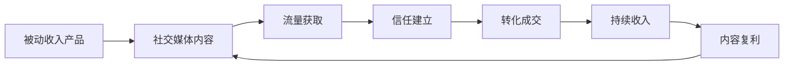
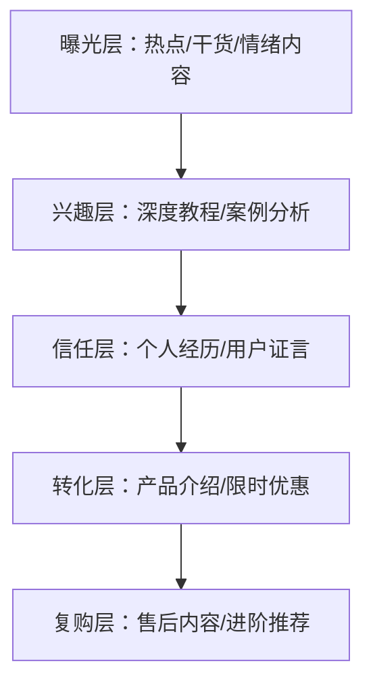

## 十、被动收入的社交媒体营销

社交媒体营销是被动收入体系中最具杠杆效应的流量引擎。与传统广告投放不同，社交媒体营销的核心价值在于**内容资产的复利效应**——你发布的一条优质内容可以在数月甚至数年内持续带来流量和转化，这与被动收入的本质完全契合。本节将系统讲解如何利用社交媒体为被动收入项目构建自动化流量漏斗。

### 1. 社交媒体营销与被动收入的关系

#### 1.1 为什么社交媒体是被动收入的最优流量来源

被动收入的核心要求是"一次投入，持续产出"。传统营销方式（地推、电话销售、直播带货）需要持续投入时间才能产生收入，本质上是"用时间换钱"。而社交媒体营销具备以下独特优势：

**内容资产化**：你在社交媒体上发布的每一条内容都是一块"数字资产"。一篇知乎回答可以持续出现在搜索结果中3-5年，一条小红书笔记可以在算法推荐下反复被推送。这意味着你前期投入的时间会在未来持续产生回报。

**算法分发机制**：与传统媒体不同，社交媒体平台的算法会主动将优质内容推送给潜在受众。即使你只有100个粉丝，一条高质量内容也可能获得10万+的曝光。这种"去中心化分发"机制让小体量创作者也能获得可观流量。

**信任构建自动化**：通过持续输出有价值的内容，你可以在不与每个用户一对一沟通的情况下建立信任。当用户看了你20条有用的教程后，他对你推荐的产品自然会产生购买意愿——这就是"内容信任漏斗"。

**成本结构优势**：相比付费广告（CPC通常在1-5元），社交媒体内容营销的获客成本接近于零（仅需时间投入）。对于被动收入项目来说，低获客成本意味着更高的利润率。

#### 1.2 社交媒体营销在被动收入体系中的定位

社交媒体不是被动收入本身，而是被动收入的**放大器**。它的作用是将你已经构建好的被动收入产品（电子书、课程、模板、SaaS、联盟链接）推送给目标受众。



关键认知：社交媒体营销的"被动"体现在**前期投入时间创建内容，后期内容持续带来流量**。但这不意味着完全不管——你需要定期更新内容、回复评论、优化策略。真正被动的部分是**内容资产的持续分发**。

### 2. 主流社交媒体平台的选择策略

不同平台的用户画像、算法机制、内容形式和变现路径差异巨大。选错平台意味着你投入大量时间创建的内容无法触达目标受众。以下是主流平台的系统对比。

#### 2.1 平台特性全景对比

| 维度 | 小红书 | 抖音 | B站 | 微信公众号 | 知乎 | 微博 |
|------|--------|------|------|------------|------|------|
| **核心用户** | 女性为主，18-35岁，一二线城市 | 全年龄段，下沉市场占比高 | 年轻用户，18-30岁，兴趣驱动 | 中高端用户，25-45岁 | 高学历用户，25-40岁 | 全年龄段，热点驱动 |
| **内容形式** | 图文+短视频 | 短视频为主 | 中长视频 | 长图文 | 长图文+问答 | 短文+图片 |
| **算法特点** | 搜索+推荐双引擎 | 强推荐，流量池机制 | 推荐+关注双列 | 社交传播为主 | 搜索+推荐 | 热点+关注 |
| **内容生命周期** | 3-6个月 | 3-7天 | 6-12个月 | 24-48小时 | 1-3年 | 24小时 |
| **变现路径** | 品牌合作、带货、引流 | 直播、带货、星图 | 充电、花火、引流 | 广告、付费、引流 | 知+、引流、咨询 | 广告、引流 |
| **适合的被动收入类型** | 数字产品、联盟营销 | 实物带货、知识付费 | 知识付费、SaaS | 知识付费、社群 | 课程、咨询、SaaS | 品牌曝光 |

#### 2.2 平台选择决策框架

选择平台时，需要从三个维度综合考量：

**维度一：目标受众匹配度**

如果你的被动收入产品面向女性消费者（如护肤电子书、穿搭模板），小红书是首选；如果面向技术人员（如编程课程、开发者工具），B站和知乎更合适；如果面向泛人群（如理财课程），抖音覆盖面最广。

**维度二：内容形式适配度**

你擅长什么形式的内容？擅长写作选知乎/公众号；擅长出镜拍视频选抖音/B站；擅长设计和图文排版选小红书。选择与你能力匹配的平台，内容产出效率会高3-5倍。

**维度三：内容生命周期**

这是最容易被忽视的因素。抖音内容的平均生命周期只有3-7天，你需要持续高频产出才能维持流量；而知乎回答的生命周期可达1-3年，一篇好回答可以持续带来流量数年。对于被动收入来说，**长生命周期的平台更具杠杆效应**。

#### 2.3 平台组合策略

不要只做一个平台。建议采用"1+2"组合策略：

- **主阵地（1个）**：投入70%精力，选择与你产品最匹配的平台深度运营
- **分发阵地（2个）**：投入30%精力，将主阵地内容适配后分发到其他平台

例如：以小红书为主阵地发布图文教程，将核心内容改编为短视频发抖音，将深度观点整理为知乎回答。同一套内容素材，三次曝光。

### 3. 内容策略：构建自动化流量漏斗

#### 3.1 内容漏斗模型

社交媒体内容不是随机发布的，而是需要按照漏斗逻辑系统规划：



**曝光层内容（占60%）**：目的是获取最大曝光量。包括热点话题讨论、实用干货分享、情绪共鸣内容。这类内容不要求精准，但要吸引眼球。例如："月入5000的副业，我只花了3天搭建"。

**兴趣层内容（占20%）**：筛选出对你领域真正感兴趣的用户。包括深度教程、行业分析、方法论拆解。例如："手把手教你搭建一个自动赚钱的联盟营销网站"。

**信任层内容（占10%）**：建立个人品牌信任。包括个人成长故事、真实收入展示、用户反馈案例。例如："我的电子书从0到月入2万的完整复盘"。

**转化层内容（占10%）**：直接促成购买。包括产品功能介绍、限时优惠、用户见证。例如："这门课程帮助300+学员实现了副业收入，最后10个名额"。

#### 3.2 内容选题方法论

选题决定了内容的80%效果。以下是经过验证的选题方法：

**方法一：痛点挖掘法**

在目标平台搜索你的领域关键词，按"最热"排序，查看点赞/收藏最多的前20条内容。这些内容击中的就是用户最核心的痛点。将这些痛点整理为选题库，逐一创作内容。

**方法二：竞品分析法**

找到你所在领域做得最好的3-5个账号，分析他们过去3个月点赞量最高的内容。不是要抄袭，而是要理解"什么类型的内容在这个领域最受欢迎"。然后用你自己的角度和经验重新创作。

**方法三：搜索需求法**

利用平台搜索框的下拉联想词（如小红书搜索"副业"会联想出"副业推荐""副业在家""副业月入过万"等），这些联想词代表了用户真实的搜索需求。每个联想词都可以作为一个选题。

**方法四：问题反推法**

在知乎搜索你的领域，找到浏览量高但回答少的问题。这些问题代表了"有需求但供给不足"的内容缺口，是绝佳的选题方向。

#### 3.3 内容创作效率提升

被动收入的核心是效率。以下是提升内容创作效率的具体方法：

**建立内容模板库**：为每种内容类型建立固定模板。例如，小红书教程类笔记的模板为：痛点标题（1行）→ 问题描述（2-3行）→ 解决方案（分点列出）→ 效果展示（图片）→ 引导关注。有了模板，创作一条笔记的时间可以从2小时缩短到30分钟。

**批量创作法**：每周花一个下午集中创作5-7条内容，然后用定时发布工具（如小红书的定时发布、抖音的创作者后台）分散到整周发布。这样你每周只需要"工作"一个下午，其他时间内容自动发布。

**内容复用矩阵**：一个核心观点可以衍生出多种形式的内容：

| 原始素材 | 小红书版本 | 抖音版本 | 知乎版本 | 公众号版本 |
|----------|-----------|---------|---------|-----------|
| "联盟营销月入5000" | 9宫格图文教程 | 60秒口播视频 | 3000字深度回答 | 5000字完整指南 |
| 制作时间 | 30分钟 | 20分钟 | 45分钟 | 60分钟 |
| 预期曝光 | 5000-20000 | 10000-100000 | 3000-15000 | 1000-5000 |

**AI辅助创作**：利用AI工具（如ChatGPT、文心一言）辅助内容创作。具体流程：用AI生成初稿→加入你的真实经验和案例→优化标题和开头→添加数据和细节→发布。AI可以将创作效率提升2-3倍，但必须加入个人真实经验，否则内容缺乏差异化。

### 4. 各平台实操指南

#### 4.1 小红书运营实操

**账号搭建**：

1. **头像**：使用真人头像或高质量品牌Logo，避免模糊或随意的图片
2. **昵称**：包含领域关键词，如"小王的副业笔记""理财干货分享"
3. **简介**：一句话说明你是谁+你能提供什么价值+引导关注。格式："专注XX领域｜已帮助XX人｜每天分享XX干货"
4. **背景图**：放上你的核心价值主张或引流信息

**笔记发布策略**：

- **发布时间**：早7-9点、午12-14点、晚18-22点，这三个时段用户活跃度最高
- **发布频率**：新号前期每天1-2条，稳定后每周3-5条
- **标题公式**：数字+痛点+解决方案，如"5个副业方向，月入3000+不是梦"
- **封面设计**：使用Canva制作统一风格的封面模板，保持视觉一致性

**搜索SEO优化**：

小红书是"搜索+推荐"双引擎，搜索流量占总流量的30-40%。优化搜索排名的关键：

- 标题包含核心关键词（如"副业推荐""被动收入"）
- 正文前两行重复核心关键词
- 话题标签选择：1个大话题（#副业）+2个中话题（#副业推荐 #在家赚钱）+2个小话题（#副业月入过万 #零成本副业）
- 评论区自己补充关键词相关内容

**从内容到变现的路径**：

小红书不允许直接在笔记中放外部链接。变通方法：

1. 在个人简介中放"全平台同名"引导用户搜索
2. 在评论区回复"私信XX领取"引导私信
3. 通过小红书店铺直接销售数字产品
4. 粉丝达到1000后开通品牌合作

#### 4.2 抖音运营实操

**账号定位**：

抖音的算法是"标签匹配"机制——平台会根据你的内容给你的账号打标签，然后将你的视频推送给对这类标签感兴趣的用户。因此，账号定位越垂直越好。

错误做法：今天发理财，明天发美食，后天发健身。账号标签混乱，算法不知道该推给谁。

正确做法：所有内容都围绕"被动收入"这个核心标签展开，可以细分为"副业教程""理财技巧""创业经验"等子标签。

**视频制作SOP**：

1. **脚本撰写**（10分钟）：开头3秒抛出痛点/悬念→中间60秒讲解核心内容→结尾10秒引导关注+评论
2. **拍摄**（15分钟）：使用手机+环形灯+领夹麦，画质1080P即可
3. **剪辑**（20分钟）：使用剪映，添加字幕、BGM、关键信息贴纸
4. **发布优化**（5分钟）：标题包含关键词、添加3-5个话题标签、选择合适封面

**流量池突破技巧**：

抖音的流量池机制是：新视频先推给200-500人→如果完播率>30%、点赞率>3%、评论率>1%，则推入下一级流量池（5000人）→继续达标则推入更大池（5万、50万）。因此，优化这三个指标是关键：

- **完播率**：视频时长控制在45-90秒，开头3秒必须有吸引力
- **点赞率**：在视频中提供实用价值，用户觉得"有用"就会点赞
- **评论率**：在结尾抛出一个问题引导评论，如"你觉得哪个方向最适合你？评论区告诉我"

#### 4.3 知乎运营实操

知乎是被动收入内容营销的"长尾金矿"。一篇优质知乎回答可以持续带来搜索流量1-3年，是所有平台中内容生命周期最长的。

**回答选择策略**：

不是所有问题都值得回答。优先选择：

- 浏览量 > 10万，回答数 < 50（有流量但竞争不激烈）
- 问题与你的被动收入产品直接相关
- 问题最近30天仍有新回答和新浏览（说明持续有流量）
- 问题下已有高赞回答但内容不够全面（你可以写得更好）

**高赞回答结构**：

```text
开头：直接回答问题，给出核心结论（50字以内）
正文：分点展开，每点有理论+案例+数据
结尾：总结+引导关注/查看专栏
```

关键技巧：知乎回答的排名不仅看赞数，还看"盐值"和"专业度"。保持垂直领域的持续输出（每周2-3篇），3个月后你的账号会被标记为该领域的"优秀回答者"，新回答的初始排名会更高。

**知乎引流到被动收入产品**：

知乎允许在回答中插入"好物推荐"卡片和"知+"推广链接。合规的引流方式：

1. 在回答末尾放上"更多内容可以查看我的专栏"引导到知乎专栏（专栏中可以放详细介绍和外链）
2. 开通知乎"好物推荐"功能，在相关回答中插入商品卡片赚取佣金
3. 通过"盐选会员"付费内容直接变现
4. 个人简介中放引流信息

### 5. 内容自动化与被动化

社交媒体营销的"被动化"是本节的核心主题。以下方法可以将你的社交媒体运营从"全职工作"变成"半自动系统"。

#### 5.1 内容生产自动化

**建立内容素材库**：将你日常看到的好案例、数据、金句、图片素材分类存储在Notion或飞书文档中。素材库的分类建议：

- 案例库：按领域分类的真实案例
- 数据库：行业报告、统计数据
- 金句库：有冲击力的观点和表达
- 图片库：封面模板、配图素材
- 选题库：待创作的选题清单

有了素材库后，创作一条内容的时间可以从2小时缩短到30分钟，因为你不需要每次都从零开始。

**内容日历规划**：每月初花2小时规划整月的内容日历。将选题分配到每一天，标注内容类型（曝光/兴趣/信任/转化）和发布时间。有了日历，你每天只需要按照计划执行，不需要临时想"今天发什么"。

#### 5.2 内容分发自动化

**工具矩阵**：

| 工具名称 | 功能 | 价格 | 支持平台 |
|----------|------|------|----------|
| Buffer | 多平台定时发布 | 免费/15美元/月 | Twitter、Instagram、Facebook |
| Later | Instagram定时发布+分析 | 免费/18美元/月 | Instagram、TikTok |
| 新榜 | 国内全平台数据监控 | 免费/付费版 | 微信、抖音、小红书、B站 |
| 蚁小二 | 国内多平台一键分发 | 99元/月起 | 30+国内平台 |
| 融媒宝 | 多账号多平台管理 | 免费/付费 | 40+平台 |

**一键分发工作流**：

1. 在主平台（如小红书）创作并发布内容
2. 使用蚁小二或融媒宝将内容一键分发到其他平台
3. 针对不同平台做微调（如抖音需要转为视频格式，知乎需要更长的文本）
4. 设置定时发布，覆盖各平台的最佳发布时间

#### 5.3 互动自动化

用户互动（评论、私信）是社交媒体运营中最耗时的环节。以下方法可以大幅减少时间投入：

**评论回复模板库**：为常见问题准备10-20条标准回复模板。例如：

- "感谢关注！更多干货可以看我的主页合集"
- "这个问题我在第XX条笔记中详细讲过，可以去看看"
- "具体操作步骤在评论区第一条，有问题随时问"

**私信自动回复**：大部分平台支持设置自动回复关键词。设置常见问题的自动回复，如用户私信"课程"自动发送课程介绍链接。

**AI客服助手**：对于高流量账号，可以使用AI客服工具（如微伴助手、句子互动）自动回复大部分私信，只将复杂问题转交人工处理。

### 6. 社交媒体变现的五大模式

#### 6.1 模式一：内容引流到数字产品

这是最适合被动收入的模式。你在社交媒体上发布免费干货内容，吸引目标用户，然后将他们引流到你的数字产品（电子书、模板、课程）。

**转化漏斗示例**：

```text
小红书笔记"5个提升效率的Notion模板"（免费内容）
    ↓ 评论区引导
私信发送"模板"获取1个免费模板（建立信任）
    ↓ 使用后觉得好
引导查看完整版"50个Notion模板合集"（付费产品，49元）
    ↓ 购买后
推荐"Notion效率系统课程"（高客单价产品，299元）
```

**关键指标**：

- 内容到私信的转化率：3-8%
- 私信到购买的转化率：10-20%
- 综合转化率：0.3-1.6%
- 如果一条笔记曝光10000，预期产生30-160个订单

#### 6.2 模式二：联盟营销

在内容中推荐他人产品，通过专属链接赚取佣金。不需要自己开发产品，是最纯粹的"被动收入"模式。

**国内主流联盟平台**：

| 平台 | 佣金比例 | 结算周期 | 适合品类 |
|------|----------|----------|----------|
| 淘宝联盟 | 1-50% | T+1 | 全品类 |
| 京东联盟 | 0.5-30% | T+1 | 电子产品、日用品 |
| 拼多多联盟 | 5-40% | T+1 | 低价商品 |
| 知乎好物推荐 | 按商品 | T+15 | 知识类、数码类 |
| 小红书好物 | 按合作 | 月结 | 美妆、生活 |

**联盟营销内容创作要点**：

- 必须是真实使用过的产品，否则容易翻车
- 重点讲"使用场景"而非"产品参数"
- 在内容中自然嵌入购买链接，不要硬广
- 提供独家优惠码增加转化率

#### 6.3 模式三：知识付费

当你在某个领域积累了足够多的社交媒体内容和粉丝后，可以将系统化的知识打包为付费产品。

**产品形态**：

- **电子书/PDF指南**：制作成本低，适合入门级产品，定价29-99元
- **视频课程**：制作成本中等，适合系统教学，定价199-999元
- **社群/训练营**：运营成本较高但复购率高，定价299-2999元
- **1对1咨询**：时间成本最高但客单价最高，定价500-5000元/次

**从免费内容到付费产品的过渡**：

不要直接卖产品。正确路径是：免费内容（建立信任）→低价引流品（筛选付费用户）→核心产品（主要收入）→高端服务（利润最大化）。

#### 6.4 模式四：账号矩阵变现

当你跑通一个账号的变现模式后，可以复制到多个账号，形成"账号矩阵"。

**矩阵策略**：

- 主账号：个人IP账号，建立信任和品牌
- 子账号1-3：垂直细分领域账号，用相同的内容模式运营
- 每个子账号独立变现，主账号做品牌背书

**注意事项**：

- 不同账号必须有差异化定位，不能完全相同
- 使用不同设备和网络运营，避免被平台判定为矩阵号限流
- 子账号可以交给团队成员运营，自己只负责策略和审核

#### 6.5 模式五：私域流量池

将社交媒体上的公域流量导入你的私域（微信群、企业微信、邮件列表），建立你完全掌控的流量资产。

**私域的价值**：

- 不受平台算法影响，触达率100%
- 可以反复触达，不需要每次重新获取流量
- 转化率通常是公域的3-5倍
- 是你真正的"数字资产"，不受平台政策变化影响

**私域搭建流程**：

1. 在社交媒体内容中植入引流钩子（如"私信领取XX资料"）
2. 通过私信将用户引导至微信/企业微信
3. 将用户拉入对应主题的社群
4. 在社群中持续输出价值+定期推荐产品
5. 通过邮件列表做周期性的产品推送

### 7. 数据分析与持续优化

#### 7.1 核心数据指标

| 指标 | 含义 | 优化方向 |
|------|------|----------|
| 曝光量 | 内容被展示的次数 | 优化标题、封面、发布时间 |
| 互动率 | (点赞+评论+收藏)/曝光 | 优化内容质量、引导互动 |
| 粉丝增长率 | 新增粉丝/曝光 | 优化个人简介、内容定位一致性 |
| 引流转化率 | 私信或点击链接的人数/曝光 | 优化引流钩子、话术 |
| 付费转化率 | 付费用户/引流用户 | 优化产品介绍、价格策略 |
| 单粉丝价值 | 总收入/总粉丝数 | 优化变现模式、产品定价 |

#### 7.2 数据复盘模板

每周花30分钟做一次数据复盘，填写以下表格：

```markdown
## 本周数据复盘（第X周）

### 内容数据
- 发布数量：X条
- 总曝光：X
- 总互动：X
- 最佳内容：[标题] — 曝光X，互动X
- 最差内容：[标题] — 曝光X，互动X

### 粉丝数据
- 新增粉丝：X
- 取消关注：X
- 净增长：X
- 粉丝总量：X

### 变现数据
- 引流人数：X
- 付费转化：X人
- 收入：X元

### 本周发现
- 什么类型的内容表现最好？
- 哪个时间段发布效果最好？
- 用户最常问什么问题？

### 下周计划
- 需要调整的策略
- 重点创作的内容方向
```

#### 7.3 A/B测试方法

不要凭感觉做决策，用数据说话。以下是常见的A/B测试场景：

**标题测试**：同一个内容，用两个不同风格的标题发布（间隔3天以上），对比曝光量和点击率。例如：

- A标题："5个被动收入方法"（直接型）
- B标题："我靠这5个方法实现了财务自由"（故事型）

**封面测试**：同一标题，使用不同风格的封面图片，对比点击率。

**发布时间测试**：同一类型内容，在不同时间段发布，对比曝光量。

**内容长度测试**：同一主题，分别用短内容（300字）和长内容（1500字）发布，对比互动率和收藏率。

### 8. 风险控制与合规要点

#### 8.1 平台规则风险

每个平台都有自己的社区规范和商业推广规则，违反规则可能导致限流、封号。

**常见违规行为**：

- 在内容中直接放外部链接（小红书、抖音严禁）
- 使用夸大收益的表述（如"保证月入10万"）
- 搬运他人内容（平台会检测重复内容）
- 频繁发布营销内容而缺乏价值内容（被判定为营销号）
- 使用刷量工具（平台反作弊系统会检测）

**合规发布原则**：

- 每5条价值内容中最多夹杂1条营销内容
- 收益描述使用"可能""有机会"等模糊表述
- 所有内容必须原创或有合法授权
- 推荐产品时标注"推广""合作"等声明

#### 8.2 账号安全风险

**账号矩阵风险**：同一设备登录多个账号可能被关联限流。解决方案：使用不同设备、不同网络、不同手机号注册运营。

**内容搬运风险**：跨平台搬运自己的内容通常没有问题，但需要注意：不要在短时间内大量搬运，每个平台的内容做适当调整（修改标题、调整格式、替换平台特有话术）。

**知识产权风险**：在内容中使用他人的图片、文字、音乐可能构成侵权。解决方案：使用无版权素材（如Pexels、Unsplash图片），或购买正版素材授权。

#### 8.3 精神健康风险

这是最容易被忽视但最重要的风险。社交媒体运营容易导致：

- **数据焦虑**：过度关注点赞数、粉丝数，影响情绪
- **创作倦怠**：持续产出内容导致创意枯竭
- **攀比心理**：看到他人数据更好而产生挫败感

**应对策略**：

- 设定固定的查看数据时间（如每天晚上8点），其余时间不看
- 建立内容素材库，减少每次创作的认知负担
- 每月给自己2-3天"社媒假期"，不发布不查看
- 记住：社交媒体是工具不是目的，被动收入才是目标

### 9. 进阶策略

#### 9.1 跨平台IP矩阵

当你的主账号达到一定规模（如小红书1万粉丝），可以考虑建立跨平台IP矩阵：

1. 将主账号的内容适配到3-5个平台
2. 每个平台用独立的账号运营
3. 不同平台之间互相引流，形成流量闭环
4. 总粉丝量可以在6个月内翻3-5倍

#### 9.2 UGC内容杠杆

当你有了足够多的用户后，可以让用户帮你生产内容：

- 发起话题挑战，鼓励用户分享使用你产品的心得
- 举办UGC征集活动，优秀内容给予奖励
- 将用户案例整理为新的内容素材

这种方式将内容生产的边际成本降到接近于零。

#### 9.3 社交媒体SEO趋势

随着小红书、抖音等平台逐步强化搜索功能，"社交媒体SEO"正在成为一个新的流量增长点。优化策略：

- 研究平台搜索热词，将关键词融入标题和正文
- 创建"搜索型内容"（如"XX怎么选""XX入门指南"）
- 建立内容之间的内链关系（在新笔记中引用旧笔记）
- 定期更新老内容，保持搜索排名

### 10. 收入预期与阶段规划

| 阶段 | 时间 | 关键里程碑 | 预期月收入 | 每周投入时间 |
|------|------|-----------|-----------|-------------|
| 冷启动期 | 第1-3个月 | 发布50-100条内容，积累1000粉丝 | 0-500元 | 10-15小时 |
| 增长期 | 第4-6个月 | 找到爆款内容模式，粉丝达5000-1万 | 500-3000元 | 8-12小时 |
| 变现期 | 第7-12个月 | 跑通1-2个变现模式，月收入稳定 | 3000-10000元 | 6-10小时 |
| 规模期 | 第13-24个月 | 建立矩阵，私域沉淀，复利显现 | 10000-50000元 | 5-8小时 |
| 被动期 | 24个月以后 | 内容资产持续产出，团队化运营 | 50000元+ | 3-5小时 |

注意：以上收入预期基于"持续高质量输出+正确变现策略"的前提。实际收入因领域、执行力、市场环境等因素存在较大差异。第12个月之前不要期望收入能覆盖生活成本——这是副业，不是主业。

### 11. 常见误区与纠正

**误区一：粉丝越多越赚钱**

事实：1000个精准粉丝比10万个泛粉更有价值。精准粉丝的转化率是泛粉的10-50倍。不要追求粉丝数量，要追求粉丝精准度。

**误区二：每天都要发内容**

事实：高质量内容的效果远好于高频低质内容。一周3条精品内容 > 每天1条平庸内容。内容质量是核心，频率是辅助。

**误区三：抄袭爆款就能火**

事实：平台算法能识别重复内容。你可以学习爆款的结构和逻辑，但必须用自己的语言和案例重新创作。

**误区四：做了社交媒体就能躺赚**

事实：社交媒体营销本身不是被动收入，它是为被动收入产品引流的工具。你需要先有产品，再用社交媒体推广。没有产品，流量再多也变不了现。

**误区五：只做一个平台就够了**

事实：单一平台的算法变化可能导致流量断崖式下跌。多平台分发是对冲风险的必要策略。

### 12. 行动清单

完成本节学习后，请按以下顺序执行：

1. **选择1个主平台**：根据你的产品和能力，选择最匹配的平台
2. **完善账号基础设置**：头像、昵称、简介、背景图
3. **建立内容素材库**：在Notion或飞书中建立分类素材库
4. **制作第一批内容**：按"曝光层"内容为主，发布10-15条
5. **观察数据反馈**：记录每条内容的曝光和互动数据
6. **找到爆款模式**：分析表现最好的3条内容，总结共性
7. **批量复制爆款模式**：围绕爆款模式大量创作同类内容
8. **植入变现钩子**：在内容中自然引导用户到你的产品
9. **建立内容日历**：规划每周/每月的内容计划
10. **逐步扩展到第2个平台**：主平台稳定后开始多平台分发
