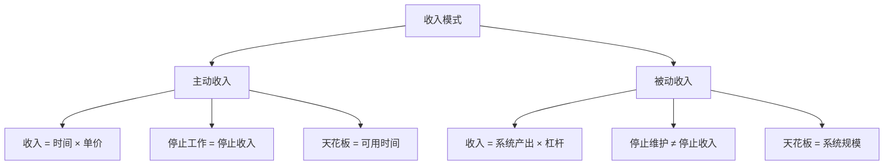
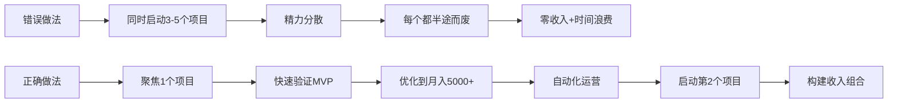
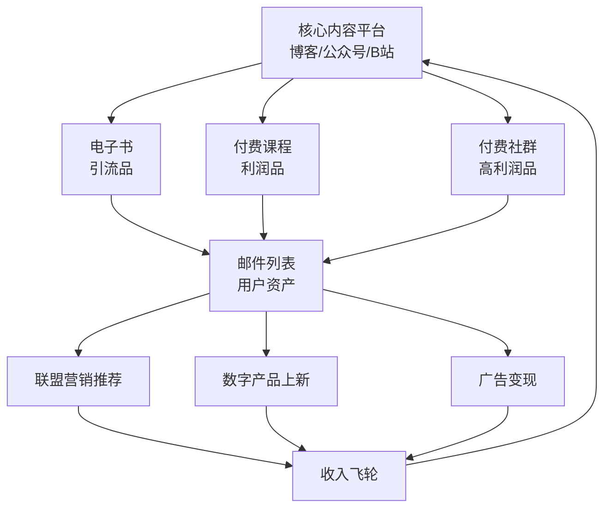
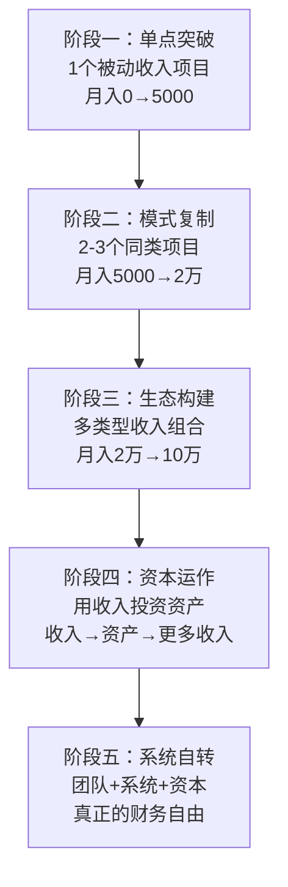

## 十一、常见问题解答

本节汇总被动收入构建过程中被问得最多、最容易踩坑的问题。按主题分类，从认知层面到实操层面逐层递进，帮助你在构建被动收入的路上少走弯路。

---

### 1. 认知层面：被动收入的本质

#### Q1：被动收入真的是"躺着赚钱"吗？

**不是。** 这是关于被动收入最大的误解。更准确的定义是：

> 被动收入 = **前期高强度投入** × **系统化运转** × **后期低频维护**

任何号称"零投入、零风险、躺赚"的项目，99% 是骗局或夸大宣传。真正的被动收入遵循一个核心公式：

```text
被动收入 = (前期时间投入 + 前期资金投入) × 杠杆系数 × 系统自动化程度
```

| 收入类型 | 前期投入 | 运营期投入 | 真实被动程度 |
|----------|----------|------------|-------------|
| 全职打工 | 低（面试） | 高（每天8小时） | 0%（纯主动） |
| 自由职业 | 中（建作品集） | 中高（接单+交付） | 10-20% |
| 数字产品 | 高（3-6个月开发） | 低（每周2-4小时） | 60-80% |
| 投资理财 | 高（积累本金） | 极低（季度审视） | 90%+ |
| 自动化SaaS | 极高（6-12个月） | 低（每月数小时） | 80-90% |

**核心认知**：被动收入的"被动"是相对于运营期而言的。前期投入越充分，后期越被动。

#### Q2：被动收入和主动收入的本质区别是什么？

区别不在于"要不要干活"，而在于**收入是否与你的时间直接挂钩**：



- **主动收入**：你卖时间。月薪2万，意味着你每月必须工作160+小时。停止工作，收入归零。
- **被动收入**：你卖系统。一本电子书写完后，每天自动销售10本，你睡觉时也在赚钱。

**关键区别**：主动收入是线性增长（1份时间=1份收入），被动收入可以指数增长（1份时间=无限份收入）。

#### Q3：普通人真的能构建被动收入吗？

**能，但需要正确认知。** 根据不同起点，路径完全不同：

| 你的起点 | 推荐路径 | 启动资金 | 预期回报周期 |
|----------|----------|----------|-------------|
| 有专业技能、无资金 | 数字产品（课程/模板/工具） | 0-5000元 | 3-6个月 |
| 有资金、无时间 | 股息投资/REITs/基金 | 10万+ | 即时开始 |
| 有时间、无技能 | 内容创作（自媒体/写作） | 0元 | 6-12个月 |
| 有技能+有资金 | SaaS产品/自动化网站 | 1-5万 | 3-9个月 |
| 什么都不突出 | 先学一个可变现的技能 | 0元 | 先投资6个月学习 |

**真相**：被动收入不是某些人的专利，但它需要你至少有一个可杠杆化的起点——技能、资金、时间中的任何一个。

---

### 2. 准备阶段：启动前的关键问题

#### Q4：需要多少启动资金？

被动收入项目的资金门槛差异极大：

| 项目类型 | 最低启动资金 | 推荐启动资金 | 资金用途 |
|----------|-------------|-------------|----------|
| 自媒体内容 | 0元 | 500-2000元 | 设备升级、付费工具 |
| 电子书/课程 | 0元 | 1000-5000元 | 录制设备、平台费、设计 |
| 联盟营销网站 | 500元/年 | 3000-8000元 | 域名、主机、SEO工具 |
| 数字模板/工具 | 0元 | 2000-5000元 | 设计软件、素材版权 |
| SaaS产品 | 5000元 | 2-10万 | 开发、服务器、推广 |
| 股息投资 | 1万元 | 10万+ | 股票/基金购买 |
| 房产租金 | 30万+ | 50万+ | 首付、装修 |
| 自动化电商 | 3000元 | 1-5万 | 货源、平台费、推广 |

**原则**：用最小成本验证模式可行后再追加投入。不要一上来就大笔投入未经验证的项目。

#### Q5：需要具备哪些基础技能？

不同项目类型对技能要求不同，但有三项底层能力是通用的：

**必备底层能力：**

1. **内容创作能力** —— 几乎所有线上被动收入项目都需要。不是要求你文笔优美，而是能清晰表达、解决读者问题。可通过刻意练习在3个月内提升到可用水平。

2. **基础营销能力** —— 产品做得再好，没人知道等于零。需要掌握：SEO基础、社交媒体运营、文案撰写、用户心理。这些技能可以通过免费资源学习。

3. **数据分析能力** —— 被动收入的核心是优化系统。你需要看懂数据（转化率、跳出率、复购率），用数据驱动决策。Excel/Google Sheets基础即可起步。

**按项目类型的专项技能：**

| 项目类型 | 核心技能 | 学习周期 | 难度 |
|----------|----------|----------|------|
| 电子书/课程 | 写作/录课 + 排版 | 1-3个月 | ★★ |
| 联盟营销 | SEO + WordPress | 2-4个月 | ★★★ |
| 数字模板 | 设计软件（Figma/PS） | 1-3个月 | ★★ |
| SaaS产品 | 编程 + 产品设计 | 6-12个月 | ★★★★★ |
| 自媒体 | 选题 + 内容运营 | 1-2个月 | ★★ |
| 投资理财 | 财务分析 + 风控 | 3-6个月 | ★★★ |

#### Q6：全职工作期间能同时构建被动收入吗？

**完全可以，而且这是最推荐的方式。** 原因：

1. **经济安全垫**：全职收入保障生活，被动收入项目不需要立刻盈利，你可以更有耐心地打磨产品。
2. **技能复用**：工作中积累的专业知识可以成为被动收入产品的核心竞争力。
3. **资源积累**：职场积累的人脉、行业认知、工具使用经验都是宝贵的资产。

**时间分配建议：**

```mermaid
gantt
    title 全职工作+被动收入项目时间分配
    dateFormat  HH:mm
    axisFormat %H:%M

    section 日常
    全职工作      :09:00, 8h
    通勤/休息     :08:00, 1h
    通勤/休息     :17:00, 1h
    晚餐休息      :18:00, 1h

    section 被动收入
    早晨深度工作   :06:00, 2h
    晚间执行工作   :19:00, 2h
    周末集中攻坚   :09:00, 6h
```



**关键原则**：
- 每天投入2-4小时，周末投入4-8小时，一周约20-30小时
- 优先做"不可替代"的高价值工作（产品设计、核心内容），低价值工作外包或用工具自动化
- 设定阶段性里程碑（如：3个月内完成MVP），避免无限期拖延

---

### 3. 项目选择：方向比努力更重要

#### Q7：如何判断一个被动收入项目是否靠谱？

用**五维评估法**快速过滤（详见本章第一节）：

| 维度 | 不靠谱的信号 | 靠谱的信号 |
|------|-------------|-----------|
| 市场需求 | 没有人在搜索/讨论这个方向 | 有明确的搜索量和付费行为 |
| 个人匹配 | 你对这个领域完全陌生且没兴趣 | 你有相关经验或强烈兴趣 |
| 启动成本 | 需要大额前期投资且无验证 | 可用低成本MVP验证 |
| 自动化程度 | 需要你持续高强度参与 | 可构建自动化交付系统 |
| 可扩展性 | 收入与你的时间直接挂钩 | 可以规模化且边际成本递减 |

**快速判断清单**：
- [ ] 是否已有人靠这个方向赚到钱？（付费验证）
- [ ] 你是否能在3个月内做出MVP？（可行性）
- [ ] 这个收入能否在你停止工作1个月后仍然存在？（被动性）
- [ ] 5年后这个需求还会存在吗？（持久性）

如果以上4个问题有2个以上答案为"否"，建议换方向。

#### Q8：应该从一个项目开始还是同时做多个？

**先做一个，做出成果后再扩展。** 这是最常见也最致命的错误之一。



**扩展节奏建议：**

| 阶段 | 项目数量 | 收入目标 | 时间投入分配 |
|------|----------|----------|-------------|
| 起步期（0-6个月） | 1个 | 0→3000元/月 | 100%投入主项目 |
| 成长期（6-12个月） | 1-2个 | 3000→1万/月 | 80%主项目+20%新项目 |
| 成熟期（1-2年） | 2-3个 | 1万→3万/月 | 50%维护+50%新项目 |
| 扩展期（2年+） | 3-5个 | 3万+/月 | 每个项目<20%时间 |

#### Q9：没有专业技能，能做什么被动收入项目？

**每个人都有可变现的知识，关键是找到"你知道但别人不知道"的信息差。**

以下是零技能门槛的起步路径：

| 项目 | 变现逻辑 | 启动方式 | 预期月收入 |
|------|----------|----------|-----------|
| 信息整理型电子书 | 整理某个领域的信息，打包成指南 | 选择你熟悉的领域，用Notion整理后导出PDF | 500-3000元 |
| 资源合集类内容 | 整理免费资源/工具清单 | 在小红书/公众号发布，用联盟链接变现 | 1000-5000元 |
| 代发货电商 | 不需要囤货，找到供应商后自动化 | 1688选品+拼多多/闲鱼上架 | 2000-8000元 |
| 短视频搬运+改编 | 将国外优质内容本地化 | YouTube→抖音/B站，添加你的解读 | 1000-5000元 |
| 社群运营 | 组织学习社群，收年费 | 选一个你愿意深入学习的主题 | 3000-1万 |

**核心建议**：不要等"准备好了"再开始。选择一个方向，用2周时间做出最小可行产品，根据市场反馈迭代。

---

### 4. 运营阶段：从0到1的关键问题

#### Q10：第一个月零收入，正常吗？

**完全正常。** 根据不同项目类型，首次收入的典型时间线：

| 项目类型 | 首次收入时间 | 月入5000元时间 | 月入2万元时间 |
|----------|-------------|---------------|--------------|
| 电子书/课程 | 2-4周 | 3-6个月 | 12-18个月 |
| 联盟营销网站 | 3-6个月 | 6-12个月 | 18-24个月 |
| 自媒体账号 | 1-3个月 | 6-12个月 | 12-24个月 |
| 数字模板 | 1-4周 | 2-6个月 | 6-12个月 |
| SaaS产品 | 3-6个月 | 6-18个月 | 12-36个月 |
| 股息投资 | 即时（有本金） | 取决于本金规模 | 需100万+本金 |

**心态管理**：
- 第1-3个月：专注产品打磨和初始流量，不要看收入数字
- 第3-6个月：开始关注转化率和复购率，优化系统
- 第6-12个月：收入曲线开始上扬，信心建立

**关键指标**（比收入更重要）：
- 内容发布频率是否稳定
- 流量/粉丝是否在增长
- 用户反馈是否正向
- 转化漏斗每个环节是否在优化

#### Q11：被动收入需要缴税吗？如何处理税务问题？

**必须缴税。** 被动收入在中国的税务处理方式取决于收入类型：

| 收入类型 | 税目 | 税率 | 申报方式 |
|----------|------|------|----------|
| 版税/稿酬 | 稿酬所得 | 20%（减按70%计入） | 年度汇算 |
| 广告/推广收入 | 劳务报酬 | 20%-40% | 平台代扣或自行申报 |
| 房租收入 | 财产租赁所得 | 20%（减除费用后） | 自行申报 |
| 股息/红利 | 利息股息红利所得 | 20% | 持股>1年免税 |
| 网店/电商收入 | 经营所得 | 5%-35%累进 | 办理个体户或公司 |
| 数字产品销售 | 经营所得或劳务报酬 | 视具体情况 | 建议注册个体户 |

**实操建议**：
1. 年收入低于12万元：关注年度汇算清缴，多数平台已代扣个税
2. 年收入12万-50万元：建议注册个体工商户，享受小规模纳税人优惠（月收入10万以下免增值税）
3. 年收入50万以上：建议咨询专业会计师，合理利用税收优惠政策
4. **保存所有收支记录**：用记账软件（如随手记、MoneyWiz）记录每一笔收入和支出

**重要提醒**：不要试图逃税。金税四期系统下，大数据比对能力极强，平台收入数据税务部门可以随时调取。合规经营是长期被动收入的基础。

#### Q12：如何处理被动收入项目的客户服务？

**目标：用系统替代人工，用FAQ替代重复回答。**

客户服务是被动收入中最大的"非被动"消耗。处理策略：

**第一层：预防问题发生（消除80%的客服需求）**
- 产品页面提供详尽的说明、截图、视频演示
- 建立完整的FAQ页面，覆盖所有常见问题
- 设置清晰的使用条款和退款政策
- 产品设计上做到"不需要说明书就能用"

**第二层：自动化回答（处理剩余15%）**
- 部署聊天机器人（如微信公众号自动回复、Intercom免费版）
- 设置邮件自动回复模板
- 建立知识库，让用户自助查询

**第三层：人工处理（仅处理5%的复杂问题）**
- 设定固定的客服时间（如每天下午3-4点集中处理）
- 复杂问题标准化处理流程
- 考虑外包给虚拟助理（VA），时薪30-80元

**成本控制**：当客服时间超过每周5小时，说明产品设计或文档有问题，优先从根源解决。

---

### 5. 收入优化：从1到100的关键问题

#### Q13：被动收入的"天花板"在哪里？如何突破？

不同项目的收入天花板差异巨大：

| 项目类型 | 月收入天花板 | 突破方法 |
|----------|-------------|----------|
| 单本电子书 | 3000-1万 | 写系列丛书、开设配套课程 |
| 单个联盟网站 | 5000-3万 | 做站群、扩展到新领域 |
| 单个自媒体账号 | 1万-10万 | 矩阵账号、IP商业化 |
| 单个SaaS产品 | 无上限 | 扩展功能、提升客单价 |
| 股息投资 | 取决于本金 | 持续增加本金投入 |
| 单套房产租金 | 受限于房产数量 | 增持房产、改造升级 |

**突破天花板的三种策略：**

1. **纵向深化** —— 在同一个领域做深
   - 从电子书→系列课程→付费社群→年度会员→线下训练营
   - 每增加一层，客单价提升3-10倍

2. **横向扩展** —— 复制成功模式到新领域
   - 第一个联盟网站验证了模式后，用同样的方法做第2、3个
   - 用第一本书的读者画像，开发第二本书

3. **杠杆放大** —— 用资本或技术替代时间
   - 用广告投放放大已验证的转化漏斗
   - 用AI工具批量生产内容
   - 用自动化工具减少人工干预

#### Q14：如何将多个被动收入流整合成一个系统？

孤立的被动收入项目效率低下。整合的核心是**流量共享**和**用户资产复用**：



**整合实操步骤：**
1. 选择一个核心平台作为流量入口（推荐个人博客或公众号，因为你不拥有平台用户，但公众号生态在中国最成熟）
2. 所有内容指向同一个用户池（邮件列表/微信群/知识星球）
3. 在用户池中分层运营：免费用户→付费用户→高价值用户
4. 用自动化工具（如企业微信自动化、邮件序列）减少人工运营

#### Q15：被动收入增长停滞怎么办？

增长停滞是每个被动收入项目都会遇到的阶段。诊断流程：

**第一步：定位瓶颈**

| 停滞位置 | 症状 | 根因 | 解决方案 |
|----------|------|------|----------|
| 流量端 | 访问量不增长 | SEO排名停滞/内容频率下降 | 更新旧内容、扩展新关键词、增加新渠道 |
| 转化端 | 流量增长但收入不增 | 产品吸引力不足/定价问题 | A/B测试页面、优化卖点、调整价格策略 |
| 复购端 | 新客户少、老客户不回来 | 产品体验差/缺乏后续产品 | 改善产品体验、开发升级产品 |
| 所有指标 | 全面停滞 | 市场饱和/需求转移 | 考虑进入新市场或新方向 |

**第二步：快速实验**
- 每周做1个实验（改标题、调价格、加新功能、换渠道）
- 记录实验结果，建立自己的"增长实验库"
- 80%的实验会失败，但20%的成功会带来突破

**第三步：必要时果断放弃**
- 连续3个月做了10+个实验仍无改善
- 市场基本面发生了不可逆的变化
- 你的时间投入产出比远低于其他机会
- 此时应将资源转移到新项目（参见第七节退出策略）

---

### 6. 风险与陷阱：必须避开的深坑

#### Q16：被动收入最常见的失败原因是什么？

根据大量案例总结，失败原因按频率排序：

| 排名 | 失败原因 | 占比 | 表现 |
|------|----------|------|------|
| 1 | 选错方向（无真实需求） | 35% | 做了3个月，产品无人问津 |
| 2 | 半途而废（放弃太早） | 25% | 第2个月零收入就放弃 |
| 3 | 完美主义（迟迟不发布） | 15% | 花6个月"打磨"却从未推向市场 |
| 4 | 单打独斗（不懂借力） | 10% | 所有事都自己做，效率极低 |
| 5 | 忽视营销（产品好但无人知） | 8% | "好产品会自己说话"——不会的 |
| 6 | 收入来源单一 | 5% | 依赖一个平台，平台规则变了就崩 |
| 7 | 法律合规问题 | 2% | 版权纠纷、税务问题、资质缺失 |

**避开这些坑的检查清单：**
- [ ] 在动手前验证了市场需求（至少L2级别）
- [ ] 设定了3个月/6个月/12个月的里程碑
- [ ] 产品在"够好"时就推向市场（MVP思维）
- [ ] 识别了可以外包或自动化的工作
- [ ] 制定了推广计划（不只做产品）
- [ ] 收入来源不依赖单一平台
- [ ] 了解了相关的法律法规

#### Q17：如何识别被动收入骗局？

被动收入领域充斥着各种骗局和夸大宣传。以下是识别方法：

**红旗信号（遇到以下任何一条都要警惕）：**

1. **"零投入、零风险、月入十万"** —— 不存在这种事。所有合法的被动收入都需要前期投入。
2. **"只需要转发/点击/挂机就能赚钱"** —— 这是传销、刷单或诈骗的典型话术。
3. **先交钱才能"解锁"赚钱资格** —— 正规项目不需要你先付费才能开始赚钱。
4. **收入截图过于完美** —— PS和浏览器修改器可以伪造任何截图。
5. **不断强调"限时"和"名额有限"** —— 利用紧迫感让你不做理性判断。
6. **不告诉你具体做什么，只说"加入就能赚"** —— 如果说不清楚商业模式，大概率是骗局。

**合法被动收入 vs 骗局的对比：**

| 特征 | 合法被动收入 | 骗局 |
|------|-------------|------|
| 收入来源 | 产品销售、广告、投资收益 | 下线入会费、拉人头 |
| 你需要做什么 | 创造有价值的产品或服务 | 招募更多人加入 |
| 钱从哪来 | 终端消费者付费 | 新加入者的钱分给老成员 |
| 收入是否可持续 | 产品持续销售就有收入 | 新人断流就崩盘 |
| 前期投入 | 可能需要（工具、平台费） | 通常需要大额"加盟费" |

#### Q18：被动收入项目失败了怎么办？

失败不是终点，是数据收集过程。处理步骤：

**第一步：止损复盘（1-2天）**
- 列出所有投入的时间、金钱、精力
- 分析失败的根本原因（用上文的失败原因表对照）
- 记录你学到的技能和经验

**第二步：资产回收（1周内）**
- 已创建的内容能否复用到新项目？
- 已积累的用户/粉丝能否迁移？
- 已购买的工具/服务能否转让或退款？
- 已学到的技能能否应用到其他方向？

**第三步：快速重启（1-2周内）**
- 用复盘结论优化你的项目选择框架
- 选择一个新方向，但避免完全重复之前的错误
- 用更小的MVP快速验证（1周内而不是3个月）

**心态建设**：
- Jeff Bezos 创建 Amazon 前失败过多次；James Dyson 做了5127个原型才成功
- 被动收入项目的"失败成本"远低于创业——你只是投入了时间，没有负债
- 每次失败都在提升你的"项目嗅觉"，下次选对方向的概率更高

---

### 7. 进阶问题：从成熟到精通

#### Q19：被动收入项目可以出售吗？如何估值？

**可以，而且成熟的被动收入项目是一笔可观的资产。**

线上被动收入项目的通用估值方法：

| 项目类型 | 估值倍数 | 计算方式 | 交易渠道 |
|----------|----------|----------|----------|
| 内容网站/博客 | 24-48个月利润 | 月均净利润 × 24-48 | Flippa、Empire Flippers |
| SaaS产品 | 36-60个月利润 | 月均净利润 × 36-60 | MicroAcquire、FE International |
| 电商店铺 | 12-36个月利润 | 月均净利润 × 12-36 | 闲鱼、专业中介 |
| 自媒体账号 | 6-24个月收入 | 月均收入 × 6-24 | 圈内交易、MCN |
| 电子书/课程 | 12-36个月收入 | 月均收入 × 12-36 | 内容平台转让 |

**提升估值的关键因素：**
- 收入增长趋势（增长中的项目比稳定项目的倍数更高）
- 自动化程度（需要卖家投入的时间越少越值钱）
- 收入来源多元化（不依赖单一渠道）
- 有完整的运营文档和SOP
- 用户数据和邮件列表（这是最值钱的资产之一）

**出售前的准备清单：**
- [ ] 整理至少12个月的收入和流量数据
- [ ] 编写完整的运营手册（SOP文档）
- [ ] 确保所有账号和资产可移交
- [ ] 清理任何法律风险（版权、商标、合同）
- [ ] 考虑是否需要过渡期支持（通常1-3个月）

#### Q20：如何构建长期可持续的被动收入体系？

从单个项目到体系化的终极形态：



**每个阶段的核心任务：**

| 阶段 | 时间跨度 | 核心任务 | 关键能力 |
|------|----------|----------|----------|
| 单点突破 | 0-12个月 | 做出一个能持续赚钱的项目 | 执行力、产品力 |
| 模式复制 | 1-2年 | 用成功模式扩展到新领域 | 系统化思维、团队管理 |
| 生态构建 | 2-3年 | 构建多元收入组合，互相引流 | 战略规划、资源整合 |
| 资本运作 | 3-5年 | 将收入转化为生息资产 | 投资能力、风控意识 |
| 系统自转 | 5年+ | 团队替代你运营所有项目 | 领导力、组织建设 |

**长期可持续的三个支柱：**
1. **持续学习** —— 市场在变，你的知识体系必须跟着更新
2. **关系网络** —— 与其他被动收入构建者交流，共享信息和资源
3. **健康和精力** —— 被动收入是马拉松而非短跑，身体是一切的基础

---

### 8. 工具与资源推荐

#### Q21：构建被动收入需要哪些工具？

按功能分类的工具清单（优先推荐免费或低成本方案）：

**内容创作工具：**

| 功能 | 推荐工具 | 费用 | 适用场景 |
|------|----------|------|----------|
| 写作 | Notion、Typora、Obsidian | 免费 | 电子书、博客、课程脚本 |
| 设计 | Canva、Figma | 免费/付费 | 封面、社交媒体图、模板 |
| 视频 | 剪映、DaVinci Resolve | 免费 | 课程录制、短视频 |
| 音频 | Audacity、Adobe Podcast | 免费 | 播客、有声书 |
| AI辅助 | ChatGPT、Claude | 免费/付费 | 内容辅助、翻译、编码 |

**运营推广工具：**

| 功能 | 推荐工具 | 费用 | 适用场景 |
|------|----------|------|----------|
| SEO | 5118、Ahrefs、Google Search Console | 免费/付费 | 关键词研究、排名监控 |
| 社交媒体 | 微信公众号、小红书、B站 | 免费 | 内容分发、粉丝运营 |
| 邮件营销 | Mailchimp、ConvertKit | 免费/付费 | 用户留存、自动化序列 |
| 数据分析 | Google Analytics、百度统计 | 免费 | 流量分析、用户行为 |
| 自动化 | Zapier、n8n、IFTTT | 免费/付费 | 流程自动化、工具连接 |

**变现平台：**

| 平台类型 | 中国平台 | 国际平台 | 适用产品 |
|----------|----------|----------|----------|
| 电子书 | 微信读书、豆瓣阅读、知乎盐选 | Amazon KDP、Gumroad | 电子书、指南 |
| 课程 | 小鹅通、知识星球、得到 | Teachable、Udemy | 在线课程 |
| 数字产品 | 稿定设计、千图网 | Etsy、Creative Market | 模板、素材 |
| SaaS | 独立站 | Product Hunt、AppSumo | 软件工具 |
| 电商 | 淘宝、拼多多、闲鱼 | Shopify、Amazon FBA | 实物/虚拟商品 |

---

### 9. 本节小结

被动收入构建是一个系统工程，而非投机取巧。回顾本节的核心要点：

| 问题类别 | 核心结论 |
|----------|----------|
| 认知层面 | 被动收入≠躺赚，前期高强度投入是前提 |
| 准备阶段 | 先验证需求再投入，用MVP降低试错成本 |
| 项目选择 | 聚焦一个项目做到盈利后再扩展，切忌贪多 |
| 运营阶段 | 零收入期正常，关注领先指标而非收入数字 |
| 收入优化 | 纵向深化+横向扩展+杠杆放大 |
| 风险防范 | 验证需求、识别骗局、做好税务合规 |
| 长期体系 | 从单点突破到系统自转，是一条5年+的路径 |

**最后一个建议**：不要花太多时间在"学习"被动收入上，而忽略了"做"被动收入。阅读100篇文章不如动手做1个MVP。选择一个你最有信心的方向，今天就开始。
