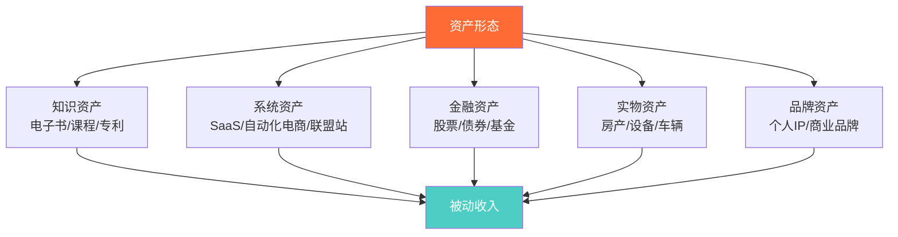
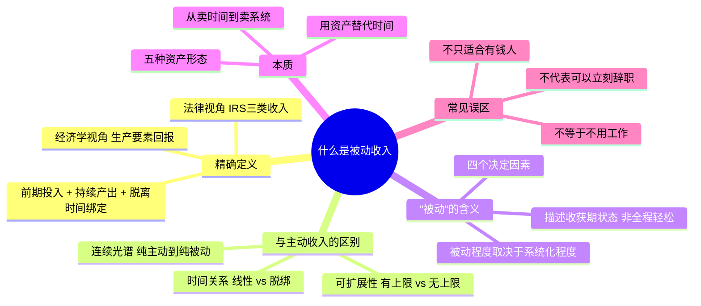

## 一、什么是被动收入？

> **一句话定义：** 被动收入是指你在完成前期投入（时间、资金、技能）之后，能够在不再持续投入劳动的情况下持续获得的收入。"被动"描述的是收入获取阶段的状态，而非整个过程的轻松程度。

这个定义包含三个关键要素，缺一不可：

1. **前期投入存在**——你必须先工作，先创造，先积累
2. **持续产出**——收入不是一次性的，而是反复发生的
3. **脱离个人时间绑定**——收入的产生不依赖你每小时都在场

如果有人告诉你"什么都不用做就能赚钱"，那不是被动收入，那是骗局。

---

### 1. 精确定义：法律视角与经济学视角

"被动收入"这个词在不同语境下有不同含义。要真正理解它，需要从两个权威视角来看。

#### 1.1 美国国税局（IRS）的法律定义

IRS 是全球对被动收入定义最明确的机构之一。在《美国国内税收法》（Internal Revenue Code）中，被动收入（Passive Income）被严格定义为来自以下两类活动的收入：

- **租赁活动（Rental Activities）**：无论你是否实质性参与，来自不动产租赁的收入在税务上通常被归类为被动收入
- **被动活动（Passive Activities）**：你在其中没有"实质性参与"（Material Participation）的商业活动。IRS 对"实质性参与"有明确标准——每年参与时间不超过 750 小时，或不超过该活动总参与时间的 5%

这个定义的法律意义在于：**被动收入可以与被动亏损对冲，但通常不能与主动收入（如工资）的税款对冲。** 这直接影响你的税务规划策略。

IRS 将所有收入分为三类：

| 收入类型 | 定义 | 典型来源 | 税务处理 |
|----------|------|----------|----------|
| **主动收入（Active/Ordinary Income）** | 通过持续劳动获得的收入 | 工资、薪金、自由职业收入 | 按普通所得税率征收，最高 37%（美国） |
| **被动收入（Passive Income）** | 来自你未实质性参与的活动或租赁的收入 | 租金、有限合伙分红、无需参与的业务利润 | 可用被动亏损抵扣，部分享受优惠税率 |
| **组合收入（Portfolio Income）** | 来自投资的收入 | 利息、股息、资本利得 | 股息和长期资本利得享受优惠税率（0-20%） |

> **注意：** 在日常语境中，人们说的"被动收入"往往比 IRS 的定义更宽泛，包含了组合收入（如股息）和某些在 IRS 看来属于主动收入的内容（如你亲自管理的在线课程销售）。本书采用日常语境的宽泛定义，但在涉及税务规划的章节会严格区分。

#### 1.2 经济学视角：生产要素与收入分配

经济学中没有"被动收入"这个术语，但有等价的概念框架。在新古典经济学中，收入来源于四种生产要素的贡献：

- **劳动（Labor）** → 工资收入（主动收入）
- **资本（Capital）** → 利息和股息（被动收入）
- **土地（Land）** → 租金（被动收入）
- **企业家才能（Entrepreneurship）** → 利润（混合性质）

被动收入本质上对应的是**资本和土地这两种生产要素的回报**。你通过前期的劳动积累资本或购置资产，然后让资本和资产替你产生收入——这就是"用钱生钱"或"用资产生钱"的经济学基础。

从这个视角看，被动收入不是什么魔法，而是**生产要素回报的正常形式**。关键在于：你需要先通过劳动积累足够的资本或创建足够有价值的资产，才能让这些要素为你工作。

---

### 2. 被动收入 vs 主动收入：本质区别

很多人对被动收入的误解，源于没有真正理解它与主动收入的本质区别。这不是"躺着赚钱 vs 站着赚钱"那么简单。

#### 2.1 四个维度的对比

| 维度 | 主动收入 | 被动收入 |
|------|----------|----------|
| **与时间的关系** | 线性绑定：工作1小时=赚1小时的钱 | 脱绑：收入不依赖你的实时参与 |
| **可扩展性** | 有硬上限：一天最多24小时 | 理论上无上限：同一资产可服务无数人 |
| **前期投入模式** | 持续投入：停止工作=停止收入 | 集中投入：前期集中建设，后期维护 |
| **风险特征** | 低风险但低天花板：收入稳定但增长有限 | 高风险但高天花板：可能失败，但成功后回报巨大 |
| **典型心态** | "我的时间值多少钱？" | "我投入的这些时间能变成什么资产？" |

#### 2.2 一个关键区分：你停止工作后会发生什么？

判断一种收入是否"被动"，最实用的方法是问自己：**如果我停止工作 3 个月，这笔收入会怎样？**

- **工资**：停止工作 → 收入归零 → 这是主动收入
- **自由职业按项目收费**：停止接单 → 收入在完成现有项目后归零 → 这也是主动收入
- **出租房产**：你去旅行3个月 → 租金照收（前提是已委托物业管理） → 这是被动收入
- **电子书销售**：你3个月不写新书 → 旧书仍在销售 → 这是被动收入
- **你亲自运营的YouTube频道**：你停更3个月 → 广告收入大幅下降 → 这是半被动收入

注意最后一项——很多看似被动的收入，实际上有不同程度的"主动"成分。纯粹的被动收入（完全不需要任何维护）在现实中极其罕见。更准确的描述是一个**从纯主动到纯被动的连续光谱**：

大多数人的被动收入项目处于"半被动"到"高被动"的区间。这完全没问题——目标不是追求100%被动，而是**逐步减少收入对你个人时间的依赖程度**。

#### 2.3 "伪被动收入"辨识

市场上充斥着包装成"被动收入"的伪概念。以下几种常见情况需要注意：

**伪被动收入一：需要你持续高强度参与的"被动"项目**

典型表现：一个号称"被动收入"的联盟营销网站，实际上需要你每天花 4 小时写文章、做 SEO、维护社交媒体。这不是被动收入，这是换了个地方打工。

判断标准：如果你的"被动收入"项目每周需要你投入超过 10 小时的维护时间，它更接近一份自由职业而非被动收入。

**伪被动收入二：把副业美化为被动收入**

典型表现：白天上班，晚上在淘宝卖货。虽然卖的是实物商品，但你需要持续选品、上架、客服、发货。这是"主动收入的第二份工作"，不是被动收入。

判断标准：副业和被动收入的区别在于——副业是"再做一份工作"，被动收入是"构建一个不需要你一直在的系统"。

**伪被动收入三：高风险投机的美化**

典型表现：加密货币炒作、外汇交易、NFT 翻卖。这些需要你持续关注市场、频繁操作，且风险极高。它们被包装成"让钱为你工作"，但实际上是高度活跃的投机行为。

判断标准：如果你需要每天查看行情才能安心，或者你的收入取决于你能否"低买高卖"的判断力，这不是被动收入。

---

### 3. 被动收入的"被动"到底是什么意思？

这是最容易被误解的部分。"被动"（Passive）不是指"不需要努力"，而是指**收入获取阶段的状态**。

#### 3.1 时间线上的"被动"

一个被动收入项目的完整生命周期分为三个阶段：

- **阶段一（建设期）**：这是纯主动劳动。你写书、开发软件、攒钱买房产、搭建网站——此时没有任何收入，只有投入。大多数人在这个阶段放弃。
- **阶段二（启动期）**：产品上线，开始有少量收入，但你需要不断调试、优化、修复问题。收入不稳定，投入产出比很低。
- **阶段三（收获期）**：系统稳定运行，收入持续且相对稳定。你的主要工作变成了定期维护和小幅优化。**这才是"被动"发生的阶段。**

"被动"描述的是阶段三的状态，而非整个过程。用一个比喻来说：**被动收入就像种果树——前期需要挖坑、浇水、施肥（主动投入），但一旦树长大了，它每年都会结果子（被动产出），你只需要偶尔修剪一下枝叶（轻度维护）。**

#### 3.2 不同被动收入类型的"被动程度"

不同类型的被动收入，其"被动程度"差异巨大：

| 收入类型 | 建设期投入 | 日均维护时间 | 被动程度 | 适合谁 |
|----------|-----------|-------------|----------|--------|
| 指数基金定投 | 低（只需开户和定投） | 约 0 分钟 | ★★★★★ | 所有人 |
| 电子书版税 | 中（3-6个月写作） | 约 10 分钟 | ★★★★☆ | 写作能力强的人 |
| 设计模板销售 | 中（1-3个月制作） | 约 20 分钟 | ★★★★☆ | 设计师 |
| 自动化电商 | 高（3-6个月搭建） | 约 30-60 分钟 | ★★★☆☆ | 有电商经验的人 |
| SaaS 产品 | 很高（6-12个月开发） | 约 1-2 小时 | ★★★☆☆ | 程序员 |
| 联盟营销网站 | 高（持续内容创作） | 约 1-2 小时 | ★★☆☆☆ | SEO 和内容创作者 |
| 租金收入（自己管理） | 很高（购房+装修） | 约 1-2 小时 | ★★☆☆☆ | 资金充裕的人 |
| 租金收入（委托管理） | 很高（购房+装修） | 约 10 分钟 | ★★★★☆ | 资金充裕且信任外包的人 |
| YouTube 频道 | 高（持续创作） | 约 2-3 小时 | ★★☆☆☆ | 内容创作者 |
| 播客 | 中（设备+录制） | 约 1-2 小时 | ★★★☆☆ | 有表达能力的人 |

> **关键洞察：** 同一种收入类型，"被动程度"取决于你的系统化程度。同样是房产租金，自己管理是半主动的，委托物业管理公司就变成了高度被动的。**被动收入的"被动"不是天然的，是设计出来的。**

#### 3.3 被动程度的决定因素

影响一种收入"被动程度"的核心因素有四个：

**因素一：边际成本是否趋近于零**

数字产品（电子书、软件、课程）的核心优势在于——你制作一份的成本和制作一万份的成本几乎相同。这意味着一旦产品完成，每多卖一份的边际成本接近零，你的收入可以无限扩展而不需要增加劳动。

相反，如果你做的是需要逐个客户服务的咨询业务，每多一个客户就需要多投入时间，边际成本不趋零，就很难"被动化"。

**因素二：是否有自动化系统**

你可以手动发货，也可以用自动化工具发货。你可以亲自回复每一封客户邮件，也可以设置自动回复和 FAQ 页面。你可以在每个社交平台手动发帖，也可以用 Hootsuite 定时发布。

被动收入不是"不做"，而是**"用系统替代人力"**。自动化的程度越高，被动程度就越高。

**因素三：是否有第三方分担管理**

委托物业管理公司管理出租房产、让平台自动处理支付和交付、雇佣虚拟助理处理客服——这些都是把"主动"成分外包出去的方式。

每外包一个环节，你的被动程度就提高一档。当然，外包有成本，需要在收入和成本之间找到平衡。

**因素四：内容/产品的生命周期**

一本经典教材可以卖 20 年，一个时效性很强的新闻分析可能只能卖 1 周。产品的"保质期"越长，被动收入的持续性就越强。

这也是为什么**基础性、原理性的内容**比**时效性、热点性**的内容更适合做被动收入——前者的需求不会过时。

---

### 4. 被动收入的本质：用资产替代时间

理解了前面的定义和区分之后，我们可以更深入地探讨被动收入的本质。

#### 4.1 核心公式

被动收入可以用一个简洁的公式来表达：

> **被动收入 = 资产价值 × 杠杆系数 × 时间**

- **资产价值**：你创建的资产（书、软件、投资组合、品牌）值多少钱
- **杠杆系数**：这个资产能在多大程度上脱离你的个人时间来运作
- **时间**：资产持续产生收入的时间长度

主动收入的公式则是：

> **主动收入 = 你的单位时间价值 × 工作时间**

两者的根本区别在于：**主动收入有时间上限（一天24小时），被动收入没有。**

#### 4.2 资产的五种形态

被动收入中的"资产"不限于金融资产。它可以是以下任何一种：

**知识资产**：你掌握的专业知识被固化为可重复销售的产品。一本电子书、一套在线课程、一个知识库——这些都是把你的"脑力"变成了可售卖的商品。知识资产的优势是几乎零边际成本，劣势是需要持续更新以保持相关性。

**系统资产**：你搭建的自动化业务流程。一个自动发货的电商系统、一个自动处理订单的 SaaS 平台、一个自动投放广告并获取佣金的联盟营销网站——这些都是"系统替你工作"的典型。系统资产的优势是可以规模化，劣势是需要技术能力和持续维护。

**金融资产**：你积累的资本通过投资产生回报。股票、债券、基金、REITs——这些是最纯粹的被动收入形式，因为你只需要做出投资决策，资产本身会产生收益。金融资产的优势是真正的高度被动，劣势是需要足够的本金。

**实物资产**：你拥有的有形资产通过出租或使用产生收入。房产、设备、车辆、停车位——这些是通过"拥有稀缺资源"来获取收入。实物资产的优势是有实体支撑、相对稳定，劣势是需要大额初始资金且有维护成本。

**品牌资产**：你建立的个人品牌或商业品牌本身具有价值。一个有 10 万粉丝的博客、一个知名的专业领域账号——品牌资产可以转化为广告收入、赞助、联盟营销佣金等多种被动收入。品牌资产的优势是壁垒高、难以复制，劣势是需要长期持续投入来建立和维护。

大多数成功的被动收入构建者不会只依赖一种资产形态，而是组合使用多种资产。例如：用知识资产（写书）建立品牌资产（个人IP），然后用品牌资产驱动系统资产（在线课程平台），再将收入投入到金融资产（投资组合）中。这种"资产组合"策略是被动收入最大化的关键路径。

#### 4.3 从"卖时间"到"卖系统"的思维跃迁

被动收入的构建本质上是一个思维模式的转变。这个转变可以用一句话概括：

> **从"我能做什么来赚钱？"转变为"我能构建什么系统来赚钱？"**

这两种思维模式导致的行为差异是巨大的：

| 决策场景 | 劳动思维 | 资产思维 |
|----------|----------|----------|
| 周末有空闲时间 | "接一个加班单赚外快" | "用这个时间写一篇能持续引流的博客文章" |
| 学到一个新技能 | "用这个技能接更高价的项目" | "把这个技能录制成课程，卖给1000个人" |
| 发现一个市场需求 | "我来提供这个服务，按小时收费" | "我做一个工具来自动满足这个需求，按月收费" |
| 收到一笔奖金 | "存起来" | "投入到能产生被动收入的资产中" |
| 遇到一个重复性工作 | "每次都手动做" | "写一个脚本自动化它，然后把这个脚本卖给有同样需求的人" |

思维模式的转变不会一夜之间发生。但一旦你开始用"资产思维"审视生活中的每一个机会，你会发现被动收入的机会无处不在——你过去的经验、你掌握的技能、你解决过的问题，都可以被"资产化"。

---

### 5. 被动收入的历史演变

被动收入不是现代发明。它的形式随着人类社会的发展不断演变。

#### 5.1 前工业时代：土地与租金

人类最早的被动收入形式是**土地租金**。拥有土地的领主将土地租给农民耕种，收取地租。这是最原始的"用资产换收入"模式。

在农业社会，土地是最核心的生产资料。"有地就有钱"是数千年的基本经济逻辑。中国历史上的地主阶层、欧洲的封建领主，本质上都是靠土地这一"被动收入资产"维持其经济地位。

#### 5.2 工业时代：资本与利息

工业革命催生了新的被动收入形式——**资本回报**。工厂主投入资本建设工厂，雇佣工人，赚取利润。普通人则通过银行存款获得利息，通过购买债券获得票息。

这个时代的关键创新是**股份公司制度**的成熟。1602年荷兰东印度公司发行了世界上第一只公开交易的股票，从此普通人也能通过持有公司股份获得分红——一种合法的"搭便车"方式。

#### 5.3 信息时代：知识产权与数字产品

20世纪后半叶，知识产权成为越来越重要的被动收入来源。音乐版权、图书版税、专利授权、软件授权——这些形式的核心都是**一次创作，反复售卖**。

互联网的出现彻底改变了游戏规则：

- **分发成本趋近于零**：你不再需要出版社、唱片公司、实体店铺。一个电子书可以直接在 Amazon 上卖给全球读者，一个软件可以通过官网直接下载。
- **全球市场触手可及**：你的潜在客户从"住在你城市的人"变成了"全世界有互联网的人"。
- **自动化成为可能**：支付、交付、客服、营销——互联网时代的工具让几乎每个环节都可以自动化。

#### 5.4 AI 时代：智能资产与自动化系统

我们正在进入一个新的阶段。AI 技术正在降低被动收入的构建门槛：

- **内容创作加速**：AI 辅助写作、设计、编程，大幅缩短了"建设期"的时间投入
- **自动化程度提升**：AI 客服、智能推荐、自动化营销——系统可以更加"自运转"
- **个性化规模化**：AI 让你能以低成本为每个客户提供个性化的体验

但 AI 也带来了新的挑战：当内容创作变得更容易，竞争也变得更激烈。**单纯依靠"做出来"已经不够了，还需要"做得好"和"做得独特"。**

---

### 6. 理解被动收入的常见认知纠偏

在深入学习之前，先纠正几个最常见的错误认知。

#### 6.1 "被动收入 = 不用工作"

**错误。** 被动收入需要大量的前期工作。区别在于：主动收入是"持续工作换持续收入"，被动收入是"集中工作换长期收入"。

那些声称"零工作零投入就能躺赚"的项目，99% 是骗局，1% 是极少数幸运者的故事（幸存者偏差）。

#### 6.2 "被动收入只适合有钱人"

**错误。** 被动收入有多种形态，有些需要资金（如投资、房产），有些需要技能和时间（如数字产品、在线课程），有些几乎零成本（如写博客、做联盟营销）。

确实，有资金的人在金融类被动收入上有优势。但在知识类和系统类被动收入上，**技能和时间比资金更重要**。一个程序员可以用零资金开发一个 SaaS 产品，一个写作者可以用零资金出版一本电子书。

#### 6.3 "有了被动收入就可以辞职"

**不一定。** 这取决于你的被动收入能否覆盖你的生活开支。在被动收入稳定达到你生活成本的 1.5-2 倍之前，不建议辞去主业。多出的部分用于再投资和应对收入波动。

更务实的策略是：**主业保底 + 被动收入增长 → 被动收入超过主业 → 选择性辞职或减少主业时间。** 这个过程通常需要 2-5 年。

#### 6.4 "被动收入越多条越好"

**错误。** 同时启动太多被动收入项目会导致每个项目都做不深、做不精。结果是 10 个半成品项目，每个都赚不了多少钱。

正确的策略是：**专注构建 1-2 个核心被动收入源，等它们稳定后再扩展。** 本章核心技巧部分会详细讲解"核心-增长-探索"三层组合策略。

#### 6.5 "被动收入一旦建立就永远赚钱"

**错误。** 几乎所有被动收入都需要某种程度的维护。市场在变、竞争者在出现、技术在更新、用户需求在迁移。一本 5 年前写的关于某款软件的电子书，如果软件已经大版本更新，这本书的销量会急剧下降。

被动收入的维护工作量通常远小于建设期，但**"零维护"是一个危险的幻想**。那些因为"建好了就不管了"而导致被动收入归零的案例比比皆是。

---

### 7. 本节核心要点

**三个必须记住的核心认知：**

1. **被动收入的"被动"是结果，不是起点。** 任何被动收入都需要前期大量的主动投入。区别在于——你是在"建设一个资产"还是在"重复一份工作"。
2. **被动收入的本质是"用资产替代时间"。** 你需要通过前期劳动创建资产（知识、系统、金融、实物、品牌），然后让资产替你产生收入。
3. **被动收入的程度是一个光谱，不是二元的。** 不要纠结于"100%被动"，而是关注"如何让收入更少地依赖我的实时参与"。

理解了这些基础概念之后，下一节我们将系统梳理被动收入的五大类型，了解每种类型的运作机制和适用场景。

---

> **延伸阅读：** 如果你想了解美国税法对被动收入的详细规定，可以参考 IRS Publication 925（Passive Activity and At-Risk Rules）。中国税法中没有完全对应的"被动收入"分类，但《个人所得税法》中的"财产租赁所得""利息、股息、红利所得""特许权使用费所得"本质上属于被动收入范畴，税率和计算方式各有不同，将在后续章节详细讨论。
