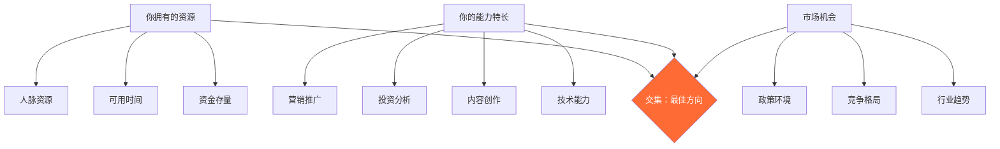

## 二、被动收入的五大类型

理解被动收入的分类体系，是选择正确方向的前提。本节将被动收入划分为五大类型，逐一剖析其**运作机制、收益特征、风险画像和适用人群**，并在最后提供一个横向对比框架，帮你快速定位最适合自己的起点。

### 被动收入来源全景图

```mermaid
graph TB
    PI[被动收入体系] --> R[版税收入]
    PI --> D[股息收入]
    PI --> RE[租金收入]
    PI --> DP[数字产品]
    PI --> AO[自动化业务]

    R --> R1[图书版税]
    R --> R2[音乐/音效版税]
    R --> R3[软件授权]
    R --> R4[专利/技术授权]
    R --> R5[图片/素材版税]

    D --> D1[个股分红]
    D --> D2[股息ETF/指数基金]
    D --> D3[REITs分红]
    D --> D4[债券/固收利息]
    D --> D5[P2P/债权收益]

    RE --> RE1[住宅出租]
    RE --> RE2[商业地产出租]
    RE --> RE3[设备/工具出租]
    RE --> RE4[共享空间出租]

    DP --> DP1[电子书/知识付费]
    DP --> DP2[设计模板/素材]
    DP --> DP3[在线课程/训练营]
    DP --> DP4[软件工具/插件]
    DP --> DP5[付费社群/会员]

    AO --> AO1[联盟营销]
    AO --> AO2[自动化电商/POD]
    AO --> AO3[广告收入]
    AO --> AO4[SaaS产品]
    AO --> AO5[内容矩阵]

    style PI fill:#FF6B35,color:#fff
    style R fill:#4ECDC4,color:#fff
    style D fill:#45B7D1,color:#fff
    style RE fill:#96CEB4,color:#fff
    style DP fill:#FFEAA7,color:#333
    style AO fill:#DDA0DD,color:#333
```



> **先看全局再深入：** 五种类型并非互斥。一个在线课程（数字产品）可以通过联盟营销推广（自动化业务），课程视频放在YouTube上还能获得广告收入（自动化业务），课程讲义整理成电子书出版（版税收入）。成熟的被动收入构建者往往是**组合型选手**——但入门时，请先聚焦一个类型，做到稳定产出后再扩展。

---

### 1. 版税收入：一次创作，持续收割

#### 1.1 什么是版税收入

版税收入（Royalty Income）是指创作者将知识产权（IP）授权给他人使用，按约定比例或固定费用持续获得报酬的收入形式。它的核心特征是**创作行为与收入获取在时间上分离**——你完成创作之后，收入可以在没有任何额外劳动的情况下持续流入。

版税收入的历史比大多数人想象的要长。早在1710年，英国《安妮法案》（Statute of Anne）就确立了作者对作品的版权保护和收益权。今天的版税收入已经从传统的图书和音乐扩展到软件、专利、图片素材、游戏IP等众多领域。

#### 1.2 版税收入的主要形式

**（1）图书版税**

图书版税是最经典的版税形式。作者将作品授权给出版社或自出版平台销售，按每册定价的一定比例获得报酬。

| 出版模式 | 版税率 | 优势 | 劣势 |
|---------|--------|------|------|
| 传统出版社 | 8%-15%（纸质），15%-25%（电子） | 编辑支持、品牌背书、渠道资源 | 周期长（6-18个月）、自主权低 |
| 自出版（Amazon KDP等） | 35%-70%（取决于定价和平台） | 收益率高、上架快、完全自主 | 需自行推广、缺乏编辑支持 |
| 国内平台（豆瓣阅读、微信读书等） | 30%-50% | 中文读者覆盖广 | 平台分成比例不透明 |
| 知识付费平台（知乎盐选、得到等） | 50%-70% | 平台流量大 | 内容形式受限、平台规则多变 |

**关键数据：** 根据Amazon KDP的公开数据，自出版电子书的中位数年收入约为$1,000-$5,000（约7,000-35,000元），但头部5%的作者占据了超过80%的总收入。这说明版税收入具有**极强的幂律分布特征**——少数作品赚走大部分钱，多数作品收入平平。

**（2）音乐与音效版税**

音乐版税的来源比想象中多元：

- **机械复制权版税**：作品被复制成实体或数字格式时产生（如CD、流媒体播放）
- **表演权版税**：作品在公共场合播放时产生（电台、商场、演出）
- **同步权版税**：作品被用在影视、广告、游戏中时产生
- **流媒体版税**：Spotify、Apple Music、网易云音乐等平台按播放次数支付

独立音乐人在流媒体平台的单次播放收入极低（Spotify约$0.003-$0.005/次），但音效素材库（如Epidemic Sound、Artlist）的模式更适合普通人——上传高质量音效/背景音乐，按下载次数获得版税，一个拥有500+音效的创作者月收入可达$500-$2,000。

**（3）软件授权与SaaS订阅**

软件开发者可以通过以下方式获得版税性质的收入：

- **一次性授权费**：用户购买永久使用权（如传统桌面软件）
- **订阅制**：按月/年收费（SaaS模式，下文详述）
- **应用商店分成**：App Store/Google Play按销售额的70%支付给开发者
- **插件/模板市场**：WordPress主题、Shopify模板等按销量获得持续收入

Envato Market（ThemeForest等平台）上，一个热门WordPress主题的累计收入可达数万甚至数十万美元。作者只需持续维护兼容性，不需要主动销售。

**（4）专利与技术授权**

将专利技术授权给企业使用，按产品销售额的1%-5%收取授权费（具体比例取决于专利的技术壁垒和商业价值）。这是门槛最高的版税形式，但单笔收入也最为可观。

**（5）图片与视觉素材版税**

摄影师、插画师、设计师可以将作品上传到素材库平台获得持续收入：

- **微利图库**：Shutterstock、Adobe Stock、iStock等，单次下载收益$0.25-$2.00，靠量取胜
- **高端图库**：Getty Images、Offset等，单次下载收益$20-$500，对作品质量要求极高
- **国内平台**：视觉中国、图虫等，模式类似但单价更低

一个在Shutterstock上拥有5,000+图片的摄影师，月收入可达$500-$3,000。关键在于**图片的商业价值**——商务场景、科技主题、生活方式类图片的需求远高于艺术摄影。

#### 1.3 版税收入的核心机制

版税收入之所以能成为被动收入，依赖于三个底层机制：

**（1）知识产权的排他性保护**

法律赋予创作者对其作品的独占权利。任何人使用你的作品都需要获得授权并支付报酬。这种法律保护是版税收入存在的基础。

**（2）数字产品的零边际复制成本**

一部电子书的第一次创作可能需要6个月，但第二份拷贝的成本为零。这意味着每多卖出一份，利润率接近100%。这种成本结构使得**长尾收入**成为可能——即使作品不再热门，零成本维护意味着每一笔收入都是净收益。

**（3）平台的分发网络效应**

当你的作品上架到Amazon、Spotify、Shutterstock等平台后，平台的推荐算法和搜索系统会持续将作品推送给潜在买家。你不需要亲自销售，平台的分发网络就是你的"销售团队"。

#### 1.4 版税收入的风险与局限

| 风险类型 | 具体表现 | 应对策略 |
|---------|---------|---------|
| 收入不可预测 | 无法准确预估某个月能赚多少 | 同时维护多部作品，分散单一作品风险 |
| 版权侵权 | 作品被盗版或未授权使用 | 注册版权、使用水印、定期检索侵权 |
| 内容过时 | 技术类书籍可能因技术迭代而失去价值 | 选择不易过时的主题，或定期更新版本 |
| 平台依赖 | 平台政策变化可能影响收入 | 多平台分发，建立自有渠道（邮件列表等） |
| 竞争加剧 | 同类作品越来越多，分流注意力 | 深耕细分领域，建立个人品牌壁垒 |

#### 1.5 适合什么样的人

版税收入最适合**有专业积累且擅长内容创作的人**。具体而言：

- 有某个领域的深度专业知识（可以写出有价值的内容）
- 有持续写作/创作的习惯和能力
- 能接受前期投入大、回报慢的节奏（一本书从写作到稳定收入通常需要8-18个月）
- 不追求即时回报，看重长期积累

---

### 2. 股息收入：让资本为你打工

#### 2.1 什么是股息收入

股息收入（Dividend Income）是指通过持有股票、基金、债券等金融资产获得的分红或利息收入。它的本质是**资本的时间价值回报**——你把资金投入企业，企业用这些资金创造利润，然后把利润的一部分分配给你。

与版税收入不同，股息收入的前置投入不是时间而是**资金**。这使得它成为最适合"有存量资金但时间有限"的人群的被动收入类型。

#### 2.2 股息收入的主要形式

**（1）个股分红**

直接购买上市公司的股票，获得公司定期发放的现金分红。

**股息贵族（Dividend Aristocrats）** 是指连续25年以上每年提高分红的标普500成分股。截至2024年，全球约有60余只这样的股票，包括可口可乐（连续62年提高分红）、强生（连续62年）、宝洁（连续68年）等。

A股市场中，银行股（工商银行、建设银行等）、公用事业股（长江电力等）是典型的高股息标的，股息率通常在4%-7%之间。

**（2）股息ETF与指数基金**

通过购买追踪高股息指数的ETF，一次性获得分散化的股息收入：

| ETF类型 | 代表产品 | 股息率 | 特点 |
|---------|---------|--------|------|
| 红利ETF（A股） | 510880（华泰柏瑞红利ETF） | 4%-6% | 分散持有高分红A股 |
| 恒生高股息ETF | 513660（恒生高股息ETF） | 5%-8% | 港股高息蓝筹 |
| 美国红利ETF | VYM、SCHD、HDV | 2.5%-4% | 美股高分红公司 |
| 全球红利ETF | VIG、IDV | 2%-3.5% | 全球分散配置 |

**（3）REITs（房地产投资信托基金）**

REITs是一种将房地产资产证券化的金融产品。投资者购买REITs份额，就相当于间接持有了商业地产、写字楼、物流园区等不动产，并定期获得租金分红。

REITs的法律要求将90%以上的应税收入分配给投资者，因此分红率通常较高：

- 美国REITs平均股息率：3.5%-5%
- 新加坡REITs平均股息率：5%-7%
- 中国公募REITs（2021年起步）：预期分派率4%-8%

**REITs vs 直接持有房产的对比：**

| 维度 | REITs | 直接持有房产 |
|------|-------|------------|
| 最低投资额 | 几百元起 | 数十万至数百万元 |
| 流动性 | 高（交易所实时买卖） | 低（交易周期数月） |
| 管理成本 | 零（专业团队管理） | 高（租客管理、维修） |
| 分散化 | 一只REIT可持有数十处物业 | 通常只持有1-2处 |
| 杠杆使用 | REITs自身已使用杠杆 | 可自行加杠杆（房贷） |
| 控制权 | 无（依赖管理层） | 完全控制 |
| 税务处理 | 分红按普通收入计税（美国） | 可享受房贷利息抵扣等 |

**（4）债券与固收产品**

- **国债**：中国10年期国债收益率约2%-2.5%，几乎零风险
- **企业债/公司债**：收益率3%-6%，需要评估信用风险
- **债券基金**：通过基金分散持有多种债券，降低单一违约风险
- **银行大额存单**：20万起存，年化2%-3%，受存款保险保护

#### 2.3 股息收入的核心机制

**（1）复利的数学力量**

股息收入最强大的地方在于**股息再投资（DRIP, Dividend Reinvestment Plan）**。将收到的股息自动买入更多股份，产生"利滚利"的指数增长效应。

假设初始投资10万元，年股息率5%，股息全部再投资：

| 年份 | 累计资产 | 年股息收入 | 相当于月收入 |
|------|---------|-----------|------------|
| 第1年 | 105,000元 | 5,000元 | 417元 |
| 第5年 | 127,628元 | 6,381元 | 532元 |
| 第10年 | 162,889元 | 8,144元 | 679元 |
| 第20年 | 265,330元 | 13,266元 | 1,106元 |
| 第30年 | 432,194元 | 21,610元 | 1,801元 |

10万元本金，30年后仅年股息收入就超过2万元——这还没有计算股价本身的增值。

**（2）企业的利润分配机制**

股息收入的来源是企业的盈利能力。只要企业持续盈利并愿意分红，股东就能持续获得收入。这就是为什么选择**盈利稳定、分红历史长、护城河深**的企业至关重要。

**（3）通胀对冲能力**

优质企业的营收和利润通常能跟上甚至超越通胀。这意味着股息收入具有一定的**通胀对冲能力**——随着物价上涨，企业的定价能力也增强，分红金额也会随之增长。

#### 2.4 股息收入的风险与局限

| 风险类型 | 具体表现 | 应对策略 |
|---------|---------|---------|
| 本金波动 | 股价下跌可能导致账面亏损 | 长期持有，不因短期波动卖出 |
| 分红削减 | 企业经营恶化可能降低甚至取消分红 | 选择分红历史长、财务健康的企业 |
| 市场系统性风险 | 经济衰退时所有股票可能同时下跌 | 跨行业、跨地域分散配置 |
| 通胀侵蚀 | 如果股息率低于通胀率，实际购买力下降 | 选择有定价权的企业，或配置抗通胀资产 |
| 需要较大本金 | 要获得可观的股息收入，本金门槛较高 | 从定投开始，利用复利逐步积累 |

#### 2.5 股息收入的本金门槛估算

如果你的目标是月入5,000元股息收入（年6万元），在不同股息率下需要的本金：

| 股息率 | 所需本金 | 对应资产类型 |
|--------|---------|------------|
| 2% | 300万元 | 低风险国债/高等级债券 |
| 4% | 150万元 | A股红利ETF/大盘蓝筹 |
| 6% | 100万元 | 港股高息股/部分REITs |
| 8% | 75万元 | 高息REITs（风险较高） |

股息率越高，通常意味着风险也越高。**不要被高股息率迷惑**——如果一家公司的股息率高达10%以上，往往意味着市场对其经营前景极度悲观，股价大幅下跌导致股息率被动升高。

#### 2.6 适合什么样的人

- 有一定存量资金（至少5-10万元起步）
- 风险偏好中等偏低，追求稳定的现金流
- 有耐心等待复利效应显现（通常需要5-10年才能看到显著效果）
- 具备基本的财务分析能力（至少能看懂财务报表的基础指标）
- 不希望在被动收入上投入太多时间（股息投资是所有被动收入类型中"最被动"的）

---

### 3. 租金收入：最古老的被动收入

#### 3.1 什么是租金收入

租金收入（Rental Income）是通过出租不动产、设备或空间获得的持续性收入。这是人类历史上最古老的被动收入形式之一——在古代，地主收取佃农的粮食地租就是最原始的租金收入。

今天，租金收入的范围已经大大扩展，不仅包括传统的住宅和商业地产出租，还包括设备出租、停车位出租、共享办公空间、储物空间出租等新型形式。

#### 3.2 租金收入的主要形式

**（1）住宅出租**

最传统也最普遍的租金收入形式。投资者购买住宅房产后出租给租客，按月收取租金。

**中国主要城市住宅租售比（2024年数据）：**

| 城市 | 平均租售比 | 含义 |
|------|-----------|------|
| 北京 | 1.5%-2.0% | 需要50-67年租金才能回本 |
| 上海 | 1.5%-2.2% | 需要45-67年租金才能回本 |
| 深圳 | 1.2%-1.8% | 需要55-83年租金才能回本 |
| 成都 | 2.5%-3.5% | 需要29-40年租金才能回本 |
| 长沙 | 3.0%-4.0% | 需要25-33年租金才能回本 |

**关键结论：** 一线城市房价高但租售比低，持有成本高；二三线城市房价低但租售比相对更高。纯从租金收益角度，二三线城市的房产投资回报率更高。

**（2）商业地产出租**

包括写字楼、商铺、工业园区等。商业地产的租金通常高于住宅，但也有更高的管理难度和空置风险。

- 写字楼：受远程办公趋势冲击，空置率上升
- 社区商铺：受电商冲击，但餐饮、服务类商铺仍有刚需
- 仓储物流：受电商增长推动，需求持续上升

**（3）设备与工具出租**

这是一种门槛较低的租金收入形式：

- **摄影/视频设备**：相机、镜头、灯光、无人机等，日租金通常是设备价值的1%-3%
- **工程/施工设备**：脚手架、电焊机、切割机等
- **办公设备**：投影仪、打印机、会议设备
- **户外装备**：帐篷、烧烤架、滑雪板等季节性装备

设备出租的关键是**设备的使用频率和维护成本**。高频使用意味着快速回本，但也意味着更快的折旧和更高的维修费用。

**（4）共享空间出租**

- **停车位**：白天出租给上班族，晚上出租给附近无固定车位的居民。一个位于市中心的停车位月租金可达500-2,000元
- **储物空间**：将闲置的房间、地下室、车库出租给需要存放物品的人
- **共享办公**：将闲置的房间或桌子出租给自由职业者、远程工作者
- **场地出租**：将场地出租给活动、拍摄、培训等需求方

#### 3.3 租金收入的核心机制

**（1）实物资产的天然稀缺性**

土地和建筑的供给是有限的，尤其在人口密集的核心城市区域。这种稀缺性保证了租金的长期上涨趋势——尽管短期内可能受经济周期影响而波动。

**（2）杠杆效应**

房产投资可以用银行贷款撬动更大的资产。用30%的首付购买一套100万的房产，相当于用30万的资金控制了100万的资产。如果房价上涨10%，你的实际收益率是33%（不考虑利息成本）。

但杠杆是双刃剑——房价下跌10%，你的本金也会损失33%。

**（3）被动化管理**

通过将物业管理外包给专业的物业管理公司或长租公寓运营商，可以将"半主动"的租金收入转变为真正的被动收入。管理费通常为租金的8%-15%。

#### 3.4 租金收入的风险与局限

| 风险类型 | 具体表现 | 应对策略 |
|---------|---------|---------|
| 空置风险 | 房间无人租住时零收入 | 选择交通便利、配套齐全的地段；合理定价 |
| 租客风险 | 租客拖欠租金、损坏房屋 | 签订详细合同、收取押金、购买房东保险 |
| 政策风险 | 租金管制、房产税政策变化 | 关注政策动向，分散区域配置 |
| 流动性差 | 房产变现周期长（数月） | 不将应急资金投入房产 |
| 维护成本 | 装修、维修、折旧 | 将维护成本纳入收益计算 |
| 资金门槛高 | 首付+装修+家具通常需要数十万元 | 考虑REITs作为替代方案 |

#### 3.5 租金收入的真实回报计算

很多人高估了租金收入的真实回报率。一套完整的收益计算应该包括：

```text
年净租金收入 = 年租金总额 - 空置损失 - 物业管理费 - 维修费 - 保险费 - 房贷利息 - 房产税

实际年化回报率 = 年净租金收入 / 总投入资金（首付+装修+交易成本）
```

以一套二线城市总价80万的两居室为例：

| 项目 | 金额 |
|------|------|
| 首付（30%） | 240,000元 |
| 装修+家具 | 60,000元 |
| 交易税费 | 20,000元 |
| **总投入** | **320,000元** |
| 月租金 | 3,000元 |
| 年租金总额 | 36,000元 |
| 减去：空置损失（1个月） | -3,000元 |
| 减去：物业管理费 | -2,400元 |
| 减去：维修/折旧 | -3,000元 |
| 减去：房货行息（56万×4.2%） | -23,520元 |
| **年净租金收入** | **4,080元** |
| **实际年化回报率** | **1.28%** |

这个结果可能让人失望——**扣除房贷利息后，租金的实际回报率可能远低于银行定期存款利率**。这就是为什么在高房价低租金的城市，纯靠租金收入"躺赚"并不现实。

**但这并不意味着房产投资没有价值。** 房产的总回报 = 租金收入 + 房产增值 + 杠杆放大效应。在房价上涨周期中，资本增值才是主要收益来源，租金收入更多是"持有期间的现金流补充"。

#### 3.6 适合什么样的人

- 有较大存量资金（通常需要30万元以上）
- 对本地房地产市场有深入了解
- 有时间和精力处理租客相关事务（或愿意付费外包）
- 长期持有心态，不期望短期变现
- 能承受房产流动性差的特点

---

### 4. 数字产品：边际成本趋零的印钞机

#### 4.1 什么是数字产品收入

数字产品收入是指通过创建和销售数字化产品获得的收入。数字产品包括电子书、在线课程、设计模板、软件工具、付费社群、音频/视频内容等。

数字产品是**所有被动收入类型中边际成本最低的**。一份电子书的第一次创作可能需要3-6个月，但第二份、第一千份、第一万份的复制成本几乎为零。这种成本结构使得数字产品具有极强的规模化潜力。

#### 4.2 数字产品的主要形式

**（1）电子书与知识付费产品**

电子书是门槛最低的数字产品形式。不需要出版社、不需要ISBN号，任何人都可以在平台上架自己的电子书。

- **短电子书（Lead Magnet）**：5,000-20,000字，免费或低价（9-29元），用于引流和建立读者群
- **标准电子书**：30,000-80,000字，定价29-99元，是主力收入产品
- **系列电子书**：同一主题的多本电子书，形成产品矩阵，定价每本19-49元

**（2）设计模板与素材**

这是设计师和创意工作者的天然被动收入领域：

- **PPT/Keynote模板**：商务汇报、教育课件、产品发布等场景
- **Notion模板**：项目管理、知识库、生活管理等
- **Canva模板**：社交媒体图片、海报、名片等
- **网站模板**：WordPress主题、Shopify模板、Landing Page模板
- **UI Kit**：App和网站的界面设计组件库
- **字体**：原创字体的授权使用

Creative Market上一个热门的PPT模板售价$15-$49，累计可销售数千份。一个Notion模板创作者在Gumroad上月入$2,000-$10,000的案例并不罕见。

**（3）在线课程与训练营**

在线课程是数字产品中**单价最高、收入潜力最大**的形式：

| 课程形式 | 定价范围 | 制作周期 | 维护成本 |
|---------|---------|---------|---------|
| 短视频课程（录播） | 99-299元 | 2-4周 | 低 |
| 系统课程（录播） | 299-1,999元 | 1-3个月 | 中 |
| 直播训练营 | 999-4,999元 | 持续投入 | 高 |
| 会员制课程 | 99-299元/月 | 持续投入 | 高 |

Udemy上，排名前10%的课程月收入可达$1,000-$10,000。国内的知识付费平台（如极客时间、慕课网等）也为主讲人提供了可观的收入分成。

**（4）软件工具与插件**

对于有编程能力的人来说，开发小工具和插件是极佳的被动收入来源：

- **浏览器扩展**：Chrome扩展的付费高级版
- **VS Code / IDE插件**：开发者工具生态
- **Excel/Google Sheets模板和插件**：解决特定的办公自动化需求
- **WordPress插件**：按站点数量收费的年度订阅
- **移动App**：一次性购买或应用内购买

一个解决具体痛点的Chrome扩展，如果能获得10万+用户，通过Freemium模式（免费基础版+付费高级版）月入$3,000-$10,000是完全可行的。

**（5）付费社群与会员制**

将知识和人脉打包成持续性的社群服务：

- **知识星球**：年费制知识社群，定价99-2,000元/年
- **付费微信群/Discord**：提供持续的内容更新和互动
- **Patreon/爱发电**：创作者订阅平台，粉丝按月赞助
- **Newsletter订阅**：Substack等平台的付费邮件通讯

付费社群的关键在于**持续输出价值**——它不是"一次创作"的被动收入，而是"持续但低强度创作"的半被动收入。

#### 4.3 数字产品的核心机制

**（1）零边际成本**

这是数字产品最核心的经济学特征。传统商品每多生产一个单位就需要额外的原材料和人工成本，但数字产品的复制成本几乎为零。这意味着**利润率可以接近100%**（扣除平台分成和支付手续费后）。

**（2）长尾销售效应**

一本电子书发布3年后，仍然可以通过搜索引擎、平台推荐被新读者发现和购买。这种**长尾效应**使得数字产品的时间投入回报率随着时间推移而持续提高——前期投入的100小时创作时间，可能在5年内产生累计超过1,000小时等值的收入。

**（3）平台分发网络**

数字产品平台（如Amazon、Udemy、Creative Market）拥有庞大的用户基础和成熟的推荐算法。你的产品一旦上架，就自动进入了平台的分发网络。这大大降低了获客成本。

#### 4.4 数字产品的风险与局限

| 风险类型 | 具体表现 | 应对策略 |
|---------|---------|---------|
| 竞争激烈 | 低门槛意味着大量竞争者 | 深耕细分领域，建立差异化优势 |
| 盗版问题 | 数字产品容易被复制传播 | 提供持续更新和社群服务增加附加值 |
| 平台依赖 | 平台政策变化可能影响收入 | 多平台分发+建立自有渠道（邮件列表） |
| 内容过时 | 技术类内容可能很快过时 | 定期更新，或选择常青主题 |
| 前期不确定性 | 无法预知产品是否有市场 | 用MVP快速验证，小规模测试后再全力投入 |

#### 4.5 适合什么样的人

- 有某个领域的专业知识或技能（编程、设计、写作、营销等）
- 喜欢创建和分享内容
- 具备基本的数字工具使用能力
- 能接受产品发布后可能无人问津的风险
- 希望用较低的资金成本启动（数字产品的启动成本主要是时间）

---

### 5. 自动化在线业务：技术驱动的收入引擎

#### 5.1 什么是自动化在线业务

自动化在线业务是指通过技术手段将业务流程中的大部分环节自动化，从而实现"低人工干预、持续收入"的在线商业模式。与其他被动收入类型相比，自动化业务的特点是**前期需要持续的技术投入和运营优化，但一旦系统成熟，维护成本会大幅降低**。

严格来说，自动化业务不是一种"完全被动"的收入——它更像是"主动收入的自动化版本"。但当自动化程度足够高时，其被动性可以接近真正的被动收入。

#### 5.2 自动化业务的主要形式

**（1）联盟营销（Affiliate Marketing）**

联盟营销是通过推广他人的产品或服务获得佣金的商业模式。你不需要创建产品、处理物流或提供客服——你只需要把流量引导到商家的产品页面。

**主要联盟平台：**

| 平台 | 佣金率 | 结算方式 | 适合的推广场景 |
|------|--------|---------|-------------|
| 淘宝客 | 0.5%-50%（因品类而异） | CPA（按成交付费） | 社群推广、内容种草 |
| 京东联盟 | 0.5%-30% | CPA | 评测类内容 |
| Amazon Associates | 1%-10% | CPA | 英文博客/YouTube |
| 各品牌独立联盟 | 10%-50% | CPA/CPS | 垂直领域深度推荐 |

联盟营销的核心竞争力是**流量获取能力**。获得流量的主要方式包括：

- **SEO（搜索引擎优化）**：创建高质量内容，获取Google/百度的自然搜索流量
- **社交媒体**：通过小红书、抖音、YouTube等平台的内容引流
- **邮件营销**：建立邮件列表，定期发送推荐内容
- **付费广告**：用广告投放获得流量（需要精确计算ROI）

**（2）自动化电商**

电商的"自动化"体现在减少人工参与的环节：

- **Dropshipping（代发货）**：客户在你的店铺下单后，由供应商直接发货给客户。你不需要囤货、不需要仓库、不需要物流。利润来自售价与供应商价格的差额
- **POD（Print on Demand，按需印刷）**：你设计图案，客户下单后由平台（如Merch by Amazon、Redbubble）负责印刷和发货。适合有设计能力的人
- **虚拟商品自动化销售**：设计素材、代码、音乐、电子书等数字商品，通过Gumroad、自建Shopify店铺等平台自动交付

**（3）广告收入**

通过创建内容获取流量，再通过广告将流量变现：

- **博客/网站广告**：Google AdSense、Mediavine、AdThrive等广告联盟
- **YouTube广告**：YouTube Partner Program，每千次播放收入约$1-$10（因内容领域和观众地域不同差异巨大）
- **播客广告**：通过赞助商和广告网络获得收入
- **社交媒体广告**：抖音、快手、小红书等平台的创作者分成

一个每月获得10万次页面访问的英文博客，通过Mediavine广告联盟月收入可达$2,000-$5,000。中文博客的广告单价较低，但如果有精准的垂直流量，也可以获得可观的收入。

**（4）SaaS（软件即服务）产品**

SaaS是自动化业务中**收入天花板最高**的形式。用户按月或按年订阅使用软件，开发者持续获得经常性收入（Recurring Revenue）。

SaaS的核心优势是**高客户生命周期价值（LTV）**。一个月费99元的SaaS产品，如果客户平均使用12个月，每个客户的LTV就是1,188元。获取100个客户就意味着年收入约12万元。

独立开发者（Indie Hacker）模式的SaaS产品案例：

- **Notion模板+自动化工具**：月费$5-$29，面向Notion重度用户
- **SEO分析工具**：月费$29-$99，面向内容创作者和营销人员
- **AI写作辅助工具**：月费$19-$49，面向文案和营销人员
- **开发者API服务**：按调用量收费，面向其他开发者

#### 5.3 自动化业务的核心机制

**（1）系统替代人力**

自动化的本质是用系统（软件、流程、第三方服务）替代人工操作。当一个业务的90%以上环节都由系统自动完成时，它就接近了被动收入的状态。

典型的自动化电商流程：


在这个流程中，人工参与的环节可能只有产品选择和营销策略——其他环节全部自动化。

**（2）规模效应**

在线业务的边际成本远低于线下业务。一个面向100个客户的SaaS系统和一个面向10,000个客户的SaaS系统，运营成本的差异远小于收入的差异。

**（3）数据驱动优化**

在线业务可以精确追踪每一个环节的数据（流量、转化率、客单价、复购率等），并通过A/B测试持续优化。这使得收入增长更加可预测和可控。

#### 5.4 自动化业务的风险与局限

| 风险类型 | 具体表现 | 应对策略 |
|---------|---------|---------|
| 技术维护 | 系统Bug、服务器宕机、安全漏洞 | 使用成熟的技术栈，定期更新维护 |
| 流量波动 | 搜索引擎算法更新、平台政策变化 | 多渠道获客，不过度依赖单一来源 |
| 竞争加剧 | 低门槛领域容易被模仿 | 建立技术壁垒或品牌壁垒 |
| 客户流失 | SaaS的月流失率通常在3%-7% | 优化产品体验，提供优质的客户服务 |
| 前期投入大 | SaaS产品可能需要6-18个月的开发时间 | 从MVP开始，逐步迭代 |
| "被动"的幻觉 | 自动化业务通常需要持续的运营和优化 | 建立SOP，逐步将运营工作外包 |

#### 5.5 适合什么样的人

- 有技术背景（编程、建站、数据分析等）
- 擅长系统思维和流程优化
- 能接受较长的前期投入期（通常6-18个月）
- 有营销意识（产品做得再好，没有流量也白搭）
- 愿意持续迭代和优化（自动化业务不是"做完就不管"的）

---

### 五种类型的横向对比

为了帮你快速做出方向决策，以下从8个维度对五种被动收入类型进行横向对比：

| 维度 | 版税收入 | 股息收入 | 租金收入 | 数字产品 | 自动化业务 |
|------|---------|---------|---------|---------|-----------|
| **主要前置投入** | 时间 | 资金 | 资金+时间 | 时间 | 时间+技术 |
| **最低启动资金** | <1,000元 | 5万+ | 30万+ | <1,000元 | 1,000-5万元 |
| **达到稳定收入的时间** | 8-18个月 | 3-5年 | 即时（但前期积累耗时长） | 3-12个月 | 6-18个月 |
| **被动程度** | ★★★★★ | ★★★★★ | ★★★☆☆ | ★★★★☆ | ★★★☆☆ |
| **收入天花板** | ★★★☆☆ | ★★☆☆☆ | ★★★☆☆ | ★★★★☆ | ★★★★★ |
| **技能门槛** | 写作/创作 | 财务分析 | 房产知识 | 专业知识+营销 | 技术+营销 |
| **风险等级** | 中 | 低-中 | 中-高 | 中 | 中-高 |
| **规模化难度** | 中（需持续创作） | 易（追加投资） | 难（资金密集） | 易（零边际成本） | 中（需技术迭代） |

#### 如何选择适合自己的类型

选择被动收入类型，本质上是在以下三个维度之间找到交集：



**快速决策指南：**

- **你有很多钱但没时间** → 股息收入 > 租金收入
- **你有时间但没资金** → 数字产品 > 版税收入 > 自动化业务
- **你有技术能力** → 自动化业务（SaaS、自动化电商）
- **你有专业知识** → 数字产品（在线课程、电子书）
- **你有设计能力** → 数字产品（模板、素材）+ 版税收入（视觉素材库）
- **你追求最低风险** → 股息收入（ETF定投）
- **你追求最高上限** → 自动化业务（SaaS产品）

> **核心建议：不要同时开始超过2个被动收入项目。** 先选一个最匹配的类型，投入6-12个月做到稳定产出，再考虑第二个。同时做太多项目，每个都做不深，结果什么都赚不到。

---

### 混合型被动收入：组合的艺术

成熟的被动收入构建者通常不是只做一种类型，而是构建**混合型收入组合**。这种组合的核心逻辑是**用不同类型收入的优势互补**：

**案例：一个知识博主的收入组合**

| 收入来源 | 类型 | 月均收入 | 特点 |
|---------|------|---------|------|
| 自出版电子书（3本） | 版税收入 | 3,000元 | 稳定，长尾 |
| 在线课程（2门） | 数字产品 | 8,000元 | 高单价，有生命周期 |
| 博客广告收入 | 自动化业务 | 2,000元 | 完全被动 |
| 联盟营销佣金 | 自动化业务 | 4,000元 | 依赖流量 |
| 股息投资组合 | 股息收入 | 1,500元 | 最稳定，无运营成本 |
| **合计** | | **18,500元** | |

这个组合的优势在于：**即使某一个收入来源出问题（比如博客流量下降），其他收入来源仍然稳定**。这就是收入多元化的核心价值——不是为了赚更多，而是为了让收入更稳定、更抗风险。

构建混合收入组合的推荐路径是**核心-卫星策略**：

1. **核心收入**（占总收入60%-70%）：1-2个已经稳定运行的项目
2. **增长收入**（占总收入20%-30%）：1-2个正在快速增长的项目
3. **探索收入**（占总收入5%-10%）：1个试验性的新项目，验证可行性

---

### 本节核心要点

1. 被动收入分为五大类型：版税收入、股息收入、租金收入、数字产品、自动化在线业务
2. 每种类型有不同的**前置投入类型**（时间vs资金vs技术）、**风险特征**和**收入结构**
3. 没有"最好"的被动收入类型，只有"最适合你"的类型——取决于你的资源、能力和市场机会
4. 选择时应考虑三个交集：你拥有的资源、你的能力特长、市场机会
5. 先聚焦一个类型做到稳定产出，再扩展第二个
6. 最终目标是构建混合型收入组合，用不同类型收入的优势互补，实现稳定且抗风险的现金流

***

