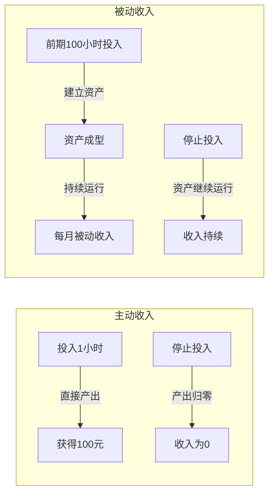
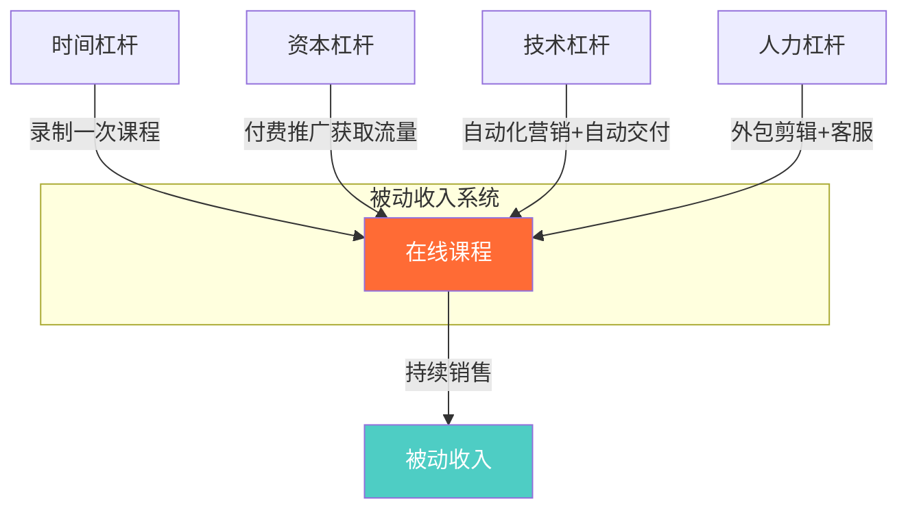
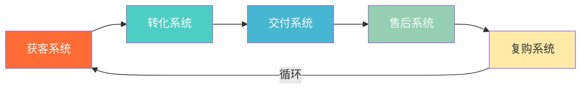
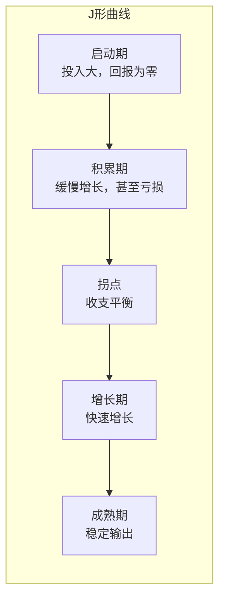
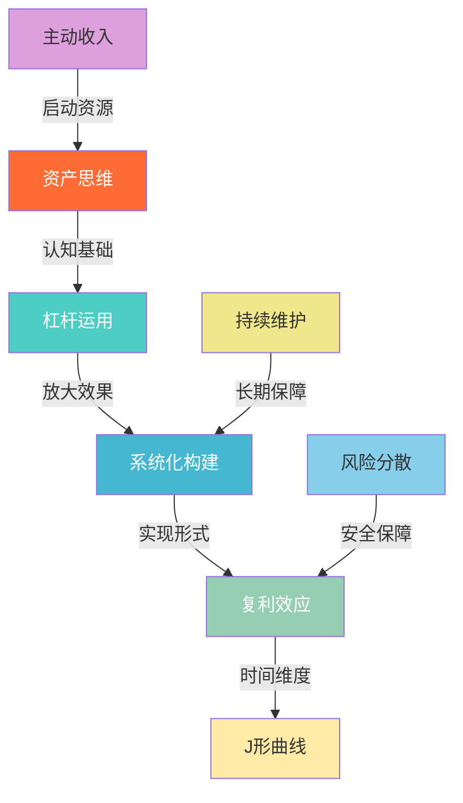

## 三、被动收入的底层逻辑

理解被动收入的表象容易——"不工作也能赚钱"；但真正掌握被动收入的构建规律，必须深入其底层逻辑。本节从经济学原理、行为科学和系统论三个维度，拆解被动收入运行的核心机制，帮助你建立正确的认知框架，避免在实践中走弯路。

### 核心公式：前期投入 × 杠杆系数 × 时间 = 后期产出

被动收入的本质是一种**时间杠杆**——你把当下的时间、精力和资源，投入到一个具有杠杆效应的载体中，这个载体持续放大你的时间价值，使你未来的劳动产出不再与投入时间成正比。

用数学语言表达：

```text
主动收入：I = T × R    （收入 = 时间 × 时薪，线性关系）
被动收入：I = (T₀ × L) ^ t    （收入 = 初始投入 × 杠杆 × 时间因子，非线性关系）
```

其中：
- **T₀** = 初始投入的时间/资金/资源
- **L** = 杠杆系数（取决于载体类型、市场、技术等因素）
- **t** = 时间因子（资产持续运营的时间长度）

这意味着：
- **主动收入**：你今天工作8小时，赚800元；明天不工作，收入为0。收入曲线是一条斜率为正的直线，但永远过原点——没有投入就没有产出。
- **被动收入**：你花100小时做一个产品，前3个月可能收入为0；第4个月开始有收入；第12个月达到每月3000元；之后即使你什么都不做，收入仍在继续。收入曲线是一条J形曲线——前期平坦甚至为负，后期指数上升。



理解这个核心公式是构建被动收入的第一步。接下来，我们逐一拆解其中的关键变量。

---

### 逻辑一：资产思维替代劳动思维

#### 什么是劳动思维？

劳动思维的核心假设是：**收入 = 劳动时间 × 单位报酬**。这种思维模式在90%以上的工薪阶层中根深蒂固——"我今天工作8小时，赚800元"、"我加班4小时，多赚400元"。它的本质问题在于：收入的上限被时间天花板锁死。一个人每天最多工作16小时，每年最多工作365天，即使时薪很高，总收入也有硬性上限。

#### 什么是资产思维？

资产思维的核心假设是：**收入 = 资产价值 × 资产运行效率**。你花100小时做一个产品，这个产品每个月能卖500份；你把一小时的课程录制下来，这个课程可以被10000个人购买。

资产思维的核心问题是：**我现在做的事情，能否在我停止工作后继续产生价值？**

如果答案是"不能"，那你就在做**消耗型工作**——时间投入后价值立即兑现，之后归零。如果答案是"能"，那你就在做**资产型工作**——时间投入后凝结为资产，持续产出价值。

#### 消耗型工作 vs 资产型工作对比

| 维度 | 消耗型工作 | 资产型工作 |
|------|-----------|-----------|
| 时间与收入关系 | 严格正比，投入停止则收入停止 | 前期正比，后期脱钩 |
| 收入上限 | 受限于可用时间 | 理论上无限 |
| 边际成本 | 每次产出都需重新投入 | 趋近于零 |
| 风险特征 | 低风险，低回报 | 前期高风险，后期低风险 |
| 典型例子 | 上班、接单、跑滴滴 | 写书、做课程、投资 |
| 5年后状态 | 换了5份工作，收入线性增长 | 拥有5个资产，收入指数增长 |

#### 如何培养资产思维？

培养资产思维不是一蹴而就的，需要在日常工作中有意识地训练：

**第一步：审视日常工作。** 拿出一张纸，列出你每周做的所有事情，逐一判断——这件事如果我停止做，3个月后还有价值吗？如果有，标记为"资产型"；如果没有，标记为"消耗型"。

**第二步：重新分配时间。** 将至少20%的工作时间从消耗型转向资产型。比如：与其每天在群里回答相同的问题，不如把常见问题整理成一篇文档或视频教程，放在网上供人查阅。

**第三步：建立"资产账本"。** 记录你创建的每一个资产：创建时间、维护成本、当前产出、预期生命周期。这个账本会让你清晰地看到自己的"被动收入资产组合"正在如何增长。

**误区警示：** 资产思维不等于"不劳动"。在被动收入构建的初期，你比任何人都需要投入更多的劳动——只不过这些劳动的方向不同：不是在用时间换钱，而是在用时间建资产。

---

### 逻辑二：杠杆——放大时间价值的四种核心力量

杠杆是被动收入的发动机。没有杠杆，就不可能脱离"时间换钱"的线性陷阱。理解杠杆的类型和运作机制，是构建被动收入的关键。

#### 1. 时间杠杆——用一次投入撬动长期收益

时间杠杆是最基础的杠杆形式：你投入一次时间创造资产，这个资产在之后的时间里持续产生收益。

**核心机制：** 将"一次性劳动"转化为"可复制的价值单元"。

**案例分析：** 假设你是一位Python讲师，每小时收费500元。如果你每月工作80小时，月收入40000元。但如果你花200小时录制一套系统课程，定价299元，每月自然销售100份，月收入29900元。前者的收入与你的授课时间严格绑定，后者则完全脱钩——你在睡觉时，课程仍在销售。

**关键变量：**
- 内容的持久性：越是"常青"内容（不随时间过时的知识），时间杠杆越大
- 平台的流量：选择流量大的平台，时间杠杆放大倍数更高
- 更新频率：需要频繁更新的资产，时间杠杆打折（部分时间被锁定在维护上）

#### 2. 资本杠杆——用钱生钱

资本杠杆是最古老、最直接的杠杆形式：你用已有的资金购买产生收益的资产。

**核心机制：** 资本本身成为生产要素，参与价值创造并获取回报。

**常见的资本杠杆形式：**

| 资本杠杆形式 | 年化收益范围 | 门槛 | 风险等级 | 维护成本 |
|-------------|------------|------|---------|---------|
| 银行定存 | 1.5%-3% | 低 | 极低 | 无 |
| 股票分红 | 2%-6% | 中 | 中 | 低 |
| REITs | 4%-8% | 中 | 中 | 低 |
| 债券基金 | 3%-5% | 低 | 低 | 无 |
| 房产出租 | 2%-5%（租金回报率） | 高 | 中 | 中 |
| P2P/众筹 | 已基本清退 | — | 极高 | — |

**资本杠杆的复利公式：**

```text
终值 = 本金 × (1 + 年化收益率) ^ 年数
```

以10万元本金、年化8%收益为例：
- 5年后：146,933元（增长47%）
- 10年后：215,892元（增长116%）
- 20年后：466,096元（增长366%）
- 30年后：1,006,266元（增长906%，突破百万）

这就是资本杠杆的威力——时间越长，复利效应越显著。

#### 3. 技术杠杆——自动化替代人工

技术杠杆是当代被动收入构建中最重要的杠杆之一：用代码、工具和自动化流程替代重复性的人工操作。

**核心机制：** 将人工操作转化为可自动执行的程序，实现"一次开发，无限运行"。

**典型的技术杠杆应用场景：**

- **自动化营销：** 用邮件自动化工具（如Mailchimp、ConvertKit）设置欢迎序列、产品推荐、促销通知，无需手动发送每一封邮件
- **自动化内容分发：** 用Zapier、IFTTT等工具，将一篇文章自动同步到多个社交平台
- **自动化客服：** 用聊天机器人处理80%的常见问题，只有复杂问题才转人工
- **自动化交易：** 用量化策略程序执行股票/基金的定投和再平衡

**技术杠杆的关键原则：**
1. **先手动，再自动：** 不要一上来就追求全自动。先手动跑通流程，确认可行后再用技术手段自动化
2. **选择正确的自动化层次：** 不是所有环节都需要自动化。优先自动化"高频重复"和"不需要创造性"的环节
3. **维护成本不可忽视：** 自动化系统需要维护——API更新、数据异常、规则调整都是隐性成本

#### 4. 人力杠杆——雇人做事

人力杠杆是规模最大的杠杆形式：通过雇用他人来扩大你的产出能力。

**核心机制：** 你从"亲自执行"转变为"设计系统+管理团队"，产出不再受限于你个人的时间和精力。

**人力杠杆的三种模式：**

- **雇员模式：** 直接雇佣全职/兼职员工，适合需要长期稳定运营的业务
- **外包模式：** 将特定任务外包给自由职业者或专业团队，适合非核心环节（如设计、客服、数据录入）
- **合作模式：** 与其他创作者/创业者建立分成合作，各展所长，共担风险

**人力杠杆的风险：**
- 管理成本：你需要投入时间管理团队，这部分时间本身是消耗型的
- 质量控制：团队成员的产出质量参差不齐，需要建立标准化流程和审核机制
- 人员流动：核心成员离职可能影响业务连续性

#### 四种杠杆的综合运用

成熟的被动收入体系往往同时运用多种杠杆。以一个在线课程业务为例：



---

### 逻辑三：系统化取代个人化

#### 个人化模式的陷阱

大多数人构建被动收入失败，不是因为能力不够，而是因为始终停留在"个人化模式"——所有事情都由自己亲自完成，所有价值都绑定在个人身上。

**个人化模式的典型表现：**
- 你亲自给客户上课 → 你不上课就没收入
- 你亲自回复每一条客户消息 → 你休息时客户得不到响应
- 你亲自写每一篇文章 → 产出受限于你的写作速度
- 你亲自处理每一个订单 → 订单多了就忙不过来

个人化模式的本质是"用被动收入的外壳，装着主动收入的内核"——表面上你在做课程、做产品，实际上你只是换了一种打工方式。

#### 系统化模式的核心要素

系统化的本质是**把你从"执行者"变成"设计者"**。你不再亲自做所有事，而是设计一个能自动运转的系统。一个完整的被动收入系统包含五个核心模块：



**1. 获客系统——流量自动化**

获客系统的目标是让你的产品持续被潜在客户发现，而不需要你手动推广。核心手段包括：
- **SEO（搜索引擎优化）：** 让你的内容在搜索引擎中获得自然排名，持续获取免费流量
- **内容营销：** 通过博客、视频、播客等内容形式吸引目标受众
- **付费广告：** 通过Google Ads、Facebook Ads等平台投放精准广告
- **社交媒体：** 在目标受众聚集的平台建立影响力

**2. 转化系统——销售自动化**

转化系统的目标是让访客自动变成付费客户。核心手段包括：
- **销售页：** 精心设计的产品介绍页面，用文案说服访客购买
- **邮件序列：** 通过自动化邮件培养潜在客户的信任，逐步引导购买
- **定价策略：** 阶梯定价、限时优惠、捆绑销售等策略提升转化率
- **社会证明：** 用户评价、案例研究、数据统计增强可信度

**3. 交付系统——产品自动化**

交付系统的目标是让客户付款后自动获得产品，不需要你手动发货。核心手段包括：
- **数字产品平台：** Gumroad、Teachable、小鹅通等平台处理支付和交付
- **自建系统：** 用WordPress + WooCommerce、Shopify等自建电商系统
- **API集成：** 通过API实现支付→发货→通知的全自动流程

**4. 售后系统——服务自动化**

售后系统的目标是自动处理客户的常见问题和需求。核心手段包括：
- **FAQ文档：** 详细的常见问题解答，减少客户咨询量
- **知识库：** 系统化的产品使用指南和教程
- **聊天机器人：** 自动回答80%的常见问题
- **社区支持：** 建立用户社区，让用户之间互相帮助

**5. 复购系统——增长自动化**

复购系统的目标是让现有客户持续购买你的产品。核心手段包括：
- **产品升级：** 定期推出新版本、新功能、新内容
- **产品线扩展：** 围绕核心产品开发相关产品，形成产品矩阵
- **会员体系：** 通过会员制实现持续性收入
- **推荐激励：** 让满意客户推荐新客户，实现病毒式增长

#### 系统化的实施路径

系统化不是一蹴而就的，建议按以下顺序逐步构建：

**阶段一（第1-3个月）：手动验证。** 亲自执行所有环节，验证产品是否有人愿意付费、市场需求是否真实存在。这个阶段不要追求自动化——先证明可行性。

**阶段二（第3-6个月）：关键环节自动化。** 优先自动化交付环节（数字产品自动发货），其次是获客环节（SEO和内容营销），然后是转化环节（自动化邮件序列）。

**阶段三（第6-12个月）：全面系统化。** 将售后和复购环节也纳入系统，实现从获客到复购的全流程自动化。此时你的角色已经从"执行者"转变为"系统设计者和优化者"。

**阶段四（12个月以后）：持续优化。** 通过数据分析找出系统中的瓶颈和改进空间，持续迭代优化。这个阶段的核心工作是"优化系统"而非"亲自执行"。

---

### 逻辑四：复利效应——被动收入的指数增长引擎

复利被爱因斯坦称为"世界第八大奇迹"。在被动收入领域，复利效应体现在三个层面：

#### 层面一：资金复利——利滚利

当你把被动收入再投入到新的资产中，会产生指数级增长。这是最经典的复利形式。

**具体案例：** 假设你有10万元启动资金，每月追加3000元被动收入进行再投资，年化收益8%：

| 年份 | 累计投入 | 资产总值 | 被动收入（月） | 收益率（相对投入） |
|------|---------|---------|-------------|----------------|
| 第1年 | 136,000元 | 142,800元 | 约950元 | 5% |
| 第3年 | 208,000元 | 258,600元 | 约1,724元 | 24% |
| 第5年 | 280,000元 | 412,500元 | 约2,750元 | 47% |
| 第10年 | 460,000元 | 985,600元 | 约6,570元 | 114% |
| 第20年 | 820,000元 | 3,680,000元 | 约24,533元 | 349% |
| 第30年 | 1,180,000元 | 11,200,000元 | 约74,667元 | 849% |

注意：第1年到第5年，收益看起来并不惊人。但从第10年开始，复利的力量开始显现——到第20年，资产总值是累计投入的4.5倍；到第30年，接近10倍。

**这就是为什么被动收入需要耐心——前期增长缓慢，后期增长惊人。**

#### 层面二：知识复利——越学越快

知识和技能的积累同样具有复利效应。你在一个领域学到的知识，会加速你在相关领域的学习：

- **第一个产品：** 花200小时完成，因为你要学习产品设计、营销、平台规则等所有知识
- **第二个产品：** 花100小时完成，因为很多知识可以复用
- **第三个产品：** 花60小时完成，因为你已经形成了标准化流程
- **第五个产品：** 花40小时完成，因为你有了完整的模板和系统

知识复利意味着：你构建被动收入的速度会随着经验积累而加快。

#### 层面三：影响力复利——越做越容易

影响力是被动收入的"隐形杠杆"。随着你的品牌、口碑和受众群体的增长，新产品的推广成本会越来越低：

- **第一个产品：** 需要大量付费推广，获客成本50元/人
- **第三个产品：** 已有一定粉丝基础，获客成本降至20元/人
- **第五个产品：** 品牌已建立，获客成本降至5元/人（主要靠自然传播）
- **后续产品：** 老客户复购 + 口碑推荐，获客成本趋近于零

#### 复利的陷阱：中断和断裂

复利效应最大的敌人是**中断**。如果你在第3年停止再投资，或者频繁更换方向（在不同领域之间跳来跳去），复利的链条就会断裂，之前积累的优势大幅缩水。

**保持复利连续性的关键原则：**
1. **选定方向后坚持至少3年：** 给复利足够的发酵时间
2. **收益再投资：** 被动收入的大部分应投入到资产的增长和扩展中，而非消费
3. **不频繁切换赛道：** 每次切换都意味着知识复利和影响力复利的归零

---

### 逻辑五：J形曲线——理解被动收入的时间节奏

#### J形曲线模型

几乎所有的被动收入项目都遵循"J形曲线"模式——前期投入多、回报少（甚至亏损），经过一个拐点后，收入开始快速增长。



**各阶段详解：**

**启动期（0-3个月）：** 这是最容易放弃的阶段。你需要投入大量时间创建产品、搭建系统、学习新技能，但几乎没有收入。这个阶段的心理挑战最大——你不确定自己的方向是否正确，看不到任何正反馈。

**积累期（3-9个月）：** 产品上线了，开始有零星的收入，但远低于你的投入。你可能花了500小时，月收入只有500元——时薪1元。大多数人在这个阶段会判断"这条路走不通"而放弃。

**拐点（9-18个月）：** 收入开始覆盖运营成本，达到收支平衡。这是一个重要的心理里程碑——你终于不再"亏钱"了。但从投入产出比来看，你的"时薪"仍然远低于正常工作。

**增长期（18-36个月）：** 收入开始快速增长。随着口碑积累、SEO排名上升、复购率提高，你的被动收入可能在6-12个月内翻2-3倍。这个阶段会给你巨大的信心和动力。

**成熟期（36个月以后）：** 收入趋于稳定，你只需要投入少量时间维护和优化。此时，你的"有效时薪"已经远超正常工作——可能你每月只花10小时维护，但收入超过2万元。

#### J形曲线的时间节点

虽然每个人的J形曲线节奏不同，但有一个大致的时间参考：

| 阶段 | 典型时间跨度 | 月收入范围 | 时间投入 | 心理状态 |
|------|------------|-----------|---------|---------|
| 启动期 | 0-3个月 | 0元 | 20-40小时/周 | 兴奋、迷茫 |
| 积累期 | 3-9个月 | 100-2000元 | 15-30小时/周 | 焦虑、怀疑 |
| 拐点 | 9-18个月 | 2000-5000元 | 10-20小时/周 | 释然、坚持 |
| 增长期 | 18-36个月 | 5000-20000元 | 5-15小时/周 | 信心、兴奋 |
| 成熟期 | 36个月+ | 20000元+ | 2-10小时/周 | 从容、规划 |

**关键启示：** 如果你能在前18个月坚持下来，你就已经超越了90%的竞争者。大多数人在这个时间窗口内放弃了——这恰恰是你的机会。

#### 加速J形曲线的方法

虽然J形曲线的形状无法改变，但你可以通过以下方法缩短每个阶段的时间：

1. **借鉴他人经验：** 学习已经走通J形曲线的人的路径，避免他们踩过的坑
2. **选择"快反馈"领域：** 某些领域（如数字产品、联盟营销）的反馈周期比其他领域（如房产、股息投资）短得多
3. **并行构建：** 在主项目积累期的同时，用少量时间尝试小项目，找到更快的反馈循环
4. **投入密度：** 前期投入密度越大，积累期越短。全职投入3个月 > 兼职投入12个月

---

### 逻辑六：主动收入是被动收入的"种子"

#### 被动收入的启动资金从哪来？

一个经常被忽略的现实是：**被动收入几乎都需要启动资源**——无论是时间、资金、技能还是人脉。而这些资源，绝大多数来自你的主动收入。

这就产生了一个悖论：你想摆脱主动收入，但你首先需要主动收入来启动被动收入。

#### 主动收入的三重价值

**1. 资金价值：提供启动资本**

大多数被动收入项目需要一定的前期投入：
- 做在线课程：录制设备、剪辑软件、平台费用（2000-10000元）
- 买股息股票：至少需要数万元本金
- 做房产投资：首付动辄数十万
- 建SaaS产品：开发成本或外包费用（5000-50000元）

你的工资收入是这些启动资本的最可靠来源。

**2. 技能价值：提供核心能力**

在职场中积累的专业技能，往往是构建被动收入的核心竞争力：
- 程序员 → 开发SaaS产品、技术博客、编程课程
- 设计师 → 设计模板、素材库、UI Kit
- 营销人员 → 营销课程、联盟营销、自动化广告
- 教师 → 在线教育、教辅材料、知识付费

**3. 认知价值：提供市场洞察**

在行业中工作让你深刻理解客户痛点、市场需求和竞争格局，这些认知是在市场中找到"有价值的机会"的前提。

#### 主动→被动的过渡策略

不要指望一步到位从主动收入切换到被动收入。更现实的路径是"双轨并行"：

**阶段一（0-12个月）：主动为主，被动为辅。** 保持全职工作，将业余时间（每周10-15小时）用于被动收入项目。目标：完成第一个被动收入产品。

**阶段二（12-24个月）：被动收入开始产生实质回报。** 如果被动收入达到工资收入的30%-50%，可以考虑减少工作时间（如从全职转为兼职），释放更多时间用于被动收入的扩展。

**阶段三（24-36个月）：被动收入接近或超过主动收入。** 当被动收入稳定在工资收入的80%以上，且持续3-6个月，你可以考虑辞职全力发展被动收入。

**阶段四（36个月以后）：被动收入成为主要收入来源。** 你的角色从"打工人"转变为"资产运营者"，主动收入变成可选项而非必选项。

**安全线：** 在被动收入未达到生活开支的120%且持续稳定6个月以上之前，不建议辞职。120%的缓冲是为了应对意外波动——任何收入来源都可能有淡季或下滑期。

---

### 逻辑七：风险分散——不把鸡蛋放在一个篮子里

#### 被动收入的风险类型

被动收入并非"零风险"。理解风险类型，才能做好防范：

**1. 平台风险**
你的收入依赖于某个平台，而平台规则可能随时改变。
- 案例：2023年多个自媒体平台大幅下调创作者分成比例，导致大量创作者收入腰斩
- 应对：不依赖单一平台，将内容和用户沉淀到自有的网站、邮件列表等渠道

**2. 市场风险**
市场需求变化导致产品过时或竞争加剧。
- 案例：某个细分领域的在线课程在2年内从"蓝海"变成"红海"，同类课程从3个增加到300个
- 应对：选择"常青"领域（永远不会过时的需求），持续更新内容保持竞争力

**3. 技术风险**
技术变更导致产品或系统失效。
- 案例：依赖某个第三方API的自动化工具，因API停服而完全失效
- 应对：减少对单一技术方案的依赖，关键系统有备份方案

**4. 法律风险**
版权纠纷、税务合规、行业监管等法律问题。
- 案例：使用未授权素材被起诉，赔偿金额远超收入
- 应对：使用合法素材，了解税务义务，必要时咨询专业人士

**5. 黑天鹅风险**
完全不可预见的突发事件。
- 案例：2020年疫情导致线下租金收入锐减，线下课程完全停摆
- 应对：保持收入来源的多样化，留有足够的现金储备

#### 被动收入组合的构建原则

构建被动收入组合的核心原则与投资组合理论类似——**通过分散化降低非系统性风险**：

**原则一：跨类型分散。** 不要只做一种类型的被动收入。理想组合应包含至少3种不同类型——比如"数字产品 + 股息投资 + 联盟营销"，这样即使某一类型遇到问题，其他来源仍能维持收入。

**原则二：跨平台分散。** 即使在同一类型的被动收入中，也不要只依赖一个平台。比如做数字产品，同时在自己的网站、小鹅通、知识星球等多个渠道销售。

**原则三：跨时间分散。** 不要所有项目同时启动，也不要所有项目处于同一生命周期阶段。理想状态是：有成熟项目贡献稳定收入，有成长项目贡献增长，有新项目储备未来。

**原则四：保持流动性。** 至少保留6个月生活费的现金储备，用于应对收入波动和抓住投资机会。

---

### 逻辑八：被动收入需要"维护"——不存在真正的"零维护"

#### "被动"的真实含义

很多人对"被动收入"最大的误解是：它完全不需要维护。事实恰恰相反——所有被动收入都需要不同程度的维护，只是维护的时间和精力远小于主动收入。

"被动"的准确含义应该是：**收入不再与你投入的时间成线性关系**，而非"完全不需要投入时间"。

#### 不同类型被动收入的维护需求

| 被动收入类型 | 月维护时间 | 维护内容 | 维护难度 |
|-------------|-----------|---------|---------|
| 银行定存/国债 | 0小时 | 无 | 无 |
| 指数基金定投 | 1-2小时 | 检视、再平衡 | 低 |
| 股息投资组合 | 2-4小时 | 持仓分析、分红再投资 | 中 |
| 电子书 | 2-5小时 | 回复评论、偶尔更新 | 低 |
| 在线课程 | 5-10小时 | 内容更新、答疑、平台维护 | 中 |
| 联盟营销网站 | 5-15小时 | 内容更新、SEO优化、链接维护 | 中 |
| SaaS产品 | 10-30小时 | Bug修复、功能更新、客户支持 | 高 |
| 房产出租 | 5-20小时 | 租客管理、维修、账务 | 中高 |

**关键洞察：** 维护时间与收入水平通常正相关——维护时间越少的被动收入，收入天花板也越低（如银行定存）；维护时间越多的被动收入，收入上限也越高（如SaaS产品）。你需要在"维护成本"和"收入潜力"之间找到适合自己的平衡点。

#### 降低维护成本的方法

1. **标准化：** 将常见维护操作标准化为SOP（标准操作流程），方便自己或他人执行
2. **自动化：** 用工具自动化重复性维护任务（如自动监控系统、自动报告）
3. **外包：** 将低价值的维护任务外包给虚拟助理或专业服务
4. **产品设计阶段就考虑维护：** 一开始就设计"低维护"的产品，比事后优化更有效

---

### 底层逻辑之间的关系：一个完整的框架

上述八大底层逻辑不是孤立存在的，它们之间有着紧密的内在联系。理解这些逻辑之间的关系，才能真正掌握被动收入的构建方法：



**自上而下阅读：** 从主动收入中积累资源 → 用资产思维重新分配时间 → 运用杠杆放大价值 → 通过系统化实现自动化 → 复利效应驱动指数增长 → 在J形曲线中保持耐心。

**横向保障：** 风险分散确保复利不被中断，持续维护确保系统长期运行。

---

### 常见认知误区

#### 误区一："被动收入 = 躺赚"

**真相：** 被动收入的"被动"指的是收入模式，不是工作模式。在构建阶段，你可能比打工更累。区别在于：打工的累是持续的（你不上班就没钱），被动收入的累是递减的（系统跑起来后你就轻松了）。

#### 误区二："被动收入有捷径"

**真相：** 所有声称"轻松月入过万"的被动收入项目，要么是夸大宣传，要么需要你已经具备极强的基础能力。被动收入没有捷径，只有正确的方法+足够的耐心。

#### 误区三："找到一个好的被动收入项目就够了"

**真相：** 单一项目的风险太高。真正稳健的被动收入是"组合"而非"项目"——就像投资需要分散一样，收入来源也需要分散。

#### 误区四："被动收入不需要任何技能"

**真相：** 被动收入不需要你"现在"就具备所有技能，但你需要愿意学习。构建被动收入的过程本身就是一个学习和成长的过程——你会学到产品设计、营销、技术、财务等多方面的技能。

#### 误区五："被动收入一定比主动收入好"

**真相：** 被动收入和主动收入各有优劣，最优策略是让两者相互配合。主动收入提供稳定的现金流和技能积累，被动收入提供财务自由和时间自由。在不同的人生阶段，两者的比例可以动态调整。

---

### 本节总结

被动收入的八大底层逻辑构成了一个完整的认知框架：

| 逻辑 | 核心要义 | 行动指南 |
|------|---------|---------|
| 资产思维 | 用"能否持续产出"衡量每一件事 | 将20%时间从消耗型转向资产型 |
| 杠杆运用 | 时间、资本、技术、人力四类杠杆 | 至少掌握两种杠杆并综合运用 |
| 系统化 | 从执行者转变为系统设计者 | 分阶段实现获客→转化→交付→售后→复购的全自动化 |
| 复利效应 | 资金、知识、影响力三重复利 | 选定方向坚持3年以上，收益持续再投资 |
| J形曲线 | 理解并接受前期低回报 | 在前18个月坚持下来，超越90%的竞争者 |
| 主动→被动过渡 | 主动收入是被动收入的种子 | 双轨并行，被动收入稳定120%后再考虑全职 |
| 风险分散 | 不把鸡蛋放在一个篮子里 | 跨类型、跨平台、跨时间分散 |
| 持续维护 | 被动≠零维护 | 设计低维护产品，建立维护SOP |

理解这些底层逻辑，你就能在面对具体的被动收入项目时，判断它是否符合基本规律，避免被表面的"高收益"所迷惑。接下来的章节，我们将基于这些底层逻辑，深入分析被动收入的经济学原理和具体构建方法。

***
