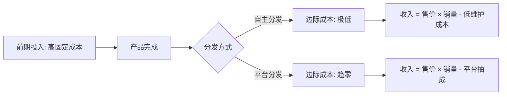
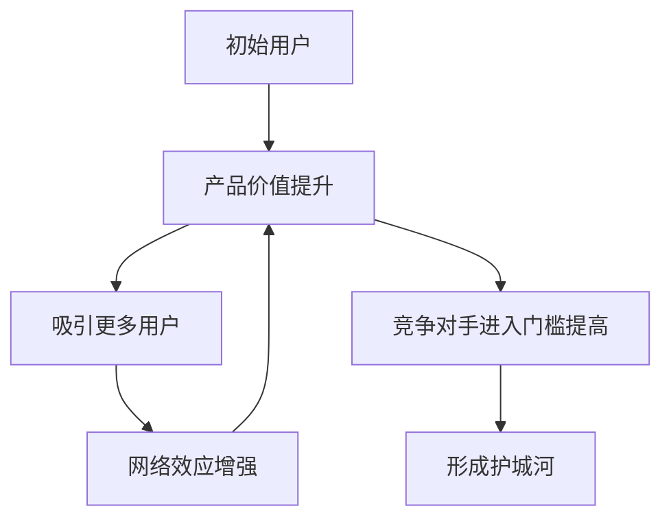
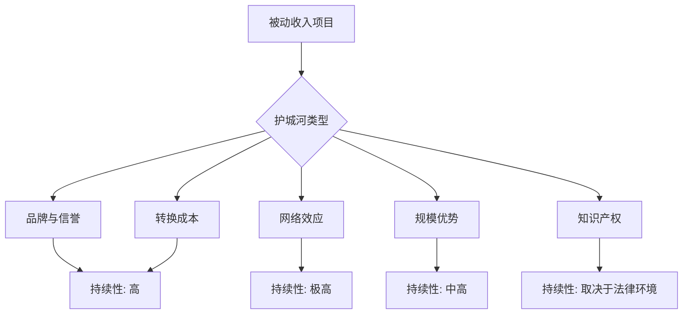

## 四、被动收入的经济学分析

被动收入并非"不劳而获"的魔法，而是可以在经济学框架下被精确分析、量化评估的收入形态。理解其背后的经济学原理，能帮助你做出更理性的项目选择，避免盲目跟风，建立真正可持续的被动收入系统。

本节将从微观经济学、产业经济学、行为经济学三个维度，系统拆解被动收入的经济学本质。

### 4.1 边际成本趋零：被动收入的核心经济机制

#### 什么是边际成本

边际成本（Marginal Cost）是指每多生产一单位产品所增加的成本。主动收入的边际成本始终为正——你多工作一小时才能多赚一小时的钱。而被动收入的本质经济特征，就是**边际成本趋近于零**。

| 收入类型 | 边际成本特征 | 典型值 |
|----------|------------|--------|
| 工资收入 | 每单位产出对应固定时间成本 | 100元/小时 |
| 自由职业 | 略低于工资，但仍线性增长 | 80-150元/小时 |
| 数字产品 | 首次创建后，复制分发成本极低 | 趋近0元/份 |
| 投资收益 | 资本投入后，维护成本极低 | 趋近0元/次 |

#### 边际成本趋零的实现路径

被动收入项目通过以下经济学机制实现边际成本趋零：

**第一，固定成本的一次性投入。** 创建一本电子书、开发一个SaaS工具、录制一套在线课程，这些都是一次性的固定成本投入。一旦完成，后续每卖出一份的增量成本几乎为零。经济学上，这叫"沉没成本前置化"——你把所有成本集中在生产阶段，将收益阶段的成本压缩到最低。

**第二，数字产品的无限复制性。** 数字产品不存在物理库存的限制。一份代码、一篇文章、一个模板可以被无限复制，复制成本趋近于零。这与制造业形成鲜明对比——工厂每多生产一件商品，都需要原材料、人工、仓储等可变成本。

**第三，平台的自动化分发。** 互联网平台（淘宝、知识星球、Gumroad、Udemy）承担了支付处理、内容分发、客户服务等边际成本。你不需要为每个新客户手动交付产品。



#### 实操：计算你的边际成本

判断一个项目是否具备"被动收入"潜力，核心指标就是边际成本：

```text
边际成本 = 每新增一单位收入所增加的总成本

示例：
- 电子书：写完后每多卖一份，边际成本 ≈ 0元（平台抽成另算）
- 咨询服务：每多服务一个客户，边际成本 = 1小时时间 → 不是被动收入
- 房租收入：每多一套房，边际成本 = 贷款+维护+管理 → 半被动
- 股息投资：每多投1万元，边际成本 = 1万元本金 → 资本密集型被动收入
```

**判断标准：** 如果一个项目的边际成本低于其边际收入的10%，它就具备被动收入的经济特征。如果边际成本超过50%，它本质上还是主动收入的变体。

### 4.2 规模经济与网络效应

#### 规模经济在被动收入中的体现

规模经济（Economies of Scale）是指随着产量增加，单位产品的平均成本下降。在被动收入领域，规模经济的表现尤为明显。

**数字产品的规模经济曲线：**

| 销量 | 总投入成本 | 平均成本 | 利润率 |
|------|-----------|---------|--------|
| 100份 | 50,000元 | 500元/份 | -400%（亏损） |
| 500份 | 50,000元 | 100元/份 | 0%（盈亏平衡） |
| 1,000份 | 50,000元 | 50元/份 | 50% |
| 5,000份 | 50,000元 | 10元/份 | 90% |
| 50,000份 | 52,000元 | 1.04元/份 | 99% |

这个表格揭示了被动收入的经济学真相：**前期亏损是正常的，规模是盈利的关键。** 大多数人放弃被动收入项目，恰恰是因为在销量达到盈亏平衡点之前就失去了耐心。

#### 网络效应：被动收入的加速器

网络效应（Network Effect）是指产品的价值随着用户数量增加而增加。具有网络效应的被动收入项目，增长曲线呈指数型。

**网络效应的三种类型：**

**直接网络效应：** 用户越多，产品对每个用户的价值越大。例如：
- 一个社区型知识星球，成员越多，讨论质量越高，吸引更多人加入
- 一个模板市场的创作者越多，买家越愿意来，反过来吸引更多创作者

**间接网络效应：** 产品生态越丰富，核心产品价值越高。例如：
- 一个WordPress插件，当WordPress用户基数越大，插件的潜在市场越大
- 一个API服务，当使用它的应用越多，API的不可替代性越强

**数据网络效应：** 用户越多，产品越智能，体验越好。例如：
- 一个推荐算法驱动的内容平台，用户行为数据越多，推荐越精准
- 一个基于用户反馈持续优化的SaaS工具



#### 实操：评估项目的规模经济潜力

在选择被动收入项目时，用以下框架评估其规模经济潜力：

```text
规模经济评分 = 规模化系数 × 市场容量 × 网络效应强度

规模化系数（1-5分）：
- 5分：数字产品，零边际成本，全球分发
- 4分：在线课程/会员，低维护成本
- 3分：SaaS产品，需要持续开发但边际成本低
- 2分：实体产品，需要库存和物流
- 1分：线下服务，几乎无法规模化

市场容量（1-5分）：
- 5分：全球市场，千万级潜在用户
- 4分：全国市场，百万级用户
- 3分：垂直领域，十万级用户
- 2分：小众市场，万级用户
- 1分：极小众，千级用户

网络效应强度（1-5分）：
- 5分：强直接网络效应（社交/社区类产品）
- 4分：强间接网络效应（平台/生态类产品）
- 3分：弱网络效应（品牌/口碑传播）
- 2分：几乎无网络效应（独立数字产品）
- 1分：反网络效应（竞争加剧导致价值下降）
```

**评分示例：**

| 项目 | 规模化 | 市场容量 | 网络效应 | 总分 | 判定 |
|------|--------|---------|---------|------|------|
| 在线课程 | 5 | 4 | 3 | 60 | 优秀 |
| SaaS工具 | 4 | 3 | 4 | 48 | 良好 |
| 电子书 | 5 | 4 | 2 | 40 | 良好 |
| 股息投资 | 3 | 5 | 1 | 15 | 一般 |
| 自动化博客 | 5 | 3 | 2 | 30 | 中等 |

### 4.3 机会成本分析

#### 什么是机会成本

机会成本（Opportunity Cost）是经济学中最基础也最容易被忽视的概念：**你选择做一件事，就意味着放弃了做其他所有事情的收益。** 被动收入项目的机会成本，就是你把同样时间投入到其他地方能获得的最大收益。

#### 构建被动收入的机会成本计算

假设你是一名月薪15,000元的程序员，每天工作8小时，时薪约85元。你计划用业余时间构建被动收入项目。

**机会成本计算公式：**

```text
机会成本 = 投入时间 × 当前时薪 + 直接资金投入 + 放弃的其他机会收益

示例：
- 投入时间：500小时（约6个月，每天3小时）
- 当前时薪：85元/小时
- 时间机会成本：500 × 85 = 42,500元
- 直接资金投入：5,000元（域名、工具、外包设计等）
- 总机会成本：47,500元

如果这个项目第1年收入为80,000元：
- 净收益 = 80,000 - 47,500 = 32,500元
- 机会成本回报率 = 32,500 / 47,500 = 68.4%
```

#### 不同收入水平的机会成本差异

机会成本因人而异。月薪5,000元的人和月薪50,000元的人，构建同一个被动收入项目的经济合理性完全不同。

| 当前月收入 | 时薪 | 500小时机会成本 | 项目年收入8万的净收益 | 机会成本回报率 |
|-----------|------|----------------|---------------------|--------------|
| 5,000元 | 28元 | 14,000元 | 66,000元 | 471% |
| 10,000元 | 57元 | 28,500元 | 51,500元 | 181% |
| 15,000元 | 85元 | 42,500元 | 37,500元 | 88% |
| 30,000元 | 170元 | 85,000元 | -5,000元 | -6% |
| 50,000元 | 284元 | 142,000元 | -62,000元 | -44% |

**关键洞察：** 月入30,000元以上的人，如果项目年收入只有8万，从纯经济角度看是不划算的——他们的时间用于提升主业收入或更高杠杆的投资更合理。这也解释了为什么高收入人群更倾向于用资本（而非时间）来构建被动收入。

#### 实操：机会成本决策矩阵

在决定是否启动一个被动收入项目前，填写以下矩阵：

```text
项目名称：_______________

一、时间投入评估
   - 预计总投入时间：_____ 小时
   - 当前时薪：_____ 元
   - 时间机会成本：_____ 元（投入时间 × 时薪）

二、资金投入评估
   - 直接成本（工具、域名、外包等）：_____ 元
   - 间接成本（学习费用、试错成本等）：_____ 元
   - 总资金投入：_____ 元

三、收益预期评估
   - 第1年预期收入：_____ 元
   - 第2年预期收入：_____ 元
   - 第3年预期收入：_____ 元
   - 3年累计预期收入：_____ 元

四、决策计算
   - 总机会成本 = 时间机会成本 + 总资金投入 = _____ 元
   - 3年净收益 = 3年累计收入 - 总机会成本 = _____ 元
   - 年化回报率 = 3年净收益 / 总机会成本 / 3 × 100% = _____ %

五、决策阈值
   - 年化回报率 > 50%：强烈推荐
   - 年化回报率 20%-50%：值得尝试
   - 年化回报率 5%-20%：谨慎考虑
   - 年化回报率 < 5%：不建议（不如买指数基金）
```

### 4.4 经济护城河分析

#### 什么是经济护城河

经济护城河（Economic Moat）是沃伦·巴菲特提出的概念，指企业能够长期保持竞争优势的结构性特征。对于被动收入项目，护城河决定了你的收入能持续多久——没有护城河的被动收入项目，终将被竞争者侵蚀殆尽。

#### 被动收入的五种护城河

**护城河一：品牌与信誉**

当你的名字本身成为信任的代名词，你就拥有了品牌护城河。这在知识付费领域尤为明显——同一个主题的课程，知名讲师的售价可以是普通人的10倍，销量也是数倍。

品牌护城河的构建要素：
- 持续输出高质量内容（至少6-12个月的积累）
- 可辨识的个人风格和专业定位
- 用户口碑和案例积累
- 行业背书（出版物、演讲、媒体报道）

**护城河二：转换成本**

当用户迁移到替代品的成本很高时，你就拥有了转换成本护城河。SaaS产品的数据锁定、在线课程的学习路径依赖、社区的社交关系沉淀，都是转换成本的体现。

转换成本的类型：
- 数据转换成本：用户在你的系统中积累了大量数据，迁移成本高
- 学习转换成本：用户已经学会了使用你的产品，换一个需要重新学习
- 关系转换成本：用户在你的社区中建立了社交关系
- 流程转换成本：用户的工作流程已经与你的产品深度整合

**护城河三：网络效应**

如前文所述，网络效应是被动收入最强大的护城河之一。当你的产品/社区形成了网络效应，后来者几乎无法通过"做得更好"来超越你——他们需要同时吸引足够多的用户才能达到同等价值。

**护城河四：规模优势**

在某些领域，规模本身就是护城河。一个拥有10万粉丝的博客，在SEO、广告议价、品牌合作方面，比一个1千粉丝的博客有压倒性优势。规模优势带来的成本分摊和议价能力，是小规模竞争者无法企及的。

**护城河五：知识产权**

专利、商标、版权、独家算法——这些法律保护的知识产权是被动收入的硬护城河。虽然在中国知识产权保护仍有不足，但在数字产品领域（如软件著作权、课程版权）已经有越来越多的维权成功案例。



#### 护城河强度评估

| 护城河类型 | 构建难度 | 维护成本 | 防御效果 | 适用项目 |
|-----------|---------|---------|---------|---------|
| 品牌信誉 | 高（1-2年） | 中（持续输出） | 强 | 知识付费、咨询 |
| 转换成本 | 中（产品设计） | 低 | 强 | SaaS、会员制 |
| 网络效应 | 高（需要临界规模） | 中 | 极强 | 社区、平台 |
| 规模优势 | 高（时间积累） | 中 | 中强 | 内容、流量 |
| 知识产权 | 中（创作+申请） | 低 | 中（法律环境） | 软件、设计、课程 |

### 4.5 供需分析与市场定位

#### 被动收入的供需框架

任何被动收入项目的可持续性，最终取决于供需关系。用经济学语言描述：

**需求端分析：**
- 需求弹性：用户对价格变化的敏感度。刚需产品（如考试资料、职业技能课程）的需求弹性低，价格波动对销量影响小；非刚需产品（如兴趣爱好类内容）的需求弹性高，涨价会导致销量大幅下降。
- 需求规模：目标市场中有多少人有这个需求，他们的支付意愿（Willingness to Pay）是多少。
- 需求周期：需求是持续性的（如理财知识）还是周期性的（如考研资料），这直接影响收入的稳定性。

**供给端分析：**
- 供给壁垒：进入这个市场需要多少时间、资金、技能。壁垒越低，竞争越激烈，长期利润越薄。
- 替代品威胁：用户能否轻易找到免费或更便宜的替代品？YouTube免费教程、AI生成内容、开源工具，都是付费内容的替代品。
- 供给过剩风险：当大量创作者涌入同一赛道，供给过剩会导致价格战和利润压缩。

#### 实操：用供需矩阵定位你的项目

```text
                    需求弹性低（刚需）      需求弹性高（非刚需）
供给壁垒高（难进入）  黄金赛道               蓝海机会
                      → 高利润、稳定收入      → 高利润但市场小
                      → 如：专业认证课程       → 如：小众艺术教学

供给壁垒低（易进入）  红海竞争               避免进入
                      → 需要差异化才能盈利    → 利润薄、竞争激烈
                      → 如：英语学习资料       → 如：通用模板
```

**实操建议：**

1. **优先选择"刚需+高壁垒"象限。** 考试资料、专业技能培训、行业工具，这些领域的用户有明确的付费意愿，且供给端进入门槛较高（需要专业知识或技术能力）。

2. **在"刚需+低壁垒"象限必须差异化。** 如果你选择的是英语学习、PPT模板这类供给过剩的市场，必须在内容深度、呈现形式、用户体验等方面建立差异化优势。

3. **在"非刚需+高壁垒"象限要验证市场规模。** 小众领域的供给壁垒高，但需求规模可能不足以支撑有意义的收入。先用最小可行产品（MVP）验证付费意愿。

### 4.6 行为经济学视角：为什么大多数人建不起被动收入

#### 损失厌恶与前期投入恐惧

行为经济学中的损失厌恶（Loss Aversion）理论指出：人对损失的痛苦感是同等收益快乐感的2-2.5倍。这意味着，当你投入100小时却没有任何收入时，你的痛苦感是未来获得同等收入快乐感的2倍以上。

这就是为什么大多数人放弃被动收入项目——**他们不是没有能力，而是无法承受前期"看不到回报"的心理压力。**

**应对策略：**
- 设置"止损线"而非"止盈线"：提前决定投入多少时间/金钱后评估，而非每天盯着收入为零焦虑
- 将大目标拆分为小里程碑：每完成一个章节、每获得一个好评都是"收益"
- 记录投入产出比而非绝对收入：看到等效时薪在持续提升

#### 现状偏见与路径依赖

现状偏见（Status Quo Bias）让人倾向于维持现有状态。即使你的时薪只有50元，但因为"每个月有固定工资"的安全感，你不愿意花时间去构建可能带来时薪200元的被动收入项目。

**破解方法：** 用"小实验"降低启动门槛。不要一开始就辞职做被动收入，而是用业余时间做最小可行产品。当被动收入达到主业收入的30%时，再考虑增加投入比例。

#### 即时满足偏好

人类天生偏好即时满足（Present Bias）。工作一天就有一天的工资，这是即时满足。构建被动收入则需要延迟满足——投入数月甚至数年才能看到稳定回报。

**经济学生存者偏差提醒：** 你在社交媒体上看到的"被动收入月入10万"的案例，是极端的幸存者偏差。根据统计，90%以上的被动收入项目在第一年的月收入不超过1,000元。真实的被动收入构建曲线是：前期缓慢爬坡，中期稳步增长，后期才能加速。不要被幸存者偏差误导，做出不切实际的预期。

### 4.7 宏观经济因素对被动收入的影响

#### 利率环境

利率是影响被动收入策略的关键宏观变量。低利率环境下，银行存款和债券的收益率下降，迫使资金流向风险资产（股票、房产、创业），这为被动收入项目提供了更多资金来源。高利率环境下，无风险收益率上升，被动收入项目需要提供更高的回报率才能吸引资金。

| 利率环境 | 对被动收入的影响 | 策略调整 |
|---------|----------------|---------|
| 低利率（<3%） | 资金成本低，适合资本密集型项目 | 可以加大投资类被动收入比重 |
| 中利率（3-6%） | 平衡环境，各类项目均有机会 | 均衡配置，多元化 |
| 高利率（>6%） | 资金成本高，数字产品优势凸显 | 优先低资本、高时间投入的数字项目 |

#### 通胀因素

通胀对被动收入有双重影响。一方面，通胀侵蚀固定收益类被动收入（如定存利息、固定租金）的实际购买力。另一方面，通胀推高资产价格，持有实物资产（房产、股票）的被动收入会随通胀自然增长。

**通胀对冲策略：**
- 优先选择收入能随通胀增长的被动收入类型（如浮动租金、按比例收费的SaaS）
- 避免过度依赖固定金额的被动收入（如固定利率债券利息）
- 在高通胀环境下，实物资产类被动收入（房产、商品）更具优势

#### 技术变革

AI、自动化、低代码工具的普及正在重塑被动收入的经济学：

- **降低创建门槛：** AI写作、AI设计、AI编程工具大幅降低了内容创作的时间和技能要求，使更多人能够创建数字产品。
- **加剧供给竞争：** 当所有人都能用AI快速创建内容时，供给过剩将压低价格和利润。"AI能做的"不再是竞争优势，"AI做不到的"（深度洞察、个人品牌、社区运营）才是。
- **创造新机会：** AI工具本身成为新的被动收入载体——AI提示词库、AI工作流模板、AI培训课程，都是新兴的被动收入品类。

### 4.8 被动收入的税收经济学

#### 不同类型被动收入的税负差异

在中国现行税法下，不同类型的被动收入适用不同的税率和税目，这对净收益有重大影响。

| 收入类型 | 税目 | 税率范围 | 税务优化空间 |
|---------|------|---------|------------|
| 利息收入 | 个人所得税 | 20%（固定） | 低（国债免税） |
| 股息收入 | 个人所得税 | 20%（固定） | 低（持有>1年免税） |
| 租金收入 | 财产租赁所得 | 10%-20% | 中（扣除费用） |
| 版权/版税 | 特许权使用费 | 10%-20% | 中（扣除费用） |
| 经营所得 | 经营所得税 | 5%-35% | 高（小规模优惠） |
| 股权转让 | 财产转让所得 | 20% | 中 |

#### 税务优化的基本原则

**原则一：合理利用税收优惠。** 国债利息免征个人所得税，持有超过1年的上市公司股票股息免征个人所得税，小微企业和个体工商户有税收减免政策。在构建被动收入组合时，应将税收因素纳入考量。

**原则二：收入类型转换。** 同样的业务，以个人名义和以公司名义的税负可能完全不同。例如，通过注册个体工商户或小微企业来运营数字产品销售，可以享受小规模纳税人增值税减免和核定征收优惠。

**原则三：费用扣除最大化。** 合法列支与被动收入相关的成本（设备折旧、工具订阅、外包费用、学习培训等），降低应纳税所得额。

**重要提醒：** 以上仅为税务规划的基本思路，具体操作应咨询专业税务顾问。税务法规经常调整，且各地执行标准可能不同。

### 4.9 综合经济分析框架

将以上所有经济学维度整合为一个实用的项目评估框架：

```text
被动收入项目经济分析评分卡（满分100分）

一、经济可行性（40分）
   1. 边际成本趋零程度（0-10分）：___
   2. 规模经济潜力（0-10分）：___
   3. 机会成本回报率（0-10分）：___
   4. 市场供需匹配度（0-10分）：___

二、竞争壁垒（30分）
   5. 护城河强度（0-10分）：___
   6. 进入壁垒高度（0-10分）：___
   7. 替代品威胁程度（0-10分，越低越高分）：___

三、外部环境（20分）
   8. 宏观经济适配度（0-5分）：___
   9. 技术趋势支持度（0-5分）：___
   10. 税务效率（0-5分）：___
   11. 政策风险（0-5分，越低风险越高分）：___

四、个人适配度（10分）
   12. 个人技能匹配度（0-5分）：___
   13. 兴趣持续度（0-5分）：___

总分：___/100

评级标准：
- 80-100分：优质项目，值得全力投入
- 60-79分：可行项目，需要差异化策略
- 40-59分：高风险项目，谨慎投入
- 低于40分：不建议投入
```

### 4.10 本节核心要点回顾

| 经济学概念 | 被动收入应用 | 核心行动 |
|-----------|------------|---------|
| 边际成本趋零 | 选择边际成本低的项目 | 计算每新增一单位收入的增量成本 |
| 规模经济 | 理解前期亏损是正常的 | 计算盈亏平衡点，坚持到规模化 |
| 网络效应 | 优先选择有网络效应的项目 | 设计能促进用户互动的产品机制 |
| 机会成本 | 确保项目回报超过时间价值 | 用机会成本决策矩阵做理性决策 |
| 经济护城河 | 为项目构建可持续的竞争壁垒 | 至少建立1-2种护城河 |
| 供需分析 | 在正确的市场定位产品 | 用供需矩阵找到最优象限 |
| 行为经济学 | 识别并克服认知偏差 | 设置止损线和里程碑机制 |
| 宏观经济 | 根据经济环境调整策略 | 关注利率、通胀、技术趋势 |
| 税收经济学 | 合法优化税负 | 咨询专业税务顾问 |

被动收入的经济学分析不是一次性的功课，而是一个持续的过程。随着你的项目发展、市场变化、经济环境波动，你需要定期重新评估这些经济学维度，调整你的被动收入策略。经济学给你的是决策框架，而不是固定答案——真正优秀的被动收入构建者，是那些能够将经济学原理与自身实际灵活结合的人。

***

