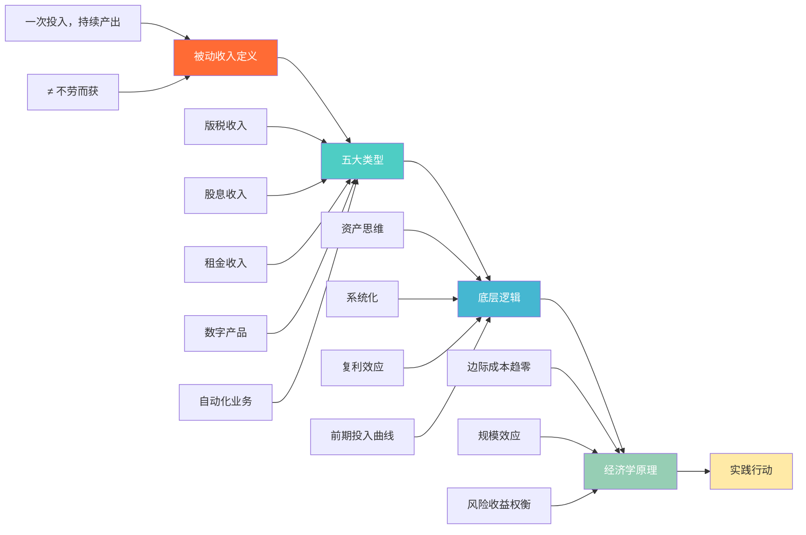
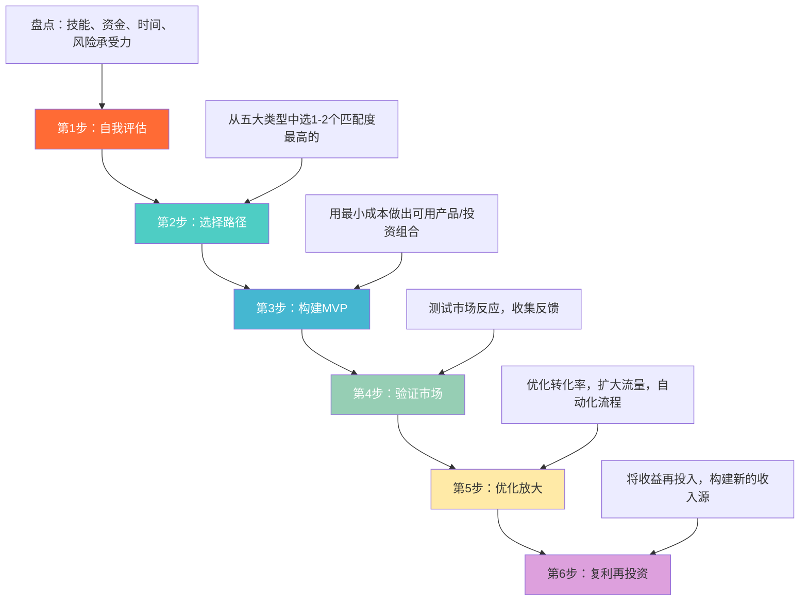

## 五、本节总结

### 1. 本节核心知识图谱

前面四节从"是什么→有哪些→为什么能赚钱→经济学原理"四个维度构建了被动收入的完整认知框架。下面用一张图将所有核心概念串联起来：



### 2. 四节核心要点回顾

#### 2.1 被动收入的本质（第一节）

被动收入的核心定义是**前期投入时间和资本构建资产，资产建成后持续产生收益，且收益不再严格依赖你的时间投入**。三个关键特征：

| 特征 | 说明 | 与主动收入的对比 |
|------|------|------------------|
| 前期投入大 | 需要集中投入时间、精力或资金 | 主业即刻产生回报 |
| 持续产出 | 资产建成后持续产生收益 | 停止工作即停止收入 |
| 边际投入递减 | 维护成本远低于建设成本 | 每份收入都需要等量投入 |

被动收入**不等于**"不劳而获"。它不是躺着赚钱，而是把劳动从"即时交换"变成"延迟回报"。前期的高强度投入是必要条件，没有捷径。

#### 2.2 五大收入类型（第二节）

| 类型 | 典型形式 | 启动门槛 | 天花板 | 维护成本 |
|------|----------|----------|--------|----------|
| 版税收入 | 图书、音乐、软件授权、专利 | 高（需创作能力） | 中等 | 低 |
| 股息收入 | 个股分红、股息ETF、REITs、债券 | 中（需启动资金） | 取决于本金规模 | 极低 |
| 租金收入 | 住宅出租、商业地产、设备出租 | 高（需大额资金） | 高 | 中等 |
| 数字产品 | 电子书、模板、在线课程、SaaS | 低（需技能） | 极高 | 低-中 |
| 自动化业务 | 联盟营销、Dropshipping、广告 | 低-中 | 高 | 中等 |

**选择策略**应基于个人资源禀赋：

- **有技能无资金**→数字产品、自动化业务（边际成本趋零，适合从零起步）
- **有资金无时间**→股息收入、REITs（纯资本驱动，维护成本极低）
- **有技能有资金**→SaaS产品、租金收入（资金+技能双杠杆，天花板最高）
- **有创作能力**→版税收入（一次创作多年收益，但需持续产出新品）

建议同时布局**2-3个不同类型**的被动收入源，避免单一来源的风险集中。

#### 2.3 底层逻辑（第三节）

四个核心逻辑决定了被动收入能否成功：

**逻辑一：资产思维替代劳动思维**

每次投入时间前问自己：**这件事在我停止投入后，还能继续产生价值吗？** 能→资产型工作，值得投入；不能→消耗型工作，需要逐步外包或自动化。

**逻辑二：系统化取代个人化**

把个人能力封装进可自动运转的系统。核心路径：

```text
个人技能 → 产品化（课程/工具/模板） → 平台化（自动销售/分发） → 生态化（用户自增长）
```

**逻辑三：复利效应**

被动收入的真正威力在于再投资。前期增长缓慢，后期指数级爆发。以每月3000元被动收入全部再投资为例：

| 时间节点 | 月被动收入 | 累计投入时间 |
|----------|-----------|-------------|
| 第1年末 | 5,000元 | 500小时 |
| 第2年末 | 8,000元 | 700小时 |
| 第3年末 | 12,000元 | 850小时 |
| 第5年末 | 30,000元 | 1,000小时 |

**逻辑四：接受前期低回报**

竹子定律——前4年地下扎根几乎看不到生长，第5年6周长到30米。被动收入构建的典型时间线：

- **0-3个月：** 投入期，收入几乎为零，90%的人在此放弃
- **3-6个月：** 萌芽期，开始有零星收入，但远低于时间投入的等价报酬
- **6-12个月：** 生长期，收入趋于稳定，但仍需持续优化
- **12个月+：** 收获期，复利效应开始显现，收入增速超过投入增速

#### 2.4 经济学原理（第四节）

被动收入从经济学角度看，本质上是**将时间的线性回报转化为非线性回报**。几个关键经济学概念：

- **边际成本递减：** 数字产品多卖一份的成本趋近于零，这是被动收入高利润率的根本原因
- **规模效应：** 用户越多，单位成本越低，利润越高
- **机会成本：** 构建被动收入的前期投入意味着放弃即时收入，需要评估时间投入的回报周期
- **风险-收益权衡：** 被动收入并非零风险，不同类型的风险特征不同（详见后续风险评估章节）

### 3. 关键指标体系

构建被动收入需要一套可量化的指标来追踪进展：

| 指标 | 计算方式 | 达标线 | 优秀线 | 说明 |
|------|----------|--------|--------|------|
| 被动收入总额 | 所有被动收入源月收入之和 | >3,000元/月 | >10,000元/月 | 因城市消费水平而异 |
| 被动收入占比 | 被动收入 ÷ 总收入 × 100% | >20% | >50% | 衡量财务自由程度 |
| 收入源数量 | 独立的被动收入来源数 | ≥2个 | ≥5个 | 分散风险 |
| 资产回报率 | 年被动收入 ÷ 总投入成本 × 100% | >8% | >15% | 衡量投入效率 |
| 收入增长率 | (本月收入 - 上月收入) ÷ 上月收入 × 100% | >0 | >5%/月 | 衡量增长趋势 |
| 维护时间比 | 月维护时间 ÷ 月总收入时间 × 100% | <30% | <10% | 衡量"被动"程度 |

### 4. 从理论到行动的路线图



**行动清单（立即可执行）：**

1. **今天：** 列出你拥有的所有技能和资源（专业技能、人脉、存款、闲置资产）
2. **本周：** 对照五大类型，选出最适合你的1-2个方向
3. **本月：** 完成第一个被动收入项目的MVP（最小可行产品），投入不超过100小时或总资金的10%
4. **持续：** 每月复盘指标数据，淘汰低效项目，加倍投入高效项目

### 5. 常见误区与纠正

| 误区 | 真相 | 纠正方法 |
|------|------|----------|
| 被动收入=躺着赚钱 | 前期需要高强度投入，只是后期维护成本低 | 把被动收入理解为"延迟回报"而非"不劳而获" |
| 只存钱不投资 | 通胀会侵蚀存款购买力 | 储蓄率达标后（>30%），将超额部分投入被动收入项目 |
| 盲目追求高收益 | 高收益必然伴随高风险 | 先建立安全垫（6个月应急资金），再追求收益 |
| 同时启动太多项目 | 精力分散导致每个项目都做不深 | 先做透一个项目，稳定后再扩展 |
| 没有应急资金就投资 | 一旦遇到突发支出，被迫低价变现资产 | 至少保留6个月生活费的流动性资金 |
| 忽视税务规划 | 被动收入的税负可能与主动收入不同 | 提前了解各类被动收入的税务处理方式 |
| 过度优化而忽略产出 | 花大量时间打磨产品却不敢推向市场 | 先完成再完美，80分就发布，根据反馈迭代 |

### 6. 本节与其他章节的关系

本节（理论基础）是整个"被动收入构建"章节的认知地基。后续章节将在此基础上展开实操：

| 后续章节 | 与本节的关系 | 前置知识 |
|----------|-------------|----------|
| 时间价值分析 | 将"前期投入vs后期产出"量化为具体的时间价值计算 | 底层逻辑：复利效应、前期投入曲线 |
| 被动收入的风险评估框架 | 深入分析每种收入类型的风险特征和应对策略 | 五大类型分类、经济学原理 |
| 常见问题解答 | 针对实践中的具体困惑给出解答 | 全部四节内容 |
| 被动收入的心理建设 | 解决"前期低回报"阶段的心理挑战 | 底层逻辑：竹子定律、接受前期低回报 |
| 被动收入的未来趋势 | 展望被动收入的新机会和演变方向 | 五大类型分类、经济学原理 |
| 被动收入与财务自由 | 将被动收入纳入财务自由的整体框架 | 被动收入占比指标、复利效应 |

> **阅读建议：** 如果你是第一次接触被动收入概念，建议按顺序阅读后续每一节。如果你已经有实践经验，可以直接跳到"风险评估框架"和"财务自由"章节，补充认知盲区。
