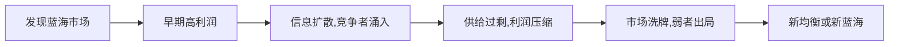
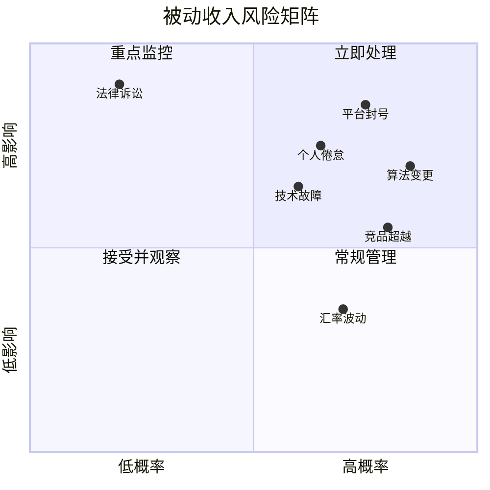
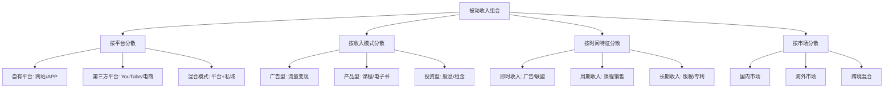

## 七、被动收入的风险评估框架

被动收入并非"零风险收入"。恰恰相反，因为被动收入往往依赖系统、平台、市场等外部因素运行，其风险具有隐蔽性强、爆发突然、恢复周期长的特点。一套系统化的风险评估框架，是每位被动收入构建者从入门到成熟的必修课。

### 1. 为什么被动收入需要专门的风险评估

#### 1.1 被动收入与主动收入的风险本质差异

主动收入的风险通常是线性的——你停止工作，收入停止，但你对自己的产出有直接控制权。被动收入的风险则呈现非线性特征：

| 维度 | 主动收入 | 被动收入 |
|------|---------|---------|
| 风险控制权 | 高（直接参与） | 低（依赖系统/平台） |
| 风险爆发速度 | 渐进式 | 突变式（平台封号、算法变更） |
| 风险可见性 | 明确（客户流失可感知） | 隐蔽（流量下滑需数据发现） |
| 恢复手段 | 提升技能、增加工时 | 需重建系统或迁移平台 |
| 风险叠加性 | 低（单一流程） | 高（多环节耦合） |

被动收入的核心矛盾在于：越"被动"的系统，你对风险的感知和控制能力越弱。一个完全自动化的收入管道，可能在你毫不知情的情况下已经断裂。

#### 1.2 被动收入风险的三大特征

**滞后性**：风险信号出现到收入实际下降之间存在时间差。例如，搜索引擎算法更新后，网站流量可能在2-4周后才明显下滑，而广告收入的下降又会再滞后1-2周。等你发现时，可能已经损失了1-2个月的收入。

**传导性**：被动收入系统通常是多环节串联的，一个环节的风险会沿链条传导。以YouTube频道为例：版权政策收紧 → 视频被标记 → 频道权重下降 → 推荐流量减少 → 广告收入降低。每个环节的风险都会放大下游影响。

**系统性**：外部环境变化（政策、技术、市场）会对整个品类的被动收入同时产生冲击。2023年AI生成内容泛滥导致大量内容创作者的被动收入整体下滑，这不是个别项目的问题，而是系统性风险。

### 2. 被动收入的六维风险分类体系

#### 2.1 平台风险（Platform Risk）

平台风险是被动收入面临的最直接、最常见的风险类型。你在别人的平台上构建收入，本质上是在别人的地基上盖房子。

**封禁与限制风险**

平台规则随时可能变化，且你几乎没有谈判能力。常见的触发场景：

- 内容平台（YouTube、抖音、B站）：版权投诉、内容违规、虚假流量检测
- 电商平台（Amazon FBA、淘宝联盟）：账号关联、评价操纵嫌疑、品牌投诉
- 广告联盟（Google AdSense、百度联盟）：无效点击、违规内容、低质量流量
- 应用商店（App Store、Google Play）：审核政策变更、隐私合规要求

**算法变更风险**

平台算法的调整直接决定你的流量分配。这不是假设性风险——Google每年进行数千次算法更新，其中核心更新可能在一夜之间改变大量网站的流量格局。

**平台衰退风险**

没有任何平台能永远繁荣。雅虎、人人网、天涯社区都曾是流量巨头。如果你的被动收入完全依赖单一平台，平台的衰退就是你的收入衰退。

**应对策略**：

```text
平台风险防御四层体系：
┌─────────────────────────────────────────┐
│  第1层：合规运营（遵守规则，降低封禁概率）    │
│  第2层：多平台分发（不把鸡蛋放在一个篮子）    │
│  第3层：私域沉淀（将平台用户转化为自有资产）   │
│  第4层：资产备份（内容、数据、用户关系备份）   │
└─────────────────────────────────────────┘
```

#### 2.2 市场风险（Market Risk）

市场风险来源于需求端和竞争环境的变化，是影响被动收入持续性的根本性风险。

**需求萎缩风险**

市场需求不是静态的。技术迭代、消费习惯变迁、人口结构变化都可能导致特定领域的需求萎缩。例如：传统摄影教程的需求被手机AI拍照功能大幅替代；线下实体产品评测被短视频种草内容替代。

**竞争加剧风险**

被动收入领域的利润会吸引更多竞争者进入，直到利润率回归均值。这是经济学中的基本规律。一个典型的竞争加剧周期：



**定价权丧失风险**

当你的产品或内容缺乏差异化时，你实际上没有定价权。广告CPM由广告主和平台决定，课程价格被市场竞品压低，联盟佣金比例由商家调整——你只能被动接受。

**应对策略**：定期进行市场扫描，建立"市场健康度仪表盘"，跟踪核心指标（搜索趋势、竞品数量、平均价格、用户评价变化）。

#### 2.3 技术风险（Technical Risk）

技术风险是被动收入系统中容易被忽视但破坏力极大的风险类型。

**系统故障风险**

自动化系统依赖技术基础设施运行。服务器宕机、域名过期、SSL证书失效、支付接口变更、API版本升级——任何一个技术环节出问题都可能导致收入中断。

**技术过时风险**

你今天构建的技术方案，三年后可能完全过时。WordPress插件停止维护、Python库版本不兼容、Flash内容全面淘汰——技术债务会不断累积。

**安全风险**

被动收入系统往往长期无人值守运行，这给安全攻击留出了窗口期：网站被黑、数据库泄露、支付劫持、SEO攻击（负SEO）等。

**典型技术风险清单**：

| 风险项 | 检查频率 | 自动化监控方式 |
|--------|---------|--------------|
| 域名/主机续费 | 每月 | 监控到期日期，提前60天告警 |
| SSL证书有效期 | 每周 | Let's Encrypt自动续期+cron检查 |
| 网站可用性 | 实时 | UptimeRobot/Pingdom监控 |
| 数据库备份 | 每日 | 自动备份+异地存储 |
| 依赖库版本 | 每月 | Dependabot/Snyk自动扫描 |
| SEO排名变化 | 每周 | Ahrefs/SEMrush排名追踪 |
| 安全扫描 | 每周 | Sucuri/Wordfence自动扫描 |

#### 2.4 法律与合规风险（Legal & Compliance Risk）

法律风险具有突发性和不可逆性——一旦触发，可能导致整个收入项目终结。

**知识产权风险**

- 内容侵权：使用的图片、音乐、字体未获授权
- 商标冲突：品牌名、域名与已有商标冲突
- 专利风险：产品功能侵犯他人专利
- 合同纠纷：与合作方的分成、授权条款争议

**数据合规风险**

GDPR、个人信息保护法等法规对数据收集、存储、使用提出了严格要求。如果你的被动收入项目涉及用户数据（几乎所有互联网项目都涉及），合规是硬性要求。

**税务合规风险**

被动收入的税务处理比主动收入复杂得多：跨境收入的税务归属、不同类型收入的税率差异、亏损抵扣的适用条件等。税务不合规的后果不仅是罚款，还可能影响个人征信。

**应对策略**：为每个被动收入项目建立"合规检查清单"，在项目启动前完成法律审查，在运营中定期复核。

#### 2.5 财务风险（Financial Risk）

财务风险关注的是投入产出比和现金流的可持续性。

**现金流断裂风险**

被动收入项目通常需要前期投入（时间、金钱），而收入的产生有延迟。如果在"投入期"和"收入期"之间出现资金断裂，项目可能半途而废。

典型的现金流模式：

```text
收入曲线（以内容创业为例）：

金额 ↑
     │                                    ****
     │                                ****
     │                            ****
     │                        ****
     │                   ****
     │              ****
     │         ****
     │    ****
─────│****──────────────────────────────────→ 时间
     │  投入期        成长期      成熟期
     │  (0-6月)      (6-18月)   (18月+)
     │  净投入        收支平衡     净收入
```

**过度投资风险**

在收入尚未验证时过早大规模投入（购买昂贵设备、大量投放广告、雇用全职团队），导致沉没成本过高，难以及时止损。

**汇率风险**

跨境被动收入（Amazon FBA、Google AdSense美元结算）面临汇率波动影响。人民币升值10%，你的美元收入就贬值10%。

**应对策略**：设定明确的"止损线"——每个项目在启动前就确定最大可承受亏损额和最长投入期，到期未达标则果断止损。

#### 2.6 个人风险（Personal Risk）

被动收入构建者最容易忽视的风险来源其实是自己。

**精力分散风险**

同时启动太多被动收入项目，每个都浅尝辄止，没有一个能真正跑通。这是初学者最常见的错误——"什么都想做"等于"什么都做不好"。

**技能瓶颈风险**

你的技能水平决定了被动收入系统的天花板。如果你的SEO知识停留在5年前，你的网站流量就会持续萎缩；如果你的编程能力只能搭建简单的自动化脚本，系统故障时你可能无法修复。

**心态风险**

被动收入的"被动"二字容易让人产生不切实际的期望。当现实与期望不符时（前期大量投入没有回报、增长停滞、竞争对手超越），挫败感可能导致非理性决策（追加投入或彻底放弃）。

**健康与时间风险**

构建被动收入需要大量前期投入，这会挤占休息和健康的时间。长期透支的后果是健康问题，而健康问题反过来会中断所有收入来源——包括被动收入。

### 3. 风险评估量化模型

#### 3.1 PASR风险评分模型

PASR（Probability × Amplification × Severity × Recoverability）是一个专为被动收入设计的四维风险评分模型，帮助你对每种风险进行量化评估。

**评分维度说明**：

| 维度 | 含义 | 1分（最低） | 5分（最高） |
|------|------|-----------|-----------|
| P-概率（Probability） | 风险发生的可能性 | 极罕见 | 极可能 |
| A-放大系数（Amplification） | 风险传导和放大的程度 | 单点影响 | 级联崩溃 |
| S-严重度（Severity） | 对收入的实际影响程度 | 轻微波动 | 收入归零 |
| R-恢复难度（Recoverability） | 从风险中恢复的难度 | 极易恢复 | 不可逆 |

**风险分值计算**：

$$风险分值 = P × A × S × R$$

分值范围：1-625分。根据分值划分风险等级：

| 分值范围 | 风险等级 | 处理策略 |
|---------|---------|---------|
| 1-25 | 低风险 | 接受，定期监控 |
| 26-75 | 中风险 | 缓解，制定应急预案 |
| 76-200 | 高风险 | 优先处理，投入资源降低 |
| 201-625 | 极高风险 | 不可接受，必须消除或放弃 |

**应用示例**：

以"YouTube频道被封禁"这一风险为例：

- P=3（中等概率，合规运营可降低）
- A=4（封号影响整个频道所有视频的收入）
- S=5（收入完全归零）
- R=3（可申诉恢复，但周期长且不确定性高）

风险分值 = 3 × 4 × 5 × 3 = 180分 → 高风险，需要优先投入资源进行缓解。

#### 3.2 被动收入风险矩阵

将所有识别出的风险按"发生概率"和"影响程度"两个维度放入矩阵中：



右上角（高概率+高影响）的风险必须优先处理，左下角（低概率+低影响）的风险可以接受并定期观察。

#### 3.3 收入脆弱性指数（Income Vulnerability Index, IVI）

IVI从整体视角评估你的被动收入组合的抗风险能力。

**计算公式**：

$$IVI = \frac{最大单一收入占比 × 平台集中度 + 平均PASR分值/625}{多元化系数}$$

**各因子说明**：

- **最大单一收入占比**：占总收入比例最高的那个收入来源的百分比（0-1）
- **平台集中度**：依赖单一平台的收入占总收入的比例（0-1）
- **平均PASR分值**：所有被动收入项目PASR分值的均值
- **多元化系数**：独立收入来源的数量（至少为1）

**IVI解读**：

| IVI值 | 脆弱性等级 | 说明 |
|-------|-----------|------|
| < 0.3 | 健康 | 收入来源多元，单点风险可控 |
| 0.3-0.6 | 需关注 | 存在集中风险，需要分散 |
| 0.6-1.0 | 脆弱 | 严重依赖单一来源，需要紧急调整 |
| > 1.0 | 危险 | 收入结构极其脆弱，随时可能崩塌 |

**计算示例**：

假设你有3个被动收入来源：
- 网站广告收入（占60%，依赖Google AdSense）
- 电子书销售（占25%，依赖Amazon KDP）
- 在线课程（占15%，依赖自建平台）

最大单一收入占比 = 0.60
平台集中度 = 0.60（AdSense占60%）+ 0.25（KDP占25%）= 0.85
平均PASR分值 = 假设各项目分别为120、80、60，均值 = 86.7
多元化系数 = 3

IVI = (0.60 × 0.85 + 86.7/625) / 3 = (0.51 + 0.139) / 3 = 0.216 → 健康

但如果网站广告收入占比上升到85%：
IVI = (0.85 × 0.85 + 86.7/625) / 3 = (0.7225 + 0.139) / 3 = 0.287 → 仍在健康范围，但已接近"需关注"边界。

### 4. 风险评估实操流程

#### 4.1 五步风险评估法

**第一步：资产盘点**

列出所有被动收入项目及其关键属性：

```markdown
## 被动收入资产清单

### 项目1：技术博客
- 启动时间：2024年3月
- 月均收入：¥3,200
- 收入来源：Google AdSense（70%）+ 联盟营销（30%）
- 依赖平台：WordPress + Google + Cloudflare
- 核心资产：域名、内容库（320篇文章）、搜索排名
- 投入状态：半自动化，每周维护2-3小时

### 项目2：电子书
- 启动时间：2024年6月
- 月均收入：¥1,800
- 收入来源：Amazon KDP（80%）+ 知识星球（20%）
- 依赖平台：Amazon + 微信
- 核心资产：3本电子书、读者评价、邮件列表（2,100人）
- 投入状态：完全自动化，每月维护0小时
```

**第二步：风险识别**

对每个项目，逐一排查六维风险（平台/市场/技术/法律/财务/个人），记录所有可能的风险事件。

**第三步：PASR评分**

对每个风险事件进行四维打分，计算风险分值。

**第四步：优先级排序**

按风险分值从高到低排序，确定处理优先级。

**第五步：制定应对计划**

对高优先级风险制定具体的应对措施、责任人和时间节点。

#### 4.2 风险评估模板

以下是一个可直接使用的风险评估表格模板：

```markdown
## 被动收入风险评估表

项目名称：________________
评估日期：________________
评估人：__________________

| 风险编号 | 风险类别 | 风险描述 | P | A | S | R | 总分 | 等级 | 应对措施 | 负责人 | 截止日期 |
|---------|---------|---------|---|---|---|---|------|------|---------|--------|---------|
| R001 | 平台 | AdSense账号被封 | 3 | 4 | 5 | 3 | 180 | 高 | 备用广告联盟 | 自己 | 2025-03 |
| R002 | 技术 | 网站被黑 | 2 | 3 | 4 | 2 | 48 | 中 | 安全加固+备份 | 自己 | 2025-02 |
| R003 | 市场 | SEO排名下降 | 4 | 3 | 4 | 3 | 144 | 高 | 内容更新计划 | 自己 | 持续 |
| ... | ... | ... | ... | ... | ... | ... | ... | ... | ... | ... | ... |
```

#### 4.3 定期评估机制

风险评估不是一次性工作，需要建立定期评估机制：

```text
风险评估时间表：

每日：自动化监控告警检查（可用性、异常流量、收入波动）
每周：关键指标Review（排名、流量、收入趋势）
每月：风险清单更新（新增风险、关闭已解决风险）
每季：完整风险评估（PASR重新打分、IVI重新计算）
每年：战略级风险审视（市场趋势、技术变革、政策变化）
```

### 5. 风险应对策略库

#### 5.1 四种基本应对策略

面对任何风险，你有且仅有四种基本应对策略：

| 策略 | 含义 | 适用场景 | 示例 |
|------|------|---------|------|
| **规避（Avoid）** | 消除风险来源 | 风险极高且无法降低 | 放弃高法律风险的项目 |
| **转移（Transfer）** | 将风险转嫁给第三方 | 风险可量化且有对应保险 | 购买商业保险、使用托管服务 |
| **缓解（Mitigate）** | 降低风险概率或影响 | 风险可控但需持续投入 | 多平台分发、定期备份 |
| **接受（Accept）** | 承认风险存在，不采取行动 | 风险低或处理成本过高 | 接受汇率小幅波动 |

#### 5.2 按风险类型的应对方案

**平台风险应对方案**

- **多平台策略**：同一内容在3个以上平台分发，单一平台收入占比不超过50%
- **私域沉淀**：将平台流量导入邮件列表、微信群等自有渠道
- **资产备份**：内容、用户数据、账号信息定期备份到本地
- **合规运营**：严格遵守平台规则，预留安全边际

**市场风险应对方案**

- **趋势监控**：使用Google Trends、百度指数等工具跟踪市场需求变化
- **差异化定位**：避免同质化竞争，建立不可替代的价值
- **迭代更新**：定期更新内容和产品，保持竞争力
- **退出预案**：为每个项目设定明确的"继续/退出"判断标准

**技术风险应对方案**

- **自动化监控**：配置Uptime监控、SSL到期提醒、性能告警
- **定期维护**：每月更新依赖库、检查安全漏洞、优化性能
- **灾备方案**：3-2-1备份策略（3份副本、2种介质、1份异地）
- **技术债务管理**：每季度评估技术栈健康度，及时升级或替换

**法律风险应对方案**

- **合规审查**：项目启动前完成知识产权、数据合规、税务合规审查
- **合同保障**：与合作方签订明确的书面协议
- **专业支持**：必要时咨询律师，不要在法律问题上省小钱
- **保险覆盖**：购买适当的职业责任险或商业保险

**财务风险应对方案**

- **止损纪律**：每个项目设定最大投入上限和最长回报周期
- **现金流管理**：保持6个月以上的运营资金储备
- **分散投资**：不同类型的被动收入项目交叉配置
- **税务规划**：提前规划税务结构，合法节税

**个人风险应对方案**

- **项目聚焦**：同一时间最多维护3个活跃被动收入项目
- **持续学习**：每年投入不少于收入的5%用于技能提升
- **健康管理**：设定工作时间上限，保证运动和睡眠
- **心理建设**：建立合理的预期管理，接受"慢就是快"

### 6. 风险监控自动化方案

#### 6.1 监控技术栈

以下是一个实用的被动收入风险监控技术栈：

```yaml
# 风险监控技术栈配置
监控层:
  可用性监控:
    工具: UptimeRobot / Pingdom / Uptime Kuma
    频率: 每5分钟
    告警: 邮件 + 微信推送
    
  性能监控:
    工具: Google PageSpeed Insights API / GTmetrix
    频率: 每日
    指标: LCP, FID, CLS
    
  流量监控:
    工具: Google Analytics / 百度统计
    频率: 每日自动报告
    告警: 日流量下降超过30%触发告警
    
  收入监控:
    工具: 自建Dashboard（聚合各平台API）
    频率: 每日
    告警: 日收入低于过去30天均值50%触发告警
    
  安全监控:
    工具: Sucuri / Wordfence / Cloudflare Security
    频率: 实时
    告警: 立即推送
    
  SEO监控:
    工具: Ahrefs / SEMrush / Google Search Console
    频率: 每周
    告警: 核心关键词排名下降超过10位触发告警
```

#### 6.2 告警分级与响应

```text
告警分级体系：

P0-紧急（15分钟内响应）：
  - 网站完全不可访问
  - 支付功能异常
  - 安全攻击确认
  - 收入来源突然中断

P1-严重（2小时内响应）：
  - 核心页面加载异常
  - SEO排名大幅下降
  - 平台政策重大变更
  - 客户大量投诉

P2-一般（24小时内响应）：
  - 非核心功能异常
  - 性能指标下降
  - 流量小幅波动
  - 竞品策略变化

P3-观察（下次例会讨论）：
  - 新兴竞品出现
  - 行业趋势变化
  - 技术栈版本更新
  - 优化建议收集
```

### 7. 常见误区与纠正

#### 7.1 误区一：被动收入等于无风险

**错误认知**：被动收入是"躺赚"，不需要管理风险。

**事实**：被动收入只是将"主动劳动"的风险替换为"系统运行"的风险。系统越复杂、依赖环节越多，风险越需要主动管理。

**纠正方法**：将风险管理视为被动收入系统的"维护成本"——就像汽车需要定期保养一样，收入系统也需要定期维护。

#### 7.2 误区二：过度分散等于安全

**错误认知**：同时运行10个被动收入项目，每个失败了还有其他9个。

**事实**：过度分散导致每个项目都投入不足，没有一个能达到盈利的临界点。10个半成品不等于1个完整产品。

**纠正方法**：集中资源先跑通1-2个项目，待其稳定后再逐步扩展。保持"深而精"而非"广而浅"。

#### 7.3 误区三：只关注收益不关注风险

**错误认知**：只要收入在增长，就说明一切正常。

**事实**：收入增长可能掩盖风险的积累。快速增长的项目往往伴随着快速增加的平台依赖、技术债务和合规盲区。

**纠正方法**：定期进行"压力测试"——假设你的主要收入来源突然消失，你能在多长时间内恢复？如果答案超过3个月，说明风险敞口过大。

#### 7.4 误区四：风险评估是一次性工作

**错误认知**：项目启动时做过风险评估，之后就不需要了。

**事实**：风险是动态变化的。新竞争者进入、政策调整、技术迭代——半年前评估的"低风险"项目现在可能已经变成"高风险"。

**纠正方法**：建立季度风险评估机制，至少每3个月重新评估一次所有被动收入项目的风险状况。

#### 7.5 误区五：忽略尾部风险

**错误认知**：大概率不会发生的事件就不需要考虑。

**事实**：被动收入的长期存续意味着你在足够长的时间线上一定会遇到"小概率大影响"事件（平台倒闭、重大政策变更、技术革命）。

**纠正方法**：对尾部风险（低概率+高影响）制定"灾难恢复预案"——不需要详细到每一步，但至少要有明确的应急思路和资源准备。

### 8. 进阶：构建抗风险被动收入组合

#### 8.1 收入来源多元化矩阵

理想的被动收入组合应该在多个维度上实现分散：



#### 8.2 风险对冲策略

**正相关对冲**：选择风险因素不重叠的收入来源组合。例如，SEO驱动的网站收入和社交媒体驱动的视频收入——当Google算法更新影响网站时，YouTube频道可能不受影响甚至受益。

**负相关对冲**：有意识地配置"此消彼长"的收入来源。例如，经济下行时，廉价娱乐（短视频）需求上升，而高价教育产品需求下降——同时布局两类内容可以对冲经济周期风险。

**时间对冲**：配置不同成熟期的收入来源。一个成熟稳定的项目（现金流来源）+ 一个快速增长的项目（增长来源）+ 一个实验性项目（未来来源）。

#### 8.3 风险预算管理

借鉴投资领域的"风险预算"概念，为被动收入组合设定总风险预算，并分配给各个项目：

```text
风险预算分配示例（总预算100分）：

成熟项目（网站广告）：20分预算
  → 稳定但增长有限，低风险配额

成长项目（在线课程）：40分预算
  → 核心增长引擎，中等风险配额

实验项目（AI工具）：30分预算
  → 高风险高回报，允许失败

现金储备：10分预算
  → 应对突发风险的缓冲

规则：任何项目超过预算时，必须采取措施降低风险或停止投入。
```

### 9. 实战案例：一次完整的风险评估

#### 案例背景

小明有以下被动收入来源：
- 技术博客（月收入¥4,500，依赖Google搜索流量+AdSense）
- YouTube技术频道（月收入¥2,800，依赖平台推荐算法）
- 电子书销售（月收入¥1,200，依赖Amazon KDP）
- 在线课程（月收入¥800，依赖自建网站）

总被动收入：¥9,300/月

#### 风险评估过程

**Step 1：计算IVI**

最大单一收入占比 = 4500/9300 = 0.484
平台集中度 = 0.484 + 0.301 + 0.129 = 0.914（严重依赖外部平台）
平均PASR分值 = 假设各项目平均120分
多元化系数 = 4

IVI = (0.484 × 0.914 + 120/625) / 4 = (0.442 + 0.192) / 4 = 0.159 → 健康

但平台集中度0.914是一个严重警告信号——91.4%的收入依赖外部平台。

**Step 2：识别TOP 5风险**

| 风险 | P | A | S | R | 总分 |
|------|---|---|---|---|------|
| Google算法更新导致博客流量下降 | 4 | 3 | 4 | 3 | 144 |
| AdSense账号异常 | 3 | 4 | 5 | 3 | 180 |
| YouTube算法变更降低推荐量 | 4 | 4 | 4 | 2 | 128 |
| Amazon KDP政策调整 | 2 | 3 | 3 | 3 | 54 |
| 个人精力不足导致内容更新停滞 | 4 | 3 | 4 | 4 | 192 |

**Step 3：制定应对计划**

最高优先级（个人精力不足，192分）：
- 建立内容日历，每周固定10小时用于被动收入维护
- 将重复性工作自动化（社交分享、邮件通知、数据报告）
- 考虑外包非核心工作（排版、SEO优化、社区管理）

第二优先级（AdSense异常，180分）：
- 注册备用广告联盟（Mediavine/AdThrive或国内百度联盟）
- 开发其他变现方式（赞助内容、付费订阅、联盟营销）
- 将AdSense收入占比从当前水平降低到40%以下

第三优先级（Google算法更新，144分）：
- 加大内容质量投入，降低算法敏感性
- 建立邮件列表（目前0 → 目标3个月500人）
- 开发长尾关键词策略，降低对核心关键词的依赖

第四优先级（YouTube算法变更，128分）：
- 同步发布到B站和其他视频平台
- 将YouTube观众引导到邮件列表
- 开发YouTube以外的视频收入来源（赞助、付费内容）

### 10. 风险评估检查清单

以下是每次进行风险评估时可以使用的快速检查清单：

```markdown
## 被动收入风险评估检查清单

### 一、平台风险
□ 主要收入平台的最近政策变更是否已了解？
□ 单一平台收入占比是否超过50%？
□ 是否有备用变现渠道？
□ 平台账号的安全设置是否完善（2FA、密码强度）？
□ 私域渠道（邮件列表、社群）是否在持续增长？

### 二、市场风险
□ 核心关键词的搜索趋势是上升还是下降？
□ 是否有新的强力竞品出现？
□ 目标市场的需求是否发生变化？
□ 定价策略是否需要调整？
□ 产品/内容是否需要迭代更新？

### 三、技术风险
□ 网站/系统最近30天的可用性如何？
□ 依赖库/插件是否需要更新？
□ 最近一次安全扫描是什么时候？
□ 备份是否正常运行且可恢复？
□ 性能指标是否达标？

### 四、法律风险
□ 是否有版权/商标方面的潜在纠纷？
□ 数据收集和使用是否符合最新法规？
□ 税务申报是否及时准确？
□ 合作协议是否需要更新？

### 五、财务风险
□ 各项目的投入产出比是否健康？
□ 现金储备是否充足（至少6个月运营费用）？
□ 是否有需要止损的亏损项目？
□ 收入来源是否过于集中？

### 六、个人风险
□ 最近的工作时间是否超过健康范围？
□ 是否有技能短板需要补充？
□ 项目数量是否超过当前能力的维护上限？
□ 心态是否健康？是否需要调整预期？
```

被动收入的风险管理不是一次性工作，而是伴随整个被动收入生命周期的持续过程。建立系统化的风险评估框架，定期执行评估，并根据评估结果及时调整策略——这是将被动收入从"碰运气"变成"可持续经营"的关键分水岭。
