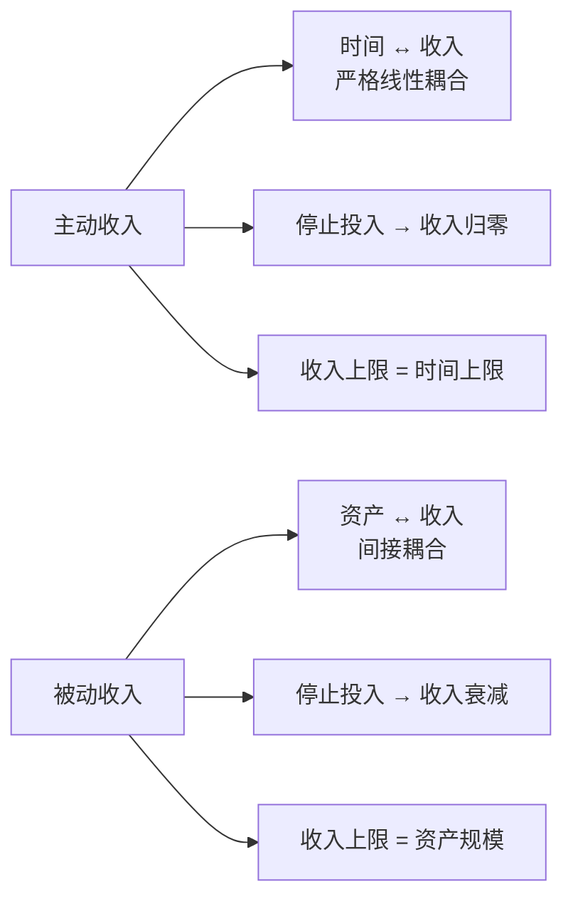
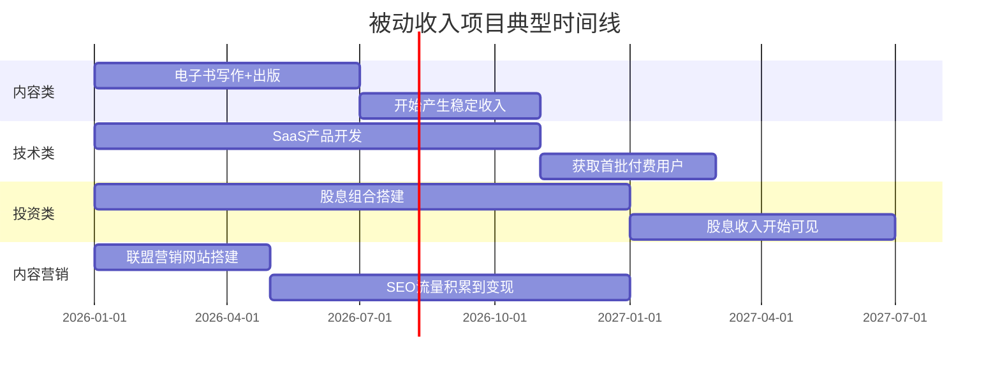
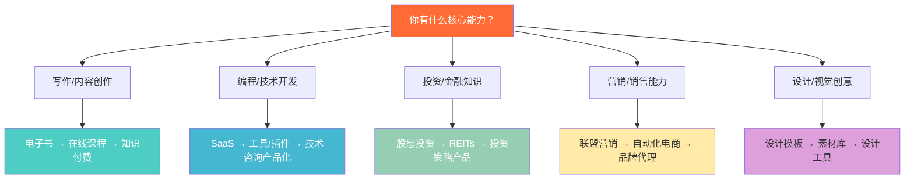

## 八、常见问题解答

在学习被动收入的定义、类型、底层逻辑、经济学分析、时间价值和风险评估之后，读者往往会产生大量具体问题。本节汇总了被动收入构建中最常见、最关键的问题，按主题分类逐一解答。这些问题来源于实际咨询、社群讨论和读者反馈，每一个都对应着一个真实的认知障碍或决策困惑。

---

### 一、概念与认知类

#### Q1：被动收入真的能"不用工作"吗？

不能。"被动收入"这个名称本身就是误导性的——它暗示"被动=不做事"，但事实恰恰相反。

**准确的理解是：被动收入是"前期主动投入，后期减少投入"的收入模式。** "被动"描述的是收入产生时的状态，不是整个过程的状态。

具体来说，被动收入的工作量分布如下：

| 阶段 | 工作强度 | 持续时间 | 说明 |
|------|---------|---------|------|
| 前期构建 | 极高 | 3-18 个月 | 创作、开发、搭建、积累 |
| 冷启动 | 高 | 1-6 个月 | 推广、测试、迭代、优化 |
| 稳定期 | 中低 | 持续 | 维护、更新、客服、优化 |
| 成熟期 | 低 | 持续 | 偶尔维护，收入趋于稳定 |

以一个在线课程为例：前期需要 3 个月录制课程、1 个月搭建销售页面、2 个月推广引流——这 6 个月的投入强度不亚于一份全职工作。课程上线后，你仍然需要处理学员问题、更新过时内容、优化转化率。只是到了成熟期，你每天可能只需要花 30 分钟到 1 小时处理相关事务，而收入可能相当于一份兼职薪水。

**关键区别：主动收入是"你停止工作=收入归零"，被动收入是"你停止工作=收入缓慢下降"。** 前者是线性关系，后者是衰减曲线。你的目标是让这条衰减曲线尽可能平缓——通过构建高质量的资产、建立自动化系统、定期维护更新。

#### Q2：被动收入和主动收入的本质区别是什么？

两者的本质区别不在于"是否需要工作"，而在于**收入与时间的耦合关系**：



用一个具体对比说明：

| 维度 | 主动收入（自由撰稿人） | 被动收入（电子书作者） |
|------|---------------------|---------------------|
| 收入来源 | 按篇/按字收费 | 版税（每卖出一本抽成） |
| 时间关系 | 写一篇赚一篇的钱 | 写一次，卖无数次 |
| 收入上限 | 每月最多写 N 篇 | 理论上无上限 |
| 停工影响 | 立即停止收入 | 收入逐渐下降 |
| 前期投入 | 低（立即开始赚钱） | 高（3-6 个月无收入） |
| 核心能力 | 写作速度和质量 | 写作质量 + 营销能力 |

更深层的区别在于**决策逻辑**：

- **主动收入思维**："我这个小时做什么能赚最多钱？"——优化的是单位时间的产出效率。
- **被动收入思维**："我投入的这 100 小时能变成一个每月产出多少的资产？"——优化的是投入产出的长期比率。

这两种思维不矛盾，最优策略是在维持主动收入（保障生活）的同时，逐步构建被动收入资产（创造未来）。

#### Q3：被动收入需要多少启动资金？

这取决于你选择的被动收入类型。资金门槛从零到数百万不等：

| 被动收入类型 | 最低启动资金 | 推荐启动资金 | 主要资金用途 |
|------------|-----------|-----------|------------|
| 自媒体/内容创作 | ¥0 | ¥1,000-5,000 | 设备、工具订阅 |
| 电子书/数字产品 | ¥0 | ¥500-3,000 | 设计、排版、推广 |
| 联盟营销网站 | ¥500-2,000 | ¥5,000-20,000 | 域名、托管、SEO工具 |
| 在线课程 | ¥0 | ¥3,000-10,000 | 录制设备、平台费、推广 |
| SaaS 产品 | ¥5,000-20,000 | ¥50,000-200,000 | 开发、服务器、推广 |
| 股息投资 | ¥10,000 | ¥100,000+ | 买入股票/基金/REITs |
| 房产租金 | ¥300,000+ | ¥800,000+ | 首付、装修、家具 |

**但"启动资金"只是表面数字，真正的成本是时间。** 一个零资金启动的自媒体项目，可能需要你投入 500 小时的内容创作时间。如果按你的时薪 100 元计算，这 500 小时的"隐性成本"是 50,000 元。

这也是为什么我们在"时间价值分析"一节中强调：评估被动收入项目不能只看资金投入，必须把时间投入也折算进去。

#### Q4：被动收入和副业有什么区别？

副业是主动收入的一种延伸——你用额外的时间换取额外的收入。被动收入是完全不同的收入模式——你构建一个资产，资产替你赚钱。

| 维度 | 副业 | 被动收入 |
|------|------|---------|
| 本质 | 用更多时间换更多钱 | 用资产替你赚钱 |
| 时间关系 | 做就有，不做就没有 | 前期做，后期可能不做也有 |
| 典型例子 | 下班后开滴滴、接外包 | 写一本电子书、建一个网站 |
| 收入上限 | 受限于可支配时间 | 理论上无上限 |
| 可持续性 | 停止劳动=停止收入 | 资产存在=收入存在 |
| 核心挑战 | 时间不够用 | 前期看不到回报 |

**很多被动收入项目确实从副业开始。** 比如你利用周末时间写电子书（此时是副业），写完出版后持续获得版税（变成了被动收入）。关键区别在于：这个项目最终是否能在你减少投入后继续产生收入。如果答案是"是"，它就是被动收入；如果答案是"必须持续投入才有收入"，那它本质上还是副业。

#### Q5：被动收入有法律和税务上的特殊规定吗？

有。在中国税务体系中，被动收入和主动收入适用不同的税目和税率：

| 收入类型 | 适用税目 | 税率 | 说明 |
|---------|---------|------|------|
| 工资薪金（主动） | 综合所得 | 3%-45% 累进 | 年终汇算清缴 |
| 版税/稿酬 | 综合所得（稿酬） | 20%（减征 30%） | 实际税率约 14% |
| 股息红利 | 利息股息红利 | 20% | 持股超 1 年免征 |
| 财产租赁（租金） | 财产租赁所得 | 20% | 可扣除相关费用 |
| 经营所得（SaaS等） | 经营所得 | 5%-35% 累进 | 个体户/公司不同 |

**几个关键税务知识点：**

1. **稿酬所得有优惠**：稿酬所得在计算应纳税所得额时，先减除 20% 的费用，再按 70% 计入综合所得。这意味着实际税负比工资薪金低。

2. **股息的持有期限影响**：A 股持股超过 1 年，股息红利免征个人所得税；持股 1 个月至 1 年，税率为 10%；持股 1 个月以内，税率为 20%。这是鼓励长期投资的政策。

3. **租金收入可以扣除**：出租房屋的修缮费用、相关税费（房产税、城建税等）可以在计算应纳税所得额时扣除。

4. **跨境收入更复杂**：如果你在海外平台（如 Amazon KDP）获得收入，涉及外汇管理和可能的双重征税问题。建议年收入超过 10 万元时咨询专业税务师。

**重要提醒：** 以上为中国大陆税法的一般性概述，具体执行可能因地区和政策变化而不同。税务规划是被动收入构建中不可忽视的一环，建议在收入达到一定规模后寻求专业税务咨询。

---

### 二、可行性与期望管理类

#### Q6：普通人真的能靠被动收入实现财务自由吗？

能，但需要正确定义"财务自由"和认识实现路径。

**财务自由的数学定义：被动收入 ≥ 生活支出。** 假设你每月生活支出 8,000 元，当你的被动收入稳定达到 8,000 元以上时，你就实现了基本的财务自由。

听起来简单，但拆解一下：

| 每月被动收入目标 | 实现方式示例 | 所需前置条件 | 可能耗时 |
|----------------|------------|------------|---------|
| ¥3,000 | 一本畅销电子书 + 一个小型联盟营销网站 | 写作能力 + 基础建站技术 | 1-2 年 |
| ¥8,000 | 股息投资组合（按 4% 年化）需 240 万本金 | 240 万投资资金 | 5-15 年积累 |
| ¥15,000 | 一个中型 SaaS 产品（200 个付费用户） | 编程能力 + 产品思维 | 2-3 年 |
| ¥30,000 | 多元化组合（课程+投资+房产） | 综合能力 + 大量资金 | 5-10 年 |

**关键事实：大多数实现财务自由的人，靠的不是单一被动收入，而是多元化的收入组合。** 而且他们通常在主动收入阶段就已经积累了足够的技能、资金和人脉。

更现实的路径是"半退休"模式——被动收入覆盖 50%-80% 的生活支出，剩余部分通过低强度的主动工作（咨询、兼职、兴趣变现）补足。这种模式的门槛低得多，实现速度也快得多。

#### Q7：被动收入一般需要多长时间才能看到回报？

这取决于项目类型、投入强度和你的基础能力。以下是真实的时间线预期：



**分阶段来看：**

- **第 1-3 个月**：几乎不会有任何收入。这是投入最密集、回报最不可见的阶段，也是大多数人放弃的阶段。
- **第 4-6 个月**：可能开始有零星收入（每月几十到几百元）。这个阶段的关键是验证方向是否正确，而不是追求收入数额。
- **第 7-12 个月**：如果方向正确且持续投入，收入开始增长。好的项目可能达到每月数千元。
- **第 13-24 个月**：收入趋于稳定，系统逐步成型。这个阶段的典型收入范围是每月 3,000-30,000 元，取决于项目类型和投入程度。
- **24 个月以上**：成熟的被动收入系统进入"维护模式"，你需要投入的时间减少，但收入持续增长（假设你持续优化）。

**一个重要的心理预期：前 6 个月的收入可能还不够覆盖你的工具订阅费。** 这是正常的。这个阶段的"回报"不是金钱，而是经验、技能和数据——它们帮助你在后续阶段做出更好的决策。

#### Q8：被动收入的回报率一般有多高？

不同类型被动收入的回报率差异极大，不能用单一数字概括。以下是基于实际数据的回报率区间：

| 被动收入类型 | 年化回报率（基于投入资金） | 年化回报率（基于投入时间*） | 波动性 |
|------------|------------------------|-------------------------|-------|
| 银行定期存款 | 1.5%-3% | — | 极低 |
| 股息股票组合 | 3%-8% | — | 中 |
| REITs | 4%-8% | — | 中高 |
| 电子书 | 20%-200% | ¥50-200/小时 | 高 |
| 在线课程 | 50%-500% | ¥100-500/小时 | 高 |
| 联盟营销网站 | 30%-300% | ¥30-150/小时 | 高 |
| SaaS 产品 | 100%-1000% | ¥200-1000/小时 | 极高 |

*基于投入时间的时间回报率计算：项目总收益 ÷ 前期总投入时间

**注意两个关键点：**

1. **投资类被动收入的回报率看似低，但绝对金额可以很高。** 年化 6% 的回报率在 50 万本金上就是 3 万元/年。而一个年化回报率 200% 的电子书项目，如果前期只投入了 5,000 元，绝对收益也只有 10,000 元/年。

2. **数字产品类的高回报率背后是幸存者偏差。** 我们看到的是成功案例的数据，但大量失败的电子书、课程、SaaS 产品没有被统计。真实的"全样本"回报率要低得多。

**评估回报率时，最健康的思维方式是：不与别人比绝对数字，而与自己的其他选项比。** 如果你花 500 小时写一本电子书，最终每年收入 10,000 元；而同样的 500 小时如果用来接外包，能赚 50,000 元——但外包是一次性的，电子书是持续的。3 年后，电子书的累计收入可能就超过了外包。这就是被动收入的"延迟满足"本质。

---

### 三、风险与安全类

#### Q9：被动收入项目失败了怎么办？会亏多少钱？

首先要接受一个事实：**被动收入项目的失败率很高。** 根据各种行业数据的综合估算：

| 项目类型 | 首年存活率 | 3 年存活率 | 典型沉没成本 |
|---------|----------|----------|------------|
| 电子书 | 60%-70% | 30%-40% | 时间为主，资金 ¥2,000-5,000 |
| 在线课程 | 50%-60% | 25%-35% | 时间为主，资金 ¥5,000-15,000 |
| 联盟营销网站 | 40%-50% | 15%-25% | 时间+资金 ¥5,000-30,000 |
| SaaS 产品 | 30%-40% | 10%-20% | 时间+资金 ¥50,000-200,000 |
| 股息投资 | 80%-90% | 70%-80% | 资金为主，可能亏损 20%-40% |
| 房产租金 | 85%-95% | 75%-85% | 大额资金，可能亏损 10%-30% |

**失败后的应对策略：**

1. **及时止损**：设定明确的"退出标准"。比如，一个项目连续 6 个月收入低于月均 500 元，且经过 3 次以上的优化尝试仍无改善，就应该考虑退出。

2. **回收残值**：
   - 电子书/课程可以降价清仓或打包出售
   - 网站域名和流量可以出售（在 Flippa、帝国论坛等平台）
   - SaaS 产品的用户群可以转让
   - 股票投资可以逐步减仓

3. **提取经验**：失败的项目中最有价值的不是残值回收，而是你获得的经验——你学到了什么市场不需要、什么推广方式无效、什么技术方案不可行。这些经验会让下一个项目的成功率大幅提升。

4. **控制"学费"**：用 MVP 方法将单个项目的最大投入控制在你能承受的范围内。一个基本原则是：**单个被动收入项目的最大投入不超过你 3 个月的可支配收入。**

#### Q10：被动收入会不会因为政策变化或市场变化突然消失？

会。这是被动收入最被低估的风险之一。以下是真实发生过的"被动收入消失"案例：

**案例一：平台政策变化**
2021 年中国"双减"政策出台，在线教育行业遭受毁灭性打击。大量教育类课程创作者的被动收入一夜归零。启示：不要把所有被动收入建立在单一平台或单一政策敏感的行业上。

**案例二：算法变化**
Google 每年进行数千次搜索算法调整。2023 年的"有用内容更新"导致大量依赖 SEO 流量的联盟营销网站流量暴跌 50%-80%。启示：SEO 是好渠道，但不能是唯一渠道。

**案例三：技术替代**
AI 写作工具的普及（2023-2024）导致简单电子书和内容产品的市场价值大幅下降。过去靠"信息差"赚钱的电子书，现在用户可以直接用 AI 生成。启示：选择需要深度专业判断、个人经验、创意风格的领域，这些是 AI 短期内难以替代的。

**应对策略：**

1. **收入多元化**：不要依赖单一收入来源。理想状态是 3-5 个不同类型的被动收入，分布在不同的平台和行业。
2. **平台独立性**：尽可能在自己的平台上（自建网站、自建邮件列表）沉淀用户关系，而不是完全依赖第三方平台。
3. **持续关注行业动态**：订阅 3-5 个你所在领域的行业新闻源，每月花 2 小时了解政策和市场变化。
4. **保持"可迁移能力"**：你构建被动收入过程中积累的能力（写作、编程、营销、投资分析）是可以迁移到新项目的。即使一个项目失败了，你的能力不会消失。

#### Q11：需要保留多少应急资金才适合开始构建被动收入？

这是一个被严重忽视的问题。很多人急于开始被动收入项目，却忽略了基本的财务安全垫。

**建议的财务安全标准（在开始被动收入项目之前）：**

| 安全层级 | 应急资金 | 适用情况 |
|---------|---------|---------|
| 最低标准 | 3 个月生活费 | 兼职做被动收入，主业收入稳定 |
| 推荐标准 | 6 个月生活费 | 兼职做被动收入，主业收入有波动 |
| 宽裕标准 | 12 个月生活费 | 计划全职投入被动收入项目 |
| 激进标准 | 24 个月生活费 | 高风险项目（如 SaaS），可能长期无收入 |

**为什么应急资金如此重要？**

1. **避免"被迫决策"**：没有应急资金的人在被动收入项目遇到困难时，会因为经济压力做出短视决策——比如过早放弃一个有潜力的项目，或者为了短期收入降低产品质量。

2. **维持心态稳定**：被动收入构建最大的敌人是焦虑。当你知道即使 6 个月没有收入也能正常生活时，你才能做出理性的、长期导向的决策。

3. **避免"借贷投资"**：用信用卡、消费贷来投资被动收入项目是非常危险的。被动收入项目本身就有很高的失败率，如果失败的同时还背负债务，处境会非常艰难。

**一个实用的规划框架：**

```text
月收入 100% 
├── 生活必需 50%
├── 应急资金积累 20%（积累到目标后转为投资资金）
├── 被动收入项目投入 20%
└── 弹性支出 10%
```

先积累应急资金，再开始被动收入项目。这不是"拖延"，而是"打地基"。地基不稳的楼，盖得越高摔得越惨。

---

### 四、策略与执行类

#### Q12：应该从哪种被动收入类型开始？

这取决于你的核心能力、可用资源和风险偏好。以下是决策矩阵：



**更具体的推荐：**

| 你的情况 | 推荐起步项目 | 理由 |
|---------|-----------|------|
| 有写作能力，无资金 | 电子书 | 零资金启动，边写边学 |
| 有技术能力，有少量资金 | 微型 SaaS 工具 | 技术壁垒带来竞争保护 |
| 有资金，无特殊技能 | 股息投资组合 | 门槛最低的被动收入形式 |
| 有营销经验 | 联盟营销网站 | 利用已有流量运营能力 |
| 有设计能力 | 设计模板商店 | 模板可批量生产，边际成本低 |
| 有专业知识 | 在线课程 | 知识溢价高，复购率高 |

**一个通用的建议：选择与你当前主动收入最相关的领域。** 因为你已经具备了该领域的专业知识和人脉，启动成本最低。比如，一个程序员最适合做技术类 SaaS 或编程教程，一个设计师最适合做设计模板或素材库。

#### Q13：应该同时做几个被动收入项目？

**新手：1 个。进阶：2-3 个。老手：3-5 个。绝不超过 5 个。**

这是一个被大量实践验证的规则。原因如下：

**为什么不能同时做太多项目？**

1. **注意力稀释**：每个项目都需要持续关注——数据监控、用户反馈、内容更新、市场变化。5 个项目意味着你的注意力被分成 5 份，每份都做不好。

2. **启动期叠加**：如果同时启动 3 个项目，你会在第 3-6 个月同时面对 3 个项目的"无回报期"。这种叠加的心理压力很容易让人全面放弃。

3. **资源冲突**：有限的资金、时间、精力在多个项目间分配，导致每个项目都无法达到"临界质量"。

**推荐的组合模式（适用于有 1 个成熟项目的进阶者）：**

| 项目角色 | 数量 | 精力分配 | 说明 |
|---------|------|---------|------|
| 核心项目 | 1 个 | 50% | 已经产生稳定收入，持续优化 |
| 增长项目 | 1 个 | 30% | 正在起步，有增长潜力 |
| 探索项目 | 1 个 | 20% | 实验性质，验证新方向 |

当探索项目验证成功后，将其升级为增长项目；当增长项目收入超过核心项目时，角色互换。核心项目的生命周期结束后（收入持续下降），用增长项目填补。

#### Q14：被动收入项目的"自动化"到底能做到什么程度？

自动化程度取决于项目类型。以下是各类项目的自动化能力评估：

| 项目类型 | 可自动化部分 | 难以自动化部分 | 自动化率 |
|---------|------------|-------------|---------|
| 电子书 | 销售、交付、邮件营销 | 内容创作、修订更新 | 90%+ |
| 在线课程 | 销售、交付、邮件序列 | 答疑、内容更新 | 70%-85% |
| 联盟营销 | 内容发布、SEO监控 | 内容创作、策略调整 | 60%-80% |
| SaaS 产品 | 注册、计费、基础客服 | 功能开发、Bug修复、客户成功 | 50%-70% |
| 股息投资 | 定投、再投资、再平衡 | 策略调整、个股研究 | 80%-95% |
| 房产租金 | 租金收缴、账单支付 | 维修、租客管理、空置期处理 | 40%-60% |

**实现自动化的关键工具和方法：**

1. **销售和交付自动化**：
   - Gumroad、自建 WooCommerce：自动处理支付和数字产品交付
   - 知识星球、小鹅通：课程内容自动交付
   - 邮件自动化（Mailchimp、ConvertKit）：自动发送欢迎序列、追销邮件

2. **内容分发自动化**：
   - Buffer、Later：社交媒体定时发布
   - IFTTT、Zapier：跨平台内容同步
   - WordPress 定时发布：提前排期文章

3. **客服自动化**：
   - FAQ 页面和知识库：减少 80% 的重复性问题
   - 聊天机器人：处理常见咨询
   - 工单系统：自动分类和分配问题

4. **投资自动化**：
   - 定投计划：自动按月买入
   - 股息再投资计划（DRIP）：自动将分红再买入
   - 再平衡工具：自动调整组合比例

**自动化的目标不是"零工作"，而是"最小化重复性工作"。** 你应该把省下来的时间用于高价值活动：产品改进、市场研究、新项目探索。

#### Q15：被动收入项目失败率那么高，有什么方法能提前验证可行性？

MVP（最小可行产品）验证是降低失败率最有效的方法。核心理念是：**用最少的时间和金钱，验证市场需求是否存在。**

**各类项目的 MVP 验证方法：**

| 项目类型 | MVP 形式 | 验证成本 | 验证周期 | 成功标准 |
|---------|---------|---------|---------|---------|
| 电子书 | 先写 3 篇相关文章测试阅读量 | ¥0 | 2-4 周 | 总阅读量 > 1,000 |
| 在线课程 | 先做 1 节免费试听课收集反馈 | ¥500 | 1-2 周 | 观看完成率 > 60% |
| SaaS 产品 | 用无代码工具做原型，收集意向 | ¥1,000 | 2-4 周 | 50+ 意向注册 |
| 联盟营销 | 先建 5 篇文章测试 SEO 流量 | ¥1,000 | 2-3 月 | 自然搜索流量 > 100/天 |
| 设计模板 | 先上架 3 个模板测试转化 | ¥200 | 1-2 周 | 售出 > 5 份 |
| 股息投资 | 先用 1 万元小规模试投 | ¥10,000 | 3-6 月 | 实际年化收益符合预期 |

**MVP 验证的三大原则：**

1. **速度优先于完美**：MVP 的目的是验证需求，不是展示你的最高水平。一个粗糙但真实的需求验证，比一个精美但未经市场检验的方案有价值得多。

2. **数据优先于直觉**：不要问朋友"你觉得这个产品怎么样"——朋友会出于善意说好话。要看真实的市场数据：有没有人搜索这个关键词？有没有人为类似产品付费？竞品的销量如何？

3. **可放弃优先于可坚持**：在 MVP 阶段就应该设定"放弃标准"。如果数据不达标，果断放弃转向下一个方向。沉没成本谬误是被动收入构建中最致命的思维陷阱。

---

### 五、时间与精力管理类

#### Q16：全职工作很忙，怎么挤出时间做被动收入项目？

这是最常见的现实障碍。以下是经过验证的时间管理策略：

**策略一：早起法（推荐）**

每天早起 1-1.5 小时，用于被动收入项目。这个时间段头脑最清醒、干扰最少。

| 时间 | 活动 |
|------|------|
| 5:30 | 起床 |
| 5:45-7:00 | 被动收入项目工作 |
| 7:00-7:30 | 洗漱、早餐 |
| 7:30 | 出门上班 |

按这个节奏，每周投入约 7-10 小时，一年约 350-500 小时。足以完成一本电子书或搭建一个中小型网站。

**策略二：周末集中法**

周末拿出一个半天（4-5 小时）集中处理需要深度思考的任务，工作日晚上用 30 分钟处理简单任务（回复评论、数据监控等）。

**策略三：碎片时间利用法**

适合特定类型的任务：
- 通勤路上：听行业播客、做市场调研（手机搜索竞品）
- 午休时间：写文章大纲、回复用户消息
- 等待时间：阅读相关书籍、做笔记

**关键原则：不要试图"找到"时间，而要"创造"时间。** 具体做法：

1. **审计你的时间**：记录一周的时间使用，你会惊讶地发现每天有 2-3 小时被"无意识消耗"（刷社交媒体、看短视频、无目的浏览）。
2. **减少低价值活动**：不是完全戒除，而是有意识地减少。每天从"无意识消耗"中夺回 1 小时就够了。
3. **建立固定节奏**：每天固定时间做固定的事，形成习惯后就不需要消耗意志力。

#### Q17：做被动收入项目需要哪些技能？需要全部从零学起吗？

不需要全部从零学起。被动收入项目的技能需求可以分为"核心技能"和"辅助技能"：

| 技能类别 | 技能项 | 重要度 | 学习难度 | 是否可外包 |
|---------|--------|-------|---------|----------|
| 核心技能 | 产品/内容创作能力 | ★★★★★ | 中 | 部分可（但质量难保证） |
| 核心技能 | 市场需求判断力 | ★★★★★ | 高 | 不可 |
| 辅助技能 | 建站/技术搭建 | ★★★★ | 中 | 可 |
| 辅助技能 | SEO/内容营销 | ★★★★ | 中 | 可 |
| 辅助技能 | 数据分析 | ★★★ | 低 | 可 |
| 辅助技能 | 平面设计 | ★★ | 低 | 可 |
| 辅助技能 | 视频制作 | ★★★ | 中 | 可 |

**最高效的学习策略：只学核心技能，辅助技能用工具或外包替代。**

- 不会建站？用 WordPress + 模板，半天搞定。
- 不会设计？用 Canva，10 分钟出一张海报。
- 不会视频剪辑？用剪映，1 小时学会基础操作。
- 不会 SEO？用 Ahrefs/SEMrush 的引导式工具。

**核心技能中，"市场需求判断力"是最重要的，也是最难学的。** 它不能通过课程速成，只能通过实践积累——做 3-5 个项目（包括失败的）之后，你自然会形成对市场需求的直觉。

---

### 六、进阶思考类

#### Q18：AI 时代，被动收入还有前景吗？

AI 确实改变了被动收入的格局，但不是"消灭"了被动收入，而是"重新分配"了价值。

**AI 冲击最大的领域：**
- 信息差型产品（简单汇编类电子书、FAQ 类内容）
- 基础内容生产（通用性文章、简单翻译、模板化文案）
- 基础设计（简单 logo、通用海报、基础 PPT 模板）

**AI 冲击较小甚至受益的领域：**
- 深度专业内容（需要行业经验、原创研究、个人见解）
- 社区和关系（付费社群、会员制、粉丝经济）
- 复杂技术产品（SaaS、自动化工具、AI 集成服务）
- 投资类（AI 反而让量化策略更容易实现）
- 体验类（线下活动、咨询服务的产品化）

**应对 AI 冲击的策略：**

1. **向"不可替代"方向迁移**：个人经验、独特视角、深度专业判断、创意风格——这些是 AI 短期内难以复制的。
2. **利用 AI 增效**：把 AI 当工具而非竞争对手。用 AI 加速内容创作、自动化客服、辅助数据分析，让你的产出效率提升 3-10 倍。
3. **构建"人+AI"的混合产品**：比如，用 AI 生成初稿，人工审核和深度编辑；用 AI 做 80% 的工作，人工完成最关键的 20%。

#### Q19：被动收入需要持续维护吗？如果我不维护会怎样？

需要，而且维护的频率和内容取决于项目类型：

| 项目类型 | 维护频率 | 主要维护内容 | 不维护的后果 |
|---------|---------|------------|------------|
| 电子书 | 每季度 | 更新过时信息、修订错误 | 1-2 年后评价变差、销量下降 |
| 在线课程 | 每月 | 回复学员问题、更新内容 | 差评增加、退款率上升 |
| 联盟营销网站 | 每周 | 发布新内容、检查链接 | SEO 排名下降、流量流失 |
| SaaS 产品 | 每日 | Bug 修复、服务器维护 | 用户流失、口碑崩塌 |
| 股息投资 | 每季度 | 组合再平衡、标的审查 | 组合偏离目标、风险集中 |
| 房产租金 | 每月 | 租金收缴、维修协调 | 空置率上升、租金下降 |

**维护时间的典型范围：**

- 最低维护：电子书、股息投资（每月 2-5 小时）
- 中等维护：课程、联盟营销（每月 10-20 小时）
- 高维护：SaaS 产品、房产（每月 20-40 小时）

**一个经验法则：如果你超过 3 个月没有关注一个被动收入项目，它的收入很可能已经开始下降了。** 定期"巡检"是必要的——每月花 1-2 小时检查所有被动收入项目的关键指标（流量、收入、用户反馈），及时发现问题。

#### Q20：被动收入的终极目标是什么？是财务自由还是别的？

被动收入本身不是目标，它是实现目标的手段。不同的人用被动收入追求不同的终极目标：

| 终极目标 | 描述 | 典型路径 |
|---------|------|---------|
| 基础安全 | 被动收入覆盖基本生活开支 | 股息投资 + 1 个数字产品 |
| 半退休 | 被动收入覆盖大部分开支，只做少量喜欢的工作 | 多元化组合，被动收入占比 60%-80% |
| 完全财务自由 | 被动收入远超生活开支，完全自由选择做什么 | 高价值资产组合，被动收入占比 100%+ |
| 时间自由 | 不追求收入最大化，而是时间自主权最大化 | 低维护被动收入，每月工作 < 10 小时 |
| 影响力 | 通过内容/产品影响更多人 | 以被动收入为载体传播知识和价值观 |

**最健康的心态是：把被动收入构建当作一个"终身项目"。** 不急于求成，不追求一夜暴富，而是持续积累、持续优化。就像种一棵树——前 3 年看不到什么成果，但只要持续浇水施肥，第 4 年开始就会枝繁叶茂。

被动收入的真正价值不在于银行账户上的数字，而在于它赋予你的**选择权**——你可以选择做自己真正热爱的事情，而不是被迫做自己不喜欢但必须做的事情来维持生活。这才是被动收入的终极意义。

---

### 本节小结

本节回答了被动收入构建中最常见的 20 个问题，覆盖了概念认知、可行性期望、风险安全、策略执行、时间管理和进阶思考六大领域。核心要点回顾：

1. **认知纠偏**：被动收入不是"不用工作"，而是"前期主动投入，后期减少投入"。"被动"是结果，不是起点。
2. **预期管理**：看到回报通常需要 6-12 个月，前 6 个月几乎不会有收入。做好"延迟满足"的心理准备。
3. **安全底线**：在开始被动收入项目之前，先建立 3-6 个月的应急资金。不要用借贷资金投资。
4. **策略选择**：从 1 个项目开始，选择与你核心能力最匹配的类型，用 MVP 快速验证。
5. **AI 时代**：向"不可替代"方向迁移——深度专业、个人经验、创意风格、社区关系。
6. **终极意义**：被动收入的真正价值是选择权，而不是数字。

带着这些问题和答案，继续阅读下一节——被动收入的心理建设，了解如何在漫长的被动收入构建过程中保持正确的心态。
