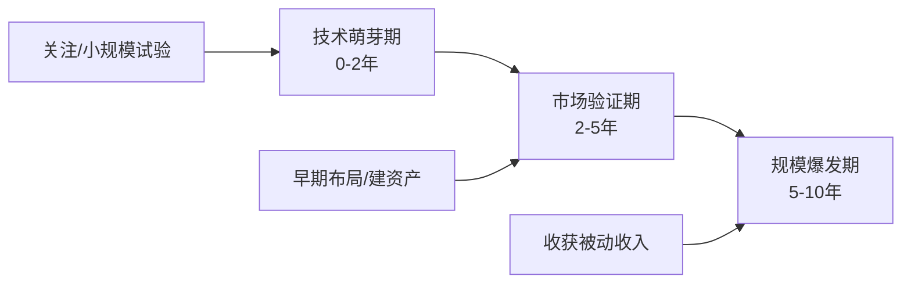
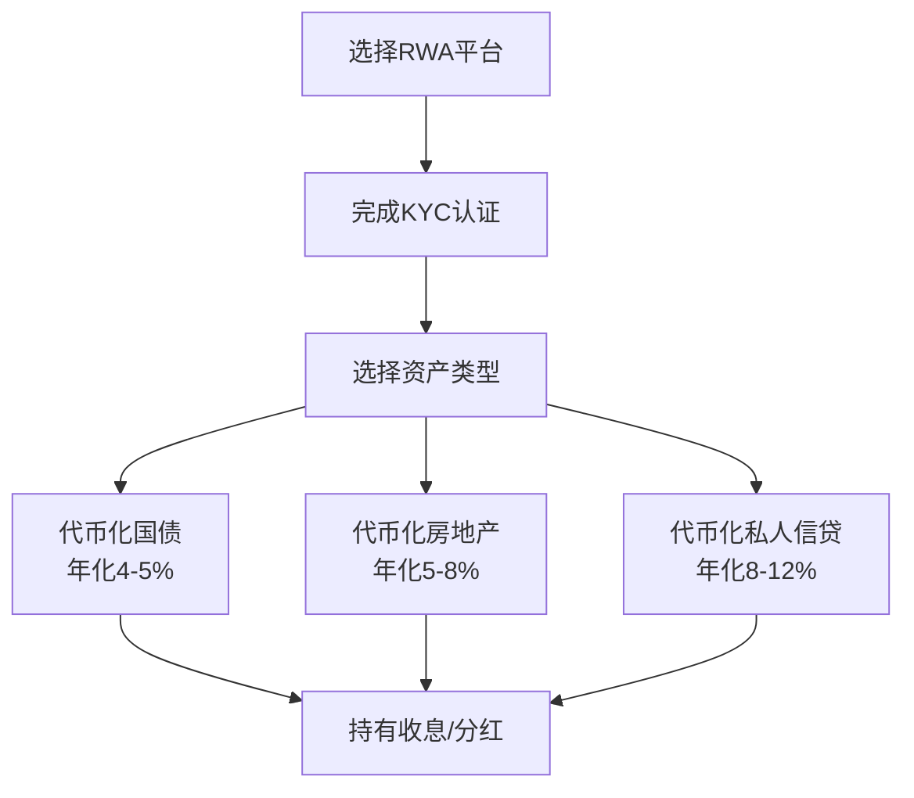
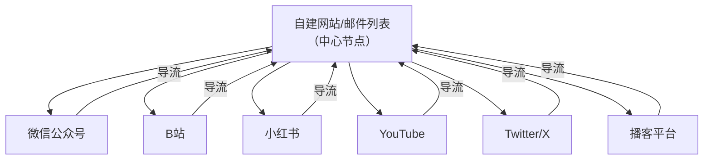
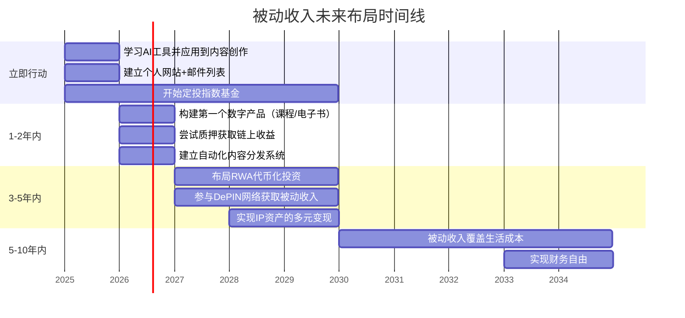

## 十、被动收入的未来趋势

被动收入的形态从来不是静态的。二十年前，"被动收入"几乎等同于银行定期存款利息；十年前，房产租金和股息分红成为主流认知；而今天，AI生成内容、智能合约自动分润、数据资产变现等全新形态正在重塑被动收入的版图。理解这些趋势，不是为了追逐热点，而是为了在趋势到来之前完成布局——被动收入的超额回报，永远属于提前卡位的人。

### 10.1 趋势分析框架

在逐一拆解具体趋势之前，需要建立一个分析框架，帮助你判断一个"新趋势"到底是真实机会还是短暂泡沫。

#### 10.1.1 判断趋势可靠性的四维模型

| 维度 | 评估标准 | 可靠信号 | 危险信号 |
|------|----------|----------|----------|
| **技术成熟度** | 底层技术是否已被大规模验证 | 技术已在多个行业落地应用 | 仅在实验室或白皮书中存在 |
| **市场渗透率** | 目标用户中有多少人在使用 | 渗透率 >5% 且持续增长 | 渗透率 <1% 且增长停滞 |
| **监管态度** | 政府和监管机构的立场 | 有明确法规框架或鼓励政策 | 监管空白或频繁打压 |
| **商业模式清晰度** | 赚钱路径是否可解释 | 有清晰的付费方和付费意愿 | 全靠补贴或"未来想象" |

**核心判断逻辑：** 四个维度中至少三个为"可靠信号"时，趋势值得认真投入；两个以下为可靠信号时，保持观察但不重资产投入。

#### 10.1.2 趋势演进的三个阶段



- **技术萌芽期：** 关键词频繁出现，但实际产品粗糙。此阶段的任务是学习和小成本试错，不追求收益。
- **市场验证期：** 第一批赚到钱的案例出现，商业模式开始清晰。此阶段的任务是快速建立资产——内容库、工具、用户群。
- **规模爆发期：** 大量用户涌入，基础设施成熟。此阶段的任务是享受之前布局带来的被动收入复利。

**实操建议：** 用一个"趋势跟踪表"来管理你关注的多个趋势，每月更新一次各维度评分。

```markdown
| 趋势名称     | 技术成熟度(1-5) | 市场渗透率(1-5) | 监管态度(1-5) | 商业清晰度(1-5) | 综合评分 | 行动建议   |
|-------------|----------------|----------------|--------------|----------------|---------|-----------|
| AI内容生成   | 5              | 4              | 3            | 4              | 16      | 重点布局   |
| RWA代币化    | 3              | 2              | 2            | 3              | 10      | 持续观察   |
| 脑机接口     | 2              | 1              | 1            | 1              | 5       | 仅了解     |
```

### 10.2 AI驱动的被动收入革命

AI（人工智能）对被动收入的影响不是"渐进式改良"，而是"范式级重构"。它同时降低了内容创作的边际成本、提升了个性化推荐的精度、并创造了全新的资产类型。

#### 10.2.1 AI内容生产：从"写一篇文章"到"运营一个内容工厂"

**现状与数据：**

截至2025年，全球已有超过60%的内容创作者在工作流中使用AI辅助工具。AI写作工具（如ChatGPT、Claude、文心一言）的能力已从"生成初稿"进化到"端到端内容生产"——从选题研究、大纲生成、初稿撰写、SEO优化到多语言翻译，全流程覆盖。

**对被动收入的具体影响：**

1. **内容类资产的创建成本暴跌：** 一本10万字的电子书，过去需要作者投入3-6个月的业余时间；借助AI辅助，一个有经验的作者可以在2-4周内完成同等质量的初稿，再加上1-2周的人工润色和事实核查。这意味着同样的时间可以产出10-20倍的内容资产。

2. **长尾市场的经济可行性大幅提高：** 过去，为一个只有5000人感兴趣的小众主题写一本书，投入产出比不划算。现在，AI让这些小众内容的创作成本降到足够低，使得"千人付费、每人100元"的小众市场变得有利可图。

3. **多形态内容的自动衍生：** 一篇文章可以由AI自动转化为：播客脚本→音频（TTS）→短视频脚本→视频（AI生成）→社交媒体帖子→邮件序列。一份内容资产，衍生出6-8种变现渠道。

**实操路径——AI内容被动收入矩阵：**

```text
内容母体（深度文章/课程）
    ├── 电子书（Amazon KDP / 微信读书）
    ├── 音频课程（播客 / 知识星球语音）
    ├── 视频课程（B站 / YouTube / Udemy）
    ├── 社交媒体内容（小红书 / 公众号 / Twitter）
    ├── 邮件订阅序列（Newsletter / 邮件课程）
    └── AI聊天机器人（基于内容库的付费问答）
```

**关键注意点：**

AI生成的内容如果直接发布，很快会陷入同质化竞争。差异化来自三个层面：
- **独家数据和案例：** 你自己的实战经验、行业内幕、私有数据集，这些是AI无法生成的。
- **个人品牌和信任：** 读者为"你"付费，不只是为"内容"付费。长期一致的风格、价值观和信誉是护城河。
- **深度加工和验证：** AI生成的初稿必须经过人工的事实核查、逻辑验证、案例补充。"AI写+人审"的混合模式才是正解。

#### 10.2.2 AI工具即服务（AI Tool-as-a-Service）

除了用AI辅助内容创作，直接构建和销售AI工具本身就是一种新兴的被动收入形态。

**具体模式：**

| 模式 | 描述 | 技术门槛 | 启动成本 | 月收入潜力 |
|------|------|---------|---------|-----------|
| **AI包装器（Wrapper）** | 在大模型API上封装垂直场景功能 | 低-中 | 500-5000元 | 1K-50K元 |
| **AI Agent工作流** | 预设的自动化AI工作流模板 | 中 | 1K-1万元 | 5K-100K元 |
| **垂直领域微调模型** | 针对特定行业的定制模型 | 高 | 5K-5万元 | 10K-500K元 |
| **AI数据集** | 清洗标注好的行业数据集 | 中 | 2K-2万元 | 3K-50K元 |

**案例——AI Wrapper的典型变现路径：**

一个面向电商卖家的"AI产品描述生成器"，底层调用GPT-4 API，但做了以下增值：
- 预设了50+产品类别的prompt模板
- 集成了SEO关键词分析
- 支持一键生成中英日三语描述
- 内置A/B测试功能

该工具定价：基础版99元/月，专业版299元/月。当积累到500个付费用户时（假设平均ARPU 150元），月收入为7.5万元。主要维护工作是偶尔更新prompt模板和处理客户反馈——接近"被动"状态。

#### 10.2.3 AI代理（Agent）时代的被动收入

AI Agent是比AI工具更进一步的形态——它不是等你来用，而是主动替你工作。

**正在浮现的被动收入场景：**

- **AI交易代理：** 训练一个AI在股票、加密货币或外汇市场执行预设策略。你需要做的是策略设计和风控设定，AI负责7×24小时执行。目前该领域的年化收益中位数在8-15%（扣除AI工具费用后），但波动率和回撤风险需要专业管理。

- **AI内容代理：** 设定一个AI代理自动监控特定领域的新闻和趋势，自动生成内容草稿，自动排期发布到多个平台。你只需每周花1-2小时审核和调整。

- **AI客服代理：** 如果你有一个SaaS产品或电商店铺，AI客服代理可以处理80%以上的常见问题，让你的产品真正实现"自动化运转"。

**风险提示：** AI代理的风险在于"自动化犯错"——一个错误的决策被自动执行，可能造成比人工操作更大的损失。因此，任何AI代理都必须设置"熔断机制"：单日亏损超过阈值自动停止、异常行为自动报警、关键操作保留人工确认环节。

### 10.3 区块链与去中心化被动收入

区块链技术对被动收入的影响经历了从"过度炒作"到"理性落地"的周期。当前（2025-2026年），区块链被动收入已经脱离了早期的投机泡沫，进入实用化阶段。

#### 10.3.1 实物资产代币化（RWA）：最大的结构性机会

**什么是RWA：** 将现实世界的资产（房产、债券、艺术品、知识产权）代币化，使其可以在区块链上交易和分割。

**为什么这是被动收入的大趋势：**

传统被动收入的高门槛资产——比如一栋价值1000万的商铺，年租金回报率5%——普通人根本参与不了。RWA代币化后，你可以用1000元买入这栋商铺的万分之一份额，获得对应的租金收益份额。

**目前的市场规模和增长：**

RWA代币化市场从2023年的约50亿美元增长到2025年底的超过300亿美元，年增长率超过100%。主要玩家包括贝莱德（BlackRock）的BUIDL基金、Ondo Finance、Maple Finance等。

**普通人参与RWA被动收入的路径：**



**具体平台推荐（2025年状态）：**

| 平台 | 资产类型 | 最低投入 | 预期年化 | 合规状态 |
|------|---------|---------|---------|---------|
| Ondo Finance（OUSG） | 美国国债 | 约7000元 | 4-5% | 美国SEC合规 |
| Centrifuge | 企业贷款 | 约3500元 | 8-12% | 欧盟MiCA框架 |
| RealT | 美国房产 | 约350元 | 7-10% | 美国Reg D合规 |
| 朗新科技（蚂蚁链） | 中国充电基础设施 | 约1000元 | 5-8% | 中国合规 |

**风险提示：** RWA赛道的风险主要在于：①平台跑路风险（选择有知名机构背书的平台）；②底层资产质量风险（了解你投资的到底是什么）；③监管政策变化风险（中国大陆对加密资产的政策态度尚未完全明朗）。

#### 10.3.2 质押（Staking）与再质押（Restaking）

**质押的基本原理：** 持有PoS（权益证明）链的原生代币（如ETH、SOL），将其锁定在网络中参与共识验证，获得网络奖励。这类似于"把钱存到银行获得利息"，但利率由网络供需决定。

**再质押的叠加收益：** 2024年兴起的"再质押"（以EigenLayer为代表）允许你把已经质押的ETH再次"借"给其他协议使用，获得额外收益。这相当于同一笔资金赚两份回报。

**当前主流质押收益率（2025年）：**

| 链/协议 | 基础质押年化 | 再质押额外年化 | 综合年化 | 流动性 |
|---------|------------|--------------|---------|--------|
| Ethereum（ETH） | 3-4% | 1-3%（EigenLayer） | 4-7% | 通过Lido等可获得流动性代币 |
| Solana（SOL） | 6-8% | N/A | 6-8% | 原生质押有解绑期 |
| Cosmos生态 | 10-20% | 视协议而定 | 10-25% | 多数链支持即时解绑 |

**实操步骤（以ETH质押为例）：**

1. 准备一个硬件钱包（Ledger或Trezor），确保私钥安全
2. 在Lido（stETH）或Rocket Pool（rETH）中质押ETH
3. 获得流动性质押代币（stETH/rETH），可随时在二级市场卖出
4. 如需叠加收益，将stETH存入EigenLayer进行再质押
5. 监控收益率变化和协议安全状况，每月评估一次是否调整

**关键提醒：** 质押的"被动"程度很高，但绝不等于"无风险"。智能合约漏洞、slashing惩罚（验证节点作恶导致的质押扣减）、代币价格波动都是真实风险。建议仅用你能承受损失的资金参与，且分散到多个协议。

#### 10.3.3 去中心化物理基础设施网络（DePIN）

**什么是DePIN：** 通过代币激励，让普通人贡献物理资源（存储空间、网络带宽、计算能力、传感器数据等），构建去中心化的基础设施网络。

**DePIN是被动收入的"新大陆"，因为它把普通人家里的闲置硬件变成了收入来源。**

**主要DePIN项目与收益模型：**

| 项目 | 贡献资源 | 硬件投入 | 月收益估算 | 被动程度 |
|------|---------|---------|-----------|---------|
| **Filecoin / Arweave** | 硬盘存储空间 | 2000-1万元 | 200-2000元 | 高（配置后自动运行） |
| **Helium（5G）** | 5G热点覆盖 | 1500-5000元 | 100-1000元 | 高（部署后自动运行） |
| **Render Network** | GPU计算能力 | 使用已有显卡 | 500-5000元 | 中（需管理任务） |
| **Grass / DIMO** | 网络带宽/车辆数据 | 0-500元 | 50-500元 | 极高（几乎全自动） |

**DePIN被动收入的决策框架：**

```text
是否值得投入DePIN？
├── 硬件投入是否在你预算内？（建议 <月收入的10%）
├── 你所在地区是否有需求？（5G热点需要附近有用户）
├── 项目的代币经济模型是否可持续？（避免纯靠通胀激励的项目）
└── 你是否有技术能力完成部署？（多数项目有一键部署方案）
```

### 10.4 创作者经济的进化

创作者经济正在从"个人英雄主义"向"系统化资产运营"转型。这个转型创造了大量新的被动收入机会。

#### 10.4.1 从"内容创作者"到"IP资产运营商"

**旧模式：** 创作者持续输出内容 → 获得广告/打赏收入 → 一旦停止创作，收入归零。这不是被动收入，这是"伪装成自由的高薪苦力"。

**新模式：** 创作者构建IP资产 → 围绕IP建立多元变现系统 → IP资产持续产生收入，创作者可以逐步退出日常运营。

**IP资产的具体形态：**

- **内容库：** 数百篇高质量文章/视频，通过SEO持续获取搜索流量
- **课程体系：** 结构化的在线课程，通过平台自动销售和交付
- **社区资产：** 付费社群（知识星球、Discord会员等），由社区自运转机制和AI助手维持活跃
- **授权和衍生：** IP授权给其他创作者或品牌使用，获得版税收入
- **模板和工具：** 与IP相关的模板、工具包、资源库，一次创建反复销售

**案例拆解：一个"AI绘画教程"IP的被动收入构建**

```text
第1阶段（0-6个月）：建立内容资产
├── 发布50篇AI绘画教程（B站+公众号+小红书）
├── 积累1万精准粉丝
└── 月收入：0-500元（平台广告分成）

第2阶段（6-12个月）：产品化
├── 将教程体系化为一门在线课程（定价299元）
├── 制作配套的prompt模板包（定价99元）
├── 建立付费社群（199元/年）
└── 月收入：5000-2万元

第3阶段（12-24个月）：自动化
├── 用AI客服处理社群日常问题
├── 用AI代理自动发布和回复评论
├── 课程内容更新频率从每月降到每季度
├── 作者角色从"创作者"变为"产品经理"
└── 月收入：2-8万元（其中70%以上为被动收入）

第4阶段（24个月+）：IP授权
├── 将课程体系授权给培训机构（版税模式）
├── 出版配套书籍（版税收入）
├── 推出企业定制版（B端收入）
└── 月收入：5-20万元（90%以上为被动收入）
```

#### 10.4.2 粉丝经济的Web3化

传统平台（微信、抖音、YouTube）上，创作者的粉丝关系被平台"绑架"——你无法直接联系你的粉丝，平台算法决定谁能看见你的内容，平台抽成30-50%。

Web3时代的粉丝经济正在改变这个格局：

- **NFT会员卡：** 粉丝购买NFT获得社区准入资格，创作者获得一级市场收入；NFT在二级市场流转时，创作者自动获得版税（通常5-10%）。
- **代币经济：** 创作者发行个人代币，粉丝持有代币享受独家内容/投票权/线下活动资格。代币增值带来的是一种新型的被动收入。
- **去中心化社交协议：** 如Farcaster、Lens Protocol，创作者真正拥有自己的社交图谱，不依赖任何单一平台。

**当前现实：** Web3粉丝经济仍处于早期阶段，用户规模远小于传统平台。务实的做法是：在传统平台积累粉丝和内容资产，同时在Web3平台建立"备份"存在，等待基础设施成熟时快速迁移。

### 10.5 数据资产化：下一个被动收入蓝海

数据被称为"21世纪的石油"，但普通人一直不知道如何把"自己的数据"变成收入。这个局面正在改变。

#### 10.5.1 个人数据的三种变现路径

**路径一：数据许可（Data Licensing）**

你的行为数据（消费习惯、位置轨迹、浏览偏好）对品牌和研究机构有巨大价值。新兴平台（如Killi、Datum）允许用户自主选择出售哪些数据，并获得报酬。

- **操作方式：** 注册平台 → 连接数据源（电商账号、社交媒体、浏览器） → 设定隐私级别 → 自动出售
- **收入预期：** 每月50-500元，取决于数据丰富度和市场需求
- **被动程度：** 极高（连接后自动运行）
- **隐私风险：** 需要仔细阅读平台的隐私政策，确保数据不被滥用

**路径二：数据集构建与销售**

如果你在某个垂直领域有独特的数据获取渠道，可以构建数据集并在数据市场上销售。

- **案例：** 一个房产中介整理了某城市5年的房价、成交量、学区、交通数据，形成标准化数据集，在数据市场定价5000元/份，每月卖出10-20份。
- **适合的数据类型：** 行业价格数据、消费者行为数据、地理信息数据、特定领域的标注数据（AI训练用）
- **平台：** Snowflake Marketplace、AWS Data Exchange、Datarade

**路径三：AI训练数据贡献**

大模型时代，高质量训练数据是最稀缺的资源。你可以通过以下方式贡献数据获得被动收入：
- **标注数据：** 在Scale AI、Labelbox等平台参与数据标注（半主动收入）
- **领域知识数据：** 将你的专业领域知识结构化为问答对，出售给AI公司
- **对话数据：** 在合规前提下，贡献匿名化的对话数据用于模型训练

#### 10.5.2 数据资产化的关键挑战

| 挑战 | 描述 | 应对策略 |
|------|------|---------|
| 隐私合规 | GDPR、中国《个人信息保护法》等对数据使用有严格限制 | 仅使用第一方数据和合规平台，避免灰色地带 |
| 数据质量 | 低质量数据没有市场价值 | 投入时间清洗和标准化，建立数据质量保证流程 |
| 定价困难 | 数据定价没有成熟标准 | 参考同类数据集市场价格，初期可低价获客 |
| 持续更新 | 一次性数据集价值会递减 | 建立自动化数据采集和更新管道 |

### 10.6 绿色经济与可持续被动收入

ESG（环境、社会、治理）投资和绿色经济政策正在创造一类"既赚钱又正确"的被动收入机会。

#### 10.6.1 碳信用交易

随着全球碳中和目标的推进，碳信用（Carbon Credit）正在成为一个新兴的资产类别。

**个人参与碳信用被动收入的方式：**

- **碳信用ETF/基金：** 如KraneShares Global Carbon ETF（KRAN），追踪碳信用价格走势。2020-2023年间该ETF年化收益约15%（但波动较大）。
- **林业碳汇投资：** 投资造林项目，通过树木吸收CO₂产生碳信用出售。通常需要较长的投资周期（5-10年才能产生碳信用），但一旦开始产生碳信用，收入可持续20-30年。
- **碳信用代币：** 如Toucan Protocol、KlimaDAO将碳信用代币化，可以在链上交易。风险较高但流动性好。

#### 10.6.2 可再生能源收益权

**户用光伏：** 在自家屋顶安装光伏发电系统，自发自用+余电上网。

- **投入：** 5kW系统约2-3万元（中国2025年价格）
- **年收益：** 发电收入+补贴约3000-5000元
- **回本周期：** 5-8年
- **收益持续期：** 25-30年（光伏板寿命）
- **被动程度：** 极高（安装后几乎不需要维护）

**社区太阳能（Community Solar）：** 如果你没有合适的屋顶，可以投资社区太阳能项目，获得电力销售收入的分成。美国市场已较成熟，中国市场正在试点。

### 10.7 平台经济的结构性变化

主流互联网平台的政策变化直接影响依赖这些平台的被动收入。理解这些变化趋势，是被动收入长期可持续的关键。

#### 10.7.1 平台抽成的下降趋势

竞争压力正在推动平台降低创作者抽成：

| 平台 | 旧抽成比例 | 新趋势 | 对被动收入的影响 |
|------|-----------|--------|----------------|
| App Store | 30% | 降至15-27%（受反垄断压力） | 数字产品利润提升 |
| YouTube | 45% | 保持45%但增加新变现渠道 | 多元化收入来源 |
| 知识付费平台 | 20-50% | 自建平台成本降低 | 更多创作者选择自建 |
| 电商联盟 | 5-15% | 微利化趋势 | 需要更大流量规模 |

#### 10.7.2 "去中心化分销"的崛起

越来越多的创作者选择绕过平台，建立自己的分销渠道：

- **自建邮件列表：** 不依赖任何平台算法，直接触达订阅者。ConvertKit、Substack等工具让自建Newsletter变得极其简单。
- **独立站+SEO：** 通过Google/百度搜索获取免费流量，不依赖社交平台的推荐算法。
- **Telegram/Discord社区：** 直接管理和变现你的用户群，平台抽成为零。

**实操建议：** 不要ALL IN任何单一平台。理想的内容分发策略是"一个中心、多个节点"——以你自建的网站/邮件列表为中心，在多个平台（公众号、B站、小红书、YouTube、Twitter）建立分发节点，所有节点的流量最终导入中心。



### 10.8 远程工作与全球化带来的被动收入机会

远程工作的常态化正在创造两类新的被动收入机会。

#### 10.8.1 地理套利型被动收入

**原理：** 在生活成本低的地区生活，在收入水平高的市场赚钱，利用差异积累资本用于投资。

**具体操作：**

- 在中国二三线城市远程工作（生活成本3000-5000元/月），赚取一线城市或海外薪资（15000-30000元/月）
- 将月储蓄（10000-25000元）投入被动收入资产（指数基金、内容资产、DeFi等）
- 3-5年后，被动收入可覆盖生活成本

#### 10.8.2 跨境被动收入

全球化使得跨境销售数字产品变得容易：

- **Udemy/Skillshare：** 用英文或中文发布课程，面向全球市场。中国创作者在Udemy上的课程单价虽然较低（$10-20），但全球市场带来的销量可以非常可观。
- **Amazon KDP：** 中英文电子书在全球Amazon市场销售，无需库存和物流。
- **Creative Market / Gumroad：** 设计模板、字体、插件等数字产品，面向全球创作者社区销售。

### 10.9 监管趋势与合规考量

被动收入的未来趋势离不开监管环境的变化。以下是需要密切关注的监管方向。

#### 10.9.1 全球监管趋势总览

| 领域 | 监管趋势 | 影响 |
|------|---------|------|
| **AI生成内容** | 多国要求标注AI生成内容；中国《生成式人工智能服务管理暂行办法》已实施 | AI辅助创作合规成本增加，但不禁止 |
| **加密资产** | 欧盟MiCA框架落地；美国逐步明确监管框架；中国维持禁令但香港开放 | 质押/DeFi收入在合规地区可持续，在中国需谨慎 |
| **数据隐私** | GDPR执法加强；中国《个人信息保护法》执行趋严 | 数据变现必须在合规框架内进行 |
| **跨境收入** | 全球最低税率（15%）推进；CRS信息交换扩围 | 跨境被动收入的税务规划更重要 |
| **数字服务税** | 多国征收数字服务税（2-7%） | 数字产品定价需要考虑税费因素 |

#### 10.9.2 被动收入的税务优化原则

1. **合法优先：** 所有税务优化必须在法律框架内进行，避税≠逃税
2. **利用税收协定：** 中国与多个国家有避免双重征税协定，跨境收入应充分利用
3. **合理选择收入形式：** 个人收入 vs 企业收入 vs 投资收入，税率差异很大
4. **利用税收优惠：** 中国对小微企业、高新技术企业、特定地区有税收优惠政策
5. **建立专业团队：** 当被动收入规模超过年50万元时，建议聘请专业税务顾问

### 10.10 未来十年被动收入预测

基于以上分析，对2025-2035年的被动收入格局做出以下预测。

#### 10.10.1 五个高确定性趋势

1. **AI将把内容创作的边际成本降到接近零。** 这意味着纯靠"内容"本身赚钱将越来越难，靠"内容+信任+社区"的组合赚钱将成为主流。

2. **RWA代币化将使普通人能参与此前只有富人才能参与的投资。** 房产、私募、基础设施等资产的碎片化投资将成为常态，预期在2028-2030年迎来爆发。

3. **DePIN将让"闲置资源变现"成为大众行为。** 你的硬盘空间、网络带宽、停车位、充电桩都可以成为被动收入来源，操作难度将降到"安装一个App"级别。

4. **个人IP资产化将成为主流职业路径。** 越来越多的人会在职业生涯早期就开始构建IP资产，在中年时期逐步从"主动收入为主"过渡到"被动收入为主"。

5. **被动收入的门槛将持续降低，但"超额回报"的门槛将持续提高。** 技术降低了启动门槛，但竞争也意味着只有真正优质、差异化的资产才能获得超额回报。

#### 10.10.2 给现在就开始行动的人的路线图



### 10.11 常见误区与风险警示

在追逐被动收入的未来趋势时，以下误区需要特别警惕。

#### 误区一：把"追热点"当成"布局趋势"

**错误表现：** 看到某个新概念（如NFT、AI Agent、DePIN）火了，立刻ALL IN投入大量资金。

**纠正方法：** 用10.1节的四维模型评估后，先用不超过总资产5%的资金进行小规模试验。只有当你自己验证了商业模式可行后，才逐步加大投入。

#### 误区二：忽视合规风险

**错误表现：** 在中国大陆参与加密货币交易、使用未经备案的AI服务、跨境收入不申报税务。

**纠正方法：** 每年开始前花一天时间了解最新的监管政策变化。合规成本是必要的经营成本，不要因为省小钱而冒大风险。

#### 误区三：高估"被动"程度

**错误表现：** 以为买了一个"自动赚钱系统"就真的可以什么都不管。

**纠正方法：** 所有被动收入都需要定期维护——内容更新、策略调整、风险监控、技术维护。真正的被动不是"零投入"，而是"投入与产出不成正比"——你投入20%的时间，获得80%的回报。

#### 误区四：过度分散

**错误表现：** 同时追逐10个趋势，每个都浅尝辄止，最终没有一个做到能产生实际收入的程度。

**纠正方法：** 聚焦2-3个与你的技能、资源、兴趣最匹配的趋势，深耕到能产生稳定收入后再扩展。

#### 误区五：忽视基础资产配置

**错误表现：** 把所有资金投入到新兴趋势中，没有做好基础的应急资金和核心资产配置。

**纠正方法：** 遵循"核心+卫星"配置策略——70%资金配置在低风险的核心资产（指数基金、债券、存款），30%配置在高增长的卫星资产（新兴被动收入项目）。

### 10.12 本节小结

| 趋势方向 | 成熟度 | 适合人群 | 预期收益 | 风险等级 |
|---------|--------|---------|---------|---------|
| AI内容生产 | 已成熟 | 内容创作者、知识工作者 | 中-高 | 低 |
| AI工具/Agent服务 | 快速成熟中 | 技术人员、产品经理 | 高 | 中 |
| RWA代币化 | 早期但增长快 | 有投资经验者 | 中 | 中-高 |
| 质押/再质押 | 已成熟 | 有加密资产者 | 中 | 中 |
| DePIN | 早期 | 技术爱好者 | 低-中 | 中-高 |
| 创作者IP资产化 | 已成熟 | 内容创作者 | 高 | 低-中 |
| 数据资产化 | 早期 | 有数据资源者 | 低-中 | 中 |
| 绿色经济 | 快速成熟中 | 有资本者 | 中 | 低-中 |

**行动优先级建议：**

- **立即行动：** AI内容生产、建立个人IP资产——门槛低、确定性高、见效快
- **重点研究：** RWA代币化、DePIN——潜力大但需要更多学习和验证
- **持续关注：** 数据资产化、绿色经济——长期看好但当前基础设施不完善
- **谨慎参与：** 高波动性的加密资产投机——不属于"被动收入"范畴，更接近赌博

最后，记住一个不变的原则：**趋势会变，但"创建能持续产生价值的资产"这个底层逻辑不会变。** 无论技术如何演进，那些能在未来持续产生被动收入的人，都是在今天就开始构建资产的人。
