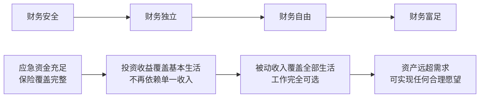
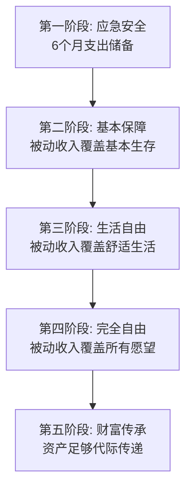

## 十一、被动收入与财务自由

### 1. 什么是财务自由

财务自由不是"有很多钱"，而是一个精确的、可量化的状态：**你的被动收入持续覆盖你的生活支出，你不再被迫为钱工作**。

这个定义包含三个关键要素：

- **被动收入**：不需要你持续投入时间精力就能产生的收入流
- **持续覆盖**：不是偶尔覆盖，而是稳定、长期、可预期地覆盖
- **不再被迫**：你仍然可以工作，但那是选择，不是生存的必要

很多人把财务自由等同于"赚够一个亿"，这是根本性的误解。一个月花5000元的人和一个月花50000元的人，财务自由的门槛完全不同。财务自由是一个**比率问题**，不是一个**绝对值问题**。

#### 1.1 财务自由的核心公式

```text
财务自由 = 被动收入 ≥ 生活支出
```

更精确的表述：

```text
月被动收入 ≥ 月固定支出 + 月变动支出 + 月均摊年度大额支出 + 安全余量(10-20%)
```

举个例子：你的月支出是8000元（房租3000+饮食2000+交通500+通讯200+日用800+娱乐500+其他1000），年度大额支出均摊每月约2000元（保险、旅行、礼物、医疗），安全余量15%即1500元。那么你每月需要的被动收入就是11500元。

#### 1.2 财务自由 vs 财务独立 vs 财务安全

很多人混淆这三个概念，它们是递进关系：



| 层级 | 定义 | 典型标志 | 被动收入要求 |
|------|------|----------|-------------|
| 财务安全 | 能应对突发事件 | 有6-12个月应急资金，保险齐全 | 无硬性要求 |
| 财务独立 | 不依赖单一雇主 | 多元收入来源，投资有正收益 | 覆盖基本支出的50%+ |
| 财务自由 | 工作完全可选 | 被动收入超过全部支出 | 覆盖全部支出的100%+ |
| 财务富足 | 资源远超需求 | 可以自由选择任何生活方式 | 远超支出，资产持续增长 |

### 2. 为什么被动收入是财务自由的核心引擎

#### 2.1 主动收入的天花板

主动收入的本质是**用时间换钱**。这个模式有三个根本性限制：

**时间上限**：每个人每天只有24小时，即使你每小时赚1000元，一天工作16小时，月收入也只有48万——这已经是极端情况，大多数人连这个数字的零头都达不到。更重要的是，时间是不可再生资源，一旦耗尽，收入归零。

**健康依赖**：主动收入完全依赖你的身体和精神状态。生病、倦怠、意外，任何一个因素都能让你的收入中断。2020年疫情期间，无数依赖主动收入的人一夜之间失去经济来源。

**线性增长**：主动收入基本是线性的——投入一小时赚一小时的钱。你很难同时打两份全职工作，但你可以同时拥有十个被动收入流。

#### 2.2 被动收入的复利效应

被动收入的本质是**用系统换钱**。一旦系统建立起来，它可以24小时运转，不受你的身体状态和时间投入限制。

最强大的力量是复利。假设你每月能投入5000元到一个年化8%的投资组合中：

| 年数 | 累计投入 | 资产总值 | 被动收入（按4%年提取） | 月均被动收入 |
|------|---------|---------|---------------------|-------------|
| 5年 | 30万 | 36.7万 | 1.47万/年 | 1,224元 |
| 10年 | 60万 | 91.5万 | 3.66万/年 | 3,050元 |
| 15年 | 90万 | 173万 | 6.92万/年 | 5,767元 |
| 20年 | 120万 | 294万 | 11.76万/年 | 9,800元 |
| 25年 | 150万 | 476万 | 19.04万/年 | 15,867元 |
| 30年 | 180万 | 745万 | 29.8万/年 | 24,833元 |

前15年你积累了90万本金，后15年你的资产增长了572万——**后15年的增长是前15年的8.5倍**。这就是复利的力量，也是为什么越早开始越重要的数学原因。

#### 2.3 被动收入的自由倍数

被动收入还有一个常被忽略的优势：**时间自由的倍增效应**。

一个月薪2万的人，每天工作10小时，时薪约91元。如果他通过投资获得每月2万的被动收入，这些收入是7×24小时产生的，实际时薪是20000÷720≈27.8元。看起来更低？

不对。关键区别在于：主动收入的2万需要你**亲自在场**，被动收入的2万**不需要你在场**。你同时拥有了2万收入和720小时的自由时间。这720小时你可以用来创造更多收入、陪伴家人、学习新技能、或者单纯享受生活。

### 3. 财务自由的量化计算框架

#### 3.1 经典4%法则

1998年，Trinity大学的三位教授发表了著名的"Trinity Study"，提出了4%安全提取率法则：**如果你每年从投资组合中提取不超过4%用于生活开支，这笔钱大概率可以支撑30年以上的退休生活**。

计算方法：

```text
财务自由所需资产 = 年支出 × 25
```

例如：年支出24万（月支出2万）→ 需要600万资产。

4%法则的前提假设：

- 投资组合为60%股票+40%债券的混合配置
- 每年根据通胀调整提取金额
- 在正常的市场环境下（不含极端情况）
- 覆盖30年的时间跨度

#### 3.2 4%法则的局限与修正

4%法则是一个很好的起点，但不是万能公式。实际应用中需要考虑以下修正因素：

**中国市场特殊性**：中国的通胀结构、投资工具、税收政策与美国不同。A股市场的波动性更大，债券收益率结构也不同。在中国实际应用时，建议将安全提取率调整为3-3.5%。

**提前退休修正**：如果你计划在35岁就实现财务自由，需要覆盖50年以上的生活，4%法则的成功率会下降。这种情况下建议使用3%甚至2.5%的安全提取率，对应需要年支出×33到×40的资产规模。

**保守修正计算**：

```text
保守财务自由目标 = 年支出 × 33（3%提取率）
激进财务自由目标 = 年支出 × 25（4%提取率）
```

#### 3.3 动态提取策略

实际操作中，固定比例提取并不明智。市场有涨有跌，动态调整提取率可以大幅提高资产的可持续性：

**备选策略一：按市值百分比提取**

每年提取当前投资组合市值的固定百分比（如3.5%），而非固定金额。市场下跌时少提一些，上涨时多提一些。这种策略的缺点是收入波动大。

**备选策略二：地板+天花板策略**

设定一个基础提取金额（地板）和一个上限金额（天花板）。市场好时提取不超过天花板，市场差时不低于地板。这个策略在收入稳定性和资产可持续性之间取得了较好的平衡。

**备选策略三：现金缓冲策略**

保留1-2年的生活支出作为现金缓冲。市场正常时从投资组合提取，市场大幅下跌时从现金缓冲中支出，避免在低点卖出资产。

#### 3.4 分阶段财务自由计算

财务自由不是一个非此即彼的开关，而是一个渐进过程。按阶段计算更务实：



| 阶段 | 被动收入目标 | 典型资产规模（月支出1万） | 实现年限参考 |
|------|-------------|-------------------------|-------------|
| 应急安全 | 6个月支出储备 | 6万 | 1-2年 |
| 基本保障 | 覆盖基本生存支出 | 100-150万 | 5-8年 |
| 生活自由 | 覆盖舒适生活支出 | 250-400万 | 10-15年 |
| 完全自由 | 覆盖所有合理支出 | 500-800万 | 15-25年 |
| 财富传承 | 资产持续增长远超消耗 | 1000万+ | 25年+ |

### 4. 被动收入的分类体系

#### 4.1 按资本类型分类

被动收入的来源可以归结为四种基本资本：

**金融资本驱动型**：用钱生钱。包括股息、利息、基金分红、债券票息等。门槛是有初始资金，优点是完全不需要时间投入，缺点是受市场波动影响。

**知识资本驱动型**：用脑力生钱。包括版税、课程收入、专利授权、软件授权等。门槛是前期大量时间和精力投入，优点是边际成本趋近于零，缺点是需要持续维护和更新。

**实物资本驱动型**：用资产生钱。包括房租、设备租赁、车辆租赁等。门槛是有实物资产，优点是相对稳定，缺点是需要管理和维护。

**数字资本驱动型**：用流量和数据生钱。包括广告收入、联盟营销、数字产品销售等。门槛是建立流量入口，优点是可无限扩展，缺点是初期变现慢。

#### 4.2 按投入阶段分类

| 类型 | 前期投入 | 持续维护 | 规模上限 | 风险等级 | 典型代表 |
|------|---------|---------|---------|---------|---------|
| 零维护型 | 一次性投入 | 几乎为零 | 中等 | 低-中 | 定期存款、国债、指数基金 |
| 低维护型 | 建设期投入 | 季度/年度维护 | 较高 | 中 | 出租房产、版权收入 |
| 中维护型 | 持续投入1-2年 | 每周几小时 | 高 | 中-高 | 在线课程、自动化电商 |
| 高维护型 | 持续投入3年+ | 每天几小时 | 极高 | 高 | 自媒体品牌、SaaS产品 |

#### 4.3 按实现难度和时间线分类

**短期可实现（1-3个月）**：高息储蓄账户、货币基金、国债逆回购。门槛极低但收益率也低，适合入门和存放应急资金。

**中期可实现（3-12个月）**：指数基金定投、股息组合、债券组合、简易出租物业。需要一定本金和基础知识，是大多数人财务自由路径的核心。

**长期可实现（1-3年）**：在线课程/电子书、自动化联盟营销网站、租赁物业组合。需要前期大量投入，但建成后回报可观。

**超长期可实现（3年+）**：软件产品/SaaS、品牌/知识产权矩阵、大规模投资组合。需要持续投入和专业能力，但上限极高。

### 5. 构建被动收入组合的实战策略

#### 5.1 核心-卫星策略

借鉴投资组合理论，被动收入也应该采用"核心-卫星"结构：

- **核心层（60-70%）**：低风险、稳定的被动收入来源。指数基金股息、债券利息、定期存款利息、成熟出租物业的租金。这部分提供"底线保障"，即使其他收入消失也能维持基本生活。
- **卫星层（20-30%）**：中等风险、中等回报的来源。股息股票组合、REITs（房地产信托基金）、版权收入、课程收入。这部分提供增长潜力。
- **探索层（5-10%）**：高风险、高回报的尝试。创业项目、新兴领域投资、个人品牌变现。这部分可以失败，不影响整体财务安全。

#### 5.2 时间线规划模板

一个从零开始、以10年实现财务自由为目标的分阶段规划：

**第1-2年：地基阶段**

- 建立6个月应急资金（存入货币基金）
- 清除高息负债（信用卡、消费贷）
- 开始指数基金定投（月收入的20-30%）
- 学习基础投资知识，不急于做复杂操作
- 目标被动收入：500-1000元/月（应急资金利息+初期投资分红）

**第3-5年：增长阶段**

- 持续加大投资比例（月收入的30-40%）
- 配置股息型ETF或高分红股票组合
- 开始第一个知识产品项目（电子书、课程、付费专栏）
- 如果有余力，开始研究出租物业
- 目标被动收入：3000-8000元/月

**第6-8年：加速阶段**

- 知识产品矩阵扩展（多门课程、多本书、多个平台）
- 投资组合再平衡，增加债券和REITs比例
- 考虑小规模出租物业投资
- 自动化所有可以自动化的收入流
- 目标被动收入：8000-20000元/月

**第9-10年：收割阶段**

- 评估是否达到财务自由标准
- 优化税务结构（合法节税）
- 建立更稳健的动态提取策略
- 开始考虑财富传承规划
- 目标被动收入：覆盖全部生活支出

#### 5.3 常见被动收入渠道的实操对比

| 渠道 | 启动资金 | 技术门槛 | 时间投入 | 预期年化 | 稳定性 | 最适合人群 |
|------|---------|---------|---------|---------|--------|-----------|
| 货币基金 | 无门槛 | 极低 | 0 | 1.5-2.5% | 极高 | 所有人（入门） |
| 指数基金定投 | 100元起 | 低 | 每月1小时 | 6-10% | 高 | 有稳定收入的上班族 |
| 股息组合 | 5万+ | 中 | 每季4小时 | 3-6%+增值 | 中-高 | 有投资经验的人 |
| REITs | 1000元起 | 中 | 每月2小时 | 5-8% | 中 | 想参与房地产但资金有限 |
| 出租物业 | 30万+ | 中 | 每月4-8小时 | 4-8%+增值 | 中-高 | 有首付能力且愿意管理 |
| 电子书/课程 | 几乎为零 | 中 | 前期100-500小时 | 无限 | 中 | 有专业技能的人 |
| 联盟营销网站 | 500-2000元 | 中-高 | 前期每天2小时 | 无限 | 中 | 有SEO/内容能力的人 |
| 软件/SaaS | 0-5万 | 高 | 前期每天4小时+ | 无限 | 中 | 程序员/产品经理 |
| 自媒体矩阵 | 几乎为零 | 中 | 每天1-2小时 | 无限 | 低-中 | 有表达欲的人 |

### 6. 被动收入的认知陷阱与纠偏

#### 6.1 "被动收入不需要任何工作"

这是最危险的误解。被动收入不是"不劳而获"，而是"**前期投入，后期收获**"。每一笔被动收入背后都有前期的投入——可能是资金投入（投资）、时间投入（内容创作）、精力投入（系统搭建）。

正确认知：被动收入的"被动"指的是**收入产生时不需要你亲自在场**，而不是**从头到尾都不需要你付出**。把它理解为"杠杆化收入"更准确——你用前期投入撬动后期的持续回报。

#### 6.2 "找到一个万能的被动收入方法"

不存在适合所有人的完美方法。你的最佳被动收入组合取决于：

- **你当前的资金量**：有钱可以走投资路线，没钱只能走时间和技能路线
- **你的专业技能**：程序员适合做软件产品，教师适合做课程，写手适合做内容
- **你的风险承受能力**：保守型走基金路线，激进型可以尝试创业
- **你的时间窗口**：急于实现需要更激进的策略，时间充裕可以走稳健路线

#### 6.3 "被动收入越多条渠道越好"

渠道分散到一定程度后，收益会递减，管理成本会上升。对于大多数人来说，**2-4个高质量的被动收入来源**是最优数量。每增加一条渠道，你需要确保有足够的精力维护它，否则它会从"被动"变成"半死不活"。

#### 6.4 "追求高收益的被动收入"

承诺年化15%以上的"被动收入项目"，99%是骗局或高风险投机。合法的、可持续的被动收入，大部分年化在2-10%之间。那些在网上晒"被动收入月入10万"的，要么是极少数幸存者偏差，要么是卖课的营销话术。

正确认知：真正的财务自由不是靠某一笔暴利，而是靠**持续、稳定、多元化的现金流**慢慢积累。

#### 6.5 "先享受生活，以后再考虑被动收入"

复利的力量随时间指数增长。晚开始5年，你可能需要多工作10年才能达到同样的目标。一个25岁开始每月投入3000元的人，和一个35岁开始每月投入3000元的人，在60岁时的资产差距可能超过200万。

### 7. 财务自由的心理维度

#### 7.1 丰裕心态 vs 匮乏心态

财务自由不仅是数字游戏，更是心理状态的转变。

**匮乏心态**的表现：总担心钱不够、害怕消费、把所有精力放在省钱上、看到别人成功会嫉妒、认为赚钱是零和博弈。

**丰裕心态**的表现：相信可以通过创造价值获得更多、愿意投资自己、把注意力放在增加收入而非压缩支出上、为他人的成功感到高兴。

从匮乏心态到丰裕心态的转变，往往比任何投资策略都更能推动你走向财务自由。

#### 7.2 消费主义的陷阱

现代消费主义的核心逻辑是：**通过消费来定义你是谁**。开什么车、住什么小区、穿什么品牌、去哪里旅行——这些消费选择被赋予了远超其实用价值的社会意义。

打破这个逻辑的关键认知：**资产让你自由，负债让你受困**。每一笔不必要的消费，都是你财务自由路上的一块绊脚石。不是说不能消费，而是要区分"提升生活质量的消费"和"满足虚荣心的消费"。

一个实用的检验方法：如果这件东西没人知道你拥有它，你还会买吗？

#### 7.3 财务自由后的人生意义

很多实现了财务自由的人会经历一个"空虚期"——当生存压力消失后，他们会问：然后呢？

提前思考这个问题很重要。财务自由不是目的，它是**实现人生目的的工具**。在追求财务自由的过程中，就应该同时思考：自由之后你想做什么？你想成为什么样的人？你想对世界产生什么影响？

没有人生目标的财务自由，可能反而比有目标的忙碌生活更令人痛苦。

### 8. 财务自由的系统化管理

#### 8.1 财务仪表盘

实现财务自由需要一个清晰的监控系统。建议追踪以下核心指标：

| 指标 | 计算方法 | 更新频率 | 目标方向 |
|------|---------|---------|---------|
| 净资产 | 总资产 - 总负债 | 月度 | 持续增长 |
| 储蓄率 | (收入-支出)/收入 | 月度 | >30% |
| 被动收入/支出比 | 月被动收入/月总支出 | 月度 | 趋近1.0并超过 |
| 投资组合年化收益 | 加权计算 | 季度 | 6-10% |
| 负债/资产比 | 总负债/总资产 | 季度 | <30% |
| 应急资金月数 | 应急资金/月支出 | 季度 | >6个月 |
| 财务自由指数 | 被动收入/财务自由线 | 年度 | 趋近1.0并超过 |

#### 8.2 自动化体系

被动收入的管理本身也应该是被动的：

1. **自动定投**：设置每月工资日自动扣款买入基金
2. **自动再投资**：股息和分红自动再投资，不落入口袋
3. **自动记账**：使用记账软件自动归类所有收支
4. **自动预警**：设置指标阈值，偏离时自动提醒
5. **季度复盘**：每季度花2小时审视整体财务状况，调整策略

#### 8.3 风险管理矩阵

| 风险类型 | 描述 | 应对策略 |
|---------|------|---------|
| 市场风险 | 投资组合市值下跌 | 分散配置+动态再平衡+现金缓冲 |
| 流动性风险 | 资产无法快速变现 | 保持30%资产在高流动性工具中 |
| 通胀风险 | 购买力被侵蚀 | 配置抗通胀资产（股票、REITs、TIPS） |
| 政策风险 | 税收/法规变化 | 关注政策动向，提前调整结构 |
| 集中风险 | 单一收入来源依赖 | 构建2-4个独立的被动收入流 |
| 行为风险 | 恐慌抛售或贪婪加码 | 制定规则并严格执行，避免情绪决策 |

### 9. 不同人生阶段的被动收入策略

#### 9.1 20-30岁：播种期

**核心优势**：时间充裕，复利效应最大，试错成本低
**核心策略**：高储蓄率+指数基金定投+开发第一个知识产品
**推荐配置**：80%指数基金 + 10%学习投入 + 10%尝试新收入渠道
**关键动作**：建立自动定投习惯，控制生活成本增速低于收入增速

#### 9.2 30-40岁：生长期

**核心优势**：收入进入上升期，有一定资金积累
**核心策略**：加大投资规模+构建多元被动收入组合
**推荐配置**：50%指数/股票基金 + 20%REITs/债券 + 20%知识/数字产品 + 10%探索
**关键动作**：利用职业积累创建可变现的知识资产

#### 9.3 40-50岁：收获期

**核心优势**：资金规模最大，经验丰富，判断力成熟
**核心策略**：优化现有组合+降低风险+增加现金流资产比例
**推荐配置**：40%指数/股票基金 + 30%债券/REITs + 20%现金流资产 + 10%储备
**关键动作**：逐步将增长型资产转换为现金流型资产

#### 9.4 50岁以上：守护期

**核心优势**：接近或已实现财务自由
**核心策略**：保本为主+稳定现金流+财富传承
**推荐配置**：30%股票 + 40%债券/固收 + 20%现金流资产 + 10%现金
**关键动作**：制定提取策略，规划遗产和税务

### 10. 从理论到行动：你的下一步

读完这一节，最重要的不是记住所有公式和策略，而是**今天就开始行动**。以下是三个立即可执行的行动：

**行动一：计算你的财务自由数字**。用月支出×300（保守）或×250（标准）得出你的目标资产数。把它写下来，贴在你每天能看到的地方。

**行动二：开一个基金账户，设置自动定投**。选择一只宽基指数基金（如沪深300ETF或中证500ETF），设置每月发薪日自动扣款。金额不重要，重要的是**开始**。

**行动三：列出你的技能和知识清单**。思考哪些技能可以通过课程、电子书、付费咨询等方式转化为被动收入。不需要现在就开始做，先建立意识。

财务自由不是一个遥不可及的梦想，而是一个可以拆解为具体步骤、逐月推进的系统工程。关键在于：理解原理、制定计划、立即行动、持续优化。
