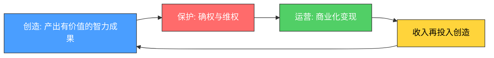

# 第22章 知识产权变现

## 为什么你应该读这一章？

先看一组数据：

- 2023年中国发明专利授权量达92.1万件，连续多年位居全球第一，但个人发明人的专利转化率不足5%。
- 中国知识付费市场规模已突破1800亿元，年均增速超过25%，但大多数内容创作者月收入不到5000元。
- 全球品牌授权市场规模超过3400亿美元，头部10%的品牌占据了超过80%的市场份额。

这意味着什么？**大多数人并非缺少创造力，而是缺少将创造力转化为持续收入的系统方法。** 你可能写过文章、录过视频、设计过Logo、甚至想过申请专利——但这些智力成果要么停留在草稿箱里，要么发布后就石沉大海，从未真正变成能为你"打工"的资产。

知识产权变现的本质，不是让你去当发明家或者律师，而是让你掌握一套**把脑子里的知识和创意变成可交易、可增值、可持续收费的资产**的方法论。这套方法论适用于程序员、设计师、写作者、教师、产品经理、自媒体人——任何以"脑力"为核心产出的人。

### 本章解决的核心问题

| 问题 | 你将获得的答案 |
|------|----------------|
| 我有很多想法，但不知道哪个值得保护 | 四类知识产权的筛选框架与价值评估方法 |
| 想申请专利/注册商标，但流程太复杂 | 从检索到拿证的完整操作手册，含费用清单和时间线 |
| 做了课程/写了书，卖不动 | 知识付费产品的定价逻辑、平台选择策略和推广方法 |
| 有品牌但不会变现 | 品牌授权的三种模式、合同要点和定价公式 |
| 担心被侵权或被起诉 | 知识产权风险防护体系与维权实操指南 |
| 想构建长期的IP资产 | 从单一IP到IP矩阵的商业化升级路径 |

### 知识产权变现的底层逻辑

在进入具体操作之前，你需要先理解一个核心公式：

```text
知识产权变现 = 创造（Creation）× 保护（Protection）× 运营（Operation）
```

三者是乘法关系，缺一不可：

- **创造**是源头——没有有价值的智力成果，后面一切都是空谈。但"有价值"三个字很关键：不是所有创意都值得保护，必须对准市场需求。
- **保护**是杠杆——通过法律手段获得独占权，你才能排除竞争、收取授权费、提起维权。没有保护的创意，就像没有围墙的果园，路人随手就摘。
- **运营**是放大器——同样的专利，自己实施可能年入10万，授权给10家企业可能年入100万，组合打包出售可能年入500万。运营能力决定了变现的上限。

三者的关系可以用下图理解：



这个循环每转一圈，你的知识资产库就更厚一层。这也是为什么说知识产权是"时间的复利资产"——今天保护的一个专利、注册的一个商标、发布的一门课程，可能在未来十年持续为你创造收入。

### 知识产权的经济学特征

理解以下三个特征，能帮你判断哪些知识产权值得投入：

**1. 高固定成本、低边际成本**

创造一项知识产权的成本是固定的（研发一个专利可能花10万），但一旦创造完成，多授权给一家企业的边际成本几乎为零。这意味着授权规模越大，利润率越高。一门课程录制花了100小时，卖给1个人和卖给10000个人，制作成本完全相同。

**2. 独占性带来的定价权**

法律赋予的排他性使用权意味着你可以定价，而不只是接受市场价格。普通商品竞争激烈、利润趋零，但有专利保护的产品可以享受垄断利润——直到专利过期。

**3. 网络效应与品牌溢价**

某些知识产权（特别是品牌和标准必要专利）具有网络效应：使用的人越多，价值越大。iPhone的商标、5G的必要专利、"得到"的品牌——都是越用越值钱的例子。

---

## 本章完整知识地图

本章由三大板块组成，按"理论→方法→实战"的顺序层层递进：

```mermaid
graph TD
    ROOT[第22章 知识产权变现] --> T[理论基础]
    ROOT --> C[核心技巧]
    ROOT --> A[实战案例]

    T --> T1[知识产权四大类型]
    T --> T2[经济学分析]
    T --> T3[变现底层逻辑]
    T --> T4[知识付费经济学]
    T --> T5[进阶策略]
    T --> T6[商业化运营体系]
    T --> T7[常见误区]

    C --> C1[专利申请与变现]
    C --> C2[商标注册与品牌授权]
    C --> C3[版权保护与内容授权]
    C --> C4[知识付费产品设计]
    C --> C5[课程制作全流程]
    C --> C6[知识付费平台选择]
    C --> C7[IP商业化路径]
    C --> C8[IP风险管理]

    A --> A1[专利授权: 技术→百万收入]
    A --> A2[商标授权: 个人品牌之路]
    A --> A3[知识付费: 课程从0到1]
    A --> A4[版权分发: 多平台策略]
    A --> A5[IP品牌化: 小众到商业]
    A --> A6[软著商业化]
    A --> A7[音乐版权变现]
    A --> A8[字体版权变现]
    A --> A9[自媒体IP全链条]

    style ROOT fill:#ff6b6b,stroke:#333,color:#fff
    style T fill:#4a9eff,stroke:#333,color:#fff
    style C fill:#51cf66,stroke:#333,color:#fff
    style A fill:#ffd43b,stroke:#333,color:#000
```



### 各板块定位说明

| 板块 | 文件数 | 核心价值 | 阅读时间（估） |
|------|--------|----------|---------------|
| 理论基础 | 7篇 | 建立完整的知识产权认知框架，理解"为什么" | 2-3小时 |
| 核心技巧 | 10篇 | 掌握每种变现方式的实操方法，知道"怎么做" | 3-4小时 |
| 实战案例 | 11篇 | 通过真实案例理解理论和技巧的应用场景 | 2-3小时 |
| 顶层模块 | 4篇 | 常见误区、练习方法、本章小结、深度拓展 | 1-2小时 |

---

## 分层阅读指南

不同基础的读者不需要按同一顺序阅读。以下是三条推荐路径：

### 路径一：零基础入门（"我想了解知识产权变现"）

适合：没有知识产权经验，想看看这条路是否适合自己。

```text
1. 本文件（你正在读的） → 建立全局认知
2. 理论基础/01-知识产权的四大类型 → 搞清楚"什么是知识产权"
3. 理论基础/03-知识产权变现的底层逻辑 → 理解变现的核心公式
4. 实战案例/03-知识付费课程的从0到1 → 看一个完整案例
5. 核心技巧/04-知识付费产品设计技巧 → 选最容易上手的方向
6. 顶层/05-练习方法 → 动手做第一个练习
```

预计投入：4-6小时。完成后你应该能判断自己是否适合走这条路，以及最适合从哪个方向切入。

### 路径二：有基础想变现（"我有作品/技术/品牌，想赚钱"）

适合：已经有知识产权（文章、软件、品牌、技术方案），但不知道怎么变现。

```text
1. 本文件 → 快速回顾框架
2. 理论基础/03-知识产权变现的底层逻辑 → 补齐变现思维
3. 核心技巧/01-专利申请与变现技巧（如有技术）
   核心技巧/03-版权保护与内容授权技巧（如有作品）
   核心技巧/02-商标注册与品牌授权技巧（如有品牌）
4. 核心技巧/07-IP商业化路径 → 规划长期路线
5. 实战案例（选择与你方向匹配的2-3篇） → 对照参考
6. 顶层/04-常见误区 → 避坑
```

预计投入：3-5小时。完成后你应该有一份可执行的变现计划。

### 路径三：深度研修（"我要成为知识产权运营专家"）

适合：想系统掌握知识产权变现，或者为他人/企业提供知识产权咨询服务。

```text
全部按顺序通读，重点关注：
- 理论基础/02-经济学分析 → 建立估值能力
- 理论基础/05-进阶策略 + 理论基础/07-商业化运营体系 → 高阶方法论
- 核心技巧/08-IP风险管理 → 风控能力
- 全部实战案例 → 积累案例库
- 顶层/07-深度拓展 → 全球视野
```

预计投入：10-15小时。完成后你应该具备独立进行知识产权商业化运营的能力。

---

## 四类知识产权速查对照表

在深入各板块之前，先建立一个快速对照框架：

| 维度 | 专利权 | 商标权 | 版权（著作权） | 商业秘密 |
|------|--------|--------|----------------|----------|
| **保护对象** | 技术方案、产品设计 | 品牌标识、商业信誉 | 文学、艺术、科学作品 | 技术信息、经营信息 |
| **取得方式** | 申请审批 | 申请注册 | 自动产生（创作完成即有） | 自动产生（满足三要件） |
| **保护期限** | 发明20年/实用新型10年/外观15年 | 10年（可无限续展） | 作者终身+死后50年 | 无期限（保密即保护） |
| **申请费用** | 发明950元起/实用新型500元 | 300元/类（网上） | 登记费100-300元 | 无需申请 |
| **审批周期** | 3-36个月 | 6-9个月 | 登记30-60工作日 | 无需审批 |
| **变现方式** | 实施、许可、转让、质押、诉讼 | 品牌授权、商标转让 | 授权、转让、产品化 | 自主实施（不公开） |
| **适合人群** | 技术研发人员 | 品牌经营者、创业者 | 内容创作者、艺术家 | 企业经营者 |
| **入门难度** | 较高（需技术撰写能力） | 中等（流程标准化） | 低（自动获得） | 低（但需建立保密体系） |
| **变现天花板** | 极高（标准必要专利年入数十亿） | 极高（头部品牌授权百亿级） | 高（爆款内容年入千万级） | 高（但无法直接交易） |

---

## 本章核心观点预览

读完本章，你需要内化以下七个核心观点：

**观点一：知识产权不是"聪明人的专利"。** 它不要求你发明划时代的技术。一个改进型的实用新型专利、一个有辨识度的商标、一篇系统整理的文章，都是有价值的知识产权。关键不在于"多聪明"，而在于"多系统"。

**观点二：保护比创造更重要。** 很多人花大量时间创造，却舍不得花几百块钱注册版权或申请专利。没有保护的创造，等于替竞争对手做了免费的市场调研。

**观点三：知识付费卖的不是知识，是效率。** 用户买的不是"信息"（信息到处都是），而是"筛选+结构化+可执行"的效率。你的课程不是"教他们知道什么"，而是"帮他们省多少时间"。

**观点四：定价要基于价值，不是成本。** 一门课程录制花了100小时，但它的定价应该基于"用户学了之后能赚/省多少钱"，而不是"我花了多少时间"。

**观点五：平台是放大器，不是救命稻草。** 在好的平台上发布能获得更多曝光，但平台不会替你做内容、做定位、做运营。先把内容打磨好，再选平台。

**观点六：IP的终极形态是"品牌"。** 单个专利会过期，单篇文章会被遗忘，但品牌可以持续增值。所有的知识产权积累，最终都应该指向品牌资产的构建。

**观点七：变现是一个系统，不是一个动作。** 创造→保护→运营→再创造，这是一个持续运转的飞轮。第一次变现最难，但只要飞轮转起来，后面的加速度会越来越大。

---

## 学习目标清单

完成本章全部内容后，你应该能够：

- [ ] 准确区分专利、商标、版权、商业秘密的保护范围和适用场景
- [ ] 独立完成一项专利检索，判断发明的新颖性
- [ ] 根据自身情况选择合适的专利类型并启动申请流程
- [ ] 设计一套完整的商标注册策略（核心类别+关联类别+防御类别）
- [ ] 为自己的内容作品建立版权保护体系（自动保护+主动登记+侵权监控）
- [ ] 设计一门完整的在线课程（选题→大纲→录制→上架→推广）
- [ ] 对比主流知识付费平台的优劣，选择最适合自己阶段的平台
- [ ] 制定一份从单一IP到IP矩阵的商业化路径规划
- [ ] 识别并规避知识产权变现过程中的常见误区
- [ ] 处理基本的知识产权侵权纠纷（取证、发函、投诉）

---

## 本章心法

> **知识产权是时间的"复利资产"。** 你今天申请的一个专利、注册的一个商标、发布的一门课程，可能在未来十年持续为你创造收入。越早开始积累，未来的回报越大。
>
> 但更重要的是：**不要等到"完美"才开始。** 一个申请了保护的"60分专利"，远比一个"还在构思中的100分创意"更有价值。先完成，再完美；先保护，再优化；先变现，再扩张。

---
