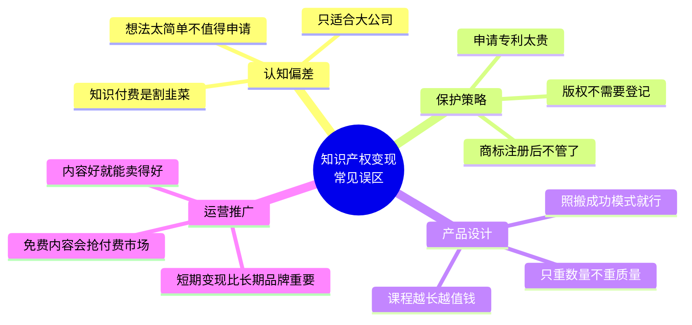
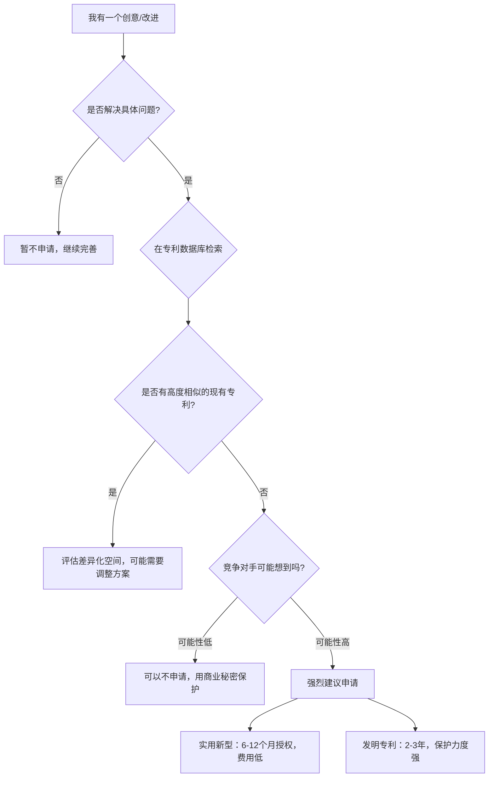
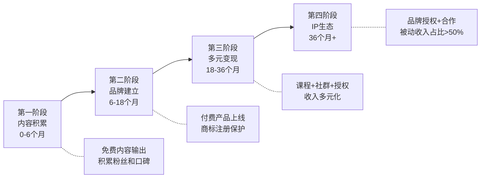
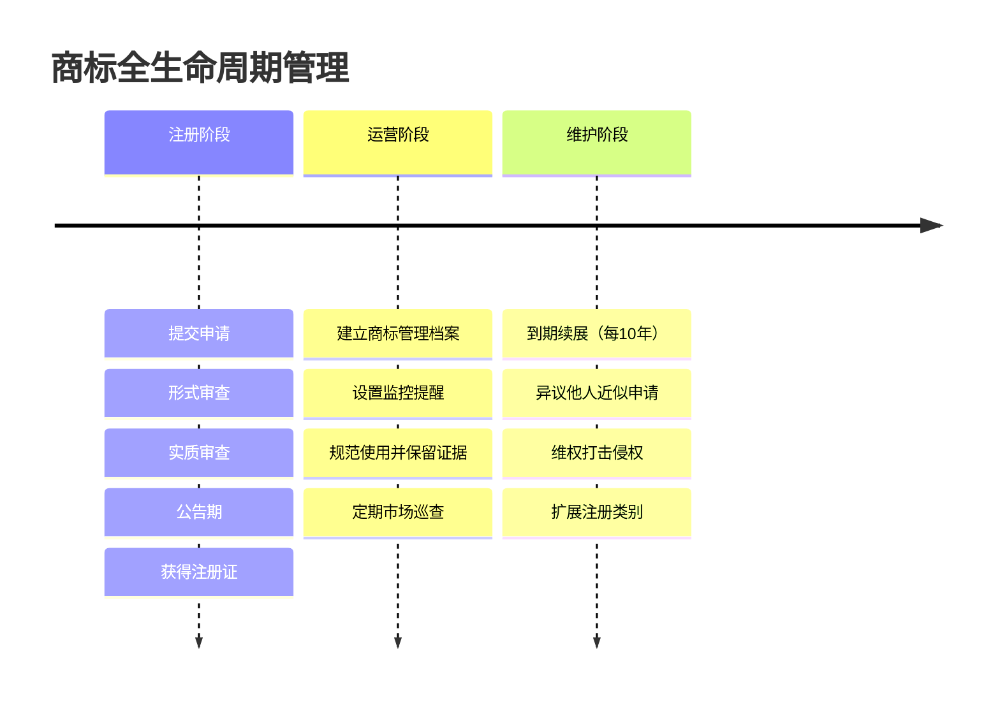
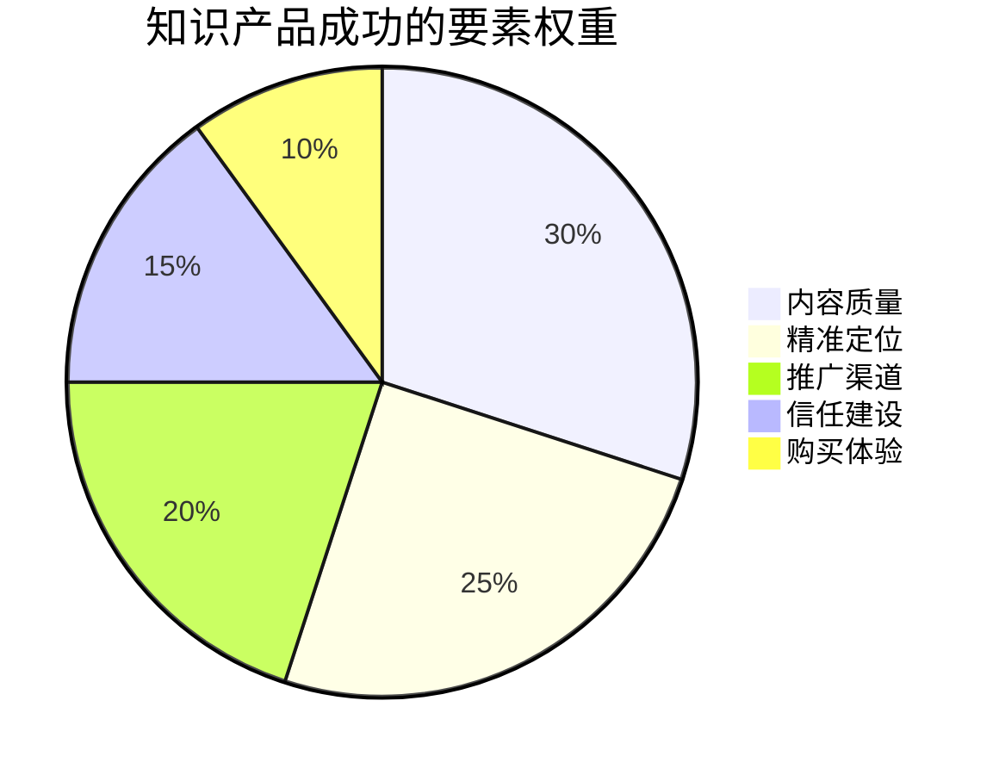
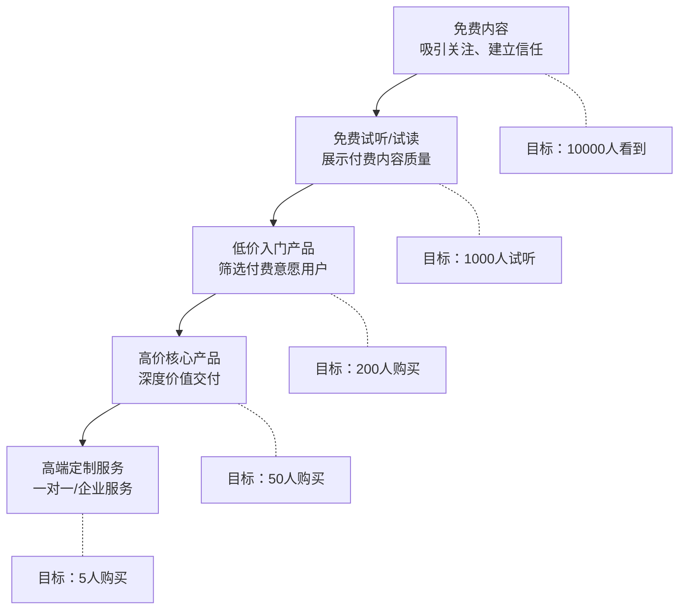

# 第22章 知识产权变现 — 常见误区

> 知识产权变现的路上，真正绊倒你的往往不是外部竞争，而是自己头脑里的错误认知。本章系统梳理12个最常见的误区，从专利申请、商标管理、版权保护到知识付费定价、课程设计、推广运营，逐一拆解真相，帮你避开那些前人踩过的坑。

---

## 误区分类总览

知识产权变现的误区大致可以分为四类：**认知偏差类**（对知识产权本质的误解）、**保护策略类**（在申请和维护环节的错误操作）、**产品设计类**（在内容制作和定价上的误判）、**运营推广类**（在商业执行中的盲区）。



---

## 第一类：认知偏差类误区

### 误区一："我的想法太简单，不值得申请专利"

#### 误区表现

很多发明人觉得自己的技术方案"太简单了"、"没什么了不起"，认为不值得申请专利。结果被竞争对手抢先申请，后悔莫及。据统计，中国每年有超过15%的专利纠纷案件，源头正是发明人低估了自己创意的价值。

#### 真相：专利保护的是新颖性，不是复杂度

专利法的核心要件是**新颖性、创造性、实用性**，与"复杂度"无关。很多改变世界的发明都源于极其简单的创意：

| 发明 | 复杂度 | 商业价值 | 核心原理 |
|------|--------|----------|----------|
| 尼龙搭扣（Velcro） | 极低 | 全球年收入超20亿美元 | 模仿牛蒡刺的钩环结构 |
| 回形针 | 极低 | 全球年消耗超200亿枚 | 金属丝弯折固定纸张 |
| 便利贴 | 低 | 3M公司年销售额超10亿美元 | "失败"的强力胶变成可重复粘贴 |
| 自拍杆 | 低 | 2014年全球热销单品 | 伸缩杆+手机夹持结构 |
| 防溢锅盖 | 极低 | 专利授权费数百万 | 锅盖凸起收集冷凝水回流 |

#### 判断你的创意是否值得申请专利的三个关键问题

1. **问题解决性**：你的方案是否解决了现有技术中的某个具体问题？
2. **替代可能性**：竞争对手是否很可能独立想到类似方法？
3. **战略影响度**：如果竞争对手拥有这个专利，对你的业务是否有实质影响？

三个问题中只要有两个回答"是"，就值得申请。

#### 实操建议

如果你不确定自己的创意是否值得申请专利，可以按以下流程评估：



**专利检索工具推荐**：
- 国家知识产权局专利检索系统（免费）：https://pss-system.cponline.cnipa.gov.cn/
- Google Patents（免费，覆盖全球）：https://patents.google.com/
- 腾讯专利检索（免费，中文友好）：https://patent.qq.com/

---

### 误区二："知识产权变现只适合大公司"

#### 误区表现

有些人认为知识产权变现是大公司的事情，个人创业者没有能力也没有资源进行知识产权运营。这种想法把"知识产权变现"等同于"专利诉讼"或"技术授权"，忽略了大量适合个人的变现路径。

#### 真相：个人知识产权变现的路径比你想象的多

| 知识产权类型 | 个人可操作的变现方式 | 启动门槛 | 典型月收入范围 |
|-------------|---------------------|----------|---------------|
| 版权 | 电子书、付费专栏、内容授权 | 极低 | 1千-10万元 |
| 商标 | 个人品牌、社群会员、品牌授权 | 低 | 2千-20万元 |
| 软件著作权 | 独立软件、SaaS、插件工具 | 中等 | 3千-50万元 |
| 专利 | 专利授权、技术入股、防御性布局 | 较高 | 5千-100万元 |
| 数据库权 | 数据产品、行业报告、API服务 | 中等 | 2千-30万元 |

#### 个人IP变现的四个阶段



**真实案例**：国内独立开发者阮一峰通过技术博客（版权内容）积累影响力，逐步发展出付费专栏、出版物、技术顾问等多元变现渠道。类似路径的个人创作者在掘金、知乎、B站等平台数以万计，年收入从几万到几百万不等。关键不是"规模大不大"，而是**你是否在某个细分领域建立了专业壁垒**。

---

### 误区三："知识付费就是割韭菜"

#### 误区表现

由于市场上确实存在一些低质量的知识付费产品——夸大宣传、内容注水、售后缺失——有些人对整个知识付费行业产生了偏见，认为知识付费就是"割韭菜"。这种认知偏差既阻碍了有才华的人进入市场，也让潜在用户错过了真正有价值的学习资源。

#### 真相：模式无罪，执行决定价值

知识付费的本质是**将隐性知识显性化、将碎片信息系统化**的商业行为。从经济学角度看，它解决了信息不对称问题，降低了学习者的搜索成本和试错成本。

**好的知识付费产品为用户创造的四类价值**：

1. **时间价值**：帮你节省自己摸索的时间。一个行业老手用10小时整理的体系化内容，可能帮你节省100小时的试错。
2. **认知价值**：提供你靠自己难以获得的视角和框架。比如行业内部的运作逻辑、成功者的思维模型。
3. **方法价值**：给出具体可执行的步骤和工具，而不只是"启发式"的空洞观点。
4. **社群价值**：连接同频的人，提供交流和合作的机会。

#### 如何做一个不割韭菜的知识付费产品

**创作者自检清单**：

| 维度 | 不割韭菜的做法 | 割韭菜的特征 |
|------|---------------|-------------|
| 内容质量 | 有真实实战经验支撑 | 纯理论搬运、无实操验证 |
| 信息密度 | 干货率>70%，每句话都有信息量 | 废话注水，10分钟内容拉到1小时 |
| 定价策略 | 价格与内容价值匹配 | 虚标原价再打折，靠焦虑感销售 |
| 交付标准 | 有明确的大纲和学习路径 | 无结构，想到哪讲到哪 |
| 售后承诺 | 提供答疑、更新、退款保障 | 卖完就跑，售后消失 |
| 营销方式 | 展示真实成果和用户评价 | 夸大收益、伪造案例、饥饿营销 |

**用户识别好产品的五个信号**：

1. **讲师有可验证的实战成果**：不是"我教你怎么赚钱"，而是"我通过X方法在Y领域做到了Z成果"。
2. **有免费试听/试读内容**：敢于让用户先体验再付费，说明对内容有信心。
3. **课程结构清晰透明**：大纲、时长、目标受众一目了然。
4. **用户评价真实多样**：不是清一色好评，而是有真实的改进建议和不同角度的反馈。
5. **有合理的退款政策**：7天无理由退款或"不满意可退"是基本诚意。

---

## 第二类：保护策略类误区

### 误区四："商标注册了就万事大吉"

#### 误区表现

有些人注册了商标后就不管了，不监控市场、不维权、不续展，结果商标被侵权、被撤销、被淡化。商标注册只是万里长征的第一步，后续的品牌保护才是真正的持久战。

#### 真相：商标是需要持续经营的资产

商标的生命力取决于持续使用和主动保护。以下是商标注册后必须做的五件事：

**1. 商标监控（注册后立即开始）**

定期查看是否有近似商标被他人申请。中国商标公告期为3个月，在此期间可以提出异议。如果错过异议期，后续的无效宣告程序成本更高、成功率更低。

监控方式：
- 国家知识产权局商标公告系统（免费手动查询）
- 专业商标监控服务（如权大师、标库网，年费500-2000元）
- 设置关键词提醒（Google Alerts、百度监控等）

**2. 规范使用（日常持续）**

- 注册商标连续3年不使用，任何人可以申请撤销（"撤三"制度）
- 使用时必须与注册图样一致，不能随意更改字体、颜色、比例
- 保留使用证据：发票、合同、产品照片、广告投放记录、媒体报道

**3. 及时续展（到期前12个月）**

商标有效期为10年，到期前12个月内需要办理续展。如果错过了，还有6个月的宽展期，但需要缴纳额外费用。超过宽展期未续展，商标将被注销。

**4. 主动维权（发现侵权时立即行动）**

发现侵权行为时的处理优先级：
- 平台投诉（电商/社交媒体，最快，1-7天处理）
- 行政投诉（市场监管局，成本低，适合批量处理）
- 律师函警告（中等威慑，适合明确侵权方）
- 民事诉讼（最终手段，周期6-18个月，成本最高）

**5. 品牌资产化（长期战略）**

持续投入品牌建设，让商标从"法律符号"变成"商业资产"。品牌价值越高，商标的防御力和溢价能力越强。



---

### 误区五："版权自动产生，不需要登记"

#### 误区表现

有人认为中国《著作权法》规定作品自创作完成即享有著作权，所以不需要进行版权登记。这句话在法律上完全正确，但在实践中却是一个危险的认知陷阱。

#### 真相：版权登记是"低成本高回报"的保护策略

版权确实自动产生，但**"有版权"和"能证明你有版权"是两回事**。

**版权登记在实际操作中的四大价值**：

| 价值维度 | 具体作用 | 不登记的后果 |
|----------|---------|-------------|
| 维权举证 | 登记证书是诉讼中最直接的权属证据 | 需要提供创作过程的完整证据链，举证难度大增 |
| 交易凭证 | 版权转让或许可交易的基础文件 | 交易对方缺乏信任基础，交易成本增加 |
| 平台要求 | 很多内容平台要求提供版权证明 | 无法在某些平台开设付费内容 |
| 威慑效果 | 登记记录对潜在侵权者有心理威慑 | 侵权者认为你"没有准备"，更敢侵权 |

**版权登记的成本和流程**：

- **费用**：100-300元/件（中国版权保护中心）
- **周期**：30-60个工作日（加急可缩短到10-15个工作日）
- **方式**：线上提交（中国版权保护中心官网）或委托代理
- **所需材料**：身份证明、作品样本、创作说明书

**哪些作品最应该优先登记**：

1. **准备授权或转让的作品**：课程内容、设计模板、软件代码
2. **容易被抄袭的作品**：原创设计图、教学课件、文案模板
3. **商业价值较高的作品**：品牌视觉系统、核心代码库、专业数据库
4. **需要在平台变现的作品**：电子书、在线课程、付费专栏

**进阶技巧：区块链存证作为补充**

除了传统版权登记，还可以利用区块链存证平台（如蚂蚁链版权、百度超级链）进行即时存证。区块链存证的优势是即时生效、成本极低（几元/件），但法律效力弱于官方登记。建议将区块链存证作为日常保护手段，版权登记用于高价值作品。

---

### 误区六："申请专利太贵了，我负担不起"

#### 误区表现

有些人一听到"专利申请"就想到高额的代理费和官费，觉得这不是个人能承受的事情。特别是看到发明专利代理费动辄数千元，就直接放弃了。

#### 真相：中国有完善的费用减免政策，个人申请专利的成本远低于你的想象

**官费减免政策详解**：

| 费用类型 | 正常费用 | 减免后（85%减免） | 减免后（70%减免） |
|----------|---------|-----------------|-----------------|
| 发明专利申请费 | 950元 | 142.5元 | 285元 |
| 实用新型申请费 | 500元 | 75元 | 150元 |
| 外观设计申请费 | 500元 | 75元 | 150元 |
| 发明实审费 | 2,500元 | 375元 | 750元 |
| 发明年费（第1-3年） | 900元/年 | 135元/年 | 270元/年 |
| 实用新型年费（第1-3年） | 600元/年 | 90元/年 | 180元/年 |

**费用减免申请条件**：

- **个人**：上年度月均收入低于5,000元（年收入低于6万元）
- **企业**：上年应纳税所得额低于100万元
- **事业单位、社会团体、非营利性科研机构**：直接符合条件

申请方式：在国家知识产权局"专利业务办理系统"在线提交费用减免备案，审核通过后所有官费自动减免。

**降低代理费的方法**：

1. **自己撰写申请文件**：实用新型和外观设计的技术含量相对较低，认真学习后可以自己撰写。网上有大量免费教程和模板。学习成本约40-80小时，但之后每申请一件就省下数千元。
2. **选择性价比高的代理机构**：不要只看大所，很多中小代理机构的实用新型代理费在1,000-2,000元。
3. **利用高校和政府资源**：很多城市的知识产权服务中心提供免费或低价的专利申请辅导。
4. **分阶段策略**：先申请实用新型（快速、便宜），积累经验后再申请发明专利。

**个人申请专利的最低成本估算**：

| 专利类型 | 官费（减免后） | 代理费（可选） | 合计 |
|----------|--------------|--------------|------|
| 实用新型（自己写） | 75元 | 0元 | 75元 |
| 实用新型（请代理） | 75元 | 1,000-2,000元 | 1,075-2,075元 |
| 发明专利（自己写） | 517.5元 | 0元 | 517.5元 |
| 发明专利（请代理） | 517.5元 | 3,000-8,000元 | 3,517.5-8,517.5元 |

**75元申请一件实用新型专利**——这个成本比很多人想象的低了一个数量级。

---

## 第三类：产品设计类误区

### 误区七："课程做得越长越值钱"

#### 误区表现

有些课程制作者认为课程时长越长、节数越多，就越能体现价值。于是把一个本可以3小时讲完的内容，硬拉到30小时，加入大量重复、铺垫和"心得体会"。结果用户学不完，体验很差，完课率低到令人尴尬。

#### 真相：信息密度和实用性才是课程价值的核心

用户为课程付费的本质是**购买"认知升级"和"问题解决方案"**，而不是购买"时长"。一个信息密度低的课程，哪怕100小时，也只是浪费用户的时间。

**数据对比**：

| 指标 | A课程（注水型） | B课程（高密度型） |
|------|---------------|-----------------|
| 总时长 | 30小时 | 5小时 |
| 节数 | 30节×60分钟 | 20节×15分钟 |
| 完课率 | 15% | 65% |
| 用户满意度 | 3.2/5 | 4.6/5 |
| 复购率 | 8% | 42% |
| 推荐率 | 12% | 58% |

数据来源于多个知识付费平台的公开统计趋势。B课程虽然时长更短，但完课率、满意度、复购率全面碾压A课程。原因很简单：**用户真正买的是"学完之后能做到什么"，而不是"我看了多少小时"**。

#### 高密度课程设计的五条原则

1. **一课一点**：每节课聚焦一个核心知识点，讲透讲清，不贪多。
2. **时长克制**：单节课控制在10-20分钟。研究表明，成年人在线学习的注意力窗口约为15分钟。
3. **结构先行**：每节课开头30秒说清楚"这节课你将学到什么、学完能做什么"，结尾30秒总结关键要点。
4. **实操导向**：多讲"怎么做"和"为什么这样做"，少讲"是什么"和"历史渊源"。
5. **工具落地**：提供可操作的清单、模板、工具链接，让用户学完就能用。

```mermaid
graph TD
    A[课程设计的正确思路] --> B{核心问题}
    B --> C[用户学完能解决什么问题?]
    B --> D[每个知识点的行动指令是什么?]
    B --> E[哪些内容是必要的?哪些可以砍掉?]

    C --> F[围绕"解决问题"组织内容]
    D --> G[每个模块都要有实操练习]
    E --> H[砍掉所有不能直接帮助用户行动的内容]
```

---

### 误区八："照搬成功模式就能成功"

#### 误区表现

看到某个知识IP靠某个课程年入百万，就想照搬他的模式——同样的选题、同样的结构、同样的定价、同样的推广方式。结果做出来的东西毫无特色，既没有竞争力，也缺乏个人风格。

#### 真相：成功模式背后的"隐性条件"才是关键

每个成功的知识IP背后，都有一套独特的"隐性资产"：个人品牌积累、行业人脉、独特经历、粉丝信任度。这些隐性资产是无法复制的。

**为什么照搬模式通常失败**：

| 表面要素（可复制） | 隐性要素（不可复制） |
|------------------|-------------------|
| 课程大纲和结构 | 讲师的专业背景和公信力 |
| 定价策略 | 粉丝的信任程度和付费习惯 |
| 推广渠道 | 行业人脉和流量资源 |
| 内容框架 | 独特的实战案例和见解 |
| 营销文案 | 品牌调性和用户情感连接 |

#### 正确的做法：模式借鉴 + 差异化创新

1. **学习底层逻辑，而非表面形式**：研究成功IP为什么这样设计课程结构、定价逻辑、用户运营策略，理解背后的"为什么"。
2. **找到自己的差异化定位**：你有什么独特经历、技能组合、或视角是别人没有的？这才是你的核心竞争力。
3. **小步快跑，快速迭代**：不要一上来就做"完美课程"。先做一个最小可行产品（MVP），收集用户反馈，快速改进。
4. **建立个人品牌壁垒**：在某个细分领域持续输出高质量内容，建立"提到X领域就想到你"的心智占位。

---

### 误区九："数量比质量重要——多做几个产品总有一个能火"

#### 误区表现

有些人追求"产品数量"，一口气做了十几个课程、五六个电子书、三四个社群，结果每个都半生不熟，没有一个能做到足够好。分散精力导致所有产品都缺乏竞争力。

#### 真相：一个精品的长期收益远超十个平庸产品的总和

知识产品的边际成本几乎为零——一旦制作完成，多卖一份的额外成本接近于零。这意味着**质量带来的规模效应远比数量带来的分散效应更有价值**。

**对比模型**：

| 策略 | 产品数量 | 单品质量 | 月销量 | 月收入 | 用户口碑 |
|------|---------|---------|--------|--------|---------|
| 策略A：广撒网 | 10个 | 中等 | 各50份×200元 | 100,000元 | 一般，复购低 |
| 策略B：精品路线 | 2个 | 优秀 | 各300份×300元 | 180,000元 | 口碑好，复购高 |

策略B不仅收入更高，而且维护成本更低、用户满意度更好、长期增长更可持续。

#### 精品策略的执行方法

1. **选品阶段**：花足够时间调研市场需求和竞争格局，选择一个你真正擅长且有市场需求的细分领域。
2. **制作阶段**：投入足够时间打磨内容，每句话都要有信息量，每个案例都要有说服力。
3. **测试阶段**：先小范围测试（种子用户、免费试听），收集真实反馈后再正式上线。
4. **迭代阶段**：上线后持续根据用户反馈优化更新，让产品越做越好。

---

## 第四类：运营推广类误区

### 误区十："有了好内容就能卖得好"

#### 误区表现

有些创作者信奉"酒香不怕巷子深"，把所有精力都投入到内容制作上，却忽略了推广和运营。结果做出了一流的内容，却只有三流的销量。然后抱怨"市场不识货"，而不是反思自己的运营策略。

#### 真相：内容质量是必要条件，但远非充分条件

在信息过载的时代，用户每天接触到的内容信息以万计。即使是真正优质的内容，如果不能有效地触达目标用户，也会被淹没在信息洪流中。

**知识产品成功的五个要素**：



内容质量只占30%——它是基础，但没有其他四个要素的配合，再好的内容也只能"自嗨"。

#### 推广运营的系统方法

**阶段一：冷启动期（0-1000粉丝）**

核心策略：用免费高质量内容建立信任和影响力。

- 在知乎、掘金、B站等平台持续输出免费干货
- 参与行业社群讨论，建立专业形象
- 提供一对一的免费咨询，积累案例和口碑
- 写行业分析文章，展示专业深度

**阶段二：增长期（1000-10000粉丝）**

核心策略：多渠道获客，建立付费产品。

- SEO优化：长尾关键词内容矩阵
- 社交媒体：短视频、图文、直播多形式输出
- 社群运营：建立微信群/知识星球，培养核心用户
- 合作互推：与同领域但不直接竞争的IP合作

**阶段三：成熟期（10000+粉丝）**

核心策略：品牌化运营，多元化变现。

- 系统化课程+高端训练营+企业咨询
- 品牌授权和IP合作
- 用户社群的自运转和口碑传播
- 行业影响力变现（演讲、出书、顾问）

---

### 误区十一："免费内容会抢走付费市场的生意"

#### 误区表现

有些创作者担心：如果我免费分享了太多干货，用户就不会付费了。于是把所有有价值的内容都锁在付费墙后面，免费内容只有浅层的、不痛不痒的介绍。结果是：免费内容没有吸引力，用户不愿关注；付费内容没有信任基础，用户不愿购买。

#### 真相：免费内容是付费产品最好的"销售员"

**免费内容和付费内容的关系不是竞争，而是漏斗**：



**免费内容的正确策略**：

- **给方法，不给系统**：免费分享具体技巧和方法，但完整的知识体系和系统化学习路径放在付费产品中。
- **给案例，不给模板**：免费展示成功案例的分析过程，但可直接使用的模板和工具放在付费产品中。
- **给方向，不给路径**：免费告诉用户"应该往哪个方向努力"，但详细的步骤、踩坑经验、实操指南放在付费产品中。
- **给浅层，不给深度**：免费分享入门级知识，中高级内容放在付费产品中。

**核心原则**：免费内容要让用户觉得"这个人的免费内容都这么好，付费内容一定更好"。如果免费内容都不行，用户更不会相信付费内容有价值。

---

### 误区十二："短期变现比长期品牌更重要"

#### 误区表现

有些人急于变现，一有粉丝就开始推销产品，甚至不惜夸大宣传、过度营销。短期内可能赚到一些钱，但长期来看，用户信任度下降、复购率暴跌、口碑变差，最终得不偿失。

#### 真相：品牌资产是知识产权变现的终极护城河

知识产权变现的长期价值取决于**品牌资产的积累**。品牌资产包括：用户信任度、行业知名度、内容口碑、社群活跃度。这些资产不会在短期内建立，但一旦建立，就会产生持续的复利效应。

**短期思维 vs 长期思维的对比**：

| 维度 | 短期思维 | 长期思维 |
|------|---------|---------|
| 内容策略 | 追热点、标题党 | 深耕专业、体系化输出 |
| 营销方式 | 焦虑感营销、限时打折 | 价值展示、口碑传播 |
| 用户关系 | 一次性交易 | 长期陪伴和成长 |
| 定价策略 | 高价低频、一锤子买卖 | 阶梯定价、持续复购 |
| 变现节奏 | 尽快变现 | 先积累信任再变现 |
| 3年后状态 | 用户流失、口碑下滑 | 用户忠诚、被动收入增长 |

#### 长期品牌建设的核心策略

1. **先输出，后变现**：在开始付费产品之前，至少用6个月时间持续输出免费高质量内容，建立专业形象和用户信任。
2. **一致性**：保持内容风格、更新频率、价值观的一致性。用户需要知道"关注你能得到什么"。
3. **透明度**：对产品的真实效果保持诚实，不夸大、不隐瞒。承认产品的局限性反而会增加用户信任。
4. **超预期交付**：付费产品的实际价值要超过用户预期。用户觉得"物超所值"才会主动推荐。
5. **长期陪伴**：建立用户社群，持续提供价值更新。让用户感受到"这不只是一个产品，而是一个长期的学习关系"。

---

## 误区总结与避坑框架

### 12个误区速查表

| 编号 | 误区 | 正确认知 | 严重程度 |
|------|------|---------|---------|
| 1 | 想法太简单不值得申请 | 专利保护新颖性，不保护复杂度 | ⭐⭐⭐ |
| 2 | 只适合大公司 | 个人同样可以知识产权变现 | ⭐⭐⭐ |
| 3 | 知识付费是割韭菜 | 好的知识付费确实能创造价值 | ⭐⭐ |
| 4 | 商标注册后不管了 | 需要持续监控、使用、续展 | ⭐⭐⭐⭐ |
| 5 | 版权不需要登记 | 登记是维权的重要证据 | ⭐⭐⭐ |
| 6 | 申请专利太贵 | 有完善的费用减免政策 | ⭐⭐⭐ |
| 7 | 课程越长越值钱 | 信息密度和实用性更重要 | ⭐⭐⭐ |
| 8 | 照搬成功模式就行 | 隐性条件不可复制 | ⭐⭐⭐ |
| 9 | 数量比质量重要 | 精品路线的长期收益更高 | ⭐⭐⭐ |
| 10 | 内容好就能卖得好 | 推广和运营同样重要 | ⭐⭐⭐⭐ |
| 11 | 免费内容抢付费市场 | 免费内容是付费产品最好的销售员 | ⭐⭐⭐ |
| 12 | 短期变现比长期品牌重要 | 品牌资产是终极护城河 | ⭐⭐⭐⭐ |

> 严重程度说明：⭐⭐⭐=影响变现效率，⭐⭐⭐⭐=可能导致直接损失

### 避坑决策框架

当你在知识产权变现过程中遇到决策困惑时，可以用以下三个问题来自检：

1. **这个决定是基于短期利益还是长期价值？** 如果答案是短期利益，停下来想想长期后果。
2. **我是否在保护自己的核心资产？** 知识产权、品牌信任、用户关系都是核心资产，任何损害这些资产的行为都应该避免。
3. **我是否在为用户创造真实价值？** 如果一个商业行为不能为用户创造真实价值，即使短期内能赚钱，长期也一定会失败。

> **避坑心法：** 知识产权变现最大的误区是"想太多，做太少"。与其纠结各种问题，不如先迈出第一步——先创作、先申请、先尝试。但在行动的同时，保持对这些常见误区的警觉，让你的每一步都走在正确的方向上。
