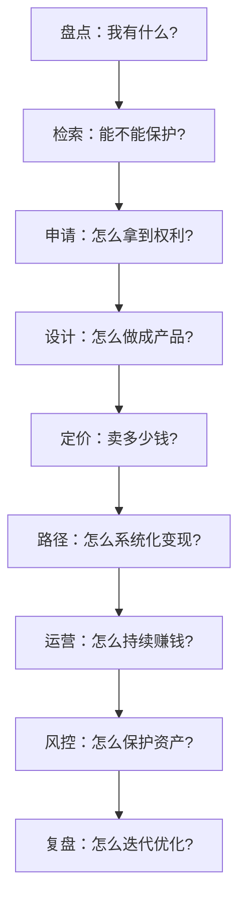
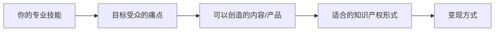
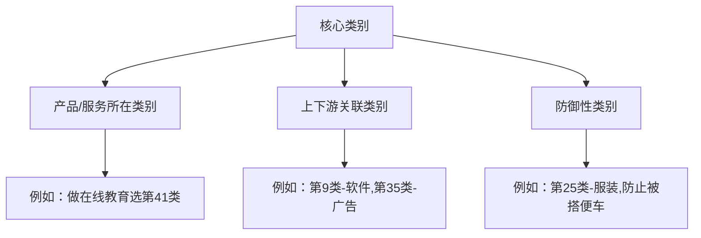
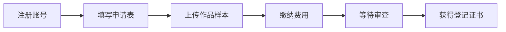
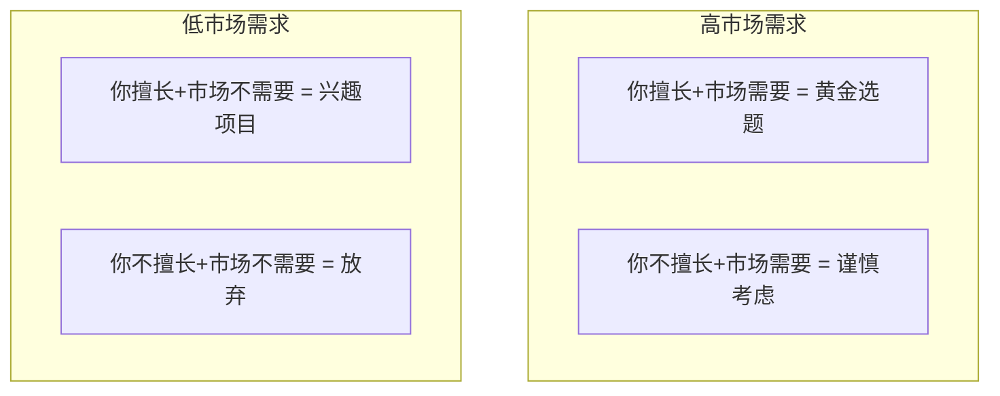
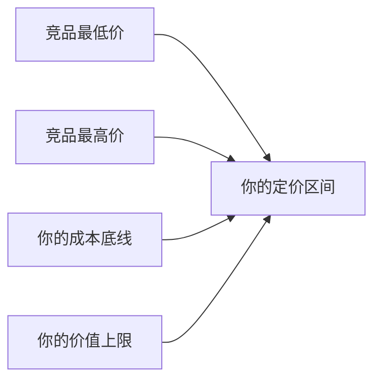
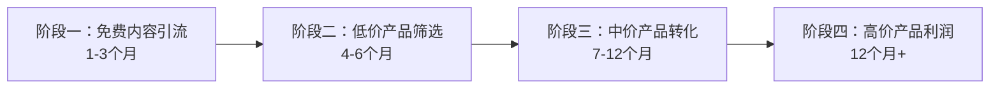
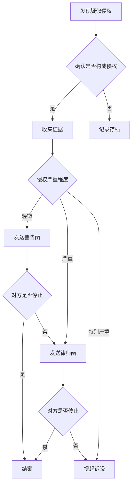

# 第22章 知识产权变现 — 练习方法

***

## 如何使用本章练习

知识产权变现不是一个"知道就行"的领域——它需要你动手去做。本章设计了九个递进式练习，从最基础的知识产权盘点，到完整的商业化路径规划，覆盖了从"不知道自己有什么"到"知道怎么靠它赚钱"的全过程。

**练习设计理念：**



**建议学习顺序：**

| 序号 | 练习名称 | 难度 | 预计时长 | 前置条件 |
|------|----------|------|----------|----------|
| 一 | 个人知识产权盘点 | ★☆☆ | 60分钟 | 无 |
| 二 | 专利检索实操 | ★★☆ | 90分钟 | 练习一 |
| 三 | 商标设计与查询 | ★★☆ | 100分钟 | 练习一 |
| 四 | 版权登记实操 | ★★☆ | 60分钟 | 练习一 |
| 五 | 课程大纲设计 | ★★☆ | 90分钟 | 练习一 |
| 六 | 知识付费产品定价 | ★★★ | 80分钟 | 练习五 |
| 七 | IP商业化路径规划 | ★★★ | 120分钟 | 练习一至六 |
| 八 | 知识产权运营日历 | ★★★ | 60分钟 | 练习七 |
| 九 | 综合实战：从零构建IP资产组合 | ★★★ | 180分钟 | 全部 |

**完成标准：** 每个练习都有"自检清单"，只有全部打勾才算完成。不要跳过自检——自检清单是你防止自我欺骗的工具。

***

## 练习一：个人知识产权盘点

### 目标

系统梳理你已有的和可以创造的知识产权资产，建立你的"知识资产账本"。大多数人的知识产权散落在各个角落——硬盘里的代码、公众号的文章、设计过的Logo、想过的创意——从未被当作"资产"来管理。这个练习帮你把它们找出来。

### 为什么要做这个练习？

知识产权变现的前提是"知道自己有什么"。你无法出售你不知道自己拥有的东西。很多人在做完这个练习后，会惊讶地发现自己已经积累了大量有价值的知识产权资产，只是从未系统整理过。

### 步骤

#### 第一步：已有知识产权全面盘点（30分钟）

拿出一张纸或打开一个电子表格，按照以下分类逐一盘点。不要只想到"大件"——一篇阅读量过万的公众号文章、一个被同事反复使用的Excel模板、一个你设计的品牌名称，都是知识产权资产。

**盘点清单：**

| 类型 | 具体内容 | 是否已保护 | 保护方式 | 商业价值评估 | 变现潜力 |
|------|----------|-----------|----------|-------------|----------|
| 文字作品 | 文章、报告、方案、电子书 | 是/否 | 版权登记/自动取得 | 高/中/低 | 授权/出版/付费阅读 |
| 设计作品 | Logo、海报、UI、图标 | 是/否 | 版权登记/外观专利 | 高/中/低 | 授权/出售/模板化 |
| 技术方案 | 发明、改进、算法、工具 | 是/否 | 专利申请/商业秘密 | 高/中/低 | 许可/转让/自主实施 |
| 品牌标识 | 名称、口号、形象、IP | 是/否 | 商标注册 | 高/中/低 | 授权/加盟/品牌溢价 |
| 软件/工具 | 程序、脚本、模板、插件 | 是/否 | 软著登记/专利 | 高/中/低 | SaaS/授权/定制开发 |
| 教学内容 | 课程、教程、培训资料 | 是/否 | 版权登记 | 高/中/低 | 课程销售/企业培训 |
| 数据/方法论 | 行业数据、流程方法、框架 | 是/否 | 商业秘密 | 高/中/低 | 咨询/报告/工具化 |
| 创意/概念 | 产品创意、商业模式、策划方案 | 是/否 | 未保护 | 高/中/低 | 申请专利/商业秘密 |

**自检要点：**

- 你是否遗漏了"不值钱"的东西？很多看似不起眼的小工具、小模板，在特定场景下有很高的商业价值
- 你是否遗漏了"已经被别人在用"的东西？如果你的文章被其他公众号转载、你的代码被GitHub上的人Star，说明它有市场需求
- 你是否遗漏了"脑子里的东西"？很多有价值的知识产权还没有被"固化"成文字或代码

#### 第二步：可创造的知识产权规划（20分钟）

基于你的专业技能和经验，列出可以创造但尚未创造的知识产权。这一步的关键是"从市场需求倒推"，而不是"从我能做什么正推"。

**思考框架：**



**填写模板：**

| 专业领域 | 目标受众痛点 | 可创造的内容 | IP形式 | 变现方式 | 预计投入时间 |
|----------|-------------|-------------|--------|----------|------------|
| __________ | __________ | __________ | __________ | __________ | __________ |
| __________ | __________ | __________ | __________ | __________ | __________ |
| __________ | __________ | __________ | __________ | __________ | __________ |
| __________ | __________ | __________ | __________ | __________ | __________ |
| __________ | __________ | __________ | __________ | __________ | __________ |

#### 第三步：资产价值评估与优先级排序（10分钟）

不是所有知识产权都值得投入同样的资源去保护和变现。你需要一个评估框架来确定优先级。

**评估矩阵：**

对每个知识产权资产，按以下维度打分（1-5分）：

| 评估维度 | 说明 | 评分标准 |
|----------|------|----------|
| 市场需求 | 有多少人愿意为它付费？ | 5=大量需求，1=几乎没有 |
| 独特性 | 别人是否容易复制？ | 5=极难复制，1=任何人都能做 |
| 变现周期 | 多快能产生收入？ | 5=立即变现，1=需要1年以上 |
| 维护成本 | 持续投入多少精力？ | 5=几乎不需维护，1=需要持续大量投入 |
| 增值潜力 | 未来价值会增长吗？ | 5=持续增值，1=快速贬值 |

**计算优先级分数 = 市场需求 × 独特性 × 变现周期 ÷ 维护成本 × 增值潜力**

按照分数从高到低排序，取前三名作为优先项目。

### 完成示例

以下是一个自由设计师的盘点示例，供参考：

| 类型 | 具体内容 | 是否已保护 | 保护方式 | 商业价值 | 变现潜力 |
|------|----------|-----------|----------|----------|----------|
| 设计作品 | 50+个品牌Logo设计 | 否 | 自动取得版权 | 高 | 做成Logo模板库，按授权收费 |
| 文字作品 | 设计类公众号文章200+篇 | 否 | 自动取得版权 | 中 | 整理成电子书出版 |
| 软件/工具 | Figma组件库3套 | 否 | 软著登记 | 高 | 在Figma社区付费销售 |
| 品牌标识 | "设计师小王"个人品牌 | 否 | 商标注册 | 中 | 品牌授权/课程销售 |
| 教学内容 | 设计入门课程大纲 | 否 | 版权登记 | 高 | 上架知识付费平台 |

### 自检清单

- [ ] 已盘点至少3个类别的知识产权资产
- [ ] 每个资产都评估了"是否已保护"
- [ ] 已识别至少3个"可创造但尚未创造"的知识产权
- [ ] 已用评估矩阵对资产进行优先级排序
- [ ] 已确定前3个优先项目

***

## 练习二：专利检索实操

### 目标

掌握基本的专利检索技能，能够判断技术方案的新颖性，并撰写技术交底书。这是从"想法"到"专利"的第一步，也是最关键的一步——如果你的方案已经被别人申请了专利，后续所有工作都是白费。

### 为什么要做这个练习？

专利检索是专利申请的"生死关"。据统计，约30%的专利申请因为新颖性不足被驳回，而其中大部分可以通过提前检索避免。学会检索不仅能帮你判断自己的方案是否值得申请，还能帮你了解竞争对手的技术布局，找到技术空白点。

### 步骤

#### 第一步：确定检索主题与关键词策略（10分钟）

好的检索结果取决于好的关键词。很多人检索不到相关专利，不是因为没有相关专利，而是关键词选错了。

**关键词构建三层法：**

| 层级 | 说明 | 示例（以"智能水杯"为例） |
|------|------|------------------------|
| 核心词 | 技术方案的核心特征 | 水杯、饮水、容器 |
| 技术词 | 实现核心功能的技术手段 | 温度传感、液位检测、提醒、智能 |
| 应用词 | 技术方案的应用场景 | 健康管理、饮水量监测、办公、运动 |

**检索式构建技巧：**

```text
# 基础检索式：核心词 AND 技术词
水杯 AND 温度传感

# 扩展检索式：核心词 AND (技术词1 OR 技术词2)
(水杯 OR 饮水杯) AND (温度传感 OR 温度检测 OR 液位检测)

# 上位检索式：用更宽泛的词
容器 AND 传感 AND 提醒
```

**填写你的检索关键词：**

- 核心技术词：_______________
- 相关技术词（至少3个）：_______________
- 应用领域词：_______________
- 同义词/近义词：_______________

#### 第二步：多平台专利检索（30分钟）

不要只在一个平台检索。不同平台的数据库覆盖范围不同，检索结果也会有差异。

**推荐检索平台：**

| 平台 | 网址 | 特点 | 适用场景 |
|------|------|------|----------|
| 国家知识产权局 | https://pss-system.cponline.cnipa.gov.cn/ | 中国专利最全，支持高级检索 | 国内专利检索 |
| Google Patents | https://patents.google.com/ | 全球专利，支持中英文 | 国际专利检索 |
| 佰腾专利检索 | https://www.baiten.cn/ | 界面友好，支持语义检索 | 快速初步检索 |
| SooPAT | http://www.soopat.com/ | 免费，支持统计分析 | 专利趋势分析 |

**检索结果记录表：**

| 序号 | 专利号 | 专利名称 | 申请人 | 申请日 | 与你的方案的关系 | 相似度 |
|------|--------|----------|--------|--------|-----------------|--------|
| 1 | | | | | | 高/中/低 |
| 2 | | | | | | 高/中/低 |
| 3 | | | | | | 高/中/低 |

#### 第三步：新颖性判断与差异分析（20分钟）

找到相关专利后，你需要判断你的方案是否与它们有实质性区别。这一步决定了你是继续申请专利，还是调整方案后重新检索。

**新颖性判断三步法：**

1. **找最接近的现有技术：** 在检索到的专利中，找到与你的方案最相似的那一个
2. **逐项对比技术特征：** 把你的方案和最接近的现有技术拆解成技术特征，逐一比对
3. **判断区别是否构成"实质性区别"：** 区别必须是技术方案层面的，而不是参数调整或材料替换

**差异分析表：**

| 技术特征 | 你的方案 | 最接近的现有技术 | 是否有区别 | 区别是否实质性 |
|----------|----------|-----------------|-----------|---------------|
| | | | 是/否 | 是/否 |
| | | | 是/否 | 是/否 |
| | | | 是/否 | 是/否 |

**判断标准：**

- 如果有1个以上实质性区别 → 有授权前景，可以继续
- 如果只有参数/材料区别 → 需要调整方案，增加技术特征
- 如果没有实质性区别 → 放弃或寻找新的技术方案

#### 第四步：撰写技术交底书（30分钟）

如果你的方案具有新颖性，下一步是撰写技术交底书。技术交底书是你和专利代理人沟通的桥梁，写得越清楚，代理人写出来的专利申请文件质量越高。

**技术交底书模板：**

```markdown
一、技术领域
简要说明你的发明属于哪个技术领域。
例：本发明涉及智能饮水设备领域，具体涉及一种具有温度提醒功能的智能水杯。

二、背景技术
说明现有技术存在什么问题，你的发明要解决什么问题。
要求：引用至少1-2篇现有技术（可以是专利或论文）。
例：现有智能水杯只能显示水温，无法根据用户健康状况提醒饮水。
中国专利CN1234567公开了一种温度显示水杯，但缺少个性化提醒功能。

三、发明内容
说明你的技术方案是什么，解决了什么问题，有什么有益效果。
要求：与背景技术中的问题一一对应。
例：本发明提供一种智能水杯，包括温度传感模块、用户画像模块和
提醒模块，能够根据用户的年龄、体重、运动量等个性化参数，
在最佳时间点提醒用户饮水。

四、具体实施方式
详细描述你的技术方案如何实现。
要求：足够详细，让本领域技术人员能够实现。
例：温度传感模块采用NTC热敏电阻，精度±0.5℃，
安装在杯壁内侧，通过ADC采集温度数据...
```

### 常见错误与纠正

| 错误 | 后果 | 正确做法 |
|------|------|----------|
| 只用一个关键词检索 | 遗漏大量相关专利 | 用同义词、上位词、英文词多维度检索 |
| 只在中国数据库检索 | 忽略国际专利，可能在国际上不具新颖性 | 中国+国际双平台检索 |
| 技术交底书写得太简单 | 代理人理解不到位，专利质量差 | 附图+文字+实施例，越详细越好 |
| 发现有类似专利就放弃 | 可能你的方案有实质性区别 | 仔细对比差异，找代理人评估 |
| 检索时只看标题 | 很多相关专利标题完全不同 | 看摘要和权利要求书 |

### 自检清单

- [ ] 已构建至少3组检索关键词（含同义词）
- [ ] 至少在2个平台进行了检索
- [ ] 找到至少3篇相关专利
- [ ] 完成了与最接近现有技术的差异分析
- [ ] 判断了方案的新颖性前景
- [ ] 如果有前景，已完成技术交底书初稿

***

## 练习三：商标设计与查询

### 目标

设计一个商标标识并完成近似查询，掌握商标注册的核心流程。商标是品牌的法律护盾——没有注册商标的品牌，随时可能被别人抢注，导致你多年积累的品牌价值一夜归零。

### 为什么要做这个练习？

商标注册是品牌建设中最容易被忽视、也最容易出问题的环节。很多人在品牌做大后才发现商标被抢注，要么花高价买回，要么被迫改名。提前注册商标的成本（每个类别约300元）远低于事后补救的成本（动辄数万甚至数十万）。

### 步骤

#### 第一步：品牌定位与命名（20分钟）

商标不是一个"名字"那么简单——它是品牌价值的浓缩。好的商标应该具备以下特征：

**好商标的五个标准：**

| 标准 | 说明 | 反面案例 | 正面案例 |
|------|------|----------|----------|
| 显著性 | 能让消费者一眼认出 | "优质面包店"（描述性太强） | "喜茶"（有辨识度） |
| 可记忆 | 容易记住和传播 | "鑫淼焱垚"（生僻难记） | "小米"（简单好记） |
| 可发音 | 能被说出来 | 图形商标无文字 | "三只松鼠"（好念） |
| 无负面联想 | 不会引起不良联想 | 需要跨文化检查 | "华为"（正面积极） |
| 可注册 | 不与已有商标冲突 | 查询后发现近似 | 查询后无近似 |

**品牌定位填写：**

- 品牌名称（至少3个备选）：_______________
- 品牌口号：_______________
- 目标受众画像：_______________
- 品牌调性关键词：_______________
- 品牌核心价值主张：_______________

#### 第二步：商标查询（30分钟）

商标查询是注册前的"必做功课"。即使你觉得自己的品牌名很独特，也一定要查询——商标数据库里有超过4000万件注册商标，"撞车"概率远比你想象的高。

**查询平台：**

| 平台 | 网址 | 特点 |
|------|------|------|
| 中国商标网 | https://sbj.cnipa.gov.cn/ | 官方数据，最权威 |
| 企查查商标查询 | https://www.qcc.com/ | 界面友好，支持图形检索 |
| 权大师 | https://www.quandashi.com/ | 智能近似分析 |

**查询方法：**

1. **精确查询：** 直接输入你的品牌名称，看是否有完全相同的商标
2. **近似查询：** 输入品牌名称的核心部分，看是否有近似商标
3. **跨类别查询：** 在相关类别中查询，避免被"擦边球"

**商标近似判断标准（文字商标）：**

| 判断维度 | 近似情况 | 示例 |
|----------|----------|------|
| 字形近似 | 字形相近，容易混淆 | "大白兔"与"太白兔" |
| 读音近似 | 发音相近，容易混淆 | "华为"与"华伟" |
| 含义近似 | 含义相近，容易混淆 | "苹果"与"Apple" |
| 整体印象 | 整体视觉效果相近 | 排列方式、字体风格相似 |

**查询结果记录：**

- 查询类别（尼斯分类）：_______________
- 精确查询结果：有/无完全相同商标
- 近似查询结果：有/无近似商标
- 近似商标详情：_______________
- 风险评估：高/中/低

#### 第三步：商标设计（30分钟）

商标设计要考虑法律可行性，不是"好看就行"。

**商标类型选择：**

| 类型 | 优势 | 劣势 | 适用场景 |
|------|------|------|----------|
| 文字商标 | 注册范围宽，保护力度大 | 视觉效果单一 | 品牌名称保护 |
| 图形商标 | 视觉冲击力强 | 不便于口传播 | 配合文字使用 |
| 组合商标 | 文字+图形双重保护 | 任一部分近似都可能被驳回 | 预算充足时 |
| 声音商标 | 独特性强 | 注册难度大 | 有标志性声音时 |

**设计注意事项：**

- 避免使用国旗、国徽、红十字等禁用元素
- 避免使用县级以上地名
- 避免使用行业通用名称或图形
- 图形设计要有独创性，不能是简单的几何图形
- 考虑黑白注册（保护范围更宽）还是彩色注册（特定颜色保护）

#### 第四步：注册策略制定（20分钟）

商标注册不是"注册一个类别"那么简单——你需要一个系统化的注册策略。

**类别选择策略：**



**费用预估：**

| 项目 | 费用 | 说明 |
|------|------|------|
| 官费 | 300元/类 | 10个商品/服务项目以内 |
| 超项费 | 30元/项 | 超过10个项目，每项加收 |
| 代理费 | 500-1500元/类 | 委托代理机构的费用 |
| 驳回复审 | 750元/件 | 被驳回后申请复审 |

**填写你的注册策略：**

- 核心注册类别：_______________
- 关联注册类别（至少2个）：_______________
- 防御性注册类别：_______________
- 预计总费用：_______________元
- 注册时间规划：提交申请 → 等待审查（约6-9个月）→ 获得注册证

### 常见错误与纠正

| 错误 | 后果 | 正确做法 |
|------|------|----------|
| 不做查询直接注册 | 被驳回，浪费时间和金钱 | 注册前务必查询近似商标 |
| 只注册一个类别 | 被别人在关联类别抢注 | 核心+关联+防御三类注册 |
| 用品牌名注册公司=注册商标 | 公司名和商标是两回事 | 单独进行商标注册 |
| 注册后不管 | 被撤三、被侵权 | 建立商标管理档案，定期监控 |
| 商标设计太复杂 | 注册难度大，使用不方便 | 简洁、显著、易识别 |

### 自检清单

- [ ] 已完成品牌定位，确定了至少2个备选名称
- [ ] 已在中国商标网进行精确和近似查询
- [ ] 已判断查询结果的风险等级
- [ ] 已确定商标类型（文字/图形/组合）
- [ ] 已制定注册策略（类别+费用+时间）
- [ ] 已准备好商标图样

***

## 练习四：版权登记实操

### 目标

掌握版权登记的完整流程，了解哪些作品值得登记、如何登记、登记后如何维权。版权是知识产权中"门槛最低、覆盖面最广"的类型——你写的每一篇文章、画的每一幅图、写的每一行代码，从创作完成那一刻起就自动享有版权。但"自动享有"不等于"能证明"——版权登记就是给你的一份法律保险。

### 为什么要做这个练习？

在中国，版权实行"自愿登记"原则，作品自创作完成即享有版权。但如果你要维权、授权、交易，没有登记证书会非常被动。版权登记成本低（很多省份免费或仅需几十元）、周期短（1-2个月），是性价比最高的知识产权保护手段。

### 步骤

#### 第一步：判断哪些作品值得登记（10分钟）

不是所有作品都需要登记——你需要根据"商业价值"和"侵权风险"两个维度来判断。

**登记优先级矩阵：**

| | 侵权风险高 | 侵权风险低 |
|---|----------|----------|
| **商业价值高** | ★ 立即登记 | ★★ 尽快登记 |
| **商业价值低** | ★★★ 考虑登记 | 暂不登记 |

**典型需要登记的作品：**

- 准备对外授权的文字作品（电子书、课程内容、技术文档）
- 准备商业化的设计作品（Logo、UI设计、插画）
- 准备上架销售的软件（APP、小程序、工具软件）
- 准备公开发布的音视频内容（播客、视频课程）
- 被他人侵权或有侵权风险的作品

**登记你的作品清单：**

| 序号 | 作品名称 | 作品类型 | 商业价值 | 侵权风险 | 是否需要登记 |
|------|----------|----------|----------|----------|------------|
| 1 | | | 高/中/低 | 高/中/低 | 是/否 |
| 2 | | | 高/中/低 | 高/中/低 | 是/否 |
| 3 | | | 高/中/低 | 高/中/低 | 是/否 |

#### 第二步：准备登记材料（20分钟）

版权登记的材料要求因作品类型而异，但核心材料是相同的。

**通用材料清单：**

| 材料 | 说明 | 注意事项 |
|------|------|----------|
| 身份证明 | 个人身份证/企业营业执照 | 需要清晰的扫描件 |
| 作品样本 | 作品的完整或部分样本 | 文字作品提交前30页+后30页 |
| 作品说明书 | 描述作品的创作过程 | 说明创作时间、地点、方式 |
| 权利保证书 | 承诺作品为原创 | 需要签字/盖章 |
| 委托书 | 委托代理时需要 | 自己办理不需要 |

**不同作品类型的特殊要求：**

| 作品类型 | 样本要求 | 特殊说明 |
|----------|----------|----------|
| 文字作品 | 前30页+后30页（Word/PDF） | 超过60页提交全部 |
| 软件 | 源代码前30页+后30页 | 需要去除第三方代码 |
| 美术作品 | JPG图片，分辨率300dpi | 需要正面拍摄 |
| 摄影作品 | JPG图片，分辨率300dpi | 需要原始文件 |
| 音乐作品 | MP3/WAV音频 | 需要曲谱 |
| 视频作品 | MP4视频 | 需要完整视频 |

#### 第三步：提交登记申请（20分钟）

**登记平台：**

| 平台 | 网址 | 特点 | 费用 |
|------|------|------|------|
| 中国版权保护中心 | https://www.ccopyright.com.cn/ | 国家级，权威性最高 | 100-300元/件 |
| 各省版权局 | 各省不同 | 部分省份免费 | 0-100元/件 |
| DCI数字版权服务 | https://www.dci.cc/ | 适合数字内容 | 10-50元/件 |

**登记流程：**



**时间线：**
- 普通登记：30个工作日
- 加急登记：3-10个工作日（额外费用200-500元）
- 各省版权局通常更快，有些省份1-2周即可

#### 第四步：登记后管理（10分钟）

拿到登记证书不是终点——你需要建立版权资产档案，方便后续的授权、维权和交易。

**版权资产管理表：**

| 作品名称 | 登记号 | 登记日期 | 保护期限 | 授权情况 | 维权记录 |
|----------|--------|----------|----------|----------|----------|
| | | | | 未授权/已授权给___ | 无/有 |

### 常见错误与纠正

| 错误 | 后果 | 正确做法 |
|------|------|----------|
| 觉得"自动享有版权"就不登记 | 维权时举证困难 | 高价值作品务必登记 |
| 提交的作品样本不完整 | 登记被退回或保护范围受限 | 按要求提交完整样本 |
| 创作日期填写错误 | 影响权利归属认定 | 填写真实的首次发表/完成日期 |
| 登记后不保留原始文件 | 维权时缺少证据 | 保留创作过程的原始文件（草稿、修改记录） |
| 多人合作作品只登记一个人 | 产生权属纠纷 | 所有合作作者都要登记 |

### 自检清单

- [ ] 已识别出需要登记的作品清单
- [ ] 已准备完整的登记材料
- [ ] 已选择合适的登记平台
- [ ] 已提交登记申请或明确提交计划
- [ ] 已建立版权资产管理档案

***

## 练习五：课程大纲设计

### 目标

为一门在线课程设计完整的课程大纲，从选题定位到内容架构，掌握知识付费产品的核心设计方法。课程是知识产权变现的"重资产"——一次制作，长期销售，边际成本趋近于零。但前提是你得设计出一门"值得付费"的课程。

### 为什么要做这个练习？

在线教育市场规模超过5000亿元，但大量课程销量惨淡。根本原因不是"没有市场"，而是课程设计有问题——要么选题没有市场，要么内容没有深度，要么结构不符合学习规律。好的课程设计是课程成功的70%。

### 步骤

#### 第一步：选题定位与市场验证（20分钟）

选题是课程的"生死线"。选错了题，后面做得再好也是白费。

**选题四象限评估：**



**市场验证方法：**

| 验证方法 | 操作 | 成本 | 可靠性 |
|----------|------|------|--------|
| 平台搜索 | 在知识星球、知乎、B站搜索相关话题 | 免费 | 中 |
| 问卷调查 | 向目标受众发放问卷 | 低 | 中高 |
| 付费咨询 | 提供1对1咨询，验证需求 | 时间 | 高 |
| 预售测试 | 先发布课程大纲，看有多少人预约 | 免费 | 最高 |
| 竞品分析 | 分析同类课程的销量和评价 | 免费 | 高 |

**填写你的选题定位：**

- 课程主题：_______________
- 目标学员画像（年龄、职业、痛点）：_______________
- 学完后能解决什么问题（必须具体）：_______________
- 竞品调研结果（至少3个竞品）：_______________
- 你的差异化优势：_______________

#### 第二步：课程架构设计（30分钟）

好的课程架构遵循"由浅入深、螺旋上升"的原则。学员的学习曲线应该是平滑的，而不是忽上忽下的。

**课程架构设计原则：**

| 原则 | 说明 | 示例 |
|------|------|------|
| 模块化 | 每个模块解决一个独立问题 | 模块一：基础概念，模块二：核心方法 |
| 渐进式 | 难度逐步递增 | 先讲WHAT，再讲WHY，最后讲HOW |
| 可拆分 | 模块可以独立销售 | 基础版（模块1-3）+ 进阶版（模块4-6） |
| 有钩子 | 每个模块结尾留悬念 | "下一模块我们将揭秘..." |

**课程大纲模板：**

```text
课程名称：_______________
课程简介：_______________（50字以内）
目标学员：_______________
学习成果：_______________

模块一：_______________（基础篇）
  1.1 _______________（概念介绍）
  1.2 _______________（原理讲解）
  1.3 _______________（入门实操）
  → 模块作业：_______________

模块二：_______________（进阶篇）
  2.1 _______________（核心方法）
  2.2 _______________（案例分析）
  2.3 _______________（实操演练）
  → 模块作业：_______________

模块三：_______________（实战篇）
  3.1 _______________（高级技巧）
  3.2 _______________（综合案例）
  3.3 _______________（项目实战）
  → 模块作业：_______________

模块四：_______________（变现篇）
  4.1 _______________（商业化路径）
  4.2 _______________（运营策略）
  4.3 _______________（持续优化）
  → 模块作业：_______________
```

#### 第三步：单节课设计（30分钟）

课程大纲只是骨架，单节课的设计才是血肉。一节好的课程应该遵循"钩子-内容-行动"的结构。

**单节课结构模板：**

| 环节 | 时间占比 | 内容 | 作用 |
|------|----------|------|------|
| 钩子 | 5% | 抛出问题/展示结果/讲故事 | 吸引注意力 |
| 核心内容 | 70% | 知识点讲解+案例演示 | 传递价值 |
| 总结回顾 | 10% | 核心要点提炼 | 强化记忆 |
| 行动指引 | 15% | 课后作业/实操练习 | 学以致用 |

**选择一节课，进行详细设计：**

- 课程标题：_______________
- 所属模块：_______________
- 时长：___分钟
- 钩子设计：_______________
- 核心知识点（3-5个）：_______________
- 案例/演示：_______________
- 课后作业：_______________
- 预期学习成果：_______________

#### 第四步：课程产品化策略（10分钟）

课程大纲设计完成后，你需要考虑如何把它变成一个可销售的产品。

**课程产品形态对比：**

| 形态 | 制作难度 | 制作成本 | 学员体验 | 适合场景 |
|------|----------|----------|----------|----------|
| 图文课程 | ★☆☆ | 低 | 一般 | 知识体系梳理 |
| 音频课程 | ★★☆ | 中 | 较好 | 碎片化学习 |
| 视频课程 | ★★★ | 高 | 最好 | 技能类教学 |
| 直播课程 | ★★☆ | 中 | 互动性强 | 实时答疑 |
| 训练营 | ★★★ | 高 | 最好 | 高客单价 |

### 常见错误与纠正

| 错误 | 后果 | 正确做法 |
|------|------|----------|
| 课程主题太宽泛 | 什么都讲，什么都没讲透 | 聚焦一个细分领域 |
| 内容罗列无逻辑 | 学员学完不知道怎么用 | 按学习曲线设计架构 |
| 没有实操环节 | 学员"听懂了但不会用" | 每个模块配作业和案例 |
| 课程时长越长越好 | 学员完成率低，差评多 | 精炼内容，控制在合理时长 |
| 只考虑制作不考虑运营 | 做完卖不出去 | 制作前就规划好推广策略 |

### 自检清单

- [ ] 已完成选题定位，明确了目标学员和痛点
- [ ] 已进行市场验证（竞品分析或问卷调查）
- [ ] 已设计完整的课程大纲（至少4个模块）
- [ ] 已详细设计至少1节课的内容
- [ ] 已确定课程产品形态和制作计划

***

## 练习六：知识付费产品定价

### 目标

为你的知识付费产品设计科学合理的定价策略。定价是一门学问——定高了没人买，定低了亏本还伤品牌。好的定价不是"拍脑袋"，而是基于成本、竞品、价值感知和心理因素的综合决策。

### 为什么要做这个练习？

很多知识付费产品死在定价上。定价太低，吸引来的是"价格敏感型"用户，他们不会认真学习，也不会复购；定价太高，超出目标用户的支付能力，转化率上不去。找到那个"甜蜜点"，需要系统的定价策略。

### 步骤

#### 第一步：成本核算（15分钟）

定价的底线是"不亏本"。你需要清楚地知道制作这个产品的全部成本。

**成本构成明细：**

| 成本类型 | 具体项目 | 金额 |
|----------|----------|------|
| 时间成本 | 制作时间___小时 × 时薪___元 | ___元 |
| 设备成本 | 录音设备、相机、软件等 | ___元 |
| 外包成本 | 设计、剪辑、配音等 | ___元 |
| 平台费用 | 平台抽成（通常10%-30%） | ___元/年 |
| 推广费用 | 广告投放、KOL合作等 | ___元 |
| 运营成本 | 答疑、更新、维护等 | ___元/年 |
| **总成本** | | **___元** |

**关键指标计算：**

```text
单份成本 = 总成本 ÷ 预期销量
保本销量 = 总成本 ÷ (单价 - 平台抽成)
保本单价 = 总成本 ÷ 预期销量 + 平台抽成
```

#### 第二步：竞品定价调研（20分钟）

定价不能脱离市场。你需要了解同类产品的定价水平，找到你的定价区间。

**竞品调研表：**

| 竞品 | 平台 | 价格 | 内容量 | 目标用户 | 评价数 | 好评率 | 定价策略 |
|------|------|------|--------|----------|--------|--------|----------|
| 竞品A | | | | | | | |
| 竞品B | | | | | | | |
| 竞品C | | | | | | | |
| 竞品D | | | | | | | |
| 竞品E | | | | | | | |

**定价区间确定：**



#### 第三步：定价策略选择（20分钟）

不同的定价策略适合不同的产品和市场阶段。

**主流定价策略对比：**

| 策略 | 适用场景 | 优势 | 风险 |
|------|----------|------|------|
| 渗透定价 | 新产品进入市场 | 快速获取用户 | 利润低，难涨价 |
| 撇脂定价 | 产品有独特优势 | 高利润，塑造高端形象 | 用户基数小 |
| 价值定价 | 高价值产品 | 价格与价值匹配 | 需要强品牌背书 |
| 心理定价 | 所有产品 | 利用价格锚点效应 | 需要精心设计 |
| 阶梯定价 | 多版本产品 | 覆盖不同支付能力 | 版本设计复杂 |

**心理定价技巧：**

| 技巧 | 说明 | 示例 |
|------|------|------|
| 尾数定价 | 价格以9结尾，感知更便宜 | 199比200感觉便宜很多 |
| 锚定效应 | 先展示高价，再展示实际价格 | "原价999，现价199" |
| 价格对比 | 和其他事物做对比 | "一杯咖啡的钱" |
| 拆分定价 | 把总价拆成小单位 | "每天不到1元" |
| 捆绑定价 | 多个产品打包销售 | 课程+社群+1对1答疑 |

#### 第四步：盈利模型构建（25分钟）

定价不是拍脑袋，你需要用数据验证你的定价是否可行。

**盈利预测模型：**

| 指标 | 计算公式 | 你的数据 |
|------|----------|----------|
| 单价 | 定价 | ___元 |
| 月销量 | 基于竞品和推广力度预估 | ___份 |
| 月收入 | 单价 × 月销量 | ___元 |
| 月成本 | 固定成本 + 可变成本 | ___元 |
| 月利润 | 月收入 - 月成本 | ___元 |
| 回本时间 | 总成本 ÷ 月利润 | ___个月 |
| 首年收入 | 月收入 × 12 | ___元 |
| 首年利润 | 首年收入 - 总成本 | ___元 |
| 投资回报率 | 首年利润 ÷ 总成本 × 100% | ___% |

**敏感性分析：**

| 场景 | 月销量 | 月收入 | 月利润 | 回本时间 |
|------|--------|--------|--------|----------|
| 乐观（+50%） | | | | |
| 基准 | | | | |
| 悲观（-50%） | | | | |

### 常见错误与纠正

| 错误 | 后果 | 正确做法 |
|------|------|----------|
| 只算材料成本，不算时间成本 | 实际亏损 | 把自己的时间也计入成本 |
| 跟着竞品定价，不考虑自身差异 | 定价过高或过低 | 基于自身价值和成本定价 |
| 一开始就定低价 | 吸引价格敏感用户，难涨价 | 合理定价，用优惠活动吸引 |
| 只有一个价格 | 错失高支付能力用户 | 设计基础版/进阶版/旗舰版 |
| 不做敏感性分析 | 遇到市场变化措手不及 | 至少做乐观/基准/悲观三种预测 |

### 自检清单

- [ ] 已完成完整的成本核算（含时间成本）
- [ ] 已调研至少3个竞品的定价
- [ ] 已选择并说明定价策略
- [ ] 已设计至少2个价格版本
- [ ] 已构建盈利预测模型
- [ ] 已完成敏感性分析

***

## 练习七：IP商业化路径规划

### 目标

为你的个人IP制定从"零"到"变现"的完整商业化路径。前面的练习帮你建立了"资产"，这个练习帮你把资产变成"现金流"。

### 为什么要做这个练习？

很多有才华的人空有一身本事，却不知道怎么把它变成钱。他们要么觉得"商业化太low"，要么不知道从何开始。IP商业化不是一夜暴富，而是一个系统工程——从内容引流，到信任建立，到产品转化，到持续复购，每一步都需要精心设计。

### 步骤

#### 第一步：IP定位与价值主张（20分钟）

IP定位决定了你的商业化天花板。定位越清晰，目标受众越精准，转化率越高。

**IP定位画布：**

| 维度 | 问题 | 你的回答 |
|------|------|----------|
| 专业领域 | 你在哪个领域有独特见解或技能？ | |
| 目标受众 | 谁最需要你的专业能力？ | |
| 核心痛点 | 你的目标受众最大的痛点是什么？ | |
| 价值主张 | 你能帮他们解决什么问题？怎么解决？ | |
| 差异化 | 你和其他人有什么不同？ | |
| 信任凭证 | 你有什么背书（成绩、经验、案例）？ | |

#### 第二步：商业化路径设计（40分钟）

IP商业化是一个从"免费"到"付费"、从"低价"到"高价"的渐进过程。

**四阶段商业化模型：**



**各阶段详细设计：**

| 阶段 | 时间 | 目标 | 内容形式 | 关键指标 | 平台选择 |
|------|------|------|----------|----------|----------|
| 引流期 | 1-3月 | 建立认知 | 公众号/知乎/B站/小红书 | 粉丝数、阅读量 | 选择1-2个主平台 |
| 筛选期 | 4-6月 | 筛选付费用户 | 电子书/小课/付费社群 | 付费用户数、转化率 | 知识星球/小鹅通 |
| 转化期 | 7-12月 | 建立口碑 | 系统课程/训练营 | 复购率、好评率 | 自有平台+第三方 |
| 利润期 | 12月+ | 规模化变现 | 企业咨询/品牌授权/加盟 | 客单价、利润率 | 多渠道 |

**填写你的路径：**

| 阶段 | 产品形式 | 定价 | 目标销量 | 预期月收入 | 关键动作 |
|------|----------|------|----------|----------|----------|
| 引流期 | | 免费 | | 0 | |
| 筛选期 | | ___元 | ___份 | ___元 | |
| 转化期 | | ___元 | ___份 | ___元 | |
| 利润期 | | ___元 | ___份 | ___元 | |

#### 第三步：收入模型与里程碑（30分钟）

把你的商业化路径转化为可量化的财务模型。

**收入预测表：**

| 月份 | 阶段 | 产品 | 单价 | 月销量 | 月收入 | 累计收入 | 里程碑 |
|------|------|------|------|--------|--------|----------|--------|
| 1-3 | 引流 | 免费内容 | 0 | - | 0 | 0 | 粉丝达到___ |
| 4 | 筛选 | | ___元 | ___ | ___元 | ___元 | 首个付费用户 |
| 5 | 筛选 | | ___元 | ___ | ___元 | ___元 | |
| 6 | 筛选 | | ___元 | ___ | ___元 | ___元 | 付费用户达到___ |
| 7-9 | 转化 | | ___元 | ___ | ___元 | ___元 | 首月收入破___ |
| 10-12 | 转化 | | ___元 | ___ | ___元 | ___元 | 月收入稳定在___ |
| 13+ | 利润 | | ___元 | ___ | ___元 | ___元 | 年收入达到___ |

#### 第四步：行动计划分解（30分钟）

路径规划再好，不执行也是白纸。把年度目标分解为可执行的周计划。

**行动计划模板：**

| 时间 | 任务 | 交付物 | 验收标准 |
|------|------|--------|----------|
| 第1周 | 完成IP定位和账号注册 | 定位文档+账号 | 账号资料完整 |
| 第2周 | 制定内容计划 | 30天内容日历 | 至少30个选题 |
| 第3-4周 | 发布第一批内容 | 8篇内容 | 总阅读量达到___ |
| 第5-8周 | 持续更新，积累粉丝 | 32篇内容 | 粉丝达到___ |
| 第9-12周 | 制作第一个付费产品 | 产品上线 | 产品可购买 |
| 第13-16周 | 推广付费产品 | 销售记录 | 首批___个付费用户 |

### 常见错误与纠正

| 错误 | 后果 | 正确做法 |
|------|------|----------|
| 没有免费内容就开始卖课 | 没有信任基础，转化率极低 | 先通过免费内容建立信任 |
| 产品定价跳跃太大 | 用户接受不了 | 遵循"低价筛选→中价转化→高价利润"的路径 |
| 同时在太多平台运营 | 精力分散，每个平台都做不好 | 先聚焦1-2个主平台 |
| 只做内容不做产品 | 有流量无变现 | 在有稳定流量后立即开发付费产品 |
| 不做复盘和调整 | 重复犯错 | 每月复盘，及时调整策略 |

### 自检清单

- [ ] 已完成IP定位画布
- [ ] 已设计完整的四阶段商业化路径
- [ ] 已制定每个阶段的产品形式和定价
- [ ] 已构建12个月的收入预测模型
- [ ] 已分解为可执行的周计划
- [ ] 已设定关键里程碑和验收标准

***

## 练习八：知识产权运营日历

### 目标

建立一套系统化的知识产权运营管理流程，确保你的IP资产持续产生价值。知识产权不是"注册完就不管"的东西——它需要持续运营、监控和维护。

### 为什么要做这个练习？

很多人的知识产权"躺在抽屉里睡大觉"——商标注册了不续展、专利授权了不监控、版权登记了不维权。知识产权的价值不在于"拥有"，而在于"运营"。一个被良好运营的商标，其价值可能是初始注册成本的百倍甚至千倍。

### 步骤

#### 第一步：建立知识产权资产台账（15分钟）

把你在前面练习中盘点的所有知识产权资产，整理成一个可管理的台账。

**知识产权资产台账模板：**

| 资产名称 | 类型 | 登记/注册号 | 申请日 | 到期日 | 当前状态 | 月收入 | 维护事项 |
|----------|------|------------|--------|--------|----------|--------|----------|
| | 专利/商标/版权 | | | | 有效/待续展/待维权 | ___元 | |
| | | | | | | | |
| | | | | | | | |

#### 第二步：制定年度运营日历（25分钟）

知识产权运营有固定的时间节点，错过就可能造成不可逆的损失。

**关键时间节点：**

| 时间节点 | 事项 | 提前量 | 后果（如果错过） |
|----------|------|--------|-----------------|
| 商标到期前12个月 | 提交续展申请 | 提前6个月准备 | 商标失效，可能被抢注 |
| 专利年费缴纳日 | 缴纳年费 | 提前1个月提醒 | 专利失效 |
| 版权授权到期前30天 | 评估是否续约 | 提前60天沟通 | 授权终止，收入中断 |
| 竞品新品发布时 | 侵权监控 | 实时监控 | 被侵权不知情 |
| 年度IP盘点 | 全面盘点+价值评估 | 每年1月 | 资产流失 |

**填写你的运营日历：**

| 月份 | 关键事项 | 具体任务 | 负责人 | 预算 |
|------|----------|----------|--------|------|
| 1月 | 年度盘点 | 全面盘点IP资产，更新台账 | | |
| 2月 | | | | |
| 3月 | | | | |
| ... | | | | |

#### 第三步：侵权监控机制（20分钟）

发现侵权是维权的前提。你需要建立一套常态化的侵权监控机制。

**监控方法与工具：**

| 监控对象 | 监控方法 | 工具/平台 | 频率 |
|----------|----------|----------|------|
| 商标侵权 | 商标近似监控 | 中国商标网/第三方监控服务 | 每月 |
| 专利侵权 | 竞品产品监控 | 行业展会/电商平台/专利数据库 | 每季度 |
| 版权侵权 | 内容抄袭监控 | 原创宝/维权骑士/搜索引擎 | 每周 |
| 域名侵权 | 域名监控 | 域名查询平台 | 每季度 |

**侵权处理流程：**



### 自检清单

- [ ] 已建立知识产权资产台账
- [ ] 已制定年度运营日历
- [ ] 已设置商标续展、专利年费的提醒机制
- [ ] 已建立侵权监控流程
- [ ] 已了解侵权处理的基本流程

***

## 练习九：综合实战 — 从零构建IP资产组合

### 目标

综合运用前面所有练习的知识，从零开始构建一个完整的IP资产组合。这是本章的"毕业设计"——通过这个练习，你将体验知识产权变现的完整闭环。

### 实战任务

假设你要创建一个个人品牌"知识IP"，请完成以下全部任务：

#### 第一阶段：定位与盘点（30分钟）

1. 确定你的专业领域和目标受众
2. 完成个人知识产权盘点（练习一）
3. 制定IP定位画布（练习七）

#### 第二阶段：资产创建（60分钟）

4. 设计品牌名称和商标（练习三）
5. 完成商标查询和注册策略
6. 规划至少3个可创造的知识产权（电子书、课程、工具等）
7. 选择其中1个，设计完整的课程大纲（练习五）

#### 第三阶段：变现规划（60分钟）

8. 为你的课程产品制定定价策略（练习六）
9. 设计完整的商业化路径（练习七）
10. 构建12个月的收入预测模型
11. 制定行动计划和里程碑

#### 第四阶段：风控与运营（30分钟）

12. 制定知识产权保护方案
13. 建立侵权监控机制
14. 制定年度运营日历（练习八）

### 综合评估标准

| 评估维度 | 优秀 | 良好 | 需改进 |
|----------|------|------|--------|
| 定位清晰度 | 目标受众精准，价值主张独特 | 目标受众较清晰 | 定位模糊 |
| 资产完整性 | 至少5个IP资产，覆盖3种以上类型 | 至少3个IP资产 | 只有1-2个资产 |
| 变现可行性 | 有数据支撑的盈利预测 | 有基本的定价策略 | 没有变现规划 |
| 执行可操作性 | 可以立即开始执行 | 需要补充一些信息 | 还停留在概念阶段 |
| 风控完善度 | 有保护、监控、维权全流程 | 有基本保护措施 | 没有风控意识 |

### 自检清单

- [ ] 已完成全部四个阶段的任务
- [ ] 评估结果至少达到"良好"
- [ ] 制定了接下来30天的行动计划
- [ ] 明确了第一个要执行的具体任务

***

## 工具与资源汇总

### 免费工具

| 工具 | 用途 | 网址 |
|------|------|------|
| 国家知识产权局专利检索 | 专利检索 | https://pss-system.cponline.cnipa.gov.cn/ |
| 中国商标网 | 商标查询 | https://sbj.cnipa.gov.cn/ |
| 中国版权保护中心 | 版权登记 | https://www.ccopyright.com.cn/ |
| Google Patents | 国际专利检索 | https://patents.google.com/ |
| 企查查 | 商标/企业信息查询 | https://www.qcc.com/ |

### 付费工具

| 工具 | 用途 | 参考价格 |
|------|------|----------|
| 权大师 | 商标智能查询与管理 | 免费基础版/付费高级版 |
| 原创宝 | 版权监控与维权 | 按作品数量收费 |
| 维权骑士 | 内容侵权监控与维权 | 按监控数量收费 |
| 小鹅通 | 知识付费平台 | 年费4800元起 |

### 学习资源

| 资源 | 类型 | 说明 |
|------|------|------|
| 《专利审查指南》 | 官方文档 | 国家知识产权局发布的专利审查标准 |
| 《商标法》及实施条例 | 法律法规 | 商标注册和保护的法律依据 |
| 《著作权法》 | 法律法规 | 版权保护的法律依据 |
| 知乎"知识产权"话题 | 社区 | 大量实操经验分享 |
| 各地知识产权保护中心 | 政府服务 | 提供免费咨询和快速审查通道 |

***

> **练习心法：** 知识产权变现不是纸上谈兵，而是需要一步步去实践的。完成这九个练习，你就有了一个从"盘点"到"变现"再到"运营"的完整行动蓝图。接下来最重要的是——从练习一开始，动手去做。记住：完成比完美更重要。先把框架搭起来，再逐步填充细节。
