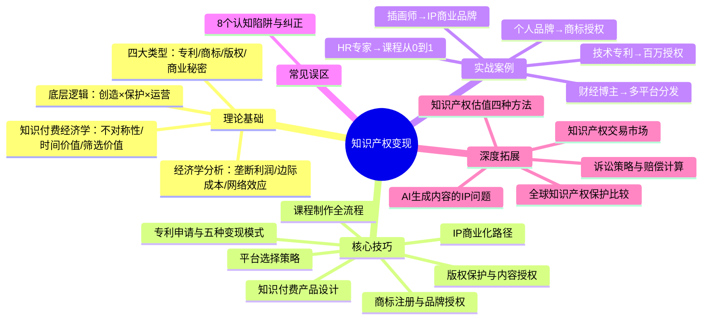
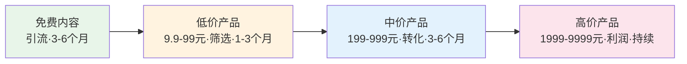

# 第22章 知识产权变现 — 本章小结

***

## 一、本章知识全景

本章从理论基础、核心技巧、实战案例、常见误区、动手练习和深度拓展六个维度，系统构建了知识产权变现的完整知识体系。以下用一张知识地图串联全章脉络：

***

## 二、核心理论回顾与深化

### 2.1 知识产权的四大类型

| 类型 | 保护对象 | 保护期限 | 核心变现方式 | 个人可操作性 |
|------|----------|----------|-------------|-------------|
| 专利权 | 技术创新和设计 | 发明20年/实用新型10年/外观设计15年 | 许可授权、转让、自主实施、质押融资、诉讼维权 | 中（需技术积累） |
| 商标权 | 品牌标识 | 10年（可无限续展） | 品牌授权、商标交易、品牌溢价 | 高（个人品牌） |
| 版权（著作权） | 文学艺术科学作品 | 作者终身+50年；法人作品首次发表后50年 | 内容授权、版税收入、多平台分发 | 最高（创作即拥有） |
| 商业秘密 | 商业信息和技术诀窍 | 无期限（保密期间） | 竞争优势、商业价值 | 低（需保密体系） |

**关键认知升级：** 四种类型并非孤立存在，实际商业中往往需要组合运用。例如一个在线课程品牌，其课程内容受版权保护，品牌名称受商标保护，独创的教学方法论可以申请专利，而学员数据和运营策略则属于商业秘密。本章案例五中"柴犬物语"IP正是版权+商标+自营产品三重保护的典范。

### 2.2 知识产权变现的底层逻辑

本章的核心公式：**创造 × 保护 × 运营 = 变现**

这个公式的三个环节缺一不可，且存在乘法效应——任何一个环节为零，最终结果都为零：

- **创造（Creation）：** 产出有商业价值的智力成果。不是所有智力成果都有商业价值，创造需要聚焦在有市场需求的领域。本章强调"选题三要素"——你擅长、有需求、可付费，正是创造环节的筛选标准。
- **保护（Protection）：** 通过法律手段确权和维权。版权自动产生但建议登记，专利和商标必须申请注册。保护是变现的前提，没有保护的知识产权极易被侵权。本章误区部分详细列举了"不保护"的代价。
- **运营（Operation）：** 通过商业手段将知识产权转化为收入。同样的知识产权，运营能力不同，收入可能相差10倍。运营包括授权、交易、产品化、品牌建设等多个维度。

**经济学本质：** 知识产权的经济学特征是"高固定成本、低边际成本"——创造成本高，但复制和授权的边际成本几乎为零。这意味着知识产权具有极强的规模效应，授权给100家和授权给1家的成本差异很小，但收入相差百倍。这正是知识产权被称为"时间的复利资产"的根本原因。

### 2.3 知识付费的经济学基础

知识付费的本质是**将隐性知识转化为显性产品**，并为这个转化过程定价。其成立的三个经济学基础：

1. **知识的不对称性：** 有些人掌握了专业知识和经验，其他人需要但无法轻易获得，知识付费是连接两者的桥梁
2. **时间价值的差异：** 自己摸索可能需要1年，购买课程可能只需1周，节省的时间价值大于课程价格
3. **信息过载时代的筛选价值：** 用户付费买的不只是知识，更是"筛选+整理+结构化"的效率

定价取决于六个因素：稀缺性、实用性、系统性、讲师知名度、内容深度（正向影响）和市场竞争（负向影响）。

***

## 三、核心技巧体系梳理

### 3.1 专利变现的五种模式对比

| 模式 | 收入特征 | 风险等级 | 适合人群 | 本章案例 |
|------|----------|----------|----------|----------|
| 自主实施 | 利润最高，但需市场验证 | 高 | 有产品化能力的团队 | — |
| 许可授权 | 持续收入，风险低 | 低 | 技术型发明人 | 案例一：李工3年165万 |
| 专利转让 | 一次性较高收入 | 中 | 不打算自己实施的发明人 | — |
| 质押融资 | 获得贷款，保留专利 | 中 | 需要资金的企业 | — |
| 诉讼维权 | 赔偿金（1-5倍许可费） | 高（成本高、周期长） | 有明确侵权证据的权利人 | — |

**关键洞察：** 案例一证明，许可授权的长期收益通常远超一次性转让。李工仅凭1项核心专利+5项外围专利的组合，3年累计收入165万元。专利布局（而非单个专利）才是许可谈判中的核心筹码。

### 3.2 知识付费产品设计方法论

本章构建了一套从选题到变现的完整方法论：

**选题验证三步法：**
1. **你擅长** — 有深厚积累和实战经验
2. **有需求** — 目标用户确实需要（通过搜索量、竞品销量、社群问卷验证）
3. **可付费** — 用户愿意为这个知识付费（通过免费内容测试市场反应）

**课程设计原则：**
- 金字塔结构，从浅到深，每个模块解决一个核心问题
- 每节课聚焦一个核心知识点，控制时长在10-20分钟
- 每节课结构：引入（2分钟）→ 讲解（8-12分钟）→ 案例（3-5分钟）→ 总结（2分钟）
- 信息密度要高，避免废话注水——案例证明，5小时精品课的学习完成率（65%）远高于30小时冗长课（15%）

**产品阶梯设计（IP商业化核心路径）：**

### 3.3 平台选择策略

| 阶段 | 推荐平台 | 核心优势 | 分成模式 |
|------|----------|----------|----------|
| 初学者 | 知乎、小鹅通 | 流量大、门槛低、容易获得初始用户 | 7:3 或 SaaS收费 |
| 进阶者 | 多平台分发+自建平台 | 扩大覆盖面+掌控用户数据 | 各平台不同 |
| 高级者 | 自建品牌平台（小鹅通SaaS等） | 完全掌控数据和关系，利润率最高 | 全部归己 |

**核心策略：** 从第三方平台获取流量，逐步导入私域，最终建立自控的品牌平台。案例三中刘女士的HR课程正是从知乎引流、小鹅通落地，首年收入20万的典型路径。

### 3.4 课程制作全流程时间线

| 阶段 | 时间 | 核心任务 | 关键产出 |
|------|------|----------|----------|
| 选题与验证 | 1-2周 | 市场调研、竞品分析、免费内容测试 | 验证过的选题方向 |
| 课程开发 | 2-4周 | 大纲设计、讲稿编写、PPT制作 | 完整课程内容 |
| 录制与制作 | 1-2周 | 设备准备、录制、剪辑、字幕 | 成品视频/音频 |
| 上架与推广 | 持续 | 平台上架、多渠道推广、社群运营 | 持续收入流 |

***

## 四、实战案例核心启示

本章五个案例覆盖了知识产权变现的主要路径，提炼出共性规律：

| 案例 | 主角 | 变现路径 | 关键成功因素 | 年收入峰值 |
|------|------|----------|-------------|-----------|
| 案例一 | 通信工程师李工 | 技术专利→许可授权 | 专利布局（1+5组合）、专业代理人 | ~80万/年 |
| 案例二 | 健身教练张老师 | 个人品牌→商标授权 | 先有影响力再有品牌、多类别注册 | 350万/年 |
| 案例三 | HR刘女士 | 专业知识→在线课程 | 先验证再投入、持续迭代 | ~35万/年 |
| 案例四 | 财经博主陈先生 | 版权内容→多平台分发 | 一次创作多次变现、从C端到B端 | 99万/年 |
| 案例五 | 插画师周先生 | 创意IP→商业品牌 | IP人格化、自营+授权双轮驱动 | 330万/年 |

**五个案例的共性规律：**

1. **先保护再运营：** 每个案例都在商业化之前完成了知识产权的确权（专利申请、商标注册、版权登记）
2. **从免费到付费：** 所有案例都经历了"免费内容积累影响力→低价产品筛选用户→高价产品获取利润"的渐进过程
3. **多元变现：** 没有一个案例依赖单一收入来源，都是通过多渠道、多产品实现收入多元化
4. **长期主义：** 从启动到实现可观收入，通常需要1-3年的持续投入

***

## 五、八大误区速查与纠正

| 误区 | 正确认知 | 纠正行动 |
|------|----------|----------|
| 想法太简单不值得申请专利 | 专利保护的是新颖性和实用性，不是复杂度。回形针、尼龙搭扣都是"简单"发明 | 只要方案解决了现有技术问题，就值得检索和申请 |
| 商标注册后就不管了 | 注册只是第一步，还需监控、使用、续展、维权 | 建立商标管理档案，设置续展提醒（到期前12个月），定期市场监控 |
| 版权不需要登记 | 虽然自动产生，但登记证书是维权的最有力证据 | 有商业价值的作品务必登记（费用仅100-300元） |
| 知识付费是割韭菜 | 问题在执行者而非模式本身，好的知识付费确实创造价值 | 确保有真才实学，内容干货满满，定价合理 |
| 课程越长越值钱 | 信息密度和实用性比时长更重要 | 每节课聚焦一个知识点，控制10-20分钟，提供可操作的行动建议 |
| 内容好就能卖得好 | 内容是基础，推广和运营同样重要 | 先用免费内容建信任，多渠道推广，提供免费试听 |
| 只适合大公司 | 个人同样可以操作，且有独特优势（启动成本低、决策灵活、利润率高） | 从版权（电子书/课程）和商标（个人品牌）入手，逐步扩展 |
| 专利申请太贵 | 中国有完善的费用减免政策，个人年收入<6万可减免85% | 发明专利减免后仅约500元，代理费也可选择性价比高的机构 |

***

## 六、深度拓展要点提炼

本章深度拓展部分从五个维度构建了知识产权变现的进阶知识体系，以下是每个维度的核心要点：

### 6.1 全球知识产权保护比较

- **四大体系：** 美国（USPTO，赔偿金额高）、欧盟（EPO+统一专利法院）、日本（JPO，审查质量高）、中国（CNIPA，近年大幅加强保护）
- **五大国际条约：** 《巴黎公约》（工业产权基本原则）、PCT（国际专利申请）、《伯尔尼公约》（版权自动保护）、《马德里协定》（国际商标注册）、TRIPS（WTO最低保护标准）
- **策略选择：** 优先在主要市场国申请保护，通过PCT途径可一次申请多国保护，但需30-36个月且成本可达数十万元

### 6.2 知识产权估值四种方法

| 方法 | 原理 | 适用场景 | 优缺点 |
|------|------|----------|--------|
| 成本法 | 重置成本×(1-贬值率) | 早期阶段、成本易量化的IP | 简单但可能低估高价值IP |
| 市场法 | 参考可比交易价格 | 有活跃交易市场的领域 | 反映供需但可比案例难找 |
| 收益法 | 未来预期收益的现值 | 最常用，适合已商业化的IP | 科学但折现率确定有主观性 |
| 实物期权法 | 将IP视为实物期权 | 高不确定性、分阶段投资的项目 | 能考虑灵活性但模型复杂 |

**实践建议：** 多方法验证，聘请专业评估机构，定期更新估值，详细记录假设和数据来源。

### 6.3 知识产权诉讼策略

- **诉前准备：** 证据收集（权属+侵权+损害）、侵权分析（权利要求解释和比对）、管辖法院选择、专业律师选聘
- **诉讼关键策略：** 诉前禁令（紧急停止侵权）、证据保全（查封扣押）、专家证人（技术问题解释）、和解谈判（节省时间和成本）
- **赔偿计算四种方法：** 实际损失 → 侵权获利 → 许可费合理倍数 → 法定赔偿（中国上限500万元）

### 6.4 AI生成内容的知识产权问题

这是当前知识产权领域最具争议的前沿问题：

- **著作权归属：** 美国要求人类作者，中国法院认可"智力投入"可获得版权（如AI文生图案），欧盟要求"作者自己的智力创造"
- **专利发明人：** AI不能被列为发明人（Thaler v. Vidal案），但AI辅助发明可通过强调人类创造性贡献来申请
- **训练数据：** 数据抓取的合法性存在争议，部分机构已开始提供专门的AI训练数据授权服务
- **风险管理：** 使用有明确授权的AI工具，对生成内容查重，保留交互记录，购买IP侵权保险

### 6.5 知识产权交易市场

- **交易类型：** 所有权转让、许可使用（独占/排他/普通）、质押融资、证券化
- **中国市场：** 2022年专利转让许可46.3万次（同比+18.6%），商标交易活跃，数字版权交易快速发展
- **交易流程：** 法律状态核查 → 价值评估 → 尽职调查（法律+技术+商业） → 合同谈判 → 权利转移登记 → 交易后管理

***

## 七、从本章到行动：分阶段路线图

### 7.1 立即可做（本周）

- [ ] **个人知识产权盘点：** 用本章练习一的表格，梳理你已有的文字作品、设计作品、技术方案、品牌标识、软件工具、教学内容，评估商业价值
- [ ] **确定变现方向：** 基于盘点结果，选择商业价值最高且可行性最强的一个方向
- [ ] **注册版权登记：** 如果已有高价值原创作品，立即在中国版权保护中心提交登记申请（100-300元，30-60个工作日）

### 7.2 短期计划（本月）

- [ ] **完成课程大纲设计：** 按照金字塔结构设计4-6个模块，每模块3-5节课
- [ ] **进行市场验证：** 在知乎/社群发布免费内容测试市场反应，收集目标用户反馈
- [ ] **商标查询与注册：** 如果涉及品牌运营，在中国商标网进行近似查询并提交注册申请

### 7.3 中期目标（3-6个月）

- [ ] **完成第一个知识付费产品：** 课程录制、电子书写作或付费专栏上线
- [ ] **多平台上架推广：** 至少在2-3个平台分发，建立推广渠道矩阵
- [ ] **获取第一批付费用户：** 通过免费试听、限时优惠、社群推荐等方式获取初始用户
- [ ] **收集用户反馈并迭代：** 根据学员评价持续优化产品内容

### 7.4 长期目标（1年）

- [ ] **建立个人IP品牌：** 确定个人定位和标签，持续输出专业内容，建立行业影响力
- [ ] **实现稳定的知识产权收入：** 多产品、多渠道收入矩阵，月收入达到可预期的稳定水平
- [ ] **规划产品阶梯升级：** 从低价产品向中高价产品升级，探索训练营、私教、企业内训等高客单价模式
- [ ] **考虑知识产权组合保护：** 版权+商标+可能的专利，构建完整的知识产权保护体系

***

## 八、本章核心公式与心法

### 核心公式

$$\text{知识产权变现} = \text{专业积累} \times \text{内容创作} \times \text{法律保护} \times \text{商业运营}$$

四个因子是乘法关系，任何一个为零则结果为零。偏科发展（只重创作不重保护，或只重保护不重运营）都会严重限制变现效率。

### 三大心法

1. **时间复利心法：** 知识产权是"时间的朋友"——你今天创造的知识产权，可以在未来持续为你创造价值。越早开始积累，未来的复利效应越大。案例二中张老师的品牌授权收入从第1年20万增长到第3年150万，正是复利效应的体现。

2. **先保护再运营心法：** 没有保护的知识产权容易被侵权，没有运营的知识产权无法产生价值。两者缺一不可，但顺序上保护优先于运营。

3. **先验证再投入心法：** 案例三中刘女士先在知乎回答50+问题验证市场需求，再投入200小时制作课程，首年即回本并盈利。避免"闭门造车"是知识付费产品成功的关键前提。

***

> **一句话总结：** 知识产权变现的本质是将你的专业积累通过法律保护转化为可交易的资产，再通过商业运营持续产生收入。它不是大公司的专利，每一个有专业积累的个人都可以从版权和商标入手，逐步构建自己的"知识资产库"。越早开始，回报越大。

***

*下一章，我们将探讨更多关于财富增长和财务自由的进阶策略。*
