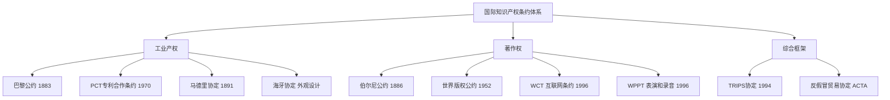
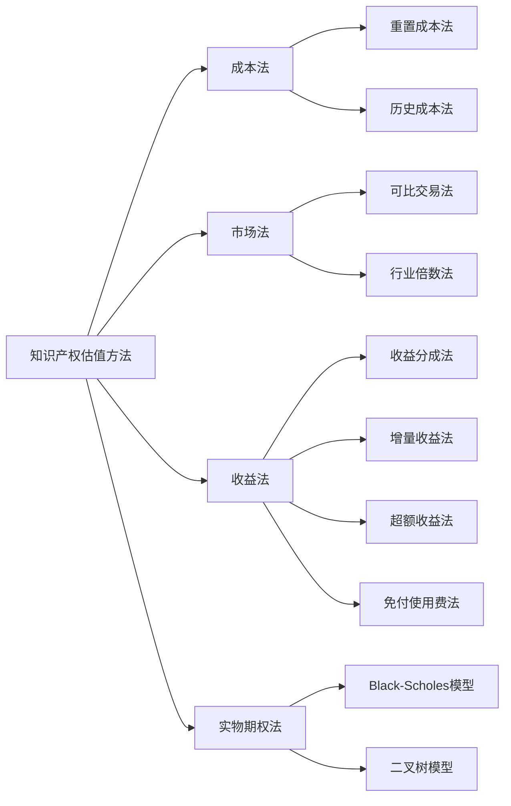
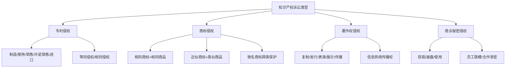
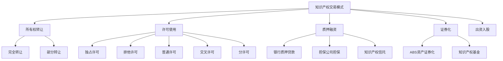
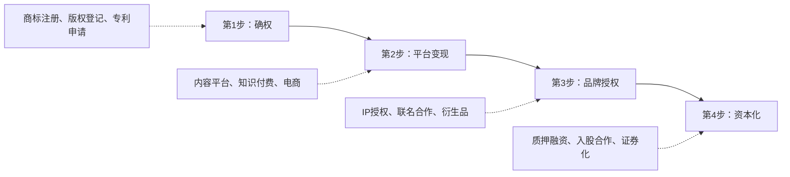

# 第22章 知识产权变现 — 深度拓展

本章从五个维度深入展开知识产权变现的进阶知识：全球保护格局、价值评估方法论、诉讼攻防策略、AI时代的新挑战、以及交易市场的实操指南。每个维度都从理论基础出发，经过方法论拆解，最终落到可执行的操作层面。

---

## 一、全球知识产权保护比较

知识产权的地域性特征决定了：在一国获得的权利，不自动在另一国受保护。理解全球保护格局，是进行跨境知识产权变现的前提。

### 1.1 主要国家和地区的知识产权保护体系

| 维度 | 美国 | 欧盟 | 日本 | 中国 |
|------|------|------|------|------|
| 主管机构 | USPTO（专利商标）、版权局 | EPO（专利）、EUIPO（商标/外观） | JPO（特许厅） | CNIPA（专利商标）、版权局 |
| 专利类型 | 发明（20年） | 发明（20年）、统一专利（2023+） | 发明（20年）、实用新型（10年） | 发明（20年）、实用新型（10年）、外观（15年） |
| 申请制度 | 先申请制（2013年后） | 先申请制 | 先申请制 | 先申请制 |
| 审查周期 | 18-24个月 | 3-5年（EPO） | 12-18个月 | 发明22个月，实用新型6个月 |
| 赔偿上限 | 无上限（含惩罚性赔偿） | 各国不同 | 无上限 | 法定赔偿上限500万元 |
| 执法力度 | 强（ITC、联邦法院） | 中强（各国差异大） | 强 | 快速增强中 |

**美国**：美国拥有全球最完善的知识产权保护体系之一。USPTO负责专利和商标的注册与管理。2013年《美国发明法案》（AIA）将专利制度从"先发明制"改为"先申请制"，与国际主流接轨。美国的知识产权诉讼体系发达，联邦法院和各州法院都可审理知识产权案件。值得注意的是，美国国际贸易委员会（ITC）可以通过337调查禁止侵权产品进口，这是美国独有的"边境执法"手段。美国的赔偿金额通常较高——2023年专利诉讼的中位赔偿额约为2500万美元，个别案件超过10亿美元（如VLSI Technology诉Intel案的21.8亿美元判决）。

**欧盟**：欧盟通过欧洲专利局（EPO）提供统一的专利申请程序。2023年6月启动的统一专利法院（UPC）和统一专利制度是一项里程碑式变革：申请人可以一次性获得覆盖17个以上欧盟成员国的统一专利保护，无需在各国分别生效和维护。欧盟商标（EUTM）通过EUIPO一次注册即可覆盖全部27个成员国。注册共同体外观设计（RCD）同样提供全欧盟保护。

**日本**：日本特许厅（JPO）负责专利、实用新型、外观设计和商标的管理。日本的专利审查质量高，被全球专利审查员广泛引用。日本对知识产权保护力度强，侵权处罚严厉，刑事追诉案例数量在全球名列前茅。日本的实用新型制度不需要实质审查，从申请到授权仅需3-6个月，保护期限为10年，适合技术更新快的领域。对于中国申请人而言，日本是亚洲最重要的知识产权保护目标市场之一。

**中国**：中国国家知识产权局（CNIPA）是全球接收专利申请量最大的专利局。中国近年来大幅加强知识产权保护：2019年成立最高人民法院知识产权法庭（审理技术类案件上诉），2020年《专利法》第四次修改引入惩罚性赔偿制度（1-5倍），法定赔偿上限从100万提高到500万元。中国的发明专利审查周期已压缩至16.5个月（2023年数据），实用新型审查周期约3-6个月。对于个人创作者而言，中国的版权自动保护原则（作品完成即享有著作权）大大降低了保护门槛。

### 1.2 知识产权保护的国际条约体系



**《巴黎公约》（1883年）**：保护工业产权的基本国际公约，目前有177个成员国。确立了三大核心原则：（1）国民待遇原则——成员国必须给予其他成员国国民与本国国民同等的保护；（2）优先权原则——在首次申请后12个月（发明/实用新型）或6个月（外观设计/商标）内，在其他成员国的后续申请可享受优先权日；（3）独立保护原则——各国授予的专利权相互独立。中国于1985年加入。

**《专利合作条约》（PCT，1970年）**：提供国际专利申请的统一程序。申请人通过一次PCT申请，可以在157个缔约国中的任何一个寻求专利保护。PCT流程分为两个阶段：国际阶段（提交申请、国际检索、国际初步审查）和国家阶段（进入各国审查）。国际阶段通常需要18-30个月，为申请人提供了充足的时间来评估发明的商业前景，决定进入哪些国家。2023年，中国申请人通过PCT提交的国际专利申请量连续五年位居全球第一，达到约7万件。

**《伯尔尼公约》（1886年）**：保护文学和艺术作品的基本国际公约，目前有181个成员国。确立了三个核心原则：（1）自动保护原则——著作权自作品创作完成时自动产生，无需注册或任何手续；（2）国民待遇原则——各成员国须给予其他成员国作者与本国作者同等保护；（3）独立保护原则——各成员国的保护相互独立。保护期限一般不少于作者终身加死后50年。中国于1992年加入。

**《马德里协定》与《马德里议定书》**：提供国际商标注册的统一程序，目前有114个成员国，覆盖130个国家。通过马德里体系，申请人可以用一种语言、缴纳一套费用，在多个成员国同时获得商标保护。商标国际注册的有效期为10年，可续展。中国于1989年加入马德里协定，2015年加入马德里议定书。

**《TRIPS协定》（1994年）**：世界贸易组织（WTO）的《与贸易有关的知识产权协定》，是第一个在国际层面规定知识产权保护最低标准的多边协定。覆盖版权、商标、地理标志、工业设计、专利、集成电路布图设计、未披露信息（商业秘密）等全部知识产权类型。TRIPS的核心贡献在于将知识产权保护与贸易争端解决机制挂钩——不遵守TRIPS标准的WTO成员可能面临贸易制裁。中国于2001年加入WTO时接受了该协定。

### 1.3 全球保护策略的制定

对于个人创作者和中小企业而言，全球知识产权保护的核心矛盾是：保护需求是全球性的，但预算是有限的。以下是经过实践检验的策略框架：

**分层保护策略**：

| 层级 | 范围 | 适用对象 | 预算参考 |
|------|------|----------|----------|
| 第一层（必须） | 中国本土 | 所有创作者 | 商标￥500-3000/类，专利￥5000-15000 |
| 第二层（核心） | 目标出海市场（美/欧/日） | 有出海计划的创作者 | 商标￥10000-30000/国，专利￥30000-80000/国 |
| 第三层（防御） | 竞争对手所在国 | 高价值IP持有者 | 视具体情况 |
| 第四层（扩展） | 全球主要市场 | 大型IP运营企业 | PCT国际专利￥50000+ |

**成本优化技巧**：

- **优先权策略**：先在中国提交申请，利用巴黎公约优先权在12个月（专利）或6个月（商标）内在海外提交申请，既保护了优先权日，又给了自己充分的决策时间。
- **PCT路径**：对于专利，通过PCT途径可以将国家阶段决策推迟到首次申请后30-31个月，大幅降低早期投入风险。
- **马德里体系**：对于商标，通过马德里体系一次申请覆盖多国，费用远低于逐一国家申请。但需要注意"中心打击"风险——基础注册5年内被撤销会导致所有国际注册失效。
- **防御性公开**：如果不想在某国申请专利，但又想阻止竞争对手在该国获得相同专利，可以通过"防御性公开"将自己的技术方案公开，使其成为现有技术。

### 1.4 知识产权保护的前沿挑战

**AI生成内容的可版权性**：各国态度分歧明显。美国版权局2023年发布的《版权登记指南：含AI生成材料的作品》明确要求：申请人必须披露AI的使用情况，版权仅保护人类作者的创造性贡献部分。中国北京互联网法院2023年11月在"AI文生图著作权第一案"中做出了更为开放的认定：用户通过设计提示词、选择参数、筛选结果等"智力投入"，可以使AI生成图片构成受版权保护的作品。欧盟目前尚无统一立场，但倾向于要求"作者自己的智力创造"。

**标准必要专利（SEP）**：5G、Wi-Fi、视频编解码等技术标准中包含大量必要专利，围绕这些专利的许可费纠纷日趋激烈。2023年，中国最高人民法院在OPPO诉诺基亚案中首次确定了全球FRAND费率，标志着中国在全球SEP治理中话语权的提升。

**数字版权管理（DRM）的演进**：从传统的技术保护措施（加密、水印）到基于区块链的版权确权和交易，数字版权管理正在经历范式转变。NFT（非同质化代币）虽然经历泡沫，但其底层技术——区块链确权——对数字版权保护具有长期价值。

---

## 二、知识产权的估值方法

知识产权估值是所有变现决策的基石。无论是出售、许可、融资还是诉讼赔偿，都需要一个可信的价值判断。

### 2.1 估值的基本框架



### 2.2 成本法：从"投入"视角看价值

**基本原理**：基于重新创造或替代该知识产权所需的成本进行估值。逻辑是：一个理性的购买者不会为一项知识产权支付超过重新创建它所需的成本。

**计算公式**：

```text
知识产权价值 = 重置全价 × 成新率

重置全价 = 直接成本 + 间接成本 + 合理利润 + 资金成本

其中：
- 直接成本 = 研发人工 + 材料费 + 设备折旧 + 外协费 + 申请费
- 间接成本 = 管理费分摊 + 水电费分摊 + 房租分摊
- 合理利润 = 直接成本 × 行业平均利润率
- 资金成本 = Σ(各期投入 × 资金成本率 × 占用时间)
- 成新率 = 剩余经济寿命 / 总经济寿命
```

**实操案例**：假设你开发了一款SaaS软件并拥有软件著作权，现在要评估其价值。

| 成本项 | 金额（万元） | 说明 |
|--------|-------------|------|
| 研发人员工资 | 45 | 3人×12个月×1.25万 |
| 服务器和云服务 | 3 | 开发期使用 |
| 第三方API费用 | 1.5 | 测试阶段 |
| 办公成本分摊 | 6 | 按人头分摊 |
| 软著申请费 | 0.3 | 官费+代理费 |
| 合理利润（15%） | 7.2 | 按直接成本加成 |
| 资金成本（6%） | 2.2 | 按18个月计算 |
| **重置全价** | **65.2** | |
| 成新率 | 75% | 软件预期寿命5年，已用1.25年 |
| **估值结果** | **48.9** | |

**适用与局限**：

- ✅ 适用于：尚无商业化收入的早期阶段知识产权；成本相对容易量化的类型（软件、实用新型）
- ✅ 优点：数据客观、可验证，计算过程透明
- ❌ 局限：完全忽略未来收益潜力。一款投入50万开发但年收入500万的软件，成本法只能给出50万左右的估值，严重失真
- ❌ 不适用于：品牌、商誉等价值与成本关联度低的无形资产

### 2.3 市场法：从"市场"视角看价值

**基本原理**：基于类似知识产权的市场交易价格进行估值。逻辑是：替代品的价格决定了目标资产的价值上限。

**关键步骤**：

1. **确定可比交易案例**：从公开数据库、行业报告、法院判决中搜集类似知识产权的交易记录
2. **筛选和调整**：根据交易时间、地域、权利范围、技术先进性、市场条件等因素进行调整
3. **计算价值倍数**：常用倍数包括收入倍数（Revenue Multiple）、EBITDA倍数、用户数倍数等

**中国可比交易数据来源**：

| 数据来源 | 类型 | 获取方式 |
|----------|------|----------|
| 国家知识产权运营公共服务平台 | 专利许可/转让 | www.cnipa.gov.cn |
| 中国版权保护中心 | 版权交易 | www.ccopyright.com.cn |
| 各地知识产权交易中心 | 综合 | 如上海、深圳、广州等 |
| 知识产权法院判决 | 侵权赔偿 | 中国裁判文书网 |
| 行业研究报告 | 市场数据 | 前瞻产业研究院、智研咨询等 |

**实操案例**：评估一个音乐版权包（包含50首原创歌曲的网络传播权）的价值。

| 可比交易 | 交易时间 | 歌曲数量 | 交易价格 | 单曲均价 |
|----------|----------|----------|----------|----------|
| 案例A | 2024年 | 30首 | 180万 | 6万 |
| 案例B | 2024年 | 80首 | 400万 | 5万 |
| 案例C | 2023年 | 45首 | 270万 | 6万 |
| 案例D | 2025年 | 60首 | 420万 | 7万 |
| **平均** | | | | **6万/首** |

调整因素：目标版权包的歌曲传唱度略低于平均水平（调整系数0.85），剩余保护期较长（调整系数1.1）。

**估值 = 50 × 6万 × 0.85 × 1.1 = 280.5万元**

**适用与局限**：

- ✅ 适用于：存在活跃交易市场的知识产权类型（商标、成熟专利、版权包）
- ✅ 优点：反映市场真实供需关系，结果最具说服力
- ❌ 局限：可比交易难以获取（大量交易不公开），调整过程主观性强
- ❌ 不适用于：高度独特的知识产权（如前沿技术专利）

### 2.4 收益法：从"未来"视角看价值

**基本原理**：基于知识产权未来预期收益的现值进行估值。这是国际上最常用的知识产权估值方法，也是法院最认可的方法之一。

**四种收益法变体**：

**（1）收益分成法（Relief from Royalty Method）**

最常用的知识产权估值方法。核心逻辑：如果企业不拥有该知识产权，就需要向外支付许可费来使用它。因此，知识产权的价值等于"免除支付的许可费"的现值。

```text
知识产权价值 = Σ[收入 × 许可费率 × (1-所得税率) / (1+折现率)^n]

其中：
- 收入：知识产权产品/服务的年收入
- 许可费率：行业惯例通常为收入的2%-10%（因行业和权利类型而异）
- 折现率：加权平均资本成本（WACC）+ 知识产权特定风险溢价
- n：预测期年数（通常5-10年）
```

**行业许可费率参考**：

| 知识产权类型 | 行业 | 许可费率（占收入%） |
|-------------|------|-------------------|
| 发明专利 | 电子/半导体 | 2%-5% |
| 发明专利 | 医药 | 5%-10% |
| 发明专利 | 软件/互联网 | 3%-8% |
| 实用新型 | 机械/制造 | 1%-3% |
| 商标 | 消费品 | 3%-8% |
| 著作权 | 出版/音乐 | 5%-15% |
| 软件著作权 | 企业软件 | 8%-15% |
| 商业秘密 | 食品/配方 | 3%-10% |

**（2）增量收益法（With-and-Without Method）**

比较"有知识产权"和"无知识产权"两种情况下的收益差异。差异部分即为知识产权的价值贡献。

```text
知识产权价值 = Σ[(有IP时的收益 - 无IP时的收益) / (1+折现率)^n]
```

**（3）超额收益法（Excess Earnings Method）**

计算知识产权带来的超过行业平均水平的收益，将超额收益资本化。

```text
超额收益 = 总资产收益 - 有形资产×行业平均回报率 - 其他无形资产×回报率
知识产权价值 = 超额收益 / (折现率 - 增长率)  [永续模型]
```

**（4）免付使用费法（Relief from Royalty Method）**

本质上是收益分成法的另一种表述，核心假设相同。

**折现率的确定**：折现率是收益法中最关键也最敏感的参数。通常由三部分组成：

```text
折现率 = 无风险利率 + 行业风险溢价 + 知识产权特定风险溢价

参考值（2025年中国）：
- 无风险利率：10年期国债收益率 ≈ 2.3%
- 行业风险溢价：4%-12%（因行业而异）
- 知识产权特定风险溢价：3%-8%（取决于技术成熟度、法律稳定性、替代风险等）
- 典型折现率范围：10%-20%
```

**实操案例**：评估一款已商业化的软件著作权，该软件年收入800万元，预计未来5年保持15%增长率。

| 年份 | 预测收入（万元） | 许可费率 | 分成收益 | 折现系数（12%） | 现值（万元） |
|------|----------------|----------|----------|----------------|-------------|
| 第1年 | 920 | 10% | 92 | 0.893 | 82.2 |
| 第2年 | 1058 | 10% | 105.8 | 0.797 | 84.3 |
| 第3年 | 1217 | 10% | 121.7 | 0.712 | 86.6 |
| 第4年 | 1399 | 10% | 139.9 | 0.636 | 89.0 |
| 第5年 | 1609 | 10% | 160.9 | 0.567 | 91.2 |
| 残值 | — | — | — | — | 450.0 |
| **合计** | | | | | **883.3** |

### 2.5 实物期权法：从"灵活性"视角看价值

**基本原理**：将知识产权视为一种实物期权——一种在未来可以做出有利决策的权利。传统收益法假设投资决策是静态的，但实际上，管理者可以根据市场变化灵活调整策略（延迟投资、扩大规模、放弃项目）。

**适用场景**：

- 分阶段投资的药物研发项目（临床前→I期→II期→III期→上市）
- 具有高度不确定性的前沿技术（如量子计算、基因编辑）
- 可以在不同市场灵活部署的技术平台

**二叉树模型简化示例**：评估一项处于研发阶段的专利技术，需要3年后才能商业化。

```text
当前状态：
- 研发投入：500万元
- 商业化概率：60%
- 成功后年收益：2000万元（永续）
- 失败后残值：0

两年后两种可能：
- 成功路径：年收益2000万，折现率12% → 价值16667万
- 失败路径：价值0

期权价值计算：
期望价值 = 60% × 16667 + 40% × 0 = 10000万
折现到今天 = 10000 / (1+12%)^3 = 7118万

与成本法（500万）和简单收益法（10000万）相比，实物期权法给出7118万的估值，既考虑了不确定性，又承认了管理灵活性的价值。
```

**常用工具**：Real Options Valuation（ROV）计算器、Monte Carlo模拟、@Risk（Excel插件）。

### 2.6 估值方法的综合应用

在实践中，单一估值方法往往不够可靠。专业评估机构通常采用**多方法验证**策略：

| 方法 | 适用场景 | 可靠性 | 数据要求 |
|------|----------|--------|----------|
| 成本法 | 早期技术、未商业化 | 中低 | 研发成本记录 |
| 市场法 | 有可比交易的成熟IP | 高 | 交易数据库 |
| 收益法 | 已商业化或可预测收益 | 高 | 财务预测数据 |
| 实物期权法 | 高不确定性/分阶段项目 | 中 | 概率估算 |

**综合估值实操流程**：

1. **收集基础数据**：权属文件、研发记录、财务数据、市场数据、可比交易
2. **选择2-3种方法**：根据IP阶段和数据可得性选择
3. **分别计算**：独立完成每种方法的估值
4. **交叉验证**：比较不同方法的结果，分析差异原因
5. **确定价值区间**：取合理区间而非单一数值
6. **记录假设和逻辑**：确保估值过程可审计、可解释

**中国资产评估行业标准**：中国资产评估协会发布的《资产评估执业准则——无形资产》（2020年修订）是知识产权估值的权威指南。涉及知识产权出资、质押融资、交易定价等场景时，建议聘请持有资产评估师资格的专业机构出具评估报告。

---

## 三、知识产权诉讼策略

知识产权诉讼不仅是维权工具，更是商业竞争的武器。掌握诉讼策略，意味着掌握了知识产权变现的最后防线。

### 3.1 知识产权诉讼的类型与特点



**专利侵权诉讼**：针对未经许可实施他人专利技术的行为。侵权判定采用"全面覆盖原则"——被控侵权产品必须落入专利权利要求的全部技术特征。中国法院通常采用"权利要求解释→技术特征比对→侵权判定"的三步法。2020年《专利法》修改后引入了惩罚性赔偿，故意侵权且情节严重的，可在基数的1-5倍范围内确定赔偿额。

**商标侵权诉讼**：核心是"混淆可能性"判断。法院考虑的因素包括：商标的近似程度、商品/服务的类似程度、商标的显著性和知名度、相关公众的注意程度等。中国的商标侵权赔偿计算中，"侵权获利"方法适用最为广泛——法院通常会要求被告提供财务账簿，拒不提供的则采信原告的主张。

**著作权侵权诉讼**：采用"接触+实质性相似"的判定标准。原告需要证明：（1）被告接触过原告作品；（2）被控侵权作品与原告作品实质性相似。对于文字作品、软件等，技术鉴定是关键证据。2020年《著作权法》修改后，法定赔偿上限从50万提高到500万元。

**商业秘密侵权诉讼**：原告需要证明三个要件：（1）信息构成商业秘密（秘密性、价值性、保密措施）；（2）被告采取了不正当手段获取、披露或使用；（3）造成了损害。2019年《反不正当竞争法》修改后，举证责任发生转移——原告初步举证后，被告需要证明其使用的信息不构成商业秘密。

### 3.2 诉讼前的战略准备

**证据体系建设**：

知识产权诉讼是"证据战"。以下是必须提前准备的证据清单：

| 证据类型 | 具体内容 | 获取方式 |
|----------|----------|----------|
| 权属证据 | 著作权登记证书、专利证书、商标注册证 | 国家知识产权局/版权局 |
| 首次使用证据 | 首次发表记录、产品上市时间戳 | 公证、区块链存证 |
| 侵权证据 | 侵权产品实物、截图、销售记录 | 公证购买、网页公证 |
| 获利证据 | 被告财务数据、市场份额、销售量 | 法院调取、第三方报告 |
| 损害证据 | 原告销售下降、价格侵蚀、客户流失 | 财务分析、客户声明 |
| 主观恶意证据 | 警告函送达记录、被告知情证明 | 邮寄凭证、邮件记录 |

**证据保全的时机与技巧**：

证据可能灭失时，应立即申请法院证据保全。关键要点：

- **时间**：在提起诉讼前或诉讼中均可申请，但诉前保全需要在法院采取措施后30日内起诉
- **范围**：明确申请保全的具体对象（产品、账册、电脑数据等）
- **担保**：诉前保全通常需要提供担保，金额一般为请求赔偿额的30%-100%
- **电子证据**：区块链存证（如蚂蚁链、至信链）、可信时间戳（联合信任时间戳服务）已被法院广泛认可

**管辖法院的选择**：

中国知识产权案件的管辖有专门规定：

| 案件类型 | 一审管辖 | 特点 |
|----------|----------|------|
| 专利/植物新品种/集成电路 | 知识产权法院/中级人民法院 | 技术类案件，专业性强 |
| 著作权/商标/不正当竞争 | 基层人民法院起 | 选择赔偿标准较高的法院 |
| 技术秘密/计算机软件 | 知识产权法院 | 举证难度大，需专家辅助 |
| 涉外知识产权 | 知识产权法院所在地中级以上 | 程序更复杂 |

**管辖优化策略**：原告可以选择被告住所地或侵权行为地的法院。侵权行为地包括侵权行为实施地和侵权结果发生地。通过选择赔偿标准较高、审判效率较好的法院管辖，可以在一定程度上影响案件结果。北京、上海、广州知识产权法院和最高人民法院知识产权法庭是技术类案件的首选。

### 3.3 诉讼中的攻防策略

**进攻策略**：

- **诉前禁令（行为保全）**：在紧急情况下，可以申请诉前禁令，要求被告立即停止侵权行为。申请条件：（1）权利正在被侵害或即将被侵害；（2）不采取措施将造成难以弥补的损害；（3）提供担保。成功率取决于证据的充分性和紧迫性。
- **多案联打**：对于系列侵权，同时在多个法院起诉不同被告，形成诉讼压力，迫使行业整体规范。
- **337调查**（美国）：如果侵权产品从中国出口到美国，可以通过ITC的337调查快速获得排除令，比联邦法院诉讼更快（12-18个月）。

**防守策略**：

- **专利无效**：对原告专利提出无效宣告请求，是专利侵权诉讼中最常用的防守手段。如果专利被无效，侵权诉讼即失去基础。2023年，中国国家知识产权局专利无效案件中，专利被全部无效的比例约为30%，部分无效约为20%。
- **现有技术抗辩**：在专利侵权诉讼中，被告可以证明被控侵权产品使用的是现有技术，从而不构成侵权。
- **合法来源抗辩**：在销售商被诉侵权的情况下，如果能证明产品有合法来源且不知道是侵权产品，可以免除赔偿责任（但仍需停止侵权）。
- **反诉**：被告可以用自己持有的知识产权对原告提起反诉，形成交叉许可的谈判基础。

**和解谈判的时机与技巧**：

| 时机 | 适用条件 | 和解条件参考 |
|------|----------|-------------|
| 诉前 | 证据充分，对方愿意协商 | 停止侵权 + 合理许可费 |
| 证据交换后 | 双方实力清晰 | 赔偿金 + 未来许可安排 |
| 一审判决后 | 对判决不满的一方 | 上诉撤回 + 调整条件 |
| 二审/再审期间 | 执行困难或商业考量 | 最终解决方案 |

### 3.4 赔偿计算与最大化策略

中国知识产权侵权赔偿的计算采用"四个层级"递进适用：

**第一层级：实际损失**

```text
实际损失 = 侵权导致的销量减少 × 原告单位利润
         + 侵权导致的价格侵蚀 × 原告销量
         + 原告为制止侵权支付的合理开支
```

**第二层级：侵权获利**

```text
侵权获利 = 侵权产品销售量 × 侵权产品单位利润
         × 知识产权贡献度（通常30%-70%，因行业而异）

注：最高人民法院明确"侵权产品单位利润"应使用营业利润
而非销售利润，除非侵权人以侵权为业
```

**第三层级：许可费合理倍数**

```text
赔偿额 = 可比许可费 × 合理倍数（通常1-3倍）
       + 合理维权开支
```

**第四层级：法定赔偿**（前三者均难以确定时适用）

- 专利：3万-500万元
- 商标：500万以下
- 著作权：500万以下
- 商业秘密：500万以下

**赔偿最大化策略**：

1. **尽早固定证据**：侵权持续时间越长，赔偿计算基数越大
2. **多维度举证**：同时从原告损失、被告获利、许可费三个角度举证
3. **惩罚性赔偿**：证明被告"故意侵权且情节严重"，可获1-5倍惩罚性赔偿
4. **合理开支单独主张**：律师费、公证费、鉴定费、差旅费等单独主张，不占用赔偿限额
5. **举证妨碍制度**：如果被告拒不提供财务账簿，法院可以采信原告关于赔偿额的主张

### 3.5 诉讼后管理

**判决执行**：

获得胜诉判决后，如果被告不主动履行，应在2年内（民事诉讼执行时效）申请法院强制执行。执行措施包括：查封/扣押/冻结银行账户和财产、限制高消费、纳入失信被执行人名单、对法定代表人限制出境等。

**持续监控**：

胜诉不是终点。需要持续监控市场，防止侵权人变相规避判决（如更换公司名称、转移生产地点）。建议建立定期监控机制，包括：关键词监控（电商平台、社交媒体）、定期市场调查、与行业组织建立信息共享。

---

## 四、AI生成内容的知识产权问题

AI技术正在深刻改变知识产权的底层逻辑。从内容创作到专利发明，从训练数据到模型权属，AI带来的知识产权问题覆盖了知识产权法的方方面面。

### 4.1 AI生成内容的著作权归属

这是当前知识产权法领域最具争议的问题之一。核心争议在于：AI生成的内容是否构成"作品"？谁是"作者"？

**各国立场对比**：

| 国家/地区 | 核心立场 | 典型案例/文件 | 对创作者的影响 |
|-----------|----------|-------------|-------------|
| 美国 | 版权仅保护人类创作部分 | 2023年《AI版权登记指南》 | 需披露AI使用，纯AI生成不受保护 |
| 中国 | 用户有"智力投入"即可获版权 | 2023年北京"AI文生图案" | 提示词设计、参数选择可构成创作 |
| 欧盟 | 要求"作者自己的智力创造" | CJEU Infopaq判例 | 纯AI生成不受保护，辅助使用待定 |
| 英国 | CDPA第9(3)条：计算机生成作品 | 1988年《版权、设计和专利法》 | 法定保护，但适用案例极少 |
| 日本 | 无明确规定，倾向不保护 | 2024年文化厅报告 | 纯AI生成不建议保护 |

**中国"AI文生图案"深度解析**（2023年11月，北京互联网法院）：

这是全球范围内首次对AI生成图片的著作权做出司法认定的案件，对中国创作者具有直接指导意义。

- **案情**：原告使用Stable Diffusion生成了一张图片并发布在社交媒体，被告未经许可使用了该图片
- **法院认定**：原告通过设计提示词（人物特征、场景描述、风格参数）、设置参数（采样方法、迭代步数、种子值）、从多个生成结果中筛选等行为，进行了"智力投入"，体现了原告的"个性化表达"
- **判决**：AI生成图片构成美术作品，原告享有著作权，被告赔偿500元
- **对创作者的启示**：（1）保留完整的AI交互记录（提示词、参数、多次生成结果）；（2）体现选择和判断过程；（3）不是所有AI输出都能获得保护——关键在于人类的创造性贡献程度

**实操建议**：

- **最大化人类贡献**：在使用AI工具时，尽量体现人类的创造性选择——精心设计提示词、多次迭代筛选、后期手动修改调整
- **记录创作过程**：保存完整的提示词记录、参数设置、中间版本和最终选择的决策过程
- **混合创作模式**：将AI作为工具而非替代——AI生成初稿，人类进行深度修改和再创作
- **标注透明**：在作品中适当标注AI的使用情况，既是合规要求，也降低法律风险

### 4.2 AI辅助发明的专利问题

**发明人资格**：大多数国家的专利法要求专利申请必须指定自然人为发明人。AI系统本身不能被列为发明人。

**关键案例——Thaler v. Vidal（美国，2023年）**：

- Stephen Thaler为其AI系统DABUS"发明"的两项技术申请专利，将DABUS列为发明人
- 美国联邦巡回法院维持USPTO的拒绝决定：AI不能被列为专利发明人
- 最高法院拒绝受理上诉
- 英国、澳大利亚、德国等国法院做出了类似判决
- 例外：南非在2021年授权了全球首项以AI为发明人的专利（但南非不进行实质审查）

**AI辅助发明的专利申请策略**：

对于使用AI辅助完成的发明，关键在于证明人类发明人做出了"实质性贡献"。以下是具体策略：

| 人类贡献类型 | 可专利性 | 举证要点 |
|------------|----------|---------|
| 提出技术问题 | 弱（必要但不充分） | 说明问题的技术背景 |
| 设计AI系统架构 | 中 | 文档记录系统设计过程 |
| 选择训练数据 | 中 | 说明数据选择的创造性考量 |
| 设计提示词/参数 | 中强 | 记录迭代优化过程 |
| 筛选和验证结果 | 强 | 说明选择标准和技术判断 |
| 改进和优化AI输出 | 强 | 对比AI原始输出和最终方案 |

### 4.3 AI训练数据的知识产权合规

**数据抓取的合法性边界**：

AI训练需要海量数据，其中往往包含受版权保护的内容。"合理使用"（美国）/ "合理处理"（欧盟）/ "合理使用"（中国）原则是否适用于AI训练，是当前最具争议的问题之一。

**关键诉讼**：

| 案件 | 原告 | 被告 | 核心争议 | 状态（2025年） |
|------|------|------|----------|-------------|
| 纽约时报诉OpenAI | 纽约时报 | OpenAI/微软 | 新闻内容训练是否侵权 | 审理中 |
| Getty Images诉Stability AI | Getty Images | Stability AI | 图片数据集训练 | 审理中 |
| 作家集体诉讼 | 多位作家 | OpenAI | 书籍内容训练 | 审理中 |
| GitHub Copilot诉讼 | 开源开发者 | GitHub/Microsoft | 代码训练 | 审理中 |

**合规建议**：

1. **使用授权数据**：优先使用明确授权用于AI训练的数据集（如LAION-5B的开放许可、Common Crawl的公开数据）
2. **遵守robots.txt**：尊重网站的爬虫协议，不抓取被明确禁止的内容
3. **数据清洗**：对训练数据进行去重、脱敏、版权过滤
4. **授权协议**：与内容提供商签订数据许可协议。已有越来越多的内容提供商提供AI训练授权服务
5. **法律评估**：在大规模数据使用前，进行法律风险评估，记录数据来源和合规依据

### 4.4 AI生成内容的侵权风险与应对

**实质性相似判断**：如果AI生成的内容与现有作品实质性相似，可能构成侵权。风险点包括：

- **训练数据记忆**：大语言模型可能"记住"训练数据中的特定内容，在生成时直接复制
- **风格模仿**：AI模仿特定艺术家的风格生成作品，虽然"风格"本身不受版权保护，但生成结果如果与特定作品实质性相似，仍可能侵权
- **代码生成**：AI生成的代码可能包含受开源许可证约束的代码片段

**风险管理框架**：

```text
AI内容侵权风险管理流程：

1. 事前预防
   ├── 选择有明确数据授权的AI工具
   ├── 在服务条款中确认供应商的免责范围
   └── 了解AI工具的训练数据构成

2. 事中控制
   ├── 对AI生成内容进行查重（文本：Turnitin，图片：TinEye，代码：scanoss）
   ├── 避免提示词中引用特定作品/作者
   └── 保留完整的交互记录

3. 事后应对
   ├── 收到侵权通知后立即停止使用
   ├── 评估实质性相似程度
   ├── 必要时咨询知识产权律师
   └── 考虑购买知识产权侵权保险
```

### 4.5 AI时代知识产权的未来趋势

**立法动态**：

- **欧盟AI法案（2024年生效）**：要求高风险AI系统的透明度，包括训练数据的版权合规性
- **中国《生成式人工智能服务管理暂行办法》（2023年）**：要求AI服务提供者尊重知识产权，不侵害他人合法权益
- **美国AI行政命令（2023年）**：要求研究AI对版权的影响，但未做出明确规定

**技术解决方案**：

- **C2PA（内容来源和真实性联盟）**：由Adobe、微软等发起的数字内容溯源标准，通过加密签名追踪内容的创建和修改历史
- **数字水印**：在AI生成内容中嵌入不可见的标识符，用于追踪来源。Google DeepMind的SynthID已在文本、图片和音频中实现
- **区块链存证**：将创作过程和版权信息记录在区块链上，提供不可篡改的权属证明

---

## 五、知识产权交易市场

知识产权只有在流动中才能实现最大价值。理解交易市场的运作机制，是变现的关键环节。

### 5.1 知识产权交易的主要模式



**许可类型的对比**：

| 许可类型 | 许可方能否使用 | 能否再许可他人 | 费用水平 | 适用场景 |
|----------|-------------|-------------|---------|---------|
| 独占许可 | ❌ 不能 | ❌ 不能 | 最高 | 深度战略合作 |
| 排他许可 | ✅ 可以 | ❌ 不能 | 较高 | 重要合作伙伴 |
| 普通许可 | ✅ 可以 | ✅ 可以 | 较低 | 多方授权变现 |
| 交叉许可 | 双方互换 | 视约定 | 可能零费用 | 技术互补场景 |
| 分许可 | ✅ 可以 | ✅ 被许可方可以 | 较高 | 分销/代理模式 |

### 5.2 中国知识产权交易市场实操指南

**专利交易**：

| 交易渠道 | 特点 | 适合对象 | 费用 |
|----------|------|----------|------|
| 国家知识产权运营公共服务平台 | 官方平台，信息最全 | 所有主体 | 免费挂牌 |
| 各地知识产权交易中心 | 地方政府支持，线下服务 | 中小企业 | 挂牌费+佣金1%-5% |
| 专利拍卖 | 公开竞价，发现真实价格 | 高价值专利 | 拍卖佣金5%-15% |
| 专利经纪人 | 专业撮合，定向匹配 | 所有主体 | 成交佣金5%-20% |
| 线上平台（如汇桔网） | 便捷高效，覆盖广 | 个人/中小企业 | 平台费+服务费 |

2024年，中国专利转让许可次数达到52.1万次，同比增长12.5%。其中发明专利转让占比约40%，实用新型约35%，外观设计约25%。

**商标交易**：

- **平台**：中国商标网（官方查询）、鱼爪商标、标库网、阿里云商标交易平台
- **流程**：商标查询→签订转让协议→提交转让申请→商标局审查（约6-12个月）→核准转让公告
- **价格参考**：普通商标转让价格通常在5000-50000元，具有较高知名度的商标可达数十万甚至数百万元
- **注意事项**：确认商标是否在有效期内、是否存在质押或许可、是否在三年内有实际使用（否则可能被"撤三"）

**版权交易**：

- **中国版权保护中心**：提供版权登记、交易撮合、维权服务
- **数字版权平台**：如阅文集团（网络文学）、中国音乐著作权协会（音乐版权）、视觉中国（图片版权）
- **版权经纪人**：对于高价值版权（如畅销书、知名IP），通过版权经纪人进行定向交易更为高效

### 5.3 国际知识产权交易市场

**美国市场**：

美国拥有全球最成熟、最活跃的知识产权交易市场。主要平台和服务商：

| 平台/服务商 | 业务范围 | 特点 |
|------------|----------|------|
| Ocean Tomo | 专利拍卖、估值、咨询 | 全球最大专利拍卖商 |
| ICAP Patent Brokerage | 专利交易撮合 | 专注高价值专利 |
| RPX Corporation | 专利风险防御 | 提供专利收购和许可 |
| AST (Allied Security Trust) | 专利联盟 | 成员共同防御专利风险 |
| Tynax | 专利交易 | 中小企业友好 |

**全球专利许可费率基准**：根据LES（许可执行协会）发布的行业调查，2024年全球主要行业的专利许可费率中位数如下：

| 行业 | 中位许可费率（占净售价%） | 常见区间 |
|------|------------------------|---------|
| 电信/无线 | 3.5% | 1%-6% |
| 半导体 | 2.8% | 1%-4% |
| 消费电子 | 2.5% | 1%-5% |
| 汽车 | 2.0% | 0.5%-4% |
| 医疗器械 | 4.0% | 2%-7% |
| 制药 | 5.0% | 3%-10% |
| 软件/互联网 | 4.5% | 2%-8% |

### 5.4 知识产权质押融资

知识产权质押融资是将"知本"转化为"资本"的重要途径。对于轻资产的创作者和科技企业尤为重要。

**中国知识产权质押融资现状**：

2024年，中国专利和商标质押融资金额达到约5000亿元，同比增长超过30%。国家知识产权局联合银保监会推动的知识产权质押融资"入园惠企"行动，大幅降低了融资门槛。

**融资流程**：

```text
知识产权质押融资标准流程：

1. 评估阶段
   ├── 知识产权法律状态审查
   ├── 知识产权价值评估（由评估机构出具报告）
   └── 企业经营状况审查

2. 申请阶段
   ├── 向银行/金融机构提交融资申请
   ├── 提交知识产权证书、评估报告、企业财务报表
   └── 银行进行风控审批

3. 登记阶段
   ├── 签订质押合同
   ├── 到国家知识产权局办理质押登记
   └── 登记完成，放款

4. 贷后管理
   ├── 按期还款
   ├── 维持知识产权有效（缴纳年费等）
   └── 贷款结清后办理注销登记
```

**融资条件参考**：

| 条件 | 要求 |
|------|------|
| 知识产权类型 | 发明专利、驰名商标优先；实用新型、软著需配合其他担保 |
| 剩余有效期 | 发明专利≥3年，商标≥2年 |
| 权属清晰 | 无质押、无诉讼、无许可限制 |
| 贷款额度 | 评估价值的20%-50%（风险溢价高） |
| 贷款期限 | 通常1-3年 |
| 利率 | LPR + 50-200个基点 |

**提高融资成功率的技巧**：

- 优先使用发明专利和驰名商标进行质押（银行接受度最高）
- 组合质押：多项知识产权打包质押，分散单项风险
- 配合政府风险补偿基金：多地政府设立了知识产权质押融资风险补偿资金池，降低银行风险
- 选择有知识产权质押经验的银行：如中国银行、建设银行、浦发银行等

### 5.5 知识产权证券化

知识产权证券化（IP ABS）是将知识产权的未来收益权打包成证券产品，在资本市场发行融资。这是知识产权变现的高级形式。

**基本结构**：

```text
原始权益人（IP持有者）
        ↓ 转让未来收益权
特殊目的载体（SPV）
        ↓ 发行资产支持证券
投资者（认购证券）
        ↑ 获得固定收益
底层资产（IP许可费/版权收入/专利使用费）
```

**中国知识产权证券化案例**：

| 项目 | 发行时间 | 规模 | 底层资产 | 发行利率 |
|------|----------|------|----------|----------|
| 文科租赁ABS | 2018年 | 7.33亿 | 著作权许可费 | 5.2% |
| 奇艺世纪ABS | 2019年 | 5亿 | 视频版权许可费 | 4.5% |
| 广州开发区专利ABS | 2019年 | 3亿 | 专利许可费 | 5.8% |
| 深圳高新投ABS | 2020年 | 10亿 | 知识产权许可费 | 4.0% |

### 5.6 交易定价与谈判策略

**定价策略矩阵**：

| 定价方法 | 适用场景 | 计算逻辑 | 优势 | 劣势 |
|----------|----------|----------|------|------|
| 成本加成 | 技术成熟、竞争不激烈 | 成本×(1+利润率) | 简单透明 | 忽略市场价值 |
| 收益分成 | 已商业化、收入可预测 | 收入×分成率 | 双方共赢 | 分成率争议 |
| 市场比较 | 有可比交易 | 调整后的可比价格 | 市场认可 | 数据难获取 |
| 拍卖竞价 | 需求方多 | 最高出价 | 发现真实价格 | 不确定性高 |
| 竞争定价 | 面对竞争性替代 | 参考替代方案成本 | 务实 | 可能低估 |

**谈判要点清单**：

- [ ] 明确交易标的：具体的权利类型、范围、期限、地域
- [ ] 价格与支付方式：一次性支付 / 分期支付 / 许可费 / 混合
- [ ] 权利保证条款：卖方保证权属清晰、无第三方权利负担
- [ ] 竞业限制：卖方在一定期限内不得从事竞争性活动
- [ ] 违约责任：迟延付款、权利瑕疵、违反保证等的违约后果
- [ ] 保密条款：交易信息和商业秘密的保护
- [ ] 争议解决：仲裁 / 诉讼，管辖地选择
- [ ] 后续服务：技术交接、培训支持、过渡期安排

---

## 六、知识产权变现的常见误区与纠正

### 6.1 十大常见误区

| 序号 | 误区 | 事实 | 纠正建议 |
|------|------|------|----------|
| 1 | "申请了专利就能赚钱" | 专利本身不产生收入，需要主动运营 | 将专利与商业模式结合，许可、转让或诉讼变现 |
| 2 | "版权自动保护，不用登记" | 虽然自动保护，但登记是诉讼的前置条件 | 重要作品及时登记，成本低（软件著作权￥300） |
| 3 | "商标注册后就万事大吉" | 商标需要持续使用和维护，3年不使用可被撤销 | 建立商标使用证据档案，按时续展 |
| 4 | "知识产权越贵越好" | 过度保护浪费资源，关键在于性价比 | 核心资产重点保护，非核心适当简化 |
| 5 | "创业初期不需要知识产权" | 竞争对手可能抢先注册 | 至少注册商标和域名，核心技术考虑专利 |
| 6 | "AI生成的内容不受保护" | 中国法院已有支持保护的判例 | 体现人类创造性贡献，保留创作过程记录 |
| 7 | "诉讼一定能获得高额赔偿" | 知识产权诉讼赔偿额中位数并不高 | 理性评估诉讼成本收益，和解可能更优 |
| 8 | "许可给别人用就控制不住了" | 通过许可协议的条款设计可以有效控制 | 明确使用范围、质量标准、违约终止条款 |
| 9 | "知识产权只能自己用" | 许可、转让、质押、证券化都是变现途径 | 根据自身情况选择最合适的变现模式 |
| 10 | "海外保护太贵没必要" | 缺乏海外保护可能导致失去海外市场 | 分层保护策略，优先覆盖核心出海市场 |

### 6.2 个人创作者的最优变现路径

对于个人创作者（自媒体人、独立开发者、设计师等），知识产权变现的核心策略是**从低成本高确定性的路径开始，逐步扩展到高价值路径**：



**第1步——确权（成本：￥1000-10000）**：

- 注册商标（￥500-3000/类，覆盖核心品类）
- 登记版权（软件著作权￥300，文字/美术作品免费或低价）
- 申请专利（实用新型￥5000-10000，发明专利￥10000-30000）

**第2步——平台变现（月收入：￥1000-100000+）**：

- 自媒体内容变现（广告分成、付费专栏）
- 知识付费（在线课程、电子书、付费社群）
- 软件/工具销售（SaaS、插件、模板）

**第3步——品牌授权（年收入：￥100000-1000000+）**：

- IP授权给其他品牌使用（联名、冠名）
- 品牌周边产品开发
- 课程/内容授权给平台

**第4步——资本化（收入：视IP价值）**：

- 知识产权质押融资
- 以知识产权出资入股
- 知识产权证券化

---

## 七、知识产权变现工具箱

### 7.1 确权工具

| 工具 | 用途 | 费用 | 链接 |
|------|------|------|------|
| 中国版权保护中心 | 著作权登记 | ￥0-300 | www.ccopyright.com.cn |
| 国家知识产权局 | 专利/商标申请 | 视类型 | www.cnipa.gov.cn |
| 联合信任时间戳 | 电子证据固化 | ￥10-50/次 | www.tsa.cn |
| 蚂蚁链版权保护 | 区块链确权 | ￥10-50/件 | blockchain.antchain.com |
| 权大师 | 商标/专利代理 | 视服务 | www.quandashi.com |

### 7.2 监控工具

| 工具 | 用途 | 费用 |
|------|------|------|
| 商标监控（国知局） | 商标近似监控 | 免费 |
| 电商平台品牌保护 | 淘宝/京东/拼多多维权 | 免费（品牌权利人） |
| DMCA投诉 | 海外平台侵权内容下架 | 免费 |
| TinEye/Google图片搜索 | 图片反向搜索，发现盗图 | 免费 |
| Copyscape | 文字内容查重 | $0.05/次 |

### 7.3 交易工具

| 工具 | 用途 | 说明 |
|------|------|------|
| 国家知识产权运营平台 | 专利挂牌交易 | 官方平台 |
| 汇桔网 | 综合知识产权交易 | 一站式服务 |
| 鱼爪商标 | 商标转让 | 大量商标资源 |
| 中国音乐著作权协会 | 音乐版权许可 | 标准许可费率 |
| 中国文字著作权协会 | 文字作品版权 | 集体管理组织 |

### 7.4 估值工具

| 工具 | 用途 | 说明 |
|------|------|------|
| 智慧芽（PatSnap） | 专利分析和估值 | AI辅助估值模型 |
| INCOPAT | 专利检索和分析 | 全球专利数据 |
| 中国资产评估协会 | 估值标准和机构查询 | 行业权威 |
| @Risk（Excel插件） | Monte Carlo估值模拟 | 实物期权法 |
| Discounted Cash Flow模板 | 收益法计算 | Excel/Google Sheets |

---

## 八、前沿展望：知识产权变现的未来趋势

### 8.1 技术驱动的变革

**区块链+知识产权**：区块链技术正在重塑知识产权的登记、交易和维权流程。去中心化的版权登记系统（如Po.et、Binded）使创作者可以直接在链上确权，无需依赖中心化机构。智能合约可以自动执行许可条款——当用户付费后，自动解锁内容使用权，创作者自动收到许可费分成。

**AI辅助估值和交易**：AI正在被用于专利估值、侵权风险预测和交易匹配。智慧芽（PatSnap）、IPwe等平台已经推出了AI驱动的专利估值模型，可以在数秒内完成传统评估需要数天的分析工作。

**大数据专利分析**：通过分析全球专利数据（申请趋势、引用网络、技术聚类），可以识别技术空白、预测技术发展方向、发现潜在的许可和收购目标。

### 8.2 制度创新

**知识产权法院专业化**：全球越来越多的国家建立专门的知识产权法院。中国已有北京、上海、广州、海南四个知识产权法院，以及最高人民法院知识产权法庭。专业化审判提高了案件质量和效率。

**集体管理组织的扩展**：音乐、文字、摄影、影视等领域的集体管理组织正在扩展服务范围，为中小创作者提供一站式版权管理服务。

**快速维权机制**：中国各地建立的知识产权快速维权中心（目前已超过50家），可以在1个月内完成外观设计专利的确权和维权，大大降低了维权成本和时间。

### 8.3 创作者经济的崛起

随着Web3、创作者经济和去中心化平台的发展，知识产权变现的模式正在从"中心化许可"向"创作者直接变现"转变：

- **NFT与数字版权**：虽然NFT市场经历了泡沫和调整，但其底层逻辑——通过区块链证明数字资产的所有权和稀缺性——对数字版权保护具有长期价值
- **粉丝经济与IP授权**：个人IP的价值正在被重新认识，头部创作者的IP授权收入可能超过传统企业
- **去中心化版权交易平台**：基于区块链的版权交易平台（如Audius、Mirror）正在探索创作者直接面向用户授权的新模式

---

*本章深度拓展从全球保护格局、价值评估方法论、诉讼攻防策略、AI时代新挑战、交易市场实操、常见误区纠正、实用工具箱、前沿展望八个维度，构建了知识产权变现的完整进阶知识体系。从理论到实操，从工具到策略，从当下到未来——掌握这些内容，你将具备在知识产权领域进行专业级决策和运营的能力。核心要记住：知识产权变现不是一锤子买卖，而是从确权、保护、运营到交易的全生命周期管理。每一个环节的专业化，都能为最终的变现效果带来倍增效应。*
