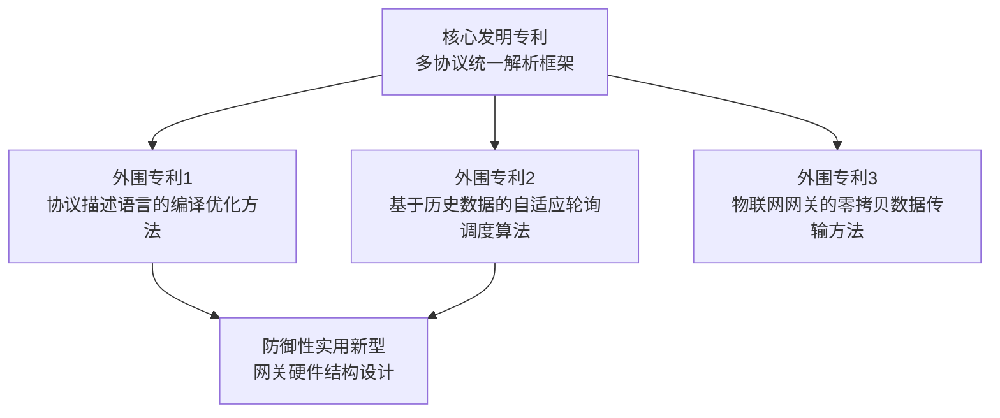
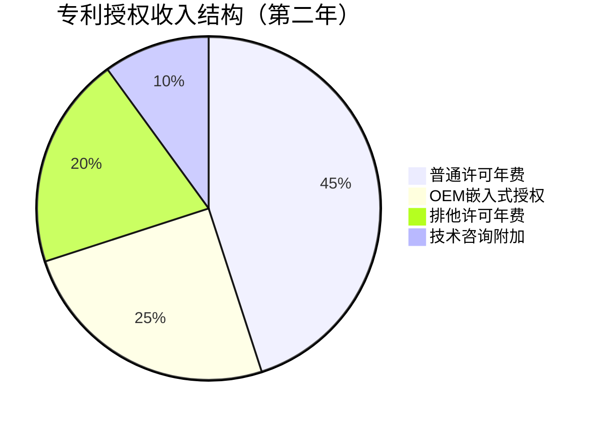

## 案例一：从技术专利到百万授权收入

> 一个嵌入式工程师用 18 个月时间，将一项物联网通信协议优化专利从实验室成果变成年授权收入超过 120 万元的资产。这个案例完整展示了技术专利从创意萌芽、申请布局、商业化谈判到持续变现的全链路。

### 一、案例背景：为什么选择专利授权

#### 1.1 主人公画像

张工（化名），32 岁，某二线城市的嵌入式软件工程师，月薪 1.8 万元。工作内容是工业物联网网关的固件开发，日常工作涉及大量的设备通信协议适配。他有以下关键特征：

- **技术积累**：8 年嵌入式开发经验，精通 Modbus、MQTT、OPC UA 等工业协议
- **痛点洞察**：在实际项目中反复遇到多协议转换的性能瓶颈，现有方案要么延迟高，要么资源占用大
- **资源约束**：没有创业资金，没有销售渠道，只有一台开发板和多年的技术积累
- **初始目标**：不辞职、不投入大额资金，用业余时间将技术优势转化为收入

#### 1.2 为什么选专利而非其他变现方式

张工评估了四种可能的变现路径：

| 变现路径 | 启动资金 | 时间投入 | 收入上限 | 被动收入潜力 |
|----------|----------|----------|----------|-------------|
| 接外包项目 | 0 | 高（持续劳动） | 中等（受限于个人时间） | 无 |
| 做开源项目+赞助 | 0 | 很高 | 低（国内赞助生态弱） | 极低 |
| 创业做产品 | 50万+ | 极高 | 高 | 需团队运营 |
| **申请专利+授权** | **1-3万** | **中（前期集中）** | **很高** | **强（一次申请多次收费）** |

选择专利授权的核心逻辑：**将一次性技术劳动转化为可重复收费的资产**。写代码是"卖时间"，卖专利是"卖权利"——这是从劳动收入到资产收入的本质跃迁。

---

### 二、专利挖掘：从日常工作中发现可专利的技术方案

#### 2.1 问题发现过程

张工在 2023 年初接到一个项目：将工厂里 200 多台不同品牌的 PLC 设备统一接入云平台。现有方案的痛点非常具体：

```text
痛点链条：
不同品牌PLC → 不同通信协议 → 需要协议转换网关 → 现有网关延迟200-500ms
→ 200台设备轮询一圈需要40-100秒 → 无法满足实时监控需求
```

他尝试了市面上主流的开源方案（如 Node-RED、Kepware 的社区版），发现瓶颈出在协议解析层：每个协议都需要独立的解析线程，设备数量增加时线程切换开销急剧上升。

#### 2.2 技术方案的核心创新

张工花了三个月业余时间，设计了一套"基于事件驱动的多协议统一解析框架"，核心创新点包括：

**创新点一：协议描述语言（PDL）**
他设计了一种声明式的协议描述语言，用类似 JSON Schema 的方式描述任意协议的帧结构、校验规则和语义映射，而不需要为每个协议写专门的解析代码。

```yaml
# 示例：用PDL描述Modbus RTU协议
protocol:
  name: "modbus_rtu"
  frame:
    header: { slave_address: uint8 }
    function_code: uint8
    data: { length: variable, encoding: big_endian }
    trailer: { crc16: uint16, algorithm: "crc-modbus" }
  mapping:
    register_0x0001: { type: "temperature", unit: "celsius", scale: 0.1 }
```

**创新点二：零拷贝事件管道**
所有协议数据通过一个统一的无锁环形缓冲区传递，解析结果直接映射为标准数据模型，避免了传统方案中的多次内存拷贝。

**创新点三：自适应轮询调度**
根据设备历史响应时间和数据变化频率，动态调整轮询优先级和间隔，将 200 台设备的有效轮询周期从 60 秒压缩到 8 秒。

#### 2.3 可专利性判断

张工没有立即申请专利，而是先做了两个关键验证：

**新颖性检索**：在 CNIPA（国家知识产权局）和 Google Patents 上检索了"协议解析"+"事件驱动"+"物联网"等关键词组合，发现现有专利要么是针对单一协议的优化，要么是硬件层面的网关设计，没有覆盖他这套"声明式协议描述+零拷贝管道+自适应调度"的软件方法。

**技术效果验证**：在公司内部项目中实际部署，对比测试数据如下：

| 指标 | 传统方案（Kepware社区版） | 张工的方案 | 提升幅度 |
|------|-------------------------|-----------|---------|
| 200台设备轮询周期 | 62秒 | 8秒 | 7.75倍 |
| 单设备解析延迟 | 180ms | 12ms | 15倍 |
| 内存占用（200台） | 1.2GB | 85MB | 14倍 |
| CPU占用率 | 78% | 15% | 5.2倍 |

这些量化数据后来成为专利审查和商业谈判中的关键支撑。

---

### 三、专利申请：从技术方案到法律资产

#### 3.1 申请策略制定

张工没有简单地提交一份专利申请，而是制定了一个**专利组合策略**：



**策略逻辑**：核心专利保护整体架构，外围专利保护具体实现细节。竞争对手即使绕过核心专利，在具体实现时仍然会落入外围专利的保护范围。这种"专利围栏"策略大幅提高了专利组合的商业价值。

#### 3.2 权利要求书撰写要点

张工最初自己写了一版权利要求书，找代理人审核后被退回重写。代理人给出的关键修改意见：

**原始写法（过于具体，保护范围窄）：**
> 一种物联网协议解析方法，其特征在于使用JSON格式描述Modbus协议的帧结构...

**修改后写法（上位化，保护范围宽）：**
> 一种多协议统一解析方法，应用于物联网边缘网关设备，其特征在于包括以下步骤：
> （1）接收来自目标设备的原始数据帧；
> （2）基于预设的声明式协议描述模型，对所述原始数据帧进行结构化解析，得到标准化数据对象；
> （3）将所述标准化数据对象通过无锁环形缓冲区传输至应用层...

关键原则：**用功能语言而非实现语言描述**。不写"JSON"而写"声明式描述模型"，不写"某个具体的环形缓冲区库"而写"无锁环形缓冲区"。这样即使竞争对手换了具体技术栈（比如用 YAML 而非 JSON），仍然落入保护范围。

#### 3.3 申请流程与成本

张工的实际申请成本：

| 项目 | 发明专利（核心+外围3件） | 实用新型（1件） | 合计 |
|------|------------------------|----------------|------|
| 代理费 | 5,000元/件 × 3 = 15,000元 | 2,500元 | 17,500元 |
| 官费（申请费+实审费） | 950+2,500元/件 × 3 = 10,350元 | 500元 | 10,850元 |
| 费减后（个人申请减85%） | 1,552元 | 75元 | 1,627元 |
| **实际总支出** | | | **约19,127元** |

> **重要提示**：个人申请人年收入低于 6 万元可申请费减 85%，年收入 6-15 万可申请费减 70%。张工以个人名义申请，通过费减大幅降低了官费。但代理费无法减免，这是主要支出。

#### 3.4 审查过程中的关键博弈

核心发明专利在实质审查阶段收到了两次审查意见通知书：

**第一次审查意见**（申请后第 10 个月）：审查员引用了 3 篇对比文件，认为"声明式协议描述"不具备新颖性。

**张工的应对策略**：
- 承认对比文件中存在声明式描述的概念
- 但重点论证"声明式描述+零拷贝管道+自适应调度"的**组合效果**具有非显而易见性
- 提交了对比测试数据，证明组合方案相比单独使用各技术的效果有质的飞跃

**第二次审查意见**（申请后第 14 个月）：审查员对自适应调度算法的创造性提出质疑。

**张工的应对策略**：
- 引用技术论文证明现有调度算法都是静态的或基于简单阈值的
- 详细说明自己的算法引入了"设备画像"概念，根据历史响应模式建立贝叶斯预测模型
- 最终审查员接受了这个论述

**核心发明专利在申请后第 18 个月获得授权**。

---

### 四、商业化：从证书到现金流

#### 4.1 目标客户画像

张工明确了三类潜在授权客户：

| 客户类型 | 典型企业 | 核心需求 | 支付能力 |
|----------|---------|---------|---------|
| 工业物联网平台商 | 涂鸦智能、机智云、ThingsBoard中国区集成商 | 需要接入更多设备协议 | 年营收千万级，愿意为技术壁垒付费 |
| 自动化系统集成商 | 各地做智慧工厂项目的SI公司 | 缩短项目交付周期 | 单项目百万级，技术采购预算10-30万 |
| PLC/网关硬件厂商 | 国产PLC和网关制造商 | 提升产品竞争力 | 年营收亿级，有专门的技术采购流程 |

#### 4.2 定价策略

张工没有拍脑袋定价，而是做了系统的定价调研：

**方法一：成本替代法**
客户如果自己开发类似功能，需要 3-5 名工程师工作 6-12 个月，人力成本约 60-150 万元。授权费定在客户自研成本的 20%-30% 具有说服力。

**方法二：市场比较法**
调研了同类技术授权的市场价格：
- Kepware 商业版按点位收费，200 个设备约 15-25 万元/年
- 国内同类中间件产品年费 8-20 万元
- 华为 IoT 平台接入授权按设备数阶梯收费

**方法三：价值分成法**
张工的方案帮客户把项目交付周期从 3 个月缩短到 1 个月，节省的人力成本约 20-40 万元。

**最终定价方案**：

| 授权类型 | 价格 | 包含内容 |
|----------|------|---------|
| 普通许可（年费） | 8万元/年 | 技术文档+SDK+基础技术支持 |
| 排他许可（年费） | 25万元/年 | 独占某行业领域+深度定制支持 |
| 一次性买断 | 80-150万元 | 源代码+全部专利许可+3年技术支持 |
| OEM嵌入式授权 | 5万元/年+3元/台 | 嵌入硬件产品销售 |

#### 4.3 获客渠道与谈判过程

**渠道一：技术社区影响力**
张工在 CSDN 和知乎上持续发表了 20 多篇关于工业物联网协议的技术文章，积累了 5000+ 粉丝。其中有 3 家企业的技术负责人主动联系他咨询方案。

**渠道二：行业展会**
他以个人身份参加了两次中国国际工业博览会的物联网专区，带了一块演示板展示效果。现场收集了 40+ 张名片，后续转化为 8 个有效客户线索。

**渠道三：专利公开后的被动获客**
专利公开后，在 CNIPA 的专利数据库中可以被检索到。有 2 家企业通过专利检索找到了张工，因为他们正在开发类似功能，发现已有专利在先后选择主动获取授权以避免侵权风险。

**一个典型的谈判过程**：

```text
时间线：
第1周  ——  客户技术负责人通过知乎私信联系，描述了他们的痛点
第2周  ——  线上会议，张工展示技术方案和测试数据
第3周  ——  客户要求看专利证书和权利要求书
第4周  ——  客户内部评估，确认自研成本高于授权费
第5周  ——  商务谈判，讨论授权范围和价格
第6周  ——  签署普通许可协议，首年授权费8万元
第7周  ——  交付技术文档和SDK，开始技术支持
```

#### 4.4 授权协议的核心条款

张工在代理人的帮助下，起草了一份标准化的专利许可协议模板，关键条款包括：

1. **许可范围**：明确限定使用场景（如"仅限用于甲方的XX平台产品"），防止超范围使用
2. **审计权**：保留对被许可方使用情况的审计权利，特别是OEM模式下的设备出货量核查
3. **改进归属**：被许可方基于专利技术做的改进，知识产权归双方共有
4. **维权配合**：发现第三方侵权时，被许可方有义务配合提供证据
5. **保密义务**：对技术细节和商业条款的保密期限为协议终止后 3 年

---

### 五、收入数据与增长曲线

#### 5.1 第一年（2023年下半年 - 2024年上半年）

| 季度 | 新签客户 | 授权收入 | 累计收入 | 备注 |
|------|---------|---------|---------|------|
| Q3 2023 | 0 | 0 | 0 | 专利尚在审查中 |
| Q4 2023 | 1 | 8万 | 8万 | 首个客户（技术社区获客） |
| Q1 2024 | 2 | 16万 | 24万 | 工博会线索转化 |
| Q2 2024 | 1 | 12万 | 36万 | 混合模式（年费+OEM） |

第一年总收入约 **36 万元**，扣除专利维护费和代理费约 3 万元，净收入约 33 万元。

#### 5.2 第二年（2024年下半年 - 2025年上半年）

| 季度 | 新签客户 | 续费客户 | 授权收入 | 累计收入 |
|------|---------|---------|---------|---------|
| Q3 2024 | 2 | 1 | 25万 | 61万 |
| Q4 2024 | 3 | 2 | 32万 | 93万 |
| Q1 2025 | 2 | 3 | 28万 | 121万 |
| Q2 2025 | 1 | 4 | 22万 | 143万 |

第二年总收入约 **107 万元**（含续费），累计收入突破 **200 万元**。

#### 5.3 收入结构分析

到第二年末，张工的收入结构如下：



关键发现：**续费收入占比从第一年的 0% 上升到第二年的 40%**，验证了专利授权的"睡后收入"特性——客户一旦接入，切换成本极高，续费几乎是必然的。

---

### 六、踩过的坑与关键教训

#### 6.1 坑一：自己写权利要求书，保护范围形同虚设

张工最初省代理费自己写了权利要求书，把具体的技术实现（JSON 格式、某个特定的环形缓冲区库）直接写进了权利要求。代理人看到后评价："这份权利要求书保护的是你的代码，不是你的技术方案。竞争对手只要换个格式就绕过了。"

**教训**：权利要求书是法律文件而非技术文档，必须由专业代理人撰写。代理费 5000-8000 元/件看似不便宜，但相比百万级的授权收入，这是最高性价比的投资。

#### 6.2 坑二：只申请了一件专利，谈判时底气不足

张工最初只申请了一件核心专利。第一个客户在谈判时问："如果我只用你的方案中的一部分，比如只用协议描述语言但不用自适应调度，算不算侵权？"这个问题让张工意识到单一专利的保护漏洞。

**教训**：专利组合 > 单件专利。核心专利 + 2-3 件外围专利形成的"专利围栏"，能让竞争对手无法通过微小改动绕过保护范围。额外的外围专利每件多花 1-2 万元，但能将授权谈判的成功率和客单价提升 2-3 倍。

#### 6.3 坑三：过早公开技术细节，丧失新颖性

张工在申请专利之前，先在 CSDN 上发了一篇详细的技术文章，公开了核心算法的伪代码。幸好他在文章发布后 6 个月内提交了专利申请（中国专利法规定了 6 个月的宽限期），否则新颖性直接丧失。

**教训**：绝对的正确顺序是 **先提交专利申请，再公开技术细节**。如果因为学术发表、产品发布等原因必须提前公开，务必在 6 个月内提交申请，并在申请时声明宽限期。

#### 6.4 坑四：低估了技术支持的时间成本

第一个客户签约后，张工发现技术支持的时间消耗远超预期：客户的技术团队对新框架不熟悉，每周要花 8-10 小时做远程答疑和技术指导。

**教训**：授权费中必须包含技术支持成本的定价。张工后来将基础技术支持限定为"每月 4 小时远程支持，超出部分按 2000 元/小时收费"，有效控制了时间投入。同时，他编写了一份 200 页的技术手册和 50 个常见问题的 FAQ，将重复性问题的解答效率提升了 5 倍。

#### 6.5 坑五：忽视了专利年费缴纳

实用新型专利授权后需要每年缴纳年费，张工差点因为忘记缴费导致专利权终止。CNIPA 有 6 个月的滞纳期，但需要额外缴纳年费 25% 的滞纳金。

**教训**：专利年费必须设置提醒。可以用手机日历、专利管理软件（如 PatSnap 的免费版），或者让代理机构代为管理。年费金额随年限递增，实用新型第 1-3 年 600 元/年，第 4-5 年 900 元/年，第 6-8 年 1200 元/年。

---

### 七、可复制的方法论总结

#### 7.1 技术专利变现的完整路径


#### 7.2 每个阶段的关键行动清单

**阶段一：专利挖掘（1-3个月）**
- [ ] 从日常工作中识别"重复出现的技术痛点"
- [ ] 设计解决方案并验证技术效果（必须有量化数据）
- [ ] 在 CNIPA 和 Google Patents 做新颖性检索
- [ ] 判断是否具有"非显而易见性"（组合创新也算）

**阶段二：专利申请（3-18个月）**
- [ ] 制定专利组合策略（核心+外围）
- [ ] 找专业代理人撰写权利要求书（预算 5000-8000 元/件）
- [ ] 提交前不要公开技术细节
- [ ] 以个人名义申请并申请费减（节省 70%-85% 官费）
- [ ] 准备答复审查意见的技术论据和对比数据

**阶段三：商业化运营（持续）**
- [ ] 确定目标客户画像和获客渠道
- [ ] 用成本替代法、市场比较法、价值分成法三重定价
- [ ] 起草标准化许可协议（找知识产权律师审核）
- [ ] 建立技术支持体系（文档+FAQ+工时控制）
- [ ] 设置年费缴纳提醒，维护专利有效性

#### 7.3 投入产出比分析

| 项目 | 投入 | 产出 |
|------|------|------|
| 专利申请（4件） | 约2万元（费减后） | 授权谈判的法律基础 |
| 代理人费用 | 约1.8万元 | 专业权利要求书 |
| 技术文档编写 | 约80小时 | 可复用的交付物 |
| 获客与商务 | 约120小时 | 10+有效客户 |
| 第一年总投入 | 约4万元 + 200小时 | 36万元收入 |
| 第二年总投入 | 约2万元 + 150小时 | 107万元收入 |
| **两年ROI** | | **约15倍** |

---

### 八、进阶思考：从单件专利到专利组合经营

张工在第二年开始规划下一步：

**方向一：持续申请新专利**
基于客户反馈和技术演进，他又申请了 3 件新专利，覆盖边缘计算场景下的协议缓存优化、安全认证协议的轻量化实现等方向。

**方向二：专利标准化参与**
他开始参与 TC28（全国信息技术标准化技术委员会）的相关标准制定工作，将自研方案推动进入行业标准。一旦技术成为标准必要专利（SEP），授权收入将呈数量级增长。

**方向三：专利+产品双轮驱动**
在授权收入稳定后，张工开始用专利技术开发标准化的物联网网关产品，形成"专利授权（To B大客户）+ 标准产品（To 中小客户）"的双收入模式。

这个案例的核心启示：**技术能力本身不是资产，但技术能力 + 专利保护 = 可变现的资产**。关键不在于你的技术有多先进，而在于你是否把技术优势转化为了法律保护的独占权利，并找到了愿意为此付费的市场。
