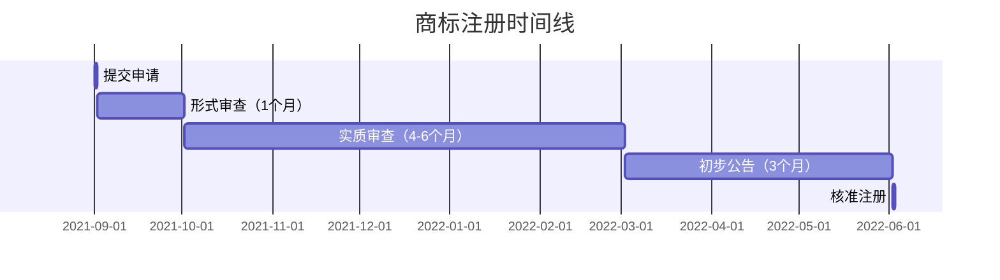
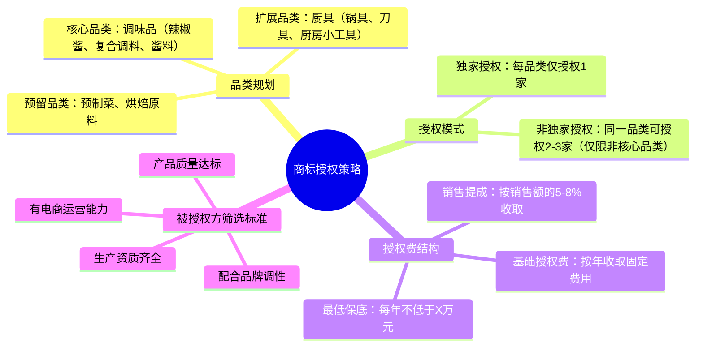
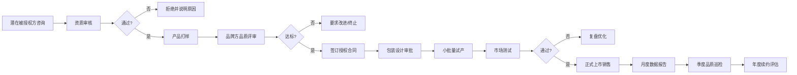

## 案例二：个人品牌的商标授权之路

> **案例核心：** 一位美食博主从零开始注册个人商标，通过品牌授权模式，用三年时间将一个自媒体账号发展为覆盖调味品、厨具、预制菜三大品类的授权品牌，年授权收入突破80万元。本案例完整还原个人品牌从内容积累到商标注册、从品类选择到授权体系搭建的全过程。

### 一、案例背景

#### 1.1 人物画像

| 维度 | 详情 |
|------|------|
| 化名 | 林小厨（女性，32岁） |
| 原职业 | 互联网公司产品经理，月薪1.5万 |
| 副业起步 | 2021年在小红书/抖音分享家常菜做法 |
| 粉丝规模 | 启动商标注册时粉丝约12万 |
| 核心能力 | 家常菜教学、食品知识科普、用户运营 |

#### 1.2 面临的核心问题

林小厨在副业做到一年时遇到典型的"内容创作者天花板"：

- **收入单一：** 全靠广告和带货佣金，月收入在8000-15000元之间波动
- **时间换钱：** 每天必须持续产出内容，停更一周收入立刻下滑30%
- **品牌不属于她：** 合作的品牌方随时可以更换达人，没有护城河
- **天花板明显：** 12万粉的体量，广告单价很难突破5000元/条

**关键转折点：** 一位调味品工厂老板主动找她合作，希望用她的名字做一款联名辣椒酱。这让她意识到——与其帮别人带货，不如让别人的产品挂自己的品牌。

#### 1.3 为什么选择商标授权？

商标授权相比其他变现方式的核心优势：

| 对比维度 | 广告带货 | 自有品牌（代工） | 商标授权 |
|----------|----------|------------------|----------|
| 启动资金 | 极低 | 10-50万（库存、生产） | 1-3万（注册费） |
| 库存风险 | 无 | 高（滞销、过期） | 无（授权方承担） |
| 时间投入 | 持续高强度 | 高（供应链管理） | 低（品牌维护即可） |
| 收入上限 | 受粉丝量限制 | 受资金和能力限制 | 受品牌影响力限制 |
| 边际成本 | 几乎为零 | 随规模增加 | 接近零 |
| 护城河 | 弱（可替代） | 强 | 最强（品牌资产） |

### 二、执行过程：从零到品牌授权的完整路径

#### 2.1 第一阶段：品牌定位与商标注册（第1-3个月）

**第一步：明确品牌定位**

林小厨没有直接注册商标，而是先花了一个月时间梳理品牌定位：

```text
品牌定位画布：
┌─────────────────────────────────────────┐
│  品牌名：林小厨                          │
│  定位语：让每个人都能做出餐厅级家常菜      │
│  目标人群：25-40岁城市上班族              │
│  品牌调性：温暖、实用、专业但不端着        │
│  核心价值：降低做饭门槛，提升生活品质      │
│  视觉风格：暖色调、手绘元素、食材实拍      │
└─────────────────────────────────────────┘
```

**为什么先定位后注册？** 因为商标注册类别（尼斯分类）的选择取决于品牌未来的商业方向。如果定位不清晰，可能注册错类别，后期补注成本翻倍。

**第二步：商标查询与类别选择**

林小厨在国家知识产权局商标局官网（https://sbj.cnipa.gov.cn/）进行了全面的近似查询：

| 拟注册类别 | 涵盖商品/服务 | 注册理由 |
|-----------|--------------|---------|
| 第29类 | 腌制食品、调味品、食用油 | 核心品类——辣椒酱、调味料 |
| 第30类 | 调味品、酱料、方便食品 | 扩展品类——复合调味料、预制酱包 |
| 第31类 | 新鲜蔬菜、鲜水果 | 预留——未来可能的生鲜品牌线 |
| 第35类 | 广告、商业管理 | 防御性注册——防止他人在电商店铺使用 |
| 第43类 | 餐饮服务 | 预留——未来可能的线下餐饮 |
| 第41类 | 教育、培训 | 防御——烹饪课程、厨艺培训 |

**商标查询实操要点：**

1. 在商标局官网"商标近似查询"中输入"林小厨"，筛选已注册和申请中的近似商标
2. 重点关注同类别中已有的"X小厨""林X厨"等近似商标
3. 如果有近似商标，需要评估驳回风险，必要时调整名称或增加显著性元素
4. 建议同时查询商标的拼音"linxiaochu"及英文变体

**查询结果：** "林小厨"在第29、30类无完全相同的已注册商标，但有"林氏小厨""小林厨房"等近似商标，风险评估为中等。

**第三步：委托代理提交申请**

| 项目 | 明细 |
|------|------|
| 代理机构 | 某知识产权代理公司（通过朋友推荐） |
| 注册类别 | 6个类别（29/30/31/35/41/43） |
| 官费 | 270元/类×6 = 1620元（网上申请优惠价） |
| 代理费 | 800元/类×6 = 4800元 |
| 总计 | 6420元 |
| 审查周期 | 约6-9个月（含实质审查） |

**商标注册的时间线：**



> **关键提醒：** 商标从提交申请到拿到注册证，正常周期为12-15个月。但商标法规定，申请日起即享有优先权，所以在审查期间就可以开始使用"TM"标识（表示商标正在申请中），拿到注册证后改为"®"标识。

#### 2.2 第二阶段：品牌内容建设与市场验证（第4-12个月）

商标注册在走流程的同时，林小厨并没有干等，而是同步进行了品牌内容的深度建设。

**第一，统一视觉识别系统（VI）**

她花了3000元请设计师制作了一套完整的品牌VI：

- **LOGO：** 一个戴着厨师帽的卡通女孩头像，手持锅铲
- **品牌色：** 暖橘色（#FF6B35）为主色，奶白色为辅色
- **字体：** 标题用手写体（体现亲和力），正文用思源黑体
- **包装风格：** 简约插画风，强调食材的真实感
- **统一模板：** 社交媒体封面、产品详情页、宣传物料模板

**为什么要这么早做VI？** 因为品牌授权的本质是卖"品牌感"。如果视觉体系不统一、不专业，潜在被授权方会觉得这个品牌"不值钱"，授权费自然上不去。

**第二，深化内容壁垒**

在等待商标注册的9个月里，林小厨做了三件关键的事：

1. **系列化内容：** 从散装菜谱变为系列化IP内容
   - "小厨实验室"——用科学原理解析烹饪技巧（如美拉德反应、蛋白质变性）
   - "一周不重样晚餐"——解决上班族"今天吃什么"的痛点
   - "食材百科"——从产地到选购到保存的完整知识

2. **用户社群运营：** 建立了3个微信群（每群约300人），定期做直播教学
   - 社群内的高频互动积累了大量用户反馈
   - 用户的真实需求成为后续选择授权品类的重要依据
   - 核心粉丝成为品牌的"种子用户"和口碑传播者

3. **供应链认知积累：** 主动走访了5家食品工厂
   - 了解调味品的生产流程、成本结构、利润空间
   - 建立了与工厂老板的信任关系
   - 明确了什么样的产品品质是自己能接受的底线

**第三，市场验证——先试水再All in**

在正式做商标授权之前，林小厨先做了一次小规模的市场测试：

- 与一家小型调味品工厂合作，用"林小厨推荐"（非授权品牌）的方式推出了一款联名辣椒酱
- 首批生产2000瓶，通过微信社群和小红书店铺销售
- 定价39.9元/瓶（280g），利润约12元/瓶
- 结果：3天售罄，复购率达到25%

这次试水验证了两件事：
1. 她的粉丝确实愿意为与她相关的产品付费（信任转移成立）
2. 调味品是一个值得深耕的品类（利润空间、复购率、物流成本都合理）

#### 2.3 第三阶段：搭建商标授权体系（第13-18个月）

拿到商标注册证后，林小厨正式开始搭建授权体系。

**第一步：制定授权策略**



**第二步：选择第一批被授权方**

林小厨选择了三家工厂作为第一批被授权方：

| 被授权方 | 品类 | 选择理由 | 授权费/年 | 销售提成 |
|----------|------|----------|-----------|---------|
| A食品厂 | 辣椒酱/酱料 | 试水合作过，品质可靠 | 5万 | 6% |
| B厨具公司 | 不锈钢锅具 | 抖音大厂牌代工厂，品质过硬 | 3万 | 5% |
| C调味品厂 | 复合调味料 | 有自主研发能力，能做定制配方 | 4万 | 6% |

**第三步：签订授权合同**

这是整个过程中最关键的环节。林小厨请了一位知识产权律师起草了标准的商标授权合同，核心条款包括：

**合同必备条款清单：**

| 条款 | 具体内容 | 重要性 |
|------|---------|--------|
| 授权范围 | 明确品类、地域、渠道限制 | ⭐⭐⭐⭐⭐ |
| 授权期限 | 1年一签（首年），后续可签2-3年 | ⭐⭐⭐⭐ |
| 授权费用 | 基础费+提成，双轨制 | ⭐⭐⭐⭐⭐ |
| 品质标准 | 产品必须通过国家质检，配方需经品牌方确认 | ⭐⭐⭐⭐⭐ |
| 包装审批 | 所有包装设计需品牌方书面审批 | ⭐⭐⭐⭐ |
| 销售数据 | 被授权方需每月提供销售数据报告 | ⭐⭐⭐⭐ |
| 违约条款 | 品质不达标、未经审批使用商标等情形的违约责任 | ⭐⭐⭐⭐⭐ |
| 终止条款 | 品牌方有权在品质问题发生时立即终止授权 | ⭐⭐⭐⭐⭐ |
| 竞业限制 | 被授权方不得同时为竞品品牌代工 | ⭐⭐⭐ |

**商标授权合同的核心结构：**

```text
商标许可使用合同

甲方（许可方）：林小厨（个人/公司名）
乙方（被许可方）：XX食品有限公司

第一条 许可商标
  - 商标名称：林小厨
  - 注册号：第XXXXXXX号
  - 核定使用商品：第29类……

第二条 许可方式
  - 独家/非独家许可
  - 许可期限：2023年1月1日至2023年12月31日
  - 许可地域：中国大陆地区
  - 许可渠道：线上电商渠道

第三条 许可费用
  - 基础许可费：人民币50000元/年
  - 销售提成：乙方销售额的6%
  - 最低保底销售额：人民币100万元/年
  - 支付方式：基础费按季度预付，提成按月结算

第四条 质量管理
  - 产品配方需经甲方书面确认
  - 产品需符合国家食品安全标准
  - 甲方有权随时抽检产品质量

第五条 包装与宣传
  - 所有包装设计需经甲方书面审批
  - 乙方不得擅自修改商标样式
  - 宣传物料需经甲方确认后使用

……
```

> **实战经验：** 很多个人品牌授权最大的坑在于"只管收费不管品质"。一旦被授权方的产品出了食品安全问题，受损的是整个品牌的信誉。林小厨的做法是——每季度亲自到工厂抽检一次，并要求被授权方提供第三方检测报告。

#### 2.4 第四阶段：品牌运营与规模扩张（第19-36个月）

**第一，建立品牌授权管理体系**

随着授权品类的增加，林小厨建立了一套标准化的管理流程：



**第二，品类扩展时间线**

| 时间节点 | 新增品类 | 被授权方 | 年授权费 |
|----------|---------|---------|---------|
| 第1年 | 辣椒酱/酱料 | A食品厂 | 5万+6%提成 |
| 第1年 | 复合调味料 | C调味品厂 | 4万+6%提成 |
| 第1年 | 不锈钢锅具 | B厨具公司 | 3万+5%提成 |
| 第2年 | 厨房小工具 | D五金厂 | 2万+5%提成 |
| 第2年 | 预制菜（冷藏） | E食品公司 | 6万+7%提成 |
| 第2年 | 烘焙原料 | F食品厂 | 3万+5%提成 |
| 第3年 | 围裙/厨房纺织品 | G纺织公司 | 1.5万+4%提成 |
| 第3年 | 收纳/厨房日用品 | H日用品厂 | 2万+5%提成 |

**第三，授权费收入演变**

| 阶段 | 时间 | 基础授权费/年 | 销售提成/年 | 合计年收入 |
|------|------|--------------|------------|-----------|
| 起步期 | 第1年 | 12万 | 约8万 | 约20万 |
| 成长期 | 第2年 | 23万 | 约27万 | 约50万 |
| 成熟期 | 第3年 | 28.5万 | 约52万 | 约80万 |

**第四，品牌影响力反哺内容**

商标授权体系搭建完成后，出现了一个意想不到的正循环：

- 产品销售带来新的用户关注（每件产品包装上都有林小厨的社交账号二维码）
- 用户购买产品后成为内容粉丝，反过来提升广告报价
- 品牌授权的"背书效应"让林小厨在行业内的影响力大幅提升
- 更多优质工厂主动寻求合作，谈判筹码增加

### 三、关键转折点与踩坑记录

#### 3.1 第一个坑：被授权方偷工减料

**事件：** 第1年中段，A食品厂在未经通知的情况下，将辣椒酱中的干辣椒替换为更便宜的品种，导致产品口感明显下降，用户差评率从3%飙升到15%。

**处理方式：**
1. 立即暂停该产品的线上销售链接
2. 要求A食品厂提供原料采购凭证
3. 确认违规后，依据合同扣除当季基础授权费作为违约金
4. 要求A食品厂在15天内恢复原配方，并提供第三方检测报告
5. 在社群中公开致歉并为已购买用户退款

**教训：** 品质管控不能只靠信任，必须有制度化的抽检机制。此后林小厨建立了"三重品控"体系：
- 被授权方自检（每批次出厂检验）
- 品牌方抽检（每季度一次，随机购买市场产品送检）
- 第三方机构年度审核（每年一次全面审核）

#### 3.2 第二个坑：商标被抢注关联类别

**事件：** 第2年，林小厨发现有人在第21类（厨房用具，包括非金属厨具）抢注了"林小厨"商标。而她注册的是第21类中的金属厨具，非金属部分（硅胶铲、竹木砧板等）未覆盖。

**处理方式：**
1. 委托律师向商标局提出异议申请（商标尚在公告期）
2. 提交在先使用证据（社交媒体内容、产品销售记录、品牌知名度证据）
3. 异议成功，对方商标未获准注册
4. 随后立即补充注册了第21类全品类

**教训：** 商标注册要尽可能覆盖关联类别，不要因为"暂时用不到"就省略。防御性注册的成本远低于事后维权的成本。

#### 3.3 第三个坑：授权费定价过低

**事件：** 第1年签的B厨具公司，授权费仅3万/年+5%提成。第2年发现，该公司的"林小厨"品牌锅具年销售额达到200万，她的提成收入10万，加上基础费3万，总计13万——而如果按市场行情（8-10%提成），她本应拿到16-20万。

**处理方式：** 合同到期后重新谈判，提成比例提升至7%，并增加了年销售额150万的保底条款。

**教训：** 首次授权不要因为急于成交而定低价。可以适当降低基础授权费，但提成比例一定要合理。建议参考同类品牌的授权费率，或者找专业的品牌评估机构出具估值报告。

### 四、成果数据

#### 4.1 第三年的核心经营数据

| 指标 | 数据 |
|------|------|
| 粉丝总量 | 52万（小红书28万+抖音24万） |
| 授权品类 | 8个品类，8家被授权方 |
| 授权商标数量 | 6个注册类别，2个正在申请 |
| 年基础授权费 | 28.5万元 |
| 年销售提成 | 约52万元 |
| 年品牌授权总收入 | 约80.5万元 |
| 被授权产品年销售总额 | 约750万元 |
| 品牌估值（第三方评估） | 约300万元 |

#### 4.2 与纯广告模式的收入对比

| 对比维度 | 纯广告模式（预估） | 商标授权模式（实际） |
|----------|-------------------|---------------------|
| 年收入 | 约25-35万 | 约80.5万 |
| 收入稳定性 | 波动大（受平台算法影响） | 稳定增长（合同锁定） |
| 每日工作时间 | 4-6小时（持续创作） | 1-2小时（日常维护） |
| 停更影响 | 停更1个月收入下降50% | 停更1个月收入不受影响 |
| 资产积累 | 几乎为零（粉丝不属于你） | 品牌估值300万+ |

#### 4.3 成本与利润结构

| 成本项目 | 年度金额 |
|----------|---------|
| 商标注册与维护费 | 约5000元 |
| 品牌VI设计与更新 | 约8000元 |
| 法律顾问费（合同审核） | 约15000元 |
| 品质抽检费用 | 约12000元 |
| 差旅（工厂巡检） | 约10000元 |
| 其他杂项 | 约5000元 |
| **总成本** | **约55000元** |
| **净利润** | **约75万元** |
| **净利润率** | **约93%** |

### 五、经验总结：个人品牌商标授权的方法论

#### 5.1 商标授权成功的核心公式

```text
商标授权收入 = 品牌影响力 × 品类数量 × 授权费率 × 被授权方运营能力
```

四个变量缺一不可：
- **品牌影响力**决定了能收多少授权费
- **品类数量**决定了收入的宽度
- **授权费率**决定了每笔交易的利润
- **被授权方运营能力**决定了实际销售额（提成收入的基础）

#### 5.2 适合做商标授权的个人品牌特征

不是所有个人品牌都适合走商标授权路线。适合的品牌需要具备：

| 特征 | 说明 | 不适合的情况 |
|------|------|-------------|
| 明确的品类关联 | 品牌名天然与某个品类关联 | 品牌名太抽象、品类不明确 |
| 粉丝信任度高 | 粉丝愿意为品牌溢价付费 | 粉丝黏性低、关注出于偶然 |
| 可标准化生产 | 产品可以通过工厂标准化生产 | 高度定制化、无法量产 |
| 品类可延展 | 从核心品类可以自然延展到周边品类 | 品类过于垂直、无法扩展 |
| 持续内容输出 | 有持续创作能力维持品牌热度 | 无法保持更新频率 |

#### 5.3 商标授权的法律风险清单

| 风险类型 | 风险描述 | 防范措施 |
|----------|---------|---------|
| 品质风险 | 被授权方产品质量出问题 | 三重品控体系+合同违约条款 |
| 商标淡化 | 过度授权导致品牌价值稀释 | 控制品类数量，宁缺毋滥 |
| 商标侵权 | 他人抢注关联类别或仿冒 | 防御性注册+定期监控 |
| 合同纠纷 | 被授权方拖欠提成或超范围使用 | 合同条款细化+定期审计 |
| 声誉风险 | 被授权方的负面新闻牵连品牌 | 签约前尽职调查+危机公关预案 |

#### 5.4 个人品牌商标授权的十个实操建议

1. **先注册再授权：** 商标必须拿到注册证后再进行正式授权，在此之前可以用"品牌推荐"的方式试水
2. **品类宁少勿多：** 首批授权控制在2-3个品类，验证模式后再扩展
3. **选择被授权方看"人品"：** 工厂老板的诚信和品质意识比工厂规模更重要
4. **首年合同签短期：** 第一年签1年合同，双方都有退出的灵活性
5. **提成比例不低于5%：** 低于5%的提成在扣除管理成本后几乎无利可图
6. **一定要有保底条款：** 最低年销售额或最低授权费，防止被授权方"占着茅坑不拉屎"
7. **包装审批权必须握在手里：** 品牌视觉的统一性是品牌价值的基石
8. **定期抽检不能省：** 品质是品牌的生命线，抽检费用是必要的投资
9. **不要把所有鸡蛋放在一个篮子里：** 同一品类至少要有备选的被授权方
10. **持续提升品牌影响力：** 内容创作不能停，品牌热度是授权费的根基

#### 5.5 从个人品牌到公司化运营

当授权收入稳定在50万/年以上时，建议进行公司化运营：

| 维度 | 个人模式 | 公司化模式 |
|------|---------|-----------|
| 法律主体 | 个人（以个人名义签合同） | 公司（以公司名义签合同） |
| 税务 | 个人所得税（最高45%） | 企业所得税（25%）+分红（20%） |
| 品牌资产归属 | 个人名下（离婚/继承有风险） | 公司名下（可估值、可融资、可转让） |
| 团队管理 | 一人全包 | 可招聘专人管理品控、法务、运营 |
| 融资可能性 | 极低 | 可通过品牌估值进行融资 |

**建议的公司化路径：**
1. 注册一家个人独资企业或有限责任公司
2. 将商标从个人名下转让到公司名下
3. 以公司名义签订新的授权合同
4. 逐步搭建小团队（品控1人+运营1人即可）

### 六、常见误区与纠正

#### 误区一："有了粉丝就能做商标授权"

**现实：** 粉丝数量不等于品牌价值。一个100万粉丝但内容杂乱的账号，品牌价值可能不如一个10万粉丝但定位清晰、粉丝信任度高的账号。商标授权的核心是品牌的"品类联想度"——用户看到你的品牌名，是否能立刻联想到某个具体品类。

#### 误区二："商标注册了就可以躺着收钱"

**现实：** 商标注册只是起点，不是终点。品牌需要持续的内容运营来维持热度，需要严格的品质管控来维护信誉，需要专业的法律支持来防范风险。商标授权是一种"轻资产运营"，但绝不是"无管理运营"。

#### 误区三："授权费越高越好"

**现实：** 过高的授权费会吓跑优质的被授权方。更合理的做法是设置适中的基础授权费+有激励性的提成比例——让被授权方有动力把销售额做大，你的提成收入自然水涨船高。

#### 误区四："授权品类越多越好"

**现实：** 品类过度扩展会导致品牌价值稀释。一个做美食的博主突然授权了运动器材，消费者会困惑——"这个品牌到底代表什么？"品类扩展应该遵循"同心圆"逻辑：从核心品类逐步向相邻品类扩展，每次扩展都要让消费者觉得"合理"。

#### 误区五："个人品牌不值得注册商标"

**现实：** 很多个人创作者认为"我就是一个小博主，注册商标太夸张了"。但事实是，商标注册的成本（约2000-5000元/类）相对于其保护的品牌价值来说微乎其微。等你做大了再去注册，可能已经被人抢注了——维权成本远高于注册成本。

### 七、进阶：品牌授权的高级玩法

#### 7.1 分级授权体系

当品牌成熟后，可以建立分级授权体系：

| 级别 | 授权条件 | 年费 | 提成 | 权益 |
|------|---------|------|------|------|
| 铂金合作伙伴 | 年销售额500万+，合作3年以上 | 15万 | 8% | 独家品类权、新品优先权 |
| 金牌合作伙伴 | 年销售额200万+，合作2年以上 | 8万 | 7% | 品牌联名权、营销资源支持 |
| 银牌合作伙伴 | 年销售额100万+，合作1年以上 | 5万 | 6% | 标准授权、定期培训 |
| 新锐合作伙伴 | 新加入的被授权方 | 3万 | 5% | 基础授权、季度评估 |

#### 7.2 品牌授权+联名的混合模式

商标授权并不意味着品牌方完全不参与产品开发。更高级的玩法是"授权+联名"：

- **品牌方主导产品研发：** 由林小厨团队提出产品概念和配方方向
- **被授权方负责生产：** 工厂负责生产、质检、物流
- **联名款溢价更高：** 带有"林小厨亲调""林小厨监制"标识的产品，定价可比普通授权产品高20-30%
- **联名款的提成比例更高：** 通常在10-15%

#### 7.3 品牌资产证券化

当品牌估值达到一定规模（通常500万以上），可以考虑更高级的资本运作：

- **品牌质押融资：** 以商标作为质押物向银行申请贷款
- **品牌入股：** 以品牌估值作为出资，与工厂成立合资公司
- **品牌授权收入证券化：** 将未来的授权费收入打包为金融产品（目前在国内尚不成熟，但在欧美市场已有先例）

> **案例心法：** 个人品牌的商标授权之路，本质上是一条从"卖时间"到"卖品牌"的转型之路。内容创作者最大的资产不是粉丝数量，而是粉丝对你品牌的信任。商标注册保护了这份信任的法律载体，授权体系则将这份信任转化为可持续的商业收入。越早开始品牌化运营，未来的复利效应越大。
