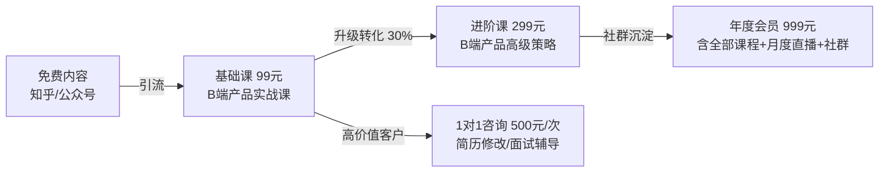
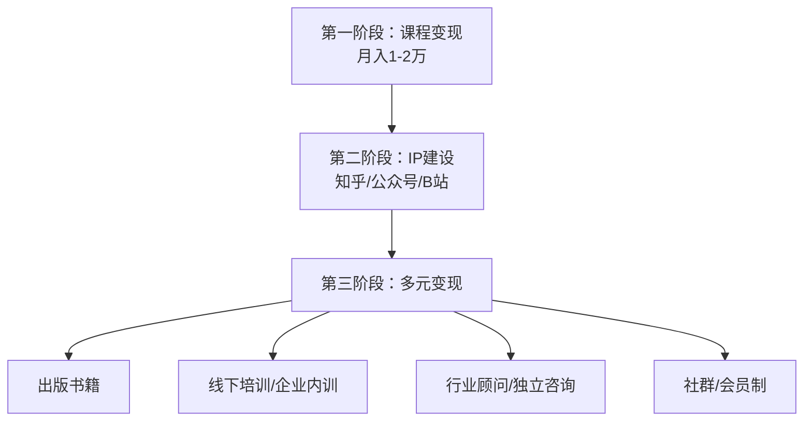

## 案例三：知识付费课程的从0到1

### 案例概览

本案例记录了一位拥有5年产品经理经验的职场人林晨（化名），如何在不辞职的前提下，用6个月时间从零开始打造一门知识付费课程，最终实现月均收入1.2万元、累计学员超800人的完整过程。这个案例的价值在于：它不是天赋异禀者的一夜暴富，而是一个普通人通过系统方法论完成知识产权从0到1积累的真实路径。

### 案例背景

#### 人物画像

| 维度 | 具体信息 |
|------|----------|
| 年龄 | 29岁 |
| 职业 | 某互联网公司B端产品经理，工龄5年 |
| 副业基础 | 零副业经验，未运营过任何自媒体账号 |
| 可支配时间 | 工作日晚上1-2小时，周末半天 |
| 启动资金 | 不超过2000元（主要用于设备和平台费用） |
| 核心优势 | 有丰富的B端产品从0到1经验，擅长将复杂流程拆解为可执行步骤 |

#### 为什么选择知识付费课程

林晨评估了三种常见的知识产权变现方式：

| 变现方式 | 门槛 | 启动周期 | 收入上限 | 适合度 |
|----------|------|----------|----------|--------|
| 技术专利授权 | 极高（需要创新性技术成果） | 1-3年 | 极高 | 不适合——产品经理岗位难以产出专利 |
| 出版书籍 | 中等（需要写作能力和出版社资源） | 6-12个月 | 中等 | 可考虑——但周期太长，且新人版税低 |
| 在线课程 | 较低（有实战经验即可） | 1-3个月 | 较高（可无限复制） | 最适合——经验即产品，边际成本趋近于零 |

最终选择在线课程的核心逻辑：**经验本身就是知识产权，课程是将其产品化的最低门槛方式。**

### 第一阶段：市场调研与选题定位（第1-2周）

#### 调研方法

林晨没有凭直觉选题，而是用了三步验证法：

**第一步：需求采集（3天）**

他在以下渠道搜集目标用户的痛点：

- **知乎**：搜索"产品经理 入门""B端产品 经验"等关键词，记录高赞回答下方的评论区提问（这些是用户最真实的需求信号）
- **脉脉/拉勾**：查看产品经理岗位的JD（职位描述），提炼企业最看重的技能项
- **行业社群**：加入3个产品经理微信群，潜水观察新手提问的高频问题

采集到的核心痛点按频次排列：

```text
痛点排名：
1. "不知道怎么写PRD文档"         —— 出现频次：47次
2. "不会做需求分析和优先级排序"    —— 出现频次：39次
3. "面试时被问到项目细节讲不清楚"  —— 出现频次：35次
4. "从0到1的产品该怎么启动"       —— 出现频次：28次
5. "跨部门沟通总是推不动"          —— 出现频次：22次
```

**第二步：竞品分析（2天）**

在得到、知乎Live、荔枝微课、小鹅通等平台搜索同类课程，分析了12门竞品：

| 分析维度 | 发现 |
|----------|------|
| 价格区间 | 9.9元-399元，主流价位49-199元 |
| 课程时长 | 大多数3-8小时，碎片化严重 |
| 内容深度 | 多数停留在"是什么"层面，缺少"怎么做"的实操演示 |
| 差评共性 | "太理论""没有实操案例""内容网上都能搜到" |
| 市场空白 | 缺少以真实B端项目为线索、手把手演示全流程的课程 |

**第三步：最小化验证（3天）**

林晨没有直接开始录课，而是先用最低成本验证需求：

1. 在知乎写了一篇3000字的回答《B端产品经理如何从0到1做一个项目》，获得2300个赞同和89条评论
2. 在回答末尾留了一个问卷链接，收集到43份有效问卷，其中37人表示愿意付费学习更系统的内容
3. 在产品经理社群发布了一份免费的"PRD模板+填写说明"PDF，2小时内被下载156次

**验证结论**：市场需求真实存在，且用户愿意为"实操性强"的内容付费。

#### 最终选题

经过三步验证，林晨确定了课程主题：

> **《B端产品经理实战课：从需求分析到产品上线的全流程》**
> 目标用户：0-3年经验的产品经理、想转行做产品的人
> 核心卖点：以一个真实B端项目为主线，手把手演示全流程
> 定价：99元（首发优惠价69元）

### 第二阶段：课程设计与内容制作（第3-8周）

#### 课程大纲设计

林晨采用"金字塔结构"设计大纲，遵循一个核心原则：**每一节课都必须让学生学到一个可以立即使用的具体技能。**

```mermaid
graph TD
    A[B端产品经理实战课] --> B[模块一：认知篇]
    A --> C[模块二：需求篇]
    A --> D[模块三：设计篇]
    A --> E[模块四：协作篇]
    A --> F[模块五：上线篇]
    A --> G[模块六：求职篇]

    B --> B1[B端vsC端的本质差异]
    B --> B2[B端产品经理的核心能力模型]
    B --> B3[行业选型：SaaS/电商/金融/教育]

    C --> C1[如何做客户调研]
    C --> C2[需求分析的4个维度]
    C --> C3[需求优先级：RICE模型实战]
    C --> C4[PRD文档撰写手把手教学]

    D --> D1[信息架构设计]
    D --> D2[原型设计的效率工具]
    D --> D3[交互设计的核心原则]

    E --> E1[与开发沟通的5个技巧]
    E --> E2[如何推动跨部门协作]
    E --> E3[项目管理：从排期到验收]

    F --> F1[灰度发布的策略]
    F --> F2[数据埋点与效果验证]
    F --> F3[上线后的迭代节奏]

    G --> G1[产品经理简历怎么写]
    G --> G2[面试中的项目阐述方法]
    G --> G3[作品集的制作技巧]
```



#### 内容制作流程

**脚本撰写（3周）**

每节课的脚本结构：

```text
1. 引入（1-2分钟）
   - 抛出一个真实场景问题
   - 说明这节课的学完后能解决什么问题

2. 核心讲解（8-12分钟）
   - 方法论讲解（不超过3分钟）
   - 实操演示（至少5分钟，用真实项目截图/文档演示）

3. 案例对比（3-5分钟）
   - 展示一个错误做法 vs 正确做法的对比
   - 说明为什么这样做更好

4. 本课行动清单（1分钟）
   - 给出3条课后可立即执行的具体动作
```

林晨共撰写了24节课的完整脚本，总计约6.8万字。每节课平均2800字脚本，对应12-15分钟的视频时长。

**录屏与剪辑（2周）**

设备清单与投入：

| 设备/工具 | 用途 | 费用 |
|-----------|------|------|
| MacBook Pro自带麦克风 | 录制旁白（后期升级为罗德NT-USB Mini） | 0元（后升级800元） |
| OBS Studio | 屏幕录制 | 0元（开源） |
| 剪映专业版 | 视频剪辑 | 0元 |
| ProcessOn/墨刀 | 绘制流程图和原型 | 0元（免费版） |
| Canva | 制作课程封面和PPT | 0元（免费版） |
| 小鹅通 | 课程托管和销售 | 4800元/年（基础版） |

**总启动成本：约5280元**（含小鹅通年费和麦克风升级）。

录制技巧总结：
- 每天固定晚上9:00-11:00录制，保持声音状态一致
- 每节课分3-4段录制，降低出错重录的成本
- 剪辑时加入字幕和关键画面标注，提升观看体验
- 先录完全部课程再上线，避免边录边卖导致后期质量下降

### 第三阶段：冷启动与首批用户获取（第9-14周）

#### 冷启动策略

林晨采用了"免费内容引流+私域转化"的策略，而非直接投广告：

**渠道一：知乎内容矩阵（主力渠道）**

| 执行动作 | 具体做法 | 效果 |
|----------|----------|------|
| 长文回答 | 每周发布2-3篇1500字以上的高质量回答 | 累计获得1.2万赞同 |
| 专栏文章 | 每周发布1篇3000字以上的深度文章 | 累计阅读量8.6万 |
| 评论区互动 | 每条有价值的评论都认真回复 | 评论区转化率约3% |
| 个人简介 | 放置课程链接和免费资料包领取方式 | 每日引流30-50人到微信 |

关键技巧：**每篇内容都遵循"给干货+留钩子"模式**——正文中提供70%的核心方法论，在文末引导"想要完整的模板和实操演示，可以看看我的系统课程"。

**渠道二：微信社群裂变**

- 建立"产品经理成长营"免费社群
- 入群条件：转发课程海报到朋友圈（实际带来约40%的新用户增长）
- 群内每周三晚上做一次免费直播答疑（每次30-45分钟）
- 直播中自然穿插课程内容介绍，转化率约8%

**渠道三：老学员转介绍**

设计了阶梯式奖励机制：

```text
推荐1人购买：返现10元
推荐3人购买：返现40元 + 赠送进阶课程代金券
推荐5人购买：返现70元 + 免费获得进阶课程
```

#### 首批销售数据

| 时间节点 | 累计销量 | 累计收入 | 关键动作 |
|----------|----------|----------|----------|
| 第1周（上线首周） | 23人 | 1587元 | 朋友圈+社群首发，69元优惠价 |
| 第2周 | 41人 | 2829元 | 知乎第一篇推荐文发布 |
| 第1个月 | 89人 | 6141元 | 知乎回答开始获得搜索流量 |
| 第2个月 | 156人 | 10764元 | 第一批学员口碑传播开始 |
| 第3个月 | 247人 | 17043元 | 恢复原价99元，利润率提升 |

### 第四阶段：迭代优化与规模化（第15周-第24周）

#### 根据数据优化课程

林晨通过三个数据维度持续优化：

**维度一：完课率分析**

通过小鹅通后台的数据，他发现：

```text
完课率分布：
模块一（认知篇）：92%   ← 完课率最高，说明内容通俗易懂
模块二（需求篇）：78%   ← 正常水平
模块三（设计篇）：61%   ← 有下降，部分学员反馈"原型设计部分太快"
模块四（协作篇）：73%
模块五（上线篇）：58%   ← 最低，"数据埋点"章节跳出率最高
模块六（求职篇）：85%   ← 实用性强，完课率回升
```

优化动作：
- 模块三增加2节补充视频，将原型设计的演示速度放慢、步骤拆分更细
- 模块五的"数据埋点"章节重录，增加了一个完整的埋点方案文档作为配套资料
- 优化后，模块三完课率提升到76%，模块五提升到69%

**维度二：用户反馈收集**

每10个学员进行一次1对1回访，共回访了约80人，核心反馈汇总：

| 反馈类型 | 占比 | 具体内容 | 处理方式 |
|----------|------|----------|----------|
| 正面 | 62% | "实操演示很详细""PRD模板直接能用" | 在课程介绍页引用为学员证言 |
| 改进建议 | 25% | "希望增加面试模拟""缺少进阶内容" | 增加面试模块+开发进阶课程 |
| 负面 | 13% | "语速偏快""个别案例太老" | 调整语速+更新案例 |

**维度三：转化漏斗分析**

```text
知乎内容曝光 → 个人主页访问 → 微信添加 → 课程页面浏览 → 购买
100%          → 12%           → 4.5%      → 3.2%          → 1.8%

优化后（3个月后）：
100%          → 18%           → 7.2%      → 5.1%          → 3.4%
```

关键优化动作：
- 知乎个人主页重新设计，突出"实战经验"和"学员数据"
- 微信添加后的自动欢迎语优化，包含免费资料包（提升信任感）
- 课程详情页增加学员评价和学习成果展示

#### 进阶产品线搭建

基于核心课程的学员需求，林晨逐步搭建了产品矩阵：



### 成果数据

#### 核心指标对比

| 指标 | 第1个月 | 第3个月 | 第6个月 |
|------|---------|---------|---------|
| 月收入 | 6,141元 | 10,764元 | 12,350元 |
| 累计学员 | 89人 | 247人 | 812人 |
| 课程复购率（购买进阶课） | 0% | 18% | 31% |
| 知乎粉丝 | 320人 | 2,100人 | 5,800人 |
| 微信私域人数 | 150人 | 680人 | 1,850人 |
| 月均工作时长 | 45小时 | 35小时 | 25小时 |

#### 收入构成（第6个月）

| 收入来源 | 金额 | 占比 |
|----------|------|------|
| 基础课程销售 | 5,200元 | 42% |
| 进阶课程销售 | 3,800元 | 31% |
| 1对1咨询 | 1,500元 | 12% |
| 年度会员续费 | 1,850元 | 15% |
| **合计** | **12,350元** | **100%** |

#### 投入产出比

```text
总投入（6个月）：
  设备和工具：5,280元
  时间成本：约780小时（按产品经理时薪100元折算 = 78,000元）
  显性成本合计：5,280元

总产出（6个月）：
  累计收入：52,680元
  知乎粉丝：5,800人（内容资产）
  私域用户：1,850人（持续变现基础）
  课程内容：1套完整课程体系（可长期复用）

显性投入产出比：52,680 / 5,280 = 9.98倍
时薪计算：52,680 / 780 = 67.5元/小时（高于本职时薪的60%，且随时间递增）
```

### 关键转折点与踩坑记录

#### 转折点一：从"想做"到"开始做"（第1周）

林晨坦言，最困难的不是技术问题，而是心理门槛："我一个普通打工人，凭什么教别人？"最终推动他行动的是一个认知转变——**你不需要是行业顶尖，你只需要比目标学员领先2-3年。** 0-3年经验的产品经理需要的不是行业大佬的方法论，而是一个"过来人"的真实经验。

#### 转折点二：定价从49元调整到99元（第3周）

最初林晨计划定价49元，但在调研中发现：定价过低反而会降低用户信任感，因为"便宜没好货"的心理在知识付费领域同样适用。最终定价99元，首周优惠69元。数据证明，恢复原价后销量并未明显下降（周均销量从32人降到28人），但单笔收入提升了43%。

#### 踩坑一：急于上线导致返工

原计划6周完成全部课程，实际花了10周。主要原因是在录制过程中不断发现更好的讲解方式，导致前几节课重录了2次。教训：**先用文字脚本完成全部课程的逻辑验证，再开始录制。** 如果发现某个知识点讲解不通顺，修改文字脚本的成本远低于重录视频。

#### 踩坑二：忽视售后导致退款

上线首月退款率为8%，远高于行业平均的3-4%。原因是有学员购买后发现"不是手把手教你做产品，而是讲方法论"，期望不匹配。改进措施：
- 在课程详情页增加"适合人群/不适合人群"说明
- 增加试看章节（免费开放前2节课）
- 购买后7天内无理由退款

改进后退款率降到2.5%。

#### 踩坑三：内容被搬运

上线第3个月，林晨发现某闲鱼卖家以19.9元的价格出售他的课程录屏。应对措施：
- 在视频中加入半透明水印（学员ID+手机号后4位）
- 在小鹅通后台开启防录屏功能
- 向闲鱼平台发起投诉（3个工作日内下架）
- 在社群中提醒学员：购买盗版无法获得售后服务和社群权益

### 经验总结与方法论提炼

#### 知识付费课程从0到1的核心公式

```text
成功 = 真实经验 × 市场验证 × 系统化包装 × 持续迭代
```

四个要素缺一不可：
- **真实经验**：你必须做过这件事，而不是"学过"或"看过"
- **市场验证**：先用免费内容测试需求，不要闷头做课
- **系统化包装**：散点经验需要结构化，才能成为可交付的产品
- **持续迭代**：课程不是一次性产品，需要根据数据和反馈持续优化

#### 给准备做知识付费课程的人的10条建议

1. **先做调研再做课。** 至少花1周时间在目标用户聚集的平台搜集真实痛点，不要凭想象选题。
2. **用免费内容验证需求。** 写3-5篇相关内容，看是否有自然流量和用户互动，再决定是否做课。
3. **一门课解决一个核心问题。** 不要贪多，"产品经理入门到精通"不如"B端产品PRD撰写实战"有吸引力。
4. **脚本先行，录制在后。** 先写完整脚本，找2-3个目标用户试读，确认逻辑通顺再录制。
5. **实操演示是核心竞争力。** 用户付费买的不是"知识"（网上都能搜到），而是"你怎么做的"。
6. **定价不要太低。** 49元以下的课程容易被当成"廉价品"，99-199元是比较好的起步价位。
7. **先做私域再做公域。** 前100个学员最好通过私域（朋友圈、社群）获取，方便收集深度反馈。
8. **数据驱动优化。** 关注完课率、退款率、复购率三个核心指标，用数据指导迭代方向。
9. **建立产品矩阵。** 一门课的天花板有限，用"免费内容→低价课→高价课→咨询服务"形成变现阶梯。
10. **坚持6个月再评估。** 知识付费是慢生意，前3个月可能只有几百元收入，6个月后才能看到复利效应。

#### 知识付费课程的常见误区

| 误区 | 正确认知 |
|------|----------|
| "我必须是行业顶尖才能做课" | 你只需要比目标学员领先2-3年，"过来人"的经验比"专家"的理论更接地气 |
| "课程越长越有诚意" | 用户要的是"学到东西"而不是"听课时长"，24节课比60节课完课率高3倍 |
| "录好课就能卖出去" | 内容制作只占30%的工作量，推广和运营占70% |
| "价格越低越好卖" | 过低的定价降低信任感，且难以覆盖推广成本 |
| "做一次就够了" | 知识更新迭代很快，课程至少每半年更新一次 |
| "盗版会毁掉我的生意" | 盗版用户本来就不会付费，正版用户买的是售后服务和社群权益 |

### 进阶思考：从课程到IP

林晨在第6个月之后的发展路径，代表了知识付费从业者的典型进阶方向：



从一门课程出发，逐步构建个人IP，最终实现多渠道变现——这是知识付费从业者从"副业收入"跨越到"事业收入"的关键路径。林晨在第8个月开始筹备出书，第10个月接到了第一个企业内训邀请（单次收费8000元），第12个月将课程体系扩展为"B端产品经理成长学院"，月收入稳定在2.5万元以上。

这个案例证明：**知识付费课程不是终点，而是知识产权变现的起点。** 一门打磨精良的课程，既是直接的收入来源，也是构建个人品牌、撬动更高价值变现机会的杠杆。
