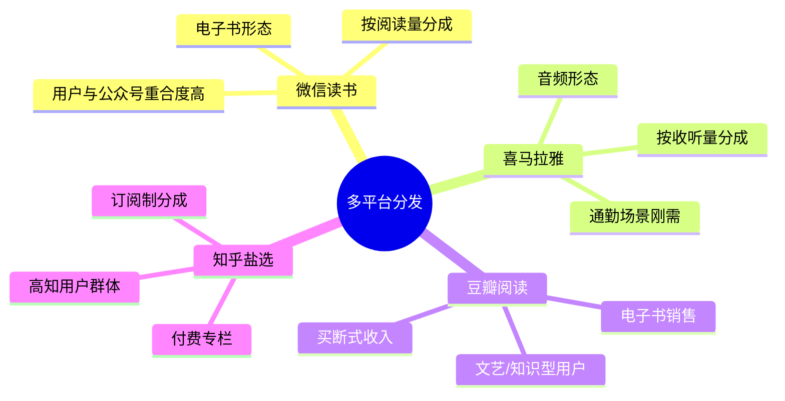
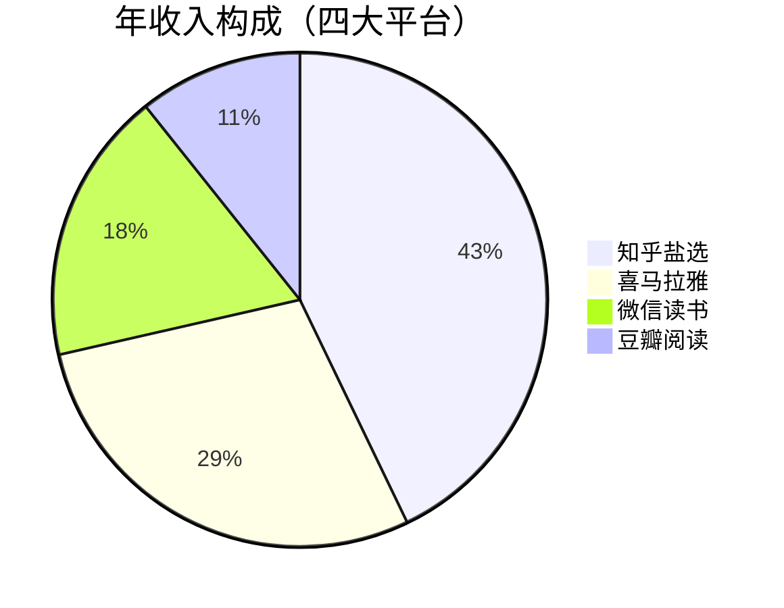
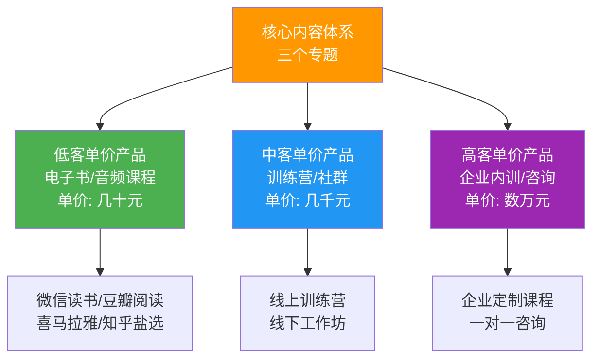
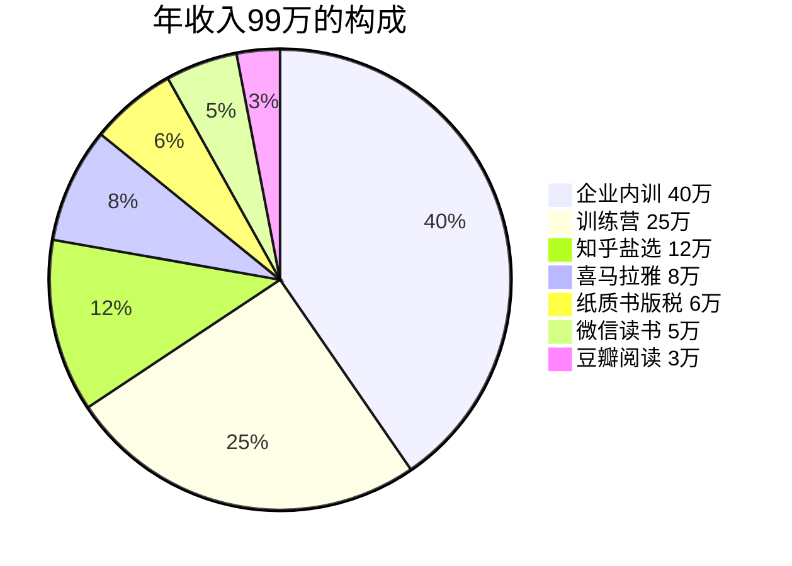
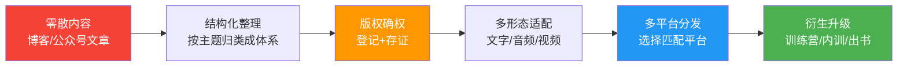

## 案例四：版权内容的多平台分发

### 案例背景：为什么"一份内容只发一个平台"是最大的浪费？

大多数内容创作者的变现模式是线性的：写一篇文章发一个平台，做一个课程卖一个渠道。这种"一锤子买卖"模式存在三个致命问题：

1. **收入天花板低**——单平台的流量和用户付费意愿有限，收入增长依赖持续产出新内容
2. **平台依赖风险**——一旦平台调整算法或政策，收入可能断崖式下跌
3. **内容价值被低估**——优质内容的边际复制成本几乎为零，但创作者只在一个渠道收取了一次费用

**多平台分发的本质是：将同一套核心内容的知识产权，在不同平台、不同形式、不同场景下进行多次授权变现。** 这不是简单的"搬运"，而是基于每个平台的用户特征和内容形态，对核心内容进行适配性再包装。

本案例的主角陈先生，一名财经领域的公众号博主，用三年时间将一套核心理财内容体系扩展到6个平台、4种内容形态，实现年收入99万元。他的经历完整呈现了从"内容创作→版权确权→多平台授权→衍生产品开发"的全链路操作。

---

### 第一阶段：内容积累与版权化（第1-6个月）

#### 1.1 选题定位：找到可复用的内容内核

陈先生并非一开始就有"多平台分发"的意识。他的起点是公众号"陈Sir理财课"，每天更新一篇1500-2000字的理财科普文章。做了8个月、积累了5万粉丝后，他发现一个规律：**阅读量最高的文章集中在三个主题上**：

| 主题方向 | 代表文章 | 阅读量 | 用户留言关键词 |
|----------|----------|--------|----------------|
| 个人理财入门 | 《月薪5000如何存下第一桶金》 | 8.2万 | "适合新手""讲得明白" |
| 基金投资实操 | 《定投3年，我的真实收益复盘》 | 6.7万 | "具体怎么选""求教程" |
| 家庭财务规划 | 《30岁家庭保险怎么买不踩坑》 | 5.4万 | "能不能出书""太有用了" |

这些高频互动的数据信号说明：用户不是只想看一篇文章，而是希望获得**系统化的知识体系**。这就是内容版权化的核心前提——内容必须从"零散文章"升级为"结构化产品"。

#### 1.2 内容结构化：从文章到课程体系

陈先生用了两个月时间，将过去一年的120篇文章进行系统梳理，最终整理成三个内容专题：

**专题一：《个人理财入门20讲》**
- 定位：零基础小白，从认识货币到建立储蓄习惯
- 结构：20个独立章节，每章围绕一个核心概念
- 特点：大量生活化案例，每讲配一个实操练习

**专题二：《基金投资实战指南》**
- 定位：有一定储蓄基础，想学习投资的上班族
- 结构：15个章节，从基金分类到组合配置
- 特点：附带真实持仓记录和收益回测数据

**专题三：《家庭财务规划手册》**
- 定位：已婚有娃家庭，需要系统规划保险、教育金、养老
- 结构：12个章节，按人生阶段划分
- 特点：提供可下载的Excel模板和清单

> **关键操作：** 陈先生不是简单地把文章合在一起。他重新设计了每个专题的逻辑框架，补充了过渡章节和总结部分，使内容从"文章合集"变成了"自成体系的课程"。这是版权化的核心步骤——结构化的作品比零散文章的版权价值高出数倍。

#### 1.3 版权登记：为授权打下法律基础

三个专题整理完成后，陈先生做了两件事：

**第一，进行版权登记。** 他通过中国版权保护中心（[www.ccopyright.com.cn](https://www.ccopyright.com.cn)）为三个专题分别进行了作品著作权登记。登记流程如下：

登记费用：文字作品每件100-300元，三个专题总计约600元。这笔钱是整个商业模式中最划算的投资——有了登记证书，后续的平台授权才有法律依据，遇到侵权才能有效维权。

**第二，保留原始创作证据。** 除了正式登记外，陈先生还做了以下保全措施：
- 将所有原始稿件（含创作时间戳）上传至可信时间戳平台（[www.tsa.cn](https://www.tsa.cn)）
- 将稿件通过邮件发送给自己（邮件服务器的时间戳可作为辅助证据）
- 在区块链存证平台进行了哈希值存证（免费或低成本）

> **常见误区：** 很多创作者认为"我原创的内容天然有版权，不需要登记"。理论上没错，但在实际授权和维权中，没有登记证书会大大增加举证难度。平台方在接受授权合作时，通常也要求提供版权登记证书。600元的登记费，换来的是每年数十万收入的法律保障。

---

### 第二阶段：多平台授权策略（第7-18个月）

#### 2.1 平台选择逻辑：不是所有平台都值得入驻

陈先生没有盲目追求"全平台覆盖"，而是根据四个维度筛选平台：

| 评估维度 | 评估标准 | 权重 |
|----------|----------|------|
| 用户匹配度 | 平台用户画像是否与内容受众重合 | 30% |
| 分成机制 | 平台的分成比例和结算周期 | 25% |
| 内容形态适配 | 内容是否适合在该平台以特定形式呈现 | 25% |
| 运营成本 | 需要投入的时间和精力 | 20% |

经过调研和测试，他最终锁定了四个首发平台：

#### 2.2 微信读书：电子书上架实操

**合作模式：** 微信读书接受个人作者投稿，采用"按阅读量分成"模式。作者将作品上传后，微信读书根据有效阅读页数向作者支付分成。

**实操步骤：**

1. **注册微信读书创作者账号**——访问微信读书创作者平台，完成实名认证
2. **作品排版**——将Word稿件转换为epub格式（推荐使用Sigil或Calibre工具）
3. **上传作品**——填写书名、简介、分类、封面图等元信息
4. **审核上架**——平台审核周期约3-7个工作日
5. **数据追踪**——通过创作者后台查看每日阅读量和收入数据

**关键经验：**
- 封面设计很重要。陈先生最初用简陋的自制封面，阅读转化率很低。后来花500元请设计师重新设计了三个专题的封面，阅读量提升了约40%
- 每个专题的定价策略不同：入门级内容免费开放（引流），进阶内容付费（变现）
- 定期更新内容版本，保持作品在平台上的活跃度

**年收入：约5万元。** 主要来自《基金投资实战指南》和《家庭财务规划手册》的分成，入门级内容以免费为主，目的是将微信读书的用户导入公众号和后续的高价产品。

#### 2.3 喜马拉雅：从文字到音频的形态转换

**合作模式：** 喜马拉雅接受音频课程的上传，采用"按收听量分成"和"付费订阅"两种模式。

**形态转换的核心挑战：** 文字内容不能简单地"朗读一遍"就变成音频。音频需要满足三个要求：
- **口语化**——书面语的长句在音频中会让听众走神
- **节奏感**——每5-8分钟需要一个"钩子"来维持注意力
- **音质标准**——背景噪音、口水音、气息声都需要处理

**陈先生的做法：**

1. **内容改编**——请了一位文案编辑，将三个专题的文字内容改编为口语化脚本，每个章节控制在8-12分钟
2. **录制**——在家中搭建了一个简易录音环境（隔音棉+电容麦克风+防喷罩，总投入约800元）
3. **后期处理**——使用Audacity（免费）进行降噪、压缩、标准化处理
4. **上传发布**——通过喜马拉雅创作者中心上传，每个专题作为一个专辑

**成本与收益分析：**

| 项目 | 投入 | 说明 |
|------|------|------|
| 录音设备 | 800元 | 一次性投入 |
| 文案改编 | 3000元 | 外包给兼职编辑 |
| 录制+后期 | 40小时 | 自己完成 |
| **总投入** | **3800元+40小时** | |
| **年收入** | **8万元** | 第一年即回本20倍 |

**关键经验：**
- 音频内容的生命周期极长。陈先生两年前录制的课程，至今仍有稳定的收听量
- 通勤场景是音频内容的核心使用场景，因此发布时间（早7点、晚6点）对初始播放量有显著影响
- 喜马拉雅的推荐算法对更新频率敏感，建议保持每周至少更新2-3期

#### 2.4 豆瓣阅读：知识型用户的付费意愿

**合作模式：** 豆瓣阅读采用"电子书销售"模式，作者设定售价，平台抽取约30%的佣金。

**为什么豆瓣阅读值得做：** 豆瓣的用户群体有一个独特特征——他们更愿意为"有深度的知识内容"付费。在其他平台上需要打折促销才能卖动的内容，在豆瓣上可以以原价销售。

**实操要点：**
- 豆瓣阅读对内容质量要求较高，审核更严格，需要确保排版规范、无错别字
- 建议将三个专题打包为"系列套装"销售，套装价格比单本之和低15-20%，提升客单价
- 利用豆瓣的"书评"功能进行口碑营销，邀请早期读者撰写真实书评

**年收入：约3万元。** 虽然绝对金额不高，但豆瓣阅读带来的品牌背书价值很大——"豆瓣评分8.2"可以作为其他平台的信用背书。

#### 2.5 知乎盐选：高转化率的付费专栏

**合作模式：** 知乎盐选采用"订阅制分成"模式，用户按月/年订阅专栏，作者根据订阅量和阅读量获得分成。

**为什么知乎盐选是收入最高的单平台：**

知乎的用户有明确的"求知"动机，且知乎的推荐机制会将优质专栏推送到相关问题的回答中。陈先生的《基金投资实战指南》专栏经常出现在"基金怎么选""定投靠谱吗"等热门问题的推荐位上，转化率非常高。

**运营策略：**
- **前5篇免费**——用高质量的免费内容吸引订阅，第6篇开始收费
- **每周更新2-3篇**——保持专栏活跃度，让订阅用户觉得"物有所值"
- **积极回答相关问题**——在知乎回答中自然引用专栏内容，形成流量闭环
- **互动运营**——回复专栏评论区的问题，增强用户粘性

**年收入：约12万元。** 知乎盐选是陈先生单平台收入最高的渠道，也是他投入精力最多的平台。

#### 2.6 四平台收入对比与策略调整

经过一年的运营，四个平台的数据呈现出明显的差异：

**数据洞察：**

| 平台 | 年收入 | 投入精力占比 | ROI排名 | 原因分析 |
|------|--------|-------------|---------|----------|
| 知乎盐选 | 12万 | 35% | 第1 | 订阅制收入稳定，推荐算法带来长尾流量 |
| 喜马拉雅 | 8万 | 20% | 第2 | 一次性录制，持续产生被动收入 |
| 微信读书 | 5万 | 15% | 第3 | 用户基数大但分成单价低 |
| 豆瓣阅读 | 3万 | 10% | 第4 | 用户体量小但品牌价值高 |
| 内容创作 | — | 20% | — | 核心资产，各平台共用 |

**策略调整：** 基于数据，陈先生将更多精力投入到知乎盐选（因为ROI最高），同时将喜马拉雅的运营模式从"亲自录制"改为"与播客MCN合作"（降低时间成本），保持微信读书和豆瓣阅读的被动收入模式。

---

### 第三阶段：衍生产品开发（第19-36个月）

#### 3.1 从内容到产品的升级逻辑

多平台分发解决了"一份内容多次变现"的问题，但天花板依然存在——各平台的分成比例有限，且收入规模受平台流量制约。陈先生的下一步是**将核心内容升级为高客单价产品**：

#### 3.2 纸质书出版：传统渠道的品牌溢价

**为什么在电子内容已经赚钱的情况下还要出纸质书？**

纸质书的直接收入（版税）确实不高，但它的价值在于：
1. **品牌背书**——"著有《XXX》一书"的标签在所有平台上都能提升信任度
2. **渠道扩展**——实体书店、机场书店等线下渠道触达新用户
3. **企业采购**——很多企业批量采购书籍作为员工培训教材

**出版路径选择：**

| 出版方式 | 版税比例 | 前期成本 | 出版周期 | 适合人群 |
|----------|----------|----------|----------|----------|
| 传统出版社 | 8-12% | 0元 | 6-12个月 | 有一定影响力，愿意等 |
| 自费出版 | 版税归己 | 2-5万元 | 3-6个月 | 预算充足，想快速上市 |
| 合作出版 | 12-15% | 0-1万元 | 3-6个月 | 有一定粉丝基础 |

陈先生选择了合作出版模式。他联系了三家出版社，最终与人民邮电出版社达成合作。出版社看中的是他30万公众号粉丝和知乎盐选的订阅数据——这些都是"可验证的市场需求"，大大降低了出版社的风险。

**纸质书的年版税收入：约6万元。** 虽然不是大数字，但纸质书带来的品牌效应直接提升了其他渠道的转化率。

#### 3.3 训练营：中客单价产品的黄金形态

训练营是陈先生收入增长最快的品类。他的"21天理财训练营"定价1999元/人，每期招收30-50人。

**训练营的核心设计：**

1. **课程结构**——21天，每天一个主题，包含视频讲解+作业+点评
2. **社群运营**——微信群作为学习社群，每日答疑互动
3. **实战环节**——要求学员用真实资金（小额）进行投资实践
4. **结业证书**——完成全部作业的学员获得结业证书和进阶社群入场资格

**为什么训练营的收入远超纯内容销售：**

| 对比维度 | 纯内容销售 | 训练营 |
|----------|----------|--------|
| 客单价 | 几十元 | 1999元 |
| 用户完成率 | 约15% | 约75% |
| 复购率 | 约5% | 约40% |
| 口碑传播 | 弱 | 强（学员自发推荐） |
| 服务深度 | 浅 | 深（建立信任关系） |

**训练营的年收入：约25万元。** 每年举办4期，每期30-40人。

#### 3.4 企业内训：B端变现的终极形态

企业内训是客单价最高的产品线，单次报价3-8万元，根据企业规模和定制化程度浮动。

**切入路径：** 陈先生并非一开始就能接到企业订单。他的路径是：

1. **积累口碑**——训练营学员中有人是企业HR或管理者，主动推荐给公司
2. **公开演讲**——参加行业论坛和线下沙龙，展示专业能力
3. **案例背书**——将训练营学员的成功案例整理成"案例集"，作为企业采购的参考
4. **渠道合作**——与企业培训平台（如云学堂、酷学院）合作，借助其渠道获取客户

**企业内训的关键差异：**

- **定制化**——每个企业的财务状况和员工需求不同，需要针对性调整课程内容
- **合规性**——涉及投资建议的内容需要格外谨慎，避免承诺收益
- **交付标准**——需要提供完整的培训报告、学员反馈统计、效果评估

**企业内训的年收入：约40万元。** 全年承接约8-10场，每场3-5万元。

---

### 最终成果：年收入99万的完整收入结构

经过三年的持续运营，陈先生的收入结构如下：

| 收入来源 | 年收入 | 占比 | 投入精力 | 内容形态 |
|----------|--------|------|----------|----------|
| 微信读书分成 | 5万 | 5% | 低 | 电子书 |
| 喜马拉雅分成 | 8万 | 8% | 低 | 音频课程 |
| 豆瓣阅读销售 | 3万 | 3% | 低 | 电子书 |
| 知乎盐选 | 12万 | 12% | 中 | 付费专栏 |
| 纸质书版税 | 6万 | 6% | 极低 | 纸质书 |
| 训练营 | 25万 | 25% | 高 | 视频+社群 |
| 企业内训 | 40万 | 41% | 高 | 定制课程 |
| **合计** | **99万** | **100%** | — | — |

**核心发现：** 真正的大头收入来自B端（企业内训40万+训练营25万=65万，占66%），而非平台分成（28万，占28%）。平台分成的价值不仅在于直接收入，更在于**建立专业品牌和积累用户信任**，这些是撬动高客单价产品的前提。

---

### 复盘：从陈先生的案例中提炼出的可复制方法论

#### 方法论一：内容资产化框架

#### 方法论二：平台选择四象限

根据"用户匹配度"和"变现效率"两个维度，将平台分为四类：

| 象限 | 特征 | 策略 | 示例平台 |
|------|------|------|----------|
| 高匹配+高变现 | 核心平台 | 重点投入，精细化运营 | 知乎盐选、得到 |
| 高匹配+低变现 | 引流平台 | 适度投入，用于品牌曝光 | 微信读书、B站 |
| 低匹配+高变现 | 补充平台 | 被动运营，不额外投入 | 豆瓣阅读 |
| 低匹配+低变现 | 放弃 | 不入驻 | — |

#### 方法论三：内容复用的三层模型

同一套核心内容可以在三个层次上复用：

1. **形态复用**——文字→音频→视频→图文，每种形态适配不同平台
2. **深度复用**——入门版（免费引流）→进阶版（付费专栏）→高阶版（训练营）
3. **场景复用**——个人学习（电子书）→团队培训（企业内训）→公开演讲（线下活动）

---

### 常见误区与避坑指南

#### 误区一：盲目追求全平台覆盖

**错误做法：** 同时注册10个平台，每个平台都投入精力运营，结果每个平台都做不深。

**正确做法：** 先选2-3个核心平台做透，验证模式后再逐步扩展。陈先生前6个月只做了微信读书和知乎盐选，确认模式可行后才扩展到喜马拉雅和豆瓣阅读。

#### 误区二：简单搬运，不做适配

**错误做法：** 把公众号文章直接复制粘贴到其他平台，不做任何修改。

**正确做法：** 每个平台的内容都需要针对性调整。知乎盐选需要更强的互动性和问答感，喜马拉雅需要口语化改编，豆瓣阅读需要更严谨的排版。同样的核心内容，在不同平台的"包装"应该不同。

#### 误区三：只关注平台分成，忽视品牌积累

**错误做法：** 只看每个平台的分成收入，觉得"微信读书一年才5万，不值得做"。

**正确做法：** 平台分成只是收入的一部分。在微信读书上的曝光带来的品牌效应，会间接提升训练营和企业内训的转化率。低变现平台的价值在于"品牌漏斗的顶端"。

#### 误区四：忽视版权保护，被抄袭后束手无策

**错误做法：** 觉得"反正我的内容免费发在网上，被抄了也没办法"。

**正确做法：** 在内容上架任何平台之前，先完成版权登记。发现抄袭时，直接向平台提交版权证书进行投诉，平台有义务下架侵权内容。版权登记的600元投入，可能帮你挽回数十万的损失。

#### 误区五：一次性投入后就放任不管

**错误做法：** 内容上架后就不再更新，任由其"自生自灭"。

**正确做法：** 持续更新和优化是保持收入的关键。定期检查各平台的数据，根据用户反馈调整内容，保持作品的活跃度。陈先生每个季度都会花一周时间更新各平台的内容，补充最新的案例和数据。

---

### 工具与资源清单

| 类别 | 工具/平台 | 用途 | 费用 |
|------|----------|------|------|
| 版权登记 | 中国版权保护中心 | 作品著作权登记 | 100-300元/件 |
| 时间戳存证 | 可信时间戳（TSA） | 创作时间证明 | 约10元/次 |
| 电子书制作 | Calibre / Sigil | Word转epub格式 | 免费 |
| 音频录制 | Audacity | 降噪、剪辑、标准化 | 免费 |
| 录音设备 | 电容麦克风+防喷罩 | 提升录音质量 | 500-1000元 |
| 封面设计 | Canva / 稿定设计 | 平台封面图制作 | 免费/付费 |
| 数据分析 | 各平台创作者后台 | 追踪收入和用户数据 | 免费 |
| 社群运营 | 企业微信/微信群 | 训练营学员管理 | 免费 |

---

### 进阶思考：多平台分发的未来趋势

**1. AI辅助内容适配。** 利用AI工具将文字内容自动改编为音频脚本、视频大纲等不同形态，大幅降低多平台分发的人力成本。

**2. 自建平台+私域运营。** 当品牌足够强时，可以考虑自建知识付费平台（如使用小鹅通、知识星球等工具），将各平台的用户导入私域，摆脱对平台的依赖。

**3. 全球化分发。** 将优质内容翻译为英文或其他语言，在Udemy、Skillshare等国际平台上架，触达全球用户。

**4. IP衍生开发。** 当个人品牌足够强时，可以考虑将内容IP授权给其他创作者进行二次开发，如授权出版漫画版、动画版等。

> **最终启示：** 陈先生的案例证明了一个核心道理——**优质内容是资产，不是消耗品。** 同一套内容，通过多平台分发和衍生产品开发，可以从"写一篇文章赚几十块钱"升级到"年收入近百万"。关键不在于你能写多少内容，而在于你能把一套内容卖出多少次、卖到多少个地方。

---

### 可复制的行动清单

如果你也想实践版权内容的多平台分发，以下是按时间线排列的具体行动步骤：

**第1个月：内容盘点与规划**
- [ ] 梳理自己已有的所有内容资产（文章、笔记、课程等）
- [ ] 识别出可以系统化整理的核心主题（1-3个）
- [ ] 制定内容结构化方案（每个主题的章节大纲）

**第2-3个月：内容版权化**
- [ ] 将核心内容整理为结构化的作品
- [ ] 完成版权登记（中国版权保护中心）
- [ ] 进行时间戳存证和区块链存证

**第4-6个月：首发平台上线**
- [ ] 选择2-3个最匹配的平台作为首发
- [ ] 针对每个平台的特点进行内容适配
- [ ] 上线并持续优化，追踪数据反馈

**第7-12个月：扩展与优化**
- [ ] 根据数据表现，扩展到更多平台
- [ ] 将文字内容转化为音频/视频形态
- [ ] 推出第一个训练营或付费社群

**第13-24个月：高客单价产品**
- [ ] 基于用户反馈开发进阶产品
- [ ] 尝试企业内训或咨询业务
- [ ] 考虑纸质书出版

**第25个月起：规模化与品牌化**
- [ ] 建立团队，将部分运营工作外包
- [ ] 考虑自建平台，摆脱单一平台依赖
- [ ] 探索IP衍生和全球化分发
