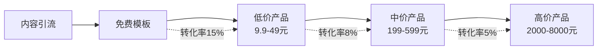

## 案例五：从小众IP到商业品牌

### 案例概述

小众IP（Intellectual Property，知识产权）是指在特定垂直领域拥有忠实受众、但尚未进入主流视野的内容品牌。与大众IP相比，小众IP的优势在于受众精准、信任度高、竞争壁垒强；劣势在于市场天花板低、商业化路径窄、抗风险能力弱。

本案例完整复盘了一个从零开始打造小众IP、逐步构建商业品牌的全过程。案例主角是一名平面设计师，凭借一套独特的"极简主义生活美学"内容体系，用18个月时间将个人IP从200个初始粉丝发展到年营收超过80万元的商业品牌。

### 背景与定位分析

#### 行业背景

2023年至2025年，中国内容创业市场呈现两极分化趋势：头部IP（百万粉丝以上）占据主要流量和商业资源，而大量中小创作者面临"有内容无变现"的困境。在这一背景下，小众IP反而展现出了独特的商业韧性——垂直领域的精准用户具有更高的付费意愿和忠诚度。

根据《2024年中国内容创作者经济报告》，粉丝数在1万至10万之间的垂直领域创作者，其粉丝年均消费金额（约380元）反而高于百万级泛娱乐博主的粉丝年均消费金额（约120元）。

#### 个人优势盘点

案例主角（以下简称"设计师A"）在起步前进行了系统的自我盘点：

| 维度 | 具体内容 | 商业价值评估 |
|------|----------|--------------|
| 专业技能 | 10年平面设计经验，精通Adobe全家桶 | 高——可输出教程和模板 |
| 审美积累 | 长期关注极简主义设计、日式侘寂美学 | 高——具备差异化内容基因 |
| 行业人脉 | 认识30+品牌方和设计工作室 | 中——可转化为初期客户资源 |
| 内容能力 | 有写作习惯，无视频经验 | 中——需学习新内容形式 |
| 时间资源 | 工作日可投入2小时/天，周末6小时 | 中——需提高效率 |

#### 市场需求验证

在正式投入前，设计师A用两周时间做了快速验证：

**第一步：关键词调研**

使用5118、百度指数、微信指数等工具，搜索"极简设计""极简生活方式""设计模板"等关键词，发现"极简设计"相关搜索量年增长率达35%，但优质供给严重不足。

**第二步：竞品分析**

在小红书、B站、抖音等平台搜索同类内容，发现：

- 粉丝量超过5万的极简设计类账号全国不超过20个
- 现有内容以搬运国外案例为主，缺乏本土化的深度解读
- 付费产品（模板、课程）定价普遍偏低（9.9-49元），存在价格空间

**第三步：用户访谈**

通过设计社群和朋友圈，找到20位目标用户进行一对一访谈，核心发现：

- 80%的受访者愿意为"即用型极简设计模板"付费
- 65%的受访者希望获得系统化的设计审美提升课程
- 50%的受访者有品牌设计外包需求，但找不到风格匹配的设计师

验证结论：市场需求明确，供给存在缺口，值得全力投入。

### 执行过程

整个执行过程分为四个阶段，共计18个月。

#### 第一阶段：内容基建（第1-3个月）

这个阶段的核心目标是建立内容生产体系，积累初始素材库。

**内容矩阵规划**

设计师A建立了"1+3+N"的内容矩阵：

- **1个核心阵地**：小红书（图文为主，适合展示设计作品）
- **3个分发阵地**：B站（长视频教程）、微信公众号（深度文章）、抖音（短视频引流）
- **N个辅助阵地**：设计社群、知乎专栏、即刻等

**内容类型设计**

| 内容类型 | 频率 | 目的 | 单条成本 |
|----------|------|------|----------|
| 日常灵感分享 | 每天1条 | 保持活跃度，吸引新粉 | 30分钟 |
| 设计教程 | 每周2条 | 建立专业形象，沉淀搜索流量 | 2-3小时 |
| 案例拆解 | 每周1条 | 展示专业深度，吸引潜在客户 | 1-2小时 |
| 幕后花絮 | 每周1条 | 增强人格化连接 | 30分钟 |

**素材库建设**

用Notion建立了分类素材库，包含：

- 国外极简设计案例图库（按品牌/风格/行业分类）
- 配色方案库（200+组合）
- 字体搭配推荐（按场景分类）
- 设计思考笔记（灵感记录）

**本阶段关键动作**

1. 在小红书连续发布30天，测试不同内容方向的数据表现
2. 根据数据反馈确定"极简品牌设计拆解"为主打方向
3. 制作第一套免费设计模板（5款极简海报模板），作为引流钩子
4. 加入10个设计类社群，开始日常互动和价值输出

**阶段成果**

| 指标 | 数据 |
|------|------|
| 小红书粉丝 | 1,200 |
| 公众号关注 | 300 |
| B站粉丝 | 150 |
| 免费模板下载量 | 800次 |
| 引流微信私域人数 | 200人 |

#### 第二阶段：产品打磨（第4-6个月）

这个阶段的核心目标是将内容能力转化为可售卖的产品。

**产品线规划**

基于用户反馈和自身能力，设计师A规划了三条产品线：



**产品一：极简设计模板包（低价引流品）**

- 定价：19.9元/套（含20款模板）
- 内容：极简海报、社交媒体封面、简历模板
- 工具：使用Figma和Canva制作，确保用户可直接编辑
- 上架平台：小鹅通、自己的小程序

**产品二：极简设计审美课（中价利润品）**

- 定价：399元
- 内容：12节录播课 + 4次直播答疑 + 社群陪伴
- 核心模块：
  - 模块1：极简设计的哲学基础（侘寂美学、包豪斯理念）
  - 模块2：色彩与留白的实战技巧
  - 模块3：版式设计的底层逻辑
  - 模块4：品牌视觉系统设计
- 制作周期：6周（录课4周 + 后期2周）

**产品三：品牌视觉设计服务（高价服务品）**

- 定价：5,000-8,000元/单
- 内容：品牌LOGO + 视觉识别系统（VI）基础版
- 交付周期：2-3周
- 服务流程：需求沟通→风格提案→设计执行→修改交付

**定价策略**

设计师A采用了"价值锚定法"：

- 先展示市面上同类品牌设计服务的市场价（通常1.5万-5万元）
- 再展示自己的服务内容和交付标准
- 最后给出5,000-8,000元的价格，让客户感知到高性价比

**阶段成果**

| 指标 | 数据 |
|------|------|
| 小红书粉丝 | 5,800 |
| 模板包销量 | 1,200套（收入约24,000元） |
| 课程报名人数 | 45人（收入约18,000元） |
| 品牌设计订单 | 3单（收入约18,000元） |
| 累计营收 | 约60,000元 |

#### 第三阶段：规模化增长（第7-12个月）

这个阶段的核心目标是放大已验证的增长引擎，建立可持续的获客体系。

**增长策略一：内容SEO化**

将所有内容围绕用户搜索习惯优化：

- 小红书标题包含高搜索量关键词（如"极简LOGO设计""品牌VI设计教程"）
- B站视频描述添加完整的时间戳和关键词
- 公众号文章布局长尾关键词（如"餐饮品牌极简设计怎么做"）

**增长策略二：私域精细化运营**

建立了三级私域体系：

| 层级 | 容器 | 人数 | 运营策略 |
|------|------|------|----------|
| 公域流量 | 小红书/B站/抖音 | 20,000+ | 内容触达，引导关注 |
| 半私域 | 微信公众号 | 3,000 | 深度内容，引导加微信 |
| 核心私域 | 个人微信/社群 | 800 | 1对1服务，社群运营 |

**增长策略三：口碑裂变机制**

- 设计了"老带新"机制：老学员推荐新学员，双方各获50元优惠券
- 收集用户使用模板后的作品，做成"学员作品展"系列内容
- 邀请优秀学员在社群做分享，增强社群粘性

**增长策略四：跨界合作**

- 与3位同量级但不同领域的博主进行内容互推（生活方式博主、极简家居博主、手账博主）
- 与2家设计工具平台（Figma社区、即时设计）建立模板上架合作
- 受邀参加2场线上设计峰会做分享

**阶段成果**

| 指标 | 数据 |
|------|------|
| 全平台粉丝 | 35,000 |
| 月均营收 | 约45,000元 |
| 课程累计学员 | 220人 |
| 品牌设计订单 | 15单/月 |
| 私域用户 | 3,200人 |

#### 第四阶段：品牌化转型（第13-18个月）

这个阶段的核心目标是从"个人IP"升级为"商业品牌"。

**品牌化的核心转变**

| 维度 | 个人IP阶段 | 品牌化阶段 |
|------|------------|------------|
| 名称 | 设计师A个人账号 | 注册"素·设计"品牌商标 |
| 形象 | 个人照片 | 统一的品牌视觉系统 |
| 产品 | 个人手工交付 | 标准化产品+团队协作 |
| 团队 | 一人全包 | 2名兼职设计师+1名运营 |
| 客户关系 | 1对1服务 | 分层服务（自助/半托管/全托管） |
| 法律保障 | 无 | 商标注册+版权登记+合同模板 |

**商标注册流程**

1. 品牌名"素·设计"商标检索（通过中国商标网查询无冲突）
2. 委托代理机构提交商标注册申请（第42类：设计服务；第35类：广告营销）
3. 注册费用：官费270元/类 + 代理费800元，总计约2,140元
4. 等待周期：约9-12个月获证
5. 在等待期间使用TM标识，获证后改为R标识

**产品标准化**

将设计服务拆分为三个标准化套餐：

| 套餐 | 内容 | 价格 | 交付周期 |
|------|------|------|----------|
| 基础版 | LOGO设计 + 基础VI（名片/信纸） | 3,800元 | 2周 |
| 进阶版 | 基础版 + 品牌手册 + 社交媒体模板 | 6,800元 | 3周 |
| 定制版 | 进阶版 + 包装设计 + 全套品牌指南 | 12,800元 | 4-6周 |

**团队搭建**

- 招募2名兼职设计师（通过设计社群和站酷招聘），月薪按项目提成
- 招募1名社群运营助理（从优秀学员中选拔），月薪3,000元
- 建立SOP（标准作业流程）文档，确保新人可快速上手

**知识产权保护体系**

| 保护对象 | 保护方式 | 费用 | 说明 |
|----------|----------|------|------|
| 品牌名称 | 商标注册 | 2,140元 | 第35类+第42类 |
| 教程内容 | 版权登记 | 约500元/批次 | 中国版权保护中心 |
| 设计模板 | 版权登记+水印 | 约200元/批次 | 模板内嵌隐形水印 |
| 课程视频 | 平台防盗录 | 平台提供 | 小鹅通等平台内置防盗功能 |
| 原创方法论 | 书籍出版 | 0（出版社出资） | 将核心方法论出版成书 |

### 成果数据总览

经过18个月的持续运营，"素·设计"品牌实现了从个人IP到商业品牌的蜕变：

| 指标 | 第3个月 | 第6个月 | 第12个月 | 第18个月 |
|------|---------|---------|----------|----------|
| 全平台粉丝 | 1,200 | 5,800 | 35,000 | 68,000 |
| 月均营收 | 0 | 10,000 | 45,000 | 82,000 |
| 产品SKU | 0 | 3 | 6 | 10 |
| 私域用户 | 200 | 800 | 3,200 | 5,500 |
| 复购率 | 0% | 25% | 42% | 55% |
| 团队人数 | 1 | 1 | 2 | 4 |

**收入结构分析（第18个月）**

| 收入来源 | 月均收入 | 占比 | 利润率 |
|----------|----------|------|--------|
| 设计模板/素材包 | 12,000元 | 15% | 90% |
| 系统课程 | 25,000元 | 30% | 85% |
| 品牌设计服务 | 35,000元 | 43% | 60% |
| 企业培训/咨询 | 10,000元 | 12% | 70% |
| 合计 | 82,000元 | 100% | 73%（综合） |

### 关键成功因素分析

#### 因素一：精准的差异化定位

设计师A没有选择"做设计教程"这个大而泛的方向，而是聚焦于"极简主义品牌设计"这个极其垂直的细分领域。这一选择带来了三个关键优势：

1. **竞争壁垒高**：极简主义不是简单的"少"，而是一套完整的审美哲学，需要长期积累才能输出有深度的内容
2. **受众精准**：吸引的都是对设计品质有追求的品牌方和创业者，付费能力强
3. **内容可持续**：极简设计可以延伸到品牌、空间、产品、生活方式等多个维度，内容素材取之不尽

#### 因素二：内容驱动的信任积累

设计师A没有急于变现，而是用3个月时间密集输出免费高质量内容，建立了"专业可信"的形象。当第一个付费产品上线时，已经积累了足够的信任资本。

关键数据：第一个付费模板包上线当天，通过小红书推文直接带来87单销售，转化率达到4.2%（行业平均约1.5%）。

#### 因素三：阶梯式产品体系

从免费→低价→中价→高价的产品阶梯，让用户可以"先体验、再深入、后定制"，降低了决策门槛。

转化漏斗数据：

```text
免费模板下载：8,000人次
    ↓ 15%转化
低价模板购买：1,200人
    ↓ 8%转化
中价课程购买：96人
    ↓ 12%转化
高价设计服务：12人
```

#### 因素四：持续的迭代优化

设计师A建立了"数据驱动"的决策习惯：

- 每周分析各平台内容数据（播放量、互动率、转化率）
- 每月做一次用户调研（问卷+访谈）
- 每季度调整一次产品线（淘汰低效产品，开发新品）

### 常见误区与避坑指南

#### 误区一：过早追求变现

很多小众IP在粉丝不足1,000时就开始卖课、接广告，结果既赚不到钱，又消耗了粉丝信任。正确做法是先用3-6个月建立信任基础，再逐步推出付费产品。

#### 误区二：定价过低

小众IP的最大优势是精准和深度，而不是低价。设计师A最初将课程定价为99元，发现报名人数反而不如后来的399元——因为低价让用户怀疑课程质量。小众领域要敢于定高价，用价值感而非价格来吸引目标用户。

#### 误区三：过度依赖单一平台

设计师A的一位朋友在抖音积累了10万粉丝，但因为一次违规被限流，一个月内收入归零。教训是：必须建立多平台分发体系，将公域流量沉淀到私域（微信个人号/社群）。

#### 误区四：忽视知识产权保护

一位独立设计师的原创作品被大公司抄袭，因为没有提前做版权登记，维权困难重重。在IP成长初期就要建立保护意识：

- 所有原创内容保留创作时间戳（发布时间本身就是证据）
- 重要内容做版权登记（费用低，法律效力高）
- 品牌名提前注册商标（避免做大后被人抢注）

#### 误区五：单打独斗不组建团队

个人IP的产能天花板很低。设计师A在第10个月时曾经因为订单过多导致交付延迟，差评率飙升。及时引入兼职设计师和运营助理后，产能提升3倍，服务质量也更稳定。

### 进阶策略：从IP到品牌的跃迁

#### 策略一：方法论出版

将核心方法论整理成书出版，既是内容资产的沉淀，也是品牌背书的强化。设计师A在第15个月与电子工业出版社签约，出版了《极简设计力：从审美到品牌的系统方法》，首印5,000册。

#### 策略二：线下工作坊

线上内容建立信任，线下活动深化连接。设计师A每季度举办一次"极简设计工作坊"（2天，12人小班），定价2,800元/人，不仅带来了额外收入，还培养了一批高忠诚度的"种子用户"。

#### 策略三：品牌授权与联名

当品牌影响力达到一定程度后，可以探索品牌授权模式：

- 与家居品牌联名推出"极简设计"系列文具
- 与咖啡品牌合作"设计师联名款"包装
- 与商业地产合作"极简美学"主题空间设计

#### 策略四：构建产品化服务体系

将个人服务升级为产品化服务，摆脱"用时间换钱"的模式：

- 开发自动化设计工具（基于Figma的插件）
- 建立设计模板商城（持续更新，用户自助购买）
- 推出订阅制设计顾问服务（月费制，自动续费）

### 可复用的执行框架

对于想复制这一路径的读者，以下是精简版执行框架：

**阶段一：定位验证（第1-2个月）**

1. 盘点自身技能、经验、兴趣的交叉点
2. 调研市场需求（关键词+竞品+用户访谈）
3. 确定一个足够细分的垂直方向
4. 连续发布30天内容，验证市场反馈

**阶段二：内容积累（第3-5个月）**

1. 建立内容矩阵（1核心+3分发+N辅助）
2. 设计免费引流产品（模板/电子书/工具）
3. 开始沉淀私域流量
4. 收集用户反馈，规划付费产品

**阶段三：产品变现（第6-9个月）**

1. 推出第一个低价付费产品
2. 根据数据反馈迭代优化
3. 推出中价系统产品
4. 启动高价定制服务

**阶段四：品牌升级（第10-18个月）**

1. 注册商标，保护知识产权
2. 组建小团队，突破产能瓶颈
3. 标准化产品和服务流程
4. 探索品牌授权和跨界合作

### 工具推荐

| 用途 | 工具 | 费用 | 说明 |
|------|------|------|------|
| 内容管理 | Notion | 免费/付费 | 素材库和内容日历管理 |
| 设计制作 | Figma | 免费/付费 | 模板制作和团队协作 |
| 课程平台 | 小鹅通 | 3,999元/年 | 课程上架和学员管理 |
| 私域运营 | 企业微信 | 免费 | 客户管理和群运营 |
| 数据分析 | 新榜/灰豚 | 付费 | 各平台数据分析 |
| 商标注册 | 中国商标网/代理 | 2,000-3,000元 | 品牌保护 |
| 版权登记 | 中国版权保护中心 | 200-500元/批次 | 内容保护 |
| 视频制作 | 剪映专业版 | 免费 | 视频剪辑和字幕 |

### 本案例核心启示

小众IP的商业化路径，本质上是"信任资产"的积累和变现过程。与大众IP追求流量规模不同，小众IP的核心竞争力在于：

1. **深度胜于广度**：在一个细分领域做到极致，比在多个领域浅尝辄止更有价值
2. **信任胜于流量**：1,000个信任你的精准用户，比100,000个路人粉更有商业价值
3. **体系胜于单点**：从内容到产品到服务的完整体系，才能实现可持续变现
4. **保护胜于补救**：知识产权保护要从第一天就开始，而不是出问题后才后悔
5. **品牌胜于个人**：个人IP是有天花板的，品牌才能突破个人产能和生命周期的限制

