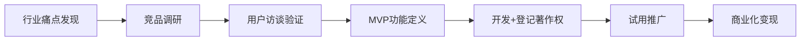
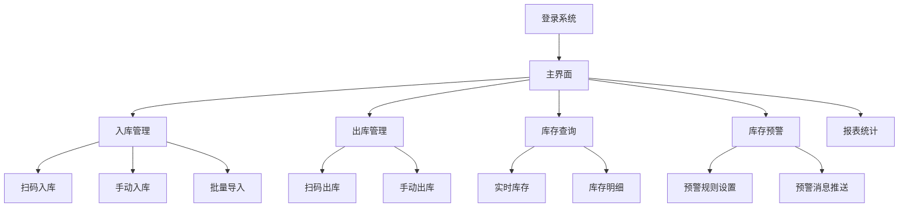
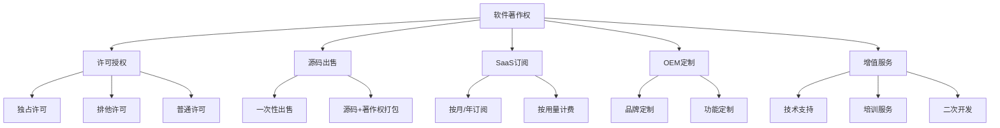
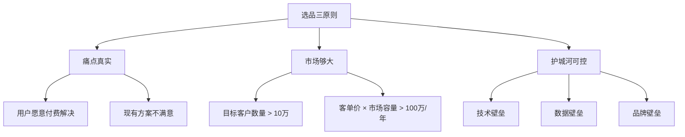
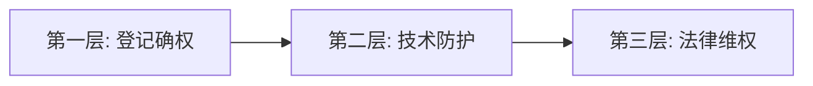

## 案例六：软件著作权的商业化

软件著作权是知识产权变现中最容易被个人开发者忽视、却最具实操价值的一种形式。与专利相比，软件著作权的申请门槛低、周期短、费用少，且商业化路径多样——从一次性授权到持续性 SaaS 订阅，从源码出售到 OEM 定制，每条路径都有独立开发者成功变现的真实案例。本章将以一位独立开发者从零开始将自研工具软件商业化为年收入 40 万+的真实路径为主线，完整拆解软件著作权商业化的每一步。

### 一、案例背景：一位后端开发者的副业突围

#### 1.1 人物画像

| 维度 | 信息 |
|------|------|
| 身份 | 某二线城市互联网公司后端开发，5 年 Java 经验 |
| 痛点 | 薪资天花板明显（月薪 18K），加班频繁，缺乏被动收入 |
| 技能栈 | Java/Spring Boot、MySQL、Redis、Vue.js 前端基础 |
| 可用时间 | 工作日晚 2-3 小时 + 周末半天 |
| 启动资金 | 不超过 5000 元 |

#### 1.2 机会发现

该开发者在日常工作中频繁接触到一个行业痛点：中小型制造企业的仓库管理系统（WMS）要么价格昂贵（动辄数十万），要么功能臃肿、操作复杂。大量年产值 500 万-5000 万的中小企业仍在用 Excel 管理库存，错发、漏发、库存积压是常态。

关键洞察：

- **市场需求真实存在**：中国有超过 4000 万家中小制造企业，其中超过 80% 未使用专业 WMS
- **价格带存在空白**：大型 WMS（如富勒、唯智）年费 10 万+，中小企业预算通常在 1-3 万/年
- **技术门槛可控**：核心功能（入库、出库、盘点、库存预警）技术复杂度适中

#### 1.3 决策逻辑

该开发者没有急于写代码，而是先做了三件事：

1. **竞品调研**：在应用市场和 GitHub 搜索同类产品，分析定价、功能、用户评价
2. **需求验证**：通过行业论坛、微信群访谈了 20 多位仓库管理员，确认核心痛点
3. **最小可行产品（MVP）定义**：只做"扫码入库→库存查询→扫码出库→库存预警"四个核心功能



### 二、软件著作权登记全流程

#### 2.1 为什么必须登记

软件著作权登记是商业化的法律基础。没有登记证书，你将面临以下困境：

| 场景 | 无登记证书的后果 |
|------|------------------|
| 授权销售 | 客户无法确认你是合法权利人，不敢签约 |
| 平台上架 | 应用商店、软件商城要求提供著作权证明 |
| 维权诉讼 | 法院举证困难，维权成本大幅上升 |
| 政府补贴 | 高新认定、双软认证、创新基金均要求著作权证书 |
| 融资估值 | 投资人将软件著作权视为核心无形资产 |

#### 2.2 登记前的准备工作

**材料清单：**

| 材料 | 说明 | 注意事项 |
|------|------|----------|
| 软件源代码 | 前 30 页 + 后 30 页（每页 50 行） | 不足 60 页的提交全部源代码 |
| 软件说明书 | 功能说明、操作流程、界面截图 | 至少 10 页，截图清晰 |
| 身份证明 | 个人身份证 / 企业营业执照 | 个人申请需身份证正反面 |
| 申请表 | 在中国版权保护中心网站在线填写 | 软件名称需规范，版本号明确 |

**源代码准备技巧：**

```text
✅ 正确做法：
- 提交真正的业务逻辑代码，不要提交配置文件、依赖库代码
- 代码顶部保留版权声明注释（Copyright © 作者名 年份）
- 代码格式规范，有适当的注释
- 使用等宽字体打印（如 Courier New），每页 50 行

❌ 常见错误：
- 提交的是框架自动生成的代码（如 Spring Boot 脚手架）
- 代码中包含第三方公司的名称或敏感信息
- 提交的代码与实际软件功能不匹配
- 打印格式混乱，行数不规范
```

**软件说明书撰写要点：**

说明书是审查员判断软件独创性的关键材料，必须包含以下内容：

1. **软件概述**：名称、版本、开发语言、运行环境、用途定位
2. **功能架构图**：用 Mermaid 或 Visio 绘制系统功能模块图
3. **核心功能详述**：每个功能模块配操作截图 + 文字说明
4. **技术特点**：与同类软件的差异化设计说明
5. **操作流程图**：核心业务流程的流程图



#### 2.3 登记流程与时间线

| 步骤 | 操作 | 耗时 | 费用 |
|------|------|------|------|
| 1. 注册账号 | 在中国版权保护中心（ccopyright.com.cn）注册 | 10 分钟 | 免费 |
| 2. 填写申请表 | 在线填写软件信息、权利取得方式等 | 30 分钟 | 免费 |
| 3. 准备材料 | 源代码打印 + 说明书撰写 + 身份证明 | 1-3 天 | 打印费约 50 元 |
| 4. 提交审核 | 网上提交 + 邮寄纸质材料（或现场提交） | 1 天 | 官费 300 元/件 |
| 5. 审查 | 版权局形式审查 | 30-60 个工作日 | - |
| 6. 领取证书 | 收到通知后领取或邮寄 | 3-5 天 | 邮寄费约 20 元 |

**加速技巧：**

- **加急通道**：支付加急费可缩短至 10-31 个工作日，费用 100-500 元不等
- **代理机构**：找正规代理机构代办，费用约 500-800 元（含官费），省时省力
- **多地登记**：部分省市（如北京、上海、深圳）有地方版权登记窗口，流程更快
- **一次多件**：如果有多款软件，可同时提交多件申请，节省来回时间

#### 2.4 登记中的常见问题与应对

| 问题 | 原因 | 解决方案 |
|------|------|----------|
| 补正通知 | 材料不规范或信息不一致 | 仔细核对申请表与材料的一致性 |
| 驳回 | 软件名称含禁用词或与已有登记冲突 | 提前在官网查询是否有重名 |
| 审查时间过长 | 高峰期积压 | 避开年初和年末申请高峰 |
| 源代码不达标 | 提交了无关代码或格式不对 | 按要求准备前30页+后30页 |

### 三、商业化路径设计

#### 3.1 软件著作权的五种变现模式



**五种模式对比：**

| 模式 | 收入特点 | 客户类型 | 技术要求 | 天花板 |
|------|----------|----------|----------|--------|
| 许可授权 | 单笔 + 年费 | 中大型企业 | 低 | 中 |
| 源码出售 | 一次性高收入 | 开发者/集成商 | 低 | 低 |
| SaaS 订阅 | 持续性收入 | 中小企业 | 高 | 高 |
| OEM 定制 | 项目制收入 | 行业集成商 | 中 | 中 |
| 增值服务 | 持续性收入 | 已有客户 | 中 | 中 |

#### 3.2 本案例的策略选择

该开发者选择了**"许可授权 + SaaS 订阅"双轨制**，原因如下：

1. **许可授权解决现金流**：一次性收取 1-3 万元/套，快速回笼开发成本
2. **SaaS 订阅构建长期收入**：按月收费 200-500 元/月，形成持续现金流
3. **降低客户决策门槛**：SaaS 模式让预算有限的中小企业也能用上专业系统

**定价策略：**

| 版本 | 价格 | 功能范围 | 目标客户 |
|------|------|----------|----------|
| 基础版（SaaS） | 299 元/月 | 核心出入库功能，5 用户 | 小微企业 |
| 标准版（SaaS） | 499 元/月 | 全功能，20 用户，报表分析 | 中小企业 |
| 专业版（授权） | 19800 元/套 | 全功能 + 源码 + 1年维护 | 中型企业 |
| 企业定制 | 3-8 万元/项 | 定制开发 + 部署 + 培训 | 特定需求企业 |

### 四、开发与上线执行过程

#### 4.1 MVP 开发时间线

| 阶段 | 时间 | 内容 | 产出 |
|------|------|------|------|
| 第 1 周 | 7 天 | 数据库设计、项目框架搭建 | 可运行的空壳项目 |
| 第 2-3 周 | 14 天 | 入库模块 + 出库模块开发 | 核心业务流程跑通 |
| 第 4 周 | 7 天 | 库存查询 + 预警功能 | MVP 功能完整 |
| 第 5 周 | 7 天 | 前端界面优化 + 测试 | 可演示的 Demo |
| 第 6 周 | 7 夃 | 部署上线 + 著作权材料准备 | 产品上线 + 申请提交 |

总开发时间：**6 周**（工作日晚上 + 周末，约 150 小时）

#### 4.2 技术架构选择

```text
前端：Vue 3 + Element Plus（快速搭建管理界面）
后端：Spring Boot 2.7（成熟稳定，生态丰富）
数据库：MySQL 8.0（中小规模足够）
缓存：Redis（库存查询加速）
部署：Docker + Nginx（一键部署，运维简单）
扫码：Html5-QRCode（前端扫码，无需额外硬件）
```

**为什么选择这套技术栈？**

- Spring Boot + Vue 是国内中小企业的主流技术栈，客户技术人员容易接手
- Docker 容器化部署让"一键安装"成为可能，降低客户部署成本
- 前端扫码方案无需购买专业扫码枪，用手机即可操作，大幅降低客户使用门槛

#### 4.3 推广获客策略

该开发者采用了**"内容引流 + 免费试用 + 线下转化"**的组合策略：

**阶段一：内容引流（第 1-2 个月）**

| 渠道 | 内容形式 | 效果 |
|------|----------|------|
| CSDN 博客 | 发布 "从零开发仓库管理系统" 系列文章（8 篇） | 累计阅读 5 万+ |
| 知乎 | 回答 "中小企业如何选择 WMS" 等问题 | 单篇最高 3000+ 赞 |
| B 站 | 录制产品演示视频（3 个） | 累计播放 2 万+ |
| 微信公众号 | 发布行业痛点分析文章 | 粉丝增长 800+ |

**阶段二：免费试用转化（第 2-4 个月）**

- 提供 30 天免费试用，无需信用卡
- 试用期间主动跟进（微信一对一指导）
- 试用到期前 3 天发送续费提醒

**阶段三：线下渠道拓展（第 4-6 个月）**

- 参加本地制造业展会，发放产品手册
- 与 ERP 实施顾问合作，作为轻量 WMS 推荐给客户
- 在工业园区举办免费培训讲座

**转化漏斗数据：**

```text
内容曝光 → 官网访问 → 注册试用 → 付费转化
10,000+  →  2,000+   →   500+    →   80+
(转化率)    (20%)      (25%)      (16%)
```

### 五、成果数据与财务分析

#### 5.1 运营数据（前 18 个月）

| 指标 | 第 3 个月 | 第 6 个月 | 第 12 个月 | 第 18 个月 |
|------|-----------|-----------|------------|------------|
| SaaS 付费用户 | 8 家 | 25 家 | 60 家 | 95 家 |
| 授权客户 | 1 家 | 3 家 | 6 家 | 10 家 |
| 月收入 | 3,200 元 | 15,000 元 | 35,000 元 | 45,000 元 |
| 累计收入 | 6,800 元 | 45,000 元 | 220,000 元 | 420,000 元 |
| 客户续费率 | - | 70% | 78% | 82% |

#### 5.2 收入结构分析

| 收入来源 | 占比 | 特点 |
|----------|------|------|
| SaaS 订阅费 | 55% | 持续稳定，月度到账 |
| 软件授权费 | 30% | 单笔金额大，不规律 |
| 定制开发费 | 10% | 项目制，利润率高 |
| 技术支持/培训 | 5% | 几乎零成本，利润率最高 |

#### 5.3 成本核算

| 成本项 | 金额 | 说明 |
|--------|------|------|
| 服务器（云） | 500 元/月 | 阿里云 2 核 4G |
| 著作权登记 | 300 元/件 | 共登记 2 件（V1.0 + V2.0） |
| 域名 + SSL | 200 元/年 | .com 域名 + 免费 SSL |
| 营业执照 | 0 元 | 个体工商户免费注册 |
| 推广费用 | 0 元 | 纯靠内容引流，零广告费 |
| **年总成本** | **约 7,000 元** | |

**年净利润（第 18 个月数据推算）：45,000 × 12 - 7,000 = 约 53 万元**

#### 5.4 投入产出比

```text
开发时间投入：150 小时（6 周）
持续运营投入：每周约 5 小时（客服 + 维护 + 更新）
年收入：约 54 万元
时薪（首年）：540,000 ÷ (150 + 5×50) = 约 1,542 元/小时
```

### 六、关键技术决策复盘

#### 6.1 做对了什么

| 决策 | 原因 | 结果 |
|------|------|------|
| 选择垂直行业而非通用工具 | 竞争小，客户付费意愿强 | 避免了与大厂正面竞争 |
| 先 SaaS 后授权 | 降低客户决策门槛 | 获客速度比纯授权模式快 3 倍 |
| 重视内容营销 | 精准触达目标用户 | 零广告费获客 80+ |
| 著作权提前登记 | 法律保障 + 品牌信任 | 上架应用商店无障碍 |
| 选择成熟技术栈 | 开发效率高，客户易接手 | 6 周完成 MVP |

#### 6.2 走过的弯路

| 错误 | 后果 | 纠正方式 |
|------|------|----------|
| 初期功能做得太多 | MVP 开发时间拉长到 8 周 | 砍掉报表、审批等非核心功能 |
| 没有做好数据库设计 | V2.0 升级时数据迁移困难 | 重构数据库，提前设计可扩展架构 |
| 客服全靠微信 | 消息太多回复不及时 | 引入工单系统 + FAQ 文档 |
| 没有及时登记 V2.0 著作权 | 遇到疑似抄袭时举证困难 | 每次大版本更新都登记新版本 |

### 七、软件著作权商业化的核心方法论

#### 7.1 选品三原则

不是所有软件都适合个人开发者商业化。选品时需要同时满足三个条件：



**适合个人开发者的软件类型：**

| 类型 | 示例 | 优势 | 难度 |
|------|------|------|------|
| 垂直行业工具 | 仓库管理、门店管理、排课系统 | 竞争小，付费意愿强 | ★★★ |
| 效率工具 | 批量处理、格式转换、数据清洗 | 需求明确，开发周期短 | ★★ |
| 企业管理辅助 | 考勤、审批、报销 | 刚需，续费率高 | ★★★ |
| 数据分析工具 | 报表生成、数据可视化 | 技术壁垒高，不易被抄 | ★★★★ |
| 开发者工具 | API 网关、日志分析、监控 | 用户付费能力强 | ★★★★ |

**避坑指南：远离这些领域：**

- 社交、电商、内容平台——需要巨额运营投入
- 基础办公软件——已被 WPS、腾讯文档等巨头垄断
- 游戏——版号审批复杂，运营成本高
- 金融/医疗——监管严格，资质门槛高

#### 7.2 著作权保护的三层防御体系



**第一层：登记确权**

- 软件著作权登记（必备）
- 版本更新后及时登记新版本
- 保留开发过程记录（Git 提交历史、开发日志）

**第二层：技术防护**

| 手段 | 说明 | 适用场景 |
|------|------|----------|
| 代码混淆 | 对编译后的代码进行混淆处理 | 桌面应用、移动端 |
| 加密狗/许可证 | 硬件或软件许可证绑定 | 本地部署软件 |
| 在线激活 | 联网验证授权状态 | SaaS 和订阅模式 |
| 核心算法服务端化 | 关键逻辑放在服务端 | 防止客户端逆向 |
| 水印嵌入 | 在输出文件中嵌入隐藏标识 | 文档、图片处理软件 |

**第三层：法律维权**

当发现侵权时的处理流程：

1. **取证**：截图、公证购买侵权产品、保存网页快照
2. **发律师函**：要求对方停止侵权并赔偿（成功率约 40%）
3. **平台投诉**：在应用商店、电商平台发起侵权投诉
4. **行政投诉**：向当地版权局举报
5. **诉讼**：向法院提起著作权侵权诉讼

#### 7.3 SaaS 化的关键设计

将软件著作权转化为持续收入，SaaS 化是最优路径。以下是关键设计原则：

**技术架构：**

```text
多租户架构设计要点：
├── 数据隔离：每租户独立 Schema 或 共享表 + tenant_id
├── 计费系统：用量计量 + 套餐管理 + 账单生成
├── 授权管理：功能开关 + 用户数限制 + 有效期控制
├── 运维监控：租户级别的资源监控 + 告警
└── 数据安全：租户数据加密 + 定期备份 + GDPR 合规
```

**计费模型选择：**

| 计费方式 | 适用场景 | 优势 | 劣势 |
|----------|----------|------|------|
| 按用户数 | 企业管理工具 | 收入随客户规模增长 | 可能被共享账号绕过 |
| 按用量 | API 服务、存储服务 | 公平，用多少付多少 | 收入不稳定 |
| 按功能模块 | 分层产品 | 鼓励升级 | 定价复杂 |
| 固定月费 | 简单工具 | 用户理解成本低 | 高用量客户亏损 |

#### 7.4 许可授权的法律要点

**三种许可类型：**

| 许可类型 | 定义 | 收费建议 | 适用场景 |
|----------|------|----------|----------|
| 独占许可 | 仅被许可方可使用 | 最高（5-10 倍基础价） | 大客户独家行业需求 |
| 排他许可 | 许可方 + 被许可方可用 | 较高（3-5 倍基础价） | 区域/行业独家代理 |
| 普通许可 | 可授权多方 | 基础价 | 通用授权 |

**授权协议必备条款：**

```text
1. 授权范围：明确使用地域、行业、用途限制
2. 授权期限：起止日期，续费条件
3. 授权费用：金额、支付方式、逾期处理
4. 知识产权归属：明确著作权归许可方所有
5. 保密条款：源码、技术文档的保密义务
6. 违约责任：侵权使用的赔偿标准
7. 技术支持：维护期限、响应时间、升级政策
8. 数据归属：客户数据归客户所有，停止服务后数据导出
```

### 八、常见误区与风险防范

#### 8.1 商业化过程中的十大误区

| 误区 | 真相 | 后果 |
|------|------|------|
| "著作权登记了就能赚钱" | 登记只是法律保障，商业成功靠产品和运营 | 浪费时间和精力 |
| "功能越多越好" | 功能越多，维护成本越高，用户体验越差 | 开发周期失控 |
| "技术好就能卖出去" | 销售能力、客户服务同样重要 | 有产品没客户 |
| "定价越低越好" | 低价吸引的客户质量差，续费率低 | 陷入价格战 |
| "SaaS 不需要著作权登记" | SaaS 同样需要著作权保护 | 维权时缺乏法律依据 |
| "个人开发者不需要合同" | 没有合同就没有法律保障 | 纠纷时无法维权 |
| "代码开源就不会被抄" | 开源不等于放弃著作权 | 竞争对手免费使用 |
| "一次性开发就够了" | 软件需要持续迭代维护 | 客户流失 |
| "只做线上就够了" | B 端客户需要线下信任建立 | 获客效率低 |
| "等产品完美了再推出" | 完美主义导致永远无法上线 | 错过市场窗口 |

#### 8.2 法律风险防范

**常见法律风险及应对：**

| 风险 | 场景 | 防范措施 |
|------|------|----------|
| 代码来源争议 | 使用了开源代码或前公司代码 | 使用开源代码前检查 License 兼容性 |
| 员工著作权归属 | 在职期间开发的软件 | 用个人设备、个人时间开发，保留证据 |
| 客户数据泄露 | SaaS 平台客户数据安全 | 数据加密、访问日志、安全审计 |
| 授权纠纷 | 客户超范围使用 | 授权协议明确范围 + 技术限制手段 |
| 竞业限制 | 与前东家业务重叠 | 仔细审查竞业协议条款 |

**开源代码使用的合规检查清单：**

```text
□ 确认所有开源组件的 License 类型
□ MIT / BSD / Apache 2.0：可商用，保留版权声明即可
□ LGPL：动态链接可商用，静态链接需注意
□ GPL / AGPL：代码传染性，必须开源衍生作品
□ 确认没有使用禁止商用的组件
□ 在软件说明书中声明使用的开源组件
□ 保留所有开源组件的 License 文件
```

### 九、从个人副业到正式创业

#### 9.1 何时该全职投入

当满足以下 3 个条件中的 2 个时，可以考虑全职创业：

1. 月收入超过主业薪资的 1.5 倍，且持续 3 个月以上
2. 客户增长速度受限于你的时间投入（供不应求）
3. 你看到了明确的产品扩展方向，需要全力投入

#### 9.2 企业化运营的必要步骤

| 步骤 | 内容 | 时间 |
|------|------|------|
| 注册公司 | 有限责任公司，经营范围含软件开发和销售 | 1-2 周 |
| 对公账户 | 开设企业银行账户 | 1 周 |
| 税务登记 | 小规模纳税人（年收入 500 万以内） | 1 周 |
| 商标注册 | 注册产品名称商标，保护品牌 | 6-12 个月 |
| 增值电信业务许可 | 如涉及 SaaS，可能需要 ICP 证 | 2-3 个月 |
| 等保备案 | 涉及用户数据需做等级保护 | 1-3 个月 |

#### 9.3 团队扩展路径

```text
单人开发（0-30万/年）
  ↓ 招聘兼职客服
1人 + 兼职（30-80万/年）
  ↓ 招聘全职前端/后端
3人小团队（80-200万/年）
  ↓ 增加销售、运维
5-10人公司（200-500万/年）
  ↓ 引入合伙人，融资
规模化（500万+/年）
```

### 十、实操工具箱

#### 10.1 著作权登记相关资源

| 资源 | 地址 | 用途 |
|------|------|------|
| 中国版权保护中心 | ccopyright.com.cn | 著作权登记官方渠道 |
| 各省版权局 | 各省官网 | 地方登记通道 |
| 中国裁判文书网 | wenshu.court.gov.cn | 查询著作权判例 |
| 国家知识产权局 | cnipa.gov.cn | 专利、商标查询 |

#### 10.2 SaaS 化技术工具

| 工具 | 用途 | 成本 |
|------|------|------|
| Stripe / 支付宝当面付 | 支付集成 | 交易手续费 |
| Authing / Keycloak | 用户认证 | 免费-付费 |
| 阿里云 / 腾讯云 | 服务器托管 | 500-2000 元/月 |
| Grafana + Prometheus | 监控 | 开源免费 |
| Sentry | 错误追踪 | 开源免费 |

#### 10.3 授权协议模板核心条款

```text
第X条 授权范围
1. 许可方授予被许可方在 [地域范围] 内，于 [行业领域] 使用本软件的 [非独占/独占] 使用权。
2. 被许可方不得将本软件转授权给第三方。
3. 被许可方使用本软件的用户数上限为 [N] 个。

第X条 授权期限
1. 本授权自 [起始日期] 起至 [终止日期] 止。
2. 到期前 30 日，双方可协商续期，续期费用为原费用的 [X]%。

第X条 知识产权
1. 本软件的著作权归许可方所有。
2. 被许可方基于本软件产生的业务数据归被许可方所有。
3. 被许可方不得对本软件进行反编译、反汇编或逆向工程。
```

### 十一、经验总结与行动清单

#### 11.1 核心经验

1. **产品选择决定上限**：选择一个有真实付费需求的垂直市场，比做一个"通用但免费"的工具更有前途
2. **著作权登记是必选项，不是可选项**：它是你商业化之路的法律基石
3. **SaaS 模式优于一次性销售**：持续性收入让你有底气做长期规划
4. **内容营销是最低成本的获客方式**：写好技术文章，比花广告费更有效
5. **先验证再投入**：用最少的时间和资源验证市场需求，再决定是否全力投入
6. **法律意识要前置**：在开发阶段就做好著作权保护和开源合规检查

#### 11.2 30 天启动行动清单

| 周次 | 行动项 | 产出 |
|------|--------|------|
| 第 1 周 | 选定垂直领域 + 竞品调研 + 用户访谈 10 人 | 需求验证报告 |
| 第 2 周 | MVP 功能定义 + 数据库设计 + 技术选型 | 技术方案文档 |
| 第 3 周 | 核心功能开发（入库+出库+查询） | 可运行的 Demo |
| 第 4 周 | 界面优化 + 部署上线 + 准备著作权登记材料 | 产品上线 + 登记申请提交 |

