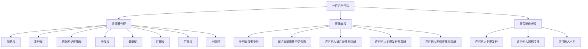
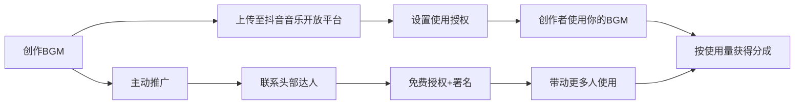

## 案例七：音乐版权的变现之路

> 音乐是人类最古老的知识产权形式之一。在数字时代，一首歌可以从十几个渠道同时产生收入，但绝大多数音乐人只用到了其中一两个。本案例拆解一位独立音乐人如何从零开始，用三年时间将音乐版权收入做到月均2万+的完整路径。

### 一、案例背景

#### 1.1 人物画像

**林晨（化名）**，28岁，计算机专业毕业，在杭州一家互联网公司做前端开发。大学期间自学吉他和编曲，有一定音乐基础但从未接受过专业训练。2022年开始利用业余时间进行音乐创作，目标是将音乐从兴趣爱好转化为可持续的被动收入来源。

**起点条件：**
- 乐器能力：吉他六级水平，钢琴入门级
- 编曲能力：能用FL Studio完成基本编曲，混音水平一般
- 音乐理论：了解基础乐理，不懂和声学高级内容
- 设备投入：已有笔记本电脑，计划初期投入不超过5000元
- 可用时间：工作日每天1-2小时，周末每天4-6小时

#### 1.2 市场环境分析

**中国数字音乐市场规模：**

| 年份 | 市场规模（亿元） | 同比增长 | 付费用户（亿） |
|------|-----------------|---------|---------------|
| 2020 | 732 | 12.4% | 3.8 |
| 2021 | 891 | 21.7% | 5.2 |
| 2022 | 1056 | 18.5% | 6.1 |
| 2023 | 1247 | 18.1% | 7.3 |
| 2024 | 1468 | 17.7% | 8.5 |

**关键趋势：**
- 版权意识觉醒：各大平台加强正版化，盗版空间持续压缩
- 短视频带动：抖音、快手等平台对BGM的巨大需求催生了新的变现渠道
- AI辅助创作：Suno、Udio等工具降低了创作门槛，但人类创意仍是核心竞争力
- 碎片化消费：15秒-60秒的短音乐需求暴增，适合快速产出
- 版权交易规范化：音集协、音著协等集体管理组织的版权分配机制日趋透明

#### 1.3 音乐版权的法律基础

在中国法律体系中，音乐作品涉及的权利层次远比大多数人想象的复杂：



**关键区分：**
- **词曲著作权**（又称音乐版权、词曲版权）：属于词曲作者，保护期为作者终生加死后50年
- **表演者权**：属于演唱者/演奏者，保护期为表演完成后50年
- **录音制作者权**：属于录音的制作方（唱片公司或独立制作人），保护期为录音首次制作完成后50年

> **实战要点：** 独立音乐人如果词、曲、唱、录都是自己完成的，理论上可以同时拥有这三层权利。但实操中需要注意：如果使用了他人的采样（sample）、循环（loop）或预制鼓组（preset drum kit），需要确认许可范围。

### 二、变现路径全景图

音乐版权的变现并非只有"卖歌"一条路。以下是经过验证的主要变现渠道及其特征对比：

| 变现渠道 | 门槛 | 收入上限 | 被动程度 | 启动周期 | 适合阶段 |
|---------|------|---------|---------|---------|---------|
| 流媒体分成 | 低 | 中 | 高 | 1-3月 | 入门 |
| 短视频BGM授权 | 低 | 中高 | 高 | 即时 | 入门 |
| 版权库/音乐库 | 中 | 中 | 高 | 1-2月 | 入门 |
| 广告/商业授权 | 中高 | 高 | 中 | 3-6月 | 进阶 |
| 影视/游戏配乐 | 高 | 很高 | 低 | 6-12月 | 高级 |
| 版权转让/买断 | 中 | 高 | 一次性 | 3-6月 | 进阶 |
| 集体管理组织分配 | 低 | 低 | 高 | 12月+ | 补充 |
| 翻唱授权管理 | 中 | 中 | 中 | 1-3月 | 进阶 |
| 音乐教学/课程 | 中 | 中高 | 中 | 1-3月 | 补充 |
| 演出/驻场 | 中高 | 中 | 低 | 即时 | 补充 |

### 三、执行过程：从零到月入2万+

#### 3.1 第一阶段：基础建设（第1-6个月）

**目标：** 搭建创作体系，完成第一批作品积累，实现月入1000-3000元。

**3.1.1 设备与工具配置**

林晨的初期硬件投入（总计4800元）：

| 设备/软件 | 品牌型号 | 价格 | 用途 |
|-----------|---------|------|------|
| 音频接口 | Focusrite Scarlett Solo | 800 | 录音/监听 |
| 监听耳机 | Audio-Technica ATH-M50x | 900 | 混音参考 |
| MIDI键盘 | Arturia MiniLab 3 | 600 | 编曲输入 |
| 麦克风 | Rode NT1 5th Gen | 1500 | 人声录制 |
| DAW软件 | FL Studio Producer Edition | 0（已有） | 核心编曲 |
| 母带处理 | iZotope Ozone Elements | 0（促销领取） | 母带处理 |

**免费/低成本工具清单：**
- **DAW：** GarageBand（Mac免费）、Cakewalk by BandLab（Windows免费）、Reaper（60天试用后60美元个人版）
- **音源插件：** Spitfire LABS（免费高品质音色）、Dexed（FM合成器免费）、Vital（波表合成器免费）
- **采样库：** freesound.org（CC协议）、Splice（月费制无限下载）
- **母带工具：** LANDR（在线母带处理，基础版免费）
- **乐谱软件：** MuseScore 4（免费开源）

**3.1.2 创作风格定位**

林晨通过市场调研确定了三个创作方向：

1. **Lo-fi Hip Hop / Chill Beats**：短视频平台需求量大，制作周期短（2-4小时/首），适合快速积累作品
2. **中国风电子音乐**：差异化竞争，国内市场辨识度高
3. **商业广告配乐**：单价高，复购率强，适合中后期发展

**定位方法论：**
- 在各大音乐平台搜索同类创作者，分析其播放量、粉丝增长曲线
- 在音乐库网站（Artlist、Epidemic Sound）查看热门分类和下载量
- 在抖音/B站搜索热门BGM，分析风格特征和使用场景
- 关注音乐制作社区（如音频应用、FL Studio中文论坛）的供需信息

**3.1.3 作品产出计划**

| 月份 | 产出目标 | 具体内容 |
|------|---------|---------|
| 第1月 | 8首 | Lo-fi beats为主，练手+熟悉流程 |
| 第2月 | 10首 | 加入中国风元素，尝试混搭 |
| 第3月 | 12首 | 开始投稿音乐库，上架流媒体 |
| 第4月 | 12首 | 根据数据反馈调整风格 |
| 第5月 | 10首 | 尝试商业授权，接触客户 |
| 第6月 | 10首 | 总结复盘，优化创作效率 |

**6个月总产出：62首作品**

**3.1.4 版权注册与保护**

在作品公开发布前，林晨完成了以下版权保护动作：

**（1）作品登记**

中国版权保护中心（http://www.ccopyright.com.cn/）进行音乐作品著作权登记：
- 费用：每件100-300元（网上申请100元/件，纸质证书另加）
- 材料：作品音频文件、词曲文本、创作说明书、身份证明
- 周期：网上申请约30个工作日
- 建议：不需要每首歌都登记，重点作品（计划用于商业授权的）优先登记

**（2）时间戳存证**

对于快速产出的批量作品（如Lo-fi beats），使用成本更低的存证方式：
- 版权家（banquanji.com）：区块链存证，10元/件
- 确权维（qqw.com.cn）：时间戳认证，5元/件
- 自行邮寄：将音频刻盘后邮寄给自己，不开封作为时间证据（成本最低但法律效力较弱）

**（3）数字水印**

在发布的音频文件中嵌入不可闻的数字水印，用于追踪侵权：
- Audio Watermarking Tools（开源工具）
- Audible Magic（商业方案，适合大批量管理）

**3.1.5 首批渠道铺设**

| 平台 | 类型 | 注册要求 | 分成比例 | 上架方式 |
|------|------|---------|---------|---------|
| QQ音乐/网易云音乐 | 流媒体 | 身份证+实名认证 | 约50-70% | 通过音乐分发商 |
| Spotify/Apple Music | 流媒体 | 身份证/护照 | 约70% | 通过分发商 |
| DistroKid | 分发商 | 信用卡/PayPal | 年费制（22美元/年） | 一键分发到全球200+平台 |
| TuneCore | 分发商 | 信用卡 | 单曲9.99美元/年 | 分发到主流平台 |
| 音著协（MCSC） | 集体管理 | 会员申请 | 按分配规则 | 线下表演/广播 |
| Artlist | 音乐库 | 审核作品集 | 50% | 独家或非独家 |
| Epidemic Sound | 音乐库 | 审核+签约 | 50% + 按播放量 | 独家协议 |
| 淘声网 | 国内音效/音乐库 | 实名认证 | 60-70% | 上传审核 |

**第一阶段成果：**
- 上架Spotify/Apple Music/QQ音乐等平台：45首
- 入驻Artlist音乐库：20首（通过审核15首）
- 注册音著协会员
- **月收入：约1200元**（流媒体分成800元 + 音乐库下载400元）

---

#### 3.2 第二阶段：渠道拓展（第7-14个月）

**目标：** 拓展变现渠道，建立客户关系，实现月入5000-10000元。

**3.2.1 短视频BGM赛道**

短视频平台对BGM的需求巨大，但大多数创作者不知道如何系统化地切入这个市场。

**抖音BGM变现路径：**



**抖音音乐人入驻条件：**
- 拥有至少1首原创音乐作品
- 完成实名认证
- 作品无侵权纠纷

**实操策略：**
1. 创作"钩子型"BGM：前3秒必须抓耳，因为短视频用户注意力窗口极短
2. 制作多版本：15秒版、30秒版、60秒版，适应不同时长需求
3. 主题化创作：节日BGM（春节、情人节、国庆）、场景BGM（美食、旅行、健身）、情绪BGM（治愈、励志、搞笑）
4. 批量上架：每周新增5-8首BGM，保持更新频率

**快手音乐人：** 机制类似，但用户群体和内容风格不同，需要针对性调整创作方向。

**3.2.2 商业授权实战**

商业授权是音乐版权变现的核心高价值渠道。

**授权类型与定价参考：**

| 授权场景 | 使用范围 | 建议价格区间 | 备注 |
|---------|---------|------------|------|
| 企业宣传片 | 单次使用，全国范围 | 2000-8000元 | 根据企业规模调整 |
| 电商广告 | 单次使用，平台内 | 1000-5000元 | 淘宝/抖音信息流 |
| 线下门店 | 年度背景音乐 | 500-2000元/年 | 连锁品牌可按门店数计价 |
| 游戏配乐 | 按分钟计 | 3000-15000元/分钟 | 独立游戏vs商业游戏差异大 |
| 网络短剧 | 单部作品 | 2000-10000元 | 根据集数和播放量谈判 |
| 播客/有声书 | 节目片头片尾 | 500-3000元 | 长期合作可打包 |
| 婚礼/活动 | 单次使用 | 500-2000元 | 含定制改编 |

**获客渠道：**
1. **猪八戒网/一品威客**：接商业配乐需求，虽然竞争大但订单量稳定
2. **音频应用论坛**：音乐制作人聚集地，有专门的需求发布板块
3. **B站/小红书**：发布作品展示视频，吸引甲方主动联系
4. **主动出击**：整理目标客户名单（广告公司、影视后期公司、游戏工作室），发送作品集和报价单
5. **行业展会**：参加音乐产业博览会（如Music China），建立人脉

**合同模板要点：**

一份标准的音乐授权合同应包含以下核心条款：

```text
一、授权作品信息
  - 作品名称、词曲作者、时长、ISRC编码
  
二、授权范围
  - 使用方式：复制/发行/信息网络传播/表演/广播等
  - 使用区域：中国大陆/全球/特定国家
  - 使用期限：永久/1年/3年/5年
  - 使用次数：不限次/单次/限定次数
  - 独家性：独家/非独家
  
三、授权费用
  - 金额及支付方式
  - 分期支付条件（如有）
  - 版税分成比例（如有）
  
四、权利保证
  - 甲方保证为作品的合法权利人
  - 甲方保证未将独家权利授予第三方
  - 侵权责任的承担
  
五、违约责任
  - 超范围使用的处理
  - 未按时付款的处理
  
六、争议解决
  - 协商/调解/仲裁/诉讼
```

**3.2.3 音乐库深度运营**

音乐库（Stock Music Library）是被动收入的重要来源，但需要理解其运营逻辑。

**主流音乐库对比：**

| 平台 | 审核难度 | 分成比例 | 独家要求 | 结算周期 | 特点 |
|------|---------|---------|---------|---------|------|
| Artlist | 中 | 50% | 非独家可选 | 月结 | 影视创作者首选 |
| Epidemic Sound | 高 | 50%+播放分成 | 通常要求独家 | 月结 | YouTube创作者大量使用 |
| AudioJungle | 中 | 50%（作者50%+平台50%的50-75%） | 非独家 | 月结 | Envato生态，订单量大 |
| Pond5 | 低 | 50% | 非独家 | 月结 | 门槛低，适合新手 |
| 淘声网 | 低 | 60-70% | 非独家 | 季结 | 国内平台，中文界面 |
| 100Audio | 中 | 按协议 | 非独家 | 季结 | 国内商业音乐平台 |

**提高音乐库收入的关键策略：**

1. **关键词优化（SEO）：** 音乐库的搜索算法依赖标签和描述。使用精准的情绪标签（uplifting、melancholic、energetic）、场景标签（corporate、wedding、documentary）、乐器标签（piano、guitar、orchestral）
2. **系列化创作：** 同一风格制作5-10首"家族作品"，方便用户在同一项目中使用风格统一的音乐
3. **多版本输出：** 每首作品提供完整版、剪辑版（60秒/30秒/15秒）、无人声版、纯节奏版
4. **紧跟趋势：** 关注平台上哪些风格下载量上升，快速跟进产出
5. **持续上新：** 音乐库的收入增长曲线呈阶梯形——新作品越多，被搜索到的概率越大，长尾效应越明显

**第二阶段成果：**
- 累计上架作品：120首
- 流媒体月收入：2500元
- 音乐库月收入：2000元
- 短视频BGM月收入：1500元
- 商业授权月收入：2500元（平均每月2-3单）
- **月收入合计：约8500元**

---

#### 3.3 第三阶段：规模化运营（第15-36个月）

**目标：** 建立系统化工作流，提升作品质量和产出效率，实现月入20000+元。

**3.3.1 工作流优化**

规模化的核心不是"更努力地创作"，而是"更聪明地创作"。

**模板化创作流程：**

```text
[构思阶段] 15分钟
  ├── 确定风格/情绪/场景
  ├── 选择调性（大调/小调）
  └── 确定BPM范围

[编曲阶段] 45-90分钟
  ├── 从DAW模板开始（预设好常用的音色组和效果链）
  ├── 先完成8小节核心loop
  ├── 构建完整结构（前奏-A-B-A-B-桥段-结尾）
  └── 添加过渡效果和自动化

[混音阶段] 30-60分钟
  ├── 使用预设的混音模板
  ├── 频率均衡+动态处理+空间效果
  └── 参考曲目对比

[母带处理] 15-30分钟
  ├── Ozone/Limiter/均衡微调
  ├── 响度标准化（-14 LUFS for streaming）
  └── 导出多格式文件

[交付准备] 15分钟
  ├── 导出WAV（44.1kHz/16bit和24bit）
  ├── 导出MP3（320kbps）
  ├── 制作封面图
  └── 填写元数据（ID3标签）

总耗时：2-3.5小时/首
```

**3.3.2 AI辅助创作整合**

2024年后，AI音乐生成工具已经可以显著提升创作效率：

| 工具 | 用途 | 费用 | 适合场景 |
|------|------|------|---------|
| Suno AI | 从文字描述生成完整歌曲 | 免费额度+订阅制 | 灵感激发、demo制作 |
| Udio | 高品质AI音乐生成 | 订阅制 | 风格探索、旋律参考 |
| AIVA | AI作曲助手 | 订阅制 | 古典/管弦乐编曲 |
| Landr Mastering | AI母带处理 | 按次/订阅 | 快速母带处理 |
| Moises | 人声/乐器分离 | 免费+Pro | 采样提取、伴奏制作 |

**AI辅助的正确用法：**
- 用AI生成10个demo，选出最好的1-2个作为创作起点
- 用AI探索不熟悉的风格，快速生成参考样本
- 用AI生成鼓组pattern或和弦进行，节省构思时间
- **不要直接使用AI生成的成品发布**：版权归属仍有争议，且平台审核趋严

> **版权风险提示：** 目前中国法律对AI生成内容的版权归属尚无明确规定。2023年北京互联网法院判决AI生成图片可享有著作权，但音乐领域的判例尚少。建议将AI仅作为辅助工具，最终作品应包含大量人类创造性劳动。

**3.3.3 版权资产运营**

当作品积累到一定数量后，需要建立系统化的版权管理体系。

**版权资产登记表模板：**

| 序号 | 作品名称 | ISRC编码 | 词作者 | 曲作者 | 编曲 | 录音 | 版权登记号 | 授权状态 | 月均收入 |
|------|---------|---------|-------|-------|------|------|-----------|---------|---------|
| 001 | Sunset Walk | CNXXX2400001 | 林晨 | 林晨 | 林晨 | 林晨 | 国作登字-2024-XXXX | 非独家 | ¥320 |
| 002 | 夜行者 | CNXXX2400002 | 林晨 | 林晨 | 林晨 | 林晨 | 国作登字-2024-XXXX | 独家（Artlist） | ¥580 |

**ISRC编码申请：**
- 中国ISRC中心：http://www.isrc-cn.cn/
- 费用：免费（通过分发商自动分配）或自行申请
- 作用：国际标准录音编码，是流媒体平台识别和结算的唯一标识

**3.3.4 合作与外包**

当收入达到一定水平后，可以通过合作和外包提升质量和效率：

| 外包项目 | 价格范围 | 平台 | 必要性 |
|---------|---------|------|-------|
| 专业混音 | 500-2000元/首 | 淘宝/音频论坛 | 高价值作品必备 |
| 专业母带 | 300-1000元/首 | 同上 | 商业授权作品推荐 |
| 封面设计 | 50-300元/张 | 猪八戒/淘宝 | 流媒体上架必备 |
| 人声录制 | 200-800元/首 | 音频论坛/录音棚 | 需要人声的作品 |
| 歌词创作 | 200-500元/首 | 作词人群体 | 不擅长写词时 |

**与歌手合作的版权约定：**
- 明确录音制作者权归属（建议归制作人所有）
- 约定表演者权的授权范围
- 确认署名方式和推广义务
- 签署书面协议，口头约定不具法律保障

### 四、成果数据详解

**4.1 三年收入增长曲线**

| 阶段 | 时间 | 月均收入 | 累计收入 | 核心收入来源 |
|------|------|---------|---------|------------|
| 起步期 | 第1-6月 | 1,200元 | 7,200元 | 流媒体+音乐库 |
| 成长期 | 第7-14月 | 8,500元 | 68,000元 | 流媒体+音乐库+BGM+商业授权 |
| 成熟期 | 第15-24月 | 18,000元 | 180,000元 | 商业授权为主+全渠道 |
| 稳定期 | 第25-36月 | 22,000元 | 264,000元 | 多渠道均衡+版权转让 |
| **三年总计** | — | — | **519,200元** | — |

**4.2 收入结构分析（第36个月）**

| 收入来源 | 月收入 | 占比 | 同比增长 |
|---------|--------|------|---------|
| 商业授权 | 6,500元 | 29.5% | +160% |
| 流媒体分成 | 4,200元 | 19.1% | +425% |
| 音乐库下载 | 3,800元 | 17.3% | +850% |
| 短视频BGM | 3,000元 | 13.6% | +100% |
| 版权转让（一次性） | 2,000元 | 9.1% | 新增 |
| 集体管理分配 | 1,200元 | 5.5% | 新增 |
| 音乐教学 | 1,300元 | 5.9% | 新增 |
| **合计** | **22,000元** | **100%** | — |

**4.3 作品资产盘点**

| 指标 | 数量 |
|------|------|
| 累计创作作品 | 280首 |
| 已上架流媒体 | 210首 |
| 已入驻音乐库 | 95首 |
| 已售出商业授权 | 48次 |
| 版权已登记 | 65首（高价值作品） |
| 独家授权作品 | 30首 |
| 累计播放量（全平台） | 850万次 |

### 五、关键转折点与决策

#### 5.1 转折点一：从"什么风格都做"到"聚焦Lo-fi + 中国风"

**时间：** 第4个月

**背景：** 前3个月林晨尝试了流行、电子、摇滚、古典等多种风格，结果每种风格的作品数量都不够形成规模效应，在音乐库中搜索排名很低。

**决策：** 分析数据后发现Lo-fi beats的下载量最高（占总下载量的60%），中国风作品虽然下载量不高但单价高（商业授权价格是普通作品的2-3倍）。于是决定将70%的精力放在Lo-fi上，30%放在中国风上。

**效果：** 聚焦后的第2个月，音乐库下载量增长了180%。

#### 5.2 转折点二：从"等客户"到"主动找客户"

**时间：** 第9个月

**背景：** 前8个月的商业授权收入几乎全部来自音乐库的被动下载，单价低（平均每单500-1000元）。

**决策：** 开始主动接触广告公司和影视后期公司。方法是：
1. 在B站发布高质量的作品展示视频
2. 整理杭州本地广告公司名单（50家），逐一发送邮件
3. 在猪八戒网开设服务店铺
4. 加入音乐制作人微信群，参与需求对接

**效果：** 第10个月就接到了第一单企业宣传片配乐（3500元），之后商业授权成为最大收入来源。

#### 5.3 转折点三：版权转让的意外收获

**时间：** 第20个月

**背景：** 一家MCN机构看中了林晨的10首中国风作品，提出一次性买断独家使用权，报价3万元。

**决策：** 林晨没有接受完全买断，而是提出了一个替代方案——非独家授权，3年期限，每年1.5万元，保留自己在其他渠道的分发权。MCN机构接受了。

**启示：** 版权的价值在于其"可重复授权"的特性。除非价格足够高（通常需要5年以上的预期收入总和），否则不建议一次性卖断。

### 六、经验总结与方法论

#### 6.1 核心原则

**原则一：量变引起质变**
- 音乐版权变现是典型的长尾收入模型，作品数量是基础
- 前100首作品的单首收入可能只有几元/月，但100首的聚合效应是指数级的
- 目标：第一年至少完成100首可上架的成品

**原则二：多渠道分发，不把鸡蛋放在一个篮子里**
- 每首作品应该同时在3-5个渠道分发
- 不同渠道的用户群体和使用场景不同，同一作品在不同平台的表现可能差异巨大
- 注意独家协议的限制：签约前仔细阅读条款

**原则三：数据驱动创作方向**
- 定期分析各平台的数据报告（播放量、下载量、收入趋势）
- 识别"爆款"作品的共同特征（风格、BPM、调性、时长）
- 用数据指导创作方向，而非凭感觉

**原则四：版权意识先行**
- 创作前确认所有素材的授权范围
- 发布前完成版权存证/登记
- 签约前仔细审核合同条款
- 定期监控作品是否被侵权

**原则五：持续学习与迭代**
- 音乐制作技术在不断进步，保持学习新工具和新技法
- 关注行业动态和政策变化
- 参加线上/线下音乐制作社群，交流经验

#### 6.2 常见误区与纠正

| 误区 | 后果 | 正确做法 |
|------|------|---------|
| "我做的音乐没人听，不值得上架" | 错过长尾收入 | 再小众的作品也有受众，上架成本极低 |
| "签独家合同收入更高" | 丧失多渠道收入 | 仔细计算独家vs非独家的总收入差异 |
| "AI做的歌直接卖就行" | 版权归属风险+平台处罚 | 将AI作为辅助工具，保留人类创造性劳动的证据 |
| "音乐库上传了就不用管了" | 错失优化机会 | 定期更新标签、补充版本、分析数据 |
| "我不会混音，作品拿不出手" | 无限期拖延 | 初期可用AI母带工具，后期外包专业混音 |
| "版权登记太麻烦，以后再说" | 被侵权时无法举证 | 至少对高价值作品进行登记 |
| "价格越低越好接单" | 拉低行业水平+自身收入天花板 | 合理定价，用作品质量说话 |
| "只靠一个平台就够了" | 单一平台政策变动风险 | 多平台分发，分散风险 |

#### 6.3 进阶策略

**策略一：建立个人品牌音乐厂牌**

当作品数量和收入达到一定规模后，可以考虑建立个人品牌：
- 注册商标（品牌名称）
- 统一视觉形象（封面设计风格）
- 建立独立网站展示作品集
- 在社交媒体上建立音乐人IP

**策略二：版权证券化**

将音乐版权资产打包，通过以下方式实现更大规模的变现：
- **版权基金：** 将作品集的未来收益权出售给版权投资基金（如Hipgnosis、Round Hill Music）
- **NFT发行：** 将部分作品铸造成音乐NFT，通过区块链技术实现确权和交易
- **版权众筹：** 通过平台（如乐童音乐、Patreon）让粉丝投资作品的未来收益

**策略三：跨界合作与IP衍生**

- 与视觉艺术家合作，将音乐作品转化为视听内容
- 与品牌方合作，创作定制化的品牌音乐
- 开发音乐相关的周边产品（乐谱集、音色包、采样包）
- 授权作品用于游戏、动画、虚拟现实等新兴领域

**策略四：版权维权变现**

当作品被侵权时，维权本身也是一种收入来源：
- 监测侵权：使用版权监测工具（如鲸版权、维权骑士）
- 发送律师函：要求侵权方停止使用并赔偿
- 平台投诉：通过各平台的版权投诉机制下架侵权内容
- 诉讼索赔：对于严重的侵权行为，通过法律途径索赔

**维权收益参考：**
- 平台投诉：免费，处理周期7-15天
- 律师函：律师费500-2000元，赔偿金额通常为授权费的2-5倍
- 诉讼：律师费5000-20000元，赔偿金额根据侵权规模和持续时间而定

### 七、工具与资源清单

#### 7.1 创作工具

| 类别 | 工具名称 | 价格 | 适用场景 |
|------|---------|------|---------|
| DAW | FL Studio | 99-499美元 | 全能编曲 |
| DAW | Ableton Live | 99-749美元 | 电子音乐/现场 |
| DAW | Logic Pro | 199美元（Mac） | 全能编曲 |
| DAW | Reaper | 60美元（个人） | 轻量级全能 |
| 合成器 | Serum | 9.99美元/月租 | 波表合成 |
| 合成器 | Vital | 免费 | 波表合成 |
| 音色库 | Kontakt | 免费Player | 采样音色 |
| 音色库 | Spitfire LABS | 免费 | 管弦乐/氛围 |
| 母带 | Ozone | 129-499美元 | 专业母带 |
| 混音 | FabFilter Pro-Q 3 | 179美元 | 参数均衡 |

#### 7.2 分发平台

| 平台 | 网址 | 特点 |
|------|------|------|
| DistroKid | distrokid.com | 最流行的独立音乐分发商 |
| TuneCore | tunecore.com | 老牌分发商 |
| CD Baby | cdbaby.com | 提供实体发行服务 |
| LANDR | landr.com | 分发+母带一体化 |
| 落网音乐 | luoo.net | 国内独立音乐社区 |

#### 7.3 音乐库平台

| 平台 | 网址 | 分成 | 独家要求 |
|------|------|------|---------|
| Artlist | artlist.io | 50% | 可选 |
| Epidemic Sound | epidemicsound.com | 50%+ | 通常独家 |
| AudioJungle | audiojungle.net | 50% | 非独家 |
| Pond5 | pond5.com | 50% | 非独家 |
| 淘声网 | tosound.com | 60-70% | 非独家 |
| 100Audio | 100audio.com | 按协议 | 非独家 |

#### 7.4 学习资源

| 资源 | 类型 | 内容 | 费用 |
|------|------|------|------|
| B站"编曲教程" | 视频 | 免费编曲教学海量资源 | 免费 |
| 音频应用论坛 | 社区 | 中文音乐制作最大社区 | 免费 |
| Skillshare | 在线课程 | 音乐制作系列课程 | 订阅制 |
| Coursera | 在线课程 | 伯克利音乐学院课程 | 部分免费 |
| 《混音指南》 | 书籍 | Mike Senior经典之作 | 约80元 |

### 八、给不同阶段读者的行动建议

#### 8.1 完全零基础（不会任何乐器和编曲软件）

1. **第1-2周：** 安装免费DAW（GarageBand或Cakewalk），跟着B站教程完成第一个beat
2. **第1个月：** 完成5首简单作品，不求质量只求完成
3. **第2-3个月：** 学习基础乐理（调式、和弦、节奏），提升编曲质量
4. **第4个月起：** 开始上架分发平台，进入变现循环

#### 8.2 有音乐基础（会乐器但没做过编曲）

1. **第1周：** 安装DAW，学习基本操作（录制、编辑、混音）
2. **第2-4周：** 完成10首作品，快速熟悉数字音乐制作流程
3. **第2个月：** 上架流媒体和音乐库，开始积累被动收入
4. **第3个月起：** 拓展商业授权渠道

#### 8.3 有编曲经验（已经能独立完成作品）

1. **第1周：** 完善版权保护措施，上架所有存量作品
2. **第2-4周：** 拓展音乐库和短视频BGM渠道
3. **第2个月起：** 主动接触商业客户，提升客单价
4. **第6个月起：** 考虑建立个人品牌，探索版权转让等高级变现方式

#### 8.4 全职音乐人（已在行业中）

1. **审视现有版权资产：** 有多少作品？分布在哪些平台？收入结构如何？
2. **补齐短板渠道：** 大多数全职音乐人只用了3-4个变现渠道，至少应该覆盖7-8个
3. **建立版权管理体系：** 使用专业工具（如Songtrust、Sentric Music）管理全球版权收入
4. **探索跨界机会：** 品牌合作、IP授权、音乐科技创业

### 九、风险提示

| 风险类型 | 具体描述 | 应对措施 |
|---------|---------|---------|
| 版权纠纷 | 使用了未授权的采样/loop | 仅使用有明确授权的素材，保留授权证明 |
| 平台政策变动 | 平台调整分成比例或准入规则 | 多平台分散，不依赖单一渠道 |
| AI冲击 | AI生成音乐可能压低市场价格 | 提升作品独特性和品牌溢价 |
| 收入波动 | 商业授权收入受经济环境影响 | 建立被动收入基础（流媒体+音乐库） |
| 创作倦怠 | 长期高强度创作导致灵感枯竭 | 合理安排工作节奏，保持生活与创作的平衡 |
| 税务问题 | 多平台收入的税务申报 | 咨询专业财税顾问，合规纳税 |

---

> **案例启示：** 音乐版权变现不是一夜暴富的捷径，而是一条需要持续投入和耐心经营的道路。林晨的经历证明：一个有基本音乐素养的普通人，通过系统化的创作、多渠道的分发、专业化的运营，完全可以在3年内将音乐版权收入做到月入2万以上。关键在于——起步要快（先完成再完美），渠道要广（不要只守一个平台），数据要用（让数据指导创作方向），版权要保（保护好自己的作品是一切变现的前提）。
