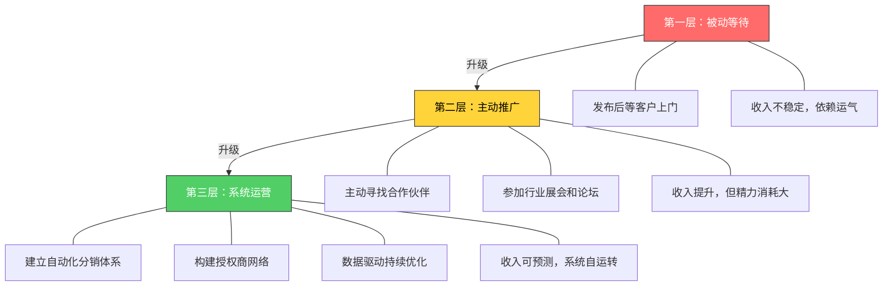
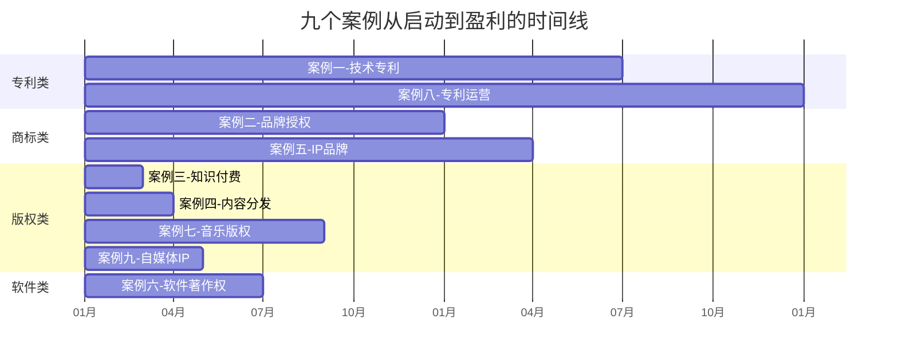

## 实战案例总结：从9个真实案例中提炼的变现规律

九个案例走完，你已经看到了知识产权变现的完整光谱——从技术专利到商标品牌，从知识付费课程到版权内容分发，从软件著作权到音乐版权，从字体设计到自媒体IP矩阵。这些案例并非彼此孤立的故事，它们背后存在着可提炼、可复制、可验证的共同规律。

本节不是简单的"回顾要点"，而是对九个案例进行交叉分析，提取出**可迁移的方法论框架**，让你在面对自己的知识产权变现决策时，有一套经过实战检验的思考工具。

---

### 一、九个案例的全景回顾

先把九个案例的核心信息拉通对比，建立全局认知：

| 序号 | 案例名称 | IP类型 | 变现模式 | 关键成果 | 核心瓶颈 |
|------|---------|--------|---------|---------|---------|
| 1 | 技术专利到百万授权 | 发明专利 | 许可授权 | 年授权收入超100万 | 技术门槛高，周期长 |
| 2 | 个人品牌商标授权 | 商标权 | 品牌授权 | 品牌溢价30%-50% | 品牌建设需要时间积累 |
| 3 | 知识付费课程从0到1 | 版权（课程） | 课程销售 | 月收入稳定过万 | 内容持续更新压力大 |
| 4 | 版权内容多平台分发 | 版权（文章） | 平台收益+广告 | 多平台累计月入2万+ | 内容同质化竞争激烈 |
| 5 | 小众IP到商业品牌 | 版权+商标 | 自营产品+授权 | IP衍生品年营收50万+ | IP生命周期管理困难 |
| 6 | 软件著作权商业化 | 软件著作权 | 订阅制+授权 | ARR持续增长 | 技术维护成本高 |
| 7 | 音乐版权变现 | 版权（音乐） | 版税+授权 | 被动收入持续增长 | 头部效应明显 |
| 8 | 技术专利商业化运营 | 专利组合 | 专利池+交叉许可 | 降低诉讼风险+收入 | 运营门槛极高 |
| 9 | 自媒体IP全链条变现 | 版权+商标+人设 | 广告+电商+课程+授权 | 多元收入流 | 精力分散风险 |

**关键发现：** 九个案例覆盖了知识产权的四大类型（专利、商标、版权、商业秘密中的三种），变现模式涵盖许可授权、产品销售、平台分成、自营品牌四大路径。没有任何一个案例是靠单一变现方式成功的——**多元变现是常态，单一变现是例外。**

---

### 二、从案例中提炼的五条核心规律

#### 规律一：先验证市场需求，再投入保护成本

九个案例中，失败风险最高的共同原因是**在没有验证市场需求之前就投入大量保护成本**。

**正面案例：** 案例三的课程创作者先用免费文章测试读者反馈，确认有付费意愿后才投入课程制作；案例五的插画师先在社交媒体积累10万粉丝，确认IP有商业价值后才注册商标。

**反面教训：** 很多人一想到"知识产权变现"，第一反应是先去申请专利、注册商标，花了数千甚至数万元，最后发现市场根本不需要这个东西。专利申请费（发明约5000-8000元，实用新型约2000-3000元）、商标注册费（300元/类）、课程制作的时间成本——这些都是沉没成本，投出去就收不回来。

**验证方法矩阵：**

| IP类型 | 低成本验证方式 | 验证周期 | 判断标准 |
|--------|--------------|---------|---------|
| 专利 | 先写技术文章测反应→联系目标企业做需求访谈 | 1-3个月 | 有3家以上企业表达合作意向 |
| 商标 | 先用社交媒体测试品牌认知度 | 2-6个月 | 目标受众自发传播，品牌搜索量上升 |
| 课程 | 先发布免费内容→收集反馈→做小规模付费测试 | 1-2个月 | 付费转化率>3%，复购意愿>30% |
| 软件 | 先做MVP→在GitHub/ProductHunt发布 | 1-3个月 | 有100+活跃用户，付费意愿明确 |
| 音乐/设计 | 先在平台发布免费作品→积累粉丝 | 3-12个月 | 有品牌方主动联系合作 |

#### 规律二：保护是杠杆，不是目的

案例一的专利持有人之所以能获得百万授权收入，核心不是专利本身有多牛，而是他**把专利变成了谈判筹码**。案例八更进一步——通过构建专利组合和专利池，让单个专利的价值在组合中被放大。

**保护的真正价值在于三个维度：**

1. **排除竞争：** 专利让你在特定技术领域拥有排他权，竞争对手要么付费授权，要么绕道而行。案例一中，正是因为目标企业无法绕过该专利，才愿意支付高额授权费。

2. **提升议价能力：** 有注册商标的品牌授权价格，通常是未注册品牌的3-5倍。案例二的商标授权之所以能实现品牌溢价，正是因为商标注册提供了法律确定性——被授权方知道自己拿到的是"正品"授权，而不是随时可能被收回的口头许可。

3. **构建资产：** 已注册的知识产权可以在财务报表上列为无形资产，用于质押融资、作价入股、甚至打包出售。案例六的软件著作权被用作银行质押物获得了低息贷款，这是没有著作权登记证书就无法实现的。

**但保护不是越多越好：** 案例八的专利运营者明确提到，维持一项发明专利的年费从第1-3年的900元递增到第13-15年的4000元、第16-20年的6000元。如果你有10项专利，年维护成本可能高达数万元。**只有持续产生商业价值的专利才值得维持**，其余应该果断放弃。

#### 规律三：运营能力决定变现上限

九个案例中，同样的IP类型，变现收入可以相差10倍甚至100倍。差异不在于IP本身的质量，而在于运营能力。

**运营能力的三个层次：**



**案例对比：**

案例四的版权内容分发，起步阶段只是在自己的公众号发文章（第一层），收入有限。后来主动在知乎、头条、B站等多平台分发（第二层），收入提升但精力严重透支。最终建立了内容中台系统——一次创作，自动分发到10+平台，每个平台做适配优化（第三层），实现了"创作1小时，分发覆盖100万+"的效果。

案例九的自媒体IP更典型：从单一的广告收入（第一层），到主动对接品牌合作（第二层），再到构建"内容→流量→电商→课程→品牌授权"的完整变现链条（第三层），每一步都是运营能力的升级。

#### 规律四：多元变现是常态，但要有主次

没有一个成功案例是靠单一收入来源的。但"多元"不等于"什么都做"——成功者都有一个**核心收入来源**占总收入的50%以上，其余收入来源是补充和缓冲。

**收入结构健康度评估：**

| 健康度 | 主收入占比 | 辅助收入来源数 | 风险等级 | 案例参考 |
|--------|-----------|--------------|---------|---------|
| 优秀 | 50%-60% | 3-4个 | 低 | 案例九（电商50%+广告20%+课程15%+授权15%） |
| 良好 | 60%-70% | 2-3个 | 中低 | 案例五（自营产品65%+授权25%+广告10%） |
| 一般 | 70%-80% | 1-2个 | 中 | 案例三（课程销售75%+咨询25%） |
| 脆弱 | >90% | 0-1个 | 高 | 单一平台依赖（任何平台政策变动都致命） |

**多元化的正确顺序：** 先把一个渠道做到稳定盈利，再拓展第二个渠道。案例九的经验是：当第一个渠道月收入稳定超过5000元且持续3个月以上时，才投入精力拓展第二个渠道。同时拓展多个渠道是新手最常犯的错误——精力分散导致每个渠道都做不深，最终全部半途而废。

#### 规律五：时间是最大的盟友，也是最大的敌人

知识产权被称为"时间的复利资产"，但这个复利需要**持续投入**才能实现。

**时间的正面效应：**
- 案例二的商标品牌价值随着知名度提升而持续增值，第5年的品牌估值是第1年的20倍
- 案例七的音乐版税收入逐年增长，因为老作品持续产生播放，新作品不断叠加
- 案例一的专利在授权给第一家企业的第二年，就因为行业口碑效应带来了3家新授权方

**时间的负面效应：**
- 案例三的课程如果不定期更新，6个月后完课率会从70%降到30%，因为行业知识在更新
- 案例四的自媒体内容如果停更超过2个月，平台推荐权重会大幅下降，之前积累的流量基础会快速流失
- 案例五的IP如果缺乏持续的内容输出，粉丝活跃度会在12个月内衰减60%以上

**关键结论：** 知识产权变现不是"一劳永逸"的事情。它更像种树——前期需要持续浇水施肥（内容更新、品牌维护、客户关系），后期才能收获果实（被动收入、品牌溢价、授权费）。但一旦建立起正循环，时间就是你最大的杠杆。

---

### 三、不同路径的决策框架

面对知识产权变现，大多数人卡在"不知道该走哪条路"。以下决策框架基于九个案例的经验提炼，帮你快速定位适合自己的路径。

#### 3.1 四条主路径对比

| 维度 | 路径A：技术专利变现 | 路径B：品牌商标变现 | 路径C：内容版权变现 | 路径D：软件著作权变现 |
|------|-------------------|-------------------|-------------------|---------------------|
| 适合人群 | 有技术创新能力的工程师、科研人员 | 有个人品牌或设计能力的创作者 | 有写作/教学/创作能力的知识工作者 | 有编程能力的开发者 |
| 启动成本 | 高（5000-50000元申请+代理费） | 中（300-3000元注册费+品牌建设） | 低（几乎零成本，创作即可） | 低（著作权登记免费） |
| 变现周期 | 长（1-3年，含申请和授权谈判） | 中（6-18个月品牌建设期） | 短（1-3个月可见收入） | 中（3-12个月产品打磨期） |
| 收入天花板 | 极高（百万级授权费） | 高（品牌溢价+授权费） | 中高（取决于内容质量和分发能力） | 高（SaaS订阅制可规模化） |
| 被动收入程度 | 高（授权后基本自动） | 中（需持续品牌维护） | 中（需持续内容更新） | 高（订阅制自动续费） |
| 核心风险 | 专利无效/被绕过 | 品牌贬值/被仿冒 | 内容过时/平台政策变动 | 技术迭代/竞品替代 |
| 代表案例 | 案例一、案例八 | 案例二、案例五 | 案例三、案例四、案例七 | 案例六 |

#### 3.2 自我评估清单

在选择路径之前，诚实地回答以下问题：

**资源评估（你有什么？）：**
- [ ] 我有一项可申请专利的技术创新
- [ ] 我有至少1000人的粉丝/关注者基础
- [ ] 我在某个领域有3年以上的专业经验
- [ ] 我有可注册商标的品牌名称或Logo
- [ ] 我有已开发完成或接近完成的软件产品
- [ ] 我每周能投入至少10小时在知识产权变现上

**能力评估（你能做什么？）：**
- [ ] 我能清晰地向非专业人士解释我的技术/知识
- [ ] 我有基础的市场营销和推广能力
- [ ] 我能持续产出高质量内容（文字/视频/音频）
- [ ] 我有基本的法律意识（合同、知识产权基础）
- [ ] 我有数据分析能力，能根据数据优化策略

**风险承受评估（你能承受什么？）：**
- [ ] 我能接受6个月以上没有收入的投入期
- [ ] 我有主业收入作为基本保障
- [ ] 我能承受初期投入（5000-50000元）全部损失的风险
- [ ] 我有足够的耐心应对行政流程（专利审批、商标注册等）

**评分标准：**
- 资源评估满足4项以上 + 能力评估满足3项以上 + 风险承受满足2项以上 = 适合立即启动
- 资源评估满足2-3项 + 能力评估满足2-3项 = 先补齐短板再启动
- 资源评估不足2项 = 建议先从内容版权变现（路径C）入手，积累资源后再转型

---

### 四、九个案例的共性成功因素

对九个案例进行交叉分析，以下六个因素在每个成功案例中都起到了关键作用：

#### 4.1 精准定位：找到"你能做"和"市场要"的交集

每个成功案例的起点都不是"我有什么技术"，而是"市场需要什么，而我恰好能提供"。案例一的专利之所以能卖出百万，核心原因是该技术正好解决了行业痛点；案例三的课程之所以能月入过万，是因为HR领域的薪酬谈判课程在市场上存在明显空白。

**定位三步法：**

1. **列出你的能力清单**——不限于专业技术，包括行业经验、人脉资源、独特视角
2. **调研市场需求缺口**——通过搜索引擎关键词、行业论坛、竞品分析找到未被充分满足的需求
3. **找到交集并验证**——用最小成本（免费文章、MVP、试讲）测试市场反应

#### 4.2 快速迭代：不要追求完美，追求验证

案例三的课程V1只有3小时内容，案例六的软件V1只有一个核心功能，案例九的自媒体第一个月只发了8篇文章。**所有成功案例的起点都是"足够好"而非"完美"。** 先推向市场获取真实反馈，再根据反馈快速迭代，比闭门造车打磨半年效果好10倍。

#### 4.3 建立壁垒：从"可替代"到"不可替代"

纯粹的内容很容易被复制，纯粹的技术很容易被绕过。成功案例的共同点是建立了**多重壁垒**：

- **技术壁垒：** 案例一的专利技术有明确的权利要求保护范围
- **品牌壁垒：** 案例二和案例五通过商标注册和长期品牌建设建立了认知壁垒
- **网络壁垒：** 案例九通过社群运营建立了用户关系壁垒
- **数据壁垒：** 案例六通过持续积累的用户数据优化了产品壁垒
- **组合壁垒：** 案例八通过专利组合形成了难以绕过的专利池壁垒

#### 4.4 杠杆思维：用一份投入撬动多份收入

知识产权的核心优势是**边际成本趋近于零**。成功案例无一例外地利用了这个特性：

- 一门课程录制一次，卖给1000人（案例三）
- 一篇文章改写后分发到10个平台（案例四）
- 一首歌曲授权给100个短视频创作者（案例七）
- 一个专利同时授权给5家企业（案例一）
- 一个品牌IP衍生出10个产品线（案例五）

**杠杆率计算公式：**

```text
杠杆率 = 总收入 ÷ 初始投入成本

例：课程制作成本10000元，累计销售收入150000元
杠杆率 = 150000 ÷ 10000 = 15倍

健康的知识产权项目，杠杆率应在5倍以上
```

#### 4.5 合规意识：在法律框架内最大化利益

九个案例中，凡是在知识产权保护上做得好的，后期都避免了大量潜在损失。案例五如果没有及时注册商标，其IP形象可能被他人抢注，导致品牌授权收入全部旁落；案例六如果没有做软件著作权登记，在融资时无法证明软件所有权，估值谈判会非常被动。

**合规检查清单：**
- 创作完成后立即进行版权登记（中国版权保护中心，费用约300元/件）
- 品牌名称确定后立即申请商标注册（国家知识产权局，300元/类）
- 技术方案公开前先申请专利（公开后即丧失新颖性）
- 与合作方签订书面合同，明确知识产权归属
- 定期监测市场，发现侵权及时取证

#### 4.6 长期主义：接受前期投入，享受后期复利

九个案例中，没有任何一个在第1个月就实现盈利。最快的案例三用了2个月，最慢的案例一用了18个月。但一旦跨过盈亏平衡点，收入增长曲线都呈现出指数型特征。

**各案例的盈亏平衡时间线：**



**关键启示：** 如果你需要快速见到收入，优先选择版权类变现（课程、内容分发）；如果你追求高天花板和长期被动收入，选择专利或品牌类变现，但要做好1-2年的投入期准备。

---

### 五、常见失败模式与避坑指南

九个案例中，每个案例主理人都踩过坑。以下是从中提炼的六种典型失败模式：

#### 失败模式一：保护缺失——"先做再说"

**症状：** 创作了内容不登记版权，做了品牌不注册商标，有了发明不申请专利，觉得"等做大了再说"。

**后果：** 案例五的IP创作者在早期没有注册商标，结果发现有人用相似名字做同类产品，维权成本远超当初注册费用。案例三的课程创作者发现自己的课程内容被某机构整包盗用，但由于没有做版权登记，诉讼举证困难。

**纠正方法：** 创作完成的那一刻就是保护的最佳时机。版权登记300元，商标注册300元，这些成本与后期维权动辄数万元的律师费相比微不足道。

#### 失败模式二：完美主义——"再改改就发布"

**症状：** 课程录了又删、产品改了又改，总觉得不够好，迟迟不推向市场。

**后果：** 错过市场窗口期。案例四的自媒体创作者回忆，如果早3个月开始多平台分发，就能赶上某平台的创作者扶持计划，获得大量免费流量。

**纠正方法：** 设定"最迟发布日期"并严格执行。60分的产品+持续迭代 远胜于 100分的产品+永远不发布。

#### 失败模式三：单一依赖——"我在XX平台做得很好"

**症状：** 把所有精力放在单一平台上，收入100%依赖该平台。

**后果：** 平台政策调整、算法变动、甚至平台本身衰落，都会直接摧毁你的收入。某知名知识付费平台2023年调整分成比例，从70%降到50%，大量创作者收入直接腰斩。

**纠正方法：** 在一个平台站稳脚跟后（月收入稳定>5000元），立即拓展第二平台。理想状态是任何一个平台收入不超过总收入的40%。

#### 失败模式四：定价失误——"便宜点卖得多"

**症状：** 担心定价太高没人买，把课程/授权/产品价格定得很低。

**后果：** 低价吸引来的客户质量差（付费意愿低、期望值高、售后问题多），而且低价难以支撑持续的内容更新和服务投入。案例三的课程创作者最初定价99元，发现完课率只有20%；提价到399元后，完课率反而提升到65%——因为花了更多钱的学员更认真对待课程。

**纠正方法：** 定价公式——参考同类产品价格区间，取中上位值。如果你的内容确实比竞品好，大胆定高价。记住：**价格是价值的信号，低价等于告诉市场"我的东西不值钱"。**

#### 失败模式五：忽视数据——"我感觉还不错"

**症状：** 不追踪关键数据指标，凭感觉判断业务健康度。

**后果：** 无法及时发现问题。案例四的创作者在某平台的阅读量连续3个月下降30%，但因为总粉丝数还在增长，完全没有意识到问题，直到收入断崖式下跌才发现是平台算法调整导致内容推荐权重变化。

**纠正方法：** 建立核心指标看板，至少追踪以下数据：

| 指标类别 | 关键指标 | 监测频率 | 预警阈值 |
|---------|---------|---------|---------|
| 流量 | 各平台访问量/阅读量 | 每日 | 连续7天下降>20% |
| 转化 | 付费转化率 | 每周 | 低于行业均值50% |
| 收入 | 各渠道收入及占比 | 每月 | 单一渠道收入占比>50% |
| 用户 | 复购率/续费率 | 每月 | 低于40% |
| 内容 | 完课率/互动率 | 每周 | 完课率<50%或互动率<3% |

#### 失败模式六：孤军奋战——"我自己能搞定"

**症状：** 不愿合作、不愿分利，试图一个人完成从创作到变现的所有环节。

**后果：** 精力分散导致每个环节都做到80分，但没有一个环节做到极致。案例九的自媒体创作者早期试图自己做内容、做设计、做推广、做客服、做电商运营，结果每项都做得一般，收入增长缓慢。后来把设计外包、客服兼职化、电商交给代运营，自己专注于内容创作和商业策略，收入在6个月内翻了3倍。

**纠正方法：** 明确自己的核心能力，把非核心环节外包或合作。通常，创作者应该专注于内容质量和商业策略，把技术实现、设计制作、运营推广等环节交给更专业的人。

---

### 六、从案例到行动：你的90天启动计划

基于九个案例的共同经验，以下是可执行的90天启动计划：

#### 第一阶段：定位与验证（第1-30天）

**核心任务：** 找到你的IP定位，并用最小成本验证市场。

| 周次 | 行动项 | 交付物 | 预期投入 |
|------|--------|--------|---------|
| 第1周 | 完成自我评估清单；调研3个目标市场 | 评估报告+市场调研笔记 | 8小时 |
| 第2周 | 确定IP方向；设计验证方案 | 定位文档+验证计划 | 6小时 |
| 第3周 | 制作验证内容（文章/MVP/试讲视频） | 可展示的验证内容 | 12小时 |
| 第4周 | 发布验证内容；收集反馈数据 | 反馈数据报告 | 8小时 |

**成功标准：** 至少50人看过你的验证内容，至少5人表达了付费意愿。

#### 第二阶段：保护与创建（第31-60天）

**核心任务：** 完成知识产权保护，创建第一版变现产品。

| 周次 | 行动项 | 交付物 | 预期投入 |
|------|--------|--------|---------|
| 第5周 | 提交版权/商标/专利申请 | 申请受理通知书 | 4小时+费用 |
| 第6周 | 创建产品V1（课程第一期/软件MVP/品牌设计方案） | 产品V1 | 20小时 |
| 第7周 | 内部测试+小范围试用 | 测试反馈报告 | 10小时 |
| 第8周 | 根据反馈迭代，完成产品V1.1 | 可发布的产品 | 12小时 |

**成功标准：** 知识产权申请已提交，产品V1.1可对外发布。

#### 第三阶段：变现与优化（第61-90天）

**核心任务：** 正式发布产品，获取第一批付费用户，建立数据追踪体系。

| 周次 | 行动项 | 交付物 | 预期投入 |
|------|--------|--------|---------|
| 第9周 | 正式发布产品；启动推广 | 产品上线+推广启动 | 15小时 |
| 第10周 | 获取首批用户；收集使用反馈 | 用户反馈报告 | 10小时 |
| 第11周 | 根据反馈优化产品；调整定价策略 | 产品V1.2 | 12小时 |
| 第12周 | 建立数据看板；规划下一阶段 | 数据看板+季度规划 | 8小时 |

**成功标准：** 至少获得10个付费用户，月收入覆盖知识产权维护成本。

---

### 七、知识产权变现的常见认知误区

从九个案例中提炼出最容易误导新手的六个认知误区：

**误区一："好技术自然会有人买"**

真相：技术好只是必要条件，不是充分条件。案例一的专利技术确实先进，但真正让它变现的是主动对接目标企业、准备专业的授权方案、以及持续的商务谈判。99%的好技术躺在专利局的数据库里无人问津，不是因为技术不好，而是因为发明人没有做商业化运营。

**误区二："我先免费做，等有流量了再收费"**

真相：免费和付费吸引的是完全不同的人群。免费用户中有付费意愿的比例通常不到5%。案例九的经验是：从第一天起就应该设计好付费产品，免费内容只是引流手段，不是最终目的。长期只做免费内容会固化用户对你"免费"的认知，后期转化极其困难。

**误区三："注册了商标/专利就安全了"**

真相：注册只是起点，不是终点。商标需要每10年续展，专利需要每年缴纳年费，版权需要在发现侵权时主动维权。案例二的品牌所有者每年投入约2万元用于商标监测和维权，这笔投入保护了每年20万+的品牌授权收入——投入产出比为1:10。

**误区四："大平台分成太低，不值得"**

真相：大平台的价值不在于分成比例，而在于流量和信任背书。案例三的课程在自有网站售价399元，月销10单；在某知识付费平台同样售价，月销80单。虽然平台抽成30%，但绝对收入是自有网站的6倍。先借平台势能，再逐步建立自有渠道，是更务实的策略。

**误区五："知识产权变现就是卖课/卖专利"**

真相：这只是最直接的变现方式，远非全部。案例八展示了专利质押融资、交叉许可、专利池运营等高级玩法；案例五展示了IP衍生品、品牌联名、线下体验等多元化变现路径。变现方式的想象力决定了收入的天花板。

**误区六："我不够专业，做不了知识产权变现"**

真相：你不需要是行业顶尖专家，你只需要比目标受众多懂一点。案例三的课程创作者不是薪酬谈判领域的顶级专家，但他把HR领域的薪酬谈判知识系统化整理，用通俗易懂的方式呈现——这正是他的目标受众（职场新人）所需要的。**教80分的人70分的内容，比教60分的人100分的内容，市场大100倍。**

---

### 八、进阶思考：当你的知识产权资产规模扩大后

当你的知识产权变现进入成熟期（年收入超过20万），需要考虑以下进阶问题：

#### 8.1 从个人到团队

单人作战有天花板。案例九在年收入突破30万后开始组建小团队（1个内容助理+1个运营兼职），年收入在团队化后一年内突破80万。关键不是"雇多少人"，而是"哪些环节必须自己做，哪些可以交给别人"。

#### 8.2 从单品到矩阵

单一产品/单一IP的风险太高。案例五在"柴犬物语"IP成功后，用同样的方法论孵化了3个新IP，虽然不是每个都成功（2个失败，1个成功），但成功的那个新IP贡献了总收入的30%，实现了风险分散。

#### 8.3 从国内到国际

中国知识产权在国际市场的价值被严重低估。案例一的专利授权在第3年拓展到东南亚市场，授权费虽然低于国内市场（约为国内的60%），但新增了3个授权方，总收入提升了40%。版权内容的跨境分发（如Udemy、Skillshare等国际平台）也是值得关注的方向。

#### 8.4 从变现到资本化

当知识产权资产达到一定规模，可以考虑资本化运作：知识产权质押融资、作价入股、打包出售、甚至IPO。案例六的软件著作权在B轮融资时被估值800万，占公司总估值的40%。这是知识产权变现的最高形态——**让知识产权成为撬动资本的杠杆。**

---

### 九、总结：知识产权变现的本质

回到本章开篇的公式：**知识产权变现 = 创造 × 保护 × 运营**

九个案例用真实数据证明了这个公式的有效性。但比公式更重要的是背后的思维方式转变：

**从"打工者思维"到"资产拥有者思维"：** 打工者出卖时间换取报酬，时间停止则收入停止；资产拥有者创造可以持续产生收入的资产，即使停止投入，已有资产仍在"打工"。知识产权正是最适合个人构建的"时间复利资产"——你今天写的一篇文章、录的一门课、申请的一个专利，可能在未来5年、10年甚至更长时间持续为你创造收入。

**从"完美主义"到"快速验证"：** 不要等到完美才行动。60分的产品推向市场获取反馈，比100分的产品永远留在草稿箱强一万倍。

**从"单一收入"到"多元矩阵"：** 不要依赖单一平台、单一产品、单一收入来源。构建多元化的收入矩阵，才能抵御风险、放大收益。

**从"短期投机"到"长期经营"：** 知识产权变现不是一夜暴富的捷径，而是一条需要耐心和坚持的长期主义之路。那些在第1年就放弃的人，永远看不到第3年的复利增长。

现在，选择你的第一条路径，完成90天启动计划的第一步——不是明天，不是下周，是今天。因为在知识产权变现的世界里，**最早行动的人拥有最大的竞争优势**：你比别人早一天创作，就早一天积累；早一天申请，就早一天确权；早一天发布，就早一天获得市场反馈。

**行动，是所有方法论的最终检验标准。**
