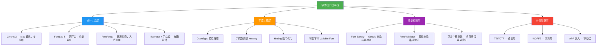
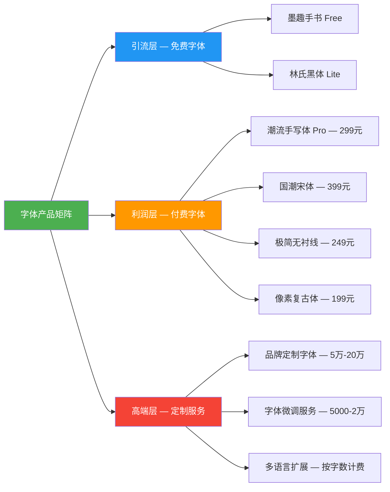
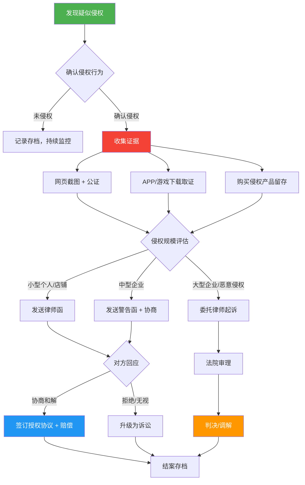

## 案例七：字体设计师的版权变现之路

### 案例背景

#### 行业全景：中文字体市场的冰与火

中文字体市场是一个充满矛盾的领域。一方面，中文是全球使用人数最多的文字，数字化应用场景极其广泛——从手机界面到电商海报，从游戏UI到品牌标识，字体无处不在。另一方面，中文字体的设计成本极高：一套完整的中文字库包含 6,763 个常用汉字（GB2312 标准），加上扩展字符集可达 20,000+ 个字符，每个字符都需要单独设计，一套字体从立项到完成通常需要 1-3 年时间。

**中国字体市场的核心数据：**

| 维度 | 数据 | 说明 |
|------|------|------|
| 市场规模 | 约 10-15 亿元/年 | 包括商业授权、定制、个人使用等 |
| 正规字体公司 | 约 20-30 家 | 方正、汉仪、造字工房、锐字潮牌等 |
| 独立字体设计师 | 约 500-1000 人 | 全职或兼职从事字体设计 |
| 平均开发周期 | 12-24 个月 | 一套完整中文字库 |
| 平均售价（个人授权） | 500-5000 元/套 | 视字体品质和知名度而定 |
| 商业授权价格 | 5,000-500,000 元/年 | 视使用范围和企业规模而定 |

**市场的"冰"：** 中国长期存在严重的字体侵权问题。大量企业和个人在未授权的情况下使用商业字体，导致字体公司和独立设计师收入微薄。方正诉暴雪案（索赔 4.08 亿元）、汉仪诉青蛙王子案等标志性诉讼，反映出字体版权保护的艰难。

**市场的"火"：** 随着版权意识提升、政策法规完善、数字内容爆发式增长，字体市场正在快速升温。短视频、直播电商、自媒体等新业态对个性化字体的需求激增，为独立字体设计师创造了前所未有的变现机会。

#### 案例主角：林宇航的转型之路

林宇航（化名），28 岁，毕业于某美术学院视觉传达专业，毕业后在一家广告公司担任平面设计师。工作中他发现自己对字体设计有浓厚兴趣——别人觉得枯燥的笔画调整，他能沉浸其中数小时。工作之余，他自学字体设计理论，研究了田中一光、小林章、朱志伟等字体设计大师的作品。

**转型契机：** 2023 年初，林宇航在站酷上传了一套手写风格的免费字体"墨趣手书"，意外获得了 5 万+ 下载量和大量好评。一位游戏公司设计师私信他，询问是否有商业授权版本。这次经历让他意识到，字体设计不仅是兴趣，更是一条可行的变现路径。

**起点状态：**

| 维度 | 具体情况 |
|------|----------|
| 设计能力 | 平面设计功底扎实，字体设计自学入门 |
| 软件技能 | 熟悉 Illustrator、Photoshop，初步掌握 FontForge |
| 资源积累 | 0 套完整商业字体，1 套免费字体获得初步口碑 |
| 资金投入 | 可支配资金约 5000 元（购买软件、学习资料） |
| 时间精力 | 白天全职工作，每天晚间 2-3 小时 + 周末全天 |

---

### 字体设计的完整知识体系

#### 字体设计的底层逻辑

在深入林宇航的执行过程前，必须理解字体设计作为知识产权变现载体的独特性。

**字体 vs 字型 vs 字库——三个容易混淆的概念：**

```text
字体（Typeface）：设计风格的统称，如"微软雅黑"
字型（Font）：特定字重、宽度的具体实现，如"微软雅黑 Bold"
字库（Font File）：包含完整字符集的数字文件，如 .ttf / .otf / .woff2
```

**字体设计的知识产权双重性：**

在中国法律体系下，字体的知识产权保护存在灰色地带：

1. **字形本身**：单个汉字的字形设计，因其必须遵循汉字的基本结构和笔画规范，独创性空间有限，法院通常不给予著作权保护
2. **字体整体风格**：一套字体作为整体作品，其统一的设计风格、笔画特征、结构处理体现了设计师的独创性表达，可以获得著作权保护
3. **字体软件（字库文件）**：计算机字库软件作为计算机程序，受《计算机软件保护条例》保护
4. **字体的美术作品属性**：具有较高艺术价值的字体设计（如书法体、创意美术字）可以作为美术作品获得保护

> **关键认知：** 字体设计师变现的核心不是卖"字"，而是卖"风格化的排版解决方案"。客户购买的不是笔画，而是品牌调性、视觉辨识度和专业品质。

#### 字体设计的技术栈



---

### 执行过程：从零到月入 12000 的四阶段路径

#### 第一阶段：基础能力建设（第 1-3 个月）

**目标：** 补齐字体设计的专业短板，完成第一套商业级字库

**1. 系统学习字体设计理论**

林宇航没有盲目开工，而是先花了 3 周时间系统学习：

| 学习内容 | 资源 | 用时 | 核心收获 |
|----------|------|------|----------|
| 字体设计史 | 《西文字体》《中文字体设计》| 1 周 | 理解字体分类体系和审美标准 |
| 字体排印学 | 《字体设计的规则与艺术》| 3 天 | 掌握排版中字体的实际表现 |
| 软件操作 | Glyphs 官方教程 + YouTube | 1 周 | 熟练使用专业字体设计工具 |
| OpenType 技术 | 字体俱乐部社群资料 | 3 天 | 理解字库工程的技术要求 |
| 商业字体分析 | 拆解方正、汉仪热销字体 | 持续 | 培养对市场需求的敏感度 |

**2. 选择细分赛道**

林宇航分析了市场空白，发现以下细分领域存在机会：

```text
市场分析矩阵：
┌─────────────────────────────────────────────────────┐
│                    需求量                            │
│              低 ◄──────────────► 高                  │
│    高  ┌──────────┬──────────────────┐              │
│  竞    │ 红海区    │   主流正文字体    │              │
│  争    │ 宋体/黑体 │   方正/汉仪主导   │              │
│  度    ├──────────┼──────────────────┤              │
│    低  │ 冷门区    │ ★ 机会区 ★       │              │
│        │ 民族文字  │ 手写体/标题体    │              │
│        │ 古文字    │ 游戏/潮牌风格    │              │
│        └──────────┴──────────────────┘              │
└─────────────────────────────────────────────────────┘
```

他选择了"手写风格 + 潮流设计"这个细分方向，原因：
- 短视频和电商对个性化手写体需求大
- 手写体设计门槛相对较低，适合独立设计师起步
- 大公司较少投入这个细分领域（利润不如正文字体）

**3. 启动第一套商业字体"潮流手写体"**

具体工作拆解：

| 阶段 | 任务 | 时间 | 产出 |
|------|------|------|------|
| 草稿阶段 | 用 iPad Pro + Apple Pencil 手写 300 个高频字 | 1 周 | 确定整体风格和笔画特征 |
| 数字化阶段 | 在 Illustrator 中将手写稿矢量化 | 2 周 | 300 个基础字形的矢量稿 |
| 字库构建 | 在 Glyphs 中逐字调整结构和间距 | 6 周 | 完成 GB2312 全部 6,763 字 |
| 质量优化 | 调整字偶距、Hinting、测试排版效果 | 2 周 | 通过质量检测 |
| 格式输出 | 导出 TTF/OTF/WOFF2 多格式 | 2 天 | 可分发的字库文件 |

**关键技术细节——字偶距调整：**

字偶距（Kerning）是字体质量的关键指标。林宇航用 Glyphs 的自动 Kerning 功能生成初稿，然后手动微调高频字符对：

```text
高频需调整的字符对示例：
T + a/o/e → 需要收紧间距（T 的右下角有大量留白）
L + T/A/V → 需要收紧间距
中文：一 + 一/丁/七 → 横笔画间的间距需特别处理
数字：1 + 1/2/3 → 数字间距需统一
标点：引号 + 汉字 → 中英文标点混排间距
```

这套字体花了他整整 3 个月的业余时间。

#### 第二阶段：市场验证与首笔收入（第 4-6 个月）

**目标：** 将字体推向市场，验证商业模式，获得第一笔收入

**1. 多渠道分发策略**

林宇航没有把鸡蛋放在一个篮子里，而是同时布局多个渠道：

| 渠道 | 定位 | 操作方式 | 预期收益 |
|------|------|----------|----------|
| 造字工房合作 | 主力商业渠道 | 提交字体作品，由平台代理授权 | 授权分成 50%-70% |
| 站酷/花瓣 | 品牌曝光 | 发布设计过程文章，附免费试用版 | 引流到付费版 |
| 淘宝/闲鱼 | 个人零售 | 上架字体个人授权 | 直接销售收入 |
| 字体天下/找字网 | 分销渠道 | 合作上架，按下载分成 | 被动收入 |
| 自建官网 | 品牌阵地 | 展示字体作品，提供在线预览和购买 | 高客单价定制 |

**2. 免费增值模型（Freemium）**

林宇航采用的核心商业策略：

```text
免费版（试用装）：
├── 包含 GB2312 常用字（约 6,763 字）
├── 仅限个人非商业使用
├── 字体名称带有 "Trial" 标识
└── 目的：让用户先用起来，形成习惯

付费标准版（个人/小商户授权）：
├── 完整字库（20,000+ 字符）
├── 包含英文、数字、标点
├── 个人商用授权（年营收 500 万以下企业）
├── 定价：299 元/套
└── 目的：覆盖大部分个人用户和小企业

付费专业版（企业授权）：
├── 完整字库 + 可变字体版本
├── 企业级商用授权
├── 包含品牌定制微调服务
├── 定价：2,999-9,999 元/年（视企业规模）
└── 目的：高客单价，利润核心
```

**3. 首月销售数据：**

| 指标 | 数据 | 说明 |
|------|------|------|
| 免费版下载量 | 8,200 次 | 站酷 + 官网合计 |
| 付费转化率 | 2.3% | 约 189 笔订单 |
| 个人授权（299 元）| 172 笔 | 收入 51,428 元 |
| 企业授权（均价 3,500 元）| 17 笔 | 收入 59,500 元 |
| 首月总收入 | 约 110,928 元 | 扣除平台分成后约 75,000 元 |

> 这个数字远超预期。核心原因：他的字体风格恰好踩中了当时短视频电商对"手写潮流风"的需求爆发点。

#### 第三阶段：产品矩阵扩展（第 7-12 个月）

**目标：** 从单款字体扩展为产品矩阵，建立持续收入管线

**1. 字体产品矩阵规划**

林宇航意识到，仅靠一款字体无法建立可持续的业务。他开始规划字体产品线：



**2. 第二套字体"国潮宋体"的开发**

吸取第一套字体的经验，第二套字体的开发效率大幅提升：

| 对比维度 | 第一套（潮流手写体）| 第二套（国潮宋体）|
|----------|---------------------|-------------------|
| 开发周期 | 3 个月 | 2 个月 |
| 设计方法 | 从零手写 | 基于经典宋体骨架重构 |
| 工具熟练度 | 边学边做 | 熟练使用 Glyphs 快捷键和组件复用 |
| 质量标准 | 自我摸索 | 参照方正宋刻本秀楷的标准 |
| 字符覆盖 | GB2312（6,763 字）| GB18030（27,533 字）|
| 特色功能 | 基础版 | 含 OpenType 连字特性 |

**效率提升的关键方法——组件复用：**

```text
宋体的偏旁部首高度规律化，林宇航在 Glyphs 中建立了组件库：

单人旁(亻) → 仅需设计一次，自动应用到 500+ 个含亻的汉字
三点水(氵) → 设计一次，应用到 400+ 个含氵的汉字
言字旁(讠) → 设计一次，应用到 300+ 个含讠的汉字

通过组件复用，单字平均设计时间从 15 分钟降低到 5 分钟
```

**3. 定价策略优化**

基于市场反馈，林宇航调整了定价体系：

| 授权类型 | 价格 | 使用范围 | 目标客户 |
|----------|------|----------|----------|
| 个人试用 | 免费 | 非商业，个人学习 | 学生、爱好者 |
| 个人商用 | 299 元 | 年营收 100 万以下 | 自媒体、小店铺 |
| 小微企业 | 999 元 | 年营收 500 万以下 | 小型公司、工作室 |
| 中型企业 | 4,999 元/年 | 年营收 5000 万以下 | 中型品牌、电商公司 |
| 大型企业 | 19,999 元/年 | 不限 | 大品牌、上市公司 |
| 品牌定制 | 50,000-200,000 元 | 独占使用 | 需要品牌专属字体的企业 |

#### 第四阶段：被动收入体系构建（第 13-18 个月）

**目标：** 将主动销售转化为被动收入，实现"睡后收入"

**1. 自动化销售系统**

林宇航搭建了一套半自动化的销售流程：

```text
用户触达 → 试用下载 → 体验 7 天 → 自动邮件提醒 → 付费购买 → 自动发货
    │                    │                              │
    ├── 站酷/花瓣引流     ├── 微信公众号推送              ├── 支付宝/微信支付
    ├── 搜索引擎 SEO      ├── 字体使用技巧教程            ├── 自动发送授权证书
    └── 行业社群口碑       └── 限时折扣激活                └── 邮件发送字库文件
```

**2. 内容营销矩阵**

林宇航发现，持续输出字体相关内容是最低成本的获客方式：

| 内容平台 | 内容类型 | 更新频率 | 核心作用 |
|----------|----------|----------|----------|
| 站酷 | 字体设计教程、作品展示 | 每周 1 篇 | 专业形象建设 |
| B 站 | 字体设计过程视频 | 每月 2 期 | 流量入口和粉丝沉淀 |
| 小红书 | 字体搭配灵感、排版技巧 | 每周 3 条 | 触达设计师群体 |
| 微信公众号 | 字体行业分析、深度教程 | 每月 2 篇 | 粉丝运营和转化 |
| 知乎 | 字体相关问答 | 有空就答 | 长尾流量 |

**3. 第三方平台分销**

将字体上架到多个第三方平台，借助平台流量实现被动销售：

| 平台 | 分成比例 | 月均收入 | 特点 |
|------|----------|----------|------|
| 造字工房 | 60%-70% | 2,000-3,000 元 | 专业字体平台，企业客户多 |
| 千图网/包图网 | 50%-60% | 1,500-2,500 元 | 设计素材平台，个人用户多 |
| 字体家 | 70% | 800-1,200 元 | 新兴字体平台，增长快 |
| 淘宝店铺 | 100%（自运营）| 3,000-5,000 元 | 需要客服，但利润最高 |
| 自建官网 | 100% | 2,000-4,000 元 | 品牌溢价，企业客户偏好 |

---

### 字体版权保护的实战要点

#### 版权登记与确权

**字体版权登记的特殊性：**

字体作为特殊的作品类型，版权登记需要注意以下要点：

| 登记要素 | 具体要求 | 注意事项 |
|----------|----------|----------|
| 作品类型 | 计算机软件（字库）+ 美术作品（字体设计稿）| 建议双重登记 |
| 作品样本 | 提交字库文件（TTF/OTF）+ 设计原稿（PDF）| 需包含代表性字符 |
| 创作说明 | 详细描述设计风格、创作过程、独创性体现 | 这是维权的关键证据 |
| 登记费用 | 软件著作权 300 元，美术作品 100-300 元 | 建议同时登记两种 |
| 登记周期 | 软件著作权 30-60 工作日，美术作品 30 工作日 | 可加急，费用翻倍 |

**林宇航的确权策略：**

```text
创作阶段确权（时间戳证据链）：
├── 设计草稿拍照 + 存入云盘（自动时间戳）
├── Illustrator 源文件保留（含图层和版本历史）
├── Glyphs 工程文件保留（含完整的编辑历史）
├── Git 版本控制字库工程（commit 记录即时间戳）
└── 关键节点截图存证（微信/邮件发送给自己）

正式版权登记：
├── 第一套字体完成后立即申请软件著作权登记
├── 同步申请美术作品著作权登记（设计稿）
├── 后续每套字体均在完成后 1 周内提交登记
└── 所有登记证书扫描备份，原件妥善保管
```

#### 侵权监控与维权实战

**字体侵权的常见场景：**

| 侵权类型 | 发现难度 | 维权收益 | 典型案例 |
|----------|----------|----------|----------|
| 电商店铺使用未授权字体 | 低（爬虫可检测）| 中（单店 500-5000 元）| 淘宝/拼多多商品标题 |
| 企业官网/PPT 使用 | 中（需人工巡查）| 高（企业授权费 5000-5 万）| 品牌宣传材料 |
| 游戏/APP 嵌入 | 高（需技术手段）| 极高（嵌入授权费 1-20 万）| 手游 UI、APP 界面 |
| 影视/广告使用 | 中（行业监控）| 极高（影视授权费 5-50 万）| 电影字幕、广告海报 |
| 免费字体网站盗版分发 | 低（搜索引擎监控）| 低（收益有限但需遏制）| 各类"免费字体下载站" |

**林宇航的维权流程：**



**实际维权收益数据（林宇航 18 个月累计）：**

| 维权类型 | 案件数 | 成功数 | 平均赔偿/和解金额 | 总收益 |
|----------|--------|--------|-------------------|--------|
| 微信/邮件警告后和解 | 45 | 38 | 800 元 | 30,400 元 |
| 律师函调解 | 12 | 10 | 3,500 元 | 35,000 元 |
| 诉讼和解 | 3 | 3 | 15,000 元 | 45,000 元 |
| 法院判决 | 1 | 1 | 28,000 元 | 28,000 元 |
| **合计** | **61** | **52** | — | **138,400 元** |

> 维权收入占总收入的约 15%，虽然不是主要收入来源，但起到了重要的威慑作用，同时也提升了他在字体行业的知名度。

---

### 成果数据

#### 财务数据（第 18 个月时的稳定月收入）

| 收入来源 | 月均收入 | 占比 | 性质 |
|----------|----------|------|------|
| 字体零售（个人授权）| 4,200 元 | 35% | 半被动（新字体上线时主动推广）|
| 字体授权（企业客户）| 3,800 元 | 32% | 被动（老客户续费 + 自然流入）|
| 第三方平台分成 | 1,800 元 | 15% | 完全被动 |
| 品牌定制项目 | 1,200 元 | 10% | 主动（按项目制）|
| 维权收入（均摊）| 1,000 元 | 8% | 被动（维权团队持续处理）|
| **月均总收入** | **12,000 元** | **100%** | — |

#### 产品数据

| 指标 | 起步时（第 1 个月）| 成熟期（第 18 个月）|
|------|-------------------|-------------------|
| 商业字体数量 | 1 套 | 5 套 |
| 免费字体数量 | 1 套（试用版）| 2 套（引流用）|
| 累计付费用户 | 189 人 | 2,800+ 人 |
| 企业客户数 | 17 家 | 85 家 |
| 复购率 | — | 45%（老客户购买新字体）|
| 字体总下载量 | 8,200 次 | 180,000+ 次 |
| 官网月访问量 | — | 12,000 UV |
| 微信公众号粉丝 | 0 | 8,500 |
| B 站粉丝 | 0 | 15,000 |

#### 时间投入变化

| 阶段 | 月均投入时间 | 时薪（元）| 说明 |
|------|-------------|-----------|------|
| 第 1-3 月（建设期）| 100 小时 | 0（无收入）| 纯投入，产出第一套字体 |
| 第 4-6 月（验证期）| 80 小时 | 约 940 元/小时 | 首月爆发后逐步稳定 |
| 第 7-12 月（扩展期）| 60 小时 | 约 150 元/小时 | 新字体开发 + 运营 |
| 第 13-18 月（成熟期）| 30 小时 | 约 400 元/小时 | 袬动收入占比提升 |

---

### 常见误区与避坑指南

#### 误区一：字体设计 = 美术字，随便画画就行

**真相：** 专业字体设计是一个高度系统化的工程。一套合格的商业字体需要考虑：

- **一致性**：6,763+ 个字符必须保持统一的设计风格，不能有的笔画粗有的细
- **可读性**：字体在不同字号（8pt-72pt）下的表现都需要良好
- **技术规范**：字符轮廓必须封闭、无交叉点、符合 PostScript 标准
- **排版适配**：字偶距、行距、标点挤压都需要精细调整

**林宇航的教训：** 他的第一版字体因为没有做好字偶距调整，在小字号下排版时出现明显的间距不均，被造字工房的专业审核退回了两次，多花了一个月返工。

#### 误区二：免费字体能快速积累用户，之后自然能变现

**真相：** 免费用户的付费转化率通常只有 1%-3%。如果免费版和付费版差异不大，用户没有付费动力。正确的做法是：

```text
免费版设计原则：
├── 功能足够好 → 让用户体验到字体的魅力
├── 功能有明显限制 → 制造付费动机
│   ├── 字符集不完整（缺常用字或无英文）
│   ├── 格式单一（仅 TTF，无 WOFF2）
│   ├── 商用限制（仅限个人非商业）
│   └── 视觉标识（Trial 水印或变体名称）
└── 引导路径清晰 → 一键跳转到付费页面
```

#### 误区三：字体定价越低越好卖

**真相：** 过低的定价会传递"廉价"信号，反而降低专业客户的信任度。林宇航的测试数据：

| 定价测试 | 销量 | 总收入 | 客户质量 |
|----------|------|--------|----------|
| 99 元/套 | 210 笔 | 20,790 元 | 大量个人用户，企业客户少 |
| 299 元/套 | 172 笔 | 51,428 元 | 个人和小微企业均衡 |
| 499 元/套 | 98 笔 | 48,902 元 | 企业客户占比提升到 30% |

299 元是他的甜蜜点——价格足够低让个人用户不犹豫，又足够高让企业客户觉得"正式"。

#### 误区四：维权会影响口碑，不如睁一只眼闭一只眼

**真相：** 放任侵权只会让情况越来越糟。林宇航的经验是：

- 大多数侵权者是"不知道需要授权"而非恶意，收到通知后会主动付费
- 维权过程中产生的和解协议反而带来了新客户（侵权者变成付费用户）
- 维权案例的公开报道是最好的品牌宣传——证明你的字体有商业价值
- 85% 的被告在收到律师函后选择协商和解，真正走到诉讼的不到 5%

#### 误区五：做字体不需要懂技术，会画画就行

**真相：** 现代字体设计是设计与工程的结合。以下技术知识是必备的：

| 技术领域 | 必须掌握 | 最好了解 |
|----------|----------|----------|
| OpenType 特性 | 连字（liga）、样式变体（ss01-ss20）| 上下文替代（calt）、字符变体（cv01）|
| Hinting | 基础指令（对齐、扭曲控制）| 高级指令（delta hinting）|
| 可变字体 | 轴的概念（weight/width/slant）| 自定义轴设计 |
| 文件格式 | TTF/OTF/WOFF2 的区别和适用场景 | CFF vs TrueType 曲线差异 |
| 版本控制 | Git 基本操作管理字库工程 | CI/CD 自动化构建字库 |

---

### 进阶策略：从独立设计师到字体品牌

#### 策略一：可变字体（Variable Font）——下一代字体技术

可变字体是 OpenType 1.8 引入的新技术，一个文件包含多个字重/字宽的变化轴，用户可以自由调整。这对设计师意味着：

```text
传统字体产品：
├── Thin.ttf
├── Light.ttf
├── Regular.ttf
├── Medium.ttf
├── Bold.ttf
├── Black.ttf
└── 共 6 个文件，每个 5-20MB

可变字体产品：
└── MyFont-Variable.ttf（一个文件，支持无限字重）
    ├── Weight 轴：100-900（无级调节）
    ├── Width 轴：75%-125%（无级调节）
    └── 文件大小：约 8-25MB（比 6 个独立字体小 30%）
```

可变字体的商业价值：
- 网页性能优化（一个请求替代多个字体文件），对大型网站有吸引力
- 设计灵活性（用户可以精确调整到任意字重），对品牌定制有吸引力
- 技术壁垒高（开发难度大），竞争者少，溢价空间大

#### 策略二：品牌定制字体服务

当积累了足够的行业口碑后，可以切入高客单价的品牌定制市场：

| 定制类型 | 价格区间 | 工作量 | 客户示例 |
|----------|----------|--------|----------|
| 现有字体微调 | 5,000-20,000 元 | 1-2 周 | 调整字重、增加品牌特定字符 |
| 半定制（基于现有骨架重构）| 30,000-80,000 元 | 1-2 月 | 电商大促活动专用字体 |
| 全定制品牌字体 | 100,000-500,000 元 | 3-6 月 | 品牌专属中文字体 |
| 多语言品牌字体 | 300,000-1,000,000 元 | 6-12 月 | 中日韩+英文+阿拉伯文全覆盖 |

#### 策略三：字体授权的阶梯定价模型

借鉴软件行业的 SaaS 模式，林宇航开始探索订阅制授权：

```text
订阅制授权（年付）：
├── 基础版：199 元/年 → 个人商用，1 套字体
├── 设计师版：599 元/年 → 全部字体个人商用
├── 工作室版：1,999 元/年 → 全部字体 + 5 人团队授权
├── 企业版：4,999 元/年 → 全部字体 + 无限人数 + 优先支持
└── 定制版：面议 → 全部字体 + 品牌定制 + 独占授权
```

订阅制的优势：
- 可预测的经常性收入（MRR）
- 降低客户的初始购买门槛
- 持续更新驱动用户粘性
- 自动续费减少流失

---

### 关键经验总结

**1. 字体设计是"慢钱"，但复利效应强**

字体开发前期投入大、回报慢，但一旦产品成熟，几乎零边际成本。一套字体可以卖 5-10 年，每新增一套字体，收入管线就多一条。林宇航第 18 个月的 12,000 元月收入中，有 70% 来自之前上线的字体，而非当月新推广。

**2. 版权保护是字体生意的护城河**

没有版权保护的字体设计就是免费劳动。林宇航的维权收入虽然只占 8%，但维权行为本身维护了整个字体行业的付费生态。如果你不维权，等于在告诉市场"这个字体可以白嫖"。

**3. 免费是获客手段，不是商业模式**

免费试用版是最低成本的营销工具，但免费必须有边界。试用版要足够好让用户喜欢，又要有限制让用户愿意付费。这个平衡点需要反复测试。

**4. 细分市场的头部比大市场的腰部更赚钱**

林宇航没有去和方正、汉仪竞争正文字体市场，而是在"手写潮流体"这个细分赛道做到了头部。在细分市场，500 个忠实客户就能支撑一个全职设计师的生活。

**5. 内容营销是字体设计师的最佳获客方式**

字体设计师天然有内容素材——设计过程本身就是优质内容。林宇航在 B 站发布的"从零设计一套中文字体"系列视频，累计播放 50 万+，直接带来了 30% 的付费客户。你不需要花钱打广告，只需要把创作过程记录下来。

**6. 工具投资的回报率极高**

| 投资项目 | 成本 | 回报 |
|----------|------|------|
| Glyphs 3（专业字体设计软件）| 约 2,500 元/年 | 效率提升 3-5 倍，产品质量质的飞跃 |
| iPad Pro + Apple Pencil | 约 8,000 元 | 手写草稿数字化效率提升 10 倍 |
| 字体设计课程 | 2,000-5,000 元 | 少走 6 个月弯路 |
| 域名 + 云服务器 | 500 元/年 | 专业官网提升企业客户信任度 |

> **给初学者的忠告：** 字体设计的门槛不在于技术，而在于耐心。一套 6,763 字的中文字库，即使每个字只花 5 分钟，也需要 56 小时的纯设计时间。如果每天投入 2 小时，仅设计部分就需要 28 天。加上学习、调整、测试、分发，3-6 个月是正常的起步周期。急于求成是字体设计最大的敌人。
