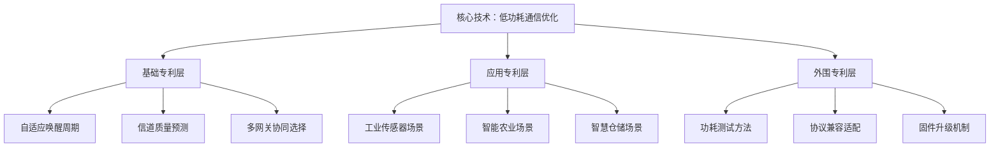
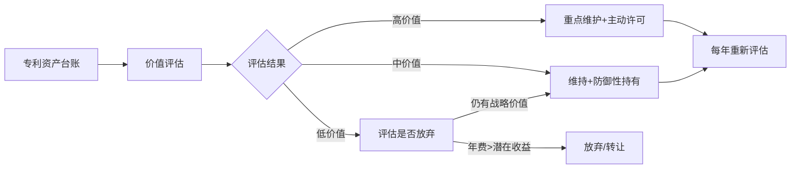

## 案例八：技术专利的商业化运营

> **案例核心：** 一位通信工程师用8年时间，从零开始构建包含23项专利的技术组合，通过"自主实施+许可授权+专利运营"三条路径，实现年收入从0到超过150万元的跨越。本案例完整拆解技术专利从挖掘、布局、申请到商业化变现的全链条，展示专利如何从一纸证书变成持续产出的资产。

### 案例背景

#### 人物画像

| 维度 | 详情 |
|------|------|
| 身份 | 赵鹏（化名），35岁，某二线城市通信设备公司研发工程师 |
| 专业背景 | 通信工程硕士，10年嵌入式系统开发经验 |
| 起步条件 | 零专利基础，无创业资金，日常工作接触物联网通信协议 |
| 转折点 | 2018年发现公司产品使用的一项通信协议存在优化空间，萌生申请专利的念头 |
| 当前状态 | 持有23项专利（12项发明专利、8项实用新型、3项外观设计），年收入150万+ |

#### 行业背景

物联网（IoT）设备在2018-2025年间经历了爆发式增长。据IoT Analytics数据，全球IoT连接设备数从2018年的70亿增长到2025年的超过180亿。设备间的低功耗通信协议成为核心技术瓶颈，围绕这一领域的专利价值持续攀升。

赵鹏切入的细分方向——**工业物联网边缘设备的低功耗通信优化**——恰好处于技术需求旺盛但专利布局尚未饱和的窗口期。这个方向的技术门槛适中（不需要顶级实验室），商业化路径清晰（许可给设备制造商），非常适合个人发明人入场。

#### 为什么选择技术专利变现

赵鹏在决定走专利变现路径之前，系统评估了知识产权变现的四条主要路径：

| 变现路径 | 所需资源 | 收入上限 | 适合赵鹏？ |
|----------|----------|----------|-----------|
| 知识付费（课程/专栏） | 内容创作能力、粉丝基础 | 中等 | ❌ 没有个人品牌基础 |
| 版权内容授权 | 优质内容产出能力 | 中等 | ❌ 技术出身，不擅长内容创作 |
| 商标品牌授权 | 品牌运营能力、市场资源 | 较高 | ❌ 需要大量资金和团队 |
| **技术专利运营** | **技术深度、专利撰写能力** | **极高** | **✅ 技术背景+行业洞察** |

技术专利运营的核心优势在于：**它是一项以技术能力为核心驱动力的变现方式，不需要粉丝基础、不需要内容创作天赋、不需要大量启动资金，只需要你对自己的技术领域有足够深的理解。**

### 执行过程：从第一项专利到专利组合

整个商业化过程分为四个阶段，耗时8年。每个阶段都有明确的目标、方法和成果。

#### 第一阶段：专利认知建立与首项专利（第1年）

**目标：** 学会专利游戏规则，完成第一项发明专利申请。

**1. 专利知识的系统学习（前3个月）**

赵鹏没有急于申请专利，而是花了3个月系统学习专利知识：

- **学习资源：** 国家知识产权局官网的专利审查指南、《专利法》及实施细则、韩龙老师的专利代理实务课程
- **核心收获：** 理解了专利的三性要求（新颖性、创造性、实用性）、权利要求书的撰写逻辑、专利检索的方法
- **关键认知：** 专利保护的不是技术本身，而是技术方案的**实现方式**。同一个技术目标可以用不同的技术方案实现，而你只能保护你提出的那个方案

**2. 技术方案的专利挖掘**

赵鹏从日常工作中的技术问题出发，挖掘出第一个可专利化的技术方案：

**问题背景：** 工业物联网中的边缘传感器节点需要在极低功耗下维持与网关的通信连接。现有方案要么功耗过高（持续监听），要么响应延迟过大（长周期唤醒）。

**技术方案：** 赵鹏提出一种"自适应唤醒周期调整"方法——传感器节点根据历史通信数据动态调整唤醒周期，在通信密集期缩短唤醒间隔、在空闲期延长唤醒间隔，从而在保持响应速度的同时降低平均功耗。

**专利性分析：** 通过CNIPA和Google Patents检索，发现现有技术中虽然有唤醒机制的专利，但没有结合历史数据进行自适应调整的方案。技术方案具备新颖性和创造性。

**3. 专利申请文件的撰写**

赵鹏选择了**自己撰写+专业代理人审核**的混合模式，而非完全外包：

| 环节 | 方式 | 费用 | 原因 |
|------|------|------|------|
| 技术交底书 | 自己撰写 | 0 | 最了解技术方案的人 |
| 权利要求书 | 代理人撰写+自己修改 | 3000元 | 权利要求的法律措辞需要专业训练 |
| 说明书 | 代理人基于交底书扩展 | 包含在代理费中 | — |
| 附图 | 自己绘制 | 0 | 用Visio画技术示意图 |
| **合计** | — | **3000元** | 远低于全流程外包的5000-8000元 |

**4. 申请与审查**

| 时间节点 | 事件 | 费用 |
|----------|------|------|
| 2018年6月 | 提交发明专利申请（享受费减85%） | 申请费142.5元 |
| 2018年9月 | 进入实质审查 | 审查费375元（费减后） |
| 2019年3月 | 收到第一次审查意见通知书 | — |
| 2019年5月 | 答复审查意见（修改权利要求） | 代理人答复费1500元 |
| 2019年8月 | 收到第二次审查意见通知书 | — |
| 2019年10月 | 答复审查意见（陈述意见） | 代理人答复费1000元 |
| 2020年1月 | 收到授权通知书 | — |
| 2020年3月 | 获得发明专利证书 | 登记费+年费共520元 |

**第一项专利总成本：约6500元，从申请到授权耗时约19个月。**

#### 第二阶段：构建专利组合（第2-4年）

**目标：** 围绕核心技术方向，构建有防御深度的专利组合。

**1. 专利布局策略**

赵鹏意识到单个专利的价值有限——它很容易被竞争对手绕过。真正的商业价值来自**专利组合**（Patent Portfolio）的系统布局。



**三层专利布局的逻辑：**

- **基础专利层（核心算法/方法）：** 保护核心技术方案本身，这些是整个专利组合的基石。竞争对手如果要进入这个技术领域，几乎无法绕开这些基础专利
- **应用专利层（场景适配）：** 将核心技术适配到不同应用场景中。每个场景的实现细节不同，可以分别申请专利。这层专利扩大了保护范围
- **外围专利层（配套技术）：** 保护与核心技术配套的辅助技术。这些专利单独看价值不高，但与基础专利组合后，能显著增加竞争对手的绕过难度

**2. 第2-4年的专利产出**

| 年份 | 发明专利 | 实用新型 | 外观设计 | 累计投入 | 当年方法 |
|------|----------|----------|----------|----------|----------|
| 第2年 | 2项 | 1项 | 0 | 2.1万 | 自己撰写为主，代理人审核 |
| 第3年 | 3项 | 2项 | 1项 | 3.8万 | 培养了自己撰写权利要求的能力 |
| 第4年 | 2项 | 2项 | 1项 | 2.5万 | 纯自主撰写，仅关键节点咨询代理人 |
| **累计** | **8项** | **6项** | **2项** | **8.4万** | — |

**3. 降低申请成本的关键技巧**

赵鹏在这个阶段大幅压缩了专利申请成本：

| 成本项 | 外包价格 | 赵鹏的实际成本 | 节省比例 |
|--------|----------|---------------|----------|
| 权利要求书撰写 | 3000-5000元/件 | 0（自学撰写） | 100% |
| 审查意见答复 | 1000-2000元/次 | 0（自学答复） | 100% |
| 申请费+审查费 | 同价 | 142.5+375=517.5元（费减后） | — |
| 年费 | 同价 | 享受费减 | — |

**自学专利撰写的方法论：**

1. 精读100篇同领域的授权发明专利，分析其权利要求书的撰写结构
2. 学习《专利审查指南》第二部分第二章（说明书和权利要求书的撰写要求）
3. 在"专利之星"等平台上研究审查意见通知书和答复文件的范例
4. 每撰写一项专利后，请代理人朋友做免费的同行评审（互惠模式）

**4. 专利质量把控**

赵鹏的专利并非盲目追求数量。他建立了严格的专利筛选标准：

```text
专利申请决策清单：
□ 该技术方案是否解决了真实的行业痛点？
□ 检索后是否确认具备新颖性？（至少对比50篇相关专利）
□ 权利要求是否足够宽泛，竞争对手难以绕开？
□ 该技术方案是否有明确的商业化路径？
□ 申请+维护的总成本是否在预算范围内？
→ 以上5项全部满足才提交申请
```

#### 第三阶段：专利许可变现（第3-6年）

**目标：** 将已授权的专利转化为实际收入。

**1. 第一笔许可收入**

2021年（第3年），赵鹏的自适应唤醒周期专利授权后，他开始寻找许可对象。他的策略不是主动推销，而是**先让行业知道这项专利的存在**：

- **技术博客曝光：** 在CSDN和知乎上发表了3篇关于低功耗物联网通信优化的技术文章，在文中引用了自己的专利号
- **行业会议演讲：** 在一次物联网技术峰会上做了"边缘设备低功耗通信的前沿方案"的技术分享，PPT中标注了专利信息
- **技术标准参与：** 加入了一个物联网行业技术联盟，参与了低功耗通信协议的技术标准讨论

**效果：** 2021年8月，一家深圳的物联网模组公司主动联系赵鹏，表示其产品使用了类似的自适应唤醒机制，希望获得许可授权。

**许可谈判的关键参数：**

| 谈判要素 | 赵鹏的方案 | 对方的反提案 | 最终结果 |
|----------|-----------|-------------|----------|
| 许可类型 | 独占许可 | 普通许可 | **排他许可** |
| 许可期限 | 3年 | 1年 | **3年** |
| 许可费 | 一次性50万 | 按销量提成2% | **首付15万+按销量提成1.5%** |
| 地域范围 | 全球 | 仅中国大陆 | **中国大陆+东南亚** |

**第一笔许可收入：首付15万元，首年提成约8万元，合计首年收入23万元。**

**2. 许可谈判的核心策略**

赵鹏在许可谈判中使用了几个关键策略：

**策略一：充分的侵权证据准备**

在谈判之前，赵鹏购买了对方的产品并进行了技术分析，形成了详细的技术对比报告。报告显示对方产品至少有3个技术特征落入了他的专利保护范围。这份报告在谈判中起到了关键的威慑作用。

**策略二：合理的许可费定价**

赵鹏没有漫天要价，而是基于以下逻辑计算了合理的许可费：

```text
许可费计算框架：
1. 对方该产品线年营收：约2000万元
2. 专利技术对产品价值的贡献率：约15%（行业惯例5%-25%）
3. 专利许可费率：贡献率 × 利润分成比例 = 15% × 10% = 1.5%
4. 年许可费：2000万 × 1.5% = 30万元
5. 考虑对方的替代方案成本（重新设计需投入约50万+6个月），定价在合理区间
```

**策略三：分阶段付款降低对方决策门槛**

首付15万（覆盖赵鹏的全部申请成本）+ 按销量提成（绑定长期收益），降低了对方的一次性决策压力，同时保证了长期收益。

**3. 第二笔和第三笔许可**

2022年，赵鹏的另一项关于"信道质量预测"的基础专利也获得了许可机会：

| 许可对象 | 许可类型 | 许可费结构 | 年收入 |
|----------|----------|-----------|--------|
| 杭州某智能农业公司 | 普通许可 | 年费8万 | 8万 |
| 东莞某仓储自动化公司 | 普通许可 | 按设备出货量提成0.5% | 约12万 |

**到第4年末，赵鹏的专利许可年收入已达到约50万元。**

#### 第四阶段：专利运营深化与组合变现（第5-8年）

**目标：** 从单点许可升级为系统化的专利运营，实现收入规模化。

**1. 专利资产的主动管理**

赵鹏建立了一套专利资产管理系统，对所有23项专利进行生命周期管理：



**专利价值评估的四个维度：**

| 维度 | 评估标准 | 权重 |
|------|----------|------|
| 技术覆盖度 | 权利要求是否覆盖了行业主流技术方案 | 30% |
| 商业可许可性 | 是否有明确的潜在许可对象 | 25% |
| 法律稳定性 | 权利要求是否足够稳固，能否经受无效宣告 | 25% |
| 替代难度 | 竞争对手绕开该专利的成本有多高 | 20% |

通过这套评估体系，赵鹏在第5年主动放弃了3项价值较低的专利（每年节省年费约6000元），将资源集中在高价值专利的维护和许可上。

**2. 专利组合的整体许可**

第6年，一家大型通信设备公司（年营收超50亿）对赵鹏的低功耗通信专利组合表现出整体许可意向。这不再是单个专利的许可，而是**整个技术方案的打包许可**。

**组合许可的谈判要点：**

| 议题 | 讨论内容 | 最终方案 |
|------|----------|----------|
| 许可范围 | 12项核心专利打包 | 基础包8项+可选包4项 |
| 许可费 | — | 基础包年费40万+可选包年费15万 |
| 交叉许可 | 对方要求赵鹏也免费使用其部分专利 | 接受对方3项非核心专利的交叉许可 |
| 保密条款 | 对方要求赵鹏不再向同业许可 | 拒绝（保留向非竞争领域许可的权利） |
| 合同期限 | — | 5年，到期优先续约 |

**这一笔交易使赵鹏的年专利收入跃升至约95万元（基础包40万+提成约40万+其他许可收入15万）。**

**3. 技术咨询衍生业务**

专利许可过程中，赵鹏积累了深厚的行业人脉和技术声誉。他顺势开展了技术咨询业务：

| 咨询类型 | 收费标准 | 年服务量 | 年收入 |
|----------|----------|----------|--------|
| 专利侵权分析报告 | 2-5万元/份 | 6份 | 约20万 |
| 技术方案可行性评估 | 1-3万元/份 | 8份 | 约15万 |
| 企业专利布局规划 | 5-10万元/项目 | 2个 | 约12万 |
| **合计** | — | — | **约47万** |

**到第8年，赵鹏的总收入构成如下：**

| 收入来源 | 金额 | 占比 |
|----------|------|------|
| 专利许可收入 | 95万 | 63% |
| 技术咨询收入 | 47万 | 31% |
| 专利转让收入（偶发） | 8万 | 5% |
| **合计** | **150万** | **100%** |

### 关键决策复盘

#### 决策一：自己撰写 vs 外包给代理人

| 对比维度 | 自己撰写 | 全部外包 |
|----------|----------|----------|
| 单件成本 | 500-1000元（官费） | 5000-10000元（含代理费） |
| 质量风险 | 前期较高，后期稳定 | 取决于代理人水平 |
| 学习曲线 | 陡峭（需要3-6个月） | 无 |
| 长期收益 | 掌握核心技能，边际成本趋近于零 | 持续支出 |
| 适合阶段 | 第1-2件外包学习，后续自学 | 预算充足或时间紧迫时 |

**赵鹏的选择：** 第1件专利用"自己撰写+代理人审核"（花费3000元），第2-3件请代理人做关键节点指导（花费1500元/件），第4件起完全自主撰写。这个路径让他在保持质量的同时大幅降低了成本。

#### 决策二：专利数量 vs 专利质量

赵鹏在第3年面临一个选择：是快速申请大量专利形成数量威慑，还是精选少量高质量专利？

**他的决策逻辑：**

```text
专利策略决策树：

如果 目标是防御竞争对手 → 适度数量+高质量（5-15项核心专利）
如果 目标是快速变现 → 精选3-5项最有商业潜力的专利深度运营
如果 目标是长期价值积累 → 基础专利高质量+外围专利适度数量

赵鹏的选择：长期价值积累策略
- 基础专利（8项发明专利）：全部高质量撰写，确保法律稳定性
- 外观专利（3项）：适度追求数量，用于产品外观保护
- 实用新型（8项）：中等质量，用于快速获得保护和补充防御
```

#### 决策三：独占许可 vs 普通许可

赵鹏在第一笔许可谈判中坚持了排他许可而非独占许可：

- **独占许可：** 连专利权人自己都不能实施，对被许可方最有利，许可费最高
- **排他许可：** 专利权人保留自己实施的权利，被许可方在约定范围内独家使用
- **普通许可：** 可以同时许可给多个对象，单个许可费最低，但总收入可能更高

赵鹏选择排他许可的原因：他需要保留自己在该领域实施专利的权利（为未来自主创业留空间），同时给予许可方足够的独家权益以获得较高的许可费。

### 成果数据

#### 核心指标对比

| 指标 | 第1年末 | 第3年末 | 第5年末 | 第8年末（当前） |
|------|---------|---------|---------|----------------|
| 专利数量 | 1项 | 8项 | 16项 | 23项 |
| 年收入 | 0 | 23万 | 65万 | 150万 |
| 许可对象数 | 0 | 2家 | 5家 | 8家 |
| 累计投入 | 0.65万 | 4.5万 | 9万 | 12万 |
| 投入产出比 | — | 5.1倍 | 7.2倍 | 12.5倍 |
| 年维护成本 | 520元 | 8000元 | 1.5万 | 2.2万 |

#### 收入增长曲线

| 阶段 | 时间 | 年收入 | 核心驱动 |
|------|------|--------|----------|
| 播种期 | 第1-2年 | 0 | 申请专利、学习撰写 |
| 萌芽期 | 第3年 | 23万 | 第一笔许可收入 |
| 成长期 | 第4-5年 | 40-65万 | 多笔许可+技术咨询 |
| 收获期 | 第6-8年 | 100-150万 | 组合许可+咨询+偶发转让 |

### 经验总结：技术专利商业化的12条铁律

#### 认知层面

**铁律一：专利是武器，不是奖状。** 很多人把专利当作技术成就的证明（挂在墙上好看），但真正有价值的专利是能被用来许可、诉讼或交叉授权的商业工具。申请专利之前，先问自己：这项专利能用来做什么？

**铁律二：专利组合的价值远大于单个专利之和。** 一项专利很容易被竞争对手绕过，但5-10项互相支撑的专利组合可以形成难以逾越的技术壁垒。布局专利时要用组合思维，而非单点思维。

**铁律三：专利的质量决定了商业化上限。** 权利要求书写得过于狭窄，竞争对手很容易绕开；写得过于宽泛，在无效宣告中撑不住。好的权利要求书是在保护范围和法律稳定性之间找到最优平衡点。

#### 执行层面

**铁律四：先检索，再申请。** 至少花2周时间做全面的专利检索，确认你的方案确实具备新颖性和创造性。很多人花了6000元申请费，等了18个月，最后收到驳回通知书——原因是有人在你之前申请了类似的方案。

**铁律五：权利要求书是专利的灵魂。** 说明书可以很长（技术细节越详细越好），但权利要求书必须精炼、准确、上位化。建议花最多时间打磨权利要求书，每个用词都要反复推敲。

**铁律六：费减政策要用足。** 个人申请人年收入低于6万元可申请费减（最高85%），年收入低于某个门槛的企业也可以申请。这笔钱省下来可以覆盖好几件专利的申请费。

**铁律七：专利维护是持续投入。** 专利授权后每年需要缴纳年费（发明专利第1-3年900元/年，逐年递增）。如果一项专利已经没有商业价值，果断放弃，把预算集中在高价值专利上。

#### 商业化层面

**铁律八：让市场知道你的专利存在。** 专利证书放在抽屉里不会产生任何价值。通过技术博客、行业会议、标准参与等方式让潜在许可对象知道你的专利存在，是许可变现的前提条件。

**铁律九：许可费要合理。** 漫天要价只会把潜在许可对象吓跑，或者逼迫对方发起无效宣告。合理的许可费通常为专利技术对产品价值贡献率的5%-15%。

**铁律十：第一笔许可最难，但价值最大。** 第一笔许可不仅是收入，更是对专利商业可行性的验证、对许可谈判流程的实战学习、以及向行业释放的信号——"这项专利是可以被许可的"。

**铁律十一：专利诉讼是最后手段。** 诉讼的成本高（律师费10-50万）、周期长（1-3年）、结果不确定。如果能通过谈判达成许可，优先选择许可而非诉讼。但如果对方恶意侵权且拒绝谈判，诉讼是必要的威慑手段。

**铁律十二：把专利运营当作长期事业。** 技术专利的商业化不是一锤子买卖，而是一个持续8-10年甚至更长的资产运营过程。你需要持续投入时间维护专利、寻找许可机会、更新技术布局。

### 常见误区与纠正

| 误区 | 真实情况 | 后果 |
|------|----------|------|
| "我有技术就能申请专利" | 技术方案必须满足新颖性、创造性、实用性三性要求 | 盲目申请浪费时间和金钱 |
| "专利越多越好" | 低质量专利不仅没有价值，还要持续缴纳年费 | 资源浪费，维护成本失控 |
| "申请了专利就等于受保护" | 专利保护需要主动维权，被动等待不会有人主动付费 | 专利闲置，错过商业化窗口 |
| "自己写不了权利要求书" | 前期可以学，掌握后边际成本趋近于零 | 持续依赖代理人，成本居高不下 |
| "小公司/个人打不过大公司" | 大公司恰恰是最怕专利诉讼的，因为其产品线广、侵权风险高 | 错过高价值许可对象 |
| "专利快到期了就不值钱了" | 专利到期前的最后几年往往是许可谈判的黄金期（竞争对手来不及绕开） | 提前放弃高价值专利 |
| "实用新型没有发明专利值钱" | 实用新型申请快（6-8个月）、成本低，在某些场景下许可价值不亚于发明专利 | 忽视实用新型的商业潜力 |

### 进阶内容：高级专利运营策略

#### 策略一：专利池（Patent Pool）

当多个专利权人持有互补性专利时，可以组建专利池，统一对外许可。这在通信标准（如5G必要专利）领域非常常见。个人发明人可以通过加入行业专利联盟参与专利池。

**参与专利池的条件：**
- 你的专利必须是该技术领域的"必要专利"（Standard Essential Patent, SEP）
- 需要通过独立评估机构的必要性评估
- 通常需要接受FRAND（公平、合理、非歧视）许可条款

#### 策略二：专利证券化

将未来的专利许可收益权打包为金融产品进行融资。这在个人层面较少见，但随着知识产权金融化的发展，未来可能出现更多适合个人发明人的金融工具。

#### 策略三：防御性专利运营

即使你不打算主动许可，持有专利也可以作为防御工具：

- **交叉许可谈判筹码：** 当竞争对手用专利威胁你时，你可以用自己的专利组合进行反制
- **FTO（自由实施）分析：** 在产品上市前，确认你的产品不会侵犯他人的专利
- **专利无效宣告应对：** 如果有人对你的专利发起无效宣告，你需要有充分的技术证据证明你的专利具备创造性

#### 策略四：国际专利布局

如果你的技术方案有国际市场潜力，需要考虑PCT（专利合作条约）国际申请：

| 申请路径 | 费用 | 时间 | 适用场景 |
|----------|------|------|----------|
| 直接向目标国申请 | 2-5万元/国家 | 12-36个月 | 目标市场明确（1-2个国家） |
| PCT国际申请 | 3-8万元（进入国家阶段另计） | 优先权30个月内 | 多国布局、需要决策时间 |
| 欧洲专利（EPO） | 5-10万元 | 24-48个月 | 欧盟市场统一保护 |

**赵鹏的做法：** 他目前只申请了中国专利，但正在评估2项核心技术的PCT国际申请可行性。他计划先通过国内许可验证商业价值，再决定是否投入国际申请。

### 给读者的行动清单

如果你也想走技术专利变现的路径，以下是可以立即开始的行动：

**本月完成：**
- [ ] 梳理自己技术领域中的3-5个技术痛点/创新点
- [ ] 在CNIPA和Google Patents上做初步检索，确认是否已有类似专利
- [ ] 学习《专利法》和《专利审查指南》的基础章节

**本季度完成：**
- [ ] 确定第一个可专利化的技术方案，撰写技术交底书
- [ ] 选择一位靠谱的专利代理人，完成第一项专利的申请
- [ ] 加入1-2个行业技术社群，了解行业技术动态

**本年度完成：**
- [ ] 获得第一项专利的受理通知书
- [ ] 学习撰写权利要求书的基本方法
- [ ] 制定3年的专利布局规划

**3年目标：**
- [ ] 拥有5-8项已授权专利
- [ ] 完成第一笔专利许可
- [ ] 建立专利资产管理系统

***

> **本案例启示：** 技术专利的商业化是一场马拉松而非百米冲刺。赵鹏用了8年时间，从零开始构建了一个年收入150万的专利运营体系。这个过程中最关键的能力不是专利撰写技巧（那可以学），而是**对技术趋势的判断力**和**将技术洞察转化为商业价值的执行力**。如果你是一名有技术深度的工程师，专利变现可能是最适合你的知识产权变现路径——它不需要你有粉丝、不需要你有资金、不需要你有创业经验，只需要你有真功夫和足够的耐心。
