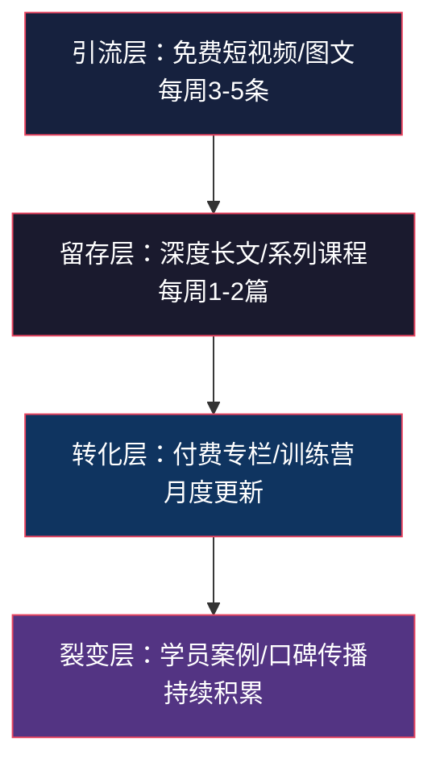
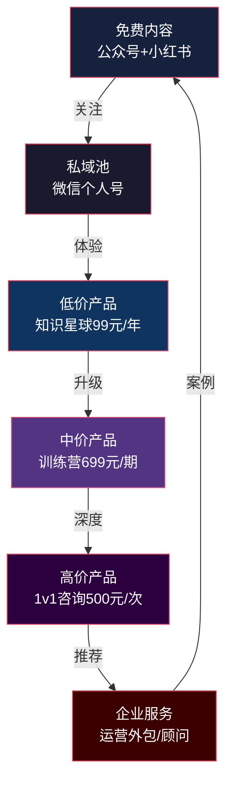

## 案例九：自媒体IP的全链条变现

### 案例概述

本案例记录了一位互联网从业者"老陈"（化名）从零开始打造自媒体IP，用18个月时间实现月收入从0到稳定12000+元的全过程。这个案例的核心价值不在于收入数字本身，而在于它展示了一套可复制的"技能→内容→信任→变现"全链条方法论，适用于任何拥有某项专业技能的职场人。

老陈的真实背景：30岁，二线城市，互联网公司运营岗，日常工作是做数据报表和写运营方案。没有写作天赋，没有颜值优势，没有行业人脉。他唯一的优势是——在运营领域干了5年，积累了一套自己的数据分析和增长方法论。


### 为什么自媒体IP是知识产权变现的最优路径之一

在所有知识产权变现方式中，自媒体IP有一个独特优势：**内容本身就是产品，流量本身就是渠道**。写一本书需要找出版社，开发一门课需要找平台，但做一个自媒体IP，你既是生产者也是分销商。

自媒体IP变现的本质是**信任资产的货币化**。用户因为你的免费内容信任你，因为信任购买你的付费产品，因为产品效果继续信任你——这是一个正向飞轮。

| 变现方式 | 启动成本 | 天花板 | 时间投入 | 技术门槛 |
|----------|----------|--------|----------|----------|
| 自媒体IP | 极低（手机+时间） | 高（可发展为公司） | 前期密集，后期递减 | 低（会说话就行） |
| 出版书籍 | 中等 | 中 | 集中3-6个月 | 中 |
| 付费课程 | 中等 | 高 | 集中1-3个月 | 中高 |
| 专利授权 | 高（申请费+时间） | 极高 | 1-3年 | 极高 |
| 软件产品 | 中高 | 极高 | 持续投入 | 高 |

自媒体IP的核心优势在于**边际成本趋近于零**——一篇文章写好后，100个人看和10000个人看，你的成本是一样的。而咨询服务每多服务一个客户，你就多花一份时间。

### 第一阶段：技能梳理与定位（第1-2周）

#### 盘点自身技能资产

老陈做的第一件事不是急着注册账号写内容，而是花了一周时间系统盘点自己到底会什么。他用了一个叫"技能三层筛选法"的方法：

**第一层：列出所有会的东西**

拿一张纸，把你工作中做过的所有事情写下来，不判断好坏。老陈列出了23项，包括：写周报、做数据看板、用户分层、活动策划、竞品分析、写方案、带新人等。

**第二层：筛选有市场需求的**

逐一判断：这些东西，别人愿意花钱学吗？老陈筛掉了"写周报"（太基础，没人付费学）、"带新人"（太窄，受众太小）等，剩下8项。

**第三层：筛选你能持续输出的**

问自己：这8项里，哪些我能写50篇以上不重复的内容？老陈最终锁定了3个方向：数据分析、用户增长、运营方案写作。

#### 竞品调研与差异化定位

锁定方向后，老陈没有直接开干，而是花了3天做竞品调研。他在各平台搜索"运营"、"数据分析"、"用户增长"等关键词，记录了50个相关账号的数据：

| 调研维度 | 记录内容 | 目的 |
|----------|----------|------|
| 粉丝量级 | 1万以下/1-10万/10万以上 | 判断竞争强度 |
| 内容形式 | 图文/短视频/直播 | 判断主流形式 |
| 内容角度 | 理论/案例/工具/实操 | 找空白角度 |
| 变现方式 | 课程/咨询/带货/广告 | 判断变现可行性 |
| 更新频率 | 日更/周更/月更 | 判断投入产出比 |
| 互动率 | 评论/点赞/收藏比 | 判断用户粘性 |

调研发现：做"运营干货"的账号很多，但绝大多数要么太理论（大学教授风格），要么太碎片（只讲技巧不讲体系）。**中间地带——既有体系又接地气的实操型内容——是一个明显的空白**。

老陈的差异化定位就此确定：**"一线运营人的实战方法论"**——用真实工作场景讲故事，用数据和截图做证据，用模板和框架给工具。

#### 用户画像精准定义

定位确定后，老陈进一步定义了目标用户画像：

> **核心画像**：22-30岁，一二线城市，互联网行业运营岗/市场岗，工作1-5年，月薪6000-15000元，遇到职业瓶颈，想提升能力但不知道怎么学，愿意为"能直接用"的方法论付费。
>
> **边缘画像**：想转行做运营的人，创业公司需要兼职运营的老板，在校想做实习的大学生。

为什么要做这么细的画像？因为**内容写给谁看，决定了你的语言风格、案例选择、深度程度**。写给运营新人看的内容，和写给运营总监看的内容，完全是两种东西。

### 第二阶段：内容体系搭建与输出（第3-8周）

#### 内容金字塔设计

老陈没有随便写，而是先设计了一个内容体系。他把内容分为四层：



- **引流层**：短平快的干货，解决具体小问题，目的是让陌生人看到你。比如"3步做出老板想要的数据看板"、"运营周报怎么写不被领导退回来"。
- **留存层**：深度内容，展示你的专业能力，目的是让读者收藏+关注。比如"从0到1搭建用户增长体系的完整指南"。
- **转化层**：付费内容，系统解决一个大问题，目的是变现。比如"运营数据分析实战训练营"。
- **裂变层**：学员的成功案例和口碑，目的是让老客户带来新客户。

#### 平台选择与策略

老陈没有全平台铺开，而是根据目标用户画像选择了3个主力平台：

| 平台 | 定位 | 内容形式 | 更新频率 | 作用 |
|------|------|----------|----------|------|
| 公众号 | 主阵地 | 深度长文 | 每周2篇 | 建立专业形象，沉淀私域 |
| 小红书 | 流量入口 | 图文笔记 | 每周3-4条 | 获取新用户，建立人设 |
| 知识星球 | 付费社区 | 问答+文档 | 每日互动 | 变现核心，深度服务 |

为什么不选抖音/快手？因为老陈的内容偏"需要思考"的干货型，短视频平台的用户注意力太短，转化效率低。而小红书的"搜索+推荐"双引擎机制，非常适合干货型图文内容的长尾分发。

#### 建立内容生产SOP

为了保证持续输出，老陈建立了一套内容生产标准流程：

**选题库管理**：用飞书多维表格建了一个选题库，随时记录灵感来源（工作中的问题、读者的提问、竞品的爆款）。选题库字段包括：选题名称、来源、预估热度、内容层级（引流/留存/转化）、计划发布日期、状态。

**写作流程**：

1. 周日晚上：从选题库中选出本周要写的4个选题
2. 周一/周三：写两篇深度长文（每篇2000-3000字，耗时约3小时）
3. 周二/周四/周五：把长文的核心观点拆成3条小红书笔记（每条约30分钟）
4. 周六：复盘本周数据，更新选题库优先级

**内容模板**：老陈为不同类型的内容设计了固定模板，避免每次从零开始。他最常用的是"问题-原因-方案-案例"四段式：

```markdown
## 【问题】你遇到过这种情况吗？
（描述一个具体痛点场景，让读者产生共鸣）

## 【原因】为什么会这样？
（分析底层逻辑，展示专业度）

## 【方案】具体怎么做？
（给出可执行的步骤，1-2-3-4）

## 【案例】我亲测有效的结果
（用数据和截图证明方案有效）
```

### 第三阶段：流量增长与信任建立（第3-12个月）

#### 冷启动策略（前3个月）

前3个月是最难的——没有粉丝，没有反馈，没有收入。老陈采取了三个策略度过冷启动期：

**策略一：蹭热点+独特角度**

不是追热点本身，而是用热点事件引出自己的专业领域。比如某互联网公司裁员时，别人在讨论"互联网寒冬"，老陈写了一篇"裁员潮下，运营人最该提升的3个硬技能"，把热点和自己的定位结合起来。

**策略二：评论区截流**

去大V的文章/视频下面写有价值的评论。不是"写得好"这种废话，而是补充一个角度、提供一个数据、纠正一个错误。高质量评论会获得点赞，点赞多了就排在前面，相当于免费曝光。

**策略三：社群互推**

加入10个运营相关的微信群/知识星球，积极参与讨论，解答别人的问题。不是发广告，而是真正帮人解决问题。当别人问"你在哪里写东西"时，自然地引导到自己的公众号。

#### 数据驱动的内容优化

从第2个月开始，老陈每周做一次数据复盘，重点关注四个指标：

| 指标 | 计算方式 | 健康基准 | 优化方向 |
|------|----------|----------|----------|
| 打开率 | 阅读数/粉丝数 | >5% | 优化标题 |
| 完读率 | 读完人数/打开人数 | >30% | 优化开头和排版 |
| 互动率 | (点赞+评论+收藏)/阅读数 | >3% | 增加互动引导 |
| 转粉率 | 新增关注/阅读数 | >2% | 优化关注引导 |

老陈发现一个规律：**标题带数字的文章打开率平均高出40%**。比如"运营人必会的5个数据分析模型"比"运营人的数据分析方法"打开率高很多。这不是什么秘密，但只有真正跑过数据的人才会信。

他还发现：**文章前3段决定了读者会不会读下去**。如果前3段没有抓住读者，后面写得再好也没用。所以他把所有精力的30%花在打磨开头上。

#### 信任资产的四个层次

老陈总结了一套"信任四层模型"，用来指导内容策略：

1. **认知信任**（粉丝知道你是谁）→ 通过持续出现在用户信息流中实现
2. **专业信任**（粉丝相信你懂行）→ 通过深度干货和数据案例实现
3. **情感信任**（粉丝觉得你靠谱）→ 通过展示真实工作场景和失败经历实现
4. **利益信任**（粉丝相信跟你走能得到好处）→ 通过学员案例和成果展示实现

只有四层信任都建立起来，用户才会从"关注者"变成"付费用户"。

### 第四阶段：变现启动与全链条放大（第6-18个月）

#### 变现路径设计

老陈在粉丝达到5000时启动了第一个付费产品——一个定价99元的"运营数据分析知识星球"。为什么选这个时机？

因为他在后台数据中发现了一个信号：**每周至少有3-5个读者在后台私信问"有没有更系统的学习资料"**。当免费内容满足不了用户时，就是推出付费产品的最佳时机。

#### 全链条变现模型

老陈最终搭建了一个完整的变现链条：



每个环节都有明确的功能：

| 产品 | 价格 | 功能 | 转化来源 |
|------|------|------|----------|
| 免费内容 | 0 | 获取流量，建立信任 | 公域平台自然流量 |
| 知识星球 | 99元/年 | 深度答疑，社群互动 | 公众号文末引导 |
| 训练营 | 699元/期 | 系统学习，实操带练 | 知识星球内推+朋友圈 |
| 1v1咨询 | 500元/次 | 个性化问题解决 | 训练营优秀学员 |
| 企业服务 | 5000-20000元/月 | 运营外包或顾问 | 个人品牌带来的商机 |

#### 收入结构演进

老陈18个月的收入结构变化：

| 时间节点 | 免费粉丝 | 知识星球会员 | 训练营学员 | 咨询客户 | 月收入 |
|----------|----------|-------------|-----------|---------|--------|
| 第3个月 | 800 | 12人 | 0 | 0 | 1,188元 |
| 第6个月 | 3,200 | 45人 | 1期12人 | 2人 | 13,255元 |
| 第12个月 | 8,500 | 120人 | 3期累计35人 | 5人 | 11,880元 |
| 第18个月 | 15,000 | 200人 | 6期累计68人 | 8人+2家企业 | 12,360元 |

注意：收入不是线性增长的，而是阶梯式增长。每次推出新产品或完成一次训练营，收入会跳一个台阶。第6个月有一次收入高点是因为训练营刚结束，后续趋于稳定。

#### 关键变现节点详解

**第一个付费产品（知识星球）的设计**：

老陈没有一上来就做课程，因为课程的制作成本和交付成本太高。知识星球的优势是：轻量级交付（回答问题+分享文档），低决策门槛（99元/年），高频触达（每天都能看到你的回答）。

知识星球的内容规划：

- 每日一答：精选1个会员提问，写500字以上的详细回答
- 每周干货：发布1篇星球专属深度文章（比公众号更深入）
- 每月复盘：整理本月精华内容，做成PDF文档
- 不定期福利：行业报告、工具模板、课程优惠

**训练营的设计与交付**：

老陈在知识星球运营3个月后，积累了足够的用户反馈和内容素材，开始设计训练营。训练营的关键设计原则：

1. **小班制**：每期不超过15人，保证互动质量
2. **实操驱动**：不是讲课，是带着做。每周一个实操任务，学员完成后点评
3. **成果可视化**：要求学员在结营时提交一份完整的数据分析报告作为毕业作品
4. **口碑裂变**：优秀学员案例做成公众号文章（征得同意后），既是内容也是广告

训练营的具体安排（21天制）：

| 阶段 | 时间 | 内容 | 交付物 |
|------|------|------|--------|
| 基础夯实 | 第1-7天 | 数据分析思维+工具基础 | 个人数据看板模板 |
| 方法论 | 第8-14天 | 用户分层+漏斗分析+归因分析 | 数据分析框架文档 |
| 实战输出 | 第15-21天 | 完整项目实操+报告撰写 | 个人数据分析报告 |
| 毕业典礼 | 第22天 | 优秀作品展示+后续规划 | 结营证书+资源包 |

### 工具与资源清单

老陈在整个过程中使用的核心工具：

| 类别 | 工具 | 用途 | 费用 |
|------|------|------|------|
| 内容创作 | 飞书文档 | 长文写作+选题管理 | 免费 |
| 内容创作 | Canva/稿定设计 | 封面图和配图制作 | 免费版够用 |
| 内容创作 | 剪映 | 视频剪辑（后期尝试短视频时用） | 免费 |
| 数据分析 | 公众号后台 | 内容数据复盘 | 免费 |
| 数据分析 | 小红书创作者中心 | 笔记数据追踪 | 免费 |
| 私域管理 | 微信+标签体系 | 用户分层管理 | 免费 |
| 社群运营 | 知识星球 | 付费社区运营 | 平台抽佣10% |
| 项目管理 | 飞书多维表格 | 选题库+学员管理+收入追踪 | 免费 |
| 自动化 | 微伴助手 | 公众号自动回复+标签 | 基础版免费 |

### 常见误区与避坑指南

#### 误区一：追求完美才发布

老陈最初犯的错误——一篇文章写了改、改了写，总觉得不够好，结果一周都发不出一篇。后来他给自己定了一个规则：**完成度达到70%就发布**。因为互联网内容的迭代速度远比质量更重要，发出去后根据数据反馈再优化，比闷头打磨效率高10倍。

#### 误区二：只做免费内容，不敢收费

很多自媒体人做了半年免费内容，积累了上万粉丝，但一分钱没赚。不是因为粉丝不愿意付费，而是**你从来没有告诉过他们你可以提供付费服务**。老陈的经验是：当你持续输出3个月高质量免费内容后，就可以开始推第一个付费产品了。不需要等到"完全准备好"——因为永远不会有完全准备好的一天。

#### 误区三：同时做太多平台

老陈见过太多人同时运营公众号、小红书、抖音、B站、知乎、微博，结果每个平台都做得半死不活。正确的做法是**先集中精力做好一个平台，跑通变现模型后，再把成功经验复制到第二个平台**。老陈前6个月只做公众号和小红书，第7个月才加入知识星球。

#### 误区四：只看粉丝数，不看变现效率

10万粉丝但变现为0的账号，不如1万粉丝但月入过万的账号。**粉丝质量远比粉丝数量重要**。老陈的1.5万粉丝能月入1.2万，是因为这些粉丝精准匹配了他的付费产品。如果他去追泛娱乐内容，可能涨粉更快，但变现效率会大幅下降。

#### 误区五：内容同质化

运营类自媒体最大的问题是内容同质化——大家都在讲同样的框架、同样的案例。老陈的解决方法是：**80%的内容用自己的真实工作案例**，只有20%引用行业案例。因为"我昨天刚在公司用这个方法把转化率从2%提到了4.5%"比"某公司通过XX方法提升了转化率"有说服力100倍。

#### 误区六：忽视复购和口碑

很多自媒体人把精力全花在拉新上，忽略了老客户的复购。老陈的数据表明：**老客户的复购贡献了总收入的40%，而获客成本为0**。他每个月花1天时间专门做老客户维护——在知识星球回复所有未回答的问题、给训练营学员发学习进展提醒、在朋友圈分享学员的成功案例。

### 经验总结与可复制要点

老陈复盘18个月的全过程，总结了以下核心经验：

**1. 选对方向比努力重要10倍**

方向错了，越努力越远离目标。选方向的标准：你有真实经验（不是学来的）、市场有需求（有人愿意付费）、你能持续输出（能写100篇以上不重复）。

**2. 内容质量的"30%原则"**

把30%的精力花在打磨标题和开头上。因为互联网内容的漏斗是：曝光→点击→阅读→互动→关注→付费。每一步都在流失用户，而标题和开头决定了前两步的转化率。

**3. 变现时机的"信号判断法"**

不要等粉丝到某个数字才开始变现，而是看信号：当用户主动问你"有没有更系统的资料"时，就是推出付费产品的最佳时机。

**4. 收入结构的"金字塔法则"**

低价产品（99元）做量，中价产品（699元）做利润，高价产品（5000+元）做标杆。三者缺一不可：没有低价产品，转化路径太长；没有高价产品，天花板太低。

**5. 持续输出的"系统化思维"**

靠意志力坚持输出是不可持续的。必须建立系统：选题库、写作模板、数据复盘流程、内容生产SOP。系统让你在状态不好的时候也能保持基本输出。

**6. 信任建设的"四层模型"**

认知信任→专业信任→情感信任→利益信任，层层递进，不可跳级。很多自媒体人在第一层就急着卖东西，结果用户觉得你"吃相难看"。耐心把信任一层层建起来，变现就是水到渠成的事。

### 进阶思考：从副业到事业的跃迁

当自媒体IP的月收入稳定超过主业时，你需要做一个战略决策：是继续当副业，还是全职做？

老陈的选择是继续当副业，因为他认为：

1. **主业提供的真实案例是内容的核心竞争力**。如果全职做自媒体，很快就会脱离一线，内容质量会下降。
2. **主业的收入是安全垫**。自媒体收入有波动，有主业兜底可以更从容地做长期决策。
3. **副业的心态更健康**。不急于变现反而能产出更好的内容，用户也能感受到你的从容。

但如果你决定全职做，需要提前做好三件事：

- 至少储备6个月的生活费作为安全垫
- 已经验证的变现模型（不是"可能能赚钱"，而是"已经赚了钱"）
- 明确的12个月增长计划（不只是"继续写内容"）

自媒体IP变现不是一夜暴富的路，而是一条需要耐心和系统思维的长期主义之路。但一旦飞轮转起来，它会成为你最有价值的知识产权资产——因为**你的名字本身，就是品牌**。
