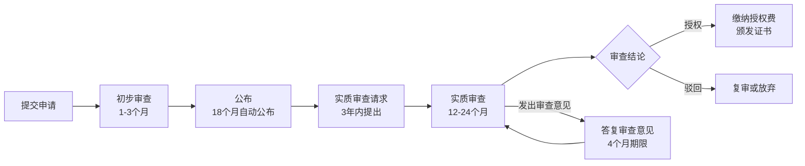
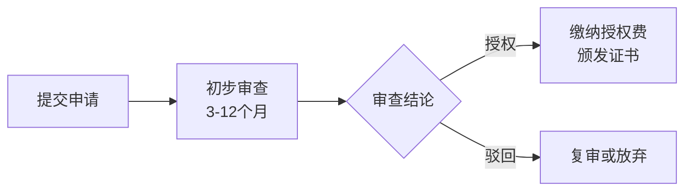
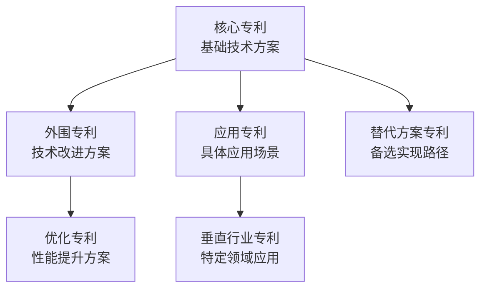
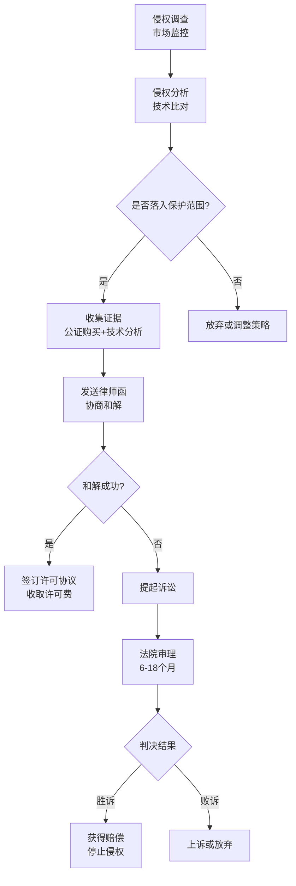
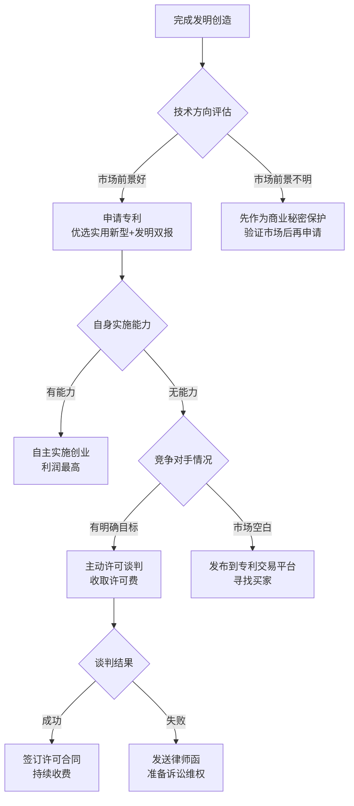

## 一、专利申请与变现技巧

专利是知识产权变现的核心载体之一。一项高质量专利可以为你带来持续数年的被动收入，而一组精心布局的专利组合（Patent Portfolio）甚至可以成为企业的核心竞争壁垒。本节将从专利基础知识、申请实操、质量提升、变现策略到风险防控，系统讲解如何将技术创新转化为真金白银。

### 1.1 专利基础：三种专利类型与选择策略

中国专利法规定了三种专利类型，它们在保护客体、审查流程、保护期限和商业价值上有本质区别：

| 维度 | 发明专利 | 实用新型专利 | 外观设计专利 |
|------|----------|--------------|--------------|
| 保护客体 | 产品、方法或其改进的技术方案 | 产品的形状、构造或其结合 | 产品的外观设计（形状、图案、色彩） |
| 审查方式 | 实质审查（2-3年） | 初步审查（6-12个月） | 初步审查（3-6个月） |
| 保护期限 | 20年 | 10年 | 15年（2021年修订后） |
| 授权率 | 约50%-60% | 约80%-90% | 约90%+ |
| 申请费用 | 950元（官费） | 500元（官费） | 500元（官费） |
| 代理人费用 | 5000-15000元 | 2000-5000元 | 1000-3000元 |
| 商业价值 | 最高 | 中等 | 中等 |
| 维权力度 | 最强 | 中等 | 中等 |

**选择策略：**

- **核心技术创新** → 申请发明专利。发明专利的技术含金量最高，在融资、转让、诉讼中的估值也最高。如果你的技术方案涉及方法步骤、化学配方、算法流程等，必须申请发明专利。
- **结构改进型创新** → 申请实用新型。例如对现有产品进行结构优化、部件重新组合等。实用新型审批快、授权率高，适合快速拿到专利权进行变现。
- **产品外观创新** → 申请外观设计。适用于消费电子、家具、包装等领域，尤其在电商平台维权中非常实用（外观设计专利是打击仿冒品的利器）。
- **最优策略**：对同一创新同时申请发明专利和实用新型专利（"双报"策略）。实用新型快速授权后可用于早期维权，发明专利后续授权后替换实用新型，获得更长保护期。

### 1.2 专利申请的完整实操流程

#### 1.2.1 第一步：专利检索与分析

专利检索是申请的起点，直接决定了你的申请能否授权以及权利要求的撰写方向。

**检索平台：**

| 平台 | 网址 | 特点 |
|------|------|------|
| 国家知识产权局（CNIPA） | https://pss-system.cponline.cnipa.gov.cn | 中国专利最权威，支持全文检索 |
| Google Patents | https://patents.google.com | 覆盖全球100+国家，界面友好 |
| 佰腾专利检索 | https://www.baiten.cn | 中文界面，分析功能强 |
| 智慧芽（PatSnap） | https://www.zhihuiya.com | 商业工具，专利地图功能强大 |
| Espacenet | https://worldwide.espacenet.com | 欧洲专利局，覆盖欧洲专利 |

**检索方法论：**

1. **关键词检索**：从技术方案的核心特征出发，列出技术领域、技术问题、技术手段三类关键词。例如你要申请一个"基于AI的垃圾分类方法"，关键词应包括：人工智能、图像识别、垃圾分类、卷积神经网络、目标检测等。
2. **IPC分类号检索**：每项技术都有对应的国际专利分类号（IPC），通过分类号检索可以发现同领域的全部专利。垃圾分类相关分类号：B07C（分类、分拣）、G06V（图像识别）、G06N（人工智能）。
3. **引用链检索**：找到一篇最相关的专利后，查看它引用了哪些专利（向后追溯）以及被哪些专利引用（向前追溯），快速建立技术图谱。
4. **申请人检索**：查看竞争对手（如华为、大疆、百度等）在该领域的全部专利布局。

**检索结果分析：**

- 判断新颖性：你的技术方案是否与已公开的专利完全相同？
- 判断创造性：你的方案相比最接近的现有技术，是否有实质性区别和进步？
- 寻找差异化点：明确你的方案的独特技术特征，这是撰写权利要求的基础。

#### 1.2.2 第二步：撰写专利申请文件

专利申请文件的质量直接决定了专利的保护范围和商业价值。一份高质量的申请文件包括以下五个部分：

**① 请求书**

填写发明名称、申请人信息、发明人信息等基本信息。注意：
- 发明名称应简短（25字以内），体现技术主题，不要出现商标或型号
- 申请人可以是个人或单位，涉及职务发明时应注意权属约定

**② 说明书（最关键的技术文件）**

说明书是专利的技术灵魂，必须充分公开技术方案，使本领域技术人员能够实现。结构如下：

```text
1. 技术领域：说明所属技术领域（1-2句）
2. 背景技术：现有技术的不足和要解决的技术问题
3. 发明内容：
   - 技术问题
   - 技术方案（核心，要详细描述）
   - 有益效果（与现有技术对比的优势）
4. 附图说明：每张图的简要说明
5. 具体实施方式：至少1-2个详细实施例
```

撰写要诀：
- 技术方案描述要层次分明：先整体架构，再各模块细节，最后模块间的交互关系
- 实施例要足够具体：包含具体的参数、步骤、数据，而不是泛泛而谈
- 要预留扩展空间：在描述核心方案的同时，暗示可能的变体和替代方案

**③ 权利要求书（决定保护范围的核心）**

权利要求书是专利的法律核心，它定义了你受保护的技术范围。权利要求分两种：

- **独立权利要求**：从整体上反映技术方案，保护范围最大。写法为"一种XXX方法/装置/系统，其特征在于：……"
- **从属权利要求**：引用独立权利要求并进一步限定，作为防御层。

**权利要求撰写的核心技巧——"上位化"：**

"上位化"是指用更宽泛、更抽象的语言描述技术特征，以扩大保护范围。例如：

| 差写法（过于具体） | 好写法（上位化） |
|---------------------|-------------------|
| 使用卷积神经网络识别垃圾 | 使用机器学习模型对垃圾进行分类识别 |
| 通过WiFi传输数据 | 通过无线通信方式传输数据 |
| 温度设置为80度 | 温度设置为预设温度阈值 |
| 使用Python编写程序 | 通过计算机程序执行以下步骤 |

但上位化不是越宽越好，必须以说明书为支撑。如果说明书中只描述了一种CNN实现方案，权利要求写"机器学习模型"就可能因为缺乏支持而被驳回。正确做法是：在说明书中描述多种实现方式（CNN、SVM、随机森林等），然后在权利要求中用上位概念概括。

**推荐的权利要求层级结构：**

```text
独立权利要求1：一种垃圾分类方法，其特征在于，包括以下步骤：
  步骤A：获取垃圾图像数据；
  步骤B：通过预设的分类模型对所述图像数据进行分类；
  步骤C：根据分类结果执行对应的分拣动作。

从属权利要求2：根据权利要求1所述的方法，其特征在于，
  所述分类模型为卷积神经网络模型。

从属权利要求3：根据权利要求2所述的方法，其特征在于，
  所述卷积神经网络模型包括依次连接的特征提取层和分类层。

从属权利要求4：根据权利要求1所述的方法，其特征在于，
  所述步骤A还包括对所述图像数据进行预处理的步骤。
```

这种结构的好处：独立权利要求保护范围最宽，如果被无效，退守从属权利要求仍有一定保护。

**④ 摘要**

不超过300字，概括技术方案的要点。附一张摘要附图（从说明书附图中选择最能体现方案的图）。

**⑤ 附图**

- 发明专利和实用新型必须有附图（流程图、结构图、系统架构图等）
- 外观设计需要提供六面图（主视图、后视图、左视图、右视图、俯视图、仰视图）和立体图
- 附图中不要出现文字说明（用附图标记代替，如"1-图像采集模块"）

#### 1.2.3 第三步：提交申请

**提交方式：**

| 方式 | 说明 | 适用场景 |
|------|------|----------|
| CPC客户端 | 国知局官方客户端软件 | 专业代理机构常用 |
| 专利业务办理系统 | 网页端在线提交 | 个人申请者推荐 |
| 邮寄提交 | 邮寄到国知局受理处 | 不推荐，速度慢 |

**费用明细（2024年标准）：**

| 费用项目 | 发明专利 | 实用新型 | 外观设计 |
|----------|----------|----------|----------|
| 申请费 | 950元 | 500元 | 500元 |
| 实审费 | 2500元 | — | — |
| 年费（第1-3年） | 900元/年 | 600元/年 | 600元/年 |
| 年费（第4-6年） | 1200元/年 | 900元/年 | — |
| 年费（第7-9年） | 2000元/年 | 1200元/年 | — |
| 年费（第10-12年） | 4000元/年 | — | — |
| 年费（第13-15年） | 6000元/年 | — | — |
| 年费（第16-20年） | 8000元/年 | — | — |

**费用减免政策（非常重要）：**

个人年收入低于6万元，或企业上年度应纳税所得额低于100万元的，可以申请费用减免（"费减"）。减免比例：
- 单个申请人：减免85%
- 两个以上申请人：减免70%

以发明专利为例，费减后申请费仅需142.5元，实审费仅需375元，年费最低仅需135元/年。这意味着个人申请发明专利的前3年总成本可以控制在1000元以内。

申请费减的方式：在提交专利申请时勾选"费用减缴请求"，系统会自动关联你在专利事务服务系统中备案的费减资格。

#### 1.2.4 第四步：审查与答复

**发明专利审查流程：**



**实用新型/外观设计审查流程：**



**答复审查意见的核心策略：**

审查意见通知书（OA）是专利审查中最关键的环节。审查员会引用现有技术指出你的权利要求存在的问题，常见的驳回理由包括：

1. **新颖性问题**（对比文件公开了你的全部技术特征）→ 策略：修改权利要求，增加区别技术特征
2. **创造性问题**（对比文件的组合可以得到你的方案）→ 策略：强调技术效果的非显而易见性，或合并权利要求增加技术特征
3. **公开不充分**（说明书写得不够清楚）→ 策略：补充实验数据或技术细节（注意不能超出原始申请文件的范围）

答复审查意见的关键原则：
- 每次答复都要在权利要求中增加新的限定特征，缩小保护范围以避开对比文件
- 陈述意见时要有理有据，结合技术效果论证创造性
- 不要与审查员对抗，而是引导审查员理解你的技术贡献

**专利审查加速通道：**

如果需要快速拿到专利，可以利用以下加速机制：

| 加速通道 | 条件 | 审查周期 | 适用场景 |
|----------|------|----------|----------|
| 优先审查 | 涉及节能环保、新一代信息技术等国家重点发展产业 | 发明6-12个月 | 技术属于国家鼓励领域 |
| 专利预审 | 通过地方知识产权保护中心提交 | 发明3-6个月 | 有地方保护中心覆盖的技术领域 |
| PPH（专利审查高速路） | 向多国申请且已在一国获得积极审查结果 | 加速50%以上 | 国际专利申请 |

#### 1.2.5 第五步：国际专利申请（PCT途径）

如果你的发明有国际市场价值，应考虑通过PCT（专利合作条约）进行国际申请。

**PCT申请流程：**

1. 在中国提交专利申请（作为优先权基础）
2. 在优先权日起12个月内提交PCT国际申请
3. 国际检索阶段（获得国际检索报告和书面意见）
4. 国际公布（优先权日起18个月）
5. 优先权日起30/31个月内进入各国国家阶段

**PCT费用：**

| 费用项目 | 金额 |
|----------|------|
| 国际申请费 | 约1330瑞士法郎（约10000元人民币） |
| 检索费 | 约2100元人民币（中国局作为检索局） |
| 国家阶段费用 | 因国家而异，美国约2000-5000美元，欧洲约3000-8000欧元 |
| 代理费 | 每个国家阶段约5000-20000元人民币 |

PCT申请的核心价值是"延迟决策"——你有30个月的时间来决定进入哪些国家，这期间可以评估发明的商业价值再做投入决策。

### 1.3 专利质量提升：从"能授权"到"高价值"

很多人满足于拿到专利证书，但专利的变现能力完全取决于其质量。以下是提升专利质量的关键维度：

#### 1.3.1 权利要求的"漏斗结构"

高价值专利的权利要求采用"漏斗结构"：

- **最宽的独立权利要求**：覆盖所有可能的侵权形态，让竞争对手无处可逃
- **中间层从属权利要求**：覆盖主要商业实施方式，确保即使独立权利要求被无效，核心保护仍在
- **最窄的从属权利要求**：覆盖竞争对手最可能采用的具体方案，作为最后防线

#### 1.3.2 说明书的"隐性武器"

在说明书中埋入额外的技术方案，但不在权利要求中体现。当需要时，可以通过分案申请或专利修改来激活这些"隐性权利要求"。这是一种高级的专利布局策略。

#### 1.3.3 专利组合布局

单件专利的保护是脆弱的，真正有商业价值的是专利组合。一个有效的专利组合应包括：



例如，如果你发明了一种新型电池技术：
- 核心专利：电池的基本结构和工作原理
- 外围专利：电极材料的改进、封装工艺的优化
- 应用专利：在电动汽车、储能系统、消费电子中的具体应用
- 替代方案专利：用不同材料或工艺实现相同效果的方案

### 1.4 专利变现的五种核心模式

#### 1.4.1 模式一：自主实施——利润最高的变现方式

将专利技术应用于自己的产品或服务中，通过产品销售实现变现。

**优势：**
- 利润率最高，不需与他人分享收益
- 专利为产品提供技术壁垒，竞争对手难以模仿
- 可以同时积累技术和市场经验

**实操要点：**
- 需要产品化能力（研发、生产、供应链）
- 需要市场渠道（销售、推广、售后）
- 专利保护范围要覆盖竞争对手最可能的模仿路径

**适用人群：** 有创业团队、技术背景和一定资金的创业者。

**案例：** 大疆创新通过大量无人机核心专利（飞控系统、云台稳定、视觉避障等），构建了难以逾越的技术壁垒。即使竞争对手推出类似产品，也很难绕开大疆的专利网络。

#### 1.4.2 模式二：许可授权——最适合个人发明人的变现方式

将专利授权给他人使用，按约定收取许可费。这是个人发明人最现实的变现途径。

**三种许可方式对比：**

| 许可类型 | 定义 | 许可费水平 | 适合场景 |
|----------|------|------------|----------|
| 独占许可 | 仅被许可方可以使用，许可方自己也不能用 | 最高 | 买断式合作 |
| 排他许可 | 许可方和被许可方可以使用，不许可第三方 | 较高 | 市场独家代理 |
| 普通许可 | 可以许可给多个主体 | 一般 | 标准化技术推广 |

**收费模式：**

1. **一次性许可费**：一次性收取固定金额。优点是确定性高，缺点是可能低估技术价值。适合技术成熟、应用场景明确的专利。
2. **里程碑付款 + 销售提成**：前期支付一笔入门费（Running Royalty），后续按销售额的一定比例持续支付提成。提成率通常为净销售额的1%-10%，具体取决于行业和技术的重要性。
3. **固定年费**：每年支付固定金额的许可费。适合使用量可预期的场景。

**许可谈判的关键筹码：**
- 专利的法律稳定性（是否经历过无效程序）
- 侵权证据的充分性（对方产品是否确实落入保护范围）
- 替代方案的稀缺性（对方是否可以绕开你的专利）
- 诉讼胜算和成本（如果谈判破裂，诉讼的胜率和代价）

**许可费定价参考（各行业提成率）：**

| 行业 | 提成率范围 | 备注 |
|------|------------|------|
| 消费电子 | 2%-5% | 产品利润薄，提成率较低 |
| 医疗器械 | 5%-10% | 技术壁垒高，提成率较高 |
| 软件/互联网 | 3%-8% | 取决于技术的不可或缺性 |
| 医药/生物 | 5%-15% | 专利保护期是核心价值来源 |
| 汽车零部件 | 3%-7% | 供应链关系稳定 |
| 通信标准必要专利 | 0.5%-2% | 基于整机价格，但体量大 |

#### 1.4.3 模式三：专利转让——快速变现

将专利权直接出售给他人，获得一次性收入。

**转让定价方法：**

1. **成本法**：以研发投入为基础，加上合理利润。通常为研发成本的2-5倍。
2. **收益法**：以专利未来预期收益的折现值为基础。例如某专利预计每年产生100万元收益，剩余保护期10年，折现率10%，则评估价值约为614万元。
3. **市场法**：参考同类专利的交易价格。可通过专利交易平台查看历史成交数据。

**转让流程：**

1. 签订专利转让合同（明确转让价格、付款方式、违约责任）
2. 向国家知识产权局提交著录项目变更请求
3. 缴纳变更费200元
4. 等待审批（通常1-2个月）

**转让的税务处理：**
- 个人转让专利属于"特许权使用费所得"，适用20%的税率
- 年度收入不超过4000元的，减除费用800元后计税
- 年度收入超过4000元的，减除20%费用后计税
- 符合条件的技术转让所得，可享受企业所得税减免（500万元以下免征，超过部分减半征收）

**转让平台推荐：**
- 中国技术交易所（CTEX）：https://www.ctex.cn
- 国家知识产权运营公共服务平台：https://www.sipop.cn
- 专利巴巴：https://www.zlbar.com（在线专利交易平台）
- 汇桔网：https://www.wtoip.com（综合知识产权交易平台）

#### 1.4.4 模式四：专利质押融资——不卖专利也能获得资金

将专利权质押给银行或金融机构获得贷款，保留专利所有权。

**质押融资操作流程：**

1. **专利评估**：委托有资质的评估机构对专利进行价值评估，费用约1-5万元
2. **银行申请**：向银行提交质押融资申请，提供专利证书、评估报告、企业财务资料
3. **质押登记**：在国家知识产权局办理专利权质押登记（费用300元）
4. **放款**：银行审批通过后发放贷款

**融资额度与利率：**
- 额度：通常为评估价值的30%-50%（部分地方政府担保可提高到70%）
- 利率：基准利率上浮10%-30%（年化约4%-6%）
- 期限：通常1-3年

**地方政府补贴政策：**
很多地方政府对专利质押融资给予贴息补贴。例如：
- 北京：贴息50%，最高100万元
- 上海：贴息50%，最高50万元
- 深圳：贴息70%，最高200万元
- 各地政策不同，需查询当地知识产权局公告

#### 1.4.5 模式五：专利诉讼维权——终极变现手段

对侵权方提起诉讼，通过法院判决获得赔偿金或强制许可费。

**诉讼维权全流程：**



**赔偿金额计算方式（按优先级）：**

1. **实际损失**：权利人因侵权导致的销售减少×利润率
2. **侵权获利**：侵权产品销售量×利润率
3. **许可费倍数**：参照许可费的1-5倍
4. **法定赔偿**：500万元以下由法院酌定（2020年修订后上限提高到500万元）

**诉讼成本预算：**

| 费用项目 | 金额范围 |
|----------|----------|
| 律师费 | 5-30万元（或风险代理，按赔偿金的20%-40%） |
| 诉讼费 | 根据标的额计算，1-5万元 |
| 公证费 | 2000-5000元 |
| 技术鉴定费 | 2-10万元 |
| 差旅等杂费 | 1-3万元 |
| **合计** | **约10-50万元** |

**风险代理模式**：如果预算有限，可以选择风险代理。律师前期不收律师费或只收少量基础费，胜诉后按赔偿金额的20%-40%收取律师费。这种模式降低了维权的前期成本风险。

### 1.5 专利变现的高级策略

#### 1.5.1 专利池（Patent Pool）

将多个权利人的相关专利集中起来，统一对外许可。专利池特别适用于标准必要专利（SEP）领域。

**参与方式：**
- 作为许可方加入现有专利池（如MPEG-LA的H.265专利池、Via Licensing的WiFi专利池）
- 自己组建小型专利池（需要多件相关专利）

**收益模式：**
- 按专利数量和质量分配许可费收入
- 通常由专利池管理方收取15%-30%的管理费

#### 1.5.2 专利诉讼基金/NPE策略

NPE（Non-Practicing Entity，非实施实体）是指自己不生产产品，专门通过专利许可和诉讼获利的实体。虽然NPE常被诟病为"专利流氓"，但这种模式确实是合法的专利变现途径。

**NPE操作模式：**
1. 低价收购有潜力的专利（来源：破产企业、大学技术转移、个人发明人）
2. 进行专利侵权分析，锁定潜在被许可方
3. 先协商许可，协商不成则提起诉讼
4. 通过诉讼判决或和解获取收益

**适合参与的人群：**
- 有法律背景的专利从业者
- 有技术分析能力的工程师
- 有资金实力的投资者

#### 1.5.3 专利入股

以专利权作价出资，成为公司的股东。这是将专利转化为长期收益的方式。

**操作要点：**
- 专利需要经过评估，确定公允价值
- 需要办理专利权转移登记
- 技术入股可享受递延纳税优惠（投资入股当期暂不缴税，转让股权时再缴）

#### 1.5.4 标准必要专利（SEP）策略

如果你的技术被采纳为行业标准（如5G通信标准、视频编解码标准），那么所有实施该标准的企业都需要向你支付许可费。

**参与标准化的途径：**
1. 积极参与标准制定组织（如3GPP、IEEE、IETF、AVS）
2. 在标准讨论阶段提交技术提案
3. 将与标准相关的技术申请专利
4. 声明为标准必要专利，承诺FRAND（公平、合理、无歧视）许可

**SEP的商业价值**：以5G标准为例，华为拥有超过6000族5G标准必要专利，按照FRAND许可费率每台设备0.5-2美元计算，仅许可费收入每年就达数十亿元。

### 1.6 专利维护与管理

#### 1.6.1 年费缴纳管理

专利权需要每年缴纳年费维持有效。忘记缴纳年费是最常见的专利损失原因。

**年费管理建议：**
- 建立专利年费提醒系统（可以使用Excel表格或专业管理软件）
- 设置提前3个月提醒，避免逾期
- 评估每件专利的商业价值，对于没有价值的专利及时放弃（节省年费）
- 年费可以在到期前6个月内预缴

**逾期补救**：年费到期后有6个月的滞纳期，需要额外缴纳滞纳金（每超过一个月加收年费的25%）。超过6个月未缴，专利权终止。

#### 1.6.2 专利价值评估

定期评估专利组合的价值，为变现决策提供依据。

**评估维度：**

| 维度 | 评估要素 | 权重 |
|------|----------|------|
| 法律维度 | 权利要求范围、权利稳定性、剩余保护期 | 30% |
| 技术维度 | 技术先进性、可替代性、技术成熟度 | 25% |
| 市场维度 | 市场规模、市场增长率、竞争格局 | 30% |
| 战略维度 | 与企业战略的匹配度、竞争对手依赖度 | 15% |

#### 1.6.3 专利监控

持续监控市场上的潜在侵权行为和技术动态。

**监控方法：**
- **产品监控**：定期搜索竞品的技术方案，对比权利要求
- **专利监控**：关注竞争对手的新申请和授权专利
- **标准监控**：跟踪行业标准制定动态，发现标准必要专利机会
- **工具推荐**：智慧芽（PatSnap）、合享新创（IncoPat）、佰腾（Baiten）

### 1.7 常见误区与避坑指南

| 误区 | 后果 | 正确做法 |
|------|------|----------|
| 申请专利前公开发表论文或在社交媒体展示 | 丧失新颖性，无法授权 | 先申请专利，再公开发表（中国有6个月宽限期，但不要依赖） |
| 权利要求写得过于具体 | 保护范围过窄，竞争对手容易绕开 | 采用"上位化+从属权利要求"的漏斗结构 |
| 只申请一件专利 | 保护薄弱，容易被规避 | 围绕核心技术构建专利组合 |
| 忽视年费缴纳 | 专利权失效 | 建立年费管理提醒系统 |
| 没有保留研发记录 | 在维权时无法证明技术来源 | 保留研发日志、实验记录、版本控制记录 |
| 选择不靠谱的代理机构 | 申请文件质量差，授权后保护效果差 | 选择有资质、口碑好的代理机构，查看其授权率和客户评价 |
| 急于申请但忽略商业可行性 | 拿到专利却无法变现 | 先评估市场价值，再决定申请策略 |
| 忽视竞争对手的专利 | 产品上市后被起诉侵权 | 上市前做自由实施分析（FTO Analysis） |

### 1.8 个人发明人的变现路径推荐

对于个人发明人，推荐以下变现路径优先级：



**给个人发明人的实操建议：**

1. **先评估再申请**：在花钱申请专利前，先做市场调研和技术检索，确认发明的价值
2. **善用费减政策**：个人年收入低于6万可以减免85%官费，大幅降低申请成本
3. **优先申请实用新型**：审批快、授权率高，6-12个月拿到证书
4. **双报策略**：同一技术同时申请发明和实用新型，兼顾速度和保护期
5. **保留完整证据**：研发过程中的所有记录、实验数据、设计图纸都要妥善保管
6. **主动寻找买家**：不要等别人来找你，主动在专利交易平台展示、参加技术对接会
7. **考虑风险代理诉讼**：如果预算有限，找律师做风险代理，胜诉后分成

### 1.9 必备工具与资源汇总

| 类别 | 工具/平台 | 用途 |
|------|-----------|------|
| 专利检索 | CNIPA专利检索、Google Patents、佰腾 | 检索现有技术、分析竞争对手 |
| 专利申请 | 专利业务办理系统（网页端）、CPC客户端 | 提交专利申请 |
| 专利评估 | 智慧芽、IncoPat | 专利价值评估和分析 |
| 专利交易 | 中国技术交易所、专利巴巴、汇桔网 | 专利买卖和许可 |
| 年费管理 | 知夫子、专利管家 | 年费提醒和管理 |
| 侵权分析 | 产品对比 + 权利要求分析 | 发现潜在侵权 |
| 维权支持 | 地方知识产权维权援助中心 | 免费法律咨询和维权指导 |
| 费用减免 | 专利事务服务系统 | 申请费用减免 |
| 国际申请 | WIPO PCT系统 | 国际专利申请 |
| 法律数据库 | 中国裁判文书网、IPHOUSE | 查看专利诉讼案例和赔偿标准 |

**关键政策文件：**
- 《中华人民共和国专利法》（2020年修订，2021年6月1日施行）
- 《专利法实施细则》（2023年修订）
- 《专利审查指南》（2023年修订）
- 《关于规范申请专利行为的办法》
- 各省市知识产权促进和保护条例
