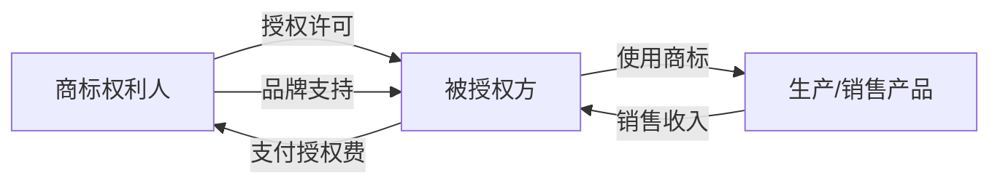

## 二、商标注册与品牌授权技巧

商标是品牌资产的法律载体。一个注册成功的商标，不仅是一枚logo或一个名字，更是可以质押融资、授权许可、连锁加盟的核心资产。本节从商标法律基础讲起，覆盖检索分析、注册实操、国际布局、品牌授权模式设计、商标变现路径，以及常见误区与避坑策略，帮助读者建立从注册到变现的完整能力。

### 1. 商标的法律基础与价值认知

#### 1.1 什么是商标

商标（Trademark）是能够将自然人、法人或其他组织的商品或服务与他人的商品或服务区别开的标志。根据《中华人民共和国商标法》第八条，商标可以由以下要素构成：

- **文字**：品牌名称、企业字号（如"华为""小米"）
- **图形**：Logo、图案（如苹果的咬痕苹果）
- **字母**：英文缩写（如"IBM""TCL"）
- **数字**：数字组合（如"999感冒灵"）
- **三维标志**：立体形状（如可口可乐瓶身）
- **颜色组合**：特定色彩搭配（如蒂芙尼蓝）
- **声音**：特定音频（如英特尔"灯灯灯灯灯"）
- **上述要素的组合**：图文组合是最常见的形式

#### 1.2 商标权的核心特征

| 特征 | 说明 | 商业意义 |
|------|------|----------|
| 专有性 | 注册人在核定商品/服务上独占使用 | 竞争壁垒，防止模仿 |
| 地域性 | 仅在注册国/地区有效 | 出海需另行注册 |
| 时间性 | 有效期10年，可无限续展 | 长期资产，需按时续费 |
| 可转让性 | 可以许可、转让、质押 | 多种变现路径 |

#### 1.3 商标与其他知识产权的区别

很多创业者容易混淆商标、版权、专利的关系。以下是关键区别：

| 对比维度 | 商标 | 版权（著作权） | 专利 |
|----------|------|----------------|------|
| 保护对象 | 品牌标识 | 文艺/学术作品 | 技术方案/外观设计 |
| 获取方式 | 申请注册 | 自动产生（创作完成） | 申请授权 |
| 保护期限 | 10年（可续展） | 作者死后50年 | 10-20年（不可续） |
| 保护范围 | 核定商品/服务类别 | 作品本身 | 技术方案本身 |
| 地域效力 | 仅注册国有效 | 国际公约自动保护 | 仅申请国有效 |

**关键提示**：品牌名称注册商标，品牌Logo同时注册商标和版权，产品技术申请专利——三者协同保护，缺一不可。

#### 1.4 商标的商业价值

商标的价值并非一成不变，它随着品牌的成长而增值：

- **初创期**：商标价值 = 注册成本（约1000-3000元）
- **成长期**：商标价值 = 市场知名度带来的溢价
- **成熟期**：商标价值 = 品牌估值（可达数百万至数十亿元）

以"喜茶"商标为例，早期注册成本不过数千元，但随着品牌扩张，其商标估值已超过百亿。商标是品牌投入的最终沉淀物——广告费、营销费花出去了，积累的是商标的知名度和美誉度。

### 2. 商标检索与可行性分析

#### 2.1 为什么必须先检索

商标注册的核心原则是**申请在先**（非使用在先）。如果不做检索就盲目申请，大概率会因为与在先商标近似而被驳回，白白浪费8-12个月的审查周期和申请费用。据统计，中国商标注册的驳回率约为30%-40%，做好前期检索可以将通过率提升到80%以上。

#### 2.2 检索工具与平台

**官方免费平台：**
- **中国商标网**（sbj.cnipa.gov.cn）：国家知识产权局官方数据库，数据最权威
- **商标注册申请查询**（wcjs.sbj.cnipa.gov.cn）：可按商标名、申请人、注册号检索

**第三方付费平台：**
- **权大师**（quandashi.com）：智能近似分析，可视化程度高
- **标库网**（biaoKu.com）：分类检索体验好
- **商标圈**（shangbiao.com）：社区讨论活跃
- **企查查/天眼查**：可查看企业的全部商标布局

**国际检索：**
- **WIPO Global Brand Database**（branddb.wipo.int）：覆盖全球多个国家的商标数据
- **USPTO TESS**（tess2.uspto.gov）：美国商标检索
- **EUIPO eSearch**（euipo.europa.eu/eSearch）：欧盟商标检索

#### 2.3 近似判断的核心规则

商标近似判断是注册成功与否的关键，审查员主要从以下三个维度判断：

**（1）文字近似判断**

```text
判断维度          判定标准              示例
─────────────────────────────────────────────────
字形近似         结构、笔画相似          "大白兔" vs "太白兔"
读音近似         发音相同或相近          "好又多" vs "好宜多"
含义近似         意思相同或相近          "快乐" vs "Happy"
组合方式          排列顺序相同           "金龙鱼" vs "金鱼龙"
首字相同         首字相同+整体近似       "星巴克" vs "星八客"
```

**（2）图形近似判断**

- 构图元素是否相同（如都用动物、植物、几何图形）
- 整体视觉效果是否近似
- 颜色搭配是否接近
- 设计风格是否一致

**（3）组合商标的近似判断**

组合商标（文字+图形）会**分开审查**——文字部分与在先商标的文字比对，图形部分与在先商标的图形比对。任一部分近似，整个商标就可能被驳回。因此，建议文字和图形**分开注册**，互不影响。

#### 2.4 检索实操流程

完整的商标检索分为四步：

**第一步：确定商标名称和图样**

列出3-5个备选名称，避免只准备一个（被驳回后无备选）。

**第二步：跨类别检索**

在你计划注册的类别及相关类别中检索。例如，做餐饮的，至少在第43类（餐饮服务）、第35类（广告销售）、第29类（食品）、第30类（方便食品）中都检索。

**第三步：近似商标深度分析**

重点关注：
- 已注册的相同/近似商标
- 申请中的相同/近似商标（可能成为障碍）
- 已失效但未满1年的近似商标（享有优先权）

**第四步：出具检索报告**

将检索结果整理为报告，评估每个备选名称的注册通过率，选出最优方案。

#### 2.5 检索结果的应对策略

| 检索结果 | 风险等级 | 应对策略 |
|----------|----------|----------|
| 无相同/近似商标 | 低风险 | 直接申请 |
| 有近似商标但类别不同 | 低风险 | 可申请，注意跨类保护 |
| 有近似商标且类别相同 | 中风险 | 修改商标名称或协商转让 |
| 有相同商标且类别相同 | 高风险 | 放弃或考虑购买该商标 |
| 有多个近似商标 | 高风险 | 重新设计商标方案 |

### 3. 中国商标注册全流程

#### 3.1 注册途径对比

| 途径 | 费用 | 周期 | 适合人群 | 优劣势 |
|------|------|------|----------|--------|
| 自行网上申请 | 官费270元/类（10项以内） | 8-12个月 | 有经验的申请人 | 最省钱，但风险高 |
| 委托代理机构 | 官费270元+代理费800-2000元/类 | 8-12个月 | 大多数申请人 | 专业指导，通过率高 |
| 委托律师事务所 | 官费+律师费2000-5000元/类 | 8-12个月 | 复杂案件/企业 | 最专业，费用最高 |

#### 3.2 注册详细流程

**第一阶段：准备阶段（1-3天）**

1. 确定商标名称和图样
2. 确定商品/服务类别（参考《类似商品和服务区分表》）
3. 准备申请材料：
   - 个人申请：身份证复印件+个体工商户营业执照
   - 企业申请：营业执照副本复印件
   - 商标图样（JPG格式，400×400像素以上，小于200KB）

**第二阶段：提交申请（1天）**

通过国家知识产权局商标局网上服务系统（sbj.cnipa.gov.cn）提交：
1. 注册账号并实名认证
2. 填写商标注册申请书
3. 上传商标图样
4. 选择商品/服务项目
5. 缴纳费用并提交

**第三阶段：形式审查（1-2个月）**

商标局审查申请文件是否齐全、格式是否正确。通过后发放《受理通知书》。不通过则发放《补正通知书》，需在30天内补正。

**第四阶段：实质审查（5-8个月）**

审查员对商标进行实质审查，包括：
- 是否违反禁用条款（如国旗、国徽等不得作为商标）
- 是否与在先商标近似
- 是否具有显著性

审查结果有三种：
- **通过**：进入公告期
- **部分驳回**：部分商品通过，部分驳回
- **全部驳回**：可申请驳回复审

**第五阶段：初步审定公告（3个月）**

商标在《商标公告》上公示，任何人可以提出异议。异议成立则不予注册，异议不成立则核准注册。

**第六阶段：核准注册（1个月）**

公告期满无异议或异议不成立，商标局发放《商标注册证》。商标有效期自核准注册之日起10年。

#### 3.3 驳回复审的策略

商标被驳回不等于判了"死刑"。根据统计数据，驳回复审的成功率约为30%-50%。关键策略：

**时机**：收到驳回通知后15天内提出复审（不可延期）

**复审理由撰写要点：**
- 引证商标与申请商标的区别（字形、读音、含义、整体外观）
- 引证商标的权利状态（是否已无效、是否正在撤三程序中）
- 申请商标的使用证据（已投入使用的，提供销售合同、发票、宣传材料）
- 共存协议（与引证商标权利人达成的共存协议，审查员通常会尊重）

**费用**：官费750元/类，代理费2000-5000元

#### 3.4 "撤三"制度的利用

"撤三"全称为"撤销连续三年不使用的注册商标"。根据《商标法》第四十九条，注册商标连续三年无正当理由不使用的，任何单位或个人可以申请撤销。

**利用撤三的场景：**
- 你的商标因在先近似商标被驳回
- 经查证该在先商标已连续三年未使用
- 先申请撤三，再重新提交注册申请

**撤三申请材料：**
- 撤销连续三年不使用注册商标申请书
- 申请人身份证明
- 费用：官费免费（2024年起），代理费500-1500元

#### 3.5 商标续展与变更

**续展：**
- 有效期满前12个月内申请续展
- 宽展期：到期后6个月内（需缴纳延迟费）
- 续展费用：官费500元/类
- 每次续展延长10年，可无限续展

**变更：**
- 注册人名称/地址变更时，必须同步办理商标变更
- 未变更可能导致商标被撤销（收不到官方通知）
- 变更费用：官费250元/类

### 4. 商标类别选择策略

#### 4.1 《尼斯分类》体系

商标注册按《尼斯协定》国际分类，共45个类别：
- **第1-34类**：商品商标（如第25类为服装，第30类为食品）
- **第35-45类**：服务商标（如第35类为广告销售，第43类为餐饮住宿）

每个类别下包含多个"类似群组"，每个群组下有具体的商品/服务项目。每件商标注册可选10个项目（含以内），超出部分每项加收30元。

#### 4.2 核心类别与关联类别选择

以常见的创业方向为例，说明类别选择策略：

**餐饮行业：**
- 核心类别：第43类（餐饮服务）、第35类（广告销售）
- 关联类别：第29类（肉/奶制品）、第30类（调味品/方便食品）、第32类（饮料）、第33类（酒）
- 防御类别：第21类（厨房用具）、第25类（工作服）

**电商/互联网：**
- 核心类别：第35类（广告销售）、第42类（技术服务）
- 关联类别：第9类（APP/软件）、第38类（通讯服务）、第41类（在线教育）
- 防御类别：第36类（金融服务）、第39类（物流）

**教育培训：**
- 核心类别：第41类（教育培训）
- 关联类别：第35类（广告销售）、第9类（教学软件）、第16类（教材）
- 防御类别：第42类（在线平台）、第38类（在线通讯）

**服装时尚：**
- 核心类别：第25类（服装鞋帽）
- 关联类别：第18类（箱包皮革）、第14类（珠宝首饰）、第35类（零售服务）
- 防御类别：第24类（纺织品）、第26类（纽扣拉链）

#### 4.3 "一标多类"与"一标一类"的选择

- **一标一类**：一个商标申请一个类别，灵活性高，风险独立
- **一标多类**：一个商标同时申请多个类别，但一个类别被驳回可能影响整体

**建议**：核心类别单独申请，关联类别可以合并申请。预算充足时，每个核心类别单独申请，确保互不影响。

#### 4.4 预算有限时的优先级

如果预算有限（如个人创业者），按以下优先级逐步注册：

1. **第一优先**：当前业务的核心类别
2. **第二优先**：第35类（广告销售，几乎所有行业都涉及）
3. **第三优先**：业务直接关联的上下游类别
4. **第四优先**：防御性类别（防止他人搭便车）

### 5. 国际商标注册

#### 5.1 为什么需要国际注册

商标具有地域性——在中国注册的商标，仅在中国受保护。如果计划出海销售、做跨境电商、或在海外平台（如Amazon、Shopee）开店，必须在目标市场国注册商标。

#### 5.2 三种国际注册途径

**途径一：马德里体系（推荐）**

通过WIPO（世界知识产权组织）的马德里协定，以中国商标为基础，一次性指定多个成员国。

| 项目 | 说明 |
|------|------|
| 基础要求 | 必须有中国商标注册或申请 |
| 指定国家 | 128个成员国（覆盖全球主要经济体） |
| 费用 | 基础费653瑞士法郎+各国指定费（每个国家100-3000元不等） |
| 周期 | 12-18个月（各指定国独立审查） |
| 优势 | 一次申请覆盖多国，续展统一管理 |
| 劣势 | 依赖中国商标基础，中国商标被撤销则国际注册失效 |

**费用示例：申请美国+欧盟+日本+韩国+东南亚5国，总费用约2-4万元。**

**途径二：逐一国家注册**

直接在目标国委托当地代理机构申请商标。

- 优势：不受中国商标状态影响，灵活性高
- 劣势：每个国家分别申请，费用高，管理复杂
- 费用：每个国家5000-15000元（含代理费）
- 适合：只注册1-2个国家的情况

**途径三：欧盟商标（EUTM）**

一次申请覆盖全部27个欧盟成员国。

- 费用：在线申请850欧元（第一类），第二类50欧元，第三类起每类150欧元
- 周期：约4-6个月
- 优势：一次注册覆盖整个欧盟
- 劣势：任一成员国提出异议或无效，整个欧盟商标都受影响

#### 5.3 出海品牌注册优先级

以跨境电商卖家为例：

1. **第一梯队**：美国（USPTO）、欧盟（EUIPO）—— 主要市场
2. **第二梯队**：日本（JPO）、韩国（KIPO）、英国（UKIPO）—— 亚洲高价值市场
3. **第三梯队**：东南亚（新加坡、泰国、越南、印尼、菲律宾）—— 新兴市场
4. **第四梯队**：澳大利亚、加拿大、中东 —— 扩展市场

### 6. 品牌授权模式与实操

#### 6.1 品牌授权的商业模式

品牌授权（Trademark Licensing）是指商标权利人（授权方/Licensor）将商标使用权授予被授权方（Licensee），并收取授权费的商业模式。



#### 6.2 授权模式详解

**模式一：独占许可**

- 被授权方在约定区域内独占使用，授权方自己也不能使用
- 授权费最高，通常为销售额的8%-15%
- 适合：被授权方需要独家经营权的场景

**模式二：排他许可**

- 授权方和被授权方均可使用，但不得再许可第三方
- 授权费中等，通常为销售额的5%-10%
- 适合：双方共同经营同一区域

**模式三：普通许可**

- 授权方可以同时许可多家使用
- 授权费最低，通常为销售额的3%-8%
- 适合：授权方希望快速铺开品牌

**模式四：分许可**

- 被授权方可以再许可给第三方
- 需要在原始许可合同中明确授权
- 适合：品牌代理/经销体系

#### 6.3 授权合同的核心条款

一份专业的品牌授权合同必须包含以下条款：

```text
1. 授权标的
   - 明确商标注册号、商标图样
   - 明确授权使用的商品/服务范围
   - 明确授权使用的地域范围

2. 授权方式
   - 独占/排他/普通许可
   - 是否允许分许可
   - 是否排他（排他期限）

3. 授权期限
   - 起止日期
   - 续约条件和程序
   - 提前终止的条件

4. 授权费用
   - 入门费（Initial Fee）
   - 持续使用费（Royalty）：固定金额或销售额比例
   - 最低保底金（Minimum Guarantee）
   - 支付方式和周期

5. 质量控制
   - 产品质量标准
   - 授权方的质检权利
   - 不合格产品的处理方式

6. 商标使用规范
   - 商标使用方式（不可变形、不可修改）
   - 标注"®"或"™"的要求
   - 包装、宣传材料的审批流程

7. 知识产权保护
   - 被授权方协助维权的义务
   - 发现侵权的报告机制
   - 维权费用的分担

8. 违约责任
   - 超范围使用的违约金
   - 质量不达标的责任
   - 提前终止的赔偿

9. 争议解决
   - 仲裁或诉讼
   - 管辖法院
```

#### 6.4 授权费的定价策略

授权费的定价没有固定公式，通常参考以下因素：

**基础定价因素：**

| 因素 | 低费区间 | 中费区间 | 高费区间 |
|------|----------|----------|----------|
| 品牌知名度 | 区域品牌 | 全国品牌 | 国际品牌 |
| 行业利润率 | 10%-20% | 20%-40% | 40%以上 |
| 授权范围 | 单一城市 | 单一国家 | 全球 |
| 授权商品类别 | 单一品类 | 相关品类 | 全品类 |
| 授权期限 | 1年以内 | 1-3年 | 3年以上 |

**常见费率参考：**
- 快消品（食品、日化）：销售额的3%-8%
- 服装时尚：销售额的5%-12%
- 娱乐IP（动漫、影视）：销售额的8%-15%
- 奢侈品：销售额的10%-20%
- 技术品牌：销售额的3%-6%

**定价示例：**

假设你有一个有一定知名度的食品品牌，授权给一家工厂生产贴牌产品：
- 预计年销售额：500万元
- 行业费率：5%
- 年授权费 = 500万 × 5% = 25万元
- 加上入门费5万元
- 第一年收入 = 5万 + 25万 = 30万元

#### 6.5 被授权方的选择标准

选错被授权方是品牌授权最大的风险。评估维度：

```text
评估维度          评估要点                    权重
──────────────────────────────────────────────────
生产能力          工厂规模、设备、产能          25%
质量管理          ISO认证、质检体系、合格率      25%
财务状况          营收规模、现金流、负债率        20%
渠道资源          销售渠道覆盖、终端网点数        15%
品牌配合度        愿意遵守品牌规范、配合检查       10%
行业口碑          合作方评价、诉讼记录            5%
```

### 7. 商标变现的五种路径

#### 7.1 路径一：品牌授权收取许可费

这是最常见的商标变现方式。将商标授权给其他企业使用，按销售额提成或收取固定费用。

**适用场景**：已有一定知名度的品牌
**收入预期**：年收入取决于品牌价值和授权规模，从几万到几千万不等
**操作要点**：严格控制被授权方的产品质量，保护品牌声誉

#### 7.2 路径二：商标转让出售

将商标权直接转让给他人，一次性获得转让费。

**适用场景**：不打算继续经营该品牌，或有人高价求购
**定价参考**：
- 普通商标：3000-20000元
- 有一定知名度的商标：5万-50万元
- 高知名度商标：50万-数百万元
- 稀缺类别的好名字：可达百万元级

**转让流程**：
1. 双方签订《商标转让合同》
2. 共同向商标局提交《转让申请》
3. 商标局审查（约6-8个月）
4. 核准转让并公告
5. 受让人领取新的注册证

**注意事项**：
- 同一类别上的近似商标必须一并转让
- 转让期间商标仍有效，但不得再许可第三方
- 建议通过商标转让平台（如标库、权大师）进行，有第三方担保

#### 7.3 路径三：商标质押融资

将商标权质押给银行或金融机构获取贷款。

**基本条件**：
- 商标已注册且在有效期内
- 商标具有一定知名度
- 企业经营状况良好

**融资额度**：通常为商标评估价值的30%-50%
**评估方法**：收益法（基于商标带来的预期收益）、市场法（参考类似商标交易价格）、成本法（基于品牌建设投入）

**操作流程**：
1. 委托评估机构对商标进行价值评估
2. 向银行提交质押贷款申请
3. 银行审核并签订质押合同
4. 向商标局办理质押登记
5. 银行放款

**案例**：某餐饮企业以其注册商标评估价值2000万元为质押，获得银行贷款800万元，用于门店扩张。

#### 7.4 路径四：特许经营（Franchise）

商标+商业模式+运营体系的打包授权，比单纯商标授权更深入。

**特许经营的核心要素**：
- 注册商标（至少拥有1件注册商标）
- 经营资源（商业模式、运营手册、培训体系）
- 成熟的样板店（至少2家直营店经营1年以上——《商业特许经营管理条例》要求）

**收费模式**：
- 加盟费（一次性）：3万-30万元
- 品牌使用费（持续）：月营收的2%-5%或固定月费
- 保证金（可退还）：1万-10万元
- 管理费（持续）：月营收的1%-3%

**合规要求**：
- 向商务部备案（"两店一年"条件）
- 在订立特许经营合同之日前30日以书面形式向被特许人披露信息
- 被特许人在合同订立后一定期限内可以单方解除合同（冷静期）

#### 7.5 路径五：商标投资——"囤标"与"卖标"

注册有价值的商标后出售获利。这是一种灰色地带，需要谨慎操作。

**合法的商标投资方式：**
- 基于市场洞察注册有潜力的品牌名称
- 注册后实际使用（如开设网店、公众号），积累商誉
- 待品牌有一定知名度后出售

**风险提示：**
- 恶意囤标（大量注册不使用）可能被他人申请"撤三"
- 抢注他人商标（如知名品牌的名字）可能被异议或无效
- 商标局对非正常申请的审查日趋严格，批量申请可能被驳回

### 8. 商标保护与维权

#### 8.1 日常保护措施

1. **正确使用商标**：在商品/包装/宣传材料上标注"®"（已注册）或"™"（未注册）
2. **保留使用证据**：销售合同、发票、广告投放记录、媒体报道——这些是应对"撤三"的关键证据
3. **监控商标公告**：定期查看商标局公告，发现近似商标及时提出异议（异议期3个月）
4. **海关备案**：在海关总署进行知识产权备案，海关发现侵权货物时会主动扣押

#### 8.2 侵权应对策略

发现侵权时，可选择以下途径：

**途径一：发送律师函**
- 成本低（律师函费用约500-3000元）
- 对轻微侵权效果好
- 作为后续诉讼的前置证据

**途径二：平台投诉**
- 电商平台（淘宝、京东、拼多多）均有知识产权投诉通道
- 投诉成功率高，处理速度快（3-7个工作日）
- 可要求下架侵权商品、关闭侵权店铺

**途径三：行政投诉**
- 向市场监督管理局（原工商局）投诉
- 行政查处速度快，可现场查封扣押
- 可对侵权人处以罚款

**途径四：司法诉讼**
- 向人民法院提起商标侵权诉讼
- 可要求停止侵权+赔偿损失
- 赔偿金额：实际损失/侵权获利/许可费的1-5倍/法定赔偿500万元以下
- 周期：一审6-12个月，费用：律师费+诉讼费约1-5万元

#### 8.3 证据固定技巧

维权的核心在于证据。发现侵权后应立即固定证据：

1. **公证购买**：到公证处办理公证购买，由公证员见证购买过程并封存侵权产品
2. **网页取证**：使用可信时间戳（如联合信任时间戳）或公证截图保存侵权网页
3. **实物取证**：拍摄侵权商品的照片/视频，保留购买凭证
4. **电子存证**：使用区块链存证平台（如蚂蚁链、至信链）固定电子证据

### 9. 常见误区与避坑指南

#### 误区一："注册了公司名就不用注册商标了"

**真相**：公司名称（商号）和商标是完全不同的法律概念。公司名称在工商局登记，仅在登记地行政区域内受保护；商标在知识产权局注册，全国范围内受保护。很多企业因为只注册了公司名而没有注册商标，结果品牌做大后发现商标已被他人抢注。

**纠正**：创业之初就要同步注册商标，不要等到品牌做大了再行动。

#### 误区二："商标注册成功了就万事大撤"

**真相**：商标注册后还需要持续维护——按时续展（每10年）、保持使用（防止被撤三）、监控近似商标（及时异议）、变更信息（地址/名称变更后及时办理变更手续）。

**纠正**：建立商标管理台账，记录每个商标的注册日期、续展日期、使用情况、监控状态。

#### 误区三："只要不完全一样就不算侵权"

**真相**：商标侵权不仅包括使用完全相同的商标，还包括使用近似商标。判断标准是"是否容易导致公众混淆"——即使不完全一样，只要足以让消费者产生混淆误认，就构成侵权。

**纠正**：在设计品牌名称和Logo时，不仅要避免与已有商标完全相同，还要注意近似性。检索时不要只搜完全相同的，更要关注近似的。

#### 误区四："注册一个商标就够了"

**真相**：一个类别上的商标保护是有限的。如果你的品牌发展到其他领域，需要在新类别上注册商标。此外，还应考虑注册防御商标（在不相关类别上注册相同商标，防止被他人抢注）。

**纠正**：制定商标布局规划，随着业务发展逐步扩展注册类别。知名品牌如"老干妈"在所有45个类别上都注册了商标。

#### 误区五："找最便宜的代理机构注册"

**真相**：低价代理机构可能存在的问题：
- 检索不仔细，盲目提交导致驳回
- 不做近似分析，不提供注册建议
- 后期不跟踪，错过补正/答复期限
- 部分不正规机构甚至伪造受理通知书

**纠正**：选择在国家知识产权局备案的正规代理机构，查看其资质和口碑，不要只看价格。

#### 误区六："商标被驳回就没救了"

**真相**：商标被驳回后，可以在15天内提出驳回复审。复审的成功率约为30%-50%，尤其是以下情况成功率更高：
- 引证商标权利状态不稳定（已被撤三、已到期未续展）
- 申请商标与引证商标有明显区别
- 申请商标已经大量使用并有一定知名度

**纠正**：收到驳回通知后不要放弃，找专业代理人分析复审可行性。

### 10. 工具与资源汇总

#### 10.1 官方平台

| 平台 | 网址 | 用途 |
|------|------|------|
| 国家知识产权局商标局 | sbj.cnipa.gov.cn | 商标注册、查询、公告 |
| 中国商标网 | wcjs.sbj.cnipa.gov.cn | 商标近似查询 |
| 商标网上服务系统 | sbj.cnipa.gov.cn/sbj/wssq/ | 在线申请 |
| WIPO马德里体系 | wipo.int/madrid | 国际商标注册 |
| WIPO全球品牌数据库 | branddb.wipo.int | 全球商标检索 |

#### 10.2 第三方工具

| 工具 | 网址 | 特点 |
|------|------|------|
| 权大师 | quandashi.com | 智能近似分析，免费检索 |
| 标库网 | biaoku.com | 分类检索体验好 |
| 企查查 | qcc.com | 企业商标布局查询 |
| 商标圈 | shangbiao.com | 社区讨论，行业资讯 |
| 百度企业信用 | xinyong.baidu.com | 企业商标信息 |

#### 10.3 费用速查表

| 项目 | 官费 | 代理费参考 | 合计 |
|------|------|-----------|------|
| 商标注册（网上申请） | 270元/类 | 800-2000元 | 1070-2270元 |
| 驳回复审 | 750元/类 | 2000-5000元 | 2750-5750元 |
| 商标续展 | 500元/类 | 500-1000元 | 1000-1500元 |
| 商标转让 | 500元/类 | 1000-3000元 | 1500-3500元 |
| 商标变更 | 250元/类 | 500-1000元 | 750-1250元 |
| 马德里国际注册 | 653CHF基础费 | 5000-15000元 | 约1-2万元 |
| 撤三申请 | 免费 | 500-1500元 | 500-1500元 |
| 异议申请 | 免费 | 1500-3000元 | 1500-3000元 |

### 11. 实操检查清单

在启动商标注册和品牌授权前，逐项确认：

**注册前检查：**
- [ ] 完成商标近似检索，评估通过率
- [ ] 确定核心注册类别和关联类别
- [ ] 准备3-5个备选商标名称
- [ ] 准备好营业执照或个体工商户执照
- [ ] 确定注册途径（自行申请/委托代理）
- [ ] 预算规划（官费+代理费+后续维护费）

**授权前检查：**
- [ ] 商标已注册成功且在有效期内
- [ ] 完成被授权方的资质审核和尽职调查
- [ ] 起草并审核品牌授权合同
- [ ] 建立质量控制标准和检查机制
- [ ] 确定授权费定价方案
- [ ] 建立商标使用监控机制
- [ ] 建立侵权应对预案

**持续维护检查：**
- [ ] 每年检查商标续展日期
- [ ] 每季度监控商标公告中的近似商标
- [ ] 每半年收集商标使用证据
- [ ] 每年评估是否需要扩展注册类别
- [ ] 及时办理注册人信息变更
