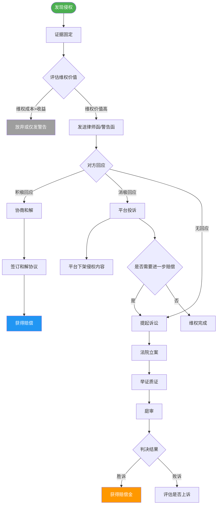

## 三、版权保护与内容授权技巧

版权是创作者最核心的无形资产。很多人花了大量精力创作内容，却因为不了解版权保护机制，导致作品被他人无偿挪用甚至反过来被指控侵权。本节从法律原理出发，系统讲解版权保护的完整知识体系——从权利产生、登记确权、证据保全，到授权变现、维权打击的全链路方法论，帮助你把每一部作品的价值最大化。

### 3.1 版权的法律基础与核心概念

#### 3.1.1 版权的自动取得原则

《中华人民共和国著作权法》第二条明确规定：中国公民、法人或者其他组织的作品，不论是否发表，依照本法享有著作权。这意味着版权**自作品创作完成之日起自动产生**，无需申请、注册或发表。

理解这个原则至关重要，因为它意味着：

| 特性 | 说明 |
|------|------|
| 产生时间 | 作品创作完成的瞬间，而非发表或登记之时 |
| 保护期限（自然人） | 作者终生 + 死后50年 |
| 保护期限（法人作品） | 首次发表后50年 |
| 权利内容 | 人身权（署名、发表、修改、保护完整）+ 财产权（复制、发行、出租、展览、表演、放映、广播、信息网络传播、改编、翻译、汇编） |
| 无需条件 | 不要求发表、不要求登记、不要求加注©标记 |

但"自动取得"不等于"容易证明"。在司法实践中，**谁先完成谁享有权利**的举证往往成为争议焦点。这也是为什么登记和证据保全如此重要。

#### 3.1.2 作品的法定类型

著作权法保护的作品类型包括：

- **文字作品**：小说、论文、博客、剧本、歌词
- **口述作品**：演讲、授课、即兴评述
- **音乐、戏剧、曲艺、舞蹈、杂技艺术作品**
- **美术、建筑作品**：绘画、书法、雕塑、建筑设计图
- **摄影作品**
- **视听作品**：电影、短视频、动画、游戏CG
- **工程设计图、产品设计图、地图、示意图等图形作品和模型作品**
- **计算机软件**：源代码、目标代码、相关文档

需要注意的是，以下内容**不受版权保护**：

- 法律法规、国家机关的决议和文件
- 时事新闻（单纯事实消息）
- 历法、通用数表、通用表格和公式
- 单纯的思想、方法、算法本身（需要以具体表达形式固定下来才受保护）

#### 3.1.3 版权与相关权利的区分

很多创作者混淆版权（著作权）与专利权、商标权的区别，导致保护策略错误：

| 维度 | 版权（著作权） | 专利权 | 商标权 |
|------|--------------|--------|--------|
| 保护对象 | 作品的独创性表达 | 技术方案/外观设计 | 商业标识 |
| 产生方式 | 自动取得 | 需申请授权 | 需申请注册 |
| 保护期限 | 作者终生+50年 | 发明20年/实用新型10年/外观15年 | 10年（可续展） |
| 登记作用 | 强化证据效力 | 权利产生前提 | 权利产生前提 |
| 维权依据 | 证明独创性+接触可能性 | 权利要求书 | 商标注册证 |
| 适合场景 | 文章、图片、音乐、代码 | 技术发明、产品结构 | 品牌名称、Logo |

**实务建议**：一个内容创作者的作品可能同时涉及多种权利。例如，你开发了一款软件，源代码受版权保护，如果其中的技术方案有创新可以申请专利，软件名称和Logo可以注册商标。

### 3.2 版权登记：从申请到获证的完整流程

#### 3.2.1 为什么版权登记如此重要

虽然版权自动产生，但登记证书在维权中具有**不可替代的证据价值**：

1. **法定推定效力**：根据《最高人民法院关于审理著作权民事纠纷案件适用法律若干问题的解释》第七条，当事人提供的著作权登记证书可以作为证明著作权归属的初步证据
2. **降低维权成本**：没有登记证书，你需要自行举证创作时间、创作过程、发表时间等，诉讼成本可能翻倍
3. **平台维权利器**：大部分互联网平台（微信、抖音、B站、淘宝等）处理侵权投诉时，版权登记证书是最有力的权利证明文件
4. **商业授权的基础**：授权合作时，对方通常要求你出示权利证明

#### 3.2.2 中国版权登记的三种途径

| 登记途径 | 适用对象 | 费用 | 周期 | 优势 |
|----------|---------|------|------|------|
| 中国版权保护中心（CPCC） | 所有作品类型 | 100-300元/件 | 30-60个工作日 | 官方权威，全国通用 |
| 各省版权局 | 本省创作者 | 0-200元/件 | 15-30个工作日 | 部分省份免费或补贴 |
| 中国版权保护中心DCI体系 | 数字作品 | 约100元/件 | 即时-7个工作日 | 速度快，适合批量 |

**DCI（Digital Copyright Identifier）体系**是近年来推广的数字版权登记方式，特别适合互联网内容创作者。它通过为每件数字作品分配唯一的版权标识符，实现版权的快速确认和追溯。

#### 3.2.3 版权登记的详细操作步骤

**第一步：准备材料**

```text
所需材料清单：
├── 作品样本
│   ├── 文字作品：打印稿或电子文档（需体现完整内容）
│   ├── 美术作品：高清图片（300dpi以上）
│   ├── 摄影作品：原始照片文件
│   ├── 软件：源代码前后各30页（不足60页的提交全部）
│   └── 音乐：曲谱 + 音频文件
├── 身份证明
│   ├── 个人：身份证正反面扫描件
│   └── 法人：营业执照副本 + 法人身份证
├── 作品创作说明书
│   ├── 创作目的
│   ├── 创作过程（时间线）
│   ├── 独创性声明
│   └── 是否使用他人素材（如有，需注明来源及授权）
└── 权利归属证明（如为委托作品、职务作品）
```

**第二步：在线提交申请**

1. 访问中国版权保护中心网站（www.ccopyright.com.cn）
2. 注册并登录账号
3. 选择作品类型，填写作品信息
4. 上传作品样本和证明材料
5. 确认信息无误后提交

**第三步：缴纳费用**

- 文字作品：100元/件（10万字以内）
- 美术/摄影作品：300元/件
- 软件著作权：300元/件
- 支付方式：在线支付或银行转账

**第四步：等待审查**

- 形式审查：检查材料是否齐全、格式是否规范
- 实质审查（部分情况）：对作品的独创性进行评估
- 审查通过后，发放《作品登记证书》

**第五步：领取证书**

- 可选择邮寄领取或现场领取
- 证书包含：登记号、作品名称、作者、创作完成日期、首次发表日期

#### 3.2.4 软件著作权登记的特殊要求

软件著作权登记是内容创作者（尤其是独立开发者）最常用的权利保护手段之一：

```text
软件著作权登记材料：
├── 软件著作权登记申请表（在线填写）
├── 身份证明文件
├── 软件鉴别材料
│   ├── 源程序：前30页 + 后30页（每页≥50行）
│   └── 文档：设计说明书 或 用户手册 或 操作流程图
└── 代理委托书（如委托代理机构办理）
```

**省时技巧**：源程序不足60页时提交全部代码，超过60页则提交前后各30页。文档材料可以是用户手册、设计说明书或操作说明中的任意一种，10页以上即可。

### 3.3 数字时代的版权证据保全

#### 3.3.1 证据保全的战略意义

在数字版权纠纷中，**证据就是你的武器**。司法实践中，以下三类证据最为关键：

1. **创作时间证据**：证明你在某个时间点已经完成了作品
2. **作品完成度证据**：证明你提交的版本确实是你的原创
3. **侵权证据**：证明对方使用了你的作品

#### 3.3.2 创作时间的六种锁定方法

| 方法 | 操作方式 | 成本 | 证明力 | 适用场景 |
|------|---------|------|--------|---------|
| 区块链存证 | 通过司法区块链平台（如北京互联网法院"天平链"）上传作品哈希 | 免费-50元/条 | 极高（司法认可） | 高价值作品、诉讼准备 |
| 时间戳认证 | 通过联合信任时间戳服务（TSA）对作品文件加盖时间戳 | 免费-10元/条 | 高 | 日常创作保全 |
| 邮件自寄 | 将作品通过电子邮件发送给自己，邮件服务器自动记录时间 | 免费 | 中 | 快速保全 |
| 公证处公证 | 到公证处对作品进行证据保全公证 | 200-1000元 | 极高（法院直接采信） | 重大案件、诉讼使用 |
| 云存储+版本控制 | 使用Git、网盘等工具保存创作过程，保留完整版本历史 | 免费 | 中 | 日常创作记录 |
| 发布平台记录 | 在微信公众号、知乎、简书等平台发布，平台自动记录时间 | 免费 | 中 | 公开发布的作品 |

**区块链存证操作流程**（以北京互联网法院"天平链"为例）：

```text
步骤1：注册天平链账号（https://www.tianpinglian.com）
步骤2：上传作品文件（系统自动计算哈希值）
步骤3：区块链记录（哈希值 + 时间戳 + 用户ID 写入链上）
步骤4：获取存证编号和存证证书
步骤5：维权时向法院提交存证编号，法院可直接验证
```

**重要提醒**：2018年《最高人民法院关于互联网法院审理案件若干问题的规定》第十一条明确确认，通过区块链等技术手段固定的电子数据，当事人提交的电子数据，通过电子签名、可信时间戳、哈希值校验、区块链等证据收集、固定和防篡改的技术手段或者通过电子取证存证平台认证，能够证明其真实性的，互联网法院应当确认。

#### 3.3.3 侵权证据的取证策略

发现侵权后，取证的关键原则是**先取证，再通知**。一旦打草惊蛇，对方可能删除侵权内容，导致证据灭失。

**取证清单：**

```text
侵权证据收集模板：
├── 1. 侵权内容截图（带URL和时间信息）
├── 2. 侵权页面的网页快照（使用存证工具）
├── 3. 侵权内容与原作的对比分析
├── 4. 侵权主体信息（网站备案、经营者信息、账号主体）
├── 5. 侵权规模证据（下载量、阅读量、传播范围）
├── 6. 侵权获利证据（广告收入、销售收入、会员收费等）
└── 7. 沟通记录（如有前期协商，保留全部聊天记录）
```

**取证工具推荐：**

- **公证云**：在线公证存证平台，支持网页、图片、视频取证
- **IP360**：全方位数字取证平台，支持区块链存证
- **可信时间戳**：联合信任时间戳服务（www.tsa.cn）
- **网页快照**：使用 Wayback Machine（archive.org）保存网页快照
- **屏幕录制**：使用OBS等录屏软件记录侵权页面的完整浏览过程

### 3.4 内容授权的商业模式与定价策略

#### 3.4.1 授权的法律框架

内容授权本质上是著作权人将部分财产权授予他人使用的法律行为。授权方式分为：

| 授权类型 | 定义 | 特点 | 适用场景 |
|----------|------|------|---------|
| 独占许可 | 只有被许可人可以使用，著作权人自己也不能使用 | 价格最高 | 大型影视改编、品牌独家合作 |
| 排他许可 | 只有被许可人和著作权人可以使用 | 价格较高 | 重要合作项目 |
| 普通许可 | 著作权人可以同时授权多人使用 | 价格适中 | 图库、音乐库、内容转载 |

**关键提醒**：《著作权法》规定，许可使用合同应当包括许可使用的权利种类、许可使用的地域范围和期间、付酬标准和办法、违约责任等条款。口头授权在法律上也有效，但建议**所有授权都签订书面合同**，避免后续纠纷。

#### 3.4.2 图片授权变现

图片授权是门槛最低、最适合新手入门的版权变现方式。

**主流平台对比：**

| 平台 | 分成比例 | 审核标准 | 适合人群 | 结算周期 |
|------|---------|---------|---------|---------|
| 视觉中国（VCG） | 摄影师40%-50% | 高（技术+商业价值） | 职业摄影师 | 月结 |
| 图虫创意 | 摄影师30%-50% | 中 | 业余摄影爱好者 | 月结 |
| 东方IC | 摄影师40%-60% | 中 | 摄影爱好者 | 月结 |
| 500px | 摄影师30% | 低 | 入门者 | 月结 |
| Adobe Stock | 摄影师33% | 中 | 有Adobe生态的创作者 | 月结 |
| Shutterstock | 摄影师15%-40% | 中 | 批量上传者 | 月结 |

**图片授权收入模型：**

```text
假设你有1000张高质量图片在平台上架：
├── 平均每月被下载：100-500次
├── 单次下载分成：10-100元（取决于图片类型和授权方式）
├── 月收入范围：1,000-50,000元
└── 关键变量：图片质量、题材稀缺性、关键词优化、图片数量
```

**提升图片授权收入的实操技巧：**

1. **选对题材**：商务场景、科技概念、生活方式是需求最大的题材
2. **关键词优化**：每张图片标注20-50个精准关键词，提升搜索排名
3. **批量上传**：保持每月新增50-100张，持续扩大库存
4. **系列化创作**：同一主题拍摄多角度、多场景的系列图片
5. **紧跟热点**：节日、社会事件、行业趋势相关图片需求激增

#### 3.4.3 文字内容授权

文字内容授权是自媒体和专业写作者的重要收入来源。

**授权定价参考：**

| 内容类型 | 授权费区间 | 定价影响因素 |
|----------|-----------|-------------|
| 深度报道/调查文章 | 2,000-20,000元/篇 | 独家性、深度、时效性 |
| 行业分析/研究报告 | 5,000-50,000元/份 | 行业稀缺性、数据质量 |
| 技术教程/实操指南 | 500-5,000元/篇 | 专业度、实用性 |
| 文学作品/小说 | 1,000-100,000元/部 | 体量、文学价值、IP潜力 |
| 科普文章 | 300-3,000元/篇 | 专业度、可读性 |

**文字授权的三种模式：**

1. **单次转载授权**：授权某篇文章给某个媒体转载一次，一次性收费
2. **打包授权**：将多篇文章打包授权给某个平台，按季度或年度收费
3. **内容定制授权**：根据客户需求定制内容，同时保留著作权，收取创作费+授权费

#### 3.4.4 音乐版权变现

音乐版权收入是被动收入的典型代表，一次创作可以持续产生收益。

**音乐版权收入来源：**

```text
音乐版权收入结构：
├── 1. 流媒体播放收入
│   ├── Spotify：约$0.003-0.005/次播放
│   ├── Apple Music：约$0.007-0.01/次播放
│   ├── 网易云音乐：约¥0.002-0.01/次播放
│   └── QQ音乐：约¥0.002-0.008/次播放
├── 2. 同步授权收入（影视、广告、游戏配乐）
│   ├── 广告配乐：5,000-100,000元/首
│   ├── 影视配乐：10,000-500,000元/首
│   └── 游戏配乐：5,000-200,000元/首
├── 3. 背景音乐授权
│   ├── 短视频平台BGM：按使用量分成
│   └── 商业场所播放：集体管理组织收费分配
└── 4. 机械复制权收入
    └── 实体唱片、数字下载的版权费
```

**音乐版权保护实操：**

1. 创作完成后立即进行版权登记（中国音乐著作权协会 MCSC 或中国版权保护中心）
2. 在各大音乐平台上架时，明确标注版权所有者信息
3. 加入音著协（MCSC）或音集协（CAVCA），由集体管理组织代为收取和分配版权费
4. 定期监控各平台的播放数据和收入明细

#### 3.4.5 软件著作权与代码授权

对于独立开发者和技术创作者，软件著作权是核心资产。

**软件著作权的变现路径：**

| 变现方式 | 描述 | 收入潜力 |
|----------|------|---------|
| 直接销售 | 在应用商店、独立网站销售软件许可 | 取决于产品和市场 |
| SaaS订阅 | 按月/年收取使用费 | 持续收入，现金流稳定 |
| 开源+商业许可 | 基础版开源，高级功能付费 | 社区+商业双重驱动 |
| SDK/API授权 | 将技术能力封装为SDK或API，授权给开发者使用 | 技术壁垒高，利润好 |
| 技术转让 | 将著作权整体转让给他人 | 一次性高收入 |
| 企业资质加分 | 用于申请高新技术企业、软件企业认证 | 间接收益（税收优惠、补贴） |

**软件著作权登记注意事项：**

1. 源代码的格式要求严格：A4纸单面打印，每页≥50行，字号不大于12号
2. 软件名称需与实际名称一致，版本号要规范
3. 如果使用了开源组件，需要在申请材料中声明
4. 软件著作权登记不审查源代码的独创性，但不意味着可以抄袭

### 3.5 维权实操：从发现侵权到获得赔偿

#### 3.5.1 维权全流程



#### 3.5.2 维权策略选择

| 维权方式 | 成本 | 周期 | 成功率 | 适用场景 |
|----------|------|------|--------|---------|
| 平台投诉（DMCA） | 0元 | 1-7天 | 70%-90% | 平台上的侵权内容 |
| 律师函警告 | 500-3,000元 | 1-2周 | 50%-70% | 轻微侵权、首次侵权 |
| 行政投诉 | 0元 | 1-3月 | 60%-80% | 大规模盗版、假冒 |
| 民事诉讼 | 5,000-50,000元 | 3-12月 | 70%-85%（有登记证书） | 高价值作品、拒不改正 |
| 刑事报案 | 0元 | 6-18月 | 40%-60% | 大规模盗版、违法所得巨大 |

**平台投诉操作流程（以微信公众号为例）：**

```text
步骤1：进入微信公众平台侵权投诉入口
步骤2：选择投诉类型（著作权侵权）
步骤3：填写权利人信息（姓名/名称、身份证号/统一社会信用代码）
步骤4：上传权利证明（版权登记证书、原创发布记录等）
步骤5：填写侵权链接和侵权说明
步骤6：提交投诉
步骤7：微信平台在7个工作日内审核处理
步骤8：投诉成功后，侵权内容将被删除
```

**各平台投诉入口汇总：**

| 平台 | 投诉入口 | 处理周期 |
|------|---------|---------|
| 微信公众号 | 公众平台→侵权投诉 | 3-7个工作日 |
| 抖音 | APP→举报→侵权投诉 | 1-3个工作日 |
| B站 | APP/网页→举报→侵权投诉 | 3-7个工作日 |
| 知乎 | 个人主页→版权投诉 | 3-5个工作日 |
| 淘宝/天猫 | 知识产权保护平台（IPP） | 1-3个工作日 |
| 京东 | 知识产权保护平台 | 3-5个工作日 |
| 百度 | 版权保护中心 | 3-7个工作日 |

#### 3.5.3 赔偿金额的计算方式

著作权侵权赔偿按照以下顺序确定：

```text
赔偿金额确定顺序：
├── 1. 实际损失（原告的损失）
│   └── 因侵权导致的收入减少、市场份额下降等
├── 2. 侵权获利（被告的获利）
│   └── 侵权人因侵权行为获得的利润
├── 3. 许可使用费的合理倍数
│   └── 参照同类作品的市场授权价格
└── 4. 法定赔偿
    └── 500元-500万元（由法院根据情节酌定）
```

**实际判赔数据分析：**

根据近年来的司法判例统计：

- **图片侵权**：单张图片赔偿500-5,000元，批量侵权可判赔数万至数十万元
- **文章侵权**：单篇赔偿1,000-30,000元，知名作者的作品赔偿更高
- **软件侵权**：赔偿金额从数万到数百万元不等，取决于软件的市场价值
- **音乐侵权**：单首赔偿2,000-50,000元，商用侵权赔偿更高

**提高判赔金额的技巧：**

1. 提交充分的证据证明作品的市场价值（授权合同、销售记录等）
2. 证明侵权人的主观恶意（明知侵权仍继续、多次侵权等）
3. 证明侵权行为的传播范围和影响程度
4. 申请惩罚性赔偿（故意侵权且情节严重，可判处1-5倍惩罚性赔偿）

### 3.6 版权保护的技术手段

#### 3.6.1 数字水印技术

数字水印是在不影响作品正常使用的情况下，嵌入版权信息的技术。分为：

| 水印类型 | 特点 | 适用场景 |
|----------|------|---------|
| 可见水印 | 半透明文字/Logo覆盖在作品上 | 图片预览、试用版 |
| 不可见水印 | 人眼无法感知，需专用工具提取 | 正式版图片、音视频 |
| 鲁棒水印 | 能抵抗裁剪、压缩、格式转换 | 需要长期追踪的作品 |
| 脆弱水印 | 被修改后水印会被破坏 | 检测作品是否被篡改 |

**图片水印工具推荐：**

- **Visible Watermark**：轻量级批量加水印工具，支持文字和图片水印
- **Digimarc**：专业级不可见水印解决方案，被Adobe Photoshop集成
- **iWatermark**：跨平台水印工具，支持批量处理
- **Python方案**：使用Pillow库添加文字水印或图片水印

```python
# Python批量添加图片水印示例
from PIL import Image, ImageDraw, ImageFont
import os

def add_watermark(input_path, output_path, watermark_text):
    """为图片添加半透明文字水印"""
    image = Image.open(input_path).convert("RGBA")
    txt_layer = Image.new("RGBA", image.size, (255, 255, 255, 0))
    draw = ImageDraw.Draw(txt_layer)

    # 设置字体和大小
    font = ImageFont.truetype("arial.ttf", 40)

    # 计算文字位置（右下角）
    text_bbox = draw.textbbox((0, 0), watermark_text, font=font)
    text_width = text_bbox[2] - text_bbox[0]
    text_height = text_bbox[3] - text_bbox[1]
    x = image.width - text_width - 20
    y = image.height - text_height - 20

    # 绘制半透明文字
    draw.text((x, y), watermark_text, fill=(255, 255, 255, 128), font=font)

    # 合并图层
    watermarked = Image.alpha_composite(image, txt_layer)
    watermarked.convert("RGB").save(output_path, quality=95)

# 批量处理
input_dir = "./photos"
output_dir = "./photos_watermarked"
os.makedirs(output_dir, exist_ok=True)

for filename in os.listdir(input_dir):
    if filename.lower().endswith(('.jpg', '.png', '.jpeg')):
        add_watermark(
            os.path.join(input_dir, filename),
            os.path.join(output_dir, filename),
            "© Your Name 2026"
        )
```

#### 3.6.2 内容防盗链与访问控制

对于数字内容的在线分发，技术防盗措施可以有效减少未经授权的传播：

```text
技术防盗措施体系：
├── 1. 服务器层面
│   ├── Referer防盗链：限制请求来源
│   ├── Token鉴权：每次访问需要携带有效token
│   └── IP限制：限制访问IP范围
├── 2. 内容层面
│   ├── 分片加密：将内容切片加密，需要密钥才能播放
│   ├── DRM保护：使用Widevine、FairPlay等DRM方案
│   └── 动态水印：在内容中嵌入用户ID，泄露可追溯
├── 3. 平台层面
│   ├── 下载次数限制
│   ├── 同时在线设备限制
│   └── 有效期控制
└── 4. 法律层面
    ├── 用户协议明确禁止转载
    ├── 技术措施受法律保护（规避技术措施本身违法）
    └── 保留追究法律责任的权利声明
```

#### 3.6.3 监控与预警系统

主动监控比被动发现侵权更有效：

**监控工具推荐：**

- **原创宝**：国内原创内容监控平台，支持文字、图片、视频
- **鲸版权**：一站式版权管理和监控平台
- **Google Alerts**：设置关键词监控，发现新的侵权内容
- **百度站长平台**：监控网站内容被抄袭的情况
- **Copyscape**：英文内容的抄袭检测工具

**监控策略：**

1. 对核心作品设置关键词监控（Google Alerts、百度搜索风云榜）
2. 定期使用图片反向搜索（Google图片搜索、百度识图、TinEye）查找未经授权的使用
3. 监控主要竞争对手和同行的内容发布，及时发现抄袭
4. 利用自动化脚本定期抓取关键页面，对比内容变化

### 3.7 授权合同的关键条款与模板

#### 3.7.1 授权合同的核心条款

无论授权什么类型的内容，以下条款是必备的：

```text
内容授权合同必备条款：
├── 1. 授权内容：明确描述授权的作品名称、类型、具体内容
├── 2. 授权权利：明确授权的具体权利（复制权、发行权、信息网络传播权等）
├── 3. 授权方式：独占/排他/普通许可
├── 4. 授权范围：地域范围（中国大陆/全球）、使用平台限制
├── 5. 授权期限：起止日期，是否可续期
├── 6. 授权费用：金额、支付方式、支付时间
├── 7. 署名方式：如何标注作者信息
├── 8. 修改权限：被许可人是否有权修改作品
├── 9. 转授权权利：被许可人是否可以再授权给第三方
├── 10. 违约责任：违反合同的赔偿方式和金额
├── 11. 争议解决：仲裁还是诉讼，管辖地
└── 12. 保密条款：双方对合作细节的保密义务
```

#### 3.7.2 授权合同模板（文字内容转载授权）

```text
甲方（授权方）：[姓名/公司名称]
身份证号/统一社会信用代码：[号码]
联系地址：[地址]
联系电话：[电话]

乙方（被授权方）：[姓名/公司名称]
身份证号/统一社会信用代码：[号码]
联系地址：[地址]
联系电话：[电话]

鉴于甲方是以下作品的著作权人，双方经友好协商，达成如下协议：

第一条 授权作品
作品名称：《[作品名称]》
作品类型：[文章/报告/教程等]
创作完成日期：[日期]
版权登记号：[如有]

第二条 授权内容
甲方授权乙方在授权范围内使用上述作品，具体权利包括：
□ 复制权  □ 发行权  □ 信息网络传播权  □ 改编权  □ 汇编权  □ 其他：___

第三条 授权方式
□ 独占许可  □ 排他许可  □ 普通许可

第四条 授权范围
地域范围：□ 中国大陆  □ 全球
使用平台：[具体平台名称]
使用方式：□ 转载  □ 改编  □ 翻译  □ 其他：___

第五条 授权期限
自[日期]起至[日期]止，共计[数字]个月/年。
□ 可续期  □ 不可续期

第六条 授权费用
授权费用总计：人民币[金额]元（大写：[大写金额]）。
支付方式：□ 一次性支付  □ 分期支付
支付时间：合同签订后[数字]个工作日内。

第七条 署名方式
乙方在使用作品时，应以"[署名格式]"的方式标注作者信息。

第八条 违约责任
任何一方违反本合同约定，应向守约方支付违约金人民币[金额]元，
并赔偿因此造成的全部损失。

第九条 争议解决
因本合同引起的争议，双方应友好协商解决；协商不成的，
任何一方有权向[城市]人民法院提起诉讼。

第十条 其他约定
[补充条款]

甲方签章：____________  乙方签章：____________
日期：[日期]            日期：[日期]
```

### 3.8 国际版权保护

#### 3.8.1 国际版权保护的法律框架

中国是《伯尔尼公约》的成员国，这意味着：

1. **自动保护原则**：在公约成员国创作的作品，在其他成员国自动受到保护
2. **国民待遇原则**：外国作品在中国享受与中国作品同等的保护
3. **独立保护原则**：作品在各国的保护独立，不受来源国保护状态的影响

**主要国际版权条约：**

| 条约 | 主要内容 | 中国加入时间 |
|------|---------|-------------|
| 伯尔尼公约 | 文学艺术作品保护的基本框架 | 1992年 |
| 世界版权公约 | 版权保护的补充框架 | 1992年 |
| TRIPS协议 | 与贸易相关的知识产权协议 | 2001年（加入WTO） |
| WIPO版权条约 | 数字环境下的版权保护 | 2007年 |
| WIPO录音制品条约 | 录音制品的保护 | 2007年 |

#### 3.8.2 在海外维权的实操路径

```text
海外维权路径选择：
├── 方案1：通过当地律师维权
│   ├── 优点：专业、有法律效力
│   ├── 缺点：费用高（$5,000-$50,000+）
│   └── 适用：高价值作品、大平台上的侵权
├── 方案2：通过平台投诉机制
│   ├── 优点：免费、速度快
│   ├── 缺点：仅限于平台上的内容
│   └── 适用：YouTube、Instagram、Twitter等平台
├── 方案3：通过国际版权组织
│   ├── 优点：有组织支持
│   ├── 缺点：流程长
│   └── 适用：加入国际版权集体管理组织的创作者
└── 方案4：通过中国版权保护中心
    ├── 优点：有官方背书
    ├── 缺点：协调能力有限
    └── 适用：需要跨国协调的案件
```

### 3.9 常见误区与避坑指南

#### 3.9.1 版权保护的十大误区

| 误区 | 真相 | 后果 |
|------|------|------|
| "加了©标记才有版权" | 版权自动产生，©标记只是声明 | 可能因此忽视真正的保护措施 |
| "没发表的作品不受保护" | 未发表作品同样受保护 | 可能不敢维权 |
| "改了30%就不算侵权" | 没有固定的"不侵权比例" | 改编他人作品仍然可能侵权 |
| "个人使用就不算侵权" | 个人使用也有界限 | 可能被追究责任 |
| "网上公开的内容可以随便用" | 公开≠免费 | 大量转载可能构成侵权 |
| "注明了出处就不算侵权" | 注明出处不等于获得授权 | 仍然需要支付授权费 |
| "版权保护期是永久的" | 保护期有限（作者终生+50年） | 可能对过期作品过度保护 |
| "登记版权很麻烦" | 在线申请，材料简单 | 放弃了重要的权利保障 |
| "维权一定很贵" | 平台投诉免费，诉讼可主张对方承担律师费 | 放弃了合法权利 |
| "AI生成的内容不受版权保护" | 各国法律仍在演变中，有一定保护空间 | 可能错失保护机会 |

#### 3.9.2 授权合作的常见陷阱

```text
授权合作避坑清单：
├── 1. 模糊的授权范围
│   └── 陷阱：合同写"全权授权"，没有限定具体权利
│   └── 对策：逐项列明授权的具体权利、平台、期限
├── 2. 不合理的独家条款
│   └── 陷阱：签了5年独家授权，但对方不推广
│   └── 对策：设置最低推广义务和违约解除条款
├── 3. 分成模式的猫腻
│   └── 陷阱：对方报高成本压低分成基数
│   └── 对策：要求定期提供收入明细和审计权
├── 4. 版权归属的转移
│   └── 陷阱：合同暗含"著作权转让"条款
│   └── 对策：区分"许可"和"转让"，转让需谨慎
├── 5. 维权责任的转嫁
│   └── 陷阱：要求授权方承担第三方侵权的全部责任
│   └── 对策：明确各方的维权责任和费用分担
└── 6. 跨平台授权的限制
    └── 陷阱：只授权了A平台，但合同写"全平台"
    └── 对策：明确列出授权的每一个平台
```

### 3.10 版权变现的进阶策略

#### 3.10.1 IP矩阵化运营

将单一作品发展为IP矩阵，最大化版权价值：

```text
IP矩阵化运营路径：
├── 原始作品（文字/图片/音乐/软件）
│   ├── 版权登记 + 证据保全
│   ├── 平台分发（多平台同步上架）
│   └── 授权变现（多种授权模式并行）
├── 衍生作品
│   ├── 改编（文字→音频、文字→视频、图片→视频）
│   ├── 翻译（中文→英文/日文/韩文等）
│   └── 周边（实体商品、数字商品）
├── 版权资产打包
│   ├── 组合授权（多部作品打包授权）
│   ├── 版权众筹（将版权份额化，投资者获得分红）
│   └── 版权证券化（将未来版权收入打包发行证券）
└── 版权投资
    ├── 收购他人版权
    ├── 版权质押融资
    └── 版权入股合作
```

#### 3.10.2 版权与其他变现方式的协同

版权不是孤立存在的，它可以与多种变现方式形成协同效应：

| 协同方式 | 描述 | 收入乘数 |
|----------|------|---------|
| 版权+课程 | 将版权作品开发为付费课程 | 3-10倍 |
| 版权+咨询 | 以版权作品为背书，提供专业咨询服务 | 5-20倍 |
| 版权+社群 | 建立围绕作品的付费社群 | 2-5倍 |
| 版权+品牌合作 | 以版权影响力吸引品牌合作 | 5-50倍 |
| 版权+投资 | 以版权价值吸引投资或进行版权融资 | 10-100倍 |

#### 3.10.3 版权保护的长期战略

```text
版权保护的长期战略框架：
├── 第一阶段：基础保护（0-6个月）
│   ├── 核心作品版权登记
│   ├── 建立证据保全体系
│   └── 制定授权定价标准
├── 第二阶段：系统保护（6-18个月）
│   ├── 全面监控侵权情况
│   ├── 建立维权流程
│   └── 开始授权变现
├── 第三阶段：资产运营（18-36个月）
│   ├── IP矩阵化
│   ├── 版权资产打包
│   └── 版权与其他变现协同
└── 第四阶段：生态构建（36个月+）
    ├── 版权交易平台
    ├── 版权投资
    └── 版权生态合作伙伴
```

### 3.11 版权保护与授权的工具箱

| 工具类别 | 推荐工具 | 用途 | 费用 |
|----------|---------|------|------|
| 版权登记 | 中国版权保护中心 CPCC | 官方版权登记 | 100-300元/件 |
| 区块链存证 | 天平链、蚂蚁链 | 作品哈希上链存证 | 免费-50元/条 |
| 时间戳认证 | 联合信任TSA | 作品时间戳认证 | 免费-10元/条 |
| 数字水印 | Digimarc、iWatermark | 嵌入版权信息 | 免费-数百美元/年 |
| 侵权监控 | 原创宝、鲸版权 | 自动化侵权监测 | 免费-数千元/年 |
| 图片反搜 | TinEye、Google图片搜索 | 追踪图片未经授权使用 | 免费 |
| 文本查重 | Copyscape、知网查重 | 检测文字抄袭 | 按次/包月 |
| 取证存证 | 公证云、IP360 | 在线取证和公证 | 100-1,000元/次 |
| 合同管理 | e签宝、法大大 | 电子合同签署和管理 | 免费-数百元/年 |
| 版权交易 | 版权家、IPCC | 版权授权和交易平台 | 按成交收取佣金 |
