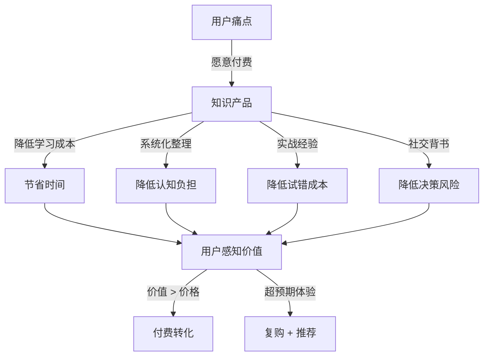
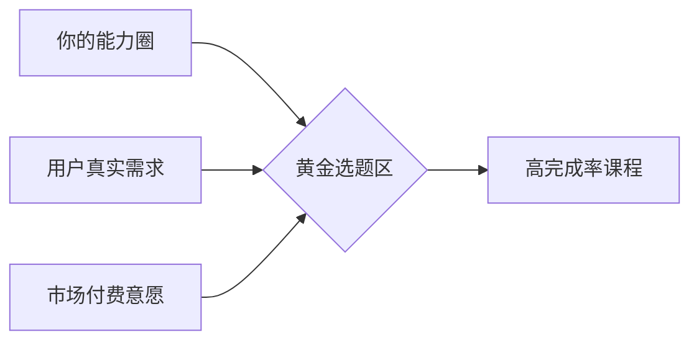
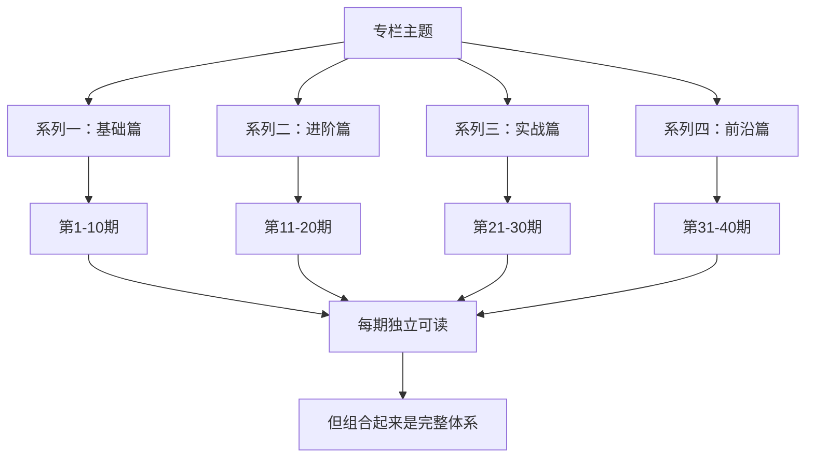
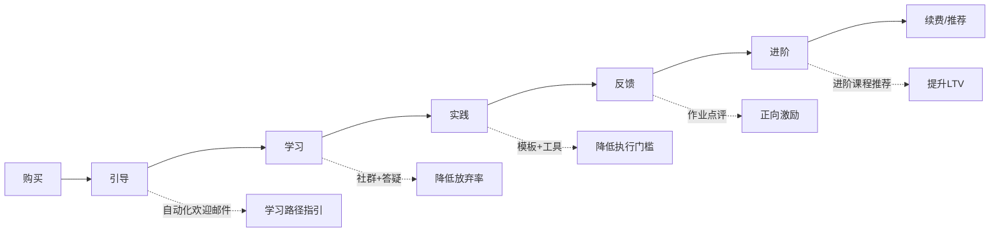
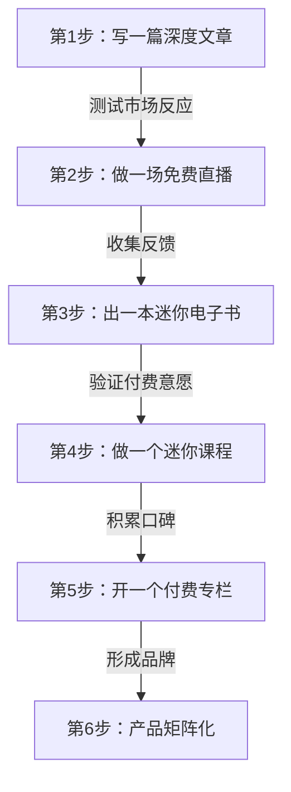

## 四、知识付费产品设计技巧

知识付费的本质是**将隐性知识转化为可交付、可复制、可感知价值的产品**。一个优秀的知识付费产品，不仅要内容过硬，还要在产品形态、用户体验、定价策略、交付方式等维度做到系统设计。本节从在线课程、电子书、付费专栏三大主流形态出发，深入讲解产品设计的完整方法论。

### 知识付费产品的底层逻辑

在动手设计之前，先理解知识付费产品的核心驱动力：



用户为知识付费的四个底层动机：

| 动机 | 本质 | 对应产品设计 |
|------|------|-------------|
| 省时间 | 用钱换时间，避免自己摸索 | 直接给结论、模板、清单 |
| 降焦虑 | 对未知领域的恐惧感 | 系统化框架、路径清晰 |
| 要结果 | 想要具体的成果或改变 | 实操步骤、案例拆解、作业反馈 |
| 社交需求 | 圈子认同、身份标签 | 社群、认证、排行榜 |

理解这些动机后，产品设计才有方向——你的课程/电子书/专栏，到底在解决用户的哪个核心动机？

### 一、在线课程设计方法论

#### 1.1 选题定位：三角验证模型

好的课程选题不是拍脑袋决定的，而是经过**需求-能力-市场**三重验证的结果：



**第一角：能力验证——你是否真的擅长？**

"擅长"不等于"知道"，而是指你在这个领域有**可验证的成果**：
- 你用这个技能赚到了钱（有收入证明）
- 你帮别人解决了这类问题（有客户反馈）
- 你在这个领域有系统化的知识体系（不是碎片化了解）
- 你比目标受众领先至少两个身位（能教人，而非只能交流）

自测方法：如果你无法在5分钟内向一个外行讲清楚这个领域的核心框架，说明你的积累还不够教课。

**第二角：需求验证——用户是否真的需要？**

验证需求的四个具体方法：

1. **搜索数据验证**：在知乎搜索相关问题，看关注人数和回答数；在百度指数查看搜索趋势；在小红书看相关笔记的互动量。关注人数 > 1万的问题说明有真实需求。

2. **竞品销量验证**：在荔枝微课、千聊、小鹅通、知识星球等平台搜索同类课程，查看销量和评价。如果同类课程销量 > 1000份且评分 > 4.0，说明市场已被验证；如果销量 < 100，可能是需求弱或你的切入点不同。

3. **社群调研验证**：在目标用户聚集的社群（微信群、QQ群、豆瓣小组）发起问卷或话题讨论。关键问题不是"你想学什么"（用户会说谎），而是"你最近在学什么？花了多少钱？遇到了什么困难？"（行为数据更真实）。

4. **最小化验证（MVP）**：发布一篇免费的深度文章或一场直播，看阅读量/观看量和评论区的提问质量。如果评论区出现"这个能出个课吗""有更系统的教程吗"，说明需求已被验证。

**第三角：市场验证——用户是否愿意付费？**

有需求不等于愿意付费。验证付费意愿的三个信号：
- 同类付费产品的平均价格在你的预期范围内
- 目标用户群体有明确的消费习惯（如已经在买其他课程）
- 你能提供"免费内容无法获得的价值"（系统性、反馈、社群）

#### 1.2 课程大纲设计：金字塔结构 + 模块化思维

课程大纲是产品的骨架，决定了用户的学习体验和完课率。

**金字塔结构原则：**

```text
课程主题（解决一个核心问题）
├── 模块一：认知层——理解"是什么"和"为什么"
│   ├── 1.1 核心概念定义与边界
│   ├── 1.2 底层原理与机制
│   └── 1.3 行业全景与你的位置
├── 模块二：方法层——掌握"怎么做"
│   ├── 2.1 方法论A：步骤 + 模板
│   ├── 2.2 方法论B：步骤 + 模板
│   └── 2.3 方法论选择指南（何时用A，何时用B）
├── 模块三：实战层——动手做出成果
│   ├── 3.1 完整案例拆解（从0到1）
│   ├── 3.2 实操演示（跟着做）
│   └── 3.3 作业设计与反馈机制
├── 模块四：进阶层——突破瓶颈
│   ├── 4.1 高阶策略与组合技
│   ├── 4.2 常见坑与避坑指南
│   └── 4.3 持续精进路径图
└── 附录：资源包（模板、工具清单、参考书目）
```

**大纲设计的五个关键原则：**

| 原则 | 说明 | 反面案例 |
|------|------|---------|
| 一课一核心 | 每节课只解决一个问题 | 一节课塞了3个不相关知识点 |
| 递进逻辑 | 前一课是后一课的基础 | 跳跃式讲解，学员跟不上 |
| 可感知进度 | 每个模块结束有里程碑成果 | 学了10节课还不知道自己会了什么 |
| 留白设计 | 不追求面面俱到，留出自学空间 | 把所有细节都塞进课程 |
| 可拆可合 | 每节课独立可用，组合更好 | 必须从头学到尾才有价值 |

**模块时长建议：**
- 入门级课程：8-15节课，每节10-15分钟，总时长2-3小时
- 进阶级课程：15-30节课，每节15-25分钟，总时长6-10小时
- 系统级课程：30-60节课，每节15-30分钟，总时长15-25小时

#### 1.3 单节课内容结构：四段式教学法

每节课是用户体验的基本单元。一节课的结构直接决定了学员能否听懂、记住、用上。

**四段式结构详解：**

1. **钩子（1-2分钟）**：用一个问题、一个故事、一个反直觉的事实抓住注意力。例如："你知道为什么90%的人学了Excel还是效率低下吗？因为他们一直在用错误的方式学。"

2. **讲解（8-12分钟）**：核心知识点的讲解。遵循"概念 → 原理 → 示例"的三步法。每个概念都要配一个具体例子，抽象讲解是课程的大忌。

3. **案例/演示（3-5分钟）**：用真实场景展示知识如何应用。最好是屏幕录制或操作演示，让学员看到"原来是这样做的"。

4. **行动卡（1-2分钟）**：总结关键点，并给出一个明确的行动任务。例如："今天学完后，请用这个方法重新审视你最近的一个项目，找出3个可以优化的地方。"

#### 1.4 课程制作的工具链

| 环节 | 推荐工具 | 说明 |
|------|---------|------|
| 录屏 | OBS Studio（免费）、Camtasia | 录制屏幕操作演示 |
| 幻灯片 | Keynote、PowerPoint、Canva | 视觉化讲解素材 |
| 录音 | 罗德NT-USB Mini、铁三角AT2020 | USB麦克风，即插即用 |
| 剪辑 | DaVinci Resolve（免费）、剪映 | 视频后期处理 |
| 字幕 | 剪映自动字幕、Arctime | 自动生成+手动校对 |
| 课程平台 | 小鹅通、知识星球、荔枝微课 | 托管+支付+播放 |
| 交付 | 百度网盘、蓝奏云 | 资料包分发 |

**设备入门配置（预算1000元以内）：**
- 麦克风：铁三角AT2020 USB（约500元）
- 补光灯：环形补光灯（约100元）
- 绿布：1.5m×2m绿幕（约50元）
- 支架：桌面悬臂支架（约80元）

#### 1.5 课程定价策略

定价不是拍脑袋，而是基于成本、价值、竞品、用户心理的综合决策。

**三种定价模型：**

| 模型 | 适用场景 | 定价逻辑 | 示例 |
|------|---------|---------|------|
| 成本加成 | 标准化内容 | 制作成本 × 3-5倍 | 制作成本500元，定价199-299元 |
| 价值定价 | 高转化技能 | 用户获得价值的10%-20% | 教你省1万块，课程定价999元 |
| 竞品对标 | 成熟市场 | 同类课程中位数 ± 30% | 竞品均价299，你定199-399 |

**价格锚定技巧：**
- 设置三个档位（基础版/进阶版/VIP版），引导用户选择中间档
- 先展示原价，再展示优惠价（如"原价999元，限时299元"）
- 提供"分期付款"选项降低心理门槛
- 赠品打包增加感知价值（"买课程送价值199元的模板包"）

#### 1.6 提升完课率的设计技巧

完课率是课程质量的核心指标。行业平均完课率仅10%-15%，优秀课程可达40%-60%。

**提升完课率的七个设计手法：**

1. **渐进式解锁**：后续章节需要完成前一章的作业才能解锁，制造"沉没成本"
2. **进度条可视化**：让学员看到"你已完成67%"，利用完成欲驱动学习
3. **里程碑奖励**：每完成一个模块，赠送额外资源或证书
4. **社群打卡**：建立学习社群，每日打卡形成习惯
5. **直播答疑**：定期直播解答学员问题，增加互动感
6. **作业点评**：对学员作业提供个性化反馈
7. **结业仪式**：颁发结业证书，提供就业/变现支持

### 二、电子书创作技巧

电子书是知识付费中**制作成本最低、长尾效应最强**的产品形态。一本好的电子书可以持续销售3-5年，边际成本趋近于零。

#### 2.1 电子书的四种产品形态

| 形态 | 字数 | 制作周期 | 定价区间 | 适用场景 |
|------|------|---------|---------|---------|
| 迷你电子书 | 1-3万字 | 1-2周 | 9.9-29.9元 | 引流品、测试市场 |
| 标准电子书 | 3-8万字 | 2-4周 | 29.9-69.9元 | 主力产品 |
| 完整指南 | 8-15万字 | 1-3个月 | 69.9-199元 | 深度垂直领域 |
| 系列丛书 | 多本组合 | 3-6个月 | 单本99/套299 | 品牌化运营 |

#### 2.2 快速创作流程（30天计划）

**第一阶段：选题与大纲（第1-3天）**

选题的核心标准：解决一个**具体、明确、可验证**的问题。

好选题的特征：
- 标题本身就是答案（如《从零开始学Python数据分析》）
- 能用一句话说清楚"读完你能获得什么"
- 目标读者能对号入座（"如果你是……，这本书就是为你写的"）

坏选题的特征：
- 太宽泛（如《互联网运营大全》）
- 看不出价值（如《关于创业的一些思考》）
- 和已有经典书正面竞争（如《经济学原理》）

大纲设计的"问题驱动法"：先列出目标读者会问的20个问题，然后将这些问题归类、排序、补全，形成章节结构。

**第二阶段：初稿写作（第4-21天）**

每天写作目标：2000-3000字，约2-3小时。

写作效率提升技巧：
- 使用"番茄工作法"：25分钟写作 + 5分钟休息
- 先写你最熟悉的章节，建立信心
- 不要在初稿阶段追求完美，先把内容写出来
- 使用语音输入工具（如讯飞语记）将口述转文字
- 每章写完后用一句话总结核心观点，检查是否清晰

每章的标准结构：
1. **开篇问题**：这章解决什么问题？（100字）
2. **核心概念**：需要理解哪些基础知识？（500-1000字）
3. **方法步骤**：具体怎么做？（1000-2000字）
4. **案例演示**：真实场景中如何应用？（500-1000字）
5. **常见误区**：新手容易犯什么错？（300-500字）
6. **本章小结**：关键要点回顾（200字）

**第三阶段：修改润色（第22-26天）**

修改的三个层次：
- **结构层**：检查章节逻辑是否通顺，是否有遗漏或重复
- **内容层**：检查论据是否充分，案例是否准确，数据是否有出处
- **文字层**：删掉废话、修正错别字、统一术语

自我审查清单：
- 每个论点是否有至少一个案例支撑？
- 是否有"等""诸如此类"的省略？（应该列出具体内容）
- 读者读完这一章，能否立刻动手做某件事？
- 有没有前后矛盾的地方？

**第四阶段：排版与设计（第27-28天）**

| 工具 | 适用格式 | 特点 |
|------|---------|------|
| Sigil | EPUB | 免费开源，所见即所得 |
| Vellum | EPUB/MOBI/PDF | Mac专属，排版精美 |
| Calibre | 多格式转换 | 免费，格式转换神器 |
| Canva | 封面设计 | 模板丰富，零设计基础可用 |
| Pandoc | Markdown→EPUB | 命令行工具，程序员友好 |

封面设计的三个原则：
- 标题字号要大，在手机屏幕上能清晰阅读
- 配色不超过3种，风格与内容调性一致
- 副标题说清"读完你能获得什么"（如"从月薪5千到年入50万的实战路径"）

**第五阶段：上架与推广（第29-30天）**

| 平台 | 抽成比例 | 适合类型 | 审核周期 |
|------|---------|---------|---------|
| 豆瓣阅读 | 30% | 文学/社科/生活 | 3-7天 |
| 微信读书 | 50% | 全品类 | 7-14天 |
| Kindle（KDP） | 35%-70% | 全品类 | 24-48小时 |
| 多看阅读 | 30%-50% | 技术/商业 | 5-10天 |
| 小鹅通自售 | 0%（自有平台） | 自有流量 | 即时 |
| Gumroad | 5%-10% | 英文市场 | 即时 |

#### 2.3 电子书的质量红线

电子书不同于博客文章，读者付费后期望更高的质量标准：

- **数据必须有出处**：引用统计数据时标注来源（如"据艾瑞咨询2024年报告"）
- **案例必须可验证**：用真实公司/产品/事件，而非虚构的"小王""某公司"
- **方法必须可执行**：每个方法都要有明确的步骤，而非"建议你多思考"
- **排版必须专业**：统一字号、段间距、标题样式，不能有明显排版错误
- **校对必须严格**：错别字率 < 万分之三（一本5万字的书，错别字不超过15个）

### 三、付费专栏运营策略

付费专栏是知识付费的**高级形态**——它不是一次性交付，而是持续的内容服务。运营难度最高，但用户粘性和长期收入也最强。

#### 3.1 专栏的产品定位

付费专栏有三种典型定位：

| 定位 | 特征 | 更新频率 | 定价模式 | 案例 |
|------|------|---------|---------|------|
| 知识体系型 | 系统化课程，按章节更新 | 每周1-2篇 | 年费制 | "Python全栈工程师" |
| 行业洞察型 | 持续跟踪行业动态与分析 | 每周3-5篇 | 月费/年费 | "AI行业周报" |
| 实战案例型 | 每篇拆解一个真实案例 | 每周1篇 | 按篇/年费 | "创业公司案例库" |

选择哪种定位取决于你的内容产出能力和目标读者的需求节奏。

#### 3.2 专栏设计的四个核心要素

**要素一：内容结构设计**

专栏的内容不能是随机的，需要有清晰的结构框架：



关键原则：每篇文章独立可读（新用户随时加入），但组合起来形成完整体系（老用户持续跟随）。

**要素二：更新节奏设计**

更新频率决定了用户期望和你的产出压力：

| 频率 | 优势 | 劣势 | 适合人群 |
|------|------|------|---------|
| 日更 | 高频触达，养成习惯 | 产出压力大，质量易下滑 | 全职创作者 |
| 周更3篇 | 平衡质量和频率 | 需要稳定的内容规划 | 副业创作者 |
| 周更1篇 | 深度内容，质量可控 | 用户粘性较弱 | 深度内容创作者 |
| 双周更 | 压力最小 | 用户容易遗忘 | 兼职创作者 |

建议：初期选择周更2-3篇的节奏，稳定运行3个月后再考虑调整。

**要素三：定价与收费模式**

| 模式 | 优势 | 劣势 | 定价参考 |
|------|------|------|---------|
| 年费制 | 现金流稳定，用户承诺感强 | 新用户入门门槛高 | 199-999元/年 |
| 月费制 | 入门门槛低，灵活 | 流失率高，现金流不稳定 | 29-99元/月 |
| 单篇付费 | 零门槛进入 | 收入不可预测 | 1-9.9元/篇 |
| 免费+增值 | 用户基数大 | 转化率低 | 基础免费/VIP 99-299元 |

**要素四：用户分层运营**

不同阶段的用户需要不同的运营策略：

| 用户类型 | 特征 | 运营重点 | 关键动作 |
|---------|------|---------|---------|
| 新用户 | 刚订阅，犹豫期 | 快速展示价值 | 推送"最受欢迎"系列前三篇 |
| 活跃用户 | 定期阅读 | 深度互动 | 邀请参与讨论、提问 |
| 沉默用户 | 订阅后不看 | 唤醒触达 | 推送精选内容、限时活动 |
| 续费用户 | 到期前1个月 | 提前锁定 | 续费优惠、专属福利 |
| 流失用户 | 未续费 | 挽回尝试 | 推送新系列预告、回归折扣 |

#### 3.3 专栏运营的实操清单

**日常运营（每天30分钟）：**
- 回复读者评论和提问（15分钟）
- 浏览行业动态，收集选题素材（10分钟）
- 检查数据指标：阅读量、打开率、新增订阅（5分钟）

**每周运营（每周2小时）：**
- 发布计划中的内容（写作时间另计）
- 分析本周数据：哪篇阅读量最高？为什么？
- 在社交媒体分享专栏内容片段，吸引新用户
- 整理读者高频问题，纳入选题库

**每月运营（每月半天）：**
- 月度数据复盘：新增订阅、续费率、收入趋势
- 下月内容规划：确定选题、分配写作时间
- 读者满意度调研（问卷或评论区互动）
- 竞品分析：其他同类专栏在做什么？

#### 3.4 专栏的变现进阶策略

当专栏积累了一定用户基础后，可以拓展多种变现方式：

1. **分层订阅**：基础版（文章阅读）、进阶版（文章+问答）、VIP版（文章+问答+1对1咨询），逐级提价。

2. **企业团购**：向企业HR/培训部门推销团购价，一个企业客户 = 几十个个人用户。

3. **内容复用**：将专栏内容整理成电子书或课程，二次变现。专栏是"内容试验田"——验证过的高赞内容可以打包成独立产品。

4. **线下活动**：专栏读者见面会、私享沙龙、线下工作坊。线下活动不仅创造收入，还能大幅增强用户粘性。

5. **品牌合作**：当专栏影响力达到一定规模（如1万+付费订阅），可以接品牌赞助或软文合作。

### 四、知识付费产品的通用设计原则

无论你选择哪种产品形态，以下原则都适用：

#### 4.1 价值感知设计

用户购买前无法"试用"知识产品，因此需要通过以下方式建立价值感知：

- **试读/试看机制**：提供前1-2节免费内容，让用户感受质量
- **目录全展示**：完整的目录让用户看到内容的系统性和全面性
- **学员评价**：真实用户的好评是最强的转化推动力
- **成果展示**：展示学员学习后的成果（如涨薪、接单、出书）
- **讲师背书**：从业经历、行业成就、媒体报道等信任状

#### 4.2 交付体验设计

知识付费的交付不仅是"给内容"，还包括整个体验流程：



#### 4.3 常见误区与纠正

| 误区 | 问题 | 纠正方法 |
|------|------|---------|
| 内容贪多求全 | 什么都想讲，结果什么都不深入 | 聚焦核心问题，其他内容放在"推荐资源"中 |
| 只卖内容不卖结果 | 用户买的不是知识，是改变 | 用"学完你能做到XXX"替代"本课程涵盖XXX" |
| 一次做完不迭代 | 课程上线后不再更新 | 每季度根据用户反馈迭代一次 |
| 定价过低 | 低价吸引低质量用户，也降低感知价值 | 参考竞品定价，宁可打折不要定低价 |
| 忽视售后 | 用户买了就不管了 | 建立学习社群，提供答疑服务 |
| 照搬别人的内容 | 缺乏个人经验和独特视角 | 用你的真实案例和踩坑经历增加差异化 |

### 五、从零到一的行动路径

如果你是第一次做知识付费产品，推荐以下路径：



**每一步的目标：**

| 步骤 | 产品 | 投入 | 目标 | 时间 |
|------|------|------|------|------|
| 1 | 深度文章 | 1天 | 验证选题方向 | 第1周 |
| 2 | 免费直播 | 半天准备 | 收集用户真实反馈 | 第2周 |
| 3 | 迷你电子书 | 1-2周 | 验证付费意愿，赚到第一笔钱 | 第3-4周 |
| 4 | 迷你课程 | 2-4周 | 建立课程制作能力 | 第5-8周 |
| 5 | 付费专栏 | 持续投入 | 建立长期收入来源 | 第9周起 |
| 6 | 产品矩阵 | 持续投入 | 多产品互相引流 | 第6个月起 |

关键心态：**不要追求完美，先完成再完善。** 你的第一个产品一定会有很多不足，但它的价值在于让你走完整个流程，获得真实的市场反馈。这些反馈比任何理论都宝贵。
