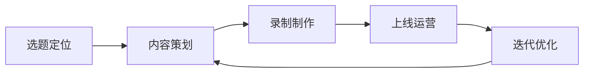

## 五、课程制作全流程

在线课程是知识产权变现的核心载体之一。与电子书、付费专栏相比，课程具有单价高（通常 99-999 元）、完课率可控、用户粘性强的特点。但课程制作也是一个系统工程——从选题定位到最终上线，涉及内容策划、录制制作、平台运营等多个环节。本节将完整拆解课程制作的每一个步骤，帮助你从零开始制作出一门高质量的在线课程。

### 1. 课程制作的整体框架

课程制作可以分为五个阶段，每个阶段都有明确的交付物和质量标准：



| 阶段 | 核心任务 | 交付物 | 参考周期 |
|------|----------|--------|----------|
| 选题定位 | 验证市场需求，确定课程方向 | 选题报告 | 3-5 天 |
| 内容策划 | 设计大纲、编写脚本、准备素材 | 完整大纲 + 脚本 | 1-2 周 |
| 录制制作 | 录制视频、后期剪辑、字幕制作 | 成品视频 | 2-4 周 |
| 上线运营 | 选择平台、定价推广、社群运营 | 课程上线 | 1 周 |
| 迭代优化 | 收集反馈、更新内容、扩展课程 | 优化版本 | 持续进行 |

### 2. 第一阶段：选题定位

选题决定了课程的天花板。一个好选题需要同时满足三个条件：你擅长、有需求、可付费。

#### 2.1 自我能力盘点

在选题之前，先盘点自己的知识资产：

- **专业技能：** 你在哪些领域有系统性的知识积累？（不是"了解一点"，而是能教会别人）
- **实战经验：** 你做过哪些项目、解决过哪些问题？实战经验是课程差异化的核心
- **表达能力：** 你能否将复杂概念用通俗语言解释清楚？
- **独特视角：** 你的经历是否能提供别人没有的见解？

用一张表来评估你的候选选题：

| 评估维度 | 权重 | 选题 A 评分 | 选题 B 评分 | 选题 C 评分 |
|----------|------|-------------|-------------|-------------|
| 专业深度 | 30% | 1-10 | 1-10 | 1-10 |
| 市场需求 | 25% | 1-10 | 1-10 | 1-10 |
| 付费意愿 | 20% | 1-10 | 1-10 | 1-10 |
| 竞争程度 | 15% | 1-10 | 1-10 | 1-10 |
| 内容可持续性 | 10% | 1-10 | 1-10 | 1-10 |

竞争程度评分越高表示竞争越小（蓝海），内容可持续性指能否持续产出新课程。

#### 2.2 市场需求验证

不要凭感觉判断市场，用数据说话：

**方法一：搜索量验证**

在百度指数、微信指数、知乎搜索中输入你的课程关键词，观察搜索趋势。搜索量稳定或上升说明需求持续存在。

**方法二：竞品分析**

在知识星球、得到、极客时间、慕课网等平台搜索同类课程，记录以下数据：

- 课程数量（供给是否饱和）
- 价格区间（市场接受度）
- 销量和评价数（真实需求量）
- 差评内容（市场痛点，你的机会）

**方法三：社群验证**

在相关社群（微信群、QQ群、论坛）发布免费内容或问卷，直接获取目标用户反馈。关键问题包括：

- "你最想学哪个方面的知识？"
- "你愿意为一门XX课程付费吗？多少钱合适？"
- "你之前学过类似课程吗？哪里不满意？"

**方法四：最小可行性测试（MVP）**

先做一次免费直播或写一篇深度文章，观察互动数据。如果免费内容的反响热烈，付费课程大概率也能成功。

#### 2.3 课程定位矩阵

根据目标用户和课程深度，课程可以分为四类：

| | 入门用户 | 进阶用户 |
|---|---|---|
| **通用技能** | 通识普及课（低单价、大流量） | 技能提升课（中单价、中流量） |
| **专业技能** | 行业入门课（中单价、小流量） | 专家深造课（高单价、精准流量） |

不同类型课程的运营策略完全不同：

- **通识普及课：** 靠流量取胜，定价 99-199 元，需要大量推广
- **技能提升课：** 靠口碑传播，定价 199-499 元，需要案例和实操
- **行业入门课：** 靠精准获客，定价 299-599 元，需要行业背书
- **专家深造课：** 靠个人品牌，定价 499-1999 元，需要权威性

### 3. 第二阶段：内容策划

内容策划是课程质量的核心环节。大纲设计得好，后续录制和运营都会顺畅很多。

#### 3.1 课程大纲设计

大纲设计遵循"金字塔结构"：课程主题→模块→章节→知识点。

```text
课程主题：Python数据分析实战
├── 模块一：环境搭建与基础（2小时）
│   ├── 1.1 Python环境安装与配置（15分钟）
│   ├── 1.2 Jupyter Notebook使用指南（20分钟）
│   ├── 1.3 NumPy基础：数组与运算（30分钟）
│   ├── 1.4 Pandas基础：DataFrame操作（35分钟）
│   └── 1.5 模块实战：第一个数据分析项目（20分钟）
├── 模块二：数据清洗与预处理（3小时）
│   ├── 2.1 缺失值处理策略（25分钟）
│   ├── 2.2 异常值检测与处理（25分钟）
│   ├── 2.3 数据类型转换（20分钟）
│   ├── 2.4 数据合并与重塑（30分钟）
│   └── 2.5 模块实战：电商数据清洗（40分钟）
├── 模块三：数据可视化（2.5小时）
│   ├── 3.1 Matplotlib基础绑图（30分钟）
│   ├── 3.2 Seaborn高级可视化（30分钟）
│   ├── 3.3 交互式图表：Plotly（25分钟）
│   └── 3.4 模块实战：数据报告制作（45分钟）
└── 模块四：综合项目实战（3小时）
    ├── 4.1 项目需求分析（20分钟）
    ├── 4.2 数据采集与清洗（40分钟）
    ├── 4.3 探索性分析（40分钟）
    ├── 4.4 可视化与报告（40分钟）
    └── 4.5 项目总结与扩展（20分钟）
```

大纲设计的核心原则：

**原则一：每个模块解决一个核心问题**

不要把不相关的知识塞进同一个模块。每个模块结束时，学员应该能完成一个具体的任务。

**原则二：由浅入深，循序渐进**

第一模块必须是零基础可入门的，后续模块逐步加深。如果学员在第三模块就遇到理解障碍，说明第二模块的知识铺垫不够。

**原则三：每节课聚焦一个知识点**

一节课只讲一个核心概念或技能。如果一节课讲了三个知识点，学员可能一个都记不住。

**原则四：理论与实践交替**

纯理论课会让学员犯困，纯实操课会让学员知其然不知其所以然。最佳比例是理论 40%、实操 60%。

#### 3.2 单节课脚本编写

每节课的脚本结构如下：

```text
【开场白】（30秒-1分钟）
- 这节课要讲什么
- 学完这节课你能做什么
- 为什么这个知识点重要

【知识讲解】（5-8分钟）
- 概念定义
- 原理机制
- 与其他概念的关系

【案例演示】（3-5分钟）
- 真实场景
- 操作步骤
- 注意事项

【练习引导】（1-2分钟）
- 布置练习任务
- 提示关键步骤
- 预告下节课内容
```

脚本编写的注意事项：

- **口语化表达：** 脚本是用来"说"的，不是用来"读"的。避免书面语，用日常对话的语气
- **重复关键信息：** 重要的概念至少在三个地方出现——开头预告、中间讲解、结尾总结
- **设置悬念：** 在模块之间留一个"未解决的问题"，让学员有动力继续学下去
- **控制节奏：** 每 5-8 分钟切换一次讲解方式（概念→案例→互动→总结），避免学员注意力下降

#### 3.3 素材准备清单

在开始录制之前，准备好以下素材：

| 素材类型 | 具体内容 | 准备方式 |
|----------|----------|----------|
| 课件 | PPT/Keynote/Google Slides | 自己设计或使用模板 |
| 代码 | 示例代码、数据集 | 提前写好并测试通过 |
| 案例 | 真实业务场景、数据 | 脱敏处理后的实际数据 |
| 练习 | 课后作业、参考答案 | 分难度等级设计 |
| 参考资料 | 延伸阅读、官方文档链接 | 整理成文档 |
| 封面图 | 课程封面、模块封面 | 设计工具制作 |

### 4. 第三阶段：录制制作

录制质量直接影响学员的学习体验和课程的付费转化率。

#### 4.1 设备选择

不需要一开始就买昂贵的设备，但有几个基本要求：

**音频设备（最重要）：**

| 设备等级 | 推荐方案 | 预算 | 适用场景 |
|----------|----------|------|----------|
| 入门 | 领夹麦克风（如 Boya BY-M1） | 50-100 元 | 屏幕录制 + 语音讲解 |
| 进阶 | USB 电容麦克风（如 Blue Yeti） | 500-800 元 | 真人出镜 + 语音讲解 |
| 专业 | 专业声卡 + 电容麦 + 防喷罩 | 2000-5000 元 | 高品质录制 |

音频质量比视频质量更重要。学员可以忍受 720p 的画面，但无法忍受嘈杂的音频。

**视频设备：**

- **屏幕录制：** OBS Studio（免费）、Camtasia（付费）、ScreenFlow（Mac）
- **真人出镜：** 手机或相机 + 三脚架 + 补光灯
- **绿幕抠图：** 绿幕布 + OBS 抠图插件

**录制环境：**

- 安静的房间，关闭空调、风扇等噪音源
- 墙面不要太白（反光），也不要太暗（压抑）
- 自然光从正面打过来，避免逆光
- 如果环境噪音无法消除，考虑使用降噪软件（如 Krisp、RTX Voice）

#### 4.2 屏幕录制技巧

屏幕录制是最常见的课程形式，尤其适合技术类课程。

**录制前准备：**

- 关闭所有通知（系统通知、微信、邮件）
- 清理桌面，只保留必要的软件窗口
- 调整分辨率：1920×1080 是标准，不要用 4K（文件太大，学员显示器不一定支持）
- 调整字体大小：代码编辑器字体 16-18pt，终端字体 14-16pt
- 准备好所有代码和数据文件，提前测试一遍

**录制中的注意事项：**

- 鼠标移动要慢，给学员反应时间
- 关键操作前暂停 1-2 秒，说"现在我们要做的是..."
- 出错时不要慌张，可以当作教学机会："注意，这里容易出错，正确做法是..."
- 每录完一段就检查一下音频和画面，避免全部录完才发现问题

**常用快捷键（以 OBS 为例）：**

```text
开始/停止录制：F9（可自定义）
暂停/恢复录制：F10
切换场景：F1-F8
```

#### 4.3 真人出镜技巧

真人出镜能增加课程的亲和力和信任感，但对表达能力要求更高。

**出镜形式：**

- **全屏讲解：** 适合纯理论内容，需要好的背景和灯光
- **画中画：** 屏幕录制 + 小窗口出镜，适合技术演示
- **切换式：** 理论部分出镜，实操部分切屏幕，适合混合内容

**出镜表达技巧：**

- 看镜头，不要看屏幕（看镜头 = 看学员的眼睛）
- 语速适中，每分钟 180-220 字（中文）
- 适当使用手势，但不要过度
- 表情自然，偶尔微笑
- 穿纯色衣服，避免条纹和花纹（影响视频压缩质量）

**常见问题处理：**

- 忘词了：停顿一下，看一眼提词器，继续说。不要反复录同一段
- 口误了：停顿 2 秒，从正确的那句话重新说。后期剪掉口误部分
- 环境噪音：暂停录制，等噪音过去再继续

#### 4.4 后期制作流程

后期制作不是"美化"，而是"优化"。核心目标是让内容更清晰、更易理解。

**剪辑要点：**

- 删除口误、长停顿、重复内容
- 在关键知识点处添加字幕和标注
- 适当的转场效果（不要花哨，简单切换即可）
- 片头片尾统一风格（5-10 秒即可，不要太长）

**字幕制作：**

字幕不是可选项，而是必选项。很多学员在通勤、午休等场景下学习，需要字幕。

- 使用自动字幕工具（剪映、ArcTime、YouTube 自动字幕）
- 自动字幕的准确率约 85-90%，必须人工校对
- 字幕样式：白色字体 + 黑色描边，字号 22-26pt
- 每行不超过 15 个字，每屏不超过 2 行

**导出设置：**

| 参数 | 推荐值 | 说明 |
|------|--------|------|
| 分辨率 | 1920×1080 | 标准高清 |
| 帧率 | 30fps | 足够流畅 |
| 编码 | H.264 | 兼容性最好 |
| 码率 | 4-8 Mbps | 平衡质量和文件大小 |
| 音频 | AAC, 128kbps | 标准音质 |
| 格式 | MP4 | 通用格式 |

### 5. 第四阶段：上线运营

课程制作完成只是开始，运营决定了课程能否真正变现。

#### 5.1 平台选择策略

不同平台的特点和适用场景：

| 平台 | 抽成比例 | 流量来源 | 适合谁 | 特点 |
|------|----------|----------|--------|------|
| 知识星球 | 5% | 自带流量 | 有粉丝基础的创作者 | 社群 + 课程结合 |
| 极客时间 | 30-50% | 平台推荐 | 技术类讲师 | 平台审核严格 |
| 荔枝微课 | 10% | 社交传播 | 语音类课程 | 微信生态内传播 |
| 小鹅通 | 年费制 | 自己引流 | 有私域流量的讲师 | 工具型平台，自由度高 |
| 腾讯课堂 | 10-30% | 平台推荐 | 大众类课程 | 流量大，竞争也大 |
| B站课堂 | 10% | B站流量 | 视频创作者 | 与B站内容联动 |

选择平台的核心原则：如果你有私域流量（公众号、社群、朋友圈），选工具型平台（小鹅通、知识星球）；如果你没有流量，选有平台推荐的平台（极客时间、腾讯课堂）。

#### 5.2 定价策略

课程定价不是拍脑袋决定的，需要考虑多个因素：

**定价公式：**

```text
课程价格 = 基础价格 × 难度系数 × 时长系数 × 品牌溢价

基础价格：99 元（入门级）/ 199 元（进阶级）/ 399 元（专业级）
难度系数：1.0（基础）/ 1.5（进阶）/ 2.0（高级）
时长系数：1.0（5小时以内）/ 1.3（5-10小时）/ 1.5（10小时以上）
品牌溢价：1.0（新手）/ 1.3（小有名气）/ 1.5-2.0（行业专家）
```

**价格锚定技巧：**

- 提供三个价格档位（基础版/标准版/VIP版），让中间档位显得"性价比最高"
- 原价标注为正式价格的 2-3 倍，限时优惠价作为正式价格
- 早鸟价比正式价格低 30-50%，制造紧迫感

**免费 vs 付费内容的切割：**

- 免费内容：课程介绍、1-2 节试听课、课程大纲
- 付费内容：完整课程、作业批改、社群答疑、直播互动

#### 5.3 课程推广

推广是课程变现的关键环节。没有流量，再好的课程也卖不出去。

**推广渠道矩阵：**

| 渠道 | 成本 | 效果 | 适合阶段 |
|------|------|------|----------|
| 朋友圈/微信群 | 免费 | 中等 | 冷启动期 |
| 公众号文章 | 免费 | 中高 | 有粉丝基础 |
| 知乎回答 | 免费 | 中等 | 长尾流量 |
| B站视频 | 免费 | 高 | 视频创作者 |
| 小红书笔记 | 免费 | 中等 | 职场/生活类 |
| 付费投放 | 高 | 高 | 有预算的成熟课程 |
| KOL 合作 | 中 | 高 | 扩大影响力 |

**冷启动策略（第一批学员从哪来）：**

1. 在朋友圈发布课程预告，附带早鸟优惠
2. 在相关社群免费分享部分内容，引导关注课程
3. 写一篇高质量的文章（知乎/公众号），文末引导购买
4. 做一次免费直播，直播中推荐付费课程
5. 邀请 10-20 个朋友免费体验，换取真实评价和口碑传播

**转化率优化：**

课程详情页是转化的关键。一个高转化率的详情页包括：

- **痛点标题：** 直接说出目标用户的痛点（"学了100小时还没入门？"）
- **课程亮点：** 3-5 个核心卖点，用数字量化（"50+实战案例"、"10小时从入门到实战"）
- **讲师介绍：** 突出专业背景和成果，不是简历罗列
- **学员评价：** 真实的学习反馈，最好有具体成果
- **课程大纲：** 让用户看到课程的完整结构
- **限时优惠：** 制造紧迫感，促进决策

#### 5.4 社群运营

课程只是起点，社群才是长期价值。好的社群运营能带来复购、口碑传播和持续收入。

**社群架构：**

```text
课程社群
├── 学习群：学员交流、互助答疑
├── 打卡群：每日学习打卡、进度追踪
├── 作业群：作业提交、互评反馈
└── VIP群：进阶内容、直播答疑、1对1咨询
```

**社群运营节奏：**

| 时间 | 活动 | 目的 |
|------|------|------|
| 每日 | 早安分享（一条行业资讯/学习技巧） | 保持活跃度 |
| 每周 | 一次集中答疑（文字或直播） | 解决学习障碍 |
| 每两周 | 一次学员分享（优秀作业/学习心得） | 激励学习氛围 |
| 每月 | 一次直播加餐（新内容/行业动态） | 增加课程价值 |
| 季度 | 课程更新/新课预告 | 持续变现 |

### 6. 第五阶段：迭代优化

课程上线不是终点，而是新循环的起点。

#### 6.1 数据分析

关注以下核心指标：

| 指标 | 计算方式 | 健康值 | 优化方向 |
|------|----------|--------|----------|
| 完课率 | 完成全部课程的学员数 / 购买学员数 | >30% | 优化课程节奏和难度 |
| 单节完成率 | 完成某节课的学员数 / 开始该节课的学员数 | >70% | 优化单节课内容 |
| 退款率 | 退款数 / 购买数 | <5% | 优化课程质量和期望管理 |
| 复购率 | 购买新课的老学员数 / 总学员数 | >20% | 优化课程体系和社群 |
| NPS | 推荐者比例 - 批评者比例 | >50 | 优化整体体验 |

#### 6.2 内容更新策略

课程内容需要定期更新，保持时效性和竞争力：

- **小更新（每月）：** 修正错误、补充说明、更新截图
- **中更新（每季度）：** 新增案例、补充新工具/新方法
- **大更新（每年）：** 重构章节、新增模块、配合行业趋势

更新后主动通知老学员："课程已更新第X章，新增了XXX内容，欢迎回来学习。"这既能提升完课率，也能带来口碑传播。

#### 6.3 课程体系扩展

一门成功的课程可以衍生出多个产品：

```text
入门课程（99元）
    └── 进阶课程（299元）
        └── 实战训练营（999元）
            └── 1对1咨询（按小时收费）
                └── 企业内训（按天收费）
```

这种"漏斗模型"让用户从低门槛进入，逐步深入，终身价值不断增长。

### 7. 常见误区与避坑指南

#### 误区一：追求完美再上线

很多创作者花几个月打磨课程，结果上线后发现市场不需要。正确做法是先做 MVP（最小可行性课程），3-5 节核心内容，快速上线测试市场反应，再根据反馈迭代完善。

#### 误区二：内容贪多求全

把所有知道的知识都塞进课程，导致课程又长又杂。学员要的不是"全面"，而是"有用"。一门 5 小时的精品课，远比一门 50 小时的流水账有价值。

#### 误区三：忽视音频质量

花了大量时间做漂亮的 PPT，却用笔记本自带麦克风录音。音频是学员感知最强烈的元素，差的音频会直接导致退款。

#### 误区四：不做市场调研就开始录制

凭感觉选题，录了 20 节课才发现同类课程已经饱和，或者目标用户根本不愿意付费。先验证，再投入。

#### 误区五：上线后不运营

"录完就等着收钱"是最大的误区。课程运营占整个课程生命周期工作量的 50% 以上。没有运营，再好的课程也会被淹没在海量内容中。

#### 误区六：定价过低

新手常犯的错误是定一个很低的价格（比如 9.9 元），认为低价能吸引更多学员。实际上，低价会带来两个问题：一是低质量学员（买了不学），二是无法覆盖运营成本。合理定价是对课程价值的尊重。

### 8. 工具推荐

| 环节 | 推荐工具 | 价格 | 说明 |
|------|----------|------|------|
| 大纲设计 | XMind、幕布 | 免费/付费 | 思维导图和大纲工具 |
| 脚本编写 | Notion、飞书文档 | 免费 | 协作文档，支持模板 |
| 屏幕录制 | OBS Studio | 免费 | 开源，功能强大 |
| 视频剪辑 | 剪映、DaVinci Resolve | 免费 | 剪映适合新手，DaVinci 适合进阶 |
| 字幕制作 | 剪映、ArcTime | 免费 | 自动识别 + 手动校对 |
| 课件设计 | Canva、Gamma | 免费/付费 | 模板丰富，设计感强 |
| 课程平台 | 小鹅通、知识星球 | 年费制 | 自主运营，自由度高 |
| 社群运营 | 企业微信、微信群 | 免费 | 日常社群管理 |
| 数据分析 | 平台后台 + Excel | 免费 | 追踪核心指标 |

### 9. 实操检查清单

在课程上线前，用以下清单逐项检查：

**内容检查：**
- [ ] 课程大纲是否完整、逻辑清晰
- [ ] 每节课是否聚焦一个知识点
- [ ] 案例是否真实、有说服力
- [ ] 练习题是否覆盖核心知识点
- [ ] 参考资料和延伸阅读是否齐全

**技术检查：**
- [ ] 音频是否清晰、无杂音
- [ ] 视频画面是否清晰、字幕是否准确
- [ ] 代码示例是否全部测试通过
- [ ] 文件命名是否规范、目录结构是否清晰

**运营检查：**
- [ ] 课程详情页是否完整（标题、介绍、大纲、讲师、评价）
- [ ] 定价策略是否合理
- [ ] 试听课程是否足够吸引人
- [ ] 推广渠道是否准备就绪
- [ ] 社群是否建立、运营计划是否制定

### 10. 课程制作全流程时间线

以一门 10 小时的中等规模课程为例：

| 周次 | 任务 | 产出 |
|------|------|------|
| 第 1 周 | 选题定位 + 市场调研 | 选题报告 |
| 第 2 周 | 课程大纲设计 | 完整大纲 |
| 第 3-4 周 | 脚本编写 + 素材准备 | 全部脚本 |
| 第 5-6 周 | 视频录制 | 原始素材 |
| 第 7-8 周 | 后期制作（剪辑+字幕） | 成品视频 |
| 第 9 周 | 平台上架 + 详情页制作 | 课程上线 |
| 第 10 周 | 推广 + 社群运营 | 第一批学员 |

总周期约 2.5 个月。如果时间充裕或经验丰富，可以压缩到 1.5 个月；如果兼职制作，可能需要 4-6 个月。

课程制作是一门"做中学"的手艺。第一门课可能不完美，但只要上线了，你就比 99% 的人领先了一步。从第二门课开始，你会越来越熟练，效率越来越高。关键是开始行动，而不是等到"完全准备好"的那一天——那一天永远不会到来。
