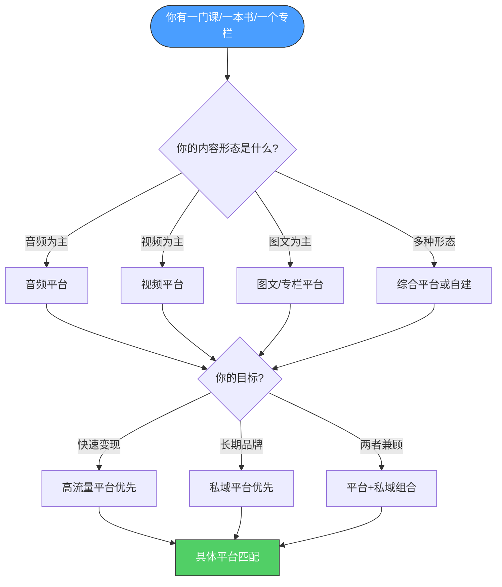
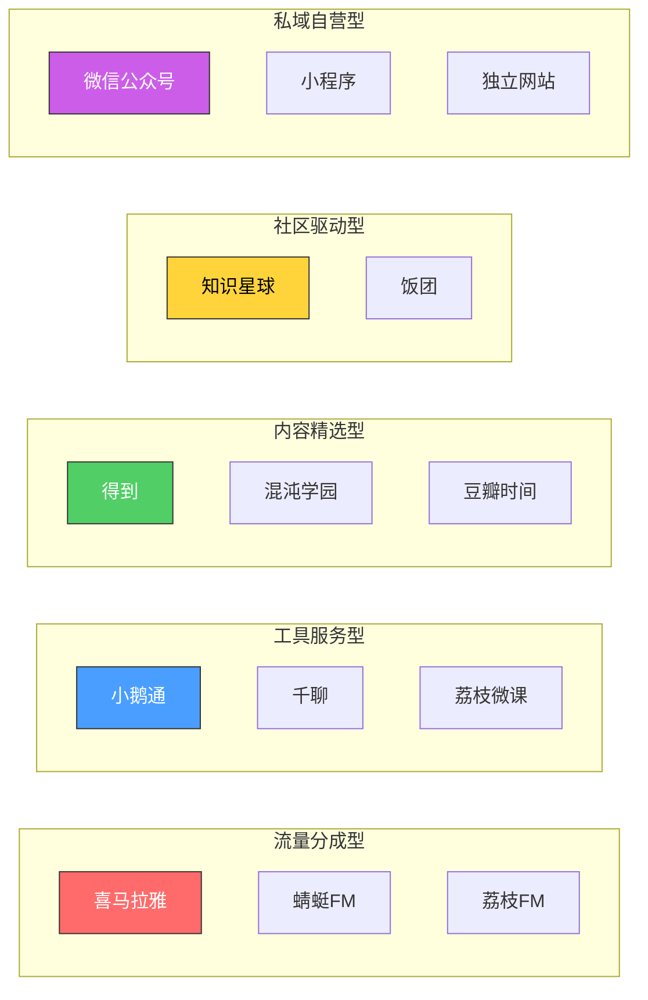
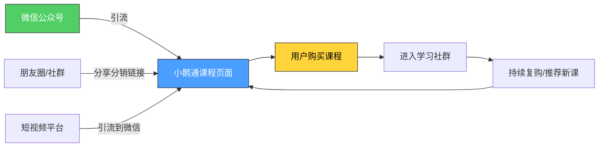
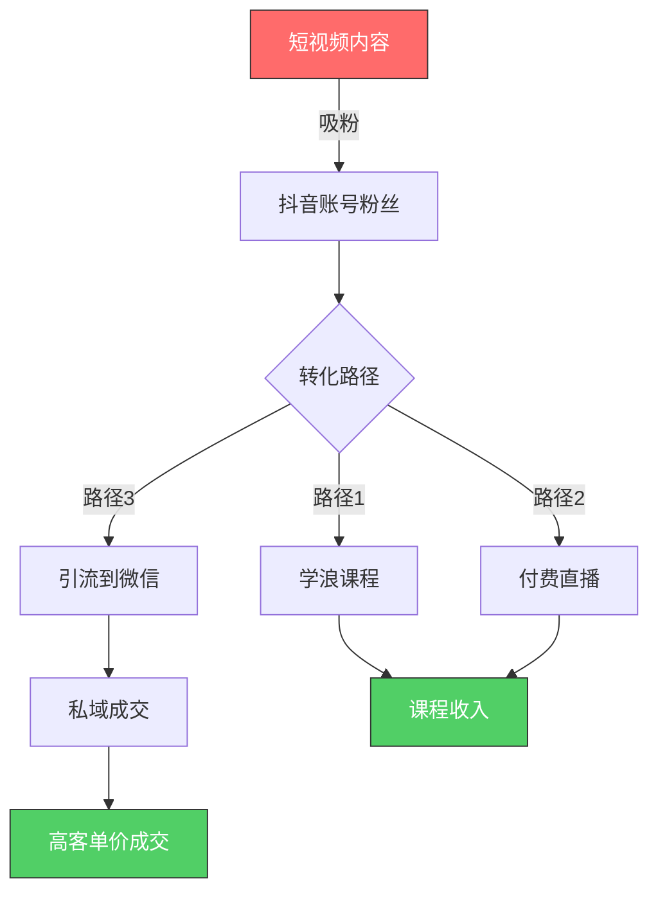
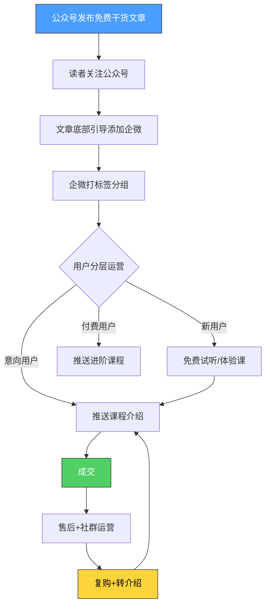
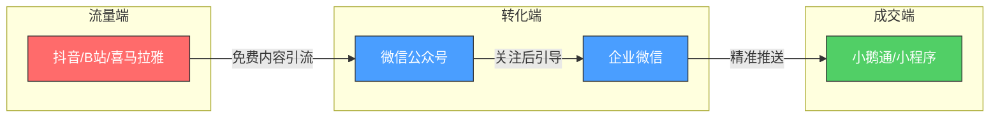
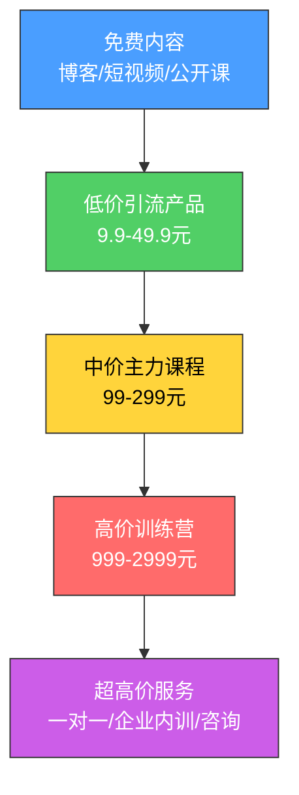

## 六、知识付费平台选择技巧

课程做好了、电子书写完了、付费内容设计完毕——接下来最关键的一步是：**放到哪里卖？**

很多人在这一步犯了致命错误：要么随便选一个"看起来流量大"的平台就上架，结果发现自己的内容和平台用户完全不匹配；要么同时铺十几个平台，精力分散，每个平台都做不好；要么被平台的高分成比例吃掉大部分利润，忙活三个月发现还不如打工。

平台选择不是一个"哪个好"的简单问题，而是一个涉及**内容形态、目标用户、变现模式、运营能力、长期战略**的系统决策。本节将提供一套完整的平台评估框架和实操策略，帮你找到最适合自己的那条路。

### 平台选择的战略意义

为什么平台选择值得专门用一节来讲？因为它直接决定了三件事：

**1. 你的内容能触达谁**

每个平台的用户画像截然不同。得到的用户偏好深度学习、愿意为系统化知识付高价；喜马拉雅的用户习惯碎片化收听，偏好轻松实用的内容；B站的用户年轻、互动性强，但付费意愿需要培养。选错平台，就像在菜市场卖奢侈品——不是东西不好，是场景不对。

**2. 你的收入结构长什么样**

不同平台的分成比例、定价自由度、变现路径差异巨大。有的平台抽成高达50%但提供流量扶持，有的平台零抽成但需要你自己带流量，有的平台支持订阅制，有的只支持单次购买。这些差异直接影响你的收入上限和增长曲线。

**3. 你能积累什么资产**

有些平台帮你积累粉丝（可迁移的私域资产），有些平台只给你流量（不可迁移的平台资产）。在得到上卖课，用户是得到的；在微信生态卖课，用户是你的。这个区别决定了你三年后的处境。



### 知识付费平台全景分类

中国知识付费市场经过近十年发展，已经形成了一个层次分明的平台生态。理解这个生态的全貌，是做出正确选择的前提。

#### 按内容形态分类

| 平台类型 | 代表平台 | 核心内容形态 | 典型用户场景 |
|----------|----------|-------------|-------------|
| 音频平台 | 喜马拉雅、荔枝FM、蜻蜓FM | 音频课程、有声书、播客 | 通勤、做家务、运动时收听 |
| 视频平台 | B站、抖音、快手、腾讯视频号 | 视频课程、直播教学 | 主动学习、碎片化观看 |
| 图文/专栏平台 | 得到、微信读书、豆瓣阅读 | 深度文章、电子书、专栏 | 深度阅读、系统学习 |
| 综合知识平台 | 小鹅通、知识星球、千聊、荔枝微课 | 图文+音频+视频+社群 | 多形态混合学习 |
| 在线教育平台 | 网易云课堂、腾讯课堂、慕课网 | 结构化课程+作业+考试 | 系统性技能学习 |
| 自建工具 | 微信公众号付费、小程序、独立网站 | 自由定义 | 私域深度运营 |

#### 按商业模式分类

知识付费平台的商业模式直接决定了你的收入结构。理解每种模式的运作机制，才能做出匹配自身情况的选择。

**模式一：流量分成型**

平台提供流量，创作者提供内容，收入按比例分成。典型代表是喜马拉雅和蜻蜓FM。优点是起步快、不需要自己有粉丝基础；缺点是平台掌握流量分配权，你的命运不完全在自己手里。

**模式二：工具服务型**

平台提供技术工具（支付、直播、社群、数据分析），创作者自己负责获客和运营。典型代表是小鹅通和千聊。优点是自主性强、分成比例低（通常是SaaS订阅费）；缺点是需要自己带流量，没有平台推荐加持。

**模式三：内容精选型**

平台严格筛选内容创作者，给予品牌背书和流量扶持。典型代表是得到和混沌学园。优点是品牌溢价高、用户付费意愿强；缺点是准入门槛极高，通常需要行业头部地位或专业背书。

**模式四：社区驱动型**

以社群互动为核心，内容和社交深度绑定。典型代表是知识星球。优点是用户粘性极高、续费率高；缺点是运营成本高，需要持续投入时间维护社群。

**模式五：私域自营型**

基于微信生态（公众号、小程序、企业微信）自建付费体系。优点是完全自主、用户数据归你、没有平台抽成；缺点是技术门槛较高，需要自己解决支付、版权保护、用户体验等问题。



### 主流平台深度解析

#### 喜马拉雅

**平台定位：** 中国最大的音频分享平台，月活跃用户超过3亿。从UGC（用户生成内容）起家，逐步向PGC（专业生产内容）和知识付费转型。

**用户画像：** 25-45岁为主，一二线城市白领占比约60%。学习场景以通勤、运动、睡前为主，偏好"听着学"的内容形式。平均单次收听时长约25分钟。

**内容要求：**
- 音频质量是底线：采样率不低于44.1kHz，信噪比>60dB，无明显底噪和爆音
- 课程时长：单集建议15-30分钟，系列课程10-50集为宜
- 内容风格：口语化、故事性强、有代入感。纯理论讲解在音频平台上效果较差
- 需要配套文稿或思维导图，方便用户复习

**变现模式：**
- 付费课程：定价自由，平台抽成约30-50%（根据合作级别不同）
- 付费直播：打赏+门票收入
- 广告分成：免费内容通过播放量获得广告收入（单价较低，约2-5元/千次播放）
- 会员分成：内容被纳入会员库后按播放量分成

**适合的内容类型：** 有声书、语言学习、职场技能、心理学、商业财经、历史人文、亲子教育。音频天然适合叙事型、故事型、陪伴型内容。纯技术类（如编程教学）在音频平台上效果较差，因为缺少视觉辅助。

**入驻门槛：** 低。个人实名认证即可发布内容。付费课程需要提交审核，但标准相对宽松。

**关键数据参考：**
- 头部创作者（粉丝100万+）年收入可达数百万
- 中腰部创作者（粉丝10万+）月收入通常在5000-30000元
- 新人前3个月平均收入在500元以下，需要持续产出和推广

**优劣势分析：**

| 优势 | 劣势 |
|------|------|
| 用户基数大，潜在曝光高 | 平台抽成比例较高（30-50%） |
| 音频制作门槛低 | 音频内容易被盗版和搬运 |
| 支持多种变现方式 | 流量分配算法偏向头部创作者 |
| 用户付费习惯已养成 | 竞争激烈，新人冷启动困难 |

#### 得到

**平台定位：** 知识付费领域的"精品店"，罗振宇创办。定位高端，严格筛选入驻创作者，强调"知识服务"而非简单的"内容售卖"。

**用户画像：** 28-45岁，高学历、高收入群体为主。愿意为高质量、系统化的知识内容支付较高价格（单课99-399元）。学习动机强，完课率在行业内领先。

**内容要求：** 这是得到的核心门槛——内容必须达到"出版级"标准。
- 每门课程需要完整的课程大纲，经过得到编辑团队审核
- 内容必须有体系化结构，不能是碎片化知识的堆砌
- 音频质量要求极高，需要专业录音棚级别的制作
- 通常需要创作者有明确的专业背景和行业影响力
- 课程制作周期长（一门课从立项到上线通常需要3-6个月）

**变现模式：**
- 付费课程：定价99-399元，平台与创作者按约定比例分成（通常创作者拿50-70%）
- 电子书：定价19.9-49.9元
- 听书产品：解读版书籍，定价39.9-99元/年
- 训练营：高客单价（数百至数千元），含社群和作业批改

**适合的内容类型：** 商业管理、经济学、法学、历史、心理学、科技前沿、职业发展。得到用户偏好"有深度、有体系、有洞见"的内容，不接受"水课"。

**入驻门槛：** 极高。通常需要行业专家推荐或得到编辑团队主动邀约。个人主动申请的通过率很低。建议的路径是：先在其他平台建立影响力，积累作品和口碑，再通过行业关系争取得到的邀约。

**关键数据参考：**
- 得到上线课程约400+门，头部课程销量可达数十万份
- 单门课程收入从数十万到数千万不等
- 平台用户数超过5000万，付费用户超过1500万

**优劣势分析：**

| 优势 | 劣势 |
|------|------|
| 品牌溢价极高，用户付费意愿强 | 准入门槛极高，个人很难入驻 |
| 用户质量高，完课率和好评率高 | 制作周期长、成本高 |
| 平台背书带来的信任感 | 平台掌控用户关系，创作者难以沉淀私域 |
| 收入上限高 | 分成比例和定价受平台约束 |

#### 小鹅通

**平台定位：** 知识付费领域的"SaaS工具箱"。不直接提供流量，而是为创作者提供一整套技术基础设施，包括课程管理、直播、社群、分销、数据分析等。

**用户画像：** 使用小鹅通的创作者画像非常多元——从个人讲师到教育机构，从自媒体人到企业内训部门。没有统一的"小鹅通用户画像"，因为用户来自创作者自己的私域。

**核心功能：**
- 课程形式：支持图文、音频、视频、直播、训练营、打卡、考试等多种形式
- 分销系统：支持二级分销，用户可以成为分销员赚取佣金
- 社群功能：学员群、互动问答、作业提交
- 数据分析：详细的学习数据、销售数据、用户行为分析
- 企微集成：与企业微信打通，方便私域运营
- 多终端：H5、小程序、PC端、APP（需付费版本）

**变现模式：** 小鹅通本身不参与创作者的收入分成。采用SaaS订阅制收费：
- 基础版：4800元/年
- 专业版：7999元/年
- 旗舰版：19999元/年
- 至尊版：按需定制

**适合的创作者类型：**
- 已经有一定粉丝基础（公众号、社群、个人IP），需要工具来变现的创作者
- 教育培训机构，需要线上教学管理系统
- 企业内训部门，需要内部知识管理平台
- 任何想在微信生态内做知识付费的人

**关键优势：** 无收入分成——你的每一笔收入都是你的（除了支付通道手续费0.6%）。这意味着随着收入增长，小鹅通的成本占比越来越低。

**关键劣势：** 不提供流量——你需要自己解决获客问题。如果你没有粉丝基础或获客能力，小鹅通给你再好的工具也卖不出去。

**典型使用场景：**



#### 知识星球

**平台定位：** 付费社群工具，前身为"小密圈"。核心逻辑不是"卖课"，而是"卖圈子"——用户付费加入一个持续互动的社群，获得持续更新的内容和直接的交流机会。

**用户画像：** 知识星球的用户群体高度依赖于星主（社群主理人）的领域。总体特征：互联网从业者占比高，愿意为"人脉+信息差+持续交流"付费。

**核心机制：**
- 星主创建星球，设定年费（50-3000元/年不等）
- 用户付费加入，有效期一年，到期续费
- 星主持续发布内容（文章、问答、文件、直播）
- 成员之间可以互动、提问、讨论
- 平台抽成5%（基础）+ 手续费

**适合的内容类型：**
- 行业信息差：每天分享行业动态、内部消息、趋势分析
- 持续问答：用户提问，星主定期回答
- 资源共享：模板、工具、人脉推荐
- 学习社群：共同学习一门技能，互相督促和交流
- 圈子社交：付费筛选出高质量的同频人群

**变现公式：**

```text
年收入 = 星球定价 × 有效成员数 × 续费率

示例：
定价199元/年 × 2000名成员 × 70%续费率 = 约28万元/年
```

**关键成功因素：**
- 持续输出：每周至少更新3-5次，否则成员觉得"不值"
- 互动质量：不能只发内容不回复，要真正参与讨论
- 差异化价值：必须提供"免费渠道获取不到"的信息或资源
- 筛选门槛：适当的定价和准入标准，过滤掉"白嫖"心态的用户

**优劣势分析：**

| 优势 | 劣势 |
|------|------|
| 续费模式带来稳定现金流 | 需要持续高强度内容输出 |
| 平台抽成低（5%） | 内容只在封闭社群内，传播性差 |
| 社群粘性高，用户关系紧密 | 运营成本高（时间+精力） |
| 适合个人品牌变现 | 存在"信息过期"风险，成员可能不续费 |

#### 千聊

**平台定位：** 微信生态内的知识付费工具，主打"轻量级直播+社群"。与小鹅通类似，但更侧重直播和互动功能，价格也更亲民。

**核心特点：**
- 直播功能强大：支持语音直播、视频直播、PPT直播、连麦互动
- 微信原生：在微信内直接使用，无需跳转APP
- 价格较低：基础版年费约2000-4000元
- 分销功能：支持分销裂变

**适合的创作者类型：** 微信生态内的中小创作者，尤其是以直播为主要授课形式的讲师。适合做训练营、答疑课、互动工作坊等需要实时交流的内容。

**与小鹅通的对比：**

| 维度 | 小鹅通 | 千聊 |
|------|--------|------|
| 核心优势 | 功能全面、数据分析强 | 直播功能强、价格低 |
| 适合规模 | 个人到大型机构 | 个人到中型团队 |
| 直播能力 | 基础 | 强（连麦、互动） |
| 价格 | 4800-19999元/年 | 2000-4000元/年 |
| 学习曲线 | 中等 | 较低 |

#### 抖音/快手知识付费

**平台定位：** 短视频平台内的知识付费功能。抖音和快手作为日活数亿的超级平台，近年来大力推动知识付费生态建设，推出了"学浪"（抖音）和"快手课堂"等知识付费产品。

**核心逻辑：** 用短视频和直播获取流量，用课程和训练营完成变现。这是目前流量最大的知识付费渠道，但也是竞争最激烈、运营难度最高的渠道。

**抖音知识付费体系：**
- 学浪平台：抖音官方的课程售卖平台，支持录播课、直播课、训练营
- 付费直播：直播授课，用户付费进入
- 付费社群：类似知识星球的付费圈子功能
- 橱窗带货：挂载自己的课程或电子书

**变现路径：**



**适合的内容类型：**
- 技能教学类：Excel技巧、PS教程、摄影教学、写作方法
- 考证培训类：考研、公考、CPA、法考
- 生活技能类：烹饪、健身、穿搭、护肤
- 职场成长类：面试技巧、沟通方法、管理能力

**关键挑战：**
- 流量不稳定：抖音的算法推荐机制意味着你的视频可能爆一条、沉十条
- 内容要求"短平快"：深度内容在短视频平台上很难获得推荐
- 用户注意力极短：前3秒抓不住人就滑走了
- 平台规则频繁变化：需要持续关注政策调整

**收入参考：** 抖音知识付费的收入方差极大。头部知识博主（百万粉丝级）单场直播可以卖出数十万甚至百万的课程；但大量中小创作者的课程销量很低，核心原因是"有流量不会转化"或"有内容没有流量"。

#### B站付费内容

**平台定位：** B站从二次元社区发展为综合视频平台，近年来在知识付费领域发力明显。"哔哩哔哩课堂"和"付费视频"功能为UP主提供了变现渠道。

**用户画像：** 18-30岁为主，学生和年轻职场人占比高。学习意愿强，但付费能力相对有限。B站用户对"广告"和"硬推"非常敏感，但对"真材实料"的内容愿意付费。

**变现方式：**
- 付费视频：单个视频或系列视频收费，定价灵活（1-几百元）
- 课堂模式：结构化课程，支持作业和答疑
- 充电计划：用户按月打赏（非直接付费，但可作为补充收入）
- 直播打赏：直播授课时的打赏收入

**适合的内容类型：** 编程教学、设计教程、学术知识、考证培训、兴趣技能（乐器、绘画、手工）。B站用户对"干货"的要求极高，任何"水时长"的行为都会被弹幕和评论区无情指出。

**优劣势分析：**

| 优势 | 劣势 |
|------|------|
| 用户学习意愿强 | 付费能力相对有限（学生群体） |
| 内容传播性好（弹幕、二创） | "白嫖"文化根深蒂固 |
| UP主与粉丝关系紧密 | 需要长期免费内容积累粉丝 |
| 平台对知识区有流量扶持 | 付费转化率低于预期 |

#### 微信生态（公众号付费+小程序）

**平台定位：** 严格来说这不是一个"平台"，而是一个"生态"。微信公众号付费文章、微信小程序、企业微信、视频号——这些工具组合起来，构成了中国最强大的私域知识付费基础设施。

**核心优势：** 用户归你。所有通过微信生态获取的用户，都是你的"私域资产"。你可以反复触达他们，不受平台算法限制。

**变现工具矩阵：**

| 工具 | 用途 | 适用场景 |
|------|------|----------|
| 公众号付费文章 | 单篇内容收费 | 深度分析、独家报告、干货教程 |
| 小程序商城 | 课程/电子书售卖 | 结构化课程、系列电子书 |
| 视频号直播 | 直播授课 | 互动教学、答疑、训练营 |
| 企业微信 | 社群运营+私域成交 | 高客单价产品、付费社群 |
| 微信圈子 | 社群讨论 | 付费社群、兴趣圈子 |

**典型运营流程：**



**适合的创作者类型：** 已经有公众号粉丝基础的自媒体人、想长期经营个人品牌的创作者、做高客单价课程的讲师。微信生态的运营需要耐心，不适合想"快速赚一波"的人。

### 平台选择决策框架

了解了各平台的特点之后，如何做出选择？以下是四个核心决策维度。

#### 维度一：内容形态匹配度

你的内容是什么形态，就去什么形态占优势的平台。这个原则看似简单，但被违反的频率出乎意料地高。

| 你的内容形态 | 最佳平台 | 次优平台 | 不推荐 |
|-------------|----------|----------|--------|
| 纯音频课程 | 喜马拉雅、荔枝FM | 得到、小鹅通 | B站、抖音 |
| 视频教学 | B站、抖音 | 腾讯课堂、网易云课堂 | 喜马拉雅 |
| 深度图文 | 得到、微信公众号 | 豆瓣阅读、知识星球 | 抖音、快手 |
| 直播互动 | 千聊、小鹅通 | 抖音直播、视频号 | 喜马拉雅 |
| 社群持续输出 | 知识星球 | 得到训练营、小鹅通社群 | 喜马拉雅 |
| 电子书 | 微信读书、豆瓣阅读、Kindle | 得到电子书 | 抖音、快手 |

#### 维度二：你的资源禀赋评估

不同平台对创作者的"起点要求"不同。诚实地评估自己的资源：

**已有粉丝量：**
- 0-1000粉丝：建议选择有流量扶持的平台（喜马拉雅新人计划、B站知识区扶持、抖音中视频计划），或者选择工具型平台（小鹅通、千聊）+ 自己做推广
- 1000-10000粉丝：可以尝试内容精选型平台（申请得到、混沌学园等），同时在工具型平台搭建自己的课程体系
- 10000+粉丝：以私域为主，微信生态+小鹅通是最佳组合；同时在流量型平台分发免费内容作为引流入口

**专业背景：**
- 有行业知名度（出版过书、有媒体曝光、有大厂背书）：直接冲击得到、混沌学园等精选平台
- 有实战经验但知名度不高：先在喜马拉雅、B站等平台用免费内容积累口碑
- 纯素人起步：抖音/快手的短视频 + 微信私域是最现实的起步路径

**时间精力：**
- 全职投入：可以同时运营2-3个平台，做深度内容+私域运营
- 兼职副业：建议只选1个平台，集中精力做好

#### 维度三：变现模式匹配

| 你的目标 | 推荐平台组合 |
|----------|-------------|
| 快速验证市场（先赚到第一块钱） | 喜马拉雅（免费内容引流）+ 微信公众号付费文章（最低门槛变现） |
| 稳定月收入5000-20000元 | 小鹅通（课程体系）+ 微信私域（获客）+ 抖音（引流） |
| 高客单价（单课500元以上） | 微信私域 + 企业微信 + 视频号直播 |
| 长期稳定现金流 | 知识星球（年费续费）+ 小鹅通（课程复购） |
| 品牌溢价最大化 | 得到/混沌学园（品牌背书）+ 微信私域（用户沉淀） |

#### 维度四：长期战略考量

选平台不能只看眼前，要想三年后你会在哪里。

**需要问自己的三个问题：**

1. **用户资产归谁？** 如果你在得到卖课，用户是得到的；如果你在小鹅通卖课，用户可以导入你的企业微信。三年后，哪个场景对你更有利？

2. **平台会不会变？** 平台的政策、算法、分成比例随时可能调整。过度依赖单一平台是高风险的。2021年多个知识付费平台调整分成比例，导致大量创作者收入骤降。

3. **你的内容有没有积累效应？** 在喜马拉雅上，老课程可能因为推荐算法变化而失去流量；在微信公众号上，好文章可以持续被搜索和转发。选择能产生"时间复利"的平台。

### 多平台组合策略

对于大多数创作者来说，最优解不是"选一个平台"，而是"选一个平台组合"。以下是经过验证的组合模式。

#### 模式一：流量平台 + 私域平台（推荐指数：五颗星）

这是目前最成熟、最推荐的组合模式。



**具体操作：**
- 在抖音/B站发布免费的短视频干货，吸引精准粉丝
- 引流到微信公众号，用免费深度内容建立信任
- 添加企业微信，打标签、做用户分层
- 在小鹅通上架付费课程，通过企微精准推送
- 老用户进入知识星球，持续维护关系和复购

**收入结构示例：**

| 来源 | 月收入占比 | 运营精力占比 |
|------|-----------|-------------|
| 抖音/B站免费内容引流 | 0%（不直接变现） | 30% |
| 微信公众号付费文章 | 10% | 10% |
| 小鹅通课程收入 | 50% | 30% |
| 知识星球年费 | 25% | 20% |
| 一对一咨询/定制服务 | 15% | 10% |

#### 模式二：精选平台 + 私域沉淀（推荐指数：四颗星）

适合已经有行业影响力、能入驻得到等精选平台的创作者。

**具体操作：**
- 在得到/混沌学园上架精品课程，借助平台品牌背书提升个人影响力
- 课程中引导用户关注公众号或添加微信
- 在微信私域做深度运营，推出更高客单价的产品（一对一咨询、高端训练营、企业内训）

#### 模式三：单平台深耕（推荐指数：三颗星）

适合精力有限、只想在一件事情上做到极致的创作者。

**具体操作：**
- 选择一个与你内容最匹配的平台
- 在这个平台上持续产出高质量内容
- 利用平台的算法和推荐机制获取流量
- 通过平台内建的变现功能完成收入

**适用场景：** 兼职创作者、某个垂直领域的深度专家、不想做运营只想做内容的人。

### 平台运营实操要点

选择了平台之后，如何在平台上做出成绩？以下是每个创作者都需要知道的实操要点。

#### 冷启动策略

新人在任何平台上都面临"没有流量→没有收入→没有动力→放弃"的恶性循环。打破这个循环需要策略。

**第一步：研究平台的推荐算法**

每个平台的推荐算法都有其偏好。在发布内容之前，花一周时间研究：
- 平台的推荐位在哪里？（首页、分类页、搜索页）
- 什么样的内容容易被推荐？（完播率、互动率、分享率）
- 平台有没有新人扶持计划？（大多数平台都有，但通常有时效性）

**第二步：模仿和超越**

找到你所在领域排名前10的创作者，分析他们的：
- 内容选题规律（什么主题最受欢迎）
- 标题和封面设计（决定点击率的关键因素）
- 内容结构和节奏（如何保持用户的注意力）
- 互动方式（如何引导评论、分享、收藏）

不是抄袭，而是理解"什么有效"，然后在自己的内容中应用这些规律。

**第三步：密集发布期**

大多数平台的算法对"活跃创作者"有倾斜。建议在入驻后的前30天：
- 喜马拉雅：每天更新1集，积累30集内容
- B站：每周更新2-3个视频
- 抖音：每天发布1-2条短视频
- 微信公众号：每周发布3-4篇深度文章

先用数量跑出数据，再用数据指导优化方向。

#### 定价策略

知识付费产品的定价是一门学问。定高了卖不动，定低了亏本还拉低品牌。

**定价的基本公式：**

```text
合理价格 = 用户获得的价值 × 支付意愿系数 ÷ 竞品价格参考

其中：
- 用户获得的价值 = 学了之后能多赚/少亏/省时多少钱
- 支付意愿系数 = 0.01-0.1（通常用户愿意为价值的1-10%付费）
- 竞品价格参考 = 同类产品的市场均价
```

**各平台的定价区间参考：**

| 内容类型 | 低价引流款 | 中间主力款 | 高端利润款 |
|----------|-----------|-----------|-----------|
| 音频课程（10-30集） | 9.9-29.9元 | 49.9-99元 | 199-399元 |
| 视频课程（10-30集） | 19.9-49.9元 | 99-199元 | 299-999元 |
| 电子书 | 1.99-9.99元 | 19.9-39.9元 | 49.9-99元 |
| 训练营（7-21天） | 99-199元 | 299-599元 | 999-2999元 |
| 付费社群（年费） | 59-99元/年 | 199-399元/年 | 699-1999元/年 |
| 一对一咨询 | 199-499元/小时 | 500-1000元/小时 | 1000元以上/小时 |

**价格锚定技巧：**

先推出一个高价版本（如"全套课程+一对一辅导"定价1999元），再推出主力版本（"全套课程"定价299元）。有了1999元做锚点，299元就显得"很划算"。这是行为经济学中的经典策略，在知识付费领域尤其有效。

#### 数据驱动优化

上架之后不能"听天由命"，要看数据、做优化。以下是每个平台都需要关注的核心指标：

| 指标 | 含义 | 优化方向 |
|------|------|----------|
| 曝光量/播放量 | 内容被多少人看到 | 优化标题、封面、标签 |
| 点击率 | 看到后有多少人点击 | 优化封面图、标题吸引力 |
| 完播率/完课率 | 点击后有多少人看完 | 优化内容质量和节奏 |
| 互动率 | 评论、点赞、分享的比例 | 增加互动引导和讨论话题 |
| 转化率 | 看了免费内容后付费的比例 | 优化免费→付费的引导流程 |
| 复购率 | 买过一次后再买的比例 | 持续提升内容质量和服务 |
| 退款率 | 购买后退款的比例 | 检查内容是否与描述匹配 |

**关键原则：** 不要只看收入数字，要看收入背后的驱动因素。收入=流量×转化率×客单价。如果收入下降，先看是哪个环节出了问题，再对症下药。

### 常见误区与避坑指南

#### 误区一：贪多求全，同时铺所有平台

**典型表现：** "我先在喜马拉雅、B站、抖音、小鹅通、知识星球都注册了账号，每个都发内容。"

**为什么这是错的：** 你的精力是有限的。同时运营5个平台，每个平台只能投入20%的精力，结果每个平台都做不好。知识付费平台的算法对"持续活跃"有倾斜——三天打鱼两天晒网的创作者会被降权。

**正确做法：** 选1-2个主平台深耕，用其他平台做分发（但分发不等于运营——把主平台的内容搬运到其他平台，不要额外投入精力做定制化）。

#### 误区二：被平台的"流量承诺"迷惑

**典型表现：** 某平台说"入驻即给10万曝光"，就兴冲冲入驻了。

**真相：** 平台的"流量承诺"通常有附加条件——可能要求你独家发布、可能只给一次性的推荐位、可能推荐的用户和你的目标人群不匹配。流量不等于用户，曝光不等于转化。10万曝光如果都是不精准的用户，还不如1000个精准用户的曝光。

#### 误区三：只关注分成比例，忽略总体收益

**典型表现：** "得到抽成太高了，我不去得到，我去零抽成的平台。"

**为什么这是片面的：** 分成比例只是收入公式中的一个变量。得到抽成30%，但给你带来品牌溢价和精准用户；零抽成的平台不抽你的钱，但也不给你流量。最终赚到手的钱才是真实的。

**思考框架：** 比较不同平台时，用"实际到手收入"而非"分成比例"作为标准。

```text
实际到手收入 = 平台带来的销量 × 单价 × (1 - 分成比例) - 平台使用成本
```

#### 误区四：忽视平台的版权保护能力

**典型表现：** 选择平台时只看流量和分成，不看版权保护机制。

**为什么重要：** 你的课程在平台上架后，很快就会被人盗录、搬运。如果平台没有有效的版权保护机制（如水印、防盗录、投诉通道），你的收入会因为盗版而大打折扣。

**各平台版权保护能力对比：**

| 平台 | 视频水印 | 防录屏 | 盗版投诉通道 | 保护评分 |
|------|----------|--------|-------------|----------|
| 得到 | 有 | 有 | 有（响应快） | ★★★★★ |
| 小鹅通 | 有 | 部分 | 有 | ★★★★ |
| 喜马拉雅 | 有 | 无 | 有（响应慢） | ★★★ |
| B站 | 有 | 无 | 有 | ★★★ |
| 知识星球 | 无 | 无 | 弱 | ★★ |
| 抖音 | 有 | 有 | 有 | ★★★★ |

#### 误区五：不签合同或不看合同条款

**典型表现：** 平台说"入驻就行"，创作者就不看合同直接签了。

**必须关注的合同条款：**
- **独家条款：** 是否要求独家发布？独家期限多长？独家范围多大？
- **版权归属：** 课程内容的版权归谁？平台是否有二次开发的权利？
- **分成条款：** 分成比例是否固定？平台是否有单方面调整的权利？结算周期多长？
- **退出条款：** 如果离开平台，你的内容和用户数据能否带走？
- **竞业限制：** 是否限制你在其他平台发布类似内容？

**关键建议：** 在签任何平台合同之前，花300-500元请一位律师帮你审一遍。这300元可能帮你避免数万元的损失。

### 进阶：从平台创作者到品牌经营者

当你在某个平台上站稳脚跟之后，下一步不是"在更多平台上卖课"，而是**从平台创作者升级为品牌经营者**。

#### 建立独立的品牌阵地

平台是渠道，品牌是资产。渠道可以换，品牌持续增值。

**具体做法：**
1. 注册自己的商标（参见本章"商标注册与品牌授权技巧"一节）
2. 建立独立的官方网站（可以用Hugo、WordPress等免费搭建）
3. 统一所有平台的视觉风格（Logo、配色、排版）
4. 建立自己的邮件列表或微信社群，独立于任何平台

#### 构建内容产品矩阵

不要只卖一门课。要构建一个从低到高的产品矩阵：



每一层的作用不同：
- **免费内容：** 获取流量和信任
- **低价产品：** 转化付费用户，建立"付费习惯"
- **中价课程：** 主力收入来源
- **高价训练营：** 利润最高的产品，同时筛选出最忠诚的用户
- **超高价服务：** 用你的稀缺时间换取最高回报，同时反哺课程内容（从咨询中发现新的课程选题）

#### 平台的终局思维

所有平台创作者最终都要面对一个问题：**平台在，你就在；平台变，你就变。**

最稳健的策略是：**用平台获取用户，用私域沉淀用户，用品牌留住用户。** 平台是你的获客渠道，不是你的全部。当你拥有10000个愿意为你付费的私域用户时，你不再需要依赖任何平台——你可以自建平台，或者选择对你最有利的任何渠道。

这就是"知识付费平台选择技巧"的终极答案：**最好的平台选择，是让自己最终不再需要依赖平台。**

### 总结：平台选择行动清单

在做出最终选择之前，按照以下清单逐项确认：

- [ ] 明确你的内容形态（音频/视频/图文/混合）
- [ ] 评估你的资源禀赋（粉丝量、专业背景、时间精力）
- [ ] 确定你的首要目标（快速变现/长期品牌/稳定现金流）
- [ ] 用决策框架筛选出2-3个候选平台
- [ ] 在每个候选平台上花2-3天深度体验（作为用户使用）
- [ ] 研究每个平台上的竞品（内容质量、销量、定价、评价）
- [ ] 阅读平台的合作协议和分成条款
- [ ] 制定3个月的试运营计划
- [ ] 根据数据反馈决定主攻方向
- [ ] 同步建立私域阵地（公众号/企微/社群）

记住：**没有"最好的"平台，只有"最适合你当前阶段的"平台。** 随着你的成长，平台选择也会迭代。先选一个跑起来，在实战中积累经验，比在岸上分析一百遍都有用。
