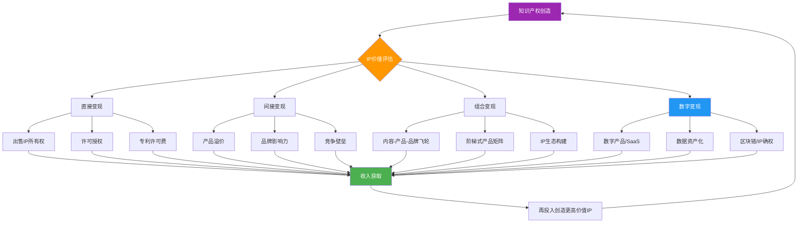
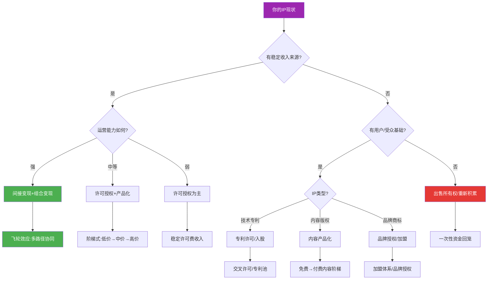
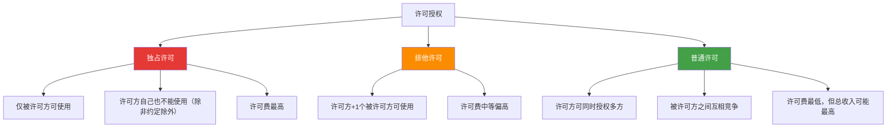
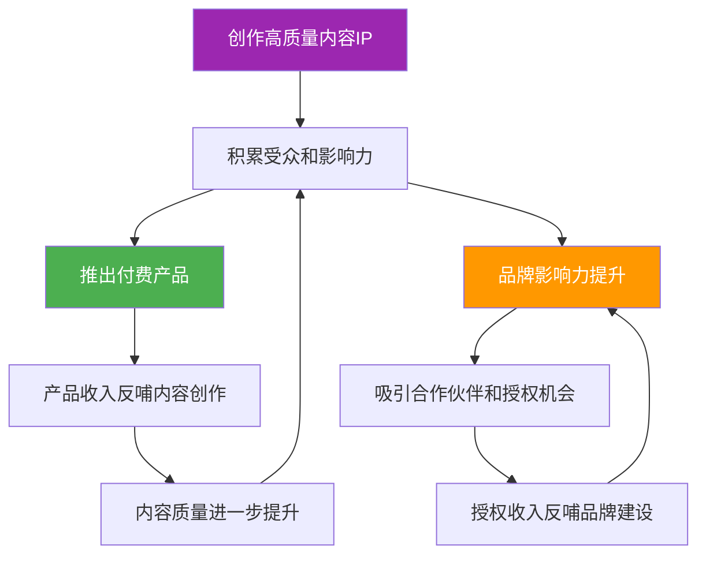

## 七、IP商业化路径

知识产权的终极价值不在于"拥有"，而在于"变现"。然而，变现不是一锤子买卖——选择哪条路径、如何组合多条路径、何时从一条路径切换到另一条，这些决策直接决定了IP的长期价值上限。本节将系统拆解IP从诞生到形成商业闭环的完整路径，涵盖直接变现、间接变现、组合变现、数字变现四大方向，并给出可落地的阶段化操作方案。

### 本节核心框架



### 一、IP变现前的价值自评

在选择变现路径之前，你需要先搞清楚自己手里这张"牌"到底值多少。很多创作者犯的第一个错误，就是拿着一张"小牌"走"大牌"的路线，或者反过来，明明握着王牌却贱卖了。

#### 1.1 IP价值评估五维模型

| 维度 | 评估问题 | 评分标准（1-5分） |
|------|---------|-----------------|
| **市场覆盖度** | 该IP对应的市场空间有多大？受众规模如何？ | 1=极小众（<1万人）; 5=大众市场（>1亿人） |
| **独占性与壁垒** | 替代方案多不多？别人复制的难度有多大？ | 1=容易复制; 5=几乎不可替代 |
| **已验证程度** | 是否已有收入、用户数据、市场反馈？ | 1=纯概念阶段; 5=成熟商业化中 |
| **保护强度** | 法律保护是否完善？保护期限还剩多久？ | 1=无保护/已过期; 5=强保护+长期有效 |
| **运营能力** | 你（或团队）是否有能力独立运营该IP？ | 1=完全没有; 5=成熟团队+丰富经验 |

**评估结果与路径匹配：**

- **总分 20-25**：你握着强牌，适合走间接变现或组合变现，追求长期价值最大化
- **总分 13-19**：中等价值IP，适合许可授权+产品化组合路径，稳步变现
- **总分 7-12**：价值待验证，建议先通过内容/产品验证市场需求，再决定路径
- **总分 5-6**：当前变现价值有限，建议继续积累或考虑出售回笼资金

#### 1.2 变现路径选择决策树



### 二、直接变现：把IP变成现金流

直接变现是最容易理解的路径——把知识产权本身作为商品出售或授权，直接获取收入。这条路径适合急需资金回笼、或者自身缺乏运营能力的情况。

#### 2.1 出售IP所有权

出售IP所有权即"卖断"——将专利、商标、版权、代码等知识产权的全部权利转让给买方，一次性获得对价。

**适用场景：**

- 个人发明者缺乏产业化能力，与其让专利闲置不如变现。例如一个独立研究者开发了一种新型电池材料配方，但没有资金建厂生产，卖给电池制造商是合理选择
- 创业公司将非核心专利打包出售，聚焦主营业务。很多大公司定期清理非核心专利组合，既能回笼资金，又能降低维护成本
- 作者将影视改编权一次性卖给制片公司。网络小说作者将改编权卖给影视公司，一次性获得数十万到数百万元收入

**不适用场景：**

- IP正处于价值上升期，过早出售等于"卖在山脚下"
- 你有能力或计划自行运营该IP
- 市场上缺乏合理定价的参考案例，容易被低估

**定价逻辑：**

IP出售价格通常基于以下因素综合评估：

| 评估维度 | 说明 | 权重参考 | 评估方法 |
|----------|------|----------|----------|
| 市场规模 | 该IP覆盖的市场空间有多大 | 30% | TAM-SAM-SOM模型测算 |
| 独占性 | 替代方案多不多，壁垒高不高 | 25% | 竞品分析+专利检索 |
| 剩余保护期 | 专利还剩多少年，版权时效如何 | 15% | 法律文件审查 |
| 已验证价值 | 是否已有商业化收入或用户数据 | 20% | 财务数据+用户数据 |
| 买方需求紧迫度 | 买方是否急需该IP解决竞争问题 | 10% | 市场调研+谈判判断 |

**定价方法论：**

- **成本法**：计算研发该IP的总投入（人力+资金+时间），加合理利润率。适合早期阶段、缺乏市场数据的IP。缺点是忽略了IP的潜在市场价值
- **收益法**：预测该IP未来5-10年的预期收益，折现到当前价值。这是最常用的方法，公式为：IP价值 = Σ(未来第t年预期收益 ÷ (1+折现率)^t)。折现率通常取10%-20%
- **市场法**：参考类似IP的交易价格。需要有可比交易案例，数据来源包括知识产权交易所成交记录、上市公司并购中的IP估值披露

**实际操作要点：**

- **评估先行**：委托专业评估机构（如中国技术交易所、各地产权交易所、中都国脉资产评估公司）出具评估报告，作为谈判依据。评估费用通常为评估价值的0.5%-2%
- **尽职调查**：确保IP权属清晰、无质押、无许可纠纷，否则买方会大幅压价。需要准备的材料清单：权利证书原件、年费缴纳记录、许可合同清单、质押登记记录、诉讼/争议记录
- **分阶段付款**：谈判中争取"首付+里程碑款"的付款结构，而非一次性低价买断。典型结构：签约付30%，IP过户付40%，商业化验收付30%
- **保留回授条款**：如果可能，在转让协议中约定"回授许可"——买方商业化成功后，你仍可获得一定比例的分成。这是对卖方最有利的条款，但需要谈判实力支撑
- **竞标策略**：同时接触多个潜在买方，制造竞争氛围。即使最终只卖给一家，多方报价也能显著提升谈判地位

**真实案例：技术专利的出售决策**

某独立开发者持有"智能垃圾分类识别"相关专利3项，因无力产业化，通过中国技术交易所以280万元打包转让给一家环保科技公司。该买方拿到专利后在政府采购项目中中标，年营收超过3000万元。卖方如果当初选择许可授权而非卖断，按5%许可费率计算，3年可获得450万元以上收入。

**教训**：除非急需资金，否则不要轻易卖断核心IP。卖断是"用长期收益换短期现金"的交易，只有在你确定无法自行运营时才考虑。

#### 2.2 许可授权

许可授权是最灵活、最可持续的直接变现方式——你不转让所有权，而是允许他人在约定范围内使用你的IP，按期收取许可费。

**许可类型详解：**



**如何选择许可类型：**

| 情况 | 推荐类型 | 原因 | 风险提示 |
|------|----------|------|----------|
| 买方出价极高且市场有限 | 独占许可 | 一次性锁定高额收入 | 买方运营不力则IP闲置 |
| 买方是行业龙头，想借此背书 | 排他许可 | 借助龙头影响力，同时保留自身使用权 | 龙头可能压制你的发展空间 |
| 市场广阔，适合多方推广 | 普通许可 | 薄利多销，总收入最大化 | 被许可方之间可能恶性竞争 |
| IP刚起步，需要市场验证 | 普通许可 | 降低许可方风险，多签几家试水 | 早期许可费定价可能偏低 |

**许可费率谈判基准：**

| IP类型 | 费率范围 | 计费模式 | 行业惯例 |
|--------|----------|----------|----------|
| 发明专利 | 产品售价的2%-5% | 按销量×费率 | 通信/半导体行业标准 |
| 实用新型/外观设计 | 产品售价的1%-3% | 按销量×费率 | 消费品/制造业 |
| 软件著作权（SaaS） | 每用户每月10-500元 | 按用户数/使用量 | 视功能复杂度而定 |
| 软件著作权（一次性授权） | 产品售价的10%-30% | 一次性固定费用 | 企业级软件常见 |
| 图书版权 | 定价的8%-15% | 按印数×版税率 | 国内出版行业标准 |
| 影视改编权 | 固定费用+票房分成2%-5% | 混合模式 | 头部IP可谈判更高比例 |
| 商标品牌授权 | 销售额的5%-10% | 按被授权方销售额 | 品牌知名度越高费率越高 |
| 设计/外观 | 产品售价的3%-8% | 按销量×费率 | 时尚/消费品行业 |

**关键合同条款清单：**

1. **许可范围**：必须明确四要素——地域范围（全球/中国大陆/特定省份）、行业范围（所有行业/特定行业）、用途范围（制造/销售/进口）、时间范围（起止日期）。范围越窄，许可费越低；范围越宽，议价空间越大
2. **许可费计算方式**：三种模式各有优劣——固定费率简单透明但不随业绩增长；最低保证金（Minimum Guarantee）保护许可方利益，即使被许可方销售不达预期也要支付保底金额；混合模式（MG+浮动）是最优选择
3. **质量控制条款**：商标许可必须有，否则可能丧失商标权。需要约定产品质量标准、抽检机制、不达标时的处理措施
4. **分许可权利**：被许可方能否再授权第三方？建议默认禁止分许可，除非被许可方支付更高许可费
5. **审计权**：许可方有权定期审计被许可方的销售数据，确保许可费计算准确。审计频率通常为每年一次，费用由许可方承担（发现差异则由被许可方承担）
6. **违约与终止条件**：明确哪些行为构成违约（未按时付款、超出许可范围使用、质量不达标等），以及终止后的IP处理（停止使用、销毁库存、移除标识等）
7. **争议解决机制**：约定仲裁还是诉讼，选择哪个仲裁机构/管辖法院。建议选择对IP保护力度大的管辖地

**许可授权的常见坑：**

- **陷阱一：许可范围模糊**。合同写"在中国使用"，但没明确是"制造"还是"销售"还是"进口"。被许可方在中国制造后出口到全球，许可方无法主张权利。**对策**：范围条款必须穷举，不使用"包括但不限于"这种模糊表述
- **陷阱二：许可费与销量脱钩**。按固定年费授权，被许可方销量暴增后许可方无法享受增长红利。**对策**：设置"阶梯费率"——销量越高，费率越高
- **陷阱三：许可期限过长**。一次性签10年独家许可，5年后你的IP价值翻了10倍但许可费还是老价格。**对策**：设置"定期调价机制"或缩短许可期限（3年一签）

#### 2.3 专利许可的特殊操作

专利许可与著作权、商标许可不同，有几个独特的操作要点需要单独说明。

**专利池授权**：当单一专利难以独立商业化时，可以加入专利池（如MPEG-LA管理的视频编解码专利池、Via Licensing管理的无线通信专利池），将多项专利打包授权，按贡献比例分配许可费收入。专利池的优势在于降低交易成本——被许可方一次性获得一揽子许可，不需要逐个谈判。中国的企业可以加入AVS（数字音视频编解码技术标准）专利池，这是国内最成熟的专利池运作体系。

**加入专利池的操作流程：**

1. 评估你的专利是否属于该专利池覆盖的技术领域
2. 向专利池管理机构提交专利申请，附上专利清单和权利要求对照表
3. 管理机构委托第三方（通常是律所）进行"必要性评估"——判断你的专利是否为该领域标准实施所必需
4. 通过评估后签署入池协议，约定分成比例
5. 按季度/年度从专利池总收入中获取分成

**交叉许可**：当双方都持有对方需要的专利时，可以互相许可，抵消部分或全部许可费。这在科技行业非常常见——华为与三星、高通与苹果之间都有复杂的交叉许可安排。交叉许可的关键是"专利价值对等评估"——如果双方专利价值相当，可以免费交叉许可；如果一方专利价值更高，另一方需要支付"差额补偿费"。

**交叉许可谈判要点：**

- 摸清对方的专利组合底牌，通过专利检索工具（如Google Patents、SooPAT、智慧芽）了解对方专利的技术领域和法律状态
- 评估双方专利的"必要性"——对方的产品是否真的需要使用你的专利？你的产品是否真的需要使用对方的专利？
- 如果你的专利组合更强，可以要求对方支付差额补偿费
- 交叉许可协议通常包含"最惠条款"——如果对方给其他公司更优惠的条件，你自动享受同等条件

**FRAND承诺**：如果专利被纳入行业标准（如5G、Wi-Fi、H.265视频编码标准），通常需要做出"公平、合理、非歧视"（Fair, Reasonable, and Non-Discriminatory, FRAND）许可承诺。这意味着你不能拒绝许可，也不能收取过高费率——但好处是被整个行业强制采用，许可收入有保障。高通、爱立信、华为等公司的大量标准必要专利收入就来自FRAND许可。

**FRAND承诺的利弊分析：**

| 方面 | 优势 | 劣势 |
|------|------|------|
| 市场覆盖 | 被全行业强制采用，覆盖面极广 | 不能拒绝许可，失去谈判主动权 |
| 收入确定性 | 标准实施就有收入，确定性高 | 费率受"合理"约束，不能随意定价 |
| 竞争优势 | 竞争对手必须使用你的专利 | 同时你也必须使用竞争对手的专利 |
| 法律风险 | 标准化降低了专利被无效的风险 | 可能面临反垄断审查 |

### 三、间接变现：IP带来的隐性价值

间接变现不直接卖IP本身，而是利用IP带来的竞争优势获取商业回报。这条路径的收入天花板通常更高，但需要更强的运营能力。

#### 3.1 产品溢价

拥有IP的产品可以定价更高，因为消费者为"独特性"和"品质保证"付费。

**溢价机制分析：**

| IP类型 | 溢价来源 | 典型溢价幅度 | 经典案例 |
|--------|----------|-------------|----------|
| 技术专利 | 产品功能更优，性能参数领先 | 比竞品贵20%-50% | 戴森吸尘器的核心是气旋分离专利，产品均价是竞品的3-5倍 |
| 设计专利/外观设计 | 产品颜值更高，用户体验更好 | 比同类贵30%-100% | 无印良品的设计语言让普通日用品卖出设计品价格 |
| 商标品牌 | 品牌信任降低决策成本，情感价值附加 | 溢价可达成本的3-10倍 | 苹果手机BOM成本约300美元，售价999美元 |
| 著作权/版权 | 内容独特性带来用户粘性和付费意愿 | 免费替代品的10-100倍 | 得到APP独家课程单价199-399元，同类免费内容泛滥 |
| 商业秘密 | 独特工艺/配方带来的品质差异 | 15%-40% | 可口可乐配方带来的品牌溢价 |

**实操路径（四步法）：**

**第一步：IP资产盘点**——梳理你拥有的所有IP资产，评估哪些可以转化为产品差异化卖点。不是所有IP都适合溢价，你需要找到那个"消费者能感知到"的差异点

**第二步：卖点提炼**——将IP转化为消费者能理解的语言。"拥有多项发明专利"不如"充电10分钟续航2天"有说服力。技术语言要翻译成用户价值

**第三步：定价验证**——通过A/B测试验证消费者愿意为IP溢价付多少钱。方法：同一产品设置两个版本（有IP标注 vs 无IP标注），观察转化率和客单价差异。推荐使用电商平台的"价格力测试"工具或自建Landing Page测试

**第四步：持续迭代**——IP带来的溢价是有时效性的。技术专利会过期，设计会过时，品牌需要持续投入。你需要建立"IP更新节奏"——每年更新核心IP，保持技术或内容领先

#### 3.2 品牌影响力

IP积累带来的品牌影响力是最难量化、但价值最大的间接变现方式。

**影响力变现的四个层次：**


**层次一：内容影响力**

通过持续输出高质量IP内容，在目标受众中建立认知度。这是起点，也是基础。衡量标准：粉丝数、搜索指数、内容引用/转载次数、行业媒体报道频次。

**关键指标参考：**

| 级别 | 粉丝规模 | 搜索指数 | 典型变现能力 |
|------|----------|----------|-------------|
| 入门 | 1000-1万 | 无收录 | 几乎无法变现，专注积累 |
| 初级 | 1万-10万 | 有收录但排名靠后 | 低价产品+少量广告收入 |
| 中级 | 10万-100万 | 品牌词搜索首页 | 中价产品+品牌合作+课程 |
| 高级 | 100万-1000万 | 行业关键词关联 | 高价产品+品牌授权+投资 |
| 顶级 | 1000万+ | 成为品类代名词 | IP生态+资本运作+跨界合作 |

**层次二：行业话语权**

当你的IP成为行业标杆（如某领域的教科书、标准参考、必读清单），你就拥有了定义规则的能力。这种话语权的变现方式包括：受邀参与行业标准制定、担任行业协会职务、在顶级会议上做Keynote演讲（出场费通常5万-50万元）、为政府/企业提供政策咨询。

**层次三：资源整合能力**

品牌影响力带来合作机会——出版社找你出书、媒体找你采访、企业找你合作、投资机构找你做顾问。这些机会本身就有商业价值。关键是建立"资源漏斗"——用标准化流程筛选和管理合作机会，避免精力被低质量合作消耗。

**资源漏斗操作方法：**

1. 建立合作信息收集渠道（官网合作入口、助理联系方式）
2. 设置筛选标准（行业相关性、对方体量、合作模式、预期收益）
3. 对通过初筛的合作进行价值评估（直接收益、品牌价值、战略价值）
4. 对高价值合作投入精力谈判，低价值合作批量拒绝或转给团队处理

**层次四：资本议价能力**

在融资、并购谈判中，强IP品牌意味着更高的估值倍数。一家有核心专利和知名品牌的公司，估值可能是同类无IP公司的3-5倍。具体表现在：投资机构愿意给更高的PE倍数、银行更愿意提供贷款、并购谈判中卖方有更强的议价权。

#### 3.3 竞争壁垒

IP构建的竞争壁垒是一种防御性变现——虽然不直接产生收入，但阻止了竞争对手蚕食你的市场。

**壁垒类型与效果：**

| 壁垒类型 | 构建方式 | 防御效果 | 持续时间 | 构建成本 |
|----------|----------|----------|----------|----------|
| 专利壁垒 | 围绕核心技术申请专利群 | 极强——法律强制保护 | 20年（发明专利） | 每项专利3-10万元 |
| 版权壁垒 | 独特内容/软件/数据库 | 强——自动获得保护 | 作者终身+50年 | 主要是创作成本 |
| 商标壁垒 | 注册品牌标识+持续使用 | 强——可无限续展 | 10年可续 | 每类注册费300-1000元 |
| 商业秘密壁垒 | 保密协议+内部管控 | 中——依赖保密措施 | 直到泄密 | 管理制度建设成本 |
| 数据壁垒 | 积累独有数据集 | 中——数据难以复制 | 持续积累 | 数据采集和清洗成本 |
| 网络效应壁垒 | 用户越多价值越大 | 极强——赢者通吃 | 持续到被颠覆 | 平台建设+运营成本 |

**实操建议：专利组合构建策略**

不要只申请单一专利，要构建"专利组合"——围绕核心技术申请一系列相关专利，形成专利网。竞争对手绕过其中一个专利容易，绕过整个专利网几乎不可能。这就是华为、高通等公司的做法。

**专利组合构建步骤：**

1. **核心专利申请**：保护核心技术方案，权利要求写宽，覆盖最大的保护范围
2. **外围专利布局**：围绕核心专利申请改进专利、应用专利、替代方案专利，形成"护城河"
3. **防御性公开**：对于不想申请专利但也不希望竞争对手获得的技术方案，选择"防御性公开"（在技术期刊或数据库中公开），使其成为现有技术
4. **定期审查**：每年审查专利组合，放弃维护价值低的专利，集中资源保护高价值专利

### 四、组合变现：多路径协同放大价值

最高明的IP变现策略是组合使用多条路径，让它们互相增强，形成飞轮效应。

#### 4.1 内容-产品-品牌飞轮



这个飞轮的核心逻辑：**内容建立信任，产品实现收入，品牌放大溢价，三者循环增强**。飞轮一旦转起来，每一个环节都在为其他环节输送能量——这就是为什么头部IP创作者的收入增长是指数级而非线性的。

**飞轮启动的关键条件：**

- 内容质量必须达到"自发传播"的门槛——读者看了会主动分享，而不是需要你去推广
- 产品必须交付超预期价值——用户付费后觉得"值了"，才会复购和推荐
- 品牌定位必须清晰一致——所有内容和产品都围绕同一个核心定位，不要频繁切换赛道

#### 4.2 阶梯式产品矩阵

```text
免费内容（引流） → 低价产品（筛选） → 中价产品（转化） → 高价产品（利润）
```

**阶段一：免费内容引流（3-6个月）**

这是地基阶段，目标是建立受众基础和行业认知。

- **平台选择**：根据目标受众选择主力平台。技术人员选GitHub/掘金/知乎，泛人群选公众号/B站/小红书，专业领域选垂直社区
- **内容策略**：输出体系化、有深度的专业内容，而不是碎片化的"干货"。体系化内容的价值在于它能建立"完整认知"，让读者觉得"这个人真的懂"
- **关键指标**：粉丝数、阅读/播放量、互动率。6个月内达到1万精准粉丝是及格线
- **避坑提醒**：不要急于变现，免费阶段的核心任务是建立信任。过早推销会损害刚建立的信任。这个阶段最大的敌人是"焦虑"——看到别人赚钱就忍不住开始卖东西

**阶段二：低价产品筛选（1-3个月）**

低价产品的真正目的不是赚钱，而是筛选出愿意付费的用户。

- **产品形态**：9.9-99元区间。具体形态包括：迷你电子书（30-50页，聚焦一个具体问题）、单节精品课（1-2小时，解决一个痛点）、工具模板包（Excel模板/代码模板/设计模板）、小型工具软件（解决特定场景需求）
- **转化预期**：免费用户到付费用户的转化率通常在1%-5%。1万粉丝中，预期100-500人会购买低价产品
- **关键指标**：转化率、复购率、用户反馈质量。重点关注购买后的用户行为——他们是否在社群中活跃、是否向他人推荐
- **运营要点**：收集购买用户的反馈，为中价产品做需求验证。这个阶段的用户反馈是最宝贵的——他们会告诉你真正愿意为什么付费

**阶段三：中价产品转化（3-6个月）**

中价产品是收入的核心来源，目标是建立稳定现金流。

- **产品形态**：199-999元区间。具体形态包括：完整课程体系（10-30节课，覆盖一个领域）、系列专栏（持续更新的深度内容）、社群会员（包含内容+互动+资源）、软件订阅（按月/年收费）
- **转化策略**：从低价产品用户中转化，转化率预期5%-15%。同时通过口碑传播吸引新用户。转化的关键是"价值阶梯感"——让用户觉得中价产品是低价产品的"自然升级"
- **关键指标**：月收入、用户留存率、NPS（净推荐值）。月收入稳定在5万元以上说明中价产品已跑通
- **内容要求**：中价产品必须提供明确的、可衡量的价值提升。用户付费后要能感受到"物超所值"

**阶段四：高价产品利润（持续）**

高价产品是利润的核心来源，但也是最难交付的。

- **产品形态**：1999-9999元区间。具体形态包括：训练营（集中式学习+实操+辅导）、私教服务（一对一或小班制）、企业咨询（按项目/按天收费）、定制方案（完全个性化的内容/服务）
- **转化逻辑**：高价产品的用户通常已经通过低价和中价产品验证了你的价值，或者通过口碑/案例了解了你的能力。冷启动转化高价用户几乎不可能
- **关键指标**：客单价、客户终身价值（LTV）、转介绍率
- **交付要求**：高价产品必须有高度个性化的内容或服务，让客户感受到"专属感"。批量化的录播课卖不出高价——你需要提供的是"互动+反馈+定制"的组合

#### 4.3 从个人IP到商业品牌

当个人IP发展到一定规模，需要完成从"个人品牌"到"商业品牌"的跃迁，否则会陷入"创始人瓶颈"——所有业务都依赖个人精力，无法规模化。

**跃迁路径四步法：**

**第一步：个人品牌建立（6-12个月）**

- 确定清晰的个人定位和标签。"Python数据分析专家"比"技术博主"好十倍——越具体越容易被记住
- 持续输出专业内容，建立行业影响力
- 在目标受众中形成"提到XX领域就想到你"的认知关联
- 建立个人品牌的视觉识别系统（头像、配色、字体风格），在所有平台保持一致

**第二步：团队化运营（6-12个月）**

- 从个人创作到团队协作，释放创始人精力
- 关键岗位分工：内容生产（编辑/写手/视频剪辑）、用户运营（社群管理/客服）、技术支持（网站/工具维护）、商务合作（BD/销售）
- 建立标准化的内容生产流程和质量控制体系
- 引入项目管理工具（如飞书、Notion、Trello），确保协作效率

**团队化运营的财务模型参考：**

| 阶段 | 团队规模 | 月均成本 | 月均收入目标 | 关键假设 |
|------|----------|----------|-------------|----------|
| 个人期 | 1人 | 0-5000元 | 5000-2万元 | 靠个人内容产出 |
| 小团队期 | 3-5人 | 3-8万元 | 10-30万元 | 课程+社群双轮驱动 |
| 成长期 | 8-15人 | 15-40万元 | 50-150万元 | 产品矩阵+企业客户 |
| 规模期 | 20人+ | 50-100万元 | 200万元+ | 品牌授权+生态收入 |

**第三步：品牌矩阵构建（12-24个月）**

- 围绕核心IP开发系列产品线（如从一门课程扩展到课程+书籍+工具+社群）
- 建立子品牌覆盖不同细分市场（如主品牌面向从业者，子品牌面向学生）
- 跨平台运营，不同平台使用不同内容形态（公众号深度文章、B站视频讲解、小红书图文速览、播客音频访谈）
- 子品牌之间建立引流机制——从免费平台引流到付费平台，从低价产品引流到高价产品

**第四步：商业生态构建（24个月+）**

- 从单一产品销售到产品生态——产品之间互相引流、互相增强
- 建立合作伙伴网络——与互补IP持有者合作，共同开发新市场
- 探索新商业模式——如IP授权加盟、技术入股、品牌联名
- 考虑引入资本，加速规模化。融资前需要准备：清晰的商业模式说明、财务数据（至少12个月）、核心IP资产清单、团队介绍

### 五、数字时代的IP变现新路径

传统IP变现路径（出售、许可、产品化）依然有效，但数字化浪潮催生了全新的变现方式。这些新路径的门槛更低、天花板更高、迭代速度更快。

#### 5.1 数字产品与SaaS化

将IP转化为数字产品或SaaS服务，是软件著作权持有者最高效的变现路径。

**数字产品类型矩阵：**

| 产品类型 | 定价模式 | 边际成本 | 扩展性 | 适合的IP类型 |
|----------|----------|----------|--------|-------------|
| 工具软件（一次性购买） | 99-999元/份 | 接近零 | 中 | 功能型软件著作权 |
| SaaS订阅 | 月费/年费 | 低（服务器成本） | 极高 | 平台型软件著作权 |
| API服务 | 按调用量计费 | 线性增长 | 高 | 算法/数据类IP |
| 插件/扩展 | 免费+付费高级功能 | 接近零 | 高 | 工具型软件著作权 |
| 模板/素材包 | 19-199元/份 | 零 | 极高 | 设计/内容类著作权 |

**SaaS化操作要点：**

- 从MVP（最小可行产品）开始，不要追求完美。第一个版本只需要解决一个核心痛点
- 采用"免费增值"（Freemium）模式——基础功能免费，高级功能付费。这是获客成本最低的模式
- 关注关键SaaS指标：MRR（月经常性收入）、Churn Rate（流失率）、LTV/CAC（客户终身价值÷获客成本，健康值>3）
- 建立产品反馈闭环——用户反馈→需求优先级排序→快速迭代→新版本发布

#### 5.2 数据资产化

数据是数字时代最有价值的IP类型之一，但数据变现面临法律合规（个人信息保护法、数据安全法）和技术门槛的双重挑战。

**数据变现的三种模式：**

1. **数据产品化**：将原始数据加工为可消费的数据产品（如行业报告、数据集、指数），以订阅或一次性购买方式销售。典型案例：Wind金融终端、企查查
2. **数据服务化**：基于数据提供分析服务（如市场洞察、用户画像、风险评估），按项目或按年收费。典型案例：艾瑞咨询、易观分析
3. **数据赋能化**：将数据能力嵌入到其他产品中（如推荐引擎、风控模型），按调用量或按效果收费。典型案例：信用评分API、广告定向投放

**数据合规红线：**

- 涉及个人信息的数据必须获得用户明确同意
- 数据交易需要通过合规的数据交易所（如上海数据交易所、深圳数据交易所）
- 跨境数据传输需要进行安全评估
- 不得交易涉及国家安全的数据

#### 5.3 区块链与IP确权

区块链技术为IP确权和交易提供了新的基础设施，但目前仍处于早期阶段，需要理性看待。

**区块链在IP领域的应用场景：**

- **时间戳确权**：将创作内容的哈希值上链，提供不可篡改的创作时间证明。适合版权纠纷中的"先创作"举证
- **NFT数字藏品**：将数字内容铸造为NFT进行销售。适合数字艺术、音乐、视频等内容创作者。需要注意：国内NFT平台（数字藏品平台）与海外OpenSea等平台的商业模式和法律定位完全不同
- **智能合约授权**：通过智能合约实现自动化版权授权和收益分配。每次作品被使用，许可费自动到账。适合音乐、图片等高频授权场景

**理性提醒**：区块链在IP领域的应用仍处于探索期，技术和法律框架都不成熟。不要为了"追热点"而盲目投入，优先选择成熟路径变现。

### 六、变现路径选择决策框架

不同类型的IP、不同阶段的创作者，适合不同的变现路径。以下框架帮助你做出理性选择。

#### 6.1 决策矩阵

| 你的IP类型 | 推荐首要路径 | 推荐次要路径 | 不推荐路径 | 决策关键因素 |
|-----------|-------------|-------------|-----------|-------------|
| 技术专利 | 许可授权 | 产品溢价/入股 | 内容变现 | 看是否有产业化能力 |
| 软件著作权 | 产品化/SaaS | 许可授权 | 出售所有权 | 看用户规模和粘性 |
| 内容版权 | 内容产品化 | 品牌授权 | 一次性出售 | 看内容更新频率 |
| 商标品牌 | 品牌授权/加盟 | 产品溢价 | 出售（除非退出） | 看品牌知名度 |
| 设计/外观 | 产品溢价 | 许可授权 | — | 看设计的市场热度 |
| 数据资产 | 产品化/API | 许可授权 | 出售（监管风险） | 看数据合规性 |

#### 6.2 三条核心原则

**原则一：先验证再放大**

不要一上来就重金投入，先用最小成本验证市场需求。验证方法包括：用MVP测试产品需求、用免费内容测试受众反应、用低价产品测试付费意愿。只有验证通过后，才投入资源规模化。

**原则二：组合优于单一**

多条路径并行比押注单一路径更稳健。最优组合通常是"一条主力路径+两条辅助路径"。例如：主力路径是SaaS订阅（稳定现金流），辅助路径是品牌授权（高利润低频收入）和咨询服务（高客单价验证需求）。

**原则三：动态调整**

随着IP成熟度和市场环境变化，及时调整路径组合。IP商业化不是"一次决策"，而是"持续优化"的过程。建议每季度做一次路径评估——哪些路径在增长？哪些在衰减？需要新增或砍掉哪些？

### 七、常见误区与深度纠正

| 误区 | 真相 | 纠正方法 | 错误案例 |
|------|------|----------|----------|
| IP注册完就等着收钱 | IP需要主动运营才能变现，注册只是起点 | 制定明确的商业化计划，分配时间和预算执行 | 某设计师注册了20个商标但从未使用，每年白交维护费 |
| 所有IP都适合走许可授权 | 不同IP适合不同路径，"一刀切"会错失机会 | 用决策矩阵评估，选择最适合的路径组合 | 某小型软件公司只做许可授权，错过了SaaS化的机会窗口 |
| 价格越高利润越大 | 高价可能吓跑客户，总收入反而降低 | 做定价测试（A/B测试），找到收入最大化的价格点 | 某课程定价9999元无人问津，降到1999元后月销200份 |
| 只做免费内容就能变现 | 免费内容是引流手段，不是变现手段 | 设计清晰的付费产品阶梯（免费→低价→中价→高价） | 某博主百万粉丝但月收入不足5000元，因为没有付费产品 |
| 个人品牌无法规模化 | 通过团队化和品牌矩阵可以突破个人瓶颈 | 系统化运营，逐步引入团队，建立标准化流程 | 某知识IP年收入始终停在100万，因为所有事都自己做 |
| 申请专利就万事大吉 | 专利需要主动维护、监控侵权、适时维权 | 建立专利管理体系，定期审查，设置侵权监控 | 某公司核心专利被侵权3年才发现，错过最佳维权时机 |
| 独家许可一定比普通许可好 | 独家许可单价高但总收入可能不如多家普通许可 | 根据市场容量和许可方数量选择许可类型 | 某专利签了独家许可年收50万，同类专利普通许可年收200万 |
| IP估值等于变现价值 | 估值是理论值，实际变现可能远低于估值 | 以实际成交案例为参考，不要过度依赖评估报告 | 某公司IP估值1亿，实际出售仅3000万 |

### 八、进阶：IP资产化与资本运作

当IP积累到一定规模，可以考虑更高阶的变现方式。这些方式门槛较高，但能释放IP的最大价值。

#### 8.1 IP证券化

将未来预期的IP许可收入打包为金融产品出售，一次性获得大额资金。

**操作流程：**

1. **现金流预测**：基于历史数据预测IP未来5-10年的许可收入
2. **资产打包**：将多个IP的预期收入打包为一个资产池
3. **信用增级**：通过担保、保险等方式提升资产池的信用等级
4. **发行证券**：通过投行或金融机构发行资产支持证券（ABS）
5. **投资者认购**：投资者购买证券，发行方一次性获得资金

**经典案例**：David Bowie在1997年将未来10年的音乐版税收入证券化，发行了"Bowie Bonds"，一次性融资5500万美元。利率7.9%，10年期。Moody's给予A3评级。国内也有影视版权证券化的尝试，如《西游记之大圣归来》的票房收益权众筹。

**适用条件**：IP必须有稳定的、可预测的历史收入记录；收入来源必须多元（不能只依赖单一授权方）；法律结构必须清晰（权属无争议）。

#### 8.2 IP入股

以知识产权作价出资，成为目标公司的股东。这种方式适合技术专利持有者——你不卖专利，而是用专利入股一家有产业化能力的公司，享受长期分红。

**操作要点：**

- **评估作价**：委托有资质的评估机构对IP进行价值评估。评估报告是工商登记的必要材料
- **出资比例**：中国公司法允许知识产权作价出资，比例最高可达注册资本的70%（2024年新公司法已取消上限，但需在5年内缴足）
- **权利转移**：IP需要过户到目标公司名下（商标、专利需要办理变更登记，著作权需要签订转让协议）
- **股东权利**：明确入股后的股权比例、表决权、分红权、退出机制

**优势**：不需要现金投入，IP持有者成为公司股东享受长期收益，与公司利益绑定激励更强。

**风险**：IP可能被低估导致股权被稀释，公司运营不善导致IP价值缩水，退出机制不明确可能导致纠纷。

#### 8.3 IP质押融资

将专利权、商标权等知识产权质押给银行或金融机构获取贷款。适合需要短期资金但不想出售IP的情况。

**操作流程：**

1. 选择合作银行（优先选择有知识产权质押贷款产品的银行，如中国银行、浦发银行、各地城商行）
2. 提交IP资产清单和评估报告
3. 银行审批（通常需要1-3个月）
4. 在国家知识产权局办理质押登记
5. 银行放款（通常为评估价值的30%-50%）

**利率与期限**：利率通常为LPR+1%-3%，期限1-3年。各地政府通常有贴息政策，实际利率可能低于普通贷款。

**风险提示**：如果到期无法还款，IP可能被处置。建议只在有明确还款来源时使用质押融资。

#### 8.4 IP评估与入表

2024年起，中国会计准则要求企业将符合条件的开发阶段无形资产确认为资产负债表资产。这意味着IP可以正式"入表"，提升企业估值和融资能力。

**入表条件：**

- 技术可行性已完成论证
- 有完成该无形资产并使用或出售的意图
- 有足够资源完成开发
- 无形资产能够产生经济利益
- 开发支出能够可靠计量

**入表价值**：IP入表后，企业总资产增加，资产负债率下降，融资能力增强。对于计划上市或融资的企业，IP入表是提升估值的重要手段。

### 九、IP商业化的风险管理

IP商业化不是一路坦途，每个路径都有对应的风险。识别风险并提前准备应对方案，是变现成功的前提。

#### 9.1 风险矩阵

| 风险类型 | 发生概率 | 影响程度 | 应对策略 |
|----------|----------|----------|----------|
| IP被侵权 | 高 | 高 | 提前布局监控体系，发现侵权立即取证+发律师函 |
| 许可方违约 | 中 | 中 | 合同中设置违约金条款，保留审计权 |
| 市场需求变化 | 中 | 高 | 持续市场调研，IP组合多元化分散风险 |
| 技术替代 | 中 | 极高 | 持续创新，保持技术领先；布局替代技术专利 |
| 政策法规变化 | 低 | 高 | 关注政策动向，提前调整商业模式 |
| 团队核心人员流失 | 中 | 中 | 知识文档化，建立标准化流程，减少对个人依赖 |

#### 9.2 IP保护的日常操作

- **侵权监控**：定期在电商平台、社交媒体、专利数据库搜索是否有侵权行为。可以使用百度专利检索、Google Patents、商标局官网等工具
- **证据保全**：发现侵权后第一时间取证——截图、录屏、公证购买。电子证据需要经过公证才具有法律效力
- **分级应对**：小规模侵权发律师函警告，中等规模侵权发平台投诉下架，大规模侵权直接起诉索赔
- **定期维护**：专利年费按时缴纳，商标到期前12个月续展，著作权登记信息更新

### 十、本节核心要点总结

1. **IP变现前先评估**：用五维模型评估IP价值，用决策树选择最优路径
2. **直接变现看需求**：急需资金走出售，长期收益走许可，组合最优走交叉许可
3. **间接变现看能力**：有能力运营走产品溢价，有行业地位走品牌影响力，有技术优势走竞争壁垒
4. **组合变现看格局**：内容-产品-品牌飞轮是最高效率的变现模式，但需要时间和耐心
5. **数字变现是趋势**：SaaS化、数据资产化、区块链确权是新时代的变现新路径
6. **动态调整是关键**：没有一成不变的最优路径，每个季度评估一次，及时调整
7. **风险管理是底线**：IP商业化必须同步做好保护，否则变现收入可能被侵权蚕食
