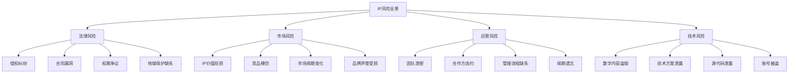
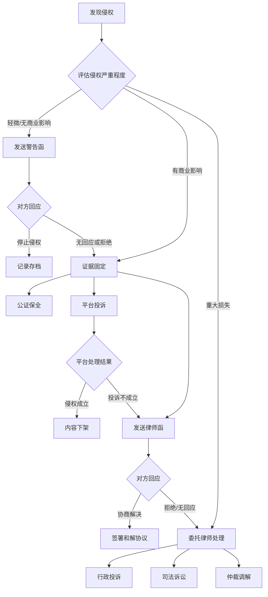

## 八、IP风险管理

知识产权是无形资产，看不见摸不着，却可能价值连城。正因如此，它面临的风险也格外隐蔽——等你发现被侵权时，损失可能已经无法挽回。本章系统梳理IP变现过程中可能遇到的所有风险类型，并给出可落地的防范与应对方案。

### 1. IP风险全景图

IP风险不是单一维度的，它横跨法律、市场、运营、技术四个层面。理解全景才能做到心中有数。



#### 1.1 法律风险

法律风险是IP风险中最直接、损失最可量化的类型。主要包括：

**侵权纠纷**——分为两个方向：你被别人侵权，以及你不小心侵犯了别人的权利。前者让你的变现收入被分流，后者可能让你面临高额赔偿。根据《著作权法》第54条，故意侵权且情节严重的，赔偿金额可以达到实际损失或违法所得的1-5倍。

**合同漏洞**——授权合同中的模糊条款是最常见的法律陷阱。例如"全球范围内独家授权"和"中国大陆地区独家授权"，一字之差，收入天壤之别。又如"永久授权"和"授权期限5年"的区别，前者意味着你永远无法收回授权。

**权属争议**——合作创作、委托创作、职务创作中的权属不清，是IP纠纷的高发地带。特别是AI辅助创作领域，权属认定目前仍存在大量灰色地带。

**地域保护缺失**——知识产权具有地域性，在中国获得的专利权、商标权在海外不自动受保护。如果你的IP有出海计划，必须提前布局海外知识产权。

#### 1.2 市场风险

**IP价值贬损**——IP的价值与市场需求、文化趋势紧密相关。一个曾经火爆的IP形象，可能因为审美趋势变化而迅速贬值。IP持有者需要持续运营，保持IP的市场热度。

**竞品模仿**——当你的IP变现模式被验证成功后，模仿者会迅速出现。如果缺乏有效的知识产权壁垒，竞品可能以更低的价格蚕食你的市场份额。

**品牌声誉受损**——IP被滥用于低质量产品、IP授权方出现负面事件、IP内容引发舆论争议，都会导致IP价值急剧下降。

#### 1.3 运营风险

**团队泄密**——核心创意人员离职后带走商业秘密，或在社交媒体上泄露未公开的IP内容，是最常见的运营风险之一。

**合作方违约**——授权合作方超出授权范围使用IP、未按约定支付分成、擅自转授权给第三方，这些违约行为在IP授权业务中非常普遍。

**续期遗忘**——商标注册有效期10年，专利保护期有限（发明专利20年、实用新型和外观设计10年），软件著作权保护期50年但需要按时登记。错过续期窗口可能导致IP权利丧失。

#### 1.4 技术风险

**数字内容盗版**——电子书、在线课程、软件、音乐、视频等数字内容，复制成本几乎为零。一旦流出，很难完全遏制传播。

**技术方案泄露**——核心技术方案、算法、工艺流程等商业秘密，一旦泄露给竞争对手，技术壁垒将瞬间瓦解。

**账号安全**——各大内容平台的创作者账号是数字IP变现的核心载体。账号被盗、被封禁，意味着变现渠道的直接中断。

### 2. 风险识别与评估

风险管理的第一步是识别风险，第二步是评估风险的严重程度和发生概率。不能眉毛胡子一把抓，要分清轻重缓急。

#### 2.1 风险评估矩阵

| 风险等级 | 发生概率 | 影响程度 | 应对策略 |
|---------|---------|---------|---------|
| 极高风险 | >60% | 重大损失（>50%收入） | 必须立即处理，投入专项资源 |
| 高风险 | 30%-60% | 较大损失（20%-50%收入） | 优先处理，制定详细应对方案 |
| 中风险 | 10%-30% | 一定损失（5%-20%收入） | 常规监控，准备应急预案 |
| 低风险 | <10% | 轻微损失（<5%收入） | 日常关注，定期检查即可 |

#### 2.2 风险自检清单

每个IP持有者都应该定期（建议每季度一次）做一次风险自检：

**法律维度：**
- [ ] 所有IP是否已完成注册/登记？
- [ ] 注册/登记是否在有效期内？
- [ ] 授权合同是否由专业律师审核？
- [ ] 合同中的授权范围、期限、分成比例是否明确？
- [ ] 是否存在权属争议的隐患？
- [ ] 海外市场的知识产权是否已布局？

**运营维度：**
- [ ] 核心团队是否签署保密协议（NDA）和竞业禁止协议？
- [ ] 是否有IP使用规范文档？
- [ ] 授权合作方的使用情况是否定期审查？
- [ ] IP续期提醒机制是否已建立？

**技术维度：**
- [ ] 数字内容是否添加了水印或DRM保护？
- [ ] 核心代码/文档是否设置了访问权限？
- [ ] 平台账号是否启用了两步验证？
- [ ] 是否有定期的侵权监测机制？

**市场维度：**
- [ ] IP的市场热度是否在下降？
- [ ] 是否有竞品在模仿你的IP？
- [ ] IP的口碑评价如何？
- [ ] 授权产品的质量是否符合标准？

### 3. 风险防范体系

防范优于补救。建立系统化的风险防范体系，能避免80%以上的IP风险事件。

#### 3.1 法律防范

**3.1.1 知识产权注册策略**

不要等到IP做大了才想到注册。注册越早，保护越牢。

| IP类型 | 注册方式 | 保护期限 | 费用参考 | 注意事项 |
|-------|---------|---------|---------|---------|
| 文字作品 | 著作权登记 | 作者终生+50年 | 100-300元/件 | 作品完成即自动享有著作权，登记是强化举证 |
| 商标 | 商标注册 | 10年（可续展） | 300元/类（官费） | 建议注册核心类别+关联类别，防御性注册 |
| 发明创造 | 专利申请 | 发明20年/实用新型10年 | 5000-15000元 | 申请前不要公开技术方案，否则丧失新颖性 |
| 软件 | 软件著作权登记 | 自然人终生+50年/法人50年 | 300元/件 | 登记周期约30-60个工作日 |
| 域名 | 域名注册 | 1-10年（按年续费） | 50-100元/年 | 注册核心品牌名的多种后缀 |

**3.1.2 合同风险防控**

IP相关的合同必须包含以下核心条款，缺一不可：

```text
必备条款清单：
1. 授权标的——明确授权的具体IP内容
2. 授权范围——地域范围、使用方式、是否可转授权
3. 授权性质——独家/非独家/排他性授权
4. 授权期限——起止日期，到期后权利归属
5. 费用与分成——固定费用/分成比例/结算周期/支付方式
6. 质量标准——被授权方使用IP的质量要求
7. 违约责任——违约情形、赔偿标准、争议解决方式
8. 保密条款——双方的保密义务和保密期限
9. 知识产权归属——合作产生的新IP权属如何划分
10. 终止条款——合同终止后的善后处理
```

**常见合同陷阱：**

- "不可撤销授权"——一旦签署，你将永远无法收回授权。除非一次性买断价格足够高，否则慎签。
- "最惠条款"——如果给予某个合作方更优惠的条件，其他合作方自动享受同等待遇。这会严重压缩你的议价空间。
- "自动续约"——合同到期后自动续约一年或更长时间。如果你想更换合作方，需要提前通知，否则被锁定。
- "宽泛的衍生品权利"——被授权方可以基于你的IP开发衍生作品并拥有衍生品的知识产权。这意味着你的IP生态可能被对方控制。

**3.1.3 权属确认**

在以下场景中，务必在合作开始前以书面形式明确IP权属：

- 委托他人创作——根据《著作权法》第19条，委托作品的权属由合同约定，没有约定的归受托人。所以如果你花钱请人设计IP形象，没有书面约定的话，著作权属于设计师。
- 合作创作——多个主体共同创作的作品，著作权由合作作者共同享有。行使权利需要协商一致。
- 员工创作——一般情况下，员工在职期间为完成工作任务创作的作品，著作权归单位。但利用业余时间、非工作任务范围的创作，著作权归员工个人。

#### 3.2 技术防范

**3.2.1 数字内容保护**

针对不同类型的数字内容，采取不同的技术保护措施：

**文字内容（电子书、文章、课程）：**
- 添加隐式水印——在内容中嵌入购买者信息（如用户ID、邮箱），不影响阅读但可以追踪泄露源头。
- PDF加密——设置打印、复制、编辑权限，降低被直接复制的概率。
- 分章节发布——不要一次性发布全部内容，降低一次性被盗版后完整传播的风险。
- 平台托管——将内容托管在有DRM保护的平台（如微信读书、Kindle），利用平台的技术保护能力。

**视频课程：**
- 视频水印——在画面中添加半透明的用户信息水印。
- 防录屏技术——部分平台提供防录屏黑屏功能。
- 限制下载——仅提供在线播放，不提供下载链接。
- 分段加密——使用HLS加密流媒体技术，视频分段传输并加密。

**软件产品：**
- 授权验证机制——使用License Key或在线验证，控制软件使用范围。
- 代码混淆——对源代码进行混淆处理，增加逆向工程难度。
- 功能限制——免费版提供基础功能，付费解锁完整功能。
- 反调试保护——在软件中嵌入反调试代码，防止被破解。

**3.2.2 账号安全**

平台账号是数字IP变现的核心载体，必须做到以下几点：

```bash
# 账号安全最低标准
1. 启用两步验证（2FA）——所有平台账号必须开启
2. 使用独立强密码——每个平台使用不同的密码，长度12位以上
3. 绑定安全手机和邮箱——确保找回渠道畅通
4. 定期检查登录记录——发现异常登录立即修改密码
5. 设置子账号权限——团队协作使用子账号，不共享主账号
6. 备份关键数据——定期导出内容备份，防止平台封号导致数据丢失
```

**3.2.3 侵权监测**

被动等待侵权是最大的风险管理失误。必须建立主动监测机制：

**免费监测工具：**
- 百度/Google定期搜索——用IP名称、作品标题、核心内容片段定期搜索，发现未授权使用。
- 图片反向搜索——使用百度识图、Google Images、TinEye搜索IP图片，发现未授权使用。
- 平台内搜索——在各内容平台搜索自己的作品标题和关键内容。
- 电商搜索——在淘宝、京东、拼多多搜索IP名称，发现未授权商品。

**付费监测工具：**
- 阿里知识产权保护平台（IPP）——针对电商平台的侵权监测和投诉。
- 维权骑士——数字内容侵权监测和维权服务，覆盖主流内容平台。
- 原创宝——提供文字、图片、视频的侵权监测服务。
- 专业律所的IP监控服务——针对高价值IP，委托律所进行系统化监控。

**监测频率建议：**

| IP价值等级 | 监测频率 | 监测范围 |
|-----------|---------|---------|
| 核心IP（>10万/年收入） | 每日监测 | 全平台+电商+搜索引擎 |
| 重要IP（1-10万/年） | 每周监测 | 主流平台+电商 |
| 一般IP（<1万/年） | 每月监测 | 搜索引擎+主要平台 |

#### 3.3 运营防范

**3.3.1 保密管理**

核心IP信息的知悉范围必须严格控制：

- 最小知悉原则——只让必要的人知道必要的信息。IP的核心创意、未公开的商业计划、收入数据等敏感信息，知悉人数越少越好。
- 保密协议——所有接触核心IP信息的人员（员工、合作伙伴、外包人员）必须签署保密协议。协议中要明确保密范围、保密期限、违约责任。
- 竞业禁止——核心创意人员和高管应签署竞业禁止协议，防止离职后直接加入竞争对手。注意：竞业禁止需要支付经济补偿金，否则协议无效。
- 信息安全制度——建立文件分级管理制度，核心文件加密存储，设置访问日志。

**3.3.2 授权管理**

建立规范的授权管理制度，避免授权混乱：

```text
授权管理流程：
1. 授权申请——合作方提交书面授权申请，说明使用场景和范围
2. 资质审核——审核合作方的资质、信誉、过往合作记录
3. 方案评估——评估授权方案的合理性和风险点
4. 合同签署——由专业律师起草或审核授权合同
5. 授权执行——提供IP使用规范和素材包
6. 过程监控——定期检查授权使用情况是否合规
7. 到期处理——授权到期前30天提醒，决定是否续约
8. 终止清算——合同终止后回收所有IP素材，结算未付款项
```

**3.3.3 保险配置**

IP保险在国内还不太普及，但在海外已经是成熟的风险管理工具。了解以下几种IP保险：

- 知识产权执行保险——覆盖你发起侵权诉讼的律师费和诉讼费。适合需要主动维权的IP持有者。
- 知识产权防御保险——覆盖你被他人起诉侵权时的辩护费用。适合技术类IP。
- 网络安全保险——覆盖因网络攻击、数据泄露导致的IP损失。适合数字内容和软件IP。
- 品牌声誉保险——覆盖因负面事件导致的品牌价值损失。

国内目前提供IP保险的机构较少，主要包括中国人保、中国平安等大型保险公司的定制化产品，以及部分专注于科技保险的创新型保险公司。建议咨询专业保险经纪人，根据IP的具体情况定制保险方案。

### 4. 侵权应对实战

当侵权真正发生时，需要冷静、系统地应对。慌乱和冲动都是大忌。

#### 4.1 侵权应对流程



#### 4.2 证据固定

证据是维权的基础。证据不充分，再有理也打不赢官司。

**线上证据固定：**
- 公证保全——到公证处对侵权网页、侵权商品页面进行公证保全。这是最权威的证据形式，法院认可度最高。费用约500-2000元/次。
- 时间戳认证——通过联合信任时间戳服务（TSA）对电子证据加盖时间戳，证明证据的形成时间。费用较低，约10-50元/次。
- 区块链存证——部分法院已经认可区块链存证的证据效力。可以使用司法区块链平台（如杭州互联网法院司法区块链）进行存证。
- 截图+录屏——作为辅助证据，截图和录屏可以补充说明侵权情况。注意截图要包含URL、日期等关键信息。

**线下证据固定：**
- 购买侵权商品——通过公证购买的方式获取侵权实物证据。在公证员监督下完成购买过程，确保购买过程的真实性和合法性。
- 现场取证——对实体店铺的侵权行为进行现场拍照、录像，必要时在公证员在场的情况下进行。

#### 4.3 维权渠道选择

不同的维权渠道适用于不同的场景，选对渠道事半功倍。

| 维权渠道 | 适用场景 | 优势 | 劣势 | 费用 | 周期 |
|---------|---------|------|------|------|------|
| 平台投诉 | 电商平台、内容平台上的侵权 | 快速、免费 | 仅限平台内执行 | 免费 | 3-15天 |
| 行政投诉 | 大规模假冒、盗版 | 执法力度大、速度快 | 仅处理行政处罚 | 免费 | 1-3个月 |
| 律师函 | 中小规模侵权、调解为主 | 威慑力强、成本低 | 无强制执行力 | 2000-8000元 | 1-4周 |
| 司法诉讼 | 重大侵权、需判赔 | 最具强制力 | 成本高、周期长 | 5000-50000元+ | 6-18个月 |
| 仲裁调解 | 合同纠纷、双方同意 | 灵活、保密 | 需双方同意 | 3000-20000元 | 1-6个月 |

**平台投诉实操要点：**

各主要平台的投诉机制和处理效率差异很大：

- **淘宝/天猫（阿里巴巴知识产权保护平台）**——处理效率高，一般3-7天出结果。需要先注册成为知识产权权利人，提交权利证明材料。投诉成功后，侵权商品会被下架，严重者店铺扣分。
- **京东（京东知识产权保护系统）**——处理流程类似淘宝，但审核稍严格。支持商标侵权、著作权侵权、专利侵权投诉。
- **拼多多（品牌权益中心）**——处理速度较快，但平台上低价仿冒商品较多，需要持续监控和投诉。
- **微信（微信公众平台/视频号投诉）**——针对公众号文章、视频号内容的侵权投诉。处理周期约7-15天。
- **抖音/快手**——支持短视频、直播间的侵权投诉。处理速度较快，但需要提供充分的权利证明。

#### 4.4 赔偿计算

知道能赔多少，才能判断是否值得维权。

根据《著作权法》《专利法》《商标法》的规定，知识产权侵权赔偿的计算方式按以下顺序确定：

1. **实际损失**——权利人因侵权行为受到的实际经济损失。需要提供收入下降的数据对比、客户流失证据等。
2. **侵权获利**——侵权人因侵权行为获得的利润。可以通过侵权商品的销售数量和利润来计算。
3. **许可使用费的合理倍数**——参照同类IP的许可使用费来确定赔偿金额。
4. **法定赔偿**——以上三种方式都难以确定时，由法院根据侵权情节酌定。著作权法定赔偿上限500万元，商标权500万元，专利权500万元。

**提高赔偿金额的技巧：**
- 证明侵权人主观恶意——如重复侵权、规模化侵权、伪造授权文件等。
- 提供充分的损失证据——收入对比数据、市场份额变化、品牌价值评估报告。
- 申请惩罚性赔偿——对于故意侵权且情节严重的，可以申请1-5倍惩罚性赔偿。
- 合理主张维权费用——律师费、公证费、鉴定费等合理维权支出可以要求侵权人承担。

### 5. 常见误区与纠正

#### 误区一："我的作品不需要注册就有保护"

**事实：** 著作权确实自创作完成之日起自动产生，不以登记为前提。但未经登记的作品在维权时举证困难——你需要证明你是作品的原创者、作品的完成时间。著作权登记证书是最直接的证据。花费几百元做一次登记，在维权时可以省去数万元的举证成本。

#### 误区二："小规模侵权不值得管"

**事实：** 侵权行为如果不及时制止，会产生"破窗效应"——越来越多的人认为你的IP可以随意使用。今天的小规模侵权，明天就可能变成大规模盗版。建议对所有发现的侵权行为都采取行动，至少发送一封警告函。

#### 误区三："授权合同我自己写就行，不用请律师"

**事实：** 知识产权合同的专业性极强，一个条款的措辞差异可能导致完全不同的法律后果。自拟合同省下的律师费，可能在纠纷发生时变成百倍千倍的损失。建议所有涉及金额超过1万元的IP合同，都由专业知识产权律师起草或审核。律师费用参考：简单合同审核2000-5000元，复杂合同起草5000-20000元。

#### 误区四："注册了商标就万事大吉"

**事实：** 商标注册只是起点，不是终点。注册后你需要：(1) 持续使用商标，连续3年不使用可能被他人申请撤销；(2) 监测是否有近似商标申请，及时提出异议；(3) 在到期前12个月内办理续展手续；(4) 在发现侵权时积极维权，否则可能被视为默示许可。

#### 误区五："AI生成的内容不受著作权保护"

**事实：** 这个问题目前在法律上仍有争议。2023年中国法院已有判例认定，如果人类在AI生成过程中进行了实质性的创作投入（如详细的提示词设计、多次迭代修改、后期编辑加工），生成结果可以作为作品受到著作权保护。关键在于能否证明人类的创造性贡献。建议保留完整的创作过程记录，包括提示词、修改历史、编辑记录等。

### 6. 国际IP保护

如果你的IP有出海计划，国际知识产权保护是必须提前考虑的问题。

#### 6.1 主要国家/地区的IP保护差异

| 国家/地区 | 商标制度 | 专利制度 | 著作权保护 | 特殊注意事项 |
|-----------|---------|---------|-----------|-------------|
| 美国 | 使用在先原则 | 先申请制（2013年后） | 自动保护+登记强化 | 美国诉讼成本极高，需做好预算 |
| 欧盟 | 欧盟商标（EUTM）统一注册 | 欧洲专利（EPC） | 各成员国独立保护 | 一次注册覆盖27个成员国 |
| 日本 | 先申请制 | 先申请制 | 自动保护 | 日本对IP保护意识强，维权环境好 |
| 东南亚 | 各国独立注册 | 各国独立申请 | 各国差异大 | 部分国家执法力度较弱 |
| 印度 | 先申请制 | 先申请制 | 自动保护 | 知名商标可获跨类保护 |

#### 6.2 国际注册途径

**商标国际注册（马德里体系）：** 通过世界知识产权组织（WIPO）的马德里体系，可以一次申请在多个国家注册商标。基础费用约653瑞士法郎（约合人民币5000元），每增加一个国家额外收费。覆盖130多个成员国。

**专利国际申请（PCT）：** 通过《专利合作条约》（PCT），可以一次申请在多个国家寻求专利保护。国际阶段费用约3-5万元人民币，进入各国国家阶段后费用另计。

**著作权国际保护：** 中国是《伯尔尼公约》成员国，中国公民的作品在170多个成员国自动受到保护，无需额外注册。

### 7. IP风险管理工具箱

#### 7.1 法律工具

| 工具/服务 | 用途 | 费用参考 |
|-----------|------|---------|
| 中国商标网（sbj.cnipa.gov.cn） | 商标查询、注册、续展 | 官费300元/类 |
| 中国专利公布公告（epub.sipo.gov.cn） | 专利查询 | 免费 |
| 中国版权保护中心（ccprcc.com） | 著作权登记 | 100-300元/件 |
| 阿里知识产权保护平台（ipp.alibabagroup.com） | 电商平台侵权投诉 | 免费 |
| 腾讯知识产权保护（ip.qq.com） | 腾讯平台侵权投诉 | 免费 |
| 全国12315平台 | 行政投诉渠道 | 免费 |

#### 7.2 监测工具

| 工具 | 功能 | 适用场景 |
|------|------|---------|
| 百度识图/Google Images | 图片反向搜索 | IP形象、设计作品的侵权监测 |
| 维权骑士 | 数字内容侵权监测 | 文字、图片、视频内容 |
| 原创宝 | 全类型内容监测 | 综合侵权监测 |
| 天眼查/企查查 | 企业信息查询 | 合作方背景调查、竞品监测 |
| 蜂鸟/Binzz | 电商价格监测 | IP授权商品的价格监控 |

#### 7.3 合同模板

以下是一个简化的IP授权合同框架，实际使用时请由专业律师根据具体情况修改：

```text
知识产权授权使用合同（框架）

甲方（授权方）：[名称]
乙方（被授权方）：[名称]

第一条 授权标的
甲方授权乙方使用以下知识产权：
- IP名称：[填写]
- IP类型：[商标/著作权/专利/其他]
- 权利证书编号：[填写]

第二条 授权范围
- 地域范围：[中国大陆/全球/其他]
- 使用方式：[产品生产/内容传播/品牌推广/其他]
- 是否独家：[独家/非独家/排他性]
- 是否可转授权：[是/否]

第三条 授权期限
自[日期]起至[日期]止，共计[数字]年。

第四条 授权费用
- 费用形式：[固定费用/分成比例/混合模式]
- 具体金额/比例：[填写]
- 结算周期：[月结/季结/年结]
- 支付方式：[银行转账/其他]

第五条 质量标准
乙方使用甲方IP时，应遵守以下质量标准：
[填写具体标准]

第六条 违约责任
[填写违约情形和赔偿标准]

第七条 保密条款
双方对本合同内容及合作过程中知悉的对方商业秘密负有保密义务。

第八条 争议解决
因本合同产生的争议，双方协商解决；协商不成的，提交[仲裁机构/法院]解决。

甲方签章：        乙方签章：
日期：            日期：
```

### 8. IP风险管理成熟度模型

不同阶段的IP持有者，需要的风险管理能力不同。参考以下成熟度模型，评估你当前的位置和下一步目标。

| 成熟度等级 | 特征 | 关键行动 | 投入建议 |
|-----------|------|---------|---------|
| L1 初始级 | 无IP管理意识，注册不全 | 完成核心IP注册，签署基本保密协议 | 时间投入为主，费用<5000元 |
| L2 基础级 | 已注册核心IP，有基本合同 | 建立监测机制，规范合同模板，培训团队 | 年投入5000-20000元 |
| L3 规范级 | 系统化的IP管理流程 | 建立IP资产台账，定期风险评估，专业律师顾问 | 年投入20000-100000元 |
| L4 优化级 | 数据驱动的IP管理 | IP价值评估体系，主动诉讼维权，IP保险 | 年投入100000元以上 |
| L5 战略级 | IP战略与商业战略深度融合 | IP组合管理，全球化布局，IP金融化运作 | 按IP资产规模比例投入 |

**起步建议：** 大多数个人IP创作者处于L1-L2阶段。第一步是完成所有核心IP的注册登记，第二步是建立侵权监测机制，第三步是规范授权合同。这三步做好，可以防范90%以上的IP风险。

### 9. 总结

IP风险管理不是一次性工作，而是贯穿IP全生命周期的持续过程。核心原则可以归纳为"三早"：

- **早注册**——IP创作完成后的第一件事就是注册登记，不要等到被侵权了才后悔。
- **早监测**——建立常态化的侵权监测机制，第一时间发现侵权行为。
- **早应对**——发现侵权后立即采取行动，不要拖延。侵权时间越长，损失越大，维权越难。

记住：IP是你的核心资产，风险管理就是保护你的核心资产不被侵蚀。在IP变现的道路上，防范风险和创造价值同样重要。
