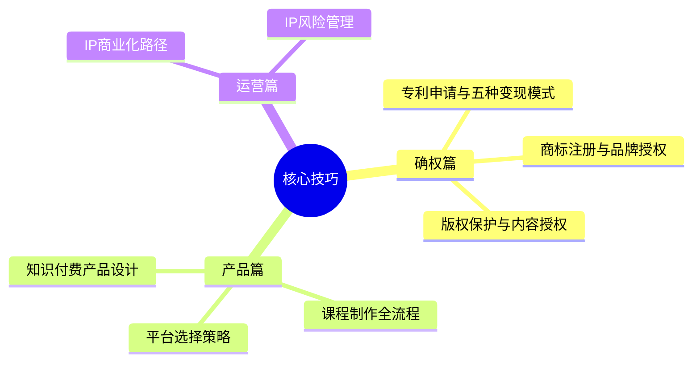
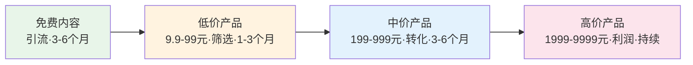
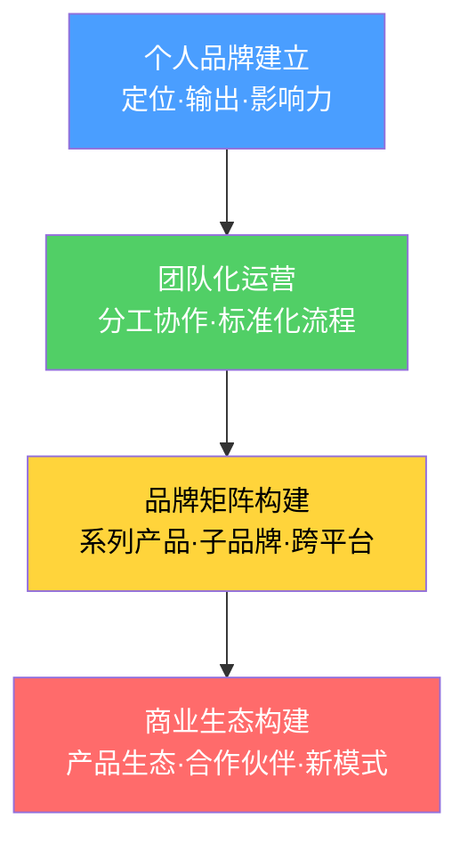

## 九、核心技巧总结

本节从八个维度系统拆解了知识产权变现的实操方法论。以下将核心知识点提炼为可直接复用的框架、决策矩阵和行动清单，帮你快速回顾并找到最适合自己的变现路径。

### 1. 核心技巧全景回顾

核心技巧覆盖了从"确权"到"产品化"再到"商业运营"的完整链条。三个层次的关系是递进的：先确权（拥有受法律保护的资产），再产品化（将资产转化为可售卖的产品），最后运营（持续放大变现效率并控制风险）。

### 2. 确权篇：三种知识产权的申请与变现

#### 2.1 专利申请与变现

专利是技术型知识产权变现的核心工具。完整的申请流程包括四个步骤：

| 步骤 | 核心任务 | 关键要点 | 费用 |
|------|----------|----------|------|
| 专利检索 | 确认新颖性 | CNIPA + Google Patents，检索国内外 | 免费 |
| 撰写申请文件 | 请求书、说明书、权利要求书、摘要、附图 | 权利要求书要"上位化"，用宽泛语言描述 | 代理费3000-8000元 |
| 提交申请 | 通过CPC客户端或专利业务办理系统 | 发明950元，实用新型500元 | 减免后低至约150元 |
| 答复审查意见 | 1-3次审查意见通知书 | 通常4个月内答复，修改权利要求或陈述意见 | 代理费另计 |

**专利变现的五种模式：**

| 模式 | 收入特征 | 风险 | 适合人群 |
|------|----------|------|----------|
| 自主实施 | 利润最高，但需市场验证 | 高 | 有产品化能力的团队 |
| 许可授权 | 持续收入，风险低 | 低 | 技术型发明人（推荐） |
| 专利转让 | 一次性收入 | 中 | 不打算自行实施的发明人 |
| 质押融资 | 获得贷款，保留专利 | 中 | 需要资金的企业 |
| 诉讼维权 | 赔偿金（许可费的1-5倍） | 高 | 有明确侵权证据的权利人 |

**关键洞察：** 许可授权的长期收益通常远超一次性转让。实战案例中，通信工程师李工仅凭1项核心专利+5项外围专利的组合，3年累计许可收入达165万元。专利布局（而非单个专利）才是许可谈判中的核心筹码。

#### 2.2 商标注册与品牌授权

商标是品牌类知识产权的核心载体，保护期10年且可无限续展，是最具长期价值的知识产权类型。

**注册策略的三层架构：**

| 层级 | 作用 | 示例（以健身品牌为例） |
|------|------|----------------------|
| 核心类别 | 覆盖主营业务 | 第41类（教育/培训）、第28类（健身器材） |
| 关联类别 | 覆盖上下游业务 | 第25类（运动服装）、第32类（运动饮料） |
| 防御类别 | 防止品牌被抢注 | 第35类（广告销售）、第9类（APP/软件） |

**品牌授权的三种模式：**

- **商品化授权：** 允许被授权方在特定商品上使用你的品牌标识，收取授权费+销售提成。典型案例是个人健身IP授权给运动品牌生产联名产品。
- **品牌加盟：** 授权品牌使用权+运营方法论，收取加盟费+持续管理费。适合已有成熟运营体系的品牌。
- **联合品牌：** 与其他品牌联合推出产品，双方共享品牌溢价。适合品牌影响力相当的合作伙伴。

**重要提醒：** 商标注册只是第一步，还需要持续监控市场、按时续展（到期前12个月启动）、发现侵权及时维权。实战案例中张老师正是通过先建立个人影响力、再注册商标、最后授权变现的路径，实现了年收入350万的品牌授权收入。

#### 2.3 版权保护与内容授权

版权是门槛最低的知识产权——创作完成即自动产生，无需申请。但要最大化变现价值，仍需要系统化的保护和运营。

**版权保护铁律：**

1. 创作完成即保留证据（时间戳、邮件自寄、云存储原始文件）
2. 高价值作品务必登记版权（费用仅100-300元，30-60个工作日出证）
3. 发现侵权立即取证，不要打草惊蛇（截图、公证、区块链存证）
4. 维权成本低于侵权获利时果断维权

**版权变现的四大方向：**

| 方向 | 变现方式 | 适合人群 | 收入预期 |
|------|----------|----------|----------|
| 图片授权 | 上传图虫、视觉中国等平台，按下载量收费 | 摄影师、插画师 | 积累1000+图库，月入数千 |
| 文字内容授权 | 授权媒体转载，按篇收费 | 自媒体人、专栏作者 | 热门作者单篇数千元 |
| 音乐版权 | 平台播放量分成+广告/影视授权 | 音乐人、作曲人 | 视传播量而定 |
| 软件著作权 | 软件销售、授权使用、企业资质申请 | 程序员、技术团队 | 可用于高企认定等 |

### 3. 产品篇：从知识到可售产品

#### 3.1 知识付费产品设计

知识付费产品的设计遵循一套从验证到上线的完整方法论。

**选题验证三步法：**

1. **你擅长** — 在这个领域有深厚的积累和实战经验，不是"了解一点"，而是能系统性地解决该领域的问题
2. **有需求** — 目标用户确实需要这方面的知识。通过知乎/百度搜索量、同类课程销量评价、社群问卷调查来验证
3. **可付费** — 用户愿意为这个知识付费。通过发布免费内容测试市场反应来验证——如果免费内容都没人看，付费产品更不可能成功

**产品阶梯设计（核心路径）：**

每一层的作用不同：免费内容负责建立信任和获取流量；低价产品筛选出愿意付费的用户；中价产品完成深度转化；高价产品才是真正的利润来源。切记不要跳过前面的层级直接卖高价产品——没有信任基础的高价产品几乎不可能成功。

#### 3.2 课程制作全流程

课程制作的完整时间线如下：

| 阶段 | 时间 | 核心任务 | 关键产出 |
|------|------|----------|----------|
| 选题与验证 | 1-2周 | 市场调研、竞品分析、免费内容测试 | 验证过的选题方向 |
| 课程开发 | 2-4周 | 大纲设计（金字塔结构）、讲稿编写、PPT制作 | 完整课程内容 |
| 录制与制作 | 1-2周 | 设备准备、录制、剪辑、字幕 | 成品视频/音频 |
| 上架与推广 | 持续 | 平台上架、多渠道推广、社群运营 | 持续收入流 |

**课程结构设计原则：**

- 每节课聚焦一个核心知识点，控制在10-20分钟
- 每节课结构：引入（2分钟）→ 讲解（8-12分钟）→ 案例（3-5分钟）→ 总结（2分钟）
- 大纲采用金字塔结构：模块→小节→知识点，从浅到深循序渐进
- 信息密度要高，避免废话注水——5小时精品课的学习完成率（65%）远高于30小时冗长课（15%）

**电子书快速创作流程（适合文字型创作者）：**

1. 确定主题（1天）— 选最擅长的细分领域
2. 列大纲（1天）— 10-15章节，每章3-5小节
3. 写作（2-4周）— 每天2000-3000字，先完成初稿再润色
4. 排版设计（2-3天）— Sigil/Vellum排版，设计封面
5. 上架销售（1天）— 豆瓣阅读、微信读书、Kindle

#### 3.3 知识付费平台选择

| 阶段 | 推荐平台 | 核心优势 | 分成模式 |
|------|----------|----------|----------|
| 初学者 | 知乎、小鹅通 | 流量大、门槛低、容易获得初始用户 | 7:3或SaaS收费 |
| 进阶者 | 多平台分发+自建平台 | 扩大覆盖面+掌控用户数据 | 各平台不同 |
| 高级者 | 自建品牌平台（小鹅通SaaS等） | 完全掌控数据和关系，利润率最高 | 全部归己 |

**核心策略：** 从第三方平台获取流量 → 逐步导入私域（微信群/企业微信） → 最终建立自控的品牌平台。实战案例中刘女士的HR课程正是从知乎引流、小鹅通落地，首年收入20万的典型路径。

### 4. 运营篇：IP商业化与风险管理

#### 4.1 IP商业化路径

IP商业化遵循从个人品牌到商业品牌的四阶段升级：

**变现路径的三条主线：**

| 路径 | 具体方式 | 特点 |
|------|----------|------|
| 直接变现 | 出售IP、许可授权、专利许可费 | 见效快，但天花板受限于IP数量 |
| 间接变现 | 产品溢价、品牌影响力、竞争壁垒 | 见效慢，但长期价值最高 |
| 组合变现 | 专利池授权、品牌矩阵、IP生态 | 复杂度高，但天花板最高 |

#### 4.2 IP风险管理

知识产权风险分为"被侵权"和"侵权他人"两个方向，需要双向防护。

**防被侵权的四道防线：**

1. **确权防线：** 所有核心IP必须完成确权（专利申请、商标注册、版权登记），确权是维权的基础
2. **监控防线：** 定期在电商平台、社交媒体、搜索引擎监控是否有侵权行为。可以使用图片反向搜索、商标监控服务等工具
3. **取证防线：** 发现侵权后第一时间固定证据——截图公证、购买侵权产品保留实物证据、记录侵权规模和获利情况
4. **维权防线：** 根据侵权严重程度选择策略——轻微侵权发律师函警告，严重侵权提起行政投诉或诉讼

**防侵权他人的三个习惯：**

1. 使用他人内容前确认授权状态，图片用正规图库，文字引用注明来源
2. 产品命名和设计发布前做商标检索和专利检索
3. 员工/合作方产出的内容要明确知识产权归属（合同约定）

**知识产权保险（进阶工具）：**

| 保险类型 | 覆盖范围 | 适合场景 |
|----------|----------|----------|
| 侵权责任保险 | 被诉侵权的赔偿和律师费 | 产品发布前的风控 |
| 维权保险 | 主动维权的律师费和诉讼费 | 拥有高价值IP的权利人 |
| 专利有效性保险 | 专利被无效的风险 | 高价值专利持有者 |

### 5. 八节核心技巧的决策矩阵

面对八种不同的技巧，读者需要一个清晰的决策框架来判断从哪里入手。以下矩阵基于"自身资源"和"变现速度"两个维度：

| 你拥有的资源 | 推荐起点 | 所需投入 | 预期回报周期 |
|-------------|----------|----------|------------|
| 技术方案/算法/工艺 | 专利申请（第一节） | 检索+申请费用500-8000元 | 6-18个月 |
| 品牌名/Logo/设计 | 商标注册（第二节） | 注册费300元/类 | 6-12个月 |
| 文章/图片/视频/代码 | 版权登记（第三节） | 登记费100-300元 | 1-6个月 |
| 专业知识/教学能力 | 知识付费产品（第四-六节） | 时间投入为主 | 3-12个月 |
| 已有IP资产 | IP商业化（第七节） | 运营费用视规模而定 | 持续 |
| 以上任何一种 | 风险管理（第八节） | 基本监控免费，维权费用另计 | 即时（防损） |

**最常见的起步路径：** 对于大多数个人创作者，建议从"版权+知识付费"组合切入——版权保护门槛最低（创作即拥有），知识付费产品变现最直接（从免费内容到付费课程的路径已被大量案例验证）。先在知乎/公众号/B站积累影响力，再通过小鹅通等平台将流量转化为付费用户。

### 6. 核心技巧与理论基础的对应关系

核心技巧不是凭空产生的实操步骤，每一条技巧背后都有理论基础的支撑。理解这种对应关系，能帮你举一反三——当场景变化时，你可以从原理出发推导出新的操作方法。

| 核心技巧 | 对应理论基础 | 关键原理 |
|----------|-------------|----------|
| 专利申请与变现 | 知识产权四大类型（专利权）+ 经济学分析（独占性定价权） | 专利赋予技术方案排他性使用权，通过许可/转让/实施实现变现 |
| 商标注册与品牌授权 | 知识产权四大类型（商标权）+ 经济学分析（品牌溢价） | 品牌具有网络效应——越多人认可，价值越高 |
| 版权保护与内容授权 | 知识产权四大类型（版权）+ 知识付费经济学（时间价值） | 版权自动产生但需登记强化保护，内容的价值在于帮用户节省时间 |
| 知识付费产品设计 | 知识付费经济学（信息不对称+筛选价值） | 卖的不是知识本身，而是筛选+结构化+可执行的效率 |
| 课程制作全流程 | 变现底层逻辑（创造×保护×运营） | 课程是"创造"环节的产物，需要同步考虑保护和运营 |
| 平台选择策略 | 变现底层逻辑（运营放大器） | 平台是运营工具，不同阶段选择不同平台 |
| IP商业化路径 | 商业化运营体系（从单一到矩阵） | IP的终极形态是品牌，所有变现都应指向品牌资产构建 |
| IP风险管理 | 常见误区（不保护的代价） | 不保护等于替竞争对手做免费市场调研 |

### 7. 本节关键数据速查

以下汇总本节涉及的关键费用、周期和收入数据，供快速参考：

**费用速查：**

| 项目 | 标准费用 | 减免后费用（个人年收入<6万） |
|------|----------|--------------------------|
| 发明专利申请费 | 950元 | 约143元（减免85%） |
| 实用新型申请费 | 500元 | 约75元 |
| 外观设计申请费 | 500元 | 约75元 |
| 商标注册费（网上） | 300元/类 | 无减免 |
| 版权登记费 | 100-300元 | 无减免 |
| 专利代理费 | 3000-8000元/件 | 协商 |

**周期速查：**

| 事项 | 所需时间 |
|------|----------|
| 发明专利从申请到授权 | 2-3年 |
| 实用新型专利从申请到授权 | 6-12个月 |
| 外观设计专利从申请到授权 | 3-6个月 |
| 商标注册从申请到拿证 | 6-9个月 |
| 版权登记 | 30-60个工作日 |
| 课程从零到上架 | 6-10周 |

### 8. 行动清单

读完本节全部内容后，按照以下清单逐项执行，将知识转化为行动：

**立即执行（本周）：**

- [ ] 梳理自己已有的知识产权资产（文章、代码、设计、技术方案、品牌名等）
- [ ] 选择最匹配自身资源的变现起点（参考第五节决策矩阵）
- [ ] 如果有高价值原创作品，提交版权登记申请（100-300元即可）

**短期推进（本月）：**

- [ ] 如果走技术路线：完成专利检索，评估是否值得申请
- [ ] 如果走品牌路线：进行商标近似查询并提交注册申请
- [ ] 如果走知识付费路线：设计课程大纲，在免费平台发布内容验证市场需求

**中期目标（3-6个月）：**

- [ ] 完成第一个付费产品（课程/电子书/付费专栏）的制作和上架
- [ ] 在至少2个平台分发产品，建立推广渠道
- [ ] 建立基本的侵权监控机制

**长期规划（1年）：**

- [ ] 从单一产品扩展到产品阶梯（免费→低价→中价→高价）
- [ ] 建立个人IP品牌定位，持续输出专业内容
- [ ] 构建完整的知识产权保护体系（版权+商标+可能的专利）
- [ ] 评估是否需要知识产权保险

> **核心心法：** 核心技巧的本质是一套"从零到一"的操作系统。它不要求你一开始就掌握所有技巧，而是要求你找到最适合自己的切入点，先跑通一个最小闭环（创造→保护→变现），再逐步扩展到其他技巧。先完成，再完美——一个申请了保护的60分专利，远比一个还在构思中的100分创意更有价值。
