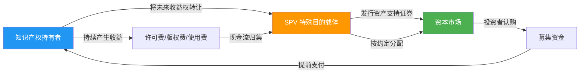
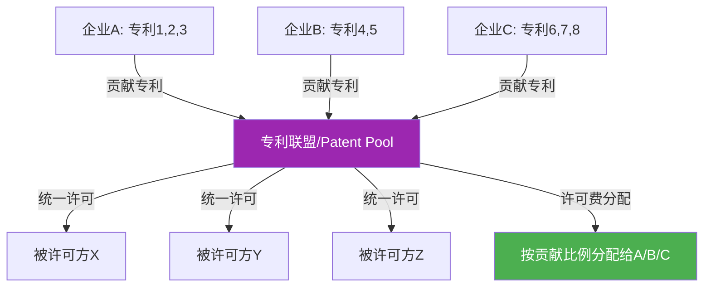
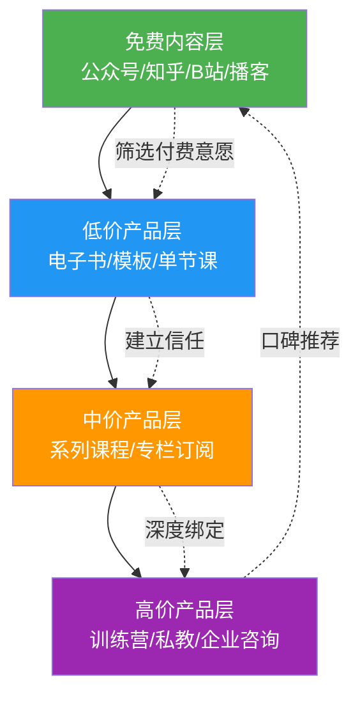
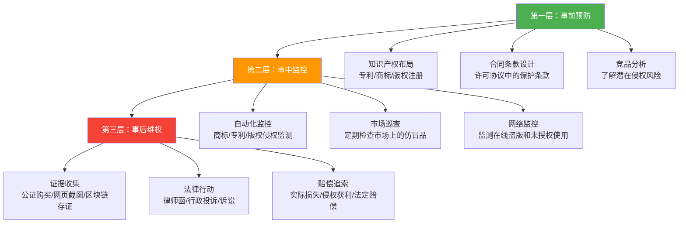

## 六、知识产权变现的进阶策略

当基础的许可授权、内容付费、品牌授权等路径跑通之后，知识产权变现还有更高的天花板。本节聚焦四个进阶维度：**金融化运作**、**联盟与标准化博弈**、**数字内容的深度变现**、以及**系统性风险管理**。每一个维度都对应一套完整的方法论和实操框架。

---

### 6.1 知识产权的金融化运作

知识产权不仅是法律权利，更是可以进入金融市场的资产类别。理解其金融化路径，是从"卖内容"到"经营资产"的关键跃迁。

#### 6.1.1 知识产权证券化（IP Securitization）

知识产权证券化是将知识产权产生的未来现金流（如许可费、版权分成、专利使用费）打包成标准化金融产品，在资本市场出售给投资者，从而提前获得大额资金的融资方式。

**核心原理**

SPV（Special Purpose Vehicle，特殊目的载体）是证券化的核心法律结构，它的作用是将知识产权资产与原始持有者的其他资产隔离开来，确保即使持有者破产，投资者的权益也不受影响。

**操作流程详解**

| 步骤 | 具体动作 | 关键要点 |
|------|----------|----------|
| 1. 资产筛选 | 从知识产权组合中筛选现金流稳定的资产 | 优先选择已产生3年以上稳定收入的知识产权 |
| 2. 现金流建模 | 对未来5-10年的许可费、版权收入进行预测建模 | 需要考虑衰退曲线、续约概率、市场变化 |
| 3. 设立SPV | 在税收友好的司法管辖区注册特殊目的公司 | 常用地点：开曼群岛、特拉华州、新加坡 |
| 4. 资产转让 | 将知识产权的收益权（非所有权本身）转让给SPV | 需要专业的法律文件和税务规划 |
| 5. 信用增级 | 通过内部增级（超额抵押、储备金）或外部增级（担保、保险）提升信用评级 | 信用评级直接影响发行利率 |
| 6. 证券发行 | 由投行承销，在资本市场发行资产支持证券 | 通常分为优先级、中间级、劣后级 |
| 7. 存续管理 | SPV持续归集现金流，按约定向投资者分配收益 | 需要独立的资产服务机构 |

**经典案例：Bowie Bonds**

1997年，音乐人大卫·鲍伊（David Bowie）将其25张专辑的未来版权收入证券化，发行了5500万美元的"Bowie Bonds"，期限15年，年利率7.9%。这是全球首例音乐版权证券化。

- **底层资产**：25张专辑约300首歌曲的版权收入（包括唱片销售分成、广播播放费、授权许可费）
- **投资者**：保诚保险公司（Prudential Insurance）全额认购
- **结果**：鲍伊提前获得5500万美元现金，用于购买其前经纪人持有的专辑版权
- **启示**：版权证券化的核心前提是现金流的可预测性和稳定性

后来，Jewel、James Brown、Iron Maiden等音乐人也采用了类似模式。2017年，流媒体的爆发式增长使得音乐版权现金流更加可预测，Hipgnosis Songs Fund等音乐版权投资基金开始大规模收购和证券化音乐版权。

**适用条件评估**

并非所有知识产权都适合证券化。以下是评估框架：

| 评估维度 | 适合证券化 | 不适合证券化 |
|----------|------------|-------------|
| 现金流稳定性 | 连续3年以上稳定收入 | 收入波动大或尚未产生收入 |
| 资产多样性 | 组合中有多个独立收入来源 | 依赖单一产品或单一客户 |
| 法律确定性 | 权属清晰、保护期长 | 权属存在争议或即将到期 |
| 剩余保护期 | 至少10年以上 | 不足5年 |
| 可预测性 | 历史数据充足、趋势可建模 | 新兴领域、无法建模预测 |

**个人和中小企业的替代方案**

对于个人创作者或中小企业，完整的证券化流程（设立SPV、信用评级、投行承销）成本过高。但可以借鉴其底层逻辑：

1. **应收账款质押融资**：将已签订的许可合同中的未来应收许可费质押给银行或保理公司，获得提前融资。国内多家银行已开展知识产权质押贷款业务。
2. **版权预售**：在内容制作完成前，基于已有的品牌影响力和历史数据，预售未来内容的独家分发权。
3. **收益权众筹**：通过合规的众筹平台，将未来收益权拆分出售给多个小额投资者。

#### 6.1.2 知识产权质押融资

知识产权质押融资是比证券化更轻量级的金融化方式，适合中小企业和个人创作者。

**操作流程**

1. **评估知识产权价值**：委托专业评估机构出具评估报告。国内常用方法包括成本法、市场法、收益法三种：
   - **成本法**：基于创造该知识产权的直接和间接成本，适合尚无收益的早期IP
   - **市场法**：参考类似知识产权的交易价格，适合有活跃交易市场的品类
   - **收益法**：基于未来收益的折现值，适合已有稳定现金流的IP
2. **选择融资机构**：商业银行（利率低但审批严）、知识产权运营公司（灵活但利率高）、政府专项基金（利率优惠但额度有限）
3. **办理质押登记**：到国家知识产权局或版权局办理质押登记，确保法律效力
4. **获得融资**：通常可获得评估价值的30%-60%作为融资额度

**国内政策支持**

近年来中国政府大力推动知识产权金融化：
- 国家知识产权局推动"知识产权质押融资入园惠企"行动
- 多地设立知识产权质押融资风险补偿基金，政府承担部分坏账风险
- 部分地区对知识产权质押融资给予贴息补助
- 2023年全国专利和商标质押融资金额超过8000亿元

#### 6.1.3 知识产权信托

知识产权信托是将知识产权委托给信托公司管理和运营，由专业团队实现资产增值的模式。

**运作机制**：知识产权持有者将权利委托给信托公司 → 信托公司制定运营策略（许可、转让、诉讼维权等） → 产生的收益按信托合同分配

**优势**：
- 专业管理：信托公司有专业的法务和商务团队
- 风险隔离：信托资产独立于委托人的其他资产
- 持续运营：即使委托人去世，信托仍可继续运营和变现

**适用场景**：家族知识产权传承、艺术家遗产管理、企业知识产权组合的专业化运营

---

### 6.2 知识产权的联盟策略与标准化博弈

单打独斗的知识产权变现效率有限。通过联盟和标准化，可以实现"1+1>2"的协同效应，但同时也需要更复杂的博弈能力。

#### 6.2.1 专利联盟（Patent Pool）

专利联盟是多家企业将各自的专利组合在一起，形成一个专利池，统一对外许可的组织形式。

**运作机制**

**经典案例：MPEG-LA**

MPEG-LA是全球最成功的专利联盟之一，管理着MPEG-2、MPEG-4、H.264、H.265等视频编解码标准的专利许可：

- **参与方**：包括苹果、三星、微软、飞利浦、索尼等数十家企业
- **运作模式**：将多个权利人的必要专利打包，提供"一站式"许可
- **许可费率**：H.264标准对每台设备收取约0.20美元的许可费
- **年收入**：MPEG-LA每年管理的许可费收入超过10亿美元
- **分配机制**：根据各权利人贡献的必要专利数量和质量按比例分配

**专利联盟的优劣势**

| 维度 | 优势 | 劣势 |
|------|------|------|
| 交易成本 | 一次性获取多项专利许可，降低谈判成本 | 加入联盟需要让渡部分定价权 |
| 侵权风险 | 联盟成员之间交叉许可，降低互诉风险 | 联盟外的专利仍需单独处理 |
| 收入稳定性 | 联盟统一运营，收入更可预测 | 分配机制可能不够公平 |
| 市场影响力 | 联盟形成的专利组合更具谈判筹码 | 可能面临反垄断审查 |

**加入或创建专利联盟的实操要点**

1. **评估自身专利的必要性**：只有被认定为"必要专利"（Essential Patent）的专利才能进入联盟。必要性评估通常由独立的第三方评估机构完成。
2. **选择合适的联盟**：不同的联盟有不同的治理结构、许可费率和分配机制。要仔细比较。
3. **贡献专利的估值**：联盟通常会委托第三方对贡献的专利进行估值，作为许可费分配的依据。
4. **注意反垄断合规**：专利联盟在多个国家受到反垄断审查。美国司法部和欧盟委员会都有针对专利联盟的反垄断指南。

#### 6.2.2 标准必要专利（SEP）策略

标准必要专利（Standard Essential Patent, SEP）是指实施某一技术标准时不可避免要使用的专利。拥有SEP意味着在该技术领域拥有不可绕过的许可收入来源。

**SEP的核心价值**

以5G通信为例，全球5G SEP的许可费总额预计每年超过100亿美元。高通、华为、爱立信、诺基亚等公司通过拥有大量5G SEP，每年获取数十亿美元的许可收入。

高通的商业模式就是SEP变现的典型案例：
- 每一部使用高通SEP的手机，都需要向高通支付售价的3.25%-5%作为许可费
- 即使手机厂商不使用高通的芯片，只要使用了符合3G/4G/5G标准的技术，就需要付费
- 2023财年，高通的专利许可收入约为55亿美元

**FRAND承诺**

加入标准化组织（如ETSI、IEEE、ITU）通常需要承诺以"公平、合理和非歧视"（Fair, Reasonable and Non-Discriminatory, FRAND）条款许可其SEP。

- **公平（Fair）**：不能拒绝向任何请求者许可
- **合理（Reasonable）**：许可费率必须在合理范围内
- **非歧视（Non-Discriminatory）**：对所有被许可方收取相同的费率

FRAND承诺既是对SEP持有人的约束，也是对被许可方的保护。在实际执行中，"合理"费率的确定是最具争议的问题，通常需要通过谈判、仲裁或诉讼来确定。

**个人和中小企业的SEP策略**

虽然个人和中小企业很难直接参与通信等高门槛领域的标准化工作，但在新兴技术领域（如AI模型接口标准、Web3协议、IoT数据格式等），仍有参与标准化的机会：

1. **关注行业标准制定动态**：加入相关的标准化组织或行业协会
2. **在标准讨论阶段提交技术方案**：如果方案被采纳，相关专利就可能成为SEP
3. **评估已有专利的标准必要性**：请专业机构评估自己的专利是否可能被认定为某个标准的必要专利
4. **通过联盟参与**：如果单独参与力量不足，可以加入或组建专利联盟

#### 6.2.3 开放创新与选择性开放

开放创新不是放弃知识产权，而是通过有策略的开放来构建更大的商业生态。

**开放策略矩阵**

| 开放程度 | 策略 | 典型案例 | 商业逻辑 |
|----------|------|----------|----------|
| 完全开源 | 开源许可（MIT/Apache） | Linux、TensorFlow | 建立生态标准，通过服务变现 |
| 有限开放 | 开放核心+商业增值 | Red Hat、Elastic | 社区贡献降低开发成本，商业版盈利 |
| 交叉许可 | 与竞争对手互相许可 | 三星与苹果 | 降低诉讼风险，专注产品竞争 |
| 专利承诺 | 承诺不起诉特定使用者 | Tesla 2014年开放专利 | 扩大电动车市场，做大蛋糕 |
| 标准贡献 | 将专利贡献给标准组织 | 华为贡献5G专利 | 获取FRAND许可费+行业影响力 |

**Tesla开放专利的深层逻辑**

2014年，Elon Musk宣布开放Tesla的所有专利，允许其他企业"善意使用"。表面看是放弃了专利保护，实际逻辑是：

1. **做大市场蛋糕**：电动车市场太小，需要更多参与者推动充电基础设施建设
2. **锁定技术路线**：让更多企业采用Tesla的充电标准（后来确实成为北美标准NACS）
3. **吸引人才**：开放姿态提升企业形象，吸引顶尖工程师
4. **政府补贴**：推动行业增长有助于维持政府对新能源车的补贴政策

这个案例说明，知识产权的战略价值有时远超其直接许可收入。

---

### 6.3 数字内容的知识产权深度变现

数字内容领域的知识产权变现已经远超"卖课"和"卖图"，形成了多层次、多触点的变现矩阵。

#### 6.3.1 知识付费的进阶模式

| 模式 | 价格区间 | 特点 | 适用场景 | 收入预期 | 复购率 |
|------|----------|------|----------|----------|--------|
| 单次购买 | 9.9-199元 | 一次性付费，标准化交付 | 电子书、单节课程、模板 | 中等 | 低（5-15%） |
| 订阅制 | 19-99元/月 | 持续付费，定期更新 | Newsletter、持续更新专栏 | 稳定 | 中（30-50%） |
| 会员制 | 199-999元/年 | 分层付费，社群+内容+服务 | 付费社群、VIP社区 | 较高 | 高（40-70%） |
| 企业定制 | 5000-50000元 | B2B付费，定制化交付 | 企业内训、定制方案 | 高 | 高（续签60%+） |
| 咨询服务 | 500-5000元/小时 | 一对一或小组，高客单价 | 战略咨询、个人教练 | 很高 | 中（客户终身价值高） |
| 训练营 | 999-9999元 | 限时、高强度、社群驱动 | 技能训练、项目实战 | 高 | 中（30-50%） |

**关键洞察：漏斗模型的升级版**

传统的漏斗模型（免费→低价→高价）已经不够用了。进阶的变现模型是"同心圆"：

关键区别在于：漏斗是线性的（用户一路向上），同心圆是多触点的（用户可以在任何层级停留，也可以同时存在于多个层级）。一个忠实用户可能既是你的免费内容消费者，也是训练营学员，还是企业咨询客户。

#### 6.3.2 数字版权的多维度变现

**图片版权变现的完整路径**

| 平台类型 | 代表平台 | 分成比例 | 特点 | 适合谁 |
|----------|----------|----------|------|--------|
| 微利图库 | Shutterstock、iStock | 15%-45% | 走量，单张收入低 | 摄影初学者 |
| 创意图库 | Adobe Stock、Getty | 25%-45% | 质量要求高，单价较高 | 专业摄影师 |
| 国内图库 | 视觉中国、站酷海洛 | 20%-50% | 国内市场，中文素材需求大 | 国内摄影师/设计师 |
| AI生成图 | Midjourney/DALL-E生成 → 授权 | 自定义 | 新兴市场，版权归属待定 | AI创作者 |
| 独立销售 | 个人网站 + Gumroad | 90%-95% | 需要自己引流 | 有粉丝基础的创作者 |

**视频版权变现策略**

视频内容的版权变现比图片复杂得多，因为涉及更多权利层次：

1. **信息网络传播权**：在视频平台（YouTube、B站、抖音）的播放分成
2. **改编权**：授权他人对你的视频进行二次创作（如翻译、剪辑）
3. **出版权**：将视频课程出版为实体DVD或配套教材
4. **肖像权**：如果视频中出现了你的形象，肖像权也是独立的权利
5. **音乐版权**：视频中的原创音乐可以独立授权

**音乐版权的进阶变现**

音乐版权是被严重低估的变现渠道。除了传统的流媒体播放分成，还有：

- **同步授权（Sync License）**：授权音乐用于影视、广告、游戏、短视频。单次授权费从几百元到几十万元不等。
- **机械复制权**：授权音乐被复制到实体介质（CD、黑胶唱片）或数字下载
- **表演权**：音乐在公共场所播放（餐厅、商场、健身房）时的授权费，由音著协等集体管理组织代收
- **采样授权**：其他音乐人使用你的音乐片段进行新创作时的授权费
- **AI训练授权**：授权AI公司使用你的音乐进行模型训练（新兴市场）

**字体版权变现**

字体设计是一个小众但利润丰厚的知识产权领域。国内字体市场规模约30亿元，且每年增长15%以上。

- **商业授权**：企业使用字体需购买商业授权，单字体授权费从几千到几十万元不等
- **平台授权**：通过方正字库、汉仪字库等平台分发，平台通常收取30%-50%的分成
- **定制字体**：为企业设计专属字体，项目费通常在50万-500万元
- **个人免费+商业收费**：个人非商用免费，商业使用收费，降低传播门槛的同时保护商业利益

#### 6.3.3 AI时代的内容版权新议题

AI生成内容的版权归属是2023年以来最热门的知识产权议题之一。

**核心法律问题**

| 问题 | 现状（截至2025年） | 实操建议 |
|------|-------------------|----------|
| AI生成内容是否有版权？ | 美国：纯AI生成不受保护；中国：有一定保护但标准不清 | 保留创作过程记录，证明人类创作贡献 |
| AI训练使用版权内容是否侵权？ | 美国：合理使用抗辩进行中；中国：尚无明确判例 | 在AI工具的训练数据中加入自己的内容时要谨慎 |
| 使用AI辅助创作的作品版权归谁？ | 取决于人类创作贡献的程度 | 明确标注AI辅助程度，保留人工修改记录 |
| AI生成内容的风格模仿是否侵权？ | 目前风格本身不受版权保护 | 但直接复制特定作品的元素可能侵权 |

**实操建议**

1. **使用AI工具时保留创作链**：保存提示词（prompt）、中间结果、人工修改记录，证明人类创作贡献
2. **在许可协议中明确AI使用条款**：如果你授权他人使用你的内容，明确是否允许用于AI训练
3. **关注各国立法动态**：AI版权法律正在快速变化，需要持续关注
4. **考虑"人机协作"版权策略**：将AI作为工具而非创作者，确保最终作品有足够的独创性

---

### 6.4 跨境知识产权变现

在全球化和数字化的双重驱动下，知识产权变现早已不局限于国内市场。

#### 6.4.1 跨境版权变现的渠道

| 目标市场 | 主要渠道 | 注意事项 |
|----------|----------|----------|
| 英语市场 | Amazon KDP、Udemy、Gumroad、YouTube | 需要英文内容或高质量翻译 |
| 日本市场 | Amazon.co.jp、note.com、ニコニコ | 日本版权保护意识极强，盗版率低 |
| 东南亚市场 | Shopee、Lazada、TikTok Shop | 价格敏感，低价策略为主 |
| 全球市场 | Patreon、Substack、Teachable | 需要持续英文内容输出 |

#### 6.4.2 PCT国际专利申请

如果你拥有技术专利并希望在全球范围内变现，PCT（专利合作条约）国际申请是必经之路。

**申请流程**

1. **国内优先申请**：先在中国提交专利申请，获得优先权日
2. **PCT国际申请**：在优先权日起12个月内提交PCT申请
3. **国际检索**：由国际检索单位出具检索报告，评估专利的可专利性
4. **国际公布**：在优先权日起18个月后公布
5. **进入国家阶段**：在优先权日起30/31个月内选择进入哪些国家/地区
6. **各国审查**：各国专利局独立审查，决定是否授予专利

**费用估算**

| 阶段 | 费用范围（人民币） | 说明 |
|------|-------------------|------|
| 国内申请 | 5000-20000 | 含代理费 |
| PCT国际申请 | 30000-50000 | 含国际局费用和代理费 |
| 每个国家进入 | 20000-80000 | 因国家而异 |
| 全程代理 | 150000-500000 | 3-5个主要市场 |

**成本优化策略**：先进入最重要的市场（通常是中国、美国、欧洲），在获得收入后再扩展到其他市场。

#### 6.4.3 马德里商标国际注册

商标的国际注册通过马德里体系可以一次性在多个成员国申请，大幅降低成本。

- **基础费用**：约653瑞士法郎（黑白商标）或903瑞士法郎（彩色商标）
- **补充费用**：每个指定国家额外收取费用
- **覆盖范围**：130个成员国，覆盖全球贸易的80%以上
- **有效期**：10年，可续展

---

### 6.5 知识产权的系统性风险管理

知识产权变现的另一面是风险管理。缺乏风险管理的变现策略，可能让你在获得收入的同时暴露在巨大的法律和商业风险中。

#### 6.5.1 侵权风险防范体系

**三层防御体系**

**自动化监控工具推荐**

| 监控对象 | 工具/服务 | 功能 | 费用 |
|----------|----------|------|------|
| 商标侵权 | 阿里知识产权保护平台 | 监控电商平台上的仿冒商品 | 免费（权利人注册） |
| 版权侵权 | 维权骑士、原创宝 | 监控全网内容抄袭 | 按案件收费 |
| 专利侵权 | 智慧芽、Incopat | 监控竞品专利申请动态 | 订阅制，数千-数万元/年 |
| 域名侵权 | WHOIS监控 | 监控与品牌相似的域名注册 | 免费-低价 |
| 社交媒体 | 各平台举报机制 | 监控社交媒体上的未授权使用 | 免费 |

#### 6.5.2 被侵权应对策略

当发现自己的知识产权被侵权时，需要根据侵权程度和维权成本选择合适的应对策略。

**维权路径选择**

| 维权方式 | 适用场景 | 时间 | 成本 | 赔偿预期 |
|----------|----------|------|------|----------|
| 平台投诉 | 电商平台/社交媒体上的侵权 | 3-30天 | 低（基本免费） | 下架/删除，通常无赔偿 |
| 律师函警告 | 中小规模侵权，对方有支付能力 | 1-2周 | 1000-5000元 | 和解赔偿，通常数千-数万元 |
| 行政投诉 | 假冒商标、盗版等明显侵权 | 1-6个月 | 低 | 行政罚款+没收侵权产品 |
| 民事诉讼 | 大规模侵权，需要经济赔偿 | 6-24个月 | 5万-50万元 | 实际损失或侵权获利 |
| 刑事报案 | 大规模假冒、盗版，金额巨大 | 6-36个月 | 低（公安侦查） | 刑事处罚+附带民事赔偿 |

**证据保全的关键技巧**

1. **公证购买**：通过公证处对侵权产品进行公证购买，确保证据的法律效力。费用约500-2000元/次。
2. **时间戳存证**：使用可信时间戳服务对侵权网页进行存证。联合信任时间戳服务中心（TSA）是国内常用的服务。
3. **区块链存证**：将侵权证据上链存证，确保不可篡改。互联网法院已认可区块链存证的法律效力。
4. **网页取证**：使用网页取证工具（如"真相科技"、"IP360"）自动截取侵权网页并生成取证报告。

#### 6.5.3 知识产权保险

知识产权保险是转移知识产权风险的金融工具，分为两大类：

**防御型保险（被诉侵权时使用）**

- **侵权责任保险**：当你被指控侵犯他人知识产权时，保险覆盖律师费、诉讼费和赔偿金
- **专利无效保险**：当你的专利被他人提出无效请求时，保险覆盖应对费用
- **适用场景**：技术密集型行业（软件、电子、医药），被诉侵权风险较高

**进攻型保险（主动维权时使用）**

- **维权费用保险**：当你主动起诉侵权方时，保险覆盖律师费和诉讼费
- **适用场景**：发现侵权行为但维权成本过高，保险可以降低维权的经济风险

**费用参考**

| 保险类型 | 年保费范围 | 覆盖额度 | 适用对象 |
|----------|----------|----------|----------|
| 侵权责任保险 | 5000-50000元 | 50万-500万元 | 中小企业、技术创业者 |
| 维权费用保险 | 10000-100000元 | 50万-1000万元 | 拥有核心IP的企业 |
| 综合IP保险 | 20000-200000元 | 100万-2000万元 | 大型企业 |

#### 6.5.4 知识产权尽职调查

在以下场景中，知识产权尽职调查（IP Due Diligence）是必不可少的：

- **企业并购**：收购方需要评估目标公司的知识产权资产价值和风险
- **融资/投资**：投资方需要了解被投企业的知识产权状况
- **上市准备**：IPO过程中需要对知识产权进行全面审查
- **合作谈判**：在技术合作、联合开发前评估双方的知识产权状况

**尽职调查清单**

| 调查维度 | 具体内容 | 关注重点 |
|----------|----------|----------|
| 权属确认 | 专利/商标/版权的注册状态 | 是否存在权属争议、共有权人 |
| 有效性 | 专利是否仍在有效期内 | 年费是否按时缴纳、是否被提出无效 |
| 侵权风险 | 是否存在侵犯他人权利的可能 | 自由实施（FTO）分析 |
| 许可状况 | 已签订的许可协议内容 | 是否存在排他许可、许可限制 |
| 诉讼状况 | 是否存在未决的知识产权诉讼 | 诉讼结果对资产价值的影响 |
| 研发记录 | 研发文档、实验记录 | 确认发明人、创作过程 |

---

### 6.6 知识产权变现的税务优化

知识产权变现涉及的税务处理直接影响最终收益。合理的税务规划可以在合法合规的前提下显著降低税负。

#### 6.6.1 个人创作者的税务处理

| 收入类型 | 税目 | 税率 | 优化方式 |
|----------|------|------|----------|
| 稿酬收入 | 稿酬所得 | 实际税率约11.2%（预扣20%×70%） | 年度汇算清缴时可能退税 |
| 特许权使用费 | 特许权使用费所得 | 预扣20%，年度3%-45%综合 | 利用年度6万免税额和专项扣除 |
| 个体经营 | 经营所得 | 5%-35% | 注册个体户，享受小规模纳税人优惠 |
| 企业收入 | 企业所得税 | 25%（小微5%） | 设立小微企业，享受税收优惠 |

#### 6.6.2 知识产权出资与转让的税务处理

**技术入股递延纳税**：根据财税〔2016〕101号文，个人以技术成果投资入股，可以选择递延至转让股权时缴纳个人所得税，这为技术创业者提供了显著的现金流优势。

**专利转让的税收优惠**：
- 居民企业技术转让所得不超过500万元的部分免征企业所得税
- 超过500万元的部分减半征收企业所得税
- 技术转让免征增值税（需备案）

---

### 6.7 进阶策略的实施路径

将上述进阶策略落地，需要一个清晰的实施路径。

#### 6.7.1 成熟度评估

在选择进阶策略之前，先评估自己的知识产权变现成熟度：

| 成熟度等级 | 特征 | 适合的进阶策略 |
|------------|------|----------------|
| L1 初级 | 刚开始有知识产权变现收入 | 聚焦税务优化和基础风险管理 |
| L2 成长 | 已有稳定收入来源（月入1万+） | 探索多维度变现和跨境渠道 |
| L3 成熟 | 多个收入来源，年入50万+ | 考虑金融化运作和联盟策略 |
| L4 领先 | 知识产权组合年入200万+ | 证券化、SEP策略、国际布局 |

#### 6.7.2 90天进阶计划

**第1-30天：基础建设**
- 完成知识产权资产盘点（专利、商标、版权、商业秘密）
- 建立侵权监控机制（至少使用1个免费工具）
- 咨询税务顾问，优化当前的税务结构
- 评估知识产权保险的必要性

**第31-60天：能力拓展**
- 研究目标市场的跨境变现渠道
- 评估专利联盟或标准化组织的参与机会
- 搭建多维度变现矩阵（至少增加2个新的变现渠道）
- 建立证据保全和维权预案

**第61-90天：系统优化**
- 评估金融化运作的可行性（质押融资、信托等）
- 制定3年知识产权变现战略规划
- 建立知识产权尽职调查的自查机制
- 优化许可协议模板，强化保护条款

---

### 6.8 本节核心要点

| 进阶维度 | 核心策略 | 关键行动 | 适用阶段 |
|----------|----------|----------|----------|
| 金融化 | 证券化、质押融资、信托 | 现金流建模、选择融资方式 | L3-L4 |
| 联盟化 | 专利联盟、SEP、开放创新 | 参与标准化、构建专利组合 | L2-L4 |
| 数字深度变现 | 多层次变现、AI版权、跨境 | 搭建变现矩阵、关注AI立法 | L1-L4 |
| 风险管理 | 三层防御、维权策略、保险 | 建立监控机制、制定维权预案 | L1-L4 |
| 税务优化 | 递延纳税、技术入股、优惠利用 | 咨询专业税务顾问 | L2-L4 |
| 跨境布局 | PCT专利、马德里商标、海外渠道 | 选择目标市场、启动国际申请 | L3-L4 |

知识产权变现的进阶不是一蹴而就的，而是一个持续迭代、逐步升级的过程。从基础的风险管理做起，逐步探索金融化和国际化，最终构建一个完整的知识产权运营体系。核心原则始终不变：**让每一份知识产权创造的价值最大化，同时将风险控制在可承受的范围内**。
