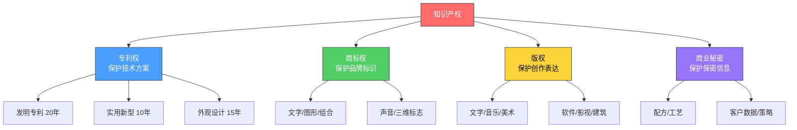
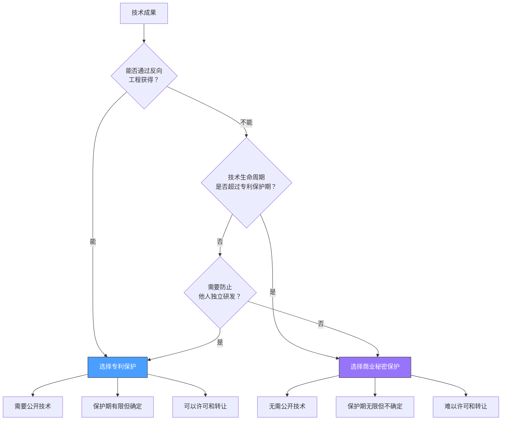

## 一、知识产权的四大类型

知识产权（Intellectual Property，简称IP）是指人类智力劳动成果依法享有的专有权利。它是现代社会经济运行的基础制度之一——没有知识产权保护，创新者将无法从自己的创造中获得回报，整个社会的创新动力也会随之枯竭。

在中国法律体系中，知识产权主要分为四大类型：**专利权、商标权、版权（著作权）、商业秘密**。每种类型保护不同的智力成果，适用不同的法律规则，也有截然不同的变现路径。理解这四种类型的本质差异和各自适用场景，是知识产权变现的第一步。

### 1.1 专利权：技术方案的法律盾牌

#### 什么是专利权

专利权是国家依法授予发明人或设计人在一定期限内对其发明创造享有的独占权。换言之，专利的本质是一种**"以公开换保护"的契约**：你把自己的技术方案完整公开，换取国家在一定年限内禁止他人未经许可使用该技术。

这个"公开换保护"的机制非常重要，它直接决定了专利变现的核心逻辑：

- **公开性**意味着你的技术方案会被记录在专利数据库中，任何人都能检索到。
- **独占性**意味着在保护期内，即使别人独立研发出了相同技术，也不能实施——除非获得你的许可。
- **期限性**意味着专利不是永久的，保护期届满后技术进入公有领域，任何人都可以免费使用。

#### 三种专利类型详解

专利法将专利分为三种类型，它们在保护对象、审批标准、保护期限和申请成本上有显著差异：

| 维度 | 发明专利 | 实用新型专利 | 外观设计专利 |
|------|----------|--------------|--------------|
| **保护对象** | 产品、方法或其改进的技术方案 | 产品的形状、构造或其结合的技术方案 | 产品的形状、图案、色彩或其结合的设计 |
| **保护期限** | 20年 | 10年 | 15年（2021年修正后） |
| **审查方式** | 实质审查（严格） | 初步审查（相对宽松） | 初步审查（相对宽松） |
| **审批周期** | 18-36个月 | 6-12个月 | 3-6个月 |
| **创造性要求** | 突出的实质性特点和显著的进步 | 实质性特点和进步 | 不属于现有设计 |
| **官费（申请）** | 950元 | 500元 | 500元 |
| **年费递增** | 900→8000元/年 | 600→2000元/年 | 600→2000元/年 |
| **适合场景** | 核心技术、方法发明、配方工艺 | 产品结构改进、工具优化 | 产品外观、包装、UI设计 |

**发明专利**是三种专利中含金量最高的。它不仅保护产品本身的结构，还保护制造方法、使用方法、处理方法等"方法专利"。举个例子：

- 产品专利："一种锂离子电池正极材料"——保护这个材料本身
- 方法专利："一种制备锂离子电池正极材料的方法"——保护这个制备方法
- 用途专利："一种锂离子电池正极材料在储能设备中的应用"——保护这个新用途

发明专利的实质审查非常严格，审查员会检索全球范围内的已有技术来判断你的发明是否真正具备新颖性和创造性。这也是为什么发明专利的授权率通常只有40%-50%左右——近一半的申请会被驳回。

**实用新型专利**常被称为"小发明"，它只保护产品的形状和构造，不保护方法。它的优势在于审查快、授权率高（通常超过80%），适合产品结构层面的改进创新。比如：

- 一种可折叠的笔记本电脑支架结构
- 一种改进型的Type-C充电接口设计
- 一种新型的自行车变速器内部齿轮排列方式

**外观设计专利**保护的是产品的"颜值"。在消费市场中，外观设计往往直接影响消费者的购买决策。特别是在消费电子、家具、汽车等行业，外观设计专利是重要的竞争工具。2021年新修改的《专利法》将外观设计专利的保护期从10年延长到15年，并且开放了局部外观设计保护——这意味着你可以只保护产品上某个特定部分的设计，而不需要保护整个产品。

#### 专利的审查标准：三性要求

无论哪种专利，都需要满足"三性"要求，但标准的严格程度不同：

**新颖性**——你的技术方案在申请日之前没有被公开过。这里的"公开"包括：已有的专利文献、学术论文、产品销售、公开展示、网络发布，甚至是你自己在申请之前的文章或演讲中透露过的内容。很多发明人犯的一个致命错误是：在申请专利之前就发表了论文或公开了技术细节，导致自己的发明丧失新颖性。

**创造性**——你的技术方案相比已有技术有"实质性特点"和"进步"。通俗地说，就是你的发明不能是"显而易见"的改进。如果一个本领域的普通技术人员看到已有技术后，不需要创造性劳动就能想到你的方案，那就不具备创造性。

**实用性**——你的技术方案能够在工业上制造或使用，并且能够产生积极效果。纯理论性的发现（比如发现了一种新的物理现象）不能申请专利，但利用这个发现做出的具体技术方案可以。

#### 专利的变现方式

专利变现绝不是"等别人来买"那么简单。实际上，专利有五种主要变现方式：

| 变现方式 | 说明 | 收入模式 | 适合阶段 |
|----------|------|----------|----------|
| **自行实施** | 自己生产销售专利产品 | 产品利润 | 有生产能力时 |
| **许可授权** | 允许他人使用专利，收取许可费 | 年费/按销量提成 | 专利已有市场价值时 |
| **转让出售** | 将专利权整体转让给他人 | 一次性收入 | 不打算自行实施时 |
| **质押融资** | 用专利作为抵押物向银行贷款 | 获得贷款资金 | 需要资金但不想卖专利时 |
| **诉讼索赔** | 对侵权方提起诉讼，获取赔偿 | 赔偿金 | 发现明确侵权行为时 |

一个值得记住的案例：2023年，华为以600多项5G标准必要专利，从全球获得了约12亿美元的专利许可收入。而个人发明人同样可以通过专利变现——中国每年有数千件个人发明人的专利通过许可或转让成功变现，单件交易金额从几千元到数百万元不等。

---

### 1.2 商标权：品牌的法律身份证

#### 什么是商标权

商标权是商标所有人对其注册商标享有的专用权。如果说专利保护的是"怎么做"，商标保护的则是"谁做的"——它是一种**来源标识**，让消费者能够区分不同经营者提供的商品或服务。

商标的价值不在于标识本身的设计，而在于它背后承载的**商誉**。一个商标用了十年、积累了百万用户的好评，它的价值就远超注册时的几百块钱。这就是为什么品牌授权能成为一门大生意——你授权的不是一张图案，而是它背后的信任和认知。

#### 商标的核心功能

商标之所以值得保护和投资，是因为它同时承担四种功能：

1. **识别功能**：区分不同经营者的商品或服务来源。这是商标最基本的功能——消费者看到"华为"就知道是华为的产品，不会和"小米"混淆。

2. **质量功能**：商标代表了消费者对商品或服务质量的预期。同一个品牌的连续购买，背后是消费者对该品牌质量保证的信任。

3. **广告功能**：商标是品牌传播的核心载体。一句"怕上火喝王老吉"，商标名直接嵌入了广告语，实现了品牌与需求的强关联。

4. **资产功能**：商标是一种可交易的无形资产。2023年，全球品牌价值排行榜上，苹果的品牌价值超过5000亿美元——商标（品牌的核心标识）是这笔巨额资产的法律载体。

#### 商标的构成要素

商标的构成远比大多数人想象的丰富。中国《商标法》规定的可注册商标类型包括：

| 类型 | 说明 | 示例 |
|------|------|------|
| **文字商标** | 由汉字、字母、数字组成 | "华为""Haier""360" |
| **图形商标** | 由图案、符号组成 | 苹果的苹果图案、耐克的勾 |
| **组合商标** | 文字+图形的组合 | 星巴克的绿色圆形+文字 |
| **声音商标** | 由特定声音构成 | 英特尔的"灯等灯等灯"、腾讯QQ的"滴滴滴" |
| **三维标志** | 由立体形状构成 | 可口可乐的瓶身形状 |
| **颜色组合** | 由特定颜色搭配构成 | 蒂芙尼的知更鸟蛋蓝（Tiffany Blue） |

需要注意的是，气味商标和触觉商标在中国目前还不被接受。但在一些国家（如美国、欧盟），气味商标已经有成功注册的案例。

#### 商标注册的尼斯分类体系

商标注册不是"注册一个名字，全国通用"那么简单。商标按照**尼斯分类**（Nice Classification）体系进行注册，该体系将商品和服务分为45个类别（1-34类为商品，35-45类为服务）。你需要在具体的类别上注册商标，才能在该类别中获得保护。

这意味着：

- 你在第25类（服装）注册了"星辰"商标，别人仍然可以在第9类（电子产品）注册"星辰"商标——因为两者不构成冲突。
- 但如果你的品牌足够知名，可能获得"跨类保护"——驰名商标可以在所有类别中禁止他人注册相同或近似商标。

注册商标时，你需要同时考虑三个维度的保护：

1. **核心类别**：你的主营业务所在类别。比如做餐饮的必须注册第43类（餐饮住宿服务）。
2. **关联类别**：与你的业务相关联的类别。做餐饮的还应注册第29类（肉蛋奶）、第30类（米面调料）、第32类（饮料）。
3. **防御类别**：即使现在不相关，但未来可能被蹭热度的类别。做餐饮的可以考虑注册第3类（化妆品，防止有人用你的品牌名卖化妆品）。

#### 商标保护期限与续展

商标的保护期为**10年**，自核准注册之日起计算。但与专利不同的是，商标可以**无限续展**——每次续展延长10年，理论上可以永久保护。这使得商标成为唯一一种可以"永久独占"的知识产权。

续展的注意事项：

- 需要在期满前12个月内申请续展。
- 有6个月的宽展期（期满后6个月内），但需要额外缴纳延迟费。
- 如果宽展期内仍未续展，商标将被注销。
- 注销后1年内，原商标持有人有优先重新申请的权利。

实际操作中，很多企业因为忘记续展而失去商标权。建议使用日历提醒或委托代理机构管理商标续展。

#### 商标使用要求：三年不使用可被撤销

这是很多商标持有人忽视的重要规则：**注册商标连续三年不使用的，任何单位或者个人可以向商标局申请撤销该注册商标**（俗称"撤三"）。

这意味着你不能注册一堆商标然后囤着不用。商标局鼓励商标的实际使用，而不是商标囤积。如果你的商标被提出"撤三"申请，你需要提供近三年的使用证据，包括：

- 带有商标的产品实物或包装照片
- 带有商标的合同、发票
- 带有商标的广告宣传材料
- 带有商标的网站截图

---

### 1.3 版权（著作权）：创作成果的自动保护

#### 什么是版权

版权（又称著作权）是作者对其创作的文学、艺术和科学作品享有的权利。版权是四种知识产权中**门槛最低、获得最容易**的一种——它自作品创作完成之日起自动产生，无需申请、无需审批、无需缴费。

这个"自动产生"的特性至关重要。你写了一篇文章，画了一幅画，录了一段视频，写了一段代码——从完成的那一刻起，你就自动拥有了这些作品的版权。不需要去任何机构登记，不需要在作品上标注"©"，不需要请律师确认。

#### 受版权保护的作品类型

中国《著作权法》列举了以下受保护的作品类型：

| 作品类型 | 说明 | 典型示例 |
|----------|------|----------|
| **文字作品** | 小说、诗词、散文、论文、报告 | 网络小说、技术博客、公众号文章 |
| **口述作品** | 即兴演说、授课、法庭辩论 | 公开课录音、播客节目 |
| **音乐作品** | 歌曲、交响乐、配乐 | 原创歌曲、背景音乐 |
| **戏剧作品** | 话剧、歌剧、舞剧 | 舞台剧本 |
| **曲艺作品** | 相声、评书、快板 | 脱口秀脚本 |
| **舞蹈作品** | 舞蹈动作设计 | 编舞设计 |
| **美术作品** | 绘画、书法、雕塑 | 原创插画、Logo设计 |
| **建筑作品** | 有审美意义的建筑 | 特色建筑设计 |
| **摄影作品** | 通过摄影器材创作的作品 | 产品摄影、风光摄影 |
| **视听作品** | 电影、电视剧、短视频 | 微电影、Vlog |
| **图形作品** | 工程设计图、产品设计图、地图、示意图 | 电路图、建筑图纸 |
| **模型作品** | 为展示、试验而制作的立体造型 | 产品原型模型 |
| **计算机软件** | 源代码、目标代码 | 程序、App、网站源码 |

一个关键判断标准：版权保护的是**表达**（expression），而不是**思想**（idea）。这意味着：

- ✅ 你写了一篇关于"如何做红烧肉"的文章——文章的文字表达受版权保护。
- ❌ 你不能阻止别人也写一篇关于"如何做红烧肉"的文章——因为"做红烧肉"这个思想/方法不受保护。
- ✅ 但如果别人逐字抄袭你的文章，那就是侵权——因为他们复制的是你的"表达"。

这个"思想/表达二分法"是版权法最核心的原则之一，理解它能帮你避免很多不必要的纠纷。

#### 版权的权利构成

版权包含两大类权利：**人身权**和**财产权**。

**人身权**（不可转让，不可剥夺）：

| 权利 | 说明 |
|------|------|
| **发表权** | 决定作品是否公之于众 |
| **署名权** | 决定是否署名、以何种方式署名 |
| **修改权** | 修改或授权他人修改作品 |
| **保护完整权** | 保护作品不受歪曲、篡改 |

**财产权**（可以转让、可以许可）：

| 权利 | 说明 | 变现场景 |
|------|------|----------|
| **复制权** | 以印刷、复印、录音等方式制作作品 | 出版书籍、制作光盘 |
| **发行权** | 以出售或赠与方式提供作品原件或复制件 | 销售实体书、DVD |
| **出租权** | 有偿许可他人临时使用作品 | 影碟租赁、软件租赁 |
| **展览权** | 公开陈列作品 | 画展、摄影展 |
| **表演权** | 公开表演作品 | 演唱会、话剧演出 |
| **放映权** | 公开再现作品 | 电影院放映 |
| **广播权** | 以无线/有线方式公开传播 | 电视广播、网络直播 |
| **信息网络传播权** | 以有线/无线方式向公众提供 | 在线阅读、音乐平台播放 |
| **改编权** | 改编作品，创作新作品 | 小说改编为电影 |
| **翻译权** | 将作品从一种语言转换为另一种 | 中文小说翻译为英文 |
| **汇编权** | 将作品汇编成新作品 | 作品集、选集 |

其中，**信息网络传播权**是数字时代最重要的财产权之一。它直接决定了你的作品能否在网上被合法传播——别人在网站上转载你的文章、在平台上播放你的音乐，都需要获得你信息网络传播权的许可。

#### 版权保护期限

| 权利类型 | 保护期限 |
|----------|----------|
| **署名权、修改权、保护完整权** | 永久保护（无期限限制） |
| **发表权及其他财产权** | 作者终身 + 死后50年 |
| **法人作品/职务作品** | 首次发表后50年 |
| **视听作品** | 首次发表后50年 |
| **摄影作品** | 首次发表后50年 |

保护期届满后，作品进入公有领域，任何人都可以免费使用。这也是为什么你可以免费阅读鲁迅、莎士比亚的作品——它们的版权已经到期。

#### 版权登记：为什么"自动产生"还不够

虽然版权自动产生，但在实际维权中，你需要证明"这个作品是我创作的"以及"我是在什么时间创作的"。版权登记就是解决这个问题的最有效手段。

中国版权登记的官方渠道是中国版权保护中心（https://www.ccopyright.com.cn/），登记流程和费用如下：

| 登记类型 | 费用 | 审核周期 |
|----------|------|----------|
| 一般作品（文字、美术、摄影等） | 100-300元/件 | 30-60个工作日 |
| 计算机软件著作权 | 250-500元/件 | 30-60个工作日 |

登记的好处：

- **举证便利**：在诉讼中，版权登记证书是证明权属的有力证据。
- **交易基础**：版权转让、许可、质押时，登记是必要条件。
- **平台要求**：很多内容平台（如音乐平台、应用商店）要求上传者提供版权证明。
- **政策优惠**：部分地区对版权登记有补贴政策，软件著作权还可享受税收优惠。

#### 版权与数字时代的新挑战

在互联网时代，版权面临两个前所未有的挑战：

**挑战一：侵权成本趋近于零，维权成本居高不下。** 一篇文章可以在几秒钟内被复制粘贴到无数个网站，但你发现侵权、取证、投诉、诉讼的过程可能需要几个月甚至几年。这种不对称是数字时代版权保护的最大痛点。

**挑战二：AI生成内容的版权归属尚不明确。** 2023年以来，AI绘画、AI写作、AI音乐创作大量涌现，但这些由AI生成的内容是否受版权保护、版权归属于谁，目前在全球范围内都没有定论。中国的司法实践中已经有判例认定"AI生成内容在有人类独创性贡献时可以享有版权"，但具体标准仍在探索中。如果你大量使用AI辅助创作，需要特别关注这个领域的法律发展。

---

### 1.4 商业秘密：不公开的隐性资产

#### 什么是商业秘密

商业秘密是指不为公众所知悉、具有商业价值并经权利人采取相应保密措施的技术信息和经营信息。它是四种知识产权中最"低调"的一种——不需要申请、不需要登记、不需要公开，只要满足三个条件就自动受到法律保护。

商业秘密的保护逻辑与专利恰好相反：

- 专利是"以公开换保护"——你必须把技术方案完全公开，换取一定期限的独占权。
- 商业秘密是"以保密换保护"——你选择不公开，只要你能一直保密下去，保护就永远不会过期。

#### 商业秘密的三要件

商业秘密必须同时满足三个条件，缺一不可：

**要件一：秘密性——不为公众所知悉**

信息不能是公开渠道可以获取的。如果一个信息已经被行业普遍了解，或者可以通过反向工程轻易获得，它就不构成商业秘密。

判断标准：
- 该信息是否在公开出版物上发表过？
- 该信息是否在行业会议上公开过？
- 该信息是否可以通过反向工程（拆解产品）获得？
- 该信息是否为该领域的常识或通用技术？

**要件二：价值性——具有商业价值**

信息必须能为权利人带来竞争优势或经济利益。这个"价值"可以是现实的（已经带来了收益），也可以是潜在的（可能在未来带来收益）。

**要件三：保密性——权利人采取了合理的保密措施**

这是实践中最关键也最容易被忽视的要件。法律不要求你做到"绝对保密"，但要求你采取了"合理的"保密措施。什么是"合理的"？

- ✅ 与员工签订保密协议（NDA）
- ✅ 在涉密区域设置门禁和监控
- ✅ 对机密文件标注"机密"字样并限制访问权限
- ✅ 建立信息分级管理制度
- ✅ 离职时收回涉密设备并签署竞业限制协议
- ❌ 将机密文件放在共享盘上，所有人都能访问——这不构成"合理的保密措施"

#### 商业秘密的常见类型

| 类型 | 示例 | 保护重点 |
|------|------|----------|
| **技术秘密** | 产品配方、制造工艺、设计图纸、源代码 | 限制技术接触人员范围 |
| **经营秘密** | 客户名单、供应商信息、定价策略、采购渠道 | 数据加密+权限控制 |
| **管理秘密** | 薪酬体系、绩效考核方法、内部管理流程 | 文件加密+人员签署保密协议 |
| **交易秘密** | 并购计划、投资意向、合作谈判信息 | 最小知情范围+信息隔离墙 |

一个经典的案例是可口可乐的配方。自1886年创立以来，可口可乐的原始配方从未被申请过专利——因为专利有保护期限，一旦过期配方就公开了。他们选择将配方作为商业秘密保护，至今已经超过130年。这个配方被保存在亚特兰大总部的一个保险库中，全球只有极少数人知道完整配方。

#### 商业秘密与专利的选择

面对一项技术成果，你选择申请专利还是作为商业秘密保护？这是很多技术创业者面临的第一个重大知识产权决策。

具体来说，以下情况更适合选择**专利保护**：

- 技术可以通过反向工程获得（别人买了你的产品拆开就能看懂）
- 你需要许可或转让技术来变现
- 你需要防止他人独立研发出相同技术
- 你需要在融资或合作中展示技术壁垒

以下情况更适合选择**商业秘密保护**：

- 技术无法通过反向工程获得（如化学配方、软件算法的核心参数）
- 技术生命周期可能超过20年
- 你有足够的保密能力（有保密体系）
- 公开技术会导致竞争对手快速跟进

#### 商业秘密被侵犯怎么办

商业秘密一旦泄露，损失往往不可逆转。因此，保护商业秘密重在"预防"，而非"事后救济"。

如果确实发生了泄露，可以采取以下法律手段：

1. **民事诉讼**：依据《反不正当竞争法》提起诉讼，要求赔偿损失。赔偿金额按照实际损失或侵权获利计算，最高可适用1-5倍惩罚性赔偿。
2. **行政投诉**：向市场监督管理部门举报，由行政机关责令停止违法行为并处以罚款。
3. **刑事报案**：情节严重的侵犯商业秘密行为构成犯罪，可处三年以下或三至十年有期徒刑。2021年修正后的《刑法》将侵犯商业秘密罪的最高刑期从七年提升到了十年。

---

### 1.5 四种类型的对比与选择

#### 核心差异一览

理解了四种知识产权各自的特征之后，关键问题是：面对你的具体智力成果，应该选择哪种保护方式？以下对照表帮你快速做出判断：

| 维度 | 专利权 | 商标权 | 版权 | 商业秘密 |
|------|--------|--------|------|----------|
| **保护什么** | 技术方案（怎么做） | 品牌标识（谁做的） | 创作表达（写了什么） | 保密信息（不想让人知道的） |
| **如何获得** | 申请审批 | 申请注册 | 自动产生 | 自动产生 |
| **保护期限** | 10-20年 | 10年（无限续展） | 作者终身+50年 | 无期限（保密即可） |
| **是否需要公开** | 必须完全公开 | 公开标识本身 | 公开作品本身 | 不可公开 |
| **申请/登记费用** | 500-950元起 | 300元/类起 | 100-300元 | 无需费用 |
| **审批周期** | 3-36个月 | 6-9个月 | 30-60工作日 | 无需审批 |
| **主要变现方式** | 许可/转让/实施/诉讼 | 品牌授权/转让 | 内容授权/产品化/诉讼 | 自主实施 |
| **入门难度** | 较高 | 中等 | 低 | 低（但维持难度高） |
| **变现天花板** | 极高 | 极高 | 高 | 高（但难以交易） |

#### 个人创作者的知识产权组合策略

对于个人创作者、自由职业者或小微企业来说，不需要四种类型全部涉及。根据你的核心产出，选择合适的组合：

**如果你是技术开发者**（程序员、工程师、发明人）：
- 核心：专利权（保护技术创新）+ 软件著作权（保护代码表达）
- 辅助：商业秘密（保护核心算法参数）+ 商标权（保护产品品牌）
- 典型组合：一个实用新型专利 + 软件著作权登记 + 域名和商标注册

**如果你是内容创作者**（写作者、视频博主、播客主播）：
- 核心：版权（自动保护，但建议登记）
- 辅助：商标权（保护个人IP名称和Logo）
- 典型组合：定期版权登记 + 个人品牌商标注册

**如果你是设计师**（平面设计、UI设计、产品设计）：
- 核心：版权（保护设计作品）+ 外观设计专利（保护产品外观）
- 辅助：商标权（如果设计本身形成了品牌标识）
- 典型组合：版权登记 + 外观设计专利 + 必要时注册商标

**如果你是教师/培训师**：
- 核心：版权（保护课程内容、教材、讲义）
- 辅助：商标权（保护课程品牌名称）
- 典型组合：课程内容版权登记 + 品牌商标注册

#### 一个容易被忽视的规则：不同类型的交叉保护

在实践中，同一项智力成果往往可以同时获得多种类型的保护。这不是"选一个就够了"的关系，而是"叠得越多保护越全面"：

- 一个App的图标：**版权**（美术作品）+ **商标权**（品牌标识）+ **外观设计专利**（如果应用在产品上）
- 一种新型电池技术：**发明专利**（技术方案）+ **商业秘密**（某些未公开的工艺参数）+ **商标权**（产品品牌）
- 一门在线课程：**版权**（课程内容的表达）+ **商标权**（课程品牌名称）+ **商业秘密**（未公开的教学方法论）

交叉保护的核心逻辑是：**用不同的知识产权类型，从不同的角度保护同一个商业资产**。专利保护技术方案本身，版权保护技术文档的表达，商标保护产品品牌，商业秘密保护未公开的核心参数——四管齐下，形成完整的保护网。

---

### 1.6 本节核心要点

1. **知识产权有四大类型**：专利权、商标权、版权、商业秘密。它们保护不同的对象，适用不同的法律规则。

2. **选择保护方式取决于智力成果的本质**：技术方案→专利，品牌标识→商标，创作表达→版权，保密信息→商业秘密。

3. **不同保护方式不是互斥的**：同一项成果可以同时获得多种类型的交叉保护，保护越全面越安全。

4. **"自动产生"不等于"不需要管理"**：版权和商业秘密虽然自动产生，但登记和保密措施是维权的前提。

5. **知识产权是变现的基础**：不理解这四种类型的区别和适用场景，后续的变现策略就无从谈起。下一节我们将从经济学角度分析知识产权的价值来源。
