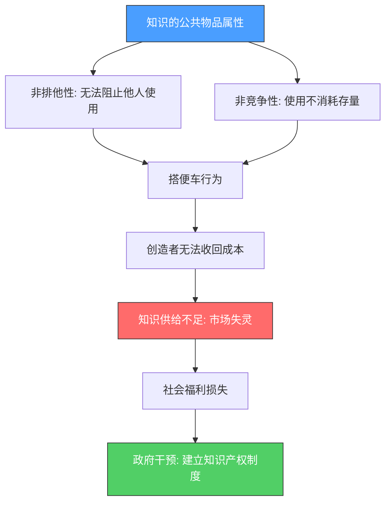
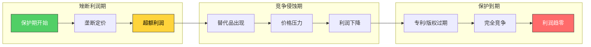
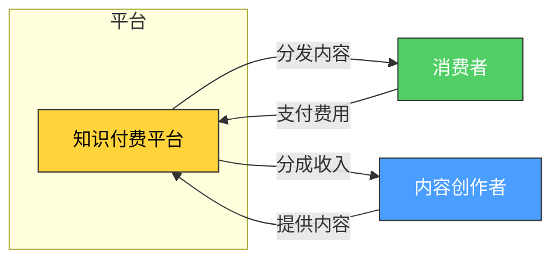
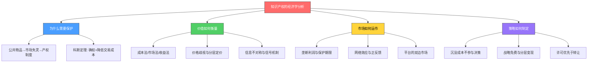

## 二、知识产权的经济学分析

理解知识产权的经济学本质，是做出正确变现决策的前提。很多创作者凭直觉行事——觉得自己的东西"好"就该值钱，觉得申请专利"麻烦"就不申请，觉得课程"便宜"才能卖得多。这些直觉往往建立在对知识产权经济规律的误解之上。

本节从经济学视角拆解知识产权的价值来源、定价逻辑、市场结构和博弈特征，帮你建立一套理性的决策框架。读完这一节，你将能够回答三个关键问题：**我的知识产权为什么值钱？值多少钱？怎样让它更值钱？**

### 1. 为什么需要经济学视角：市场失灵与产权制度

#### 1.1 知识的公共物品属性

在经济学中，物品按两个维度分类：**排他性**（能否阻止他人使用）和**竞争性**（一个人使用是否减少他人的可用量）。

| 物品类型 | 排他性 | 竞争性 | 典型例子 |
|---------|--------|--------|---------|
| 私人物品 | ✅ 有 | ✅ 有 | 食物、衣服、手机 |
| 公共物品 | ❌ 无 | ❌ 无 | 国防、路灯、空气 |
| 共有资源 | ❌ 无 | ✅ 有 | 公海鱼群、公共牧场 |
| **知识（无保护）** | **❌ 无** | **❌ 无** | **未保护的创意、公开的技术方案** |

没有知识产权保护的知识，天然具有**非排他性**和**非竞争性**——你告诉别人一个算法，你仍然拥有这个算法；一万个人同时使用这个算法，不会让它"用完"。这就是经济学中的"公共物品"特征。

#### 1.2 搭便车问题与市场失灵

公共物品的核心问题是**搭便车（Free Rider Problem）**：既然我免费获得知识的成本为零，我为什么要付费？当所有人都这样想时，就没有人愿意为知识的创造付费，创造者无法收回成本，最终导致知识供给不足。



**这就是知识产权制度存在的经济学理由。** 它不是为了"奖励"创造者，而是为了解决市场失灵——通过法律手段为知识"加上排他性"，使其从公共物品变成"准私人物品"，让市场机制能够正常运转。

#### 1.3 产权制度的经济学逻辑：科斯定理的应用

诺贝尔经济学奖得主罗纳德·科斯（Ronald Coase）提出的科斯定理指出：**当产权明确且交易成本足够低时，无论产权最初如何分配，资源配置都能达到最优。**

知识产权制度的核心就是**确权**——明确告诉你："这个专利是你的，别人要使用必须获得你的许可。" 确权之后，市场交易才有可能发生。

但科斯定理的另一个含义同样重要：**交易成本不能太高。** 如果维权成本高于收益，或者许可谈判的摩擦太大，即使拥有产权，变现也会变得困难。这就是为什么后面我们会花大量篇幅讨论降低交易成本的策略（标准化许可协议、平台化分发、批量授权等）。

### 2. 知识产权的成本结构：高固定成本与零边际成本

#### 2.1 成本结构的本质

知识产权最显著的经济学特征是其独特的成本结构：

```text
总成本 = 高固定成本（创造） + 近零边际成本（复制/授权）
```

与传统制造业对比：

| 维度 | 传统制造业 | 知识产权产品 |
|------|-----------|-------------|
| 固定成本 | 中等（建厂、设备） | 高（研发、创作、申请） |
| 边际成本 | 高（原材料、人工、物流） | 近零（复制、授权几乎无成本） |
| 规模经济 | 有限（物理约束） | 极强（无限复制） |
| 典型毛利率 | 20-40% | 80-95% |
| 盈亏平衡点 | 较早 | 较晚但之后利润爆发 |

**实际案例：**

- 一门在线课程：前期投入（选题研究、内容编写、录制剪辑、平台搭建）可能需要200-500小时。但上线后，第1个学员和第10000个学员的交付成本完全相同。
- 一项发明专利：研发阶段可能投入10-50万元，但授权给第1家企业和第100家企业，边际成本仅是合同签署的行政成本。
- 一款软件著作权：开发阶段投入数月，但多卖一份许可证的成本为零。

#### 2.2 沉没成本与决策陷阱

经济学中的"沉没成本"（Sunk Cost）是指已经发生且无法收回的成本。知识产权的前期投入（研发费用、申请费用、创作时间）全部是沉没成本。

**常见的沉没成本谬误：**

- ❌ "我已经在这个专利上花了20万，不能放弃"——但这个专利的市场前景评估显示变现潜力不足5万。正确决策是止损，不是继续投入。
- ❌ "我的课程录了3个月，定价必须高才能回本"——定价应该基于市场愿意支付的价格，而不是你的成本。如果市场只接受199元，你定999元只会卖不出去。
- ❌ "申请专利花了不少钱，一定要打官司维权"——维权的预期收益是否大于诉讼成本？如果对方是小公司且赔偿预期很低，发律师函警告可能比起诉更划算。

**正确思维方式：** 做每一个决策时，只看**未来的增量成本和增量收益**，忽略已经花掉的钱。过去花的钱是"学费"，不是继续投入的理由。

#### 2.3 盈亏平衡分析

知识产权投资的盈亏平衡点通常较高，但一旦跨过，利润曲线会急剧上升。这个特征决定了两个实操要点：

**要点一：前期要有足够的耐心和资金储备。** 一项发明专利从申请到首次授权收入，平均周期2-4年。一门课程从开发到月入过万，通常需要3-6个月的内容迭代和推广。

**要点二：尽量降低固定成本。** 用最小可行产品（MVP）思维来做知识产权——先用最低成本验证市场需求，再逐步增加投入。

```text
收入
 ↑        ╱ 知识产权产品（高固定成本，零边际成本）
 |       ╱
 |      ╱    ╱ 传统产品（中等固定成本，较高边际成本）
 |     ╱    ╱
 |    ╱   ╱
 |   ╱  ╱
 |  ╱ ╱
 | ╱╱
 |╱___________→ 销量
   盈亏平衡点
```

### 3. 定价经济学：知识产权的价值如何衡量

#### 3.1 成本法、市场法与收益法

知识产权的定价方法主要有三种：

| 方法 | 核心逻辑 | 计算方式 | 适用场景 | 局限性 |
|------|---------|---------|---------|--------|
| **成本法** | 重置成本 | 重新创造该知识产权需要多少投入 | 早期评估、内部决策 | 忽略了市场价值和未来收益 |
| **市场法** | 可比交易 | 类似知识产权的市场成交价格 | 有活跃交易市场的品类 | 需要足够的可比案例 |
| **收益法** | 未来收益折现 | 未来收益的现值（DCF） | 最常用，适合成熟IP | 对预测准确度要求高 |

**收益法的核心公式：**

```text
知识产权价值 = Σ (未来各年预期收益 × 折现率系数)

简化版本：
V = R / (r - g)

其中：
V = 知识产权价值
R = 年预期净收益
r = 折现率（通常取10-20%）
g = 收益增长率
```

**实际应用举例：**

假设你有一项专利，预计未来5年每年可带来50万元授权收入，折现率取15%：

| 年份 | 预期收益（万元） | 折现系数（15%） | 现值（万元） |
|------|-----------------|----------------|-------------|
| 第1年 | 50 | 0.870 | 43.5 |
| 第2年 | 50 | 0.756 | 37.8 |
| 第3年 | 50 | 0.658 | 32.9 |
| 第4年 | 50 | 0.572 | 28.6 |
| 第5年 | 50 | 0.497 | 24.9 |
| **合计** | | | **167.7** |

这项专利的估值约为168万元。如果有人出价100万买断，你需要评估是否愿意接受——低于估值但一次性回款，还是继续自己运营但承担不确定性。

#### 3.2 价格歧视与分层定价

经济学中的**价格歧视（Price Discrimination）** 是指对不同消费者收取不同价格。知识产权产品天然适合价格歧视，因为边际成本为零，任何价格都是"纯利润"。

**三级价格歧视在知识付费中的应用：**

| 层级 | 产品形态 | 价格区间 | 目标用户 |
|------|---------|---------|---------|
| 基础版 | 文章/短视频/免费课 | 免费 | 获取流量和潜在客户 |
| 标准版 | 系统课程/电子书 | 99-299元 | 有一定学习意愿的用户 |
| 高级版 | 训练营/1对1辅导 | 999-4999元 | 高付费意愿、需要陪伴的用户 |
| 企业版 | 定制培训/咨询 | 5万-50万 | 企业客户，预算充足 |

**关键原则：** 不是简单的"同一个东西卖不同价"，而是**不同层级提供不同的价值增量**。基础版给你知识，标准版给你体系，高级版给你陪伴和反馈，企业版给你定制化解决方案。

#### 3.3 消费者剩余与最优定价

消费者剩余（Consumer Surplus）是消费者愿意支付的最高价格与实际支付价格之差。知识产权定价的艺术在于**最大化生产者剩余（你的利润），同时让消费者觉得"值"**。

**定价过低的损失：** 假设你的课程目标用户愿意支付500元，你定价99元——你每卖出一份就"损失"了401元的潜在收入。

**定价过高的损失：** 定价999元，只有10%的目标用户愿意购买——总收益可能远低于中等定价。

**最优定价的实操方法：**

1. **锚定测试：** 先发布免费内容（文章、公开课），观察用户反馈和付费意愿信号
2. **阶梯测试：** 先定一个中等价格，观察转化率。如果转化率>5%，说明定价偏低可以上调；如果<1%，说明定价偏高需要下调或增加价值
3. **A/B测试：** 对不同用户群体展示不同价格，找到最优价格点
4. **竞品锚定：** 参考同类产品的定价区间，在其中找到自己的位置

### 4. 市场结构与竞争分析

#### 4.1 知识产权市场的垄断特征

知识产权制度的本质是**授予创造者暂时的垄断权**。在经济学中，垄断意味着：

- **定价权：** 你可以设定高于边际成本的价格，而不被竞争压价
- **产量控制：** 你可以控制供给量，人为制造稀缺性
- **超额利润：** 在保护期内，你可以获得超过完全竞争市场的利润

但这种垄断是**有限度的**：

- 专利有保护期限（发明20年、实用新型10年）
- 版权有保护期限（作者终身+50年）
- 替代品始终存在（你的专利可能被绕开，你的课程可能被竞品替代）
- 消费者的支付意愿有上限



#### 4.2 替代品竞争与防御策略

即使拥有知识产权保护，你仍然面临替代品竞争。替代品有两种形式：

**直接替代：** 有人开发了不同技术路线但解决同样问题的方案。例如，你有一个锂电池专利，但别人开发了钠电池技术。

**间接替代：** 消费者用完全不同的方式满足同样需求。例如，你出版了一本编程书，但用户选择看免费的YouTube教程。

**防御策略：**

| 策略 | 具体做法 | 适用场景 |
|------|---------|---------|
| 专利组合（Patent Portfolio） | 围绕核心技术申请多项专利，形成"专利丛林" | 技术类IP |
| 持续创新 | 在现有IP基础上不断迭代升级 | 所有类型 |
| 品牌忠诚度 | 通过社区运营、内容营销建立用户粘性 | 内容/品牌类IP |
| 转换成本 | 设计生态锁定效应，让用户切换到竞品的成本很高 | 软件/平台类IP |
| 先发优势 | 快速占领市场，在替代品出现前建立规模优势 | 所有类型 |

#### 4.3 网络效应与正反馈循环

某些知识产权具有**网络效应（Network Effect）**：用户越多，价值越大。这是最强的竞争壁垒之一。

**直接网络效应：** 用户数量直接增加产品价值。例如，一个技术标准（如USB-C接口），采用的厂商越多，兼容性越好，价值越高。

**间接网络效应：** 一边用户增加，另一边用户的价值增加。例如，一个知识付费平台，学员越多→吸引更多优质讲师→内容更丰富→吸引更多学员。

**知识产权中的网络效应应用：**

- **标准必要专利（SEP）：** 如果你的专利被纳入行业标准（如5G标准），所有使用该标准的厂商都必须向你付费。这就是为什么高通、华为等公司疯狂布局5G专利。
- **开源策略：** 有时"放弃"部分知识产权反而能创造更大的价值。例如，特斯拉开放电动车专利，推动了整个电动车生态的发展，自己作为行业龙头受益最大。
- **生态构建：** 围绕核心IP构建生态（如Adobe的Creative Cloud），用户越深入使用，切换成本越高。

### 5. 博弈论视角：知识产权竞争中的策略互动

#### 5.1 囚徒困境与专利竞赛

在技术密集型行业，企业之间常常陷入"专利竞赛"——争相申请专利，即使成本高昂。这可以用博弈论中的**囚徒困境**来解释：

```text
                企业B
              申请专利    不申请
企业A  申请专利  (5, 5)    (10, 0)
       不申请    (0, 10)   (3, 3)
```

- 双方都申请专利：各自获得保护，但都付出了申请成本 → (5, 5)
- 只有一方申请：申请方获得垄断优势 → (10, 0) 或 (0, 10)
- 双方都不申请：节省成本但无保护 → (3, 3)

纳什均衡是双方都申请专利（5 > 0），即使双方都不申请的整体福利更高（3+3=6 > 5+5=10中的单方收益）。这就是为什么专利数量持续膨胀——不是因为每个专利都有价值，而是不申请的风险太大。

**对个人创作者的启示：** 你不需要参与"专利军备竞赛"，但你需要识别哪些知识产权值得保护。**不是所有创意都值得申请专利，但真正有价值的创意如果不保护，就等于把机会拱手让人。**

#### 5.2 信号博弈与知识产权展示

知识产权还具有**信号功能（Signaling）**——向市场传递你的能力和可信度。

- 一项发明专利向投资人信号："我有技术壁垒"
- 一个注册商标向消费者信号："我是正规品牌，不是三无产品"
- 一本出版物向行业信号："我是这个领域的专家"
- 多项软件著作权向客户信号："我们有持续的研发能力"

**信号的价值取决于两个因素：**
1. **信号成本：** 越难伪造的信号越有价值。申请发明专利需要真实的发明创造，所以它比"自称专家"更有说服力。
2. **信号接收方的重视程度：** 在技术领域，专利信号很有价值；在创意领域，版权作品的数量和质量更有说服力。

#### 5.3 讨价还价与许可谈判

知识产权许可谈判是一个典型的**讨价还价博弈（Bargaining Game）**。你和被许可方需要就价格达成一致，否则双方都无法获益（你不授权得不到收入，对方不获得授权无法使用）。

**影响谈判力量的关键因素：**

| 因素 | 增强你的谈判力量 | 削弱你的谈判力量 |
|------|-----------------|-----------------|
| 替代品 | 你的IP没有替代品 | 存在多个替代方案 |
| 时间压力 | 对方急需使用 | 你急需变现 |
| 信息优势 | 你了解对方的支付意愿 | 对方知道你的底线 |
| 备选方案 | 你有多个潜在买家 | 只有一个买家 |
| 法律保护 | 维权成本低、胜率高 | 维权困难 |

**实操建议：**

- 永远不要在谈判中暴露你的最低可接受价格
- 尽量创造多个潜在买家，形成竞争
- 在许可合同中设置保底金+提成的模式，对冲信息不对称风险
- 了解对方使用你的IP能赚多少钱（这决定了你的定价上限）

### 6. 外部性与社会最优

#### 6.1 正外部性：知识溢出效应

知识产权创造具有**正外部性（Positive Externality）**——创造者获得的收益小于社会获得的总收益。你的专利可能启发了其他发明者，你的文章可能帮助了无数读者，你的开源代码可能被千万个项目使用。

这意味着：**从社会角度看，知识产权的创造数量低于社会最优水平。** 因为创造者只获得了部分价值，所以"市场"会激励不足。

政府通过多种方式弥补这种激励不足：
- 专利制度（赋予排他权）
- 税收优惠（研发费用加计扣除）
- 政府补贴（科技创新基金）
- 知识产权保护执法

#### 6.2 负外部性：过度保护的社会成本

但知识产权保护也不是越强越好。过度保护会产生**负外部性**：

- **专利流氓（Patent Trolls）：** 购买专利不是为了实施，而是为了起诉他人索取赔偿，增加了整个社会的创新成本
- **版权过度保护：** 过长的保护期限阻碍了文化作品进入公共领域，限制了后续创作
- **药品专利争议：** 高价专利药品让发展中国家患者无法负担，引发公共健康危机

**经济学最优的知识产权保护水平：** 保护期足够长以激励创新，但不能长到阻碍后续创新和公共利益。这就是为什么不同类型的知识产权有不同的保护期限——发明专利20年（技术迭代快），版权作者终身+50年（文化作品生命周期长），商标可无限续展（品牌是持续经营的标识）。

#### 6.3 对个人创作者的启示

理解外部性，可以帮你做出两个关键决策：

**决策一：是否"免费开放"部分内容？**

免费内容的正外部性很大——它帮助更多人，建立你的声誉，吸引潜在付费用户。从经济学角度看，**战略性地释放部分内容作为"公共物品"，可以最大化你的长期收益**。这就是为什么几乎所有成功的知识付费创作者都有大量免费内容。

**决策二：保护强度如何选择？**

不是所有作品都需要最强保护。经济学建议：
- 核心技术/品牌：最强保护（专利+商标+商业秘密组合）
- 一般内容：适度保护（版权登记+侵权监控）
- 引流内容：弱保护甚至主动开放（最大化传播和正外部性）

### 7. 知识产权估值的实操框架

#### 7.1 影响知识产权价值的关键因素

| 因素 | 高价值特征 | 低价值特征 | 权重 |
|------|-----------|-----------|------|
| 法律保护强度 | 权利稳定、保护范围清晰 | 权利不稳定、容易被无效 | ★★★★★ |
| 市场需求 | 解决真实痛点、市场大 | 需求小众或伪需求 | ★★★★★ |
| 替代性 | 无替代方案或替代成本高 | 多种替代方案 | ★★★★ |
| 剩余保护期 | 距到期还有很长时间 | 即将到期 | ★★★★ |
| 技术/内容先进性 | 领先同行2-3年 | 已被超越 | ★★★ |
| 可实施性 | 容易商业化 | 转化难度大 | ★★★ |
| 已有收益 | 已经产生稳定收入 | 尚未变现 | ★★★ |
| 组合效应 | 与其他IP形成协同 | 孤立存在 | ★★ |

#### 7.2 快速估值的三个实用方法

**方法一：成本底线法**

```text
估值下限 = 申请/登记费用 + 创作时间成本 × 时薪
```

这是最低估值——低于这个价格，你不如不卖。

**方法二：收益倍数法**

```text
估值 = 年净收益 × 行业倍数
```

不同行业的倍数参考：
- 软件著作权：3-8倍年收益
- 实用新型专利：2-5倍年收益
- 发明专利：5-15倍年收益
- 知识付费课程：2-4倍年收益
- 注册商标：3-10倍年收益

**方法三：替代成本法**

```text
估值 = 买方自行开发类似IP的成本 × 折扣系数（0.5-0.8）
```

如果买方自己开发需要100万，你的IP估值约50-80万。

#### 7.3 估值案例：一门在线课程的经济学分析

**背景：** 你开发了一门"Python自动化办公"课程，已在某平台上线6个月。

| 数据项 | 数值 |
|--------|------|
| 开发投入时间 | 300小时 |
| 时薪（按机会成本算） | 200元/小时 |
| 开发总成本 | 60,000元 |
| 月均销售额 | 15,000元 |
| 月均净利润 | 12,000元（扣除平台分成20%） |
| 课程生命周期预估 | 3年（技术更新后需大幅修订） |
| 年净收益 | 144,000元 |

**三种估值结果：**

| 估值方法 | 计算过程 | 估值结果 |
|---------|---------|---------|
| 成本底线法 | 60,000元 | 6万元 |
| 收益倍数法 | 144,000 × 3倍 | 43.2万元 |
| DCF法（折现率15%） | 144,000 × 2.283（3年年金现值系数） | 32.9万元 |

**结论：** 这门课程的合理估值在33-43万元之间。如果有人出价30万买断，你需要权衡：一次性获得30万 vs 继续运营3年获得约43万但承担不确定性。

### 8. 信息经济学与知识产权

#### 8.1 信息不对称问题

知识产权交易中普遍存在**信息不对称（Information Asymmetry）**：卖方比买方更了解IP的真实质量和价值。

这导致两个经典问题：

**逆向选择（Adverse Selection）：** 买方因为无法准确评估IP质量，只愿意出"平均价"。结果高质量IP的卖家觉得价格太低而不愿出售，市场上剩下的多是低质量IP——这就是阿克洛夫所说的"柠檬市场"。

**道德风险（Moral Hazard）：** 许可方可能在签约后降低技术支持质量；被许可方可能超范围使用授权。

#### 8.2 解决信息不对称的机制

| 机制 | 原理 | 实操方式 |
|------|------|---------|
| **信号发送** | 高质量方主动展示证据 | 专利证书、用户评价、案例展示、免费试听 |
| **筛选机制** | 买方设计合约筛选卖方 | 按效果付费（保底+提成）、分期付款、试用期 |
| **第三方认证** | 中立机构背书 | 专利评估报告、平台评级、行业认证 |
| **声誉机制** | 长期博弈中的信任积累 | 持续产出高质量内容、维护口碑、处理售后 |
| **标准化** | 降低评估难度 | 标准化许可合同、统一定价体系、模块化产品 |

**对个人创作者的实操建议：**

1. **用免费内容建立信任：** 免费文章/视频是解决信息不对称的最佳工具——用户先体验你的内容质量，再决定是否付费
2. **提供试用/试听：** 课程前几节免费、软件提供试用期、电子书提供样章
3. **展示社会证明：** 学员评价、购买数量、媒体报道、行业奖项
4. **提供退款保障：** "不满意全额退款"降低了买方的风险感知

### 9. 平台经济学与知识产权分发

#### 9.1 平台的双边市场特征

知识付费平台（如得到、知乎、网易云课堂）是典型的**双边市场（Two-Sided Market）**：一边是内容创作者，一边是消费者。平台的价值在于降低双方的交易成本。



**平台为创作者降低的交易成本：**
- 流量获取成本（平台自带用户）
- 支付结算成本（平台处理收款）
- 技术搭建成本（平台提供课程托管）
- 信任建立成本（平台背书）

**平台收取的"代价"：**
- 分成比例（通常20-50%）
- 内容审核约束
- 定价限制
- 用户数据不完全归你

#### 9.2 平台依赖与多平台策略

过度依赖单一平台的风险：
- 平台政策变化可能影响你的收入（分成比例调整、算法变化）
- 平台可能直接与你竞争（推出自营内容）
- 平台衰落会导致你的用户流失

**多平台分发的经济学逻辑：**

由于知识产权的边际成本为零，同一内容在多个平台分发的成本几乎为零，但收入可以叠加。这是知识产权相比传统商品的核心优势之一。

| 策略 | 做法 | 适用阶段 |
|------|------|---------|
| 平台首发 | 新内容先在主力平台发布，积累初始销量和评价 | 早期 |
| 多平台铺开 | 内容稳定后分发到其他平台 | 成长期 |
| 自建渠道 | 建立自己的网站/社群，减少平台依赖 | 成熟期 |
| 差异化内容 | 不同平台提供略有差异的内容版本 | 进阶期 |

### 10. 常见的经济学认知误区

#### 误区一："我的东西好，就该值钱"

经济学中的价值不是由"好坏"决定的，而是由**供给和需求**决定的。一个再好的专利，如果没有市场需求，价值为零。一个平庸但解决真实痛点的课程，可能比一个精妙但无人需要的课程卖得好100倍。

**纠正方法：** 在创造之前先验证需求。搜索关键词热度、调研目标用户痛点、分析竞品销售数据。

#### 误区二："定价越低卖得越多"

这是对需求曲线的误解。对于知识产权产品，**价格过低反而会降低感知价值**。一门99元的课程和一门999元的课程，如果内容质量相当，很多用户会认为999元的更好——因为价格本身就是质量的信号。

**纠正方法：** 基于价值定价，而非基于成本定价。同时提供不同价位的产品层级，让用户自己选择。

#### 误区三："申请了专利就能赚钱"

专利只是给你一个"排他权"，变现还需要商业化运营。中国个人发明人的专利转化率不足5%，绝大多数专利从未产生任何收入。

**纠正方法：** 申请专利前先评估商业化前景。如果找不到明确的变现路径，申请专利可能只是浪费钱。

#### 误区四："版权自动产生，不需要登记"

虽然版权确实自动产生，但在维权时，**没有登记的版权举证难度极大**。版权登记费用仅100-300元，但可以在诉讼中直接作为权属证据，省去大量举证成本。

**纠正方法：** 所有有价值的原创内容都进行版权登记。这不是"多此一举"，而是用极低成本换取法律保障。

#### 误区五："知识产权是一次性交易"

很多人把知识产权变现理解为"卖掉"。但最有价值的变现方式往往是**许可（Licensing）**——保留所有权，收取持续的许可费。卖掉是一次性收入，许可是持续现金流。

**纠正方法：** 优先考虑许可而非转让。即使需要转让，也可以保留部分权利（如仅转让特定领域的使用权）。

### 11. 本节核心框架总结



理解这些经济学原理，不是为了成为经济学家，而是为了在每一个决策点上做出更理性的判断：**这个IP值不值得保护？该定什么价？该用什么方式变现？该投入多少资源？** 这些问题的答案，都藏在供需曲线和成本结构里。

***
