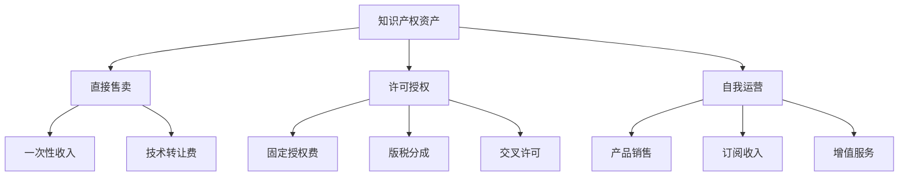

## 三、知识产权变现的底层逻辑

知识产权变现不是一个简单的"卖作品"过程，其背后存在一套完整的经济学逻辑和商业运行机制。理解这套底层逻辑，才能在变现过程中做出正确判断——选择哪种变现模式、如何定价、怎样构建护城河、为什么有些知识产权能产生持续收益而另一些只有一锤子买卖。

### 1. 知识产权的本质：非竞争性资产

#### 1.1 什么是非竞争性资产

经济学将资产分为两类：竞争性资产和非竞争性资产。

- **竞争性资产**：一个人使用，另一个人就不能同时使用。例如一把椅子、一杯咖啡、一辆汽车。
- **非竞争性资产**：可以被无限多人同时使用，且边际使用成本趋近于零。例如一首歌曲、一段代码、一个算法、一篇论文。

知识产权的核心特征就是非竞争性。你写了一本书，100个人买和100万人买，你的创作成本（固定成本）是一样的。每多卖出一份，你的边际成本几乎为零——这就是知识产权变现的第一个底层逻辑。

#### 1.2 边际成本趋零与规模效应

理解边际成本趋零，就理解了为什么知识产权是极好的商业模式。

以一个软件产品为例：

| 成本类型 | 金额 | 说明 |
|---------|------|------|
| 研发成本（固定） | 50万元 | 一次性投入，开发完成即固定 |
| 单份分发成本（边际） | ≈0元 | 数字分发无物理成本 |
| 100份单位成本 | 5000元/份 | 50万÷100 |
| 10000份单位成本 | 50元/份 | 50万÷10000 |
| 100万份单位成本 | 0.5元/份 | 50万÷100万 |

当用户量突破某个临界点后，每多卖出一份几乎是纯利润。这就是为什么互联网和内容行业能够产生巨大财富——它们售卖的都是边际成本趋零的数字产品。

#### 1.3 排他性与权利边界

非竞争性不等于不需要保护。恰恰相反，正因为数字产品可以被无限复制，才需要法律赋予排他性权利——也就是知识产权法。

知识产权的本质是法律人为制造的"稀缺性"。作品本身可以被无限复制，但法律规定只有权利人（或被授权人）才能合法地复制和分发。这个法律屏障是所有变现模式的基础。

```text
自然属性：非竞争性（可无限复制）
     ↓
法律干预：赋予排他性权利
     ↓
商业结果：制造人为稀缺性
     ↓
变现可能：在稀缺性基础上建立商业模式
```

没有法律保护的排他性，任何变现模式都无法成立——因为免费复制的竞争会立即将价格压到零。

### 2. 知识产权的价值构成

知识产权的价值不是凭空产生的，它由四个维度构成。理解这四个维度，才能准确评估一项知识产权的变现潜力。

#### 2.1 创意价值：稀缺性和独创性

创意价值来源于"别人想不到"或"别人想到但做不出"。

- **技术独创性**：解决了别人没有解决的问题（如新算法、新工艺）
- **艺术独创性**：创造了别人没有创造的表达（如独特风格、创新叙事）
- **模式独创性**：构建了别人没有构建的商业架构（如新商业模式的专利）

创意价值的评估标准：**替代成本**。如果一个竞争对手要从零开始复制你的成果，需要花多少时间和金钱？替代成本越高，创意价值越大。

#### 2.2 执行价值：从想法到成品

创意本身几乎不值钱——值钱的是把创意变成可交付产品的执行能力。

一个小说创意可能值100元，但一部完成的小说值10万到100万元。差在哪里？差在作者把模糊的灵感转化为完整叙事的执行过程：构思大纲、塑造人物、推敲情节、反复修改、最终定稿。

执行价值包括：

- **完成度**：半成品和成品的价值差距是10倍以上
- **质量水平**：粗糙完成和精心打磨的价值差距是3-10倍
- **可交付性**：能否直接让终端用户使用或消费

#### 2.3 品牌价值：注意力和信任积累

同一张照片，无名摄影师卖50元，知名摄影师卖5万元。同一段代码，新手开发者报价5000元，技术大牛报价50万元。

差距来自品牌价值，品牌价值由两个要素构成：

- **注意力**：目标受众是否知道你的存在
- **信任**：目标受众是否相信你的产品质量

品牌价值是时间的函数。每一次公开发布、每一次客户好评、每一次行业认可，都在累积品牌价值。品牌价值一旦建立，它会对所有知识产权产品产生溢价效应。

#### 2.4 法律价值：保护强度和范围

同样的技术，申请了专利和没有专利，变现能力天差地别。法律价值取决于：

- **保护类型**：专利、版权、商标、商业秘密，保护力度不同
- **保护范围**：权利要求覆盖多广，直接影响垄断能力
- **保护期限**：发明专利20年，版权作者终身+50年，商标可无限续展
- **维权可行性**：发现侵权是否容易，诉讼成本是否可承受

法律价值的核心作用是"阻断竞争"。保护越强，竞争对手的替代路径越少，你的定价权越大。

### 3. 变现的经济学框架

#### 3.1 三种基本变现路径

所有知识产权变现，本质上是三种路径的排列组合：

**路径一：直接售卖（所有权转让）**

把知识产权的所有权一次性卖给买家。卖完之后，原作者不再拥有该权利。

- 优势：一次性获得大额收入，无后续维护负担
- 劣势：放弃了未来持续收益的可能
- 适用场景：买家出价远超预期、技术更新快需要快速套现、不想持续运营

**路径二：许可授权（使用权让渡）**

保留所有权，授予他人使用权，按次、按量或按期收费。

- 优势：可持续收入，同一资产可多次授权
- 劣势：需要持续管理授权关系，存在侵权风险
- 适用场景：技术专利、音乐版权、软件授权、品牌授权

**路径三：自我运营（价值内化）**

不转让也不授权，而是将知识产权嵌入自己的产品或服务中，通过运营获取利润。

- 优势：利润空间最大，完全掌控定价和用户体验
- 劣势：需要运营能力，承担商业风险
- 适用场景：自研软件产品、自主品牌、内容平台



#### 3.2 定价逻辑：成本、价值与博弈

知识产权定价是所有变现中最困难的环节之一。传统商品可以通过"成本+利润"定价，但知识产权的成本结构是：固定成本极高，边际成本趋零。这意味着成本定价法完全不适用。

**三种定价方法：**

| 定价方法 | 逻辑 | 计算方式 | 适用场景 |
|---------|------|---------|---------|
| 成本加成法 | 投入了多少就卖多少 | 总成本 × (1+目标利润率) | 定制开发、委托创作 |
| 市场比较法 | 参照同行定价 | 对标同类产品价格区间 | 成熟市场的标准化产品 |
| 价值定价法 | 能帮客户赚多少就收多少 | 客户获得的经济价值 × 提成比例 | B2B技术授权、企业解决方案 |

实际上，大多数知识产权交易的最终价格是**博弈结果**——买卖双方根据各自的信息、需求强度和替代选项进行谈判。知识优势（你知道自己的东西值多少，对方不知道）和需求优势（对方非常需要你的东西）是定价博弈中的两大杠杆。

#### 3.3 复利效应：知识产权变现的终极逻辑

知识产权变现的终极底层逻辑是**复利效应**。

普通劳动力的收入是线性的：你工作1小时赚100元，工作10小时赚1000元。你无法在同一小时内卖给两个雇主。

知识产权的收入是指数型的：你花100小时创作一件作品，这件作品可以在同一时间卖给无数人。更重要的是，一件成功的作品会降低下一件作品的获客成本——你的受众基础在积累，品牌价值在增长，分销渠道在成熟。

用一个简化的模型来看：

```text
第1年：创作3件作品，每件年收入5000元 → 年收入15000元
第2年：新增3件 + 旧作持续收益 → 年收入35000元（品牌溢价+存量作品）
第3年：新增3件 + 存量6件持续收益 → 年收入70000元
第5年：新增3件 + 存量12件持续收益 → 年收入200000元
```

这个模型的关键假设是：**作品的生命周期足够长**。如果每件作品只卖一个月就过期，复利效应就不存在。所以，延长知识产权的商业寿命（持续更新、建立品牌、构建生态）是实现复利的核心策略。

### 4. 变现的四个前提条件

不是所有知识产权都能变现。在投入时间和精力之前，需要检验四个前提条件是否满足。

#### 4.1 法律确权：你是权利人吗

变现的前提是你拥有完整的权利。常见的确权问题包括：

- **职务作品**：在职期间创作的作品，权利可能归雇主所有
- **合作作品**：多人合作创作，需要明确各方权利份额
- **委托作品**：受他人委托创作，权利归属取决于合同约定
- **素材侵权**：作品中使用了他人的素材（图片、音乐、字体），可能面临连带侵权

确权检查清单：

1. 创作时间是否在任职期间？
2. 创作内容是否与工作职责相关？
3. 劳动合同中是否有知识产权归属条款？
4. 是否使用了第三方素材？是否获得合法授权？
5. 是否有合作者？是否签署了权利分割协议？
6. 是否已经申请了专利、商标或版权登记？

#### 4.2 市场需求：有人愿意付费吗

知识产权的价值最终由市场决定。你需要回答三个问题：

1. **谁会付费？** 精确描述你的目标付费用户画像
2. **他们愿意付多少？** 通过调研、竞品分析或测试定价来估算
3. **他们为什么选你？** 你的作品相对竞品的差异化优势是什么

常见的需求验证方法：

- **预售测试**：在投入大量时间完成作品前，先发布预售页面或众筹项目，看有多少人愿意预付
- **最小可行产品（MVP）**：用最小成本做出一个可用版本，投放市场测试反馈
- **搜索量分析**：用关键词工具分析目标用户的需求强度
- **社区验证**：在相关社区发布内容，观察互动数据和评论反馈

#### 4.3 分发渠道：如何触达用户

没有分发能力的知识产权，变现为零。分发渠道包括：

| 渠道类型 | 典型平台 | 优势 | 劣势 |
|---------|---------|------|------|
| 自有渠道 | 个人网站、邮件列表、App | 完全控制，无抽成 | 需要自建流量 |
| 内容平台 | 公众号、知乎、B站、YouTube | 自带流量，起步快 | 平台抽成，规则受限 |
| 电商/应用商店 | App Store、Google Play、亚马逊 | 巨大的用户基数 | 竞争激烈，抽成高（15%-30%） |
| 专业市场 | Shutterstock、Unity Asset Store、GitHub Sponsors | 精准目标用户 | 品类限制，同质竞争 |
| 企业渠道 | 直销、代理商、行业展会 | 客单价高 | 周期长，关系维护成本高 |

最优策略是**多渠道组合**：用内容平台获取流量，导入自有渠道沉淀用户，通过多个销售渠道完成变现。

#### 4.4 持续维护：变现不是一次性事件

知识产权的商业寿命取决于持续维护：

- **软件产品**需要修bug、适配新系统、添加新功能
- **内容产品**需要更新过时信息、补充新案例、优化搜索排名
- **品牌**需要持续输出内容、维护社区、回应用户反馈
- **专利**需要按时缴纳年费、监控侵权行为

### 5. 六种核心变现模式详解

#### 5.1 直接销售模式

将知识产权作为产品直接销售给终端用户。

**运行机制**：创作 → 定价 → 上架 → 推广 → 销售 → 交付

**典型形态**：
- 电子书（Kindle、豆瓣阅读、微信读书）
- 在线课程（网易云课堂、Udemy、自己的平台）
- 设计素材（UI模板、图标库、字体）
- 软件工具（桌面应用、移动App、浏览器插件）
- 音乐/音效（授权库、独立发行）

**关键成功因素**：
1. 产品完成度高，用户拿到就能用
2. 定位精准，解决特定人群的特定问题
3. 有持续的流量来源（SEO、内容营销、社群）
4. 定价合理，与目标用户的支付能力匹配

#### 5.2 许可授权模式

保留所有权，授予他人使用权。

**主要授权方式**：

| 授权方式 | 计费逻辑 | 适用场景 |
|---------|---------|---------|
| 独占许可 | 高额固定费 | 买方需要垄断使用权 |
| 排他许可 | 中高额固定费 | 只授权一个被许可方（但自己可保留使用权） |
| 普通许可 | 较低固定费或按量付费 | 多个被许可方共享使用权 |
| 交叉许可 | 零成本交换 | 双方互有对方需要的专利 |
| 强制许可 | 法定费率 | 特定条件下政府强制授权（较少见） |

**版税分成的行业基准**：
- 图书出版：定价的8%-15%
- 音乐版权：流媒体收入的15%-25%
- 软件许可：年费模式（SaaS）或一次性授权费
- 专利许可：产品售价的2%-5%（行业差异大）
- 品牌授权：授权产品销售额的5%-15%

#### 5.3 订阅/会员模式

将知识产权包装为持续服务，按期收费。

**与直接销售的本质区别**：直接销售卖的是"产品"，订阅模式卖的是"持续获取价值的权利"。

**运行机制**：
- 提供基础免费内容吸引用户
- 优质内容或高级功能设为付费订阅
- 持续产出新内容保持订阅价值
- 通过数据分析优化留存率

**适用条件**：
1. 内容/产品可以持续更新
2. 用户有长期使用需求（非一次性需求）
3. 有足够大的内容库支撑订阅价值感
4. 有持续创作的能力和意愿

**关键指标**：
- **月度流失率（Churn Rate）**：健康值<5%
- **客户生命周期价值（LTV）**：月均收入÷流失率
- **获客成本（CAC）**：LTV应≥3×CAC

#### 5.4 广告/流量变现模式

通过免费内容获取流量，再通过广告变现。

**运行机制**：创作免费内容 → 积累受众 → 向广告主出售注意力

**变现效率取决于三个因素**：
1. **流量规模**：月活跃用户数
2. **用户质量**：用户画像与广告主目标受众的匹配度
3. **广告形式**：展示广告、原生广告、植入广告、带货，效率依次递增

**收入估算**（以内容平台为例）：
- 公众号流量主：约3-8元/千次阅读
- YouTube：约2-8美元/千次播放（CPM，因地区和品类差异大）
- 个人博客广告：约1-5美元/千次访问
- 播客广告：约15-50美元/千次下载（CPM最高）

广告模式适合大流量、低商业意图的内容。如果你的内容面向专业人群且用户有明确的付费意愿，直接销售或订阅模式通常更高效。

#### 5.5 平台/生态模式

围绕核心知识产权构建平台或生态，让第三方在你的基础上创造价值。

**典型形态**：
- **API/SDK**：开放技术能力，第三方开发者付费调用
- **应用市场**：在你的平台上分发第三方产品，收取佣金
- **内容生态**：提供创作工具和分发渠道，创作者产出内容，平台从交易中抽成
- **标准/协议**：主导行业标准，围绕标准构建专利池

**这是最高级也最难的变现模式**，需要：
1. 核心知识产权足够强，足以支撑整个生态
2. 有足够的资本和团队运营平台
3. 能吸引足够多的第三方参与者
4. 有清晰的商业规则和利益分配机制

#### 5.6 数据/洞察变现模式

基于知识产权积累的数据资产或行业洞察，提供咨询服务或数据产品。

**典型形态**：
- 行业研究报告（如艾瑞咨询、Gartner）
- 数据API服务（如天气数据、金融数据）
- 咨询顾问（基于专业知识提供一对一服务）
- 培训认证（基于知识体系提供系统化培训）

### 6. 变现效率的影响因素

#### 6.1 时间维度：即时变现 vs 长期积累

不同变现方式的回报周期差异巨大：

| 变现方式 | 起步时间 | 首笔收入 | 规模化时间 |
|---------|---------|---------|-----------|
| 自由职业接单 | 1-2周 | 1个月内 | 3-6个月 |
| 在线课程销售 | 1-3个月 | 上架后1-2周 | 6-12个月 |
| 电子书出版 | 2-6个月 | 上架后1-4周 | 6-18个月 |
| 软件产品 | 3-12个月 | 上线后1-3个月 | 1-3年 |
| 专利许可 | 1-3年 | 授权谈判后 | 3-5年 |
| 品牌/平台 | 2-5年 | 6个月-2年 | 5年以上 |

选择变现方式时，要根据自己的资金状况和风险承受能力来平衡短期收入和长期价值。

#### 6.2 规模维度：个体上限与突破方法

个体创作者的变现面临天然上限：时间和精力有限。突破方法有三种：

1. **产品化**：把服务变成产品（一对一咨询 → 在线课程），打破时间天花板
2. **杠杆化**：利用他人的资源（外包、合作、投资），扩大产出规模
3. **系统化**：建立自动化流程（自动化营销、自助购买、AI辅助创作），降低边际运营成本

#### 6.3 风险维度：变现过程中的主要风险

| 风险类型 | 说明 | 应对策略 |
|---------|------|---------|
| 侵权风险 | 他人盗用你的知识产权 | 及时确权、监控市场、法律维权 |
| 法律风险 | 你的作品侵犯他人权利 | 创作前做知识产权检索、购买素材许可 |
| 市场风险 | 市场需求变化导致收入下降 | 分散收入来源、持续迭代产品 |
| 平台风险 | 依赖的平台修改规则或倒闭 | 多平台分发、建设自有渠道 |
| 现金流风险 | 变现周期长导致资金断裂 | 保持主业收入、控制初期投入 |

### 7. 底层逻辑总结

将上述内容归纳为五条底层逻辑：

**逻辑一：非竞争性是根基**
知识产权可以无限复制的特性，使其天然适合规模化变现。这是所有商业模式的起点。

**逻辑二：法律排他性是护城河**
没有法律保护，非竞争性反而意味着任何人都可以零成本复制你的成果。确权是一切变现的前提。

**逻辑三：边际成本趋零决定了商业模式选择**
边际成本趋零意味着销量越大利润率越高。因此知识产权变现天然倾向"薄利多销"或"高溢价少量"两个极端，中间地带反而最难。

**逻辑四：品牌是时间的复利**
每一次创作都在累积品牌价值，品牌价值反过来降低下一次变现的获客成本。这是知识产权变现实现指数增长的核心机制。

**逻辑五：变现模式应匹配资产特性**
不是所有知识产权都适合同一种变现方式。技术专利适合许可授权，创意内容适合直接销售或订阅，行业知识适合咨询服务。选择与资产特性匹配的变现模式，效率才能最大化。

理解这五条底层逻辑，你就拥有了分析任何知识产权变现问题的基本框架。后续章节将在此基础上，逐一展开每种变现模式的详细操作方法。
