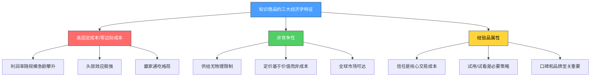
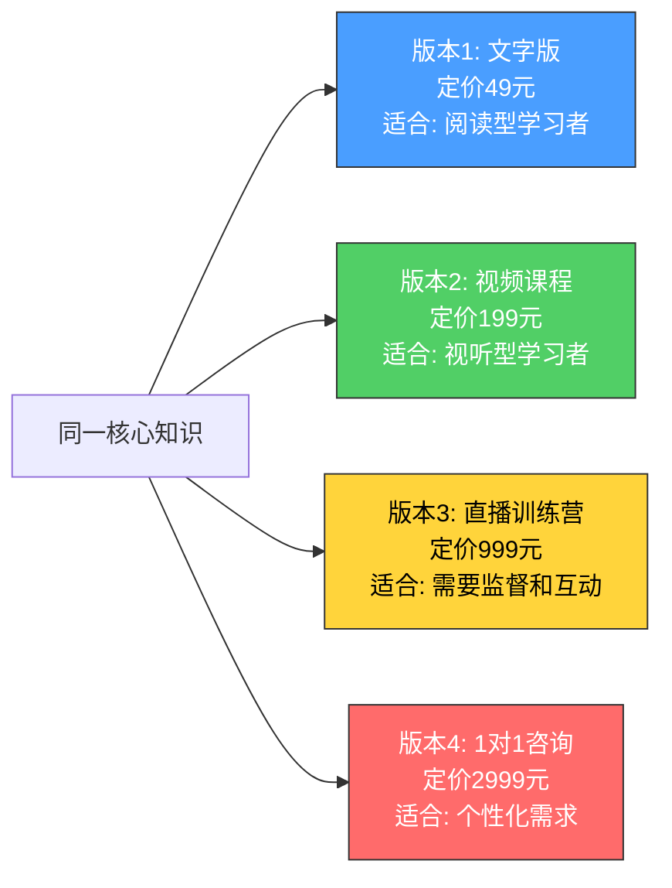
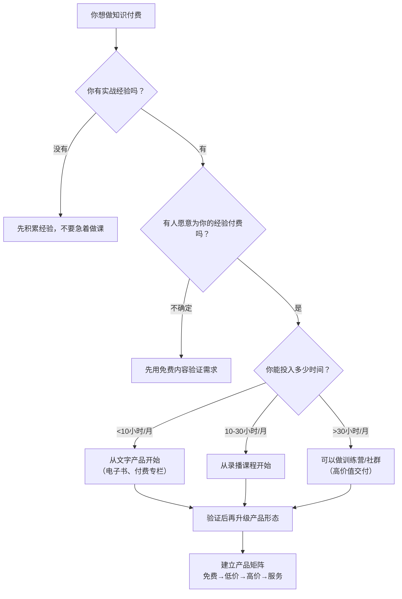

## 四、知识付费的经济学基础

知识付费为什么能成立？为什么有人愿意为"本来可以免费搜到的信息"付费？为什么同一门课程卖99元和卖999元都有人买，而定价49元反而可能卖不动？这些问题的答案，不在营销话术里，而在经济学原理中。

理解知识付费的经济学基础，不是为了让你去写论文，而是为了让你在做定价决策、选平台、设计产品架构时，有底层逻辑支撑——而不是靠"感觉"和"模仿别人"。本节将从信息经济学的底层理论出发，逐层拆解知识付费市场的运行规律。

---

### 一、知识作为商品：信息经济学的底层框架

#### 1.1 信息商品的三大经济学特征

知识付费的本质是将"信息"或"知识"作为商品进行交易。但信息商品与传统实物商品在经济学上有三个根本性差异，理解这三个差异是一切后续分析的起点。

**特征一：高固定成本、趋近于零的边际成本**

一门在线课程的制作成本可能是5万元（包括内容研发、设备、时间投入），但多卖一份的边际成本几乎为零——平台托管费可以忽略不计，不需要物流、库存、生产线。这与传统制造业形成鲜明对比：

| 对比维度 | 传统制造业 | 知识付费产品 |
|----------|-----------|-------------|
| 固定成本 | 设备、厂房、原材料批量采购 | 内容研发、录制、编辑 |
| 边际成本 | 每件产品有原材料+人工成本 | 趋近于零（数字分发） |
| 规模经济 | 有限（受产能约束） | 几乎无限（服务器容量限制可忽略） |
| 成本结构 | 固定成本占30-50%，变动成本占50-70% | 固定成本占95%以上，变动成本<5% |

这个特征的经济学含义是：**知识付费产品的利润率随销量增长而急剧攀升。** 一门课程卖100份时可能刚刚回本，卖1000份时利润率超过80%，卖10000份时利润率接近95%。这就是为什么知识付费市场的头部效应如此明显——赢家几乎独占利润。

**特征二：非竞争性（Non-rivalrous）**

一个人观看课程视频，不会减少其他人观看同一视频的机会。这与苹果（你吃了别人就不能吃）完全不同。非竞争性意味着：

- 供给不受物理限制：一门课可以同时卖给全球任何人
- 零"库存"概念：不存在"卖断货"的问题
- 复制成本为零：信息可以被无限复制而不损失质量

非竞争性从根本上改变了定价逻辑。传统商品定价必须考虑"成本+合理利润"，因为每多生产一件都需要投入。但信息商品的定价完全取决于用户愿意付多少（即"价值定价"），而非生产者花了多少。

**特征三：经验品属性（Experience Good）**

经济学将商品分为三类：搜寻品（购买前就能判断质量，如苹果的外观）、经验品（购买后才能判断质量，如一顿饭）、信用品（即使消费后也难以判断质量，如医疗诊断）。知识付费产品是典型的经验品——你在购买之前无法确定课程内容是否对你有用。

经验品属性导致了两个重要后果：

- **信任是核心交易成本：** 用户必须相信你的课程值得付费，这靠品牌、口碑、试看内容来建立
- **"柠檬市场"风险：** 低质量内容可能充斥市场，导致用户对整个品类失去信任（经济学家阿克洛夫的"柠檬市场"理论在知识付费领域有直接体现）



#### 1.2 信息商品的"价值悖论"

经济学中有一个经典问题：为什么水（对生命至关重要）便宜，钻石（没什么实用价值）贵？这就是"价值悖论"（Diamond-Water Paradox），由亚当·斯密提出，后被边际效用理论解决——价格不取决于总效用，而取决于边际效用。

知识付费领域存在类似的悖论：

- 免费的维基百科包含了人类知识的精华，但没人愿意为它付费
- 一个只教Excel某个函数用法的99元课程，可能卖了几万份

这不是用户"愚蠢"，而是经济学规律在起作用。用户付费的不是"知识本身"，而是以下三个边际价值：

| 边际价值 | 说明 | 例子 |
|----------|------|------|
| **筛选价值** | 从海量信息中筛选出对你有用的那一部分 | "产品经理入门"课程帮你省去读10本书的时间 |
| **结构化价值** | 将散乱的知识组织成可学习、可执行的体系 | 一本把200篇博客整理成完整方法论的电子书 |
| **时效价值** | 获取最新、尚未广泛传播的知识 | AI领域最新技术的付费解读课程 |

理解这个悖论的实操意义：**你的课程定价不应该基于"我讲了多少知识"，而应该基于"我帮用户省了多少时间/避免了多少弯路/创造了多少价值"。**

---

### 二、知识付费的定价经济学

定价是知识付费中最令创作者困惑的问题。定高了怕没人买，定低了怕不赚钱。经济学提供了多个定价理论框架，每个框架适用于不同的产品类型和市场阶段。

#### 2.1 价值定价法（Value-Based Pricing）

价值定价是知识付费产品的首选定价策略。其核心逻辑是：**价格 = 用户获得的价值 × 转化系数**，而非"成本 + 加价"。

**价值的三个层次：**

```text
第一层：信息价值
  "我知道了什么之前不知道的事情"
  典型定价：9.9-49元（单篇文章、速报、解读）

第二层：技能价值
  "我学会了一个之前不会的技能"
  典型定价：99-499元（系统课程、训练营）

第三层：结果价值
  "我因此获得了某个具体结果（升职、加薪、省时间、赚钱）"
  典型定价：999-9999元（高阶课程、1对1咨询、企业内训）
```

**价值定价的计算公式：**

```text
课程定价 = 用户获得的经济价值 × 价值感知折扣系数

其中：
- 经济价值 = 用户因学习该课程而获得的额外收入或节省的成本
- 价值感知折扣系数 = 0.05 ~ 0.15（用户通常只愿意支付所获价值的5%-15%）

示例：
一门教Python自动化的课程，学员学会后每天能节省2小时工作时间
假设学员时薪100元，则每天节省200元
一年按250个工作日计算，年节省价值 = 50,000元
课程定价 = 50,000 × 0.10 = 5,000元

但考虑到：
- 不是所有学员都能坚持学完（完课率通常30-50%）
- 不是所有学员都能应用到工作中（转化率通常40-60%）
- 需要一个"合理感知价格"让用户觉得值得尝试

最终定价 = 5,000 × 0.5（完课率） × 0.5（转化率） × 0.6（感知折扣）
         = 750元

这是一个合理的高阶课程定价区间。
```

#### 2.2 价格锚定与心理定价

行为经济学的研究表明，人类对价格的判断不是绝对的，而是相对的——相对于某个"锚点"。在知识付费中，价格锚定是最强大的定价工具之一。

**锚定效应的运作机制：**

当用户看到一个课程定价199元时，他的大脑不会从零开始评估"这个课程值不值199元"，而是会寻找参照物来对比：

- "某大V的课程卖399元，这个才199元，应该挺值" → 锚定于高价参照物 → 觉得便宜
- "知乎上免费就能搜到这些内容" → 锚定于免费 → 觉得贵
- "上次买了一个99元的课程学到了很多" → 锚定于以往经验 → 觉得合理

**四种实用的锚定策略：**

| 策略 | 操作方法 | 原理 | 适用场景 |
|------|----------|------|----------|
| **价格对比锚** | 在课程页面展示"原价999元，限时优惠299元" | 原价成为心理锚点，优惠价显得超值 | 新课程冷启动 |
| **竞品锚** | "同类课程平均售价399元，本课程199元" | 竞品价格成为参照系 | 差异化定位 |
| **价值锚** | "掌握这项技能，平均可加薪30%（约年薪增加3万）" | 将课程价值货币化，价格显得微不足道 | 高价课程 |
| **单位锚** | "每天不到3元，掌握一项终身受用的技能" | 将总价拆分为极小的单位，降低心理门槛 | 年度会员/订阅制 |

**非对称优势定价（Decoy Effect）：**

这是定价心理学中最强大的技巧之一。通过设计一个"诱饵选项"，让用户自然倾向于选择你希望他们选的那个选项。

```text
基础版：录播课程         99元
专业版：录播+直播答疑    299元  ← 你希望用户选这个
旗舰版：录播+直播+1对1   298元  ← 这是"诱饵"

分析：
- 只有基础版和专业版时，很多用户会选99元（便宜）
- 加入旗舰版（只比专业版便宜1元但少了很多权益）后
- 用户会想："加1元就能从专业版升级到旗舰版多1对1，专业版太划算了"
- 专业版的选择率从约30%提升到60%以上
```

实际操作中，"诱饵选项"的价格应该与"目标选项"非常接近，但权益差距很大，这样才能凸显"目标选项"的超值感。

#### 2.3 价格歧视与版本策略

经济学中的"价格歧视"不是贬义词，而是一种有效的市场策略——对不同支付意愿的用户收取不同的价格。知识付费天然适合价格歧视，因为它可以通过产品版本设计来实现。

**三级价格歧视在知识付费中的应用：**



**版本策略的核心设计原则：**

1. **核心知识相同，交付方式不同：** 不是把好内容藏起来卖给高价用户，而是用不同的形式满足不同支付意愿的用户
2. **高价版本必须有不可替代的附加价值：** 如1对1答疑、社群权益、个性化反馈——这些是文字和视频无法提供的
3. **低价版本是高价版本的"入口"：** 买过文字版的用户转化到视频课程的概率远高于从未购买过的用户

**版本定价的收入模拟：**

假设你的知识产品有1000个潜在用户，不同支付意愿的分布如下：

| 支付意愿分布 | 人数 | 只卖单一价格199元 | 四版本策略 |
|-------------|------|-------------------|-----------|
| 愿意支付50元以下 | 400人 | 0元（不买） | 49元×200人 = 9,800元 |
| 愿意支付100-200元 | 350人 | 199元×250人 = 49,750元 | 199元×250人 = 49,750元 |
| 愿意支付500-1000元 | 200人 | 199元×150人 = 29,850元 | 999元×80人 = 79,920元 |
| 愿意支付2000元以上 | 50人 | 199元×30人 = 5,970元 | 2999元×20人 = 59,980元 |
| **合计** | **1000人** | **85,570元** | **199,450元** |

四版本策略的收入是单一价格策略的2.3倍。这就是版本策略的经济学威力。

---

### 三、需求侧经济学：谁在为什么付费？

#### 3.1 知识付费的需求动因

从经济学角度看，用户为知识付费的底层动因可以归结为四类：

**动因一：信息不对称下的筛选成本**

互联网时代，信息不是太少而是太多。一个想学习"如何做产品经理"的人面对的是：知乎上几万个回答、B站几千个视频、几百本相关书籍。筛选成本（时间成本）远远超过了知识本身的价值。

经济学原理：当搜索成本（search cost）高于预期收益时，用户倾向于付费购买经过筛选和组织的内容。这就是为什么"3天学会XXX"类型的课程（承诺高效率筛选）有巨大市场——哪怕这些课程的质量参差不齐。

**动因二：认知盈余的变现**

克莱·舍基（Clay Shirky）提出的"认知盈余"（Cognitive Surplus）概念指出，现代社会中大量有知识、有技能的人拥有未被充分利用的认知资源。知识付费平台将这些认知盈余与需求方匹配起来，本质上是一个"认知资源的市场"。

**动因三：焦虑驱动的"预防性消费"**

很多知识付费购买不是出于实际需要，而是出于焦虑——"别人都在学，我不学就会被淘汰"。经济学中这属于"预防性储蓄"的心理机制：人们愿意为"避免未来可能的损失"付费，即使这种损失的概率很低。

**动因四：社交货币的获取**

在知识经济时代，了解最新趋势、掌握稀缺知识本身就是一种社交资本。购买高端课程、加入精英社群，除了获取知识，还有社交信号（signaling）的功能——"我是一个愿意投资自己的人"。

#### 3.2 知识付费的需求弹性分析

需求价格弹性（Price Elasticity of Demand）衡量的是价格变动1%导致需求量变动的百分比。不同类型的知识付费产品具有截然不同的弹性特征：

| 产品类型 | 弹性系数 | 弹性类型 | 定价启示 |
|----------|----------|----------|----------|
| 考证培训（如CPA、司法考试） | 0.2-0.4 | 低弹性 | 可以定较高价格，用户对价格不敏感（刚需） |
| 职业技能培训（如编程、设计） | 0.5-0.8 | 中低弹性 | 用户关注性价比，但愿意为优质内容溢价 |
| 兴趣爱好课程（如摄影、绘画） | 1.0-1.5 | 中等弹性 | 价格变动对销量影响明显，需要精细定价 |
| 泛知识内容（如读书笔记、观点分享） | 1.5-2.5 | 高弹性 | 价格敏感，低价走量或免费引流策略更优 |

**实操建议：**

- **低弹性产品（刚需型）：** 可以大胆定高价，核心是证明"学了就能过"。价值证明（如通过率、学员成绩）比价格更重要。
- **高弹性产品（兴趣型）：** 应该用低价策略+增值服务。基础内容便宜甚至免费，通过社群、训练营、1对1指导获取高价值收入。

#### 3.3 网络效应与需求规模

部分知识付费产品具有网络效应——购买者越多，产品对每个购买者的价值越大。典型的网络效应产品包括：

- **学习社群/训练营：** 学员越多，讨论质量越高，人脉价值越大
- **行业知识库：** 用户贡献越多案例和数据，知识库越完善
- **问答/互动类产品：** 问题越多，回答越丰富，覆盖越全面

网络效应的经济学含义是存在"临界质量"（Critical Mass）——当用户数量超过某个阈值后，产品价值呈指数增长。这就是为什么很多知识付费平台在初期会大量补贴（如免费邀请、低价体验），其目的就是尽快突破临界质量。

---

### 四、供给侧经济学：创作者的成本与收益

#### 4.1 知识付费的成本结构

理解成本结构是制定合理定价和盈利策略的前提。知识付费的总成本可以分为四个层次：

```text
第一层：内容生产成本（一次性）
  ├── 知识储备：多年学习和实践的积累（沉没成本，无法计算）
  ├── 内容研发：大纲设计、脚本撰写、资料搜集（通常40-100小时）
  ├── 制作成本：设备、软件、场地（500-50,000元）
  └── 编辑加工：剪辑、设计、排版（通常20-60小时）

第二层：平台与技术成本（持续性）
  ├── 平台抽成：各平台通常收取5%-30%的交易佣金
  ├── 工具订阅：小鹅通、知识星球、有赞教育等SaaS平台年费（2000-10000元/年）
  └── 技术维护：服务器、域名、CDN（如有独立站）

第三层：营销与获客成本（持续性）
  ├── 内容营销：免费内容创作的时间成本
  ├── 广告投放：信息流广告、KOL合作
  └── 私域运营：社群维护、用户互动

第四层：机会成本
  └── 创作课程所花费的时间如果用于其他工作能获得的收入
```

**成本结构的关键洞察：**

知识付费的"重成本"在前端（内容生产），"轻成本"在后端（分发和交付）。这意味着：

1. **前期投入大，后期边际成本极低：** 制作课程的过程是"重"的，但一旦完成，多卖一份的成本几乎为零
2. **时间成本是最大的隐性成本：** 一门课程如果投入200小时制作，按创作者时薪200元计算，隐性成本就是4万元——这比任何显性成本都高
3. **营销成本占比可能超过内容成本：** 在成熟市场中，获客成本（CAC）可能占总收入的30-50%

#### 4.2 知识付费的收入模型

知识付费创作者的收入取决于三个关键变量的乘积：

```text
年收入 = 用户池规模 × 转化率 × 客单价 × 复购频次

其中：
- 用户池规模：能触达的潜在用户数量（免费内容粉丝、社群成员、平台关注者）
- 转化率：从"知道你"到"付费"的比例（通常1-5%）
- 客单价：平均每个付费用户的消费金额
- 复购频次：一个用户每年购买的次数（首次购买为1）
```

**收入模型的模拟计算：**

| 创作者类型 | 用户池 | 转化率 | 客单价 | 复购 | 年收入 |
|-----------|--------|--------|--------|------|--------|
| 小众领域专家（如"碳交易咨询"） | 5,000人 | 5% | 500元 | 1.2次 | 150,000元 |
| 职场技能教学（如"Excel高手"） | 50,000人 | 2% | 199元 | 1.5次 | 298,500元 |
| 泛知识博主（如"读书笔记"） | 200,000人 | 1% | 99元 | 2.0次 | 396,000元 |
| 头部KOL（如"行业大V"） | 1,000,000人 | 1.5% | 399元 | 1.8次 | 10,773,000元 |

这个表格揭示了两个关键洞察：

1. **垂直领域的高转化率可以弥补小用户池：** 碳交易专家虽然只有5000粉丝，但5%的转化率和500元的客单价让年收入达到15万
2. **泛知识博主需要极大的流量才能获得可观收入：** 20万粉丝、1%转化率、99元单价，年收入也只有40万——这在一线城市并不算高

#### 4.3 盈亏平衡分析

任何知识付费产品在上线前都应该做盈亏平衡分析（Break-even Analysis）：

```text
盈亏平衡点 = 总固定成本 / (单价 - 单位变动成本)

示例：
一门在线课程的总固定成本（含内容制作+平台年费+营销基础投入）= 30,000元
定价199元，平台抽成15%（29.85元），变动成本约为0
每卖出一份的实际收入 = 199 × (1-15%) = 169.15元

盈亏平衡点 = 30,000 / 169.15 ≈ 178份

即：卖出178份课程后开始盈利
如果每月能卖出50份，大约3.5个月回本
```

**敏感性分析：**

| 变量变动 | 对盈亏平衡点的影响 | 实操建议 |
|----------|-------------------|----------|
| 定价从199降到149 | 盈亏平衡点从178份升至236份（+32%） | 降价需要更精准的获客策略支撑 |
| 平台抽成从15%降到5% | 盈亏平衡点从178份降至159份（-11%） | 自建渠道（私域）的经济价值显著 |
| 增加5000元营销投入 | 盈亏平衡点从178份升至208份（+17%） | 营销投入需要确保转化率提升 |

---

### 五、平台经济学：创作者与平台的博弈

#### 5.1 平台的价值创造

知识付费平台（如知乎、得到、小鹅通、知识星球）在经济学上扮演"双边市场"（Two-sided Market）的角色——连接内容创作者（供给侧）和内容消费者（需求侧），通过降低双方的交易成本来创造价值。

**平台为创作者创造的价值：**

- **流量获取：** 平台已有用户基础，创作者无需从零开始获取流量
- **信任背书：** 平台品牌为创作者提供信用背书，降低交易摩擦
- **支付基础设施：** 平台处理支付、退款、发票、对账等财务流程
- **技术基础设施：** 课程托管、视频播放、用户管理、数据统计等功能

**平台为消费者创造的价值：**

- **内容发现：** 推荐算法帮助用户找到合适的内容
- **质量筛选：** 平台审核机制（至少在一定程度上）过滤低质量内容
- **消费保障：** 退款政策、评价系统降低消费风险

#### 5.2 平台的定价权博弈

平台与创作者之间的核心博弈在于：谁拥有定价权，以及收益如何分配。

**三种平台模式的经济学对比：**

| 模式 | 代表平台 | 平台抽成 | 创作者自主权 | 适合阶段 |
|------|----------|----------|-------------|----------|
| **集市模式** | 知乎Live、得到 | 30-50% | 低（平台控制定价和推荐） | 冷启动期（借助平台流量） |
| **工具模式** | 小鹅通、知识星球 | 5-15% | 高（自主定价和运营） | 成长期（已有私域流量） |
| **自建模式** | 独立网站 | 0%（但有技术成本） | 完全自主 | 成熟期（品牌和流量足够强） |

**创作者的平台策略：**

```text
阶段一（0-100个付费用户）：
  使用集市模式（知乎、得到、喜马拉雅、千聊）
  目的：借助平台流量冷启动，验证产品
  代价：高抽成、低自主权

阶段二（100-1000个付费用户）：
  过渡到工具模式（小鹅通、有赞教育、知识星球等自建小程序）
  目的：降低平台抽成，建立私域流量
  操作：将集市平台的用户引导至自己的私域

阶段三（1000+付费用户）：
  自建模式为主，集市模式为辅
  目的：最大化利润率，掌握用户数据
  风险：需要自己承担全部获客成本
```

#### 5.3 "公域引流+私域转化"的经济学逻辑

当前知识付费市场的主流策略是"公域引流，私域转化"。这个策略背后有清晰的经济学逻辑：

**公域平台（知乎、B站、抖音、小红书）的经济特征：**
- 流量大但不可控（受算法影响）
- 获客成本低（内容营销）但转化路径长
- 用户属于平台，不属于创作者

**私域渠道（微信个人号、企业微信、微信群、自建网站）的经济特征：**
- 流量小但可控（用户主动加入）
- 获客成本高（需要从公域导流）但转化率高
- 用户属于创作者，可以反复触达

**经济分析：**

```text
公域获客成本：几乎为零（内容创作的时间投入）
公域→私域转化率：通常3-10%（从内容消费者到添加微信/加入社群）
私域→付费转化率：通常5-15%（从社群成员到付费用户）
综合转化率：0.15-1.5%

对比：
直接广告投放获客成本：50-200元/人
公域内容获客成本：0元（但需要持续投入时间）

结论：当你的内容创作效率足够高时（一篇爆款文章可触达数万人），
公域引流的经济效率远高于广告投放。
但当品牌足够强时，"品牌溢价"本身就能成为最强的引流机制。
```

---

### 六、知识付费市场的结构性问题

#### 6.1 "柠檬市场"效应

经济学家乔治·阿克洛夫（George Akerlof）提出的"柠檬市场"理论完美解释了知识付费市场的许多乱象。当买家无法在购买前判断产品质量时，低质量产品会驱逐高质量产品。

**在知识付费市场的体现：**

1. **低质量课程大量涌入：** 制作成本低（随便录几段视频），导致"劣币驱逐良币"
2. **价格战导致恶性竞争：** 为了应对低质量低价课程，优质创作者被迫降价
3. **用户信任度下降：** 被"割韭菜"的用户对整个品类产生不信任

**破解"柠檬市场"的经济机制：**

| 机制 | 经济学原理 | 知识付费中的应用 |
|------|-----------|-----------------|
| **信号传递** | 高质量卖家通过成本高昂的信号证明质量 | 创作者展示真实工作经历、学员数据、权威认证证书 |
| **担保机制** | 卖家承担质量风险，降低买家顾虑 | 7天无理由退款、无效退款承诺 |
| **声誉系统** | 历史交易记录成为质量信号 | 用户评价、完课率数据、复购率统计 |
| **品牌投资** | 品牌本身就是质量承诺（品牌资产理论） | 长期内容积累、专业形象建设 |

#### 6.2 赢家通吃与长尾并存

知识付费市场同时存在两种看似矛盾的现象：

**赢家通吃（Winner-take-all）效应：**
- 头部10%的课程/创作者获得了80%以上的收入
- 原因：网络效应+品牌效应+平台推荐算法的马太效应

**长尾效应（Long Tail）效应：**
- 大量小众领域的课程可以稳定盈利，即使每个课程的销量不大
- 原因：互联网降低了分发成本，让"小市场"也能覆盖到足够的用户

**实操启示：**

- 如果你有能力成为头部（有独特优势、强个人品牌），应该瞄准大赛道
- 如果你是普通人，应该选择足够垂直的细分领域，用"小而美"的策略生存
- 一个年收入30万的"碳交易咨询"小众课程，比一个年收入5万的"Python入门"大众课程更有商业价值

#### 6.3 知识付费的"去通胀"趋势

随着市场成熟，知识付费正在经历价格"去通胀"——整体价格水平下降。原因包括：

1. **供给过剩：** 越来越多的人进入知识付费市场，供给增长远超需求增长
2. **免费替代品增多：** AI工具、开源课程（如Coursera、B站免费教程）、技术博客降低了知识获取成本
3. **用户经验增长：** 被"割过韭菜"的用户变得更加谨慎和精明
4. **平台竞争：** 平台之间争夺优质创作者，佣金和定价趋于透明

**应对策略：**

```text
低价策略 → 需要极大的流量支撑，适合有强流量能力的创作者
中价策略（100-500元）→ 主流区间，需要差异化内容和良好口碑
高价策略（1000元以上）→ 需要强品牌+高价值交付（训练营、1对1咨询、企业内训）

趋势：纯录播课程的价格会持续下降，
      "服务型"知识产品（训练营、社群、咨询）的价格会持续上升。
      因为服务的人力成本不可压缩，且个性化服务无法被AI替代。
```

---

### 七、前沿趋势：AI对知识付费经济学的重塑

#### 7.1 AI对信息商品成本结构的冲击

大语言模型（如ChatGPT、Claude、Gemini、DeepSeek）的出现从根本上改变了知识付费的成本结构：

- **内容生产成本下降：** AI可以辅助写作大纲、生成初稿、制作图表
- **信息筛选价值被削弱：** 用户可以直接向AI提问获取结构化答案
- **但个性化指导的价值上升：** AI无法替代基于真实经验的个性化建议

**经济学含义：**

```text
纯信息类知识产品（如"XXX入门指南"）：
  → 价值下降，因为AI可以提供类似的结构化信息
  → 定价空间被压缩，可能需要转向免费引流品

经验类知识产品（如"我如何用XXX方法做到了XXX"）：
  → 价值不变甚至上升，因为真实经验不可被AI生成
  → 定价空间稳定，核心竞争力是真实性和可验证性

服务类知识产品（如训练营、1对1咨询、社群运营）：
  → 价值上升，因为人的陪伴、监督和社交需求无法被AI替代
  → 定价空间扩大，可以从"知识交付"转向"结果交付"
```

#### 7.2 AI时代的知识付费新经济学

在AI时代，知识付费的经济学正在从"信息不对称套利"转向"认知效率套利"：

- **旧模式：** 我知道你不知道的信息 → 我卖给你 → 赚信息差的钱
- **新模式：** 信息到处都是，但你没有时间/能力/经验将其转化为行动 → 我帮你转化 → 赚效率差的钱

这意味着知识付费创作者的核心竞争力不再是"知道多少"，而是：

1. **实战经验的真实性：** AI无法生成"我亲自做过并验证过"的经验
2. **教学设计能力：** 将复杂知识转化为可学习、可执行的步骤
3. **社群运营能力：** 创造归属感和持续学习的动力
4. **结果交付能力：** 不仅教知识，还要确保学员得到结果

---

### 八、核心经济学指标与决策框架

将本节的理论转化为可操作的决策工具，以下是知识付费创作者必须掌握的核心经济学指标：

| 指标 | 计算方法 | 健康范围 | 决策含义 |
|------|----------|----------|----------|
| **CAC（获客成本）** | 总营销支出 / 新付费用户数 | <客单价的30% | 超过说明获客效率低，需要优化渠道 |
| **LTV（用户终身价值）** | 客单价 × 复购频次 × 用户留存年限 | >CAC的3倍 | LTV/CAC<3说明商业模式不可持续 |
| **毛利率** | (收入-变动成本)/收入 | >80% | 知识付费产品毛利率应极高，低于80%说明成本结构有问题 |
| **完课率** | 完成全部课程的学员数 / 购买学员数 | >30% | 低于20%说明课程设计有问题，会导致口碑下降和退款 |
| **退款率** | 退款数 / 购买数 | <5% | 超过8%需要立即检查产品质量或期望管理 |
| **NPS（净推荐值）** | 推荐者%-贬损者% | >40 | 低于20说明用户满意度不足，口碑增长乏力 |

**决策树：何时开始知识付费？**



---

### 九、本节小结

知识付费的经济学基础可以浓缩为以下核心认知：

1. **知识是"高固定成本、零边际成本"的商品，** 这决定了知识付费必然是赢家通吃+长尾并存的市场结构。你的策略要么追求头部地位，要么深耕垂直细分。

2. **定价基于价值，不是成本。** 用户不关心你花了多少时间制作课程，只关心学了之后能获得什么。价值定价法是知识付费产品定价的首选框架。

3. **经验品的信任问题需要用系统方法解决：** 试看、退款承诺、学员数据、品牌积累——这些不是"营销技巧"，而是经济学上解决信息不对称的标准机制。

4. **版本策略比单一价格策略的收入高2-3倍。** 用不同价格的版本满足不同支付意愿的用户，是知识付费最重要的定价策略。

5. **"公域引流+私域转化"是当前最经济的获客模型，** 但前提是你能持续产出高质量的免费内容。当品牌足够强时，口碑本身就是最低成本的获客渠道。

6. **AI正在重塑知识付费的经济学：** 纯信息类产品的价值在下降，经验类和服务类产品的价值在上升。未来知识付费的核心竞争力是"真实经验+结果交付"，而非"信息搬运"。

7. **关注三个核心指标：CAC、LTV、完课率。** CAC决定获客效率，LTV决定商业模式的可持续性，完课率决定口碑和复购。三个指标健康，知识付费生意就能持续运转。
