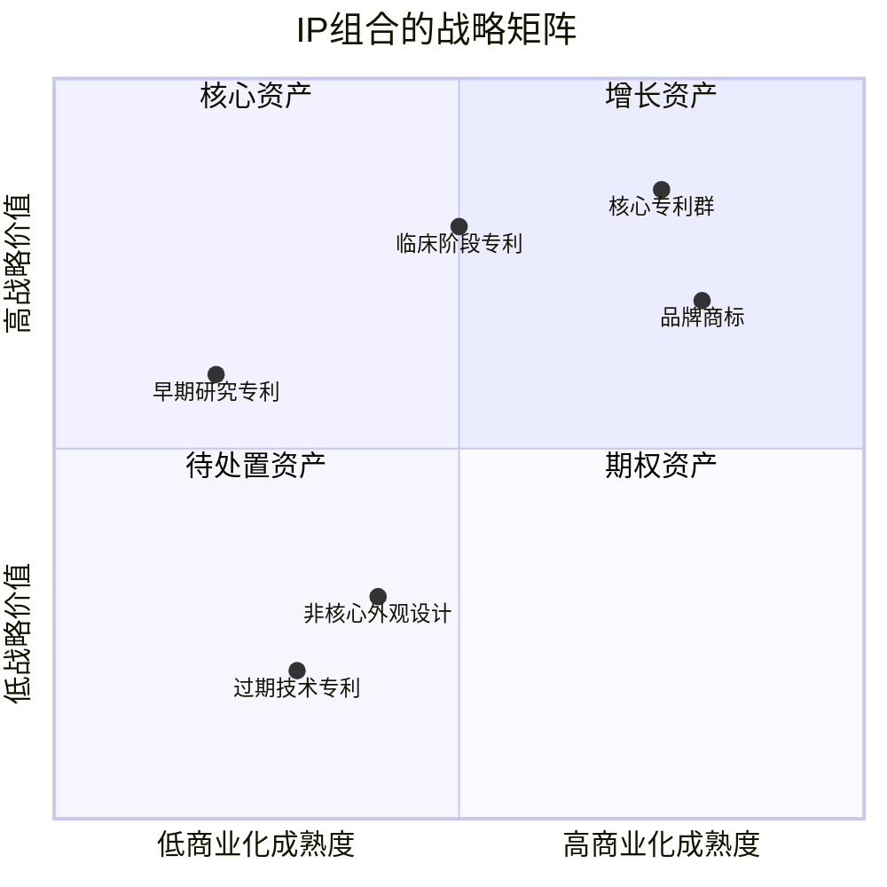
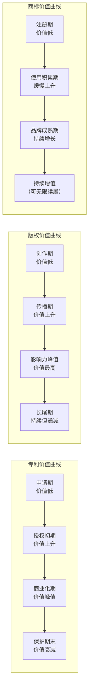
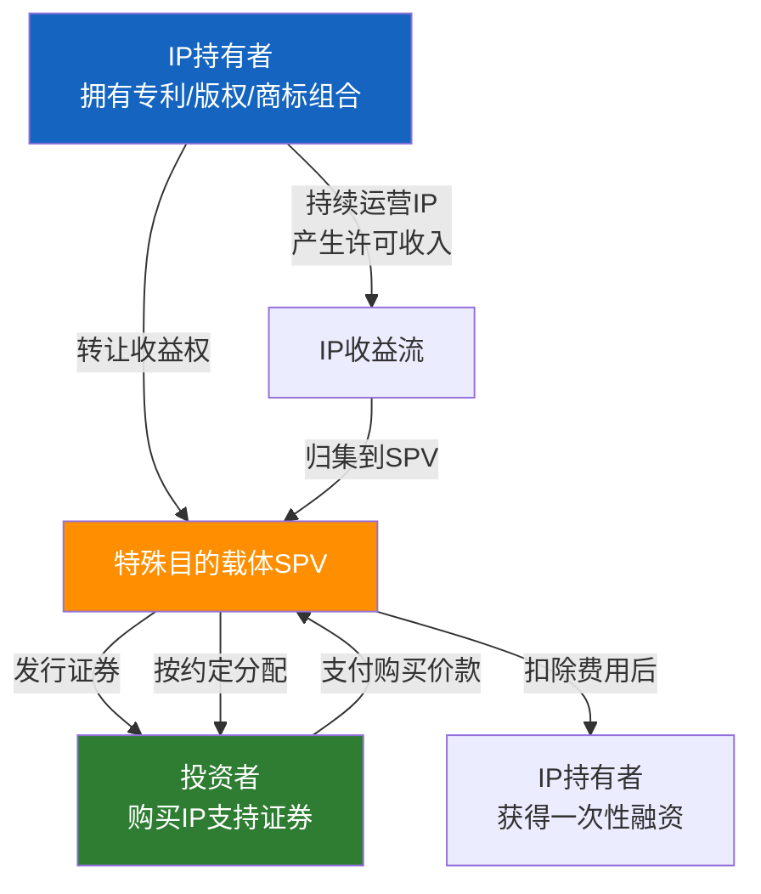
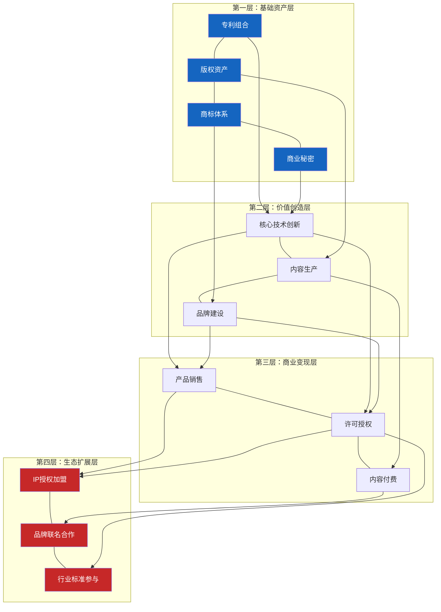

## 七、知识产权变现的进阶策略

前三节分别讲清了知识产权的类型、经济学分析和变现底层逻辑，本节在此基础上向上延伸——当基本变现模式（许可、销售、产品化）跑通之后，如何通过更系统化、更结构化的策略将IP的长期价值最大化。

进阶策略的核心区别在于：基础变现是"一项IP换一笔钱"，进阶变现是"一组IP形成一个系统，持续产生复合收益"。理解这一跃迁，需要掌握五个理论支柱：IP组合管理理论、IP生命周期经济学、平台与网络效应、IP资产化与金融化、以及生态系统协同理论。

### 1. IP组合管理理论

#### 1.1 从单一IP到组合思维

大多数个人和中小企业的IP管理停留在"有什么申请什么"的随机阶段。进阶策略的第一步，是将所有IP视为一个**组合（Portfolio）**，用投资组合的思维进行管理。

这一理论源于金融学中的现代投资组合理论（Modern Portfolio Theory, MPT），由Harry Markowitz于1952年提出。核心思想是：通过资产之间的相关性分析，可以在相同风险水平下获得更高收益，或在相同收益水平下承担更低风险。

将这一理论迁移到IP管理领域：

| 金融组合概念 | IP组合对应 | 含义 |
|-------------|-----------|------|
| 资产类别 | IP类型（专利/商标/版权/商业秘密） | 不同类型IP的风险收益特征不同 |
| 个股 | 单项IP资产 | 每项IP有独立的价值和风险 |
| 相关性 | 技术领域/市场领域的关联度 | 同领域IP受相同市场因素影响 |
| 分散化 | 跨领域、跨类型布局 | 降低单一市场波动的冲击 |
| 再平衡 | 定期审查、淘汰、补充 | 保持组合的最优状态 |

#### 1.2 IP组合的战略分类

一个成熟的IP组合通常包含三类资产，它们承担不同的战略角色：

**核心资产（Core Assets）**：构成竞争壁垒的关键IP，通常是围绕核心技术或核心品牌的专利群和商标。这类资产不以直接变现为目的，而是保护主营业务的利润率。例如，华为的5G标准必要专利群就是核心资产——它们不直接出售，但确保华为在全球通信设备市场的竞争地位。

**增长资产（Growth Assets）**：正在商业化或即将商业化的IP，预期在未来3-5年内产生显著收入。这类资产需要投入资源进行市场验证和商业化推进。例如，一家制药公司的临床阶段药物专利就是增长资产——高风险、高回报。

**期权资产（Option Assets）**：尚不明确商业化路径但具有潜在价值的IP，类似于金融期权——成本有限（申请和维护费用），但未来可能产生巨大收益。例如，一项早期的基础研究专利，当前没有直接应用场景，但如果未来某个技术方向成熟，该专利可能变得极其有价值。



**组合管理的关键决策：**

- **资源分配**：将有限的预算（申请费、维护费、维权费）在三类资产之间合理分配。一般建议核心资产占50%-60%、增长资产占25%-35%、期权资产占10%-20%
- **淘汰决策**：定期审查每项IP的维护成本与预期收益，对于不再具有战略或商业价值的IP，果断放弃续费，将资源重新分配到更有价值的方向
- **空白分析**：通过专利地图（Patent Map）分析技术领域中的空白地带，识别应该布局但尚未布局的方向

#### 1.3 专利组合的密度设计

单一专利容易被竞争对手绕过（Design Around），因此进阶策略强调**专利密度**——在核心技术周围构建密集的专利网络。

**专利密度的三种模式：**

| 模式 | 结构 | 适用场景 | 示例 |
|------|------|----------|------|
| 链式布局 | 核心专利+上下游改进专利 | 技术链条明确的领域 | 电池材料→电池结构→电池管理系统 |
| 网式布局 | 核心专利+多个替代实现方案 | 技术实现路径多样的领域 | 同一功能的不同算法实现 |
| 岛式布局 | 多个独立的应用场景专利 | 应用广泛但技术门槛不高的领域 | 同一技术在医疗/工业/消费领域的应用 |

**实操方法**：对每一项核心专利，问自己三个问题——(1)竞争对手最可能从哪个方向绕过？(2)这项技术的上下游还有哪些可专利的改进？(3)同一原理还有哪些替代实现？对每个答案申请相应的外围专利。

### 2. IP生命周期经济学

#### 2.1 IP的价值衰减曲线

不同类型的IP遵循不同的价值衰减模式，理解这些模式对于制定变现时机和策略至关重要。



**关键经济学特征对比：**

| 维度 | 专利权 | 版权（著作权） | 商标权 | 商业秘密 |
|------|--------|---------------|--------|----------|
| 价值峰值时间 | 授权后3-10年 | 发布后1-5年 | 使用5年以上 | 持续累积 |
| 衰减速度 | 快（到期归零） | 慢（长尾效应） | 极慢（可续展） | 泄密即归零 |
| 维护成本 | 高（年费递增） | 低（登记费一次性） | 中（续展费） | 高（保密措施） |
| 变现窗口期 | 较短（受保护期限制） | 长（作者终身+50年） | 极长（无限续展） | 不确定 |
| 最优变现策略 | 早期许可，中期最大化 | 持续授权，多平台分发 | 长期品牌建设 | 选择性披露换取合作 |

#### 2.2 变现时机的经济学分析

IP变现存在一个**最优时机窗口**——过早变现可能低估价值，过晚变现可能错过峰值。

**专利变现时机决策模型：**

设某专利的预期商业化收入流为R(t)，维护成本为C(t)，折现率为r，则该专利在时间T的净现值（NPV）为：

```text
NPV(T) = ∫[T to 保护期终] (R(t) - C(t)) / (1+r)^(t-T) dt
```

实际决策中，不需要精确计算这个积分，但需要理解以下规律：

- **技术成熟度**：技术越成熟、市场需求越明确，变现越早越有利。因为等待期间的维护成本在累积，而竞争对手的替代方案可能在逼近
- **保护期剩余**：剩余保护期越短，买方/被许可方愿意支付的价格越低（因为使用权的时间窗口在缩短）
- **市场时机**：如果该技术正好处于行业风口（如2023-2025年的AI相关专利），应尽快变现——风口过后溢价会大幅缩水
- **自身产业化能力**：如果你有能力和资源自行产业化，延迟变现（自己做产品）的总收益通常高于早期许可

#### 2.3 IP的折旧与摊销

从会计角度，IP作为无形资产需要进行折旧/摊销处理，这直接影响税务和财务报表：

- **专利权**：按法定保护期（发明专利20年）直线法摊销，或按预期经济寿命加速摊销
- **版权**：按预期经济寿命摊销，通常为5-10年（数字内容更新快）
- **商标权**：按10年摊销，续展后继续摊销
- **商业秘密**：不摊销（因为没有法定期限），但需要定期评估减值

**税务优化意义**：IP摊销可以抵减应纳税所得额。例如，如果你以100万元购入一项专利，按10年摊销，每年可以抵减10万元应税收入。在25%企业所得税率下，每年节税2.5万元。这意味着IP的实际购买成本低于名义价格。

### 3. 平台经济学与网络效应

#### 3.1 IP变现中的网络效应

当IP以数字产品形式变现时（如软件、课程、内容平台），平台经济学的规律会深刻影响变现策略。网络效应是其中最核心的概念。

**网络效应的类型：**

| 类型 | 机制 | IP变现中的体现 | 典型案例 |
|------|------|---------------|----------|
| 直接网络效应 | 用户越多，每个用户的价值越大 | 社群/社区类IP产品 | 知识星球、付费社群 |
| 间接网络效应 | 一侧用户增加，另一侧用户价值增加 | 内容-广告双侧平台 | B站UP主、公众号 |
| 数据网络效应 | 使用越多，产品越智能，吸引更多使用 | AI/算法类IP产品 | 推荐系统、智能工具 |
| 品牌网络效应 | 使用者越多，品牌价值越高，吸引新用户 | 品牌授权类IP | 潮牌联名、IP衍生品 |

**网络效应对IP定价的影响：**

传统IP定价基于成本加成或市场比较，但在网络效应显著的场景下，定价策略需要考虑**增长优先**原则——初期以低价甚至免费获取用户，利用网络效应形成壁垒后再提高价格。这与传统"卖IP"的思维截然不同。

具体来说，网络效应下IP产品的最优定价路径通常为：

```text
阶段1（冷启动）：免费或极低价 → 目标：获取种子用户，验证需求
阶段2（增长期）：低价 → 目标：快速扩大用户基数，形成网络效应
阶段3（成熟期）：阶梯定价 → 目标：对不同用户群收取不同价格（价格歧视）
阶段4（垄断期）：溢价定价 → 目标：利用市场支配地位获取超额利润
```

#### 3.2 平台型IP的双边市场结构

当IP持有者搭建平台（而非单纯出售IP）时，本质上是在运营一个双边市场。平台经济学的核心定理是：**一边的定价可以为负（补贴），只要另一边的收入能覆盖成本并盈利**。

**平台型IP变现的常见结构：**

| 平台角色 | 补贴侧 | 盈利侧 | IP持有者的收入来源 |
|----------|--------|--------|-------------------|
| 知识付费平台 | 内容创作者（提供流量扶持） | 学习者（收取课程费分成） | 平台服务费+课程分成 |
| 技术授权平台 | 技术使用者（免费试用期） | 商业使用者（付费授权） | 分级许可费 |
| 内容分发平台 | 消费者（免费内容引流） | 广告主/付费会员 | 广告收入+会员费 |
| IP衍生品平台 | 粉丝（内容/社群免费） | 品牌方（授权费+销售分成） | 授权保底+销售分成 |

#### 3.3 锁定效应与转换成本

IP产品如果能创造高转换成本，就能实现持续变现而非一次性交易。转换成本的来源：

- **数据锁定**：用户在平台上积累了大量数据（学习记录、创作内容），迁移成本极高
- **习惯锁定**：用户已经习惯了产品的操作方式和生态，学习新产品的成本高于留在原平台
- **社交锁定**：用户的关系网络在平台上，迁移意味着丢失社交连接
- **内容锁定**：独家内容只在该平台可用，用户无法在其他地方获取

**实操建议**：在设计IP产品时，有意识地构建转换成本——但要注意边界，合理的转换成本提升用户粘性，过高的转换成本（如数据不导出、格式不兼容）会引发用户反感和监管风险。

### 4. IP资产化与金融化

#### 4.1 IP资产化的理论基础

IP资产化是指将知识产权从"法律权利"转化为可计量、可交易、可融资的"经济资产"。这一过程的理论基础包括：

**无形资产评估的三大方法：**

| 方法 | 原理 | 适用场景 | 局限性 |
|------|------|----------|--------|
| 成本法 | 重置该IP需要多少成本 | 缺乏市场数据时的下限估值 | 无法反映IP的未来收益潜力 |
| 市场法 | 参照类似IP的交易价格 | 有活跃交易市场的成熟IP | 独特性强的IP难以找到可比交易 |
| 收益法 | 预期未来收益的折现值 | 已有商业化收入或明确收入预期的IP | 依赖对未来现金流的预测准确性 |

**收益法的计算框架：**

收益法是IP评估中最常用的方法，其核心公式为：

```text
IP价值 = Σ [未来第t年的预期收益 × (1 - 折现率)^t]
```

其中关键参数的确定方法：

- **预期收益**：基于IP的历史收入数据、市场增长率、竞争态势等因素预测。保守做法取3年平均值，进取做法取增长趋势外推值
- **折现率**：反映IP投资的风险水平。一般IP的折现率为15%-30%（高于有形资产，因为IP的风险更高）。高确定性的标准必要专利可以用10%-15%，早期技术专利可以用25%-30%
- **收益期限**：取法定保护期和经济寿命中的较短者。发明专利最长20年，但大多数技术专利的经济寿命为5-10年

#### 4.2 IP证券化

IP证券化是将一组IP的未来收益权打包成标准化金融产品出售给投资者，从而提前获取现金流。这一模式的理论基础是资产证券化（Asset-Backed Securities, ABS）。

**IP证券化的完整交易结构：**



**经典案例解析：**

**Bowie Bonds（1997年）**：音乐家David Bowie将其25张专辑的未来版税收入证券化，通过Prudential Insurance发行了5500万美元的债券，票面利率7.9%，期限10年。这是全球第一单IP证券化交易，开创了"娱乐证券化"这一全新资产类别。

这笔交易的核心逻辑：Bowie需要现金但不想出售版权——他相信自己音乐的长期价值远高于5500万美元。通过证券化，他用未来的收入流换取了今天的现金，同时保留了版权的所有权（10年期满后版税收入重新归他所有）。

**中国IP证券化的现状与挑战：**

国内IP证券化起步较晚但发展迅速。2018年以来，多家企业尝试了以专利许可费、影视版权收入、音乐版税等为基础资产的证券化产品。主要挑战包括：

- **估值困难**：国内IP评估体系不够成熟，基础资产的现金流预测不确定性高
- **法律框架**：IP收益权的法律性质、转让效力等在法律上尚有模糊地带
- **二级市场缺失**：IP支持证券的流动性差，投资者退出渠道有限

#### 4.3 IP质押融资

IP质押融资是将知识产权作为抵押物向金融机构获取贷款，是IP资产化的初级但最实用的形式。

**操作流程：**

1. **IP评估**：委托具有资质的评估机构对IP进行价值评估，出具评估报告
2. **质押登记**：向国家知识产权局（专利权）或商标局（商标权）办理质押登记
3. **银行审批**：银行根据评估价值、IP类型、借款人资质等因素审批贷款额度
4. **放款**：通常贷款额度为评估价值的30%-50%（折扣率较高是因为IP变现的不确定性大）
5. **还款与解押**：按期还款后解除质押

**各类型IP的质押融资可操作性对比：**

| IP类型 | 银行接受度 | 典型折扣率 | 政策支持力度 | 适合场景 |
|--------|-----------|-----------|-------------|----------|
| 发明专利 | 较高 | 30%-40% | 强（有贴息政策） | 有明确产业化前景的技术 |
| 实用新型 | 中等 | 20%-30% | 中等 | 产品改进型技术 |
| 商标权 | 较高 | 40%-50% | 强 | 知名品牌的短期融资 |
| 软件著作权 | 中等 | 20%-30% | 中等 | 软件企业的流动资金需求 |
| 版权（内容） | 较低 | 10%-20% | 弱 | 影视/音乐版权的项目融资 |

#### 4.4 IP入股与作价出资

以知识产权作价出资是另一种资产化方式——你不卖IP，也不借钱，而是用IP换取目标公司的股权。

**法律基础**：《中华人民共和国公司法》允许股东以知识产权等可以用货币估价并可以依法转让的非货币财产作价出资。2024年新修订的公司法进一步明确了无形资产出资的规则。

**操作要点：**

- **评估作价**：必须委托评估机构出具评估报告，不得高估或低估
- **权属转移**：需要办理IP权属变更登记（专利权变更到目标公司名下）
- **出资比例**：2024年公司法已取消知识产权出资比例上限（此前为注册资本的70%）
- **实缴期限**：新公司法要求5年内实缴到位

**适用场景分析：**

| 场景 | 操作方式 | 优势 | 风险 |
|------|---------|------|------|
| 技术合伙创业 | 技术方以专利入股，资金方以现金入股 | 降低现金出资压力 | 估值分歧可能引发纠纷 |
| 产业合作 | 以IP入股合作方的项目公司 | 绑定利益，共享产业化收益 | IP被锁定在特定项目中 |
| 并购交易 | 被收购方以IP作价换取收购方股权 | 延迟纳税（特殊性税务处理） | 股权价值波动风险 |

### 5. 生态系统协同理论

#### 5.1 IP生态系统的构建逻辑

最高阶的IP变现策略不是管理单项IP或IP组合，而是构建一个**IP生态系统**——让多项IP之间形成互补、增强、协同的关系网络，产生1+1>2的效果。

这一理论的核心来自James Moore于1993年提出的**商业生态系统（Business Ecosystem）**理论，以及后来的平台生态系统研究。

**IP生态系统的四层结构：**



#### 5.2 生态协同的三种效应

**互补效应**：不同IP之间形成互补关系，组合使用时价值大于单独使用。例如，专利保护技术方案，商标建立品牌认知，版权锁定内容表达——三者组合构成完整的商业壁垒，竞争对手需要同时突破三道防线。

**杠杆效应**：利用已有IP的影响力降低新IP的推广成本。例如，一个拥有10万读者的技术博客（版权资产）发布一本新书时，推广成本远低于从零开始的作者。已有IP的受众基础就是杠杆的支点。

**飞轮效应**：IP生态系统中各部分互相推动，形成正反馈循环：

```text
优质IP内容 → 吸引用户 → 积累数据和口碑 → 提升产品价值 → 增加收入 → 投入更多资源创造优质IP
```

亚马逊创始人Jeff Bezos提出的"飞轮理论"完美适用于IP生态——初始推动飞轮需要很大的力（早期投入），但一旦飞轮转起来，每一圈都在为下一圈积蓄动能。

#### 5.3 开放与封闭的战略平衡

IP生态系统面临一个根本性战略选择：**多大程度上开放IP，多大程度上封闭保护？**

| 策略 | 做法 | 优势 | 劣势 | 适用场景 |
|------|------|------|------|----------|
| 完全封闭 | 所有IP严格保护，不对外授权 | 最大化控制力和利润 | 生态扩展慢，可能被替代方案颠覆 | 核心技术壁垒极高的情况 |
| 选择性开放 | 核心IP封闭，非核心IP开放 | 平衡控制力和生态扩展 | 需要精确判断哪些是核心 | 大多数成熟企业的做法 |
| 开放核心 | 基础技术开放，增值服务收费 | 快速建立生态，形成事实标准 | 核心技术可能被竞争对手利用 | 平台型商业模式 |
| 完全开源 | 所有IP免费开放 | 最大化生态扩展和社区贡献 | 直接变现困难 | 以影响力和增值服务变现 |

**开放策略的经济学逻辑**：

选择性开放的理论基础是"两段收费（Two-Part Tariff）"——将IP的价值拆分为"准入价值"和"使用价值"。例如，Android系统开源（准入免费），但Google通过GMS许可（使用收费）和广告（数据变现）获取收入。Red Hat将Linux开源（准入免费），但通过企业级支持服务（使用收费）实现数十亿美元年收入。

对个人IP持有者的启示：即使你选择开放部分内容，也要确保有一个清晰的**商业化层**在开放层之上——免费内容吸引用户，付费服务实现变现。

### 6. 进阶策略的决策框架

#### 6.1 策略成熟度模型

IP变现策略可以分为五个成熟度等级，每一级对应不同的管理能力和资源投入：

| 等级 | 名称 | 特征 | 关键能力要求 | 典型年收入规模 |
|------|------|------|-------------|---------------|
| L1 | 被动持有 | 有IP但不主动变现 | 法律意识 | 0-5万元 |
| L2 | 主动许可 | 开始对外授权或销售 | 商务谈判 | 5-50万元 |
| L3 | 产品化 | IP转化为持续收入的产品 | 产品设计+运营 | 50-500万元 |
| L4 | 组合管理 | 系统化管理IP组合 | 战略规划+财务分析 | 500万-5000万元 |
| L5 | 生态构建 | 围绕IP构建商业生态 | 平台运营+资本运作 | 5000万元以上 |

大多数个人和中小企业处于L1-L2阶段，向L3跃迁是最大的瓶颈——这需要从"卖IP"思维转向"做产品"思维。

#### 6.2 策略选择的自检清单

在确定进阶策略之前，回答以下问题：

**基础条件评估：**
- [ ] 你拥有哪些类型的IP？数量和质量如何？
- [ ] 这些IP目前的变现状态是什么？（未变现/低效变现/高效变现）
- [ ] 你的IP是否有明确的目标市场和用户群体？

**能力评估：**
- [ ] 你是否有能力独立将IP产品化？（技术能力+产品能力+运营能力）
- [ ] 你是否有资金支持IP的商业化推进？
- [ ] 你是否有行业人脉和渠道资源？

**市场评估：**
- [ ] 你的IP所在领域的市场容量有多大？
- [ ] 竞争对手的IP布局如何？你的差异化在哪里？
- [ ] 市场趋势对你的IP是有利还是不利？

**根据答案选择策略：**

- 基础条件好+能力强 → L4/L5（组合管理或生态构建）
- 基础条件好+能力不足 → L2（许可授权，借助他人的能力变现）
- 基础条件一般+能力强 → L3（聚焦一个方向，将单一IP产品化）
- 基础条件一般+能力一般 → L1→L2（先积累IP，再考虑变现）

#### 6.3 进阶策略的常见陷阱

| 陷阱 | 表现 | 根因 | 纠正方法 |
|------|------|------|----------|
| 过早证券化 | IP组合尚小就开始搞ABS | 追求模式创新而忽视基本功 | 先把许可/产品化做好，年收入稳定在百万级以上再考虑 |
| 盲目开源 | 核心技术免费开放 | 被"开放生态"的概念吸引，忽视变现路径 | 开放前想清楚商业模式，确保有收费层在开放层之上 |
| 组合臃肿 | 大量低价值IP占据维护预算 | 不舍得放弃已申请的IP，沉没成本谬误 | 每年做一次IP审计，果断淘汰无价值IP |
| 生态幻觉 | 认为有了几项IP就构成了"生态" | 对生态系统概念理解表面化 | 真正的生态需要用户、产品、合作伙伴三个要素同时具备 |
| 估值泡沫 | 对自己的IP价值评估过高 | 情感投入导致的确认偏误 | 委托第三方评估，或参照可比交易数据 |
| 忽视执行 | 策略规划完美但不落地 | 规划的时间远远超过执行的时间 | 用70%的时间执行，30%的时间规划；每季度复盘一次 |

### 7. 本节要点回顾

| 进阶策略 | 核心思想 | 关键行动 | 适用阶段 |
|----------|---------|----------|----------|
| IP组合管理 | 从管理单项IP到管理IP组合 | 组合分类、密度设计、定期审计 | L2-L4 |
| 生命周期经济学 | 在正确的时间做正确的事 | 识别价值曲线、把握变现窗口 | 全阶段 |
| 平台与网络效应 | 用户越多价值越大 | 增长优先定价、构建转换成本 | L3-L5 |
| IP资产化与金融化 | 将法律权利转化为经济资产 | 评估、质押、证券化、入股 | L3-L4 |
| 生态系统协同 | 多IP协同产生复合价值 | 互补布局、杠杆利用、飞轮构建 | L4-L5 |

进阶策略不是空中楼阁——它们建立在前几节讲授的基础理论之上。先确保基础变现模式跑通（许可、销售、产品化能产生稳定收入），再考虑进阶策略。跳过基础直接做进阶，是大多数IP变现失败的根本原因。

***
