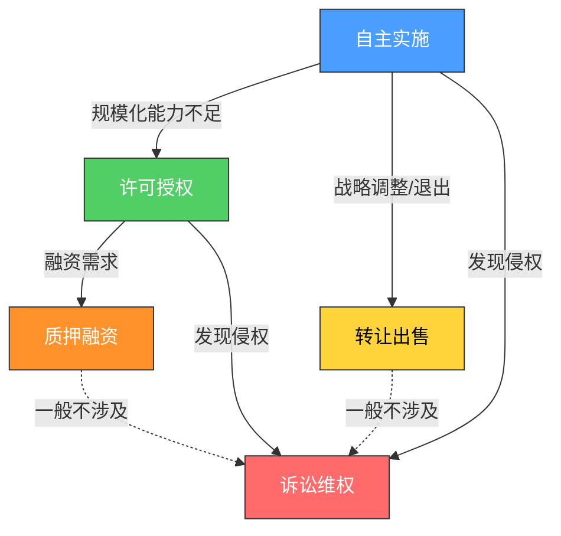

## 八、本节总结

本节是"理论基础"板块的收束篇。前面七个文件分别讲了知识产权的四大类型、经济学分析框架、变现底层逻辑、知识付费的经济学基础、进阶策略、商业化运营体系和常见误区。本节的目标是将这七块拼图拼成一张完整的知识地图——不是简单复述，而是提炼核心脉络、建立概念之间的逻辑连接、指出需要特别注意的关键节点，帮助你在进入"核心技巧"板块之前，对整个理论框架形成结构化的认知。

### 1. 知识产权变现的核心公式

本节理论基础的所有内容，都围绕一个核心公式展开：

```text
知识产权变现 = 创造（Creation）× 保护（Protection）× 运营（Operation）
```

这个公式揭示了三个关键点：

- **乘法关系意味着任何一项为零，结果都是零。** 你有再好的创意，不保护就等于替竞争对手做免费调研；你有再强的保护，不会运营就是抱着金饭碗要饭。
- **创造是必要条件但不是充分条件。** 大多数人高估了"创造"的价值，低估了"保护"和"运营"的价值。个人发明人专利转化率不足5%，不是因为技术不好，而是因为没有商业化运营能力。
- **飞轮效应：** 创造→保护→运营→收入再投入创造，每转一圈，资产库就更厚一层。第一次变现最难，但一旦飞轮转起来，后面的加速度越来越大。


### 2. 四大类型的知识产权——快速对照框架

理论基础的第一个板块（知识产权的四大类型）建立了最基础的分类认知。以下是核心要点的提炼：

| 维度 | 专利权 | 商标权 | 版权（著作权） | 商业秘密 |
|------|--------|--------|----------------|----------|
| **保护对象** | 技术方案、产品设计 | 品牌标识、商业信誉 | 文学、艺术、科学作品 | 技术信息、经营信息 |
| **取得方式** | 申请审批（主动确权） | 申请注册（主动确权） | 自动产生（创作完成即有） | 自动产生（满足三要件） |
| **保护期限** | 发明20年/实用新型10年/外观15年 | 10年（可无限续展） | 作者终身+死后50年 | 无期限（保密即保护） |
| **变现方式** | 实施、许可、转让、质押、诉讼 | 品牌授权、商标转让 | 授权、转让、产品化 | 自主实施（不公开） |
| **入门难度** | 较高（需技术撰写能力） | 中等（流程标准化） | 低（自动获得） | 低（但需建立保密体系） |
| **变现天花板** | 极高（标准必要专利年入数十亿） | 极高（头部品牌授权百亿级） | 高（爆款内容年入千万级） | 高（但无法直接交易） |

**选择策略的关键判断逻辑：**

- 你有技术创新 → 优先考虑专利保护
- 你有品牌标识 → 优先考虑商标注册
- 你有原创内容 → 版权自动产生，但建议主动登记
- 你有核心配方/工艺/客户数据 → 考虑商业秘密保护
- 大多数情况 → 需要多种类型组合保护（如一个软件产品同时涉及专利、版权和商业秘密）

### 3. 经济学分析框架——为什么知识产权能赚钱

理论基础的第二个板块从经济学角度解释了知识产权变现的底层逻辑。核心要理解三个经济学特征：

**特征一：高固定成本、低边际成本**

创造一项知识产权的成本是固定的（研发一个专利可能花10万元），但一旦创造完成，多授权给一家企业的边际成本几乎为零。这意味着授权规模越大，利润率越高。一门课程录制花了100小时，卖给1个人和卖给10000个人，制作成本完全相同——这就是知识资产的"复制零成本"优势。

**特征二：独占性带来的定价权**

法律赋予的排他性使用权意味着你可以定价，而不只是接受市场价格。普通商品竞争激烈、利润趋零，但有专利保护的产品可以享受垄断利润——直到专利过期。这也是为什么华为每年投入超过1600亿元研发费用，因为专利带来的定价权和交叉许可价值远超研发投入。

**特征三：网络效应与品牌溢价**

某些知识产权（特别是品牌和标准必要专利）具有网络效应：使用的人越多，价值越大。iPhone的商标、5G的必要专利、"得到"的品牌——都是越用越值钱的例子。

**关键推论：** 这三个特征决定了知识产权变现的最优策略是"规模化授权"而非"一次性出售"。除非你急需现金流，否则尽量选择许可而非转让，因为许可是持续收入，转让是一锤子买卖。

### 4. 变现的底层逻辑——五种变现模式的内在关系

理论基础的第三个板块梳理了知识产权变现的五种核心模式。理解它们之间的递进关系至关重要：



| 模式 | 收入特征 | 适用场景 | 风险等级 |
|------|----------|----------|----------|
| 自主实施 | 持续经营收入，天花板高 | 有生产/运营能力的个人或团队 | 高（需承担经营风险） |
| 许可授权 | 持续被动收入，可规模化 | 技术实力强但不想自己生产 | 中（需维护许可关系） |
| 转让出售 | 一次性收入，金额较大 | 战略调整、退出某个领域 | 低（交易完成即了结） |
| 质押融资 | 获得资金但保留所有权 | 需要资金但看好未来收益 | 中（需按时还款） |
| 诉讼维权 | 赔偿收入 + 震慑效果 | 发现明确侵权行为 | 高（诉讼成本和时间成本） |

**进阶理解：** 这五种模式不是互斥的，而是可以组合使用。同一个专利，你可以自己实施一部分市场（自主实施），同时许可给其他领域的厂商（许可授权），在需要资金时质押给银行（质押融资），发现侵权时提起诉讼（诉讼维权）。这就是"商业化运营体系"的核心思想——把单一IP的价值最大化。

### 5. 知识付费的经济学基础——为什么内容能卖钱

理论基础的第四个板块专门分析了知识付费这个快速增长的变现方式（中国知识付费市场规模已突破1800亿元）。核心经济学原理包括：

**信息不对称理论：** 知识付费的本质是卖方利用信息优势，为买方提供经过筛选、结构化、可执行的知识。用户买的不是"信息"（信息到处都是），而是"筛选+结构化+可执行"的效率。

**注意力经济学：** 在信息过载的时代，注意力是最稀缺的资源。知识付费产品本质上是在帮用户节省注意力——把分散在互联网各处的信息，浓缩成系统化的课程。

**边际成本趋零：** 一门在线课程的制作成本是固定的，但每多卖一份的边际成本几乎为零。这意味着知识付费产品天然适合规模化销售。

**关键定价原则：** 定价要基于价值，不是成本。一门课程录制花了100小时，但它的定价应该基于"用户学了之后能赚/省多少钱"，而不是"我花了多少时间"。

### 6. 进阶策略与商业化运营体系——从单点到系统

理论基础的第五和第六个板块分别讲了进阶策略和商业化运营体系。将两者合并理解，可以看到知识产权变现的完整进阶路径：

**阶段一：单点突破（入门期）**

- 选择一种知识产权类型，完成第一次变现
- 目标：验证模式可行性，建立信心
- 典型路径：写一篇文章→发布到平台→获得稿费或流量收入

**阶段二：矩阵扩展（成长期）**

- 从单一IP扩展到多个IP的组合
- 目标：分散风险，增加收入来源
- 典型路径：一篇文章→系列课程→配套书籍→品牌商标

**阶段三：系统运营（成熟期）**

- 建立IP运营体系，实现自动化变现
- 目标：被动收入占比超过主动收入
- 典型路径：品牌授权→IP矩阵→平台化运营→投资孵化新IP

**商业化运营体系的核心要素：**

| 要素 | 内容 | 关键动作 |
|------|------|----------|
| IP资产盘点 | 梳理现有知识产权的数量、质量和商业价值 | 建立IP资产台账，定期评估 |
| 变现路径规划 | 为每个IP选择最优变现模式 | 绘制变现路径图，设定里程碑 |
| 保护体系搭建 | 确权、监控、维权三位一体 | 定期检索、设置侵权预警、建立维权SOP |
| 运营团队建设 | 从个人作战到团队协作 | 明确分工：内容、运营、法务、商务 |
| 数据驱动优化 | 用数据指导IP投入和变现决策 | 跟踪收入、转化率、用户反馈等核心指标 |

### 7. 常见误区——理论阶段就要避免的坑

理论基础的第七个板块列出了知识产权变现中的常见误区。在进入实操之前，先把这些误区内化，可以少走很多弯路：

**误区一：所有创意都值得保护。** 事实是，只有能商业化、有市场需求的创意才值得投入保护成本。在申请专利或注册商标之前，先做市场验证。

**误区二：保护了就等于赚钱。** 知识产权保护只是获得了"排他权"，不等于自动产生收入。保护是必要条件，但变现还需要运营能力。

**误区三：只选一种变现模式。** 很多人只知道"自己生产销售"或"授权给别人"，不知道可以多种模式组合使用。同一件IP，在不同阶段、不同场景下，最优变现模式可能完全不同。

**误区四：忽视维护成本。** 专利需要缴纳年费，商标需要续展，版权登记需要更新。如果不持续维护，知识产权可能失效。

**误区五：先做大再保护。** 很多人觉得"等我做大了再注册商标"，结果品牌做大了发现商标被人抢注，代价是原来的几十倍甚至上百倍。

**误区六：闭门造车不看市场。** 知识产权的价值最终由市场决定。不了解市场需求就埋头创造，很可能产出一堆没有商业价值的"专利垃圾"。

**误区七：低估法律风险。** 知识产权领域充满法律陷阱：专利侵权、商标抢注、版权纠纷。在变现之前，先了解基本的法律风险。

### 8. 理论基础的知识框架总览

将整个理论基础板块的内容整合为一张知识框架图：

```mermaid
graph TD
    ROOT[理论基础: 知识产权变现的底层认知] --> T1[四大类型]
    ROOT --> T2[经济学分析]
    ROOT --> T3[变现逻辑]
    ROOT --> T4[知识付费]
    ROOT --> T5[进阶策略]
    ROOT --> T6[运营体系]
    ROOT --> T7[常见误区]

    T1 --> T1a[专利: 技术方案]
    T1 --> T1b[商标: 品牌标识]
    T1 --> T1c[版权: 原创作品]
    T1 --> T1d[商业秘密: 核心信息]

    T2 --> T2a[高固定成本低边际成本]
    T2 --> T2b[独占性定价权]
    T2 --> T2c[网络效应与品牌溢价]

    T3 --> T3a[自主实施]
    T3 --> T3b[许可授权]
    T3 --> T3c[转让出售]
    T3 --> T3d[质押融资]
    T3 --> T3e[诉讼维权]

    T4 --> T4a[信息不对称理论]
    T4 --> T4b[注意力经济学]
    T4 --> T4c[边际成本趋零]

    T5 --> T5a[单点突破]
    T5 --> T5b[矩阵扩展]
    T5 --> T5c[系统运营]

    T6 --> T6a[IP资产盘点]
    T6 --> T6b[变现路径规划]
    T6 --> T6c[保护体系搭建]

    T7 --> T7a[创意≠值得保护]
    T7 --> T7b[保护≠自动赚钱]
    T7 --> T7c[维护成本不可忽视]

    style ROOT fill:#ff6b6b,stroke:#333,color:#fff
    style T1 fill:#4a9eff,stroke:#333,color:#fff
    style T2 fill:#4a9eff,stroke:#333,color:#fff
    style T3 fill:#4a9eff,stroke:#333,color:#fff
    style T4 fill:#4a9eff,stroke:#333,color:#fff
    style T5 fill:#4a9eff,stroke:#333,color:#fff
    style T6 fill:#4a9eff,stroke:#333,color:#fff
    style T7 fill:#4a9eff,stroke:#333,color:#fff
```



### 9. 从理论到实践的衔接

理论基础板块结束了，但知识的价值在于应用。进入"核心技巧"板块之前，请确认自己已经具备以下认知基础：

| 认知基础 | 验证标准 | 对应文件 |
|----------|----------|----------|
| 能区分四种知识产权类型 | 能为一个具体案例判断应使用哪种保护方式 | 01-知识产权的四大类型 |
| 理解知识产权的经济特性 | 能解释为什么授权比转让更优 | 02-经济学分析 |
| 掌握五种变现模式 | 能为一个IP设计组合变现方案 | 03-变现底层逻辑 |
| 理解知识付费的定价逻辑 | 能为一门课程制定合理定价 | 04-知识付费经济学 |
| 了解进阶路径 | 能规划自己的IP变现阶段目标 | 05-进阶策略 |
| 理解运营体系 | 能搭建基本的IP资产管理体系 | 07-商业化运营体系 |
| 内化常见误区 | 能识别并规避至少5个常见错误 | 08-常见误区 |

如果上述任何一项还不够清晰，建议回到对应文件重新阅读。理论基础打不牢，后面的实操技巧就是空中楼阁。

> **心法：** 知识产权变现的核心不是"聪明"，而是"系统"。一个有系统思维的普通人，比一个有创意但零散行动的天才，在知识产权变现这条路上走得更远。理论基础板块给你的，就是这套系统思维的底座。
