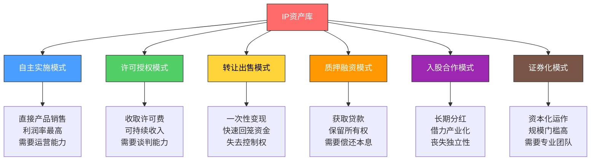
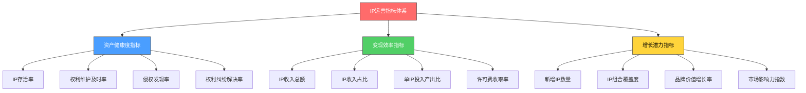
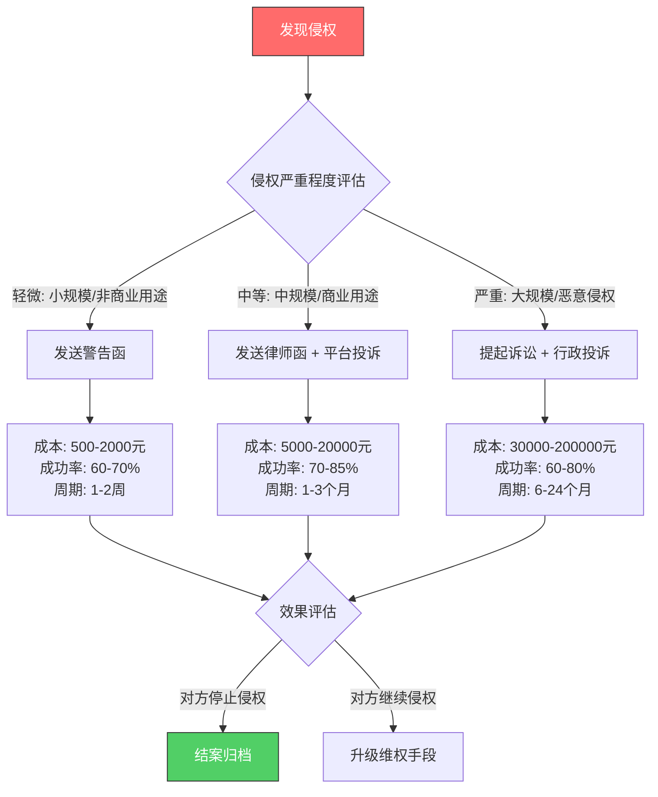

## 八、知识产权的商业化运营体系

知识产权的商业化不是一次性的交易行为，而是一个需要持续运营的系统工程。前文我们讨论了IP变现的底层逻辑和进阶策略，本节将把这些策略整合为一个可执行的运营体系——从IP资产的全生命周期管理、商业模式架构设计、运营指标体系，到组织能力建设和持续优化机制，构建一套完整的商业化运营方法论。

理解这一点至关重要：**拥有知识产权只是起点，建立运营体系才是真正的护城河。** 一项专利躺在证书上一文不值，一门课程放在硬盘里没有收入，一个商标注册后从未使用就面临被撤销的风险。商业化运营体系的价值，就是把静态的法律权利转化为动态的收入流。

### 一、IP资产全生命周期管理

知识产权从诞生到产生商业价值，经历一个完整的生命周期。每个阶段需要不同的管理策略和资源配置。

#### 1.1 生命周期五阶段模型


**阶段一：创造阶段（Creation）**

核心任务：将智力成果转化为可保护的IP产出。

- **需求导向创造**：不是闭门造车，而是基于市场调研确定创造方向。先看市场需要什么，再决定创造什么。具体方法包括：分析行业专利地图寻找技术空白、研究竞品版权布局发现内容机会、调研目标受众的付费意愿和价格敏感度。
- **质量控制**：建立内部评审机制，确保产出的IP具有足够的创新性和商业价值。对于专利，需要进行初步的新颖性检索；对于内容，需要进行原创性检查和市场对标分析。
- **成本预估**：在这个阶段就要估算确权成本和运营成本，确保预期收益能够覆盖投入。发明专利从申请到授权的总成本通常在5000-30000元（含代理费），实用新型在2000-8000元，版权登记在100-500元。

**阶段二：确权阶段（Protection）**

核心任务：通过法律程序获得正式的知识产权保护。

- **确权策略选择**：根据IP类型和商业目标选择最优的确权方式。一项技术方案可能适合申请专利，也可能更适合作为商业秘密保护——如果技术容易被反向工程，选专利；如果难以被反向工程（如配方、算法细节），选商业秘密。
- **确权时机把控**：过早申请可能技术不够成熟，过晚申请可能被他人抢先。对于专利，建议在技术方案基本成型但尚未公开发表时申请；对于商标，建议在品牌定位确定后、大规模推广前注册；对于版权，创作完成即自动获得保护，但建议在发布前完成登记。
- **权利范围设计**：专利的权利要求书决定了保护范围，写得太窄容易被绕过，写得太宽容易被驳回。商标的类别选择决定了保护的商品/服务范围，漏注核心类别等于给竞争对手留了入口。

**阶段三：运营阶段（Operation）**

核心任务：通过商业化手段将IP转化为收入。

这是本节的核心内容，将在后文详细展开。运营阶段的关键动作包括：确定变现模式（自主实施/许可授权/转让出售/质押融资）、建立定价体系、构建渠道网络、签订商业合同、收取和管理收入。

**阶段四：增值阶段（Enhancement）**

核心任务：通过持续投入提升IP的商业价值。

- **专利增值**：申请外围专利扩大保护范围、将专利纳入行业标准提升议价能力、通过诉讼或诉讼威胁提高许可费率。
- **品牌增值**：持续投入品牌建设、扩展品牌覆盖的品类、通过联名合作提升品牌认知度。
- **内容增值**：更新课程内容保持时效性、开发进阶版本覆盖更高需求、建立用户社区增强粘性。
- **组合增值**：将多个单项IP组合为IP包，整体价值大于各部分之和。例如，一项核心专利+10项外围专利+相关商标+技术文档的组合包，其许可价格远高于单项专利。

**阶段五：迭代/退出阶段（Iteration/Exit）**

核心任务：决定IP的最终处置方式。

- **迭代升级**：对仍有价值的IP进行技术升级或内容更新，重新进入创造阶段。例如，专利到期前申请改进型专利延续保护、课程更新到第二版/第三版。
- **有序退出**：对不再具有商业价值的IP，选择主动放弃维护（节省年费）或以残值转让。不要为了"沉没成本"而持续为低价值IP支付维护费用。
- **资产清算**：在企业并购、重组或破产场景下，IP资产需要进行独立评估和处置。

#### 1.2 IP资产盘点与分级

建立运营体系的第一步是摸清家盘——你到底有哪些IP资产，每个资产处于什么状态，价值几何。

**IP资产清单模板：**

| 序号 | IP名称 | 类型 | 状态 | 注册/登记号 | 取得日期 | 到期日期 | 年维护成本 | 当前年收入 | 价值评级 |
|------|--------|------|------|------------|----------|----------|-----------|-----------|----------|
| 1 | XX方法专利 | 发明专利 | 已授权 | ZL2023XXXXXX | 2023-06 | 2043-06 | 900元 | 0元 | B |
| 2 | XX品牌 | 商标 | 已注册 | XXXXXXXX | 2022-03 | 2032-03 | 0元 | 5万元 | A |
| 3 | XX课程 | 版权 | 已登记 | 国作登字-2024-XXXXX | 2024-01 | 2074-01 | 0元 | 12万元 | S |

**价值评级标准：**

| 评级 | 年收入潜力 | 市场稀缺性 | 战略重要性 | 管理动作 |
|------|-----------|-----------|-----------|----------|
| S | >50万元 | 不可替代 | 核心竞争力 | 重点投入，专人管理 |
| A | 10-50万元 | 较稀缺 | 重要支撑 | 持续运营，定期优化 |
| B | 1-10万元 | 有替代 | 辅助价值 | 常规维护，关注机会 |
| C | <1万元 | 可替代 | 边缘价值 | 评估是否继续维护 |

**盘点频率建议**：至少每半年进行一次全面盘点，每季度进行一次增量更新。对于快速变化的领域（如软件、内容），建议每月跟踪关键指标。

### 二、商业模式架构设计

商业化运营体系的核心是选择和组合合适的商业模式。不同类型的IP适合不同的商业模式，同一IP也可以同时采用多种模式。

#### 2.1 六种核心商业模式



**模式一：自主实施模式**

定义：将IP转化为自有产品或服务，直接面向终端市场销售。

适用条件：
- 具备产品开发和市场运营能力
- 目标市场规模足够大，值得投入
- IP具有较强的技术壁垒或内容壁垒

收入结构：产品销售收入 - 开发成本 - 运营成本 = 净利润。利润率取决于产品类型，软件/SaaS产品毛利率可达70%-90%，实体产品通常在30%-60%。

风险提示：需要承担全部的市场风险和运营风险。产品卖不动，所有前期投入都打水漂。建议先用最小可行产品（MVP）验证市场需求，再加大投入。

**模式二：许可授权模式**

定义：保留IP所有权，允许他人在约定范围内使用，按期收取许可费。

适用条件：
- 自身缺乏产业化能力，或产业化成本过高
- IP具有通用性，适合多方使用
- 市场足够大，能容纳多个被许可方

收入结构：许可费收入（固定费率 / 最低保证金 / 销售额分成）。行业基准费率：专利许可2%-5%、商标许可5%-10%、软件许可10%-30%、版权许可8%-15%。

关键成功因素：选择合适的被许可方（有产业能力、有市场渠道、有付款能力）、设计合理的许可条款（范围、费率、期限、质量控制）、建立许可费收取和审计机制。

**模式三：转让出售模式**

定义：将IP的全部或部分权利转让给买方，一次性获得对价。

适用条件：
- 急需资金回笼
- IP非核心业务，持有成本高于收益
- 买方出价远超持有期间的预期许可收入

定价参考：通常基于IP的预期未来现金流进行折现估值。简化公式：转让价格 ≈ 年预期收入 × 剩余保护年限 × 折现系数（0.3-0.8，取决于确定性和流动性）。实际交易中，买方话语权通常更大，卖方需要做好估值报告作为谈判支撑。

**模式四：质押融资模式**

定义：将IP权利质押给银行或金融机构，获取贷款资金。

适用条件：
- IP已经产生或明确预期产生稳定收入
- 需要短期资金但不愿出售IP
- IP权属清晰、无争议

操作流程：
1. 选择质押物：优先选择已授权的发明专利、知名商标等高价值IP
2. 委托评估：由具有资质的评估机构出具价值评估报告（费用通常3000-20000元）
3. 银行申请：向支持知识产权质押贷款的银行提交申请（国家开发银行、各地商业银行均有此类产品）
4. 质押登记：在国家知识产权局办理质押登记（不收费）
5. 放款：银行审核通过后放款，通常为评估价值的30%-50%
6. 还款解押：按期还款后解除质押

政策红利：各地对知识产权质押贷款有贴息政策。例如，北京市对符合条件的企业给予贷款利息50%的补贴，最高100万元。上海市对知识产权质押贷款评估费给予50%补贴。

**模式五：入股合作模式**

定义：以IP作价出资，成为目标公司的股东。

适用条件：
- 有产业化能力的合作方
- IP价值较高，适合作为股权出资
- 追求长期收益而非短期回款

法律基础：《公司法》允许股东以知识产权等可以用货币估价并可以依法转让的非货币财产作价出资。知识产权出资比例最高可达注册资本的70%，部分地区已取消上限。知识产权出资需要经过评估作价，并依法办理财产权转移手续。

操作要点：
- 评估作价必须公允，不能高估或低估（否则可能被认定为出资不实）
- 明确约定IP出资后的权利归属和使用限制
- 在公司章程中约定IP贬值时的处理机制
- 考虑设置对赌条款——如果IP产业化未达预期，原股东回购部分股权

**模式六：证券化模式**

定义：将IP的未来收益权打包为金融产品，在资本市场发行。

适用条件：
- IP产生稳定且可预测的现金流
- 现金流规模足够大（通常需要年收入千万级以上）
- 需要一次性获得大额资金

经典案例：1997年，David Bowie将其25张专辑的未来版税收入证券化，发行了"Bowie Bonds"，一次性融资5500万美元，期限15年，利率7.9%。投资者购买债券后获得这些专辑未来的版税收入。2004年，Pantronix公司将半导体专利许可收入证券化融资3亿美元。

中国实践：2018年以来，国内多家影视公司尝试将影视版权收益权证券化。2023年，某音乐公司将1000首歌曲的版权收益权打包为ABS（资产支持证券），在上海证券交易所发行，融资2亿元，优先级利率4.5%。

#### 2.2 模式选择决策矩阵

| 决策因素 | 自主实施 | 许可授权 | 转让出售 | 质押融资 | 入股合作 | 证券化 |
|----------|---------|---------|---------|---------|---------|--------|
| 所需运营能力 | 极高 | 中等 | 低 | 低 | 中等 | 高 |
| 资金回笼速度 | 慢（需培育市场） | 中等（按期收款） | 快（一次性） | 快（贷款到账） | 慢（长期分红） | 快（发行即到账） |
| 长期收入天花板 | 最高 | 高 | 固定（卖断价） | 固定（贷款额） | 高 | 固定（发行额） |
| 风险水平 | 高 | 中 | 低 | 低 | 中 | 中 |
| 保留控制权 | 完全保留 | 大部分保留 | 完全失去 | 保留 | 部分保留 | 保留 |
| 适用规模 | 任意 | 任意 | 任意 | 中型以上 | 中型以上 | 大型 |

#### 2.3 混合模式设计

成熟的IP运营体系通常采用混合模式，将不同模式组合使用以平衡风险和收益：

**组合策略一：核心自用 + 边缘许可**
- 核心IP自主实施，建立竞争壁垒
- 非核心IP或无法自主实施的IP对外许可
- 适合：有一定运营能力但不想全面铺开的创作者

**组合策略二：许可养研发**
- 通过IP许可获取稳定现金流
- 将许可收入投入新IP研发
- 新IP继续产生许可收入，形成正循环
- 适合：技术型IP持有者

**组合策略三：质押+自主实施**
- 用IP质押获取启动资金
- 用资金将IP转化为产品
- 用产品收入偿还质押贷款
- 适合：有好IP但缺启动资金的创业者

**组合策略四：阶梯式退出**
- 第1-3年：自主实施，培育市场
- 第4-6年：许可授权，扩大收入
- 第7-10年：技术趋于成熟，竞争加剧，考虑转让或入股
- 适合：技术生命周期明确的专利

### 三、运营指标体系

没有量化指标的运营是盲人摸象。商业化运营体系需要建立一套完整的指标体系，覆盖资产健康度、变现效率和增长潜力三个维度。

#### 3.1 三层指标架构



#### 3.2 核心指标详解

**资产健康度指标：**

| 指标名称 | 计算公式 | 健康阈值 | 预警信号 |
|----------|----------|----------|----------|
| IP存活率 | 有效IP数量 / 累计注册IP数量 × 100% | >80% | <60%说明维护投入不足或IP质量差 |
| 权利维护及时率 | 按时缴纳年费/续展的IP数 / 应维护IP总数 × 100% | 100% | 任何遗漏都可能导致权利丧失 |
| 侵权发现率 | 已发现的侵权数 / 实际侵权数（估算） | >70% | <50%说明监控手段不足 |
| 权利纠纷解决率 | 已解决纠纷数 / 发生纠纷总数 × 100% | >80% | <60%说明维权能力不足 |

**变现效率指标：**

| 指标名称 | 计算公式 | 优秀基准 | 改进方向 |
|----------|----------|----------|----------|
| IP收入总额 | 所有IP产生的年度总收入 | 因规模而异 | 绝对值参考意义有限，看趋势 |
| IP收入占比 | IP相关收入 / 总收入 × 100% | >30% | 占比越高说明"睡后收入"比例越大 |
| 单IP投入产出比 | 单IP年收入 / 单IP年总成本（含维护+管理分摊） | >3:1 | <1:1的IP应考虑放弃或调整策略 |
| 许可费收取率 | 实际收到的许可费 / 应收许可费 × 100% | >95% | <80%说明合同条款或收款机制有问题 |
| IP变现周期 | 从IP创建到首次产生收入的平均时间 | <12个月 | >24个月说明变现路径不畅 |

**增长潜力指标：**

| 指标名称 | 计算公式 | 目标方向 |
|----------|----------|----------|
| 新增IP数量 | 本年度新获得保护的IP数量 | 稳定增长，说明创新管线健康 |
| IP组合覆盖度 | IP覆盖的技术领域/市场领域数 | 覆盖度越高，抗风险能力越强 |
| 品牌价值增长率 | 本年品牌估值 / 上年品牌估值 - 1 | 正增长，说明品牌在增值 |
| IP组合集中度 | 最大单一IP收入 / IP总收入 × 100% | <50%为佳，避免过度依赖单一IP |

#### 3.3 指标看板设计

建议使用电子表格或BI工具建立IP运营看板，至少包含以下模块：

**月度看板内容：**
1. 收入总览：本月IP收入总额、环比变化、各类IP收入占比（饼图）
2. 资产状态：有效IP数量、本月到期/需维护IP、新增IP
3. 关键预警：即将到期的IP清单、未收到的许可费、发现的侵权线索
4. 重点项目：正在谈判中的许可协议、正在申请中的IP、正在维权的案件

**季度看板内容：**
1. 趋势分析：近12个月IP收入趋势图、投入产出比趋势
2. 资产评级：各IP的价值评级变化（升降级记录）
3. 竞品分析：竞品IP布局变化、新出现的潜在侵权方
4. 战略调整：基于数据分析的运营策略调整建议

### 四、运营流程标准化

运营体系的生命力在于流程的标准化和可复制性。以下是知识产权商业化运营的六大核心流程。

#### 4.1 IP评估与筛选流程

不是所有创意都值得保护和商业化。建立标准化的评估筛选流程，避免在低价值IP上浪费资源。

**评估维度与权重：**

| 评估维度 | 权重 | 评分标准（1-10分） |
|----------|------|-------------------|
| 技术/内容独特性 | 25% | 1=完全公开常识，10=行业首创且难以绕过 |
| 市场需求强度 | 30% | 1=无明确需求，10=刚需且市场快速增长 |
| 竞争壁垒高度 | 20% | 1=极易被模仿，10=法律+技术双重壁垒 |
| 变现可行性 | 15% | 1=无法变现，10=已有明确买家或付费用户 |
| 战略协同价值 | 10% | 1=孤立资产，10=与现有IP组合高度互补 |

**评分公式：** 加权总分 = Σ(各维度评分 × 权重)

**决策阈值：**
- 总分 ≥ 7分：立即启动确权和商业化流程
- 总分 5-7分：列入观察清单，补充市场验证后再决定
- 总分 < 5分：暂不投入资源，记录存档以备后续参考

#### 4.2 许可授权管理流程

许可授权是最常见的IP变现方式，需要规范化的管理流程确保收入稳定和风险可控。

**完整流程：**

```text
需求对接 → 资质审核 → IP评估定价 → 合同谈判 → 合同签署 → 许可费收取
    → 使用监控 → 质量审计 → 到期续约/终止
```

**各环节关键动作：**

1. **需求对接**：明确潜在被许可方的使用需求（地域、行业、用途、规模），初步判断是否适合授权。
2. **资质审核**：审查被许可方的经营资质、财务状况、行业口碑。避免授权给"空壳公司"或有不良记录的企业。
3. **IP评估定价**：基于前文的评估体系确定许可费基准。准备至少两套定价方案（固定费率方案和最低保证金+分成方案），在谈判中有选择余地。
4. **合同谈判**：重点谈判条款包括许可范围、费率、付款方式、质量控制、分许可权利、违约责任。建议聘请有IP许可经验的律师参与。
5. **合同签署**：确保合同签署完整（双方盖章签字），合同编号归档。对于专利许可，需在国家知识产权局办理许可合同备案（非必须但强烈建议，可对抗善意第三人）。
6. **许可费收取**：建立标准化的账单和收款流程。约定清晰的付款时间节点、付款方式、逾期违约金。对于大额许可费，建议设置银行自动转账。
7. **使用监控**：定期检查被许可方是否在约定范围内使用IP，是否有超范围使用或分许可行为。对于商标许可，定期检查产品质量是否符合约定标准。
8. **质量审计**：商标许可中，许可方有义务对被许可方的商品/服务质量进行监督。否则，如果被许可方产品质量低劣损害了商标信誉，许可方可能面临商标被撤销的风险。
9. **到期续约/终止**：提前3-6个月启动续约评估。如果被许可方表现良好且市场环境未发生重大变化，优先续约；如果许可费率需要调整，提前沟通。

#### 4.3 侵权监控与维权流程

IP被侵权不维权，等于默许他人免费使用你的资产。但维权也有成本，需要策略性地选择维权对象和维权方式。

**监控手段：**

| 监控类型 | 适用IP | 具体方法 | 成本 |
|----------|--------|----------|------|
| 专利监控 | 专利权 | 定期检索新申请的相似专利、监控竞品产品技术特征 | 低（免费检索工具）- 中（委托监控机构） |
| 商标监控 | 商标权 | 商标局公告监控、电商平台侵权商品监控 | 低（自己监控）- 中（委托商标代理机构） |
| 版权监控 | 著作权 | 内容平台搜索、图片反向搜索、代码相似度检测 | 低（免费工具）- 高（AI监控系统） |
| 市场监控 | 所有类型 | 定期调研竞品市场、关注行业展会、建立举报渠道 | 低-中 |

**维权分级策略：**



**警告函模板要点：**
1. 明确权利人的IP权属（附权利证书编号）
2. 具体描述侵权行为（附证据截图/链接）
3. 明确要求（停止侵权、赔偿损失、下架产品等）
4. 设定回复截止日期（通常7-15天）
5. 声明保留进一步追究法律责任的权利

**诉讼维权的成本收益分析：**

| 项目 | 专利侵权诉讼 | 商标侵权诉讼 | 版权侵权诉讼 |
|------|-------------|-------------|-------------|
| 律师费 | 3-10万元 | 2-8万元 | 2-8万元 |
| 诉讼费 | 0.5-5万元 | 0.3-3万元 | 0.3-3万元 |
| 取证公证费 | 0.2-1万元 | 0.1-0.5万元 | 0.1-0.5万元 |
| 总成本 | 4-16万元 | 2-12万元 | 2-12万元 |
| 胜诉赔偿中位数 | 10-50万元 | 5-30万元 | 3-20万元 |
| 审理周期 | 12-24个月 | 6-18个月 | 6-18个月 |
| 建议门槛 | 侵权规模>10万元/年 | 侵权规模>5万元/年 | 侵权规模>3万元/年 |

### 五、组织能力建设

商业化运营不是一个人能完成的事。随着IP资产规模增长，需要逐步建立专业化的运营团队或借助外部专业机构。

#### 5.1 能力发展阶段

| 阶段 | IP资产规模 | 团队配置 | 年运营预算 | 核心能力需求 |
|------|-----------|----------|-----------|-------------|
| 萌芽期 | 1-5项IP | 个人兼职 | 1-5万元 | IP基础知识、基础法律意识 |
| 成长期 | 5-20项IP | 1-2人专职 | 5-20万元 | 专业评估能力、合同谈判能力 |
| 扩张期 | 20-100项IP | 3-5人团队 | 20-80万元 | 体系化管理、规模化运营 |
| 成熟期 | 100+项IP | 专业IP部门 | 80万元以上 | 资本化运作、全球化布局 |

#### 5.2 外部资源整合

在自建能力不足时，善用外部专业机构是明智之举：

| 服务类型 | 服务机构 | 服务内容 | 参考费用 |
|----------|----------|----------|----------|
| 专利代理 | 专利代理事务所 | 撰写申请文件、答复审查意见 | 发明8000-15000元/件 |
| 商标代理 | 商标代理机构 | 商标检索、申请、异议 | 1000-3000元/件（含官费） |
| 版权登记 | 版权保护中心/代理 | 作品登记、软件著作权登记 | 300-1000元/件 |
| IP评估 | 资产评估公司 | IP价值评估、出具评估报告 | 评估值的0.5%-2% |
| IP诉讼 | 知识产权律师事务所 | 侵权诉讼、维权代理 | 3-10万元/件（基础代理费） |
| IP运营 | IP运营公司 | 一站式运营托管 | 收入的10%-30%作为服务费 |

**选择外部机构的注意事项：**
- 专利代理机构必须持有国家知识产权局颁发的专利代理机构执业许可证
- 商标代理机构需在国家知识产权局备案
- 评估机构需具有资产评估资质
- 律师事务所最好有知识产权专业团队和相关胜诉案例
- 不要只看价格，要看服务质量和行业口碑

### 六、常见运营陷阱与规避

商业化运营过程中有一些容易犯的错误，提前了解可以避免走弯路。

#### 6.1 五大运营陷阱

**陷阱一：重申请轻运营**

表现：花大量时间和金钱申请专利、注册商标，但申请完成后就束之高阁，不进行任何商业化尝试。

数据佐证：中国个人发明人的专利转化率不足5%，大量专利从授权到过期从未产生任何收入。

规避方法：在申请IP之前就要制定商业化计划。如果想不出任何商业化路径，重新评估是否值得申请。

**陷阱二：定价凭感觉**

表现：许可费或产品定价靠"我觉得值多少钱"，没有数据支撑和市场对标。

后果：定价过高吓跑潜在客户，定价过低损害自身利益。

规避方法：
1. 收集同类IP的市场交易价格作为参考基准
2. 从低成本方案开始测试市场反应（如先报较低费率，签几家后再逐步提价）
3. 计算客户的"替代成本"——如果客户不用你的IP，自己开发或找替代方案要花多少钱？你的定价应该低于这个替代成本

**陷阱三：合同不严谨**

表现：使用网上下载的模板合同，或者口头约定不签书面合同。

常见后果：
- 许可范围模糊导致纠纷
- 缺少质量控制条款导致商标被撤销
- 缺少保密条款导致技术方案泄露
- 缺少违约条款导致维权困难

规避方法：重要合同必须请专业律师审核。一份好的IP许可合同通常需要15-30页，覆盖许可范围、费率、付款、质量控制、保密、违约、终止、争议解决等核心条款。

**陷阱四：监控缺失**

表现：授权后不监控被许可方的使用行为，不监控市场上的侵权行为。

后果：
- 被许可方超范围使用IP（如商标被许可方将商标用于未经授权的商品类别）
- 侵权方越做越大，后期维权成本急剧上升
- 竞争对手在你的IP周围布局了大量替代方案，削弱了你的议价能力

规避方法：建立定期监控机制，至少每季度进行一次市场巡查。对于商标许可，每年至少进行一次质量审计。

**陷阱五：孤岛式管理**

表现：不同类型的IP由不同人管理，缺乏统一的资产视图和协同策略。

后果：
- 专利和商标之间缺乏协同（如核心专利对应的产品品牌未注册商标）
- 同一领域重复申请造成资源浪费
- 无法发现IP组合中的协同价值

规避方法：建立统一的IP资产管理平台（可以用电子表格起步，规模扩大后考虑专业IP管理系统如Anaqua、CPA Global或国内的智慧芽）。确保所有IP资产在一个视图中可见，支持分类、搜索、提醒和报告功能。

### 七、进阶：IP运营的数字化与智能化

随着技术发展，IP运营正在从人工密集型向数字化、智能化转型。了解这些趋势有助于提前布局。

#### 7.1 AI辅助IP管理

- **智能检索**：AI可以在几秒内完成全球专利数据库检索，发现相关现有技术，评估专利申请的新颖性。工具如PatSnap、智慧芽、Espacenet。
- **自动监控**：AI可以持续监控电商平台、社交媒体、内容平台，自动识别疑似侵权行为。图片AI可以识别视觉相似的商标或设计，NLP技术可以检测文本抄袭。
- **智能估值**：基于机器学习模型，结合专利引用数据、技术领域、法律状态、市场数据等多维度信息，自动给出IP估值参考。工具如Innography、Orbit Intelligence。
- **合同分析**：AI可以自动分析IP许可合同的关键条款，标记风险点和不一致之处，提高合同审核效率。

#### 7.2 区块链与IP确权

- **创作时间戳**：通过区块链记录作品的创作时间和内容哈希，作为版权归属的辅助证据。国内已有多家区块链存证平台获得法院认可（如蚂蚁链、至信链、天平链）。
- **智能合约授权**：通过区块链智能合约实现IP许可的自动化——用户在线支付许可费后，智能合约自动授予使用权，无需人工干预。这在数字内容（图片、音乐、字体）领域已经开始应用。
- **版税自动分配**：对于多人合作的IP，区块链可以实现版税的透明化和自动分配，避免分配纠纷。

#### 7.3 数据驱动决策

成熟的IP运营体系应该是数据驱动的，而非经验驱动的：

- **专利地图分析**：通过分析某个技术领域的专利分布（谁在申请、申请了什么、在哪里申请），发现技术空白和竞争热点，指导自身的专利布局方向。
- **市场情报分析**：通过监控竞品的IP动态（新申请的专利、新注册的商标、新发布的产品），预判竞争策略，提前做出应对。
- **收入预测模型**：基于历史收入数据、市场趋势、IP组合变化等因素，建立收入预测模型，为预算编制和战略规划提供数据支撑。

### 本节核心要点回顾

1. **IP商业化是一个系统工程**，需要覆盖创造→确权→运营→增值→迭代的完整生命周期。
2. **六种商业模式各有适用场景**，成熟的运营体系通常采用混合模式。
3. **量化指标是运营的眼睛**，至少需要监控资产健康度、变现效率和增长潜力三个维度。
4. **流程标准化是运营的基础**，重点是评估筛选、许可管理和侵权监控三个核心流程。
5. **组织能力要匹配IP规模**，从个人兼职到专业团队逐步升级，善用外部专业机构。
6. **数字化和智能化是趋势**，AI辅助管理、区块链确权、数据驱动决策正在重塑IP运营方式。

> **记住**：知识产权的商业化运营不是一次性任务，而是一套持续运转的系统。系统运转得越好，IP资产的增值速度就越快，"时间的复利"效应就越明显。今天花在建立运营体系上的时间和精力，将在未来十年为你带来指数级的回报。
